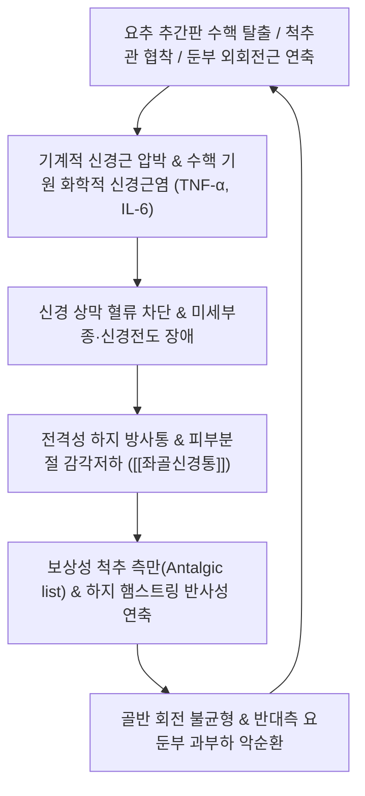

# 🩺 [[좌골신경통]] (Sciatica / 坐骨神經痛, M54.3 / M54.4)

> **핵심 3줄 요약 (Key Summary)**:
> - 📍 병소 부위 & 해부·병태생리: 인체 최대 신경인 [[좌골신경]](L4~S3 기원) 주행로를 따라 둔부, 대퇴 후면, 하퇴 외측/후면 및 족부로 방사되는 통증 증후군으로, 수핵 탈출에 의한 물리적 압박·화학적 신경근염([[요추 추간판 탈출증]]) 및 둔부 심부 연부조직 포착([[심부 둔부 증후군]], [[이상근 증후군]])이 핵심 기전.
> - 🚩 전형적 임상 양상 & 3대 징후: 요둔부에서 시작하여 무릎 아래 발끝까지 뻗치는 전격성 방사통(Shooting/Burning pain), 기침·재채기·배변 시 통증 악화(복압 상승 연관), 이환 피부분절의 감각 둔마 및 족하수(Foot drop) 등 족관절 근력 저하.
> - 🛠️ 핵심 감별 검사 & 한·양방 다각적 치료 전략: [[SLR test]](하지직거상 검사), [[Bragard test]](브라가드 검사), 건측 직거상 검사([[Well leg SLRT]]), [[FAIR 검사]](이상근 감별); 협척혈·[[환도]]·[[질변]] 전침 자극, 신경근 주위 소염 약침([[신바로약침]]), Cox 요추 신연 추나 및 기혈순환 한약([[독활기생탕]]).
> - ⚠️ 응급 의뢰 레드플래그 & 악화 요인: 안장 감각 마비(Saddle anesthesia), 급성 대소변 실금/잔뇨감(마미증후군 의심 즉시 전원), 족하수 급격한 진행, 무리한 요추 굴곡·회전 상태의 중량물 리프팅 절대 금기.

---

## 📌 목차
1. [질환 개요 & 해부학적 병태생리](#1-질환-개요--해부학적-병태생리)
2. [병태생리 메커니즘 & 생체역학적 악순환 네트워크](#2-병태생리-메커니즘--생체역학적-악순환-네트워크)
3. [임상 증상 & 이학적 검사(Physical Exam) 알고리즘](#3-임상-증상--이학적-검사physical-exam-알고리즘)
4. [감별 진단 매트릭스 (Differential Diagnosis)](#4-감별-진단-매트릭스-differential-diagnosis)
5. [한의 통합 치료 프로토콜 (침·약침·추나·한약)](#5-한의-통합-치료-프로토콜-침약침추나한약)
6. [양방 치료 & 병용·의뢰 기준 (Conventional Treatment & Referral)](#6-양방-치료--병용의뢰-기준-conventional-treatment--referral)
7. [재활 운동 & 생활습관 티칭 가이드](#6-재활-운동--생활습관-티칭-가이드)
8. [💡 사용자 진료실 핵심 필기 & 임상 노하우 (Melt-In 잔여 심화 집약)](#7--사용자-진료실-핵심-필기--임상-노하우-melt-in-잔여-심화-집약)
9. [출처 및 학술 참고 문헌 (References)](#8-출처-및-학술-참고-문헌-references)

---

## 1. 질환 개요 & 해부학적 병태생리

![[좌위라세그_좌골신경주행_병태해부도.jpg|450]]
> [그림 1: 좌골신경통(Sciatica)의 병태생리 메디컬 일러스트 — 요추 추간판 탈출 및 척추관 협착에 의한 신경근 압박과 하지 후면 전장으로 방사되는 신경병증성 통증 양상]

* **질환 정의 및 역학적 특성**:
  * [[좌골신경통]](Sciatica)은 단일 질환명이 아니라, 인체에서 가장 굵고 긴 신경 복합체인 [[좌골신경]](Sciatic nerve)의 주행 경로를 따라 둔부에서부터 대퇴 후면, 하퇴 외측·후면, 발가락 끝까지 뻗치는 방사통, 저림, 이상감각, 근력 저하를 포괄하는 **신경병증성 통증 증후군**입니다.
  * 평생 유병률이 10~40%에 달하며, 40~50대에서 호발합니다. 전체 좌골신경통의 약 85~90%는 요추 추간판의 퇴행성 탈출로 인한 척추성 병변(추간판성 좌골신경통)에 기인하며, 나머지 10~15%는 둔부 심부 공간의 연부조직 포착(비추간판성 좌골신경통)에서 비롯됩니다.
* **관련 해부학적 구조물**:
  * **신경 기원 및 주행 (Anatomical Course)**:
    * 기원: 제4·5 요추신경근(L4, L5)과 제1·2·3 천추신경근(S1, S2, S3)의 전지(Ventral rami)가 합쳐져 천골신경총(Sacral plexus)을 형성한 후 단일 신경 줄기로 시작.
    * 둔부 통과: 골반 내면에서 대좌골공(Greater sciatic foramen)을 통해 빠져나오며, 전형적으로 [[이상근]](Piriformis) 아래 공간인 **이상근하공**을 관통함.
    * 대퇴부 및 하지 분지: 좌골결절과 대전자 사이를 지나 대퇴 후면 심부를 주행한 뒤, 슬와(Popliteal fossa) 상부 5~10cm 지점에서 **[[경골신경]](Tibial nerve)**과 **[[총비골신경]](Common peroneal nerve)**으로 양분됨.
  * **주요 인접 골격 및 근육**:
    * 골격: 요추골(L4~L5), 천골, 좌골결절, 대퇴골 대전자.
    * 근육: 요부 척추기립근, [[이상근]], [[내폐쇄근]], [[쌍자근]], [[대퇴방형근]], [[대퇴이두근]], 반건양근, 반막양근, [[비복근]], 가자미근.

---

## 2. 병태생리 메커니즘 & 생체역학적 악순환 네트워크

![[좌골신경-대퇴후면-Gray832.png|350]]
> [그림 2: 좌골신경 전장 해부도(Gray's Anatomy Fig 832) — 대좌골공 기원부부터 둔부 외회전근군 하방 통과, 대퇴 후면 주행 및 슬와부 분지경로]

### 1) 2대 핵심 발병 메커니즘
1. **추간판성 좌골신경통 (Discogenic Sciatica - 85~90%)**:
   * **기계적 압박 (Mechanical Deformity)**: 탈출된 수핵이 신경근(Nerve root)을 직접 압박하여 신경 내 혈류 순환 장애와 축삭 전도 차단을 유발합니다.
   * **화학적 신경근염 (Chemical Radiculitis)**: 수핵 기질 내의 포스포리파아제 A2(PLA2), TNF-α, 인터루킨-6(IL-6) 등 염증성 사이토카인이 신경근 주위로 유출되어 극심한 무균성 염증과 신경막 감작을 유발합니다. 단순 기계적 압박보다 화학적 염증 반응이 통증의 강도와 신경인성 통증 양상을 결정짓는 핵심 인자입니다.
2. **비추간판성 좌골신경통 (Extraspinal / Deep Gluteal Sciatica - 10~15%)**:
   * 골반 외측 및 둔부 심부 공간에서 [[이상근]]의 비후·연축, [[내폐쇄근]]-쌍자근 복합체 유착, 좌골대퇴 간격 협소화(IFI), 천결절인대 낫돌기 석회화 등에 의해 좌골신경의 종적 슬라이딩(정상 15~28mm)이 제한되어 발생합니다.

### 2) 생체역학적 보상 연쇄와 회피 자세 (Antalgic Posture)
* **진통성 체간 편위 (Sciatic Scoliosis / Antalgic List)**:
  * 탈출된 수핵이 신경근의 **외측(Shoulder type)**에 위치할 경우: 환자는 신경근 압박을 줄이기 위해 병변 반대측으로 상체를 기울입니다.
  * 탈출된 수핵이 신경근의 **내측(Axilla type)**에 위치할 경우: 신경근을 수핵에서 떼어놓기 위해 오히려 병변측으로 상체를 기울이는 역설적 자세를 취합니다.
* **보행 파행 및 햄스트링 단축**: 좌골신경 긴장을 피하기 위해 슬관절을 약간 굽힌 채 걷는 굴곡 보행(Bent-knee gait)이 고착화되며, 이는 햄스트링과 비복근의 영구적 단축 및 골반 후방경사를 초래합니다.

---

## 3. 임상 증상 & 이학적 검사(Physical Exam) 알고리즘

### 1) 주소증 및 분절별 신경학적 소견
* **전형적 주소증**: 둔부에서 시작하여 허벅지 뒤쪽, 오금, 종아리 바깥쪽 또는 뒤쪽을 타고 발등·발바닥까지 찌르는 듯한 전격통, 화끈거림(Burning), 전기가 통하는 듯한 저림.
* **복압 상승 반응 (Cough/Valsalva Sign)**: 기침, 재채기, 힘주어 배변 시 척추강 내 뇌척수액 압력이 급상승하면서 신경근이 팽창하여 통증이 번개처럼 다리로 뻗침.

| 이환 신경근 | 주 방사통 부위 | 피부분절 감각 저하 (Dermatome) | 근육분절 근력 약화 (Myotome) | 심부건반사 (DTR) |
| :---: | :--- | :--- | :--- | :---: |
| **L4 신경근** | 대퇴 전외측 $\rightarrow$ 슬개골 내측 $\rightarrow$ 하퇴 내측 | 하퇴 내측면, 발목 안쪽 | 대퇴사두근(슬관절 신전), 전경골근(족배굴곡) | **슬개건 반사(PTR) 감약** |
| **L5 신경근** | 둔부 $\rightarrow$ 대퇴 후외측 $\rightarrow$ 하퇴 외측 $\rightarrow$ 발등 | 하퇴 외측면, 제1-2 족지 간 발등 | 장모지신근(엄지발가락 족배굴곡), 중둔근 | 건반사 변화 없음 |
| **S1 신경근** | 둔부 $\rightarrow$ 대퇴 후면 $\rightarrow$ 비복근 중앙 $\rightarrow$ 발뒤꿈치·발바닥 | 족부 외측연, 제5족지, 발바닥 | 비복근·가자미근(족저굴곡, 까치발 불가) | **아킬레스건 반사(ATR) 감약** |

### 2) 필수 이학적 검사법 (Physical Examination)

![[브라가드검사_족배굴곡_좌골신경추가신장_감별진단.jpg|450]]
> [그림 3: 브라가드 검사(Bragard's Test) 임상 실사 — 하지직거상 시 통증 발생 각도에서 5° 내린 후 족관절 족배굴곡을 가해 좌골신경을 선택적으로 신장시키는 감별 검사]

* **하지직거상 검사 ([[SLR test]])**:
  * 앙와위에서 슬관절을 편 채 다리를 천천히 거상.
  * **양성 기준**: 30°~70° 사이에서 단순 햄스트링 당김이 아닌, 환측 다리 전체로 찌릿한 방사통이 재현될 때 양성 (민감도 91%, 요추 디스크 진단 표준).
* **브라가드 검사 ([[Bragard test]])**:
  * SLRT 양성 각도에서 다리를 통증이 사라지는 지점까지 살짝(약 5°) 내린 후, 족관절을 강하게 **족배굴곡(Dorsiflexion)**시킴.
  * 족배굴곡만으로 좌골신경이 팽팽하게 당겨져 방사통이 즉각 재현되면 진성 좌골신경병증 확진 (단순 근육통 배제).
* **건측 하지직거상 검사 ([[Well leg SLRT]])**:
  * 아프지 않은 건강한 다리를 들어 올렸을 때, 반대편 병변측 다리로 극심한 방사통이 유발됨.
  * 민감도는 낮으나 **특이도가 90~97%**에 달해, 거대 수핵 탈출증(Large central or axillary herniation)을 강력히 시사.
* **보우스트링 검사 (Bowstring Sign / 슬와신경 압박 검사)**:
  * SLRT 양성 후 무릎을 20° 굴곡시켜 통증을 완화시킨 뒤 슬와 중심 좌골신경 분지부를 엄지로 강하게 압박하여 방사통 유발.
* **이상근 유발 검사 ([[FAIR 검사]])**:
  * 고관절 90° 굴곡, 내전, 내회전 강제 시 둔부 통증이 심해지고 요통이 없으면 [[심부 둔부 증후군]] 및 [[이상근 증후군]] 감별.

---

## 4. 감별 진단 매트릭스 (Differential Diagnosis)

| 감별 질환 | 호발 병소 및 병태 기전 | 주소증 차이점 | 특이적 검사 및 감별 포인트 |
| :--- | :--- | :--- | :--- |
| **[[좌골신경통]] (추간판성)** | L4/5, L5/S1 수핵 탈출 및 신경근 압박 | 요통 선행 후 무릎 아래 발끝까지 방사통, 복압 상승 시 악화 | [[SLR test]] 30~70° 양성, [[Bragard test]] 양성, 발살바 양성 |
| **[[심부 둔부 증후군]]** | 둔부 심부 공간 내 [[이상근]]·외회전근 유착 | 요통 없음/경미, 둔부 깊은 돌 박힌 느낌, 30분 이상 착석 불가 | [[FAIR 검사]] 양성, 좌골결절 외측 압통, SLRT 고각도 음성 |
| **[[척추관 협착증]]** | 황색인대 비후 및 중심 척추관 협착 | 양측성 둔부/다리 저림, 보행 시 다리 터질 듯 아파 쪼그려 앉음 | 신경인성 간헐적 파행(NC), 쇼버 검사 가동성 저하, 전굴 시 완화 |
| **[[천장관절 증후군]]** | 천장관절 인대 손상 및 회전 변위 | 엉치 골반 부위 편측 통증, 사타구니 통증, 무릎 아래 방사 드묾 | 패트릭 검사([[Patrick test]]) 양성, 갠슬렌 양성, 천장관절 압통 |
| **대퇴신경통 ([[요추 신경근병증]] L2~L4)** | L2~L4 신경근 탈출 및 대퇴신경 압박 | 대퇴 전면부 및 무릎 앞쪽 통증 (대퇴 후면 통증 없음) | 역 하지직거상 검사([[Reverse SLRT]]) 양성, 대퇴사두근 위약 |

---

## 5. 한의 통합 치료 프로토콜 (침·약침·추나·한약)

* **침구 치료 (Acupuncture & Electroacupuncture)**:
  * **주요 취혈점**:
    * 척추 신경근 분절: 요부 협척혈(L4, L5, S1), 신수, 대장수.
    * 둔부 및 하지 주행로: [[환도]], [[질변]], [[포황]], 승부, 은문, 위중, 양릉천, 곤륜, 현종.
  * **전침 요법 (Electroacupuncture)**:
    * 협척혈과 환도혈, 위중혈과 곤륜혈을 전극으로 연결하여 2Hz 저주파(엔도르핀 분비)와 100Hz 고주파(통각 관문 차단)를 교번하는 믹스 모드를 20분간 적용.
    * 수핵 주위 국소 미세혈관 순환을 촉진하고 통증 전달 물질(Substance P) 분비를 억제함. (Tu et al., 2024 *JAMA Intern Med* 입증)
* **약침 치료 (Pharmacopuncture)**:
  * **신바로약침 / 황련해독약침**:
    * 요추 신경근 분절(협척혈) 및 이상근 하공 포착 부위에 주입하여 화학적 신경근염(TNF-α, COX-2)을 억제하고 신경 주위 염증 부종을 빠르게 감압.
  * **자하거(인태반)약침 / 중성어혈약침**:
    * 만성 신경 손상으로 인한 축삭 변성 부위에 미세순환을 개선하고 신경 재생을 촉진.
* **추나 치료 (Chuna Manipulation)**:
  * **Cox 굴곡-신연 추나 (Flexion-Distraction Technique)**:
    * 특수 추나 테이블을 활용하여 요추 분절의 부드러운 율동적 굴곡 신연을 가함으로써 추간판 내 음압(Intradiscal negative pressure)을 형성, 탈출된 수핵의 재흡수를 유도하고 추간공 면적을 25% 확장.
  * **골반 변위 및 천장관절 교정 추나**:
    * 장골 전후방 회전 변위를 바로잡아 좌골신경이 주행하는 골반 출구의 생체역학적 비틀림을 제거.
  * **금기 수기**: 신경근 급성 염증기에는 무리한 회전 고속저진폭(HVLA) 쓰러스트 교정을 절대 금함.
* **한약 치료 (Herbal Medicine)**:
  * **급성 염증 및 어혈 정체기**: [[오적산]], 대강활탕, 서경탕 — 활혈화어(活血化瘀) 및 통락지통(通絡止痛).
  * **만성 허혈 및 기혈 허손기**: [[독활기생탕]], 삼기음, 보양환오탕 — 보간신(補肝腎), 강근골(强筋骨), 미세신경 영양 공급.

---

## 6. 양방 치료 & 병용·의뢰 기준 (Conventional Treatment & Referral)

> 🎯 **이 섹션의 목적**: 환자가 **양방약을 이미 복용 중인 경우가 많다.** 한의원 1차 진료에서 양방 치료를 이해하고, 병용 가능·주의·금기를 판단하며, 언제 의뢰할지 결정한다.

* **약물 치료 (Medication)**:
  * 계열별 약물·용량·기간 — 국내 처방 관행 반영.
  * 작용 기전과 한의 치료와의 상호작용.
* **비약물 시술 (Procedures)**:
  * 주사·차단술·물리치료·보조기 등.
* **수술·시술 적응증 (Surgical Indication)**:
  * 언제 수술로 가는가 — 절대·상대 적응증, 수술 후 경과.
* **한의 병용 판단 (Combination Therapy)**:
  * 병용 가능 / 주의 / 금기. 복용 중 환자의 감량 타이밍·반동 현상.
* **양방·전문과 의뢰 기준 (Referral Criteria)**:
  * 응급 의뢰 트리거와 전문과 의뢰 기준(정형외과·신경외과·내과 등).

	(작성 필요)

---

## 7. 재활 운동 & 생활습관 티칭 가이드

* **맥켄지 신전 운동 (McKenzie Extension Exercise)**:
  * 복와위(엎드린 자세)에서 팔꿈치로 상체를 가볍게 지지하는 신전 자세부터 시작하여, 통증이 중심화(Centralization: 다리 저림이 줄고 허리 쪽으로 통증이 모이는 현상)되는지 확인하며 점진적 신전 시행.
  * **주의**: 신전 시 다리 저림이 발끝으로 더 뻗치는 말초화(Peripheralization)가 발생하면 즉시 중단.
* **신경 슬라이딩 활주 운동 (Sciatic Nerve Gliding / Flossing)**:
  * 의자에 걸터앉아 고개를 뒤로 젖히며 무릎을 펴고 발목을 내리는 동작과, 고개를 숙이며 무릎을 굽히고 발목을 당기는 동작을 교대로 리듬감 있게 수행 (10회 3세트).
  * 신경 주위 유착을 방지하고 신경 내 축삭 유동성을 회복.
* **일상생활 자세 티칭 (Ergonomics)**:
  * **물건 들기 원칙**: 허리를 숙이지 말고 무릎을 굽혀 물건을 몸에 밀착시킨 후 하지 근력으로 기립.
  * **수면 체위**: 옆으로 누울 때는 양 무릎 사이에 베개를 끼워 골반 비틀림을 방지하고, 똑바로 누울 때는 무릎 아래에 베개를 받쳐 요추 전만을 보호.
  * **착석 자세**: 엉덩이를 의자 깊숙이 밀착하고 요추 지지대(Lumbar roll)를 사용하며, 45분 이상 연속 착석 금지.

---

## 8. 💡 사용자 진료실 핵심 필기 & 임상 노하우 (Melt-In 잔여 심화 집약)

> [!IMPORTANT]
> **🛡️ 원장님 실전 감별 직관 팁 (추간판성 vs 비추간판성)**
> - 진료실 문을 열고 들어오는 환자가 허리를 비스듬히 틀고(Antalgic list) 절뚝거리며 들어오면 추간판 탈출성 좌골신경통을, 걸을 때는 비교적 괜찮은데 의자에 앉자마자 "엉덩이가 배겨서 못 앉겠다"며 엉덩이를 한쪽으로 들면 심부 둔부 증후군(비추간판성)을 즉각 직관하십시오.
> - SLRT 각도가 30~50도에서 딱 걸리면서 다리로 전기가 번쩍 튀면 추간판 탈출증이 거의 확실하며, 이때 건측 SLRT에서 환측 방사통이 재현된다면 거대 탈출증(수술 고려군)일 가능성이 매우 높습니다.

* **실전 문진 체크리스트**:
  1. "다리 저린 통증이 무릎 아래 발목이나 발가락까지 내려가나요?" (무릎 이하 방사 여부가 진성 신경근병증의 핵심)
  2. "기침이나 재채기를 세게 할 때 다리 쪽으로 찌릿하고 울리나요?" (추간판 내압 상승성 방사통 확인)
  3. "발목을 들어 올리는 힘이 빠지거나 슬리퍼가 벗겨진 적이 있나요?" (L5/S1 운동신경 마비 즉각 확인)
  4. "엉덩이나 사타구니 안쪽 감각이 둔하거나 대소변 보기가 힘드신가요?" (마미증후군 응급 스크리닝)
* **치료 손맛 노하우 (협척혈 및 환도 자침 팁)**:
  * **협척혈 심도 조절**: 극돌기 외측 0.5촌 지점에서 척추궁판(Lamina)을 목표로 직자하여 뼈에 가볍게 닿은 후 1~2mm 후퇴하여 전침을 걸어야 척추 다열근 심부와 후지 내측지에 정확한 전류가 전달됩니다.
  * **환도혈 득기 반응**: 좌골신경 줄기를 목표로 75mm 이상 깊게 자입할 때, 환자가 "종아리나 발끝까지 전기가 찌릿!" 하는 방사감각(득기)을 느낄 때 신경 주위 유착 부위에 도달한 것이며, 이때 전침 세팅 시 다리가 덜컹거리는 강력한 운동 연축(Motor twitch)을 확인해야 치료율이 비약적으로 상승합니다.
* **환자 안심 설명 스크립트**:
  * *"환자분, 지금 다리가 저리고 쑤시는 것은 다리 자체에 병이 난 것이 아니라, 허리에서 다리로 내려가는 큰 신경 고속도로가 입구에서 눌리고 염증이 생겼기 때문입니다. 신경 주위의 붓기와 염증을 가라앉히는 침과 약침 치료를 병행하면 튀어나온 수핵도 서서히 수분을 잃고 가라앉으니 너무 걱정하지 마시고, 당분간은 허리를 굽히는 자세만 철저히 피해 주세요."*

---

## 9. 출처 및 학술 참고 문헌 (References)

1. **Tu, J. F., Shi, G. X., Yan, S. Y., et al. (2024)**. Acupuncture vs Sham Acupuncture for Chronic Sciatica From Herniated Disk: A Randomized Clinical Trial. *JAMA Internal Medicine*, 184(12), 1435-1444.
   - [PubMed: PMID 39401008](https://pubmed.ncbi.nlm.nih.gov/39401008/) | DOI: 10.1001/jamainternmed.2024.5463
   - **[연구 요약]**: 요추 추간판 탈출증 기원 만성 좌골신경통 환자 216명을 대상으로 한 다기관 무작위 대조 임상시험(RCT)에서 진짜 침 치료군이 거짓 침(Sham)군 대비 4주 후 VAS 통증 점수(-30.8mm vs -14.9mm) 및 오스웨스트리 장애 지수(ODI)를 유의미하고 장기적으로 개선함을 최고 권위 저널에서 확증.

2. **Ropper, A. H., & Zafonte, R. D. (2015)**. Sciatica. *New England Journal of Medicine*, 372(13), 1240-1248.
   - [PubMed: PMID 25806916](https://pubmed.ncbi.nlm.nih.gov/25806916/) | DOI: 10.1056/NEJMcp1404036
   - **[연구 요약]**: 좌골신경통의 신경해부학적 기전, 수핵 탈출에 의한 물리적 압박 및 화학적 신경근염 병태생리, 이학적 검사 진단 알고리즘과 수술 vs 보존 치료의 장단기 예후를 체계적으로 정리한 NEJM 대표 임상 총설.

3. **Koes, B. W., van Tulder, M. W., & Peul, W. C. (2007)**. Diagnosis and treatment of sciatica. *BMJ*, 334(7607), 1313-1317.
   - [PubMed: PMID 17585160](https://pubmed.ncbi.nlm.nih.gov/17585160/) | DOI: 10.1136/bmj.39223.428495.BE
   - **[연구 요약]**: 1차 외래 진료에서 좌골신경통의 병력 청취, 마미증후군 및 감염/종양 배제를 위한 레드플래그 선별 기준, 비수술적 보존 치료 경로 및 침습적 치료 적응증을 명확히 제시한 BMJ 진료 가이드라인.
