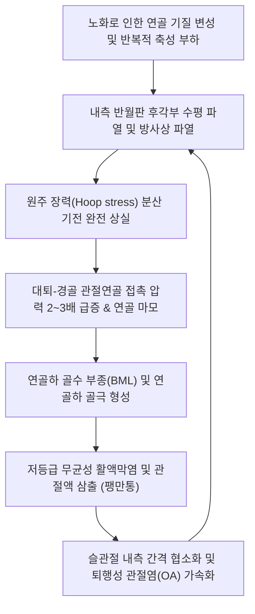

# 🩺 퇴행성 반월상연골 손상 (Degenerative Meniscal Tear)

> **핵심 3줄 요약 (Key Summary)**:
> - 📍 **병소 부위 & 해부·병태생리**: 40~50대 이상 중장년층에서 명확한 급성 외상 없이 반복적인 체중 부하와 노화로 인해 발생하는 반월상연골(특히 내측 반월판 후각부)의 점진적 마모·분열. 전형적인 **수평 분열 파열(Horizontal cleavage tear)** 및 **복합 파열(Complex tear)** 형태로 나타나며, 조기 [[퇴행성 관절염]](Knee OA)의 병리적 일환.
> - 🚩 **전형적 임상 양상**: 쪼그려 앉거나 방향 전환 시 발생하는 내측 또는 외측 관절열의 둔통, 경미한 관절 삼출액(Effusion), 계단 보행 시 불안정감. 외상성 파열과 달리 급성 기계적 락킹(Locking)은 드묾.
> - 🛠️ **핵심 검사 & 치료 전략**: ESSKA 및 NEJM 최신 임상 가이드라인상 **관절경하 부분 절제술(APM)은 위약 수술 및 보존적 운동 치료 대비 우월성이 없음**. 한의 침·약침(신바로·자하거), 관절가동 추나, 대퇴사두근/둔근 강화가 제1선 표준 치료(First-line standard).
> - ⚠️ **응급 의뢰 레드플래그**: 지속적이고 완전한 신전 차단 진성 락킹(True mechanical locking - 양동이 손잡이형 파열 감입), 급속히 악화되는 하지 정렬 이상(외반/내반 급격 변형), 거위발건 점액낭염 및 피로골절 동반 극심통.

---

## 📌 목차
1. [질환 개요 & 해부학적 병태생리](#1-질환-개요--해부학적-병태생리)
2. [병태생리 메커니즘 & 생체역학적 악순환 네트워크](#2-병태생리-메커니즘--생체역학적-악순환-네트워크)
3. [임상 증상 & 이학적 검사(Physical Exam) 알고리즘](#3-임상-증상--이학적-검사physical-exam-알고리즘)
4. [감별 진단 매트릭스 (Differential Diagnosis)](#4-감별-진단-매트릭스-differential-diagnosis)
5. [한의 통합 치료 프로토콜 (침·약침·추나·한약)](#5-한의-통합-치료-프로토콜-침약침추나한약)
6. [양방 치료 & 병용·의뢰 기준 (Conventional Treatment & Referral)](#6-양방-치료--병용의뢰-기준-conventional-treatment--referral)
7. [재활 운동 & 생활습관 티칭 가이드](#7-재활-운동--생활습관-티칭-가이드)
8. [💡 사용자 진료실 핵심 필기 & 임상 노하우 (Melt-In 잔여 심화 집약)](#8--사용자-진료실-핵심-필기--임상-노하우-melt-in-잔여-심화-집약)
9. [출처 및 학술 참고 문헌 (References)](#9-출처-및-학술-참고-문헌--references)

---

## 1. 질환 개요 & 해부학적 병태생리

**퇴행성 반월상연골 손상(Degenerative Meniscal Tear)**은 젊은 층에서 호발하는 고에너지 외상성 파열과 달리, **40세 이상 중장년 및 고령층**에서 반월상연골의 세포성 탈수, 교원질 기질의 퇴행성 변성 및 미세 외상의 누적에 의해 점진적으로 발생하는 질환이다.

![[Meniscus_tear_types.svg]]
> [그림 1: ① 병태해부 — 퇴행성 손상에서 호발하는 수평 파열(Horizontal tear) 및 복합 파열 형태 도해 — ⚠️ 원본 출처 미확인 (2026-10-07 재조달 대상)]

![[반월상 연골판 손상_01.jpg|540]]
> [그림 1-B: ① 해부 — 무릎 관절의 내측·외측 반월연골판 위치 — 출처: 질병관리청 국가건강정보포털 「반월상 연골판 손상」]

반월상연골은 대퇴과와 경골 고평부 사이에서 축성 압박 부하를 원주 장력(Hoop stress)으로 분산시키는 핵심 충격 흡수체이다. 그러나 연령 증가에 따라 프로테오글리칸과 수분 함량이 감소하고 2형 콜라겐 섬유의 가교 결합이 약화되면, 일상적인 보행이나 쪼그려 앉기 같은 저에너지 부하에서도 연골 실질 내부가 층상으로 갈라지는 **수평 분열 파열(Horizontal cleavage tear)** 또는 불규칙하게 찢어지는 **복합 파열(Complex tear)**이 유발된다.

![[Tear_of_medial_meniscus.jpg|540]]
> [그림 2: ① 수술 소견 — 관절경에서 본 내측 반월상연골 파열 소견 — ⚠️ 원본 출처 미확인 (2026-10-07 재조달 대상)]

- **호발 부위**: 체중 부하의 60~70%가 집중되는 **내측 반월판 후각부(Posterior horn of medial meniscus)**에서 80% 이상 발생.
- **역학적 특성**: 50세 이상 인구의 무증상 MRI 검진 시 30~50%에서 퇴행성 파열 소견이 우연히 발견될 정도로 흔하며, 슬관절 골관절염의 전구 단계 또는 동반 병변으로 인식된다.

---

## 2. 병태생리 메커니즘 & 생체역학적 악순환 네트워크

### 후각부 파열과 원주 장력(Hoop Stress) 상실
반월판이 수평 또는 방사성으로 파열되면 대퇴골의 하중을 바깥쪽으로 분산시켜 주던 '원주 장력 링'이 파탄된다. 이로 인해 관절 연골에 가해지는 접촉 스트레스가 정상 대비 2~3배 이상 급증하며, 반월판이 관절 밖으로 밀려나는 **반월상연골 탈출(Meniscal extrusion > 3mm)**이 발생한다.

![[반월상 연골판 손상_03.jpg|540]]
> [그림 3: ① 영상 — 내측 반월연골판 파열의 자기공명영상(MRI) 소견 — 출처: 질병관리청 국가건강정보포털 「반월상 연골판 손상」]

> ⚠️ **이미지 미확보 (2026-10-07)** — 출처·해상도 조건을 만족하는 원본을 확인하지 못해 슬롯을 비웁니다.

연골하 골판에 과도한 압력이 집중되면 연골하 골수 부종(Bone marrow lesion, BML)과 미세 골절이 유발되며, 활액막으로 연골 파편이 탈락되면서 저등급 만성 활액막염이 촉발되어 통증을 영속화한다.

---

## 3. 임상 증상 & 이학적 검사(Physical Exam) 알고리즘

### 임상 증상
- **내측 관절열 둔통**: 보행 시, 계단을 오르내릴 때, 또는 의자에서 일어날 때 무릎 안쪽 관절선이 쑤시고 뻐근함.
- **야간통 및 시동통**: 아침에 첫 발을 디딜 때 뻣뻣하다가 움직이면 조금 부드러워지나, 무리하면 저녁에 다시 욱신거림.
- **걸림(Catching) 및 덜컥거림**: 완전 신전이 안 되는 진성 락킹은 드물지만, 계단을 내려갈 때 무릎 속에서 연골편이 슬쩍 걸리는 느낌(Mild catching) 호소.

### 이학적 검사 알고리즘

![[맥머레이검사_1단계_최대굴곡_관절선촉진_실사.jpg]]
> [그림 5: ② 이학적 검사 — 관절선 압통 및 반월상연골의 퇴행성 마찰을 촉진하는 맥머레이 검사 1단계 실사 — ⚠️ 원본 출처 미확인 (2026-10-07 재조달 대상)]

![[맥머레이검사_2단계_회전및스트레스_신전유발_실사.jpg]]
> [그림 6: ② 이학적 검사 — 회전 스트레스 부하 시 관절선의 통증 유발을 평가하는 맥머레이 검사 2단계 실사 — ⚠️ 원본 출처 미확인 (2026-10-07 재조달 대상)]

1. **관절선 압통 (Joint Line Tenderness)**:
   - 무릎을 90도 굴곡한 상태에서 내측 관절열(MCL 전후방)을 정밀 촉진할 때 명확한 국소 압통 확인 (진단 민감도 80% 내외).
2. **[[맥머레이 검사]](McMurray Test)**:
   - 슬관절 최대 굴곡 상태에서 경골 외회전-외반력을 주며 신전시킬 때 내측 관절선에서 통증이나 덜컥거림 유발. (퇴행성 파열에서는 탄발음보다 관절선 통증 호소가 주됨).
3. **테살리 검사 (Thessaly Test)**:
   - 환자가 한 발로 서서 무릎을 20도 구부린 채 체간을 좌우로 3회 회전할 때 관절선 통증 유발 시 양성 (동적 임상 진단율 우수).

---

## 4. 감별 진단 매트릭스 (Differential Diagnosis)

![[퇴행성관절염_슬관절_KL등급_2기_및_3기_Xray.jpg]]
> [그림 7: ① 영상 감별 — 퇴행성 반월상연골 파열과 동반된 내측 관절강 협소화 KL 2~3기 슬관절 X-ray — ⚠️ 원본 출처 미확인 (2026-10-07 재조달 대상)]

| 감별 질환 | 호발 연령 및 기전 | 주 통증 양상 및 부위 | X-ray 소견 | MRI 핵심 소견 |
| :--- | :--- | :--- | :--- | :--- |
| **[[퇴행성 반월상연골 손상]]** | 40대 이상 중장년, 비외상성 | 내측 관절열 둔통, 부하 시 악화 | 초기 정상 또는 경미한 협소화 | **수평 파열(Horizontal tear)**, 연골 탈출 |
| **급성 외상성 [[반월상연골 파열]]** | 10~30대 운동선수, 회전 손상 | 급성 혈관절증, 완전 신전 불능 | 골절 없으면 정상 | **종파열(양동이 손잡이형)**, 전위된 파열편 |
| **[[퇴행성 슬관절염]](KL 3~4기)** | 60대 이상 노년층 | 전반적 관절통, O다리 변형, 골극 | 현저한 관절강 소실, 거대 골극 | 전층 관절연골 결손, 연골하 경화 |
| **[[거위발건염]](Pes Anserinus Tendinitis)** | 과체중 중년 여성 호발 | 경골 내측 근위부(관절선 4~5cm 하방) | 정상 | 거위발건 점액낭 삼출액, 반월판 정상 |
| **대퇴골 내과 무혈성 괴사(SPONK)** | 60대 이상 여성 급성 통증 | 극심한 야간통, 체중 부하 불가 | 초기 정상 $\rightarrow$ 후기 연골하 함몰 | 대퇴 내과 연골하 광범위 골수 부종 |

---

## 5. 한의 통합 치료 프로토콜 (침·약침·추나·한약)

![[무릎염좌_05_술기실사_측부인대_자침치료.jpg|540]]
> [그림 8: ③ 한의 시술 — 무릎 주변 경혈 자침(침치료) 실사 — ⚠️ 원본 출처 미확인 (2026-10-07 재조달 대상)]

### 침구 치료: 활액막 감압 및 국소 순환 촉진
- **주요 혈위**: [[독비]](ST35), [[내슬안]](EX-LE4), [[음릉천]](SP9), [[양릉천]](GB34), [[혈해]](SP10), [[위중]](BL40).
- **자침 기법**: 내슬안과 음릉천을 통해 내측 관절낭 주변으로 사자하여 정체된 미세 활액막 울혈을 해소하고, 2Hz 전침을 15분간 적용하여 통증 역치를 상승시킴.

### 약침 치료 (Pharmacopuncture)
- **신바로 약침 및 자하거 약침**:
  - 내측 관절열 압통부 및 반월상연골 주변 관절낭에 0.5~1.0ml 주입.
  - 연골 기질 분해 효소(MMP-1, MMP-3, ADAMTS)를 억제하고 관절액 내 염증성 사이토카인을 감소시켜 관절염 진행을 늦춤.
- **황련해독탕 약침**: 관절 삼출액이 동반된 아급성 활액막염기에 시술.

### 추나 의학 및 관절가동 (Chuna)
- **경골 내외측 활주 및 견인 기법**: 무릎 굴곡위에서 경골에 부드러운 종축 견인(Longitudinal traction)을 가하여 내측 대퇴-경골 관절면의 압박을 경감.
- **대퇴사두근 및 비복근 근막 이완(MET)**: 슬관절에 과도한 압축력을 가하는 단축된 대퇴직근과 비복근을 이완.

### 한약 치료 (Herbal Medicine)
- **간신부족 및 기혈어체형**: **[[독활기생탕]]**, **[[대방풍탕]]** 가감. 연골 조직의 퇴행화를 완화하고 결합조직 강도를 보강.
- **습열하주 및 관절 종창기**: **사묘환(四妙丸)** 합 **오령산(五苓散)**. 관절 내 부종과 열감을 소퇴.

---

## 6. 양방 치료 & 병용·의뢰 기준 (Conventional Treatment & Referral)

### 양방 치료 가이드라인 (ESSKA & AAOS 합의)
- **보존적 치료 최우선 원칙**:
  - **관절경하 반월상연골 부분 절제술(APM)은 퇴행성 파열 환자에서 운동 치료나 위약 수술 대비 통증 개선 및 기능 회복에서 장기적 우월성이 없음이 입증됨(NEJM, FIDELITY trial)**.
  - 오히려 불필요한 연골 절제는 관절 접촉면적을 줄여 골관절염 진행을 가속화하므로, 최소 3~6개월 이상의 보존적 치료를 선행하는 것이 국제 표준임.
- **수술적 치료 적응증 (제한적)**:
  - 도수 정복이 되지 않는 완전 진성 락킹(True mechanical locking).
  - 6개월 이상의 적극적 보존적 치료에도 일상생활이 불가능할 정도의 심한 통증이 지속되는 경우에 한해 관절경 부분 절제술 고려.

### 한의 병용 및 의뢰 기준
- **병용 요법**: 양방 히알루론산(연골주사) 투여 환자에서 한의 침·약침 및 추나 치료를 병용할 경우 관절 윤활과 염증 제어의 시너지 효과가 매우 우수함.
- **응급 의뢰 트리거 (Red Flags)**:
  1. 기계적 원인에 의한 지속적 무릎 신전 차단 (진성 락킹).
  2. 세균성 화농성 관절염 의심 (국소 고열, 발적, 전신 오한).
  3. X-ray상 급격한 관절강 붕괴 또는 대퇴골두 무혈성 괴사(SPONK) 소견.

---

## 7. 재활 운동 & 생활습관 티칭 가이드

1. **대퇴사두근 및 둔근 비체중 부하 강화**:
   - SLR(하지 직거상 운동), 브릿지(Bridge), 실내 고정식 자전거 타기 (체중 부하 없이 무릎 윤활액 순환 유도).
2. **쪼그려 앉기 및 양반다리 금지**:
   - 무릎을 90도 이상 깊게 구부리는 자세는 내측 반월판 후각부에 체중의 5~7배에 달하는 전단 압력을 가하므로 입식 생활로 환경 개선.
3. **체중 감량 교육**:
   - 체중 1kg 감량 시 보행 시 무릎에 가해지는 하중이 약 4kg 감소하므로 식이 조절 병행.

---

## 8. 💡 사용자 진료실 핵심 필기 & 임상 노하우 (Melt-In 잔여 심화 집약)

- **"수술해야 하나요?"라는 환자 질문에 대한 명쾌한 답변**: 퇴행성 반월상연골 파열 환자가 MRI를 들고 와서 수술해야 하냐고 물으면, 세계 최고의 의학 저널(NEJM) 연구 결과를 설명해 주어야 한다. "연골을 잘라내는 수술을 한 환자와, 수술 안 하고 한의 치료와 운동을 한 환자를 5년 뒤 비교했을 때 결과가 똑같거나 오히려 수술 안 한 쪽의 관절염이 덜 진행했습니다. 덜컥 걸려서 다리가 안 펴지는 락킹 증상이 없다면 보존 치료가 정답입니다."
- **거위발건염과 헷갈리지 마라**: 내측 관절선 바로 4cm 아래 경골 내측면에 통증이 국한된다면 연골 파열이 아니라 거위발건염이다. 이 부위는 신바로 약침 0.5cc 자입으로 2~3회 만에 드라마틱하게 호전된다.
- **내측 반월판 후각부 약침 자입 테크닉**: 무릎을 90도 굽힌 상태에서 내측 관절열을 따라 손가락으로 누르며 대퇴골 내과와 경골 고평부 사이 틈을 확인한 뒤, 관절낭 방향으로 비스듬히 1.0치 자입하여 신바로 약침을 주입하면 관절강 압박통이 빠르게 소퇴된다.

---

## 9. 출처 및 학술 참고 문헌 (References)

1. Tsai L, et al. (2025). Potential sources of pain in symptomatic degenerative meniscal tear: A narrative review. *J Orthop Res*, 43(9):1642-1652. [PMID 40487806](https://pubmed.ncbi.nlm.nih.gov/40487806/)

2. He J, et al. (2025). Telerehabilitation versus face-to-face physical therapy for middle-aged patients with degenerative meniscal tear in China: a non-inferiority randomized controlled trial. *Trials*, 26(1):325. [PMID 40842229](https://pubmed.ncbi.nlm.nih.gov/40842229/)

3. Jin YJ, et al. (2026). Development of an impingement induced, reversible degenerative meniscus tear animal model to analyze pathogenesis and potential recovery from meniscus degeneration. *Osteoarthritis Cartilage*, 34(11):1520-1531. [PMID 42462806](https://pubmed.ncbi.nlm.nih.gov/42462806/)

---

## 관련 노트
- [[반월상연골 파열]]
- [[무릎 락킹 증후군]]
- [[퇴행성 슬관절염]]
- [[거위발건염]]
- [[독활기생탕]]
- [[대방풍탕]]
- [[독비]]
- [[내슬안]]
