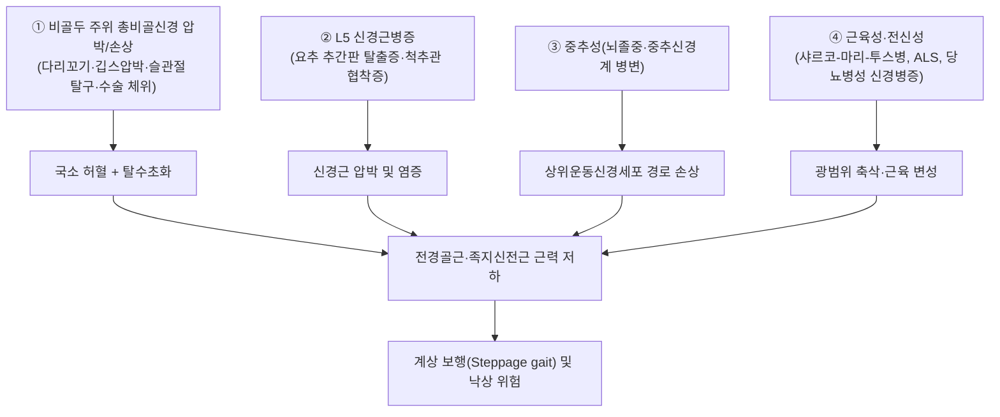

# 🩺 [[풋 드롭]] (Foot Drop / 足下垂, ICD-10-CM M21.37 Foot drop acquired · G57.3 비골신경 병변 시)

> **핵심 3줄 요약 (Key Summary)**:
> - 📍 병소 부위 & 해부·병태생리: 발목·발가락 배굴근([[전경골근]], 장·단지신근)의 근력 저하로 발끝이 들리지 않는 **증상(sign)**. 병소는 다양하지만 가장 흔한 두 축은 ① 비골두 주위 [[총비골신경]] 압박/손상, ② L5 신경근병증([[요추 추간판 탈출증]] 등)이다. 드물게 뇌졸중·대뇌 병변에 의한 중추성 풋 드롭도 있다.
> - 🚩 전형적 임상 양상 & 3대 징후: ① 발을 질질 끌거나 무릎을 과도하게 들어 올리는 **계상 보행(Steppage gait)**, ② 발등·하퇴 외측 감각 저하(비골신경 분포), ③ 발목 족배굴곡(배굴) 근력 3등급 이하 저하. 병소에 따라 내반(inversion) 근력 보존 여부가 핵심 감별점.
> - 🛠️ 핵심 감별 검사 & 한·양방 다각적 치료 전략: [[전경골근]] 족배굴곡 근력검사 + 발 내반(후경골근) 근력검사로 L5 신경근병증(내반도 약함) vs 비골신경 단독병변(내반 보존) 감별. EMG/NCS로 병소 국소화, 척추 MRI로 신경근 압박 확인. 한의: 전침(양릉천-족삼리-해계)으로 전경골근 재활, 급성 압박 요인 제거.
> - ⚠️ 응급 의뢰 레드플래그 & 악화 요인: 양측성 급성 풋 드롭 + 안장 감각 저하 + 대소변 장애 = 마미증후군(응급 수술 대상), 급속 진행성 편측 풋 드롭(수 시간~수일), 외상 후 급성 발생(비골신경 완전 절단/슬관절 탈구 동반 가능) — 모두 즉시 영상·전문과 의뢰. 다리 꼬기·장시간 무릎 꿇기 등 비골두 압박 자세는 악화 요인.

---

## 📌 목차
1. [질환 개요 & 해부학적 병태생리](#1-질환-개요--해부학적-병태생리)
2. [병인별 분류 및 발생 기전](#2-병인별-분류-및-발생-기전)
3. [임상 증상 & 이학적 검사 알고리즘](#3-임상-증상--이학적-검사-알고리즘)
4. [감별 진단 매트릭스](#4-감별-진단-매트릭스)
5. [한의 통합 치료 프로토콜](#5-한의-통합-치료-프로토콜)
6. [양방 치료 & 병용·의뢰 기준](#6-양방-치료--병용의뢰-기준)
7. [재활 운동 & 생활습관 티칭 가이드](#7-재활-운동--생활습관-티칭-가이드)
8. [출처 및 학술 참고 문헌](#8-출처-및-학술-참고-문헌)

---

## 1. 질환 개요 & 해부학적 병태생리

> 🖼️ **이미지 미확보**: 환부 실사·영상 소견·해부 도해 등 6~8장 모두 미확보(세션 내 이미지 소싱 제약) — 작업기록에 기재.

* **정의**: 풋 드롭(족하수)은 독립된 질환명이 아니라, 발목·발가락 배굴근의 근력 저하로 **보행 시 발끝이 지면에 끌리거나 떨어지는 임상 증상(sign)** 을 가리키는 용어다. 원인 병소에 따라 중추성(대뇌·척수)·근위 신경근성(L5)·말초 신경성(비골신경)·근육성으로 나뉜다.
* **관련 해부학적 구조물**:
  * **근육**: [[전경골근]](주 배굴근), 장지신근, 장무지신근(심비골신경 지배).
  * **신경**: [[총비골신경]](Common peroneal nerve) → 심비골신경(전경골근·족지신전근) / 천비골신경(비골근·발등 감각) 분지. 비골두(Fibular head) 주위가 가장 압박에 취약한 해부학적 호발 구역.
  * **신경근**: L4-L5-S1 신경근, 특히 **L5 신경근**이 전경골근·장무지신근의 주된 지배 분절.
* **호발 기전**: 비골두 부위 신경은 피하 지방이 적고 뼈에 바로 밀착되어 있어 외부 압박(다리 꼬기, 장시간 무릎 꿇기, 깁스·장화 압박, 체중 급감 후 지방 패드 소실)에 특히 취약하다.

---

## 2. 병인별 분류 및 발생 기전

### 1) 말초성 — 총비골신경 단독 병변 (가장 빈도 높은 축 중 하나)
* 비골두 부위 압박성 신경병증이 가장 흔한 원인으로 거론되며, 급성 체중 감소·장기 와상·다리 꼬기·슬관절 수술 체위 등에서 발생한다. **내반(inversion, 후경골근 지배는 경골신경)이 보존**되는 것이 L5 신경근병증과의 핵심 감별점이다.
* 슬관절 탈구·비골두 골절 등 외상에서는 총비골신경 견인·좌상이 동반될 수 있다([[무릎 탈구]] 참조).

### 2) 신경근성 — L5 신경근병증
* [[요추 추간판 탈출증]](L4-L5 디스크 호발), [[척추관 협착증]], 요추 불안정증 등에서 L5 신경근이 압박되면 전경골근뿐 아니라 **고관절 외전근(중둔근)·내반근까지 약화**되어 트렌델렌버그 보행이 동반될 수 있다.

### 3) 중추성
* 뇌졸중, 대뇌 겸상부 수막종 등 드문 원인에서도 편측 풋 드롭이 단독 증상으로 나타날 수 있어, 말초성 소견(감각분절·반사)이 설명되지 않는 경우 중추성 병변을 감별해야 한다.

### 4) 전신성·유전성
* 당뇨병성 신경병증, 샤르코-마리-투스병(CMT), 길랭-바레 증후군, 근위축성 측삭경화증(ALS) 등에서 양측성 또는 서서히 진행하는 풋 드롭이 나타날 수 있다.

---

## 3. 임상 증상 & 이학적 검사(Physical Exam) 알고리즘

### 1) 주소증 및 신경학적 증상
* **운동 장애**: 발목·발가락 배굴 근력 저하(0~3등급), 계상 보행(Steppage gait), 발끝 걸림으로 인한 낙상.
* **감각 이상**: 비골신경 단독 병변 시 하퇴 외측~발등 감각 저하. L5 신경근병증 시 하퇴 외측~엄지발가락(1지) 감각 저하가 더 뚜렷.
* **반사**: 아킬레스건 반사는 대개 보존(S1 지배) — 반사 소실 시 S1 병변 동반 또는 다른 원인 고려.

### 2) 핵심 이학적 검사 — 병소 국소화
* **전경골근 족배굴곡 근력검사**: 앙와위에서 발목을 배굴시키며 저항 가함. 약화 시 L5 또는 비골신경 병변을 시사.
* **후경골근 내반(inversion) 근력검사**: 경골신경 지배이므로, **내반이 보존되면서 배굴만 약하면 총비골신경 단독 병변**, **내반도 함께 약하면 L5 신경근병증**을 더 시사한다(핵심 감별점).
* **비골두 Tinel 징후**: 비골두 직하방 타진 시 저림 방사 — 국소 압박성 병변 시사.
* **직거상검사(SLR)**: L5 신경근병증 동반 시 양성일 수 있음([[좌골신경통]] 참조).

---

## 4. 감별 진단 매트릭스 (Differential Diagnosis)

| 감별 질환/병소 | 호발 병소 및 원인 | 주소증 차이점 | 특이적 이학적 검사 소견 |
| :--- | :--- | :--- | :--- |
| **총비골신경 단독 병변** (본 증상 호발 축) | 비골두 압박(다리꼬기·외상) | 내반 보존, 배굴만 약화 | 비골두 Tinel 양성, 내반근 정상 |
| [[요추 추간판 탈출증]]/L5 신경근병증 | L4-L5 디스크 탈출 | 내반도 약화, 둔부~하지 방사통 동반 | SLR 양성, 중둔근 약화 |
| [[신경인성 파행]]/척추관 협착증 | 척추관 협착 | 보행 시 악화, 휴식/굴곡 시 완화 | 신전 시 증상 악화, 자전거 검사 양성 |
| 당뇨병성 신경병증([[당뇨병성 신경병증]]) | 광범위 축삭변성 | 양측성, 서서히 진행, 장갑-양말형 감각저하 | 진동감각 저하, 아킬레스건 반사 소실 |
| 중추성(뇌졸중 등) | 대뇌·척수 상위운동신경세포 | 경직 동반 가능, 상지 동반 침범 가능 | 바빈스키 징후 양성, 반사 항진 |

---

## 5. 한의 통합 치료 프로토콜 (침·약침·추나·한약)

* **침구 치료 (Acupuncture)**: [[양릉천]](GB34)-[[족삼리]](ST36)-[[해계]](ST41) 라인에 전침 2~4Hz/100Hz 교류 통전으로 전경골근·장지신근 수축 유도. [[양교맥]] 주행 혈위도 보조적으로 활용.
* **약침 치료 (Pharmacopuncture)**: 비골두 주위 신경 포착 해제가 목표인 경우 신경 주행선을 따라 약침(예: 자하거 약침) 저용량 주입을 고려 — 신경 손상 위험이 있으므로 해부학적 숙지 후 신중히 시행.
* **추나 치료**: 급성기 비골신경 압박 소견이 명확할 때는 압박 유발 자세(다리 꼬기 등) 교정이 우선이며, L5 신경근병증이 원인일 때는 요추 견인·관절가동 추나를 병행.
* **한약 치료**: 급성 압박/염증기에는 활혈거어 위주([[독활기생탕]] 등), 만성 신경 재생기에는 보기혈 위주 처방을 변증에 따라 고려.

---

## 6. 양방 치료 & 병용·의뢰 기준 (Conventional Treatment & Referral)

* **보조기(AFO, Ankle-Foot Orthosis)**: 낙상 방지와 보행 효율 개선을 위한 1차 대증 치료. 신경 회복 여부와 무관하게 조기 적용을 권고.
* **전기자극치료(FES)**: 비골신경 자극형 기능적 전기자극 보조기가 보행 보조 및 근 재교육에 사용된다.
* **원인별 치료**: 압박성 병변은 압박 요인 제거 및 경과 관찰(수주~수개월 자연 회복 가능), 구조적 신경 포착이 지속되면 신경 유리술(neurolysis) 고려. L5 신경근병증은 추간판 탈출 정도에 따라 보존적 치료 또는 수핵제거술/감압술.
* **의뢰 트리거**: 급속 진행성 풋 드롭, 양측성 발생, 마미증후군 동반 소견(안장마비·대소변장애) — 즉시 영상의학적 평가 및 척추외과·신경외과 의뢰.
* **한·양방 병용**: AFO 착용과 한의 치료(전침·추나)는 상호 보완적으로 병용 가능하며, 특별한 금기 보고는 없음.

---

## 7. 재활 운동 & 생활습관 티칭 가이드

* **환자 티칭**: "다리를 꼬거나 장시간 무릎을 꿇는 자세는 신경이 눌리는 부위를 압박하니 피해주세요. 발끝이 걸려 넘어지지 않도록 문턱이나 바닥 전선을 정리하시고, 필요하면 보조기 사용을 권장합니다."
* **재활 운동**: 전경골근 저항 밴드 배굴 운동, 균형감각 훈련(보상성 낙상 예방), 계상 보행 패턴 교정 보행 훈련.
* **레드플래그 안내**: "갑자기 양쪽 발이 동시에 떨어지거나, 대소변이 이상하거나 사타구니 감각이 둔해지면 즉시 응급실로 가셔야 합니다."

---

## 8. 출처 및 학술 참고 문헌 (References)

1. **Poage C, Roth C, Scott B (2016)**. *Peroneal Nerve Palsy: Evaluation and Management*. **J Am Acad Orthop Surg**. [PMID 26700629](https://pubmed.ncbi.nlm.nih.gov/26700629/)
   - **[연구 요약]**: 비골신경 마비(풋 드롭의 대표 말초성 원인)의 해부학적 호발 부위(비골두), 병인(압박·외상·수술 체위), 진단적 접근(EMG/NCS, 영상), 보존적·수술적 치료(신경 유리술 등)를 정리한 정형외과학회 리뷰.
2. **Carolus AE, Becker M, Cuny J, Smektala R, Schmieder K, Brenke C (2019)**. *The Interdisciplinary Management of Foot Drop*. **Dtsch Arztebl Int**. [PMID 31288916](https://pubmed.ncbi.nlm.nih.gov/31288916/)
   - **[연구 요약]**: 풋 드롭을 중추성·신경근성·말초신경성·근육성으로 분류하고, 병력·이학적 검사(내반근력 등)를 통한 병소 국소화, EMG/NCS 및 영상 진단, 다학제적 치료(보조기·수술·재활)의 흐름을 정리한 독일 의사협회지 종합 리뷰.
3. **Stewart JD (2008)**. *Foot drop: where, why and what to do?*. **Pract Neurol**. [PMID 18502948](https://pubmed.ncbi.nlm.nih.gov/18502948/)
   - **[연구 요약]**: 풋 드롭의 병소별(비골신경·좌골신경·L5 신경근·말총·중추신경계) 감별 진단 접근법을 체계적으로 정리한 임상신경학 리뷰. 내반근력 보존 여부로 비골신경 단독 병변과 L5 신경근병증을 감별하는 원칙을 강조.

<!-- 작업기록: 이미지 6~8장(환부·영상·해부도해·이학적검사·술기) 미확보 — 세션 내 이미지 소싱 제약(2026-10-03 다빈치) -->
