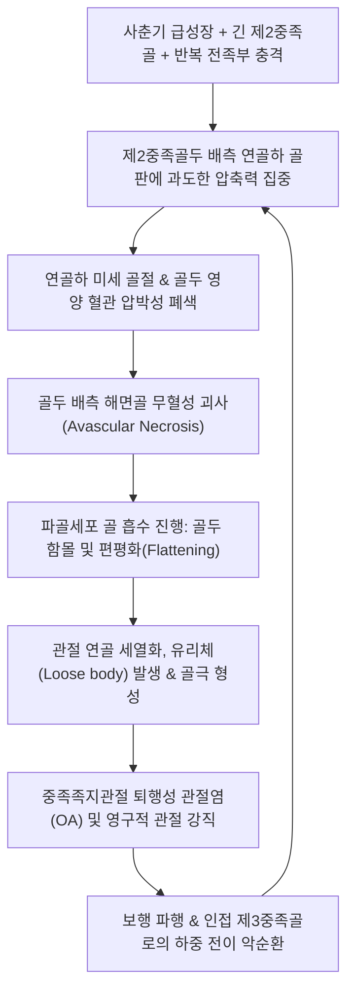
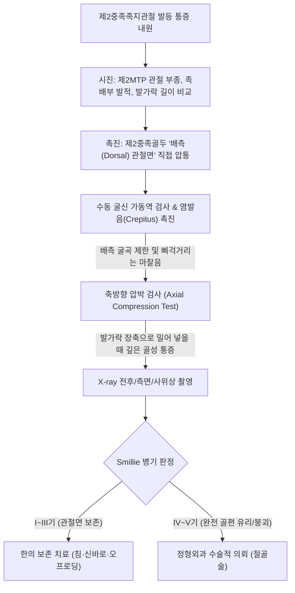
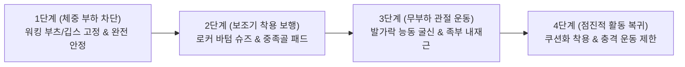

# 🩺 프라이베르그병 (Freiberg's Disease / Freiberg Infraction)

> **핵심 3줄 요약 (Key Summary)**:
> - 📍 병소 부위 & 해부·병태생리: 주로 제2중족골두(드물게 제3중족골두)의 골단부(Epiphysis)에 반복적인 미세 외상과 국소 혈류 장애가 겹치며 발생하는 특발성 골연골증(Osteochondrosis) 및 연골하 무혈성 괴사(Avascular necrosis).
> - 🚩 전형적 임상 양상: 10~20대 성장기 여성 또는 운동선수에서 발등 앞쪽(제2중족족지관절)의 욱신거리는 통증, 관절 부종 및 강직, 하이힐 착용 또는 보행 도약기(Push-off) 시 악화.
> - 🛠️ 핵심 검사 & 치료 전략: 제2중족골두 등쪽 관절면 직접 압통 및 굴신 시 거친 염발음(Crepitus), X-ray상 중족골두 편평화(Flattening) 및 스밀리(Smillie) 5단계 병기 분류. 침·도침을 통한 관절낭 감압, [[신바로약침]] 항염증 재생, 중족골 오프로딩 패드 및 굳은 바닥 창(Rocker-bottom sole) 착용.
> - ⚠️ 응급 의뢰 레드플래그: 관절면 전층 붕괴 및 심각한 유리체 형성(Smillie IV~V기, 정형외과 배측 쐐기 절골술 또는 관절 성형술 의뢰), 세균성 화농성 관절염 감별.

---

## 📌 목차
1. [질환 개요 & 해부학적 병태생리](#1-질환-개요--해부학적-병태생리)
2. [병태생리 메커니즘 & 생체역학적 악순환 네트워크](#2-병태생리-메커니즘--생체역학적-악순환-네트워크)
3. [임상 증상 & 이학적 검사(Physical Exam) 알고리즘](#3-임상-증상--이학적-검사physical-exam-알고리즘)
4. [감별 진단 매트릭스 (Differential Diagnosis)](#4-감별-진단-매트릭스-differential-diagnosis)
5. [한의 통합 치료 프로토콜 (침·약침·추나·한약)](#5-한의-통합-치료-프로토콜-침약침추나한약)
6. [양방 치료 & 병용·의뢰 기준 (Conventional Treatment & Referral)](#6-양방-치료--병용의뢰-기준-conventional-treatment--referral)
7. [재활 운동 & 생활습관 티칭 가이드](#7-재활-운동--생활습관-티칭-가이드)
8. [💡 사용자 진료실 핵심 필기 & 임상 노하우 (Melt-In 잔여 심화 집약)](#8-💡-사용자-진료실-핵심-필기--임상-노하우-melt-in-잔여-심화-집약)
9. [출처 및 학술 참고 문헌 (References)](#9-출처-및-학술-참고-문헌-references)

---

## 1. 질환 개요 & 해부학적 병태생리

* **질환 정의**:
  * 프라이베르그병(Freiberg's Disease / Infraction)은 제2중족골두(약 68%) 또는 제3중족골두(약 27%)의 관절면 연골하 골조직에 발생하는 무혈성 괴사(AVN)성 골연골염이다.
  * 1914년 알버트 프라이베르그(Albert Freiberg)가 처음 기술하였으며, 단순한 괴사가 아니라 반복 충격에 의한 미세골절과 허혈이 결합된 '불완전 골절(Infraction)'로 정의된다.

* **해부학적 취약성 & 혈관 분포**:
  * **해부학적 지레팔**:
    * 제2중족골은 족근중족(Lisfranc) 관절 복합체에 깊이 박혀 있어 전족부 중족골 중 가장 길고 운동성이 거의 없는 '고정축(Mortise)' 역할을 한다.
    * 보행 시 발꿈치가 들리는 순간 제2중족골두에 가장 큰 지면 반발력과 굽힘 모멘트가 집중된다 (Morton's toe 구조 시 위험 극대화).
  * **말단 혈관 분포의 한계**:
    * 중족골두의 혈류는 배측 및 족저측 중족동맥에서 분지하는 골간 동맥망에 의존하는데, 관절낭 부착부 주변의 세동맥이 기계적 압박이나 전단력에 의해 쉽게 손상되어 골두 배측 1/2 영역에 국소 허혈을 초래한다.

* **역학 및 위험 요인**:
  * 사춘기 급성장기인 12~18세 여성에서 남성보다 약 3~4배 압도적으로 호발한다.
  * 무용수(발레리나), 육상 선수, 체조 선수 등 까치발 도약이 잦은 청소년.
  * 굽이 높고 앞볼이 좁은 하이힐 착용, 긴 제2중족골 선천 변이.

---

## 2. 병태생리 메커니즘 & 생체역학적 악순환 네트워크

* **스밀리(Smillie) 방사선학적 5단계 병기 분류**:
  * **1기 (Stage I)**: 단순 X-ray상 정상 또는 미세한 연골하 골절선만 관찰됨 (MRI상 골수 부종).
  * **2기 (Stage II)**: 골두 배측 중심부의 흡수와 침식, 연골하 골질 경화, 골두 관절면의 편평화 시작.
  * **3기 (Stage III)**: 골두 배측의 중심부 함몰이 심화되고, 내측 및 외측 연골 돌기(Mantle)만 잔존.
  * **4기 (Stage IV)**: 함몰된 골편이 관절면에서 완전히 유리되어 유리체(Loose body)를 형성하고 골두 전반이 붕괴.
  * **5기 (Stage V)**: 중족골두 전층의 편평화, 관절강 협소, 거대한 골극 형성 및 말기 관절염으로 이행.

---

## 3. 임상 증상 & 이학적 검사(Physical Exam) 알고리즘

### 임상 증상

* **발등 앞쪽의 국소 동통 및 부종**:
  * 제2발가락 뿌리 관절(제2MTPJ) 발등 쪽이 욱신거리고 부어오르며, 신발을 신을 때 발등 압박통을 호소한다.
  * 활동 시 악화되고 휴식 시 완화되나, 병기가 진행되면 안정 시 및 야간통으로 발전한다.
* **관절 가동역 제한 및 강직**:
  * 엄지발가락 옆 둘째 발가락이 위아래로 잘 구부러지지 않고 뻣뻣하다.
* **보행 파행 (Limping)**:
  * 도약기(Push-off) 시 체중을 제2중족골두에 싣지 못해 발 외측 날로 절뚝거리며 걷는다.

### 이학적 검사 (Physical Examination)

1. **골두 배측 직접 압통 (Dorsal Head Tenderness)**:
   * 족저면이 아니라 **발등 쪽(Dorsal aspect)**에서 제2중족골두를 집게손가락으로 쥐었을 때 뼈 자체에 극심한 압통이 확인된다. (바닥 쪽이 아픈 단순 종족골두염과의 핵심 감별점).
2. **축방향 압박 검사 (Axial Compression Test)**:
   * 제2족지를 잡고 발목 방향으로 뼈 장축을 따라 꾹 밀어 넣을 때 관절강 내부에서 날카로운 골성 통증이 유발된다.
3. **MTP 관절 굴신 염발음 검사**:
   * 관절을 수동으로 굽히고 펼 때 거친 연골 마찰음(Crepitation)이 느껴지며 말기에는 완전 신전이 불가능하다.

---

## 4. 감별 진단 매트릭스 (Differential Diagnosis)

| 감별 질환 | 호발 연령/성별 | 주 통증 부위 | 특징적 방사선 소견 | 감별 포인트 |
| :--- | :--- | :--- | :--- | :--- |
| **프라이베르그병** | 10~20대 여성 | **제2중족골두 발등 쪽(Dorsal)** | **중족골두 편평화, 경화, 붕괴** | 성장기 호발, 연골하 무혈성 괴사 |
| **종족골두염 (Metatarsalgia)** | 40~60대 여성 | 제2, 3중족골두 **발바닥 쪽(Plantar)** | 뼈 자체는 정상, 굳은살 관찰 | 바닥 쪽 충격 과부하, 뼈 괴사 없음 |
| **[[몰턴 신경종]]** | 30~50대 여성 | 제3-4 또는 제2-3 **지간 공간(Web)** | X-ray 정상, 초음파 신경 결절 | 발가락 저림, 뮬더 클릭 양성 |
| **중족골 피로골절** | 군인, 마라토너 | 제2, 3중족골 **간부(Shaft)** | 간부의 가골 형성, 골절선 | 골두 관절면이 아닌 뼈 몸통 부위 |
| **통풍성 관절염** | 40대 이상 남성 | 제1MTP (드물게 제2MTP) | 요산 결정, 펀치아웃 골침식 | 야간성 발작, 극심한 열감·발적 |

---

## 5. 한의 통합 치료 프로토콜 (침·약침·추나·한약)

### 침구 치료 프로토콜

* **혈위 선정**:
  * 족양명위경(足陽明胃經): [[내정]](ST44, 滎水穴), [[함곡]](ST43, 兪木穴), [[충양]](ST42, 原穴).
  * 족궐음간경(足厥陰肝經): [[행간]](LR2), [[태충]](LR3).
  * 국소 관절강 아시혈: 제2중족족지관절 내·외측 간극.
* **자침 기법**:
  * **관절강 내 사자 및 감압 침법**: 제2MTP 관절의 등쪽 양측 함요처에서 관절강 중심을 향해 침체를 비스듬히 15~20mm 자입하여 관절낭 내 울혈을 제거하고 관절강 내압을 낮춘다.
  * 전기침(EA): [[함곡]]-[[내정]]에 전침을 연결하고 2Hz 저주파를 15분간 통전하여 국소 혈류 공급을 유도하고 조골세포 대사를 촉진한다.
* **도침 치료 (Acupotomy)**:
  * 만성기로 진행되어 관절낭 구축 및 배측 골극 주변 섬유성 유착이 심한 경우(Smillie II~III기), 관절낭 배측 비후 부위를 미세 절개하여 관절 가동역을 확보하고 골두 압박을 해소한다.

### 약침 치료 프로토콜

* **처방 약침**:
  * [[신바로약침]] (GCSB-5): 제2MTP 관절낭 주위 및 신근건 주위 공간으로 0.2~0.3cc 주입하여 연골하 골 파괴를 유발하는 염증성 사이토카인을 억제하고 혈관 신생을 돕는다.
  * 자하거(Hominis Placenta) 약침: 무혈성 괴사 부위의 골 기질 리모델링을 위해 주 2회 관절강 주변 시술.

### 추나의학적 접근 (Chuna Manual Therapy)

* **제2MTP 관절 장축 견인 및 가동술**:
  * 한의사의 한 손으로 제2중족골 간부를 단단히 고정하고, 다른 손으로 기절골을 잡아 원위부로 부드럽게 당기며 배측 및 족저측 글라이딩을 유도한다.
* **족부 횡아치 및 설상골 교정 추나**:
  * 제2중족골 기저부와 결합하는 제2설상골(Intermediate cuneiform)의 부정렬을 교정하여 중족골에 걸리는 회전 토크를 완화한다.

### 변증별 한약 치료 (Herbal Medicine)

* **기체어혈(氣滯瘀血)형** (초기 날카로운 자통, 관절 종창, 외상성 어혈):
  * [[활락효영단]](活絡效靈丹) 또는 [[당귀수산]](當歸鬚散) 가감: [[단삼]], [[당귀]], [[몰약]], [[유향]], [[홍화]], [[우슬]]을 배합하여 괴사 부위의 미세 순환을 개통.
* **간신휴손(肝腎虧損) & 골비골위(骨痺骨萎)** (골두 편평화, 만성 괴사, 뼈가 시리고 쑤심):
  * [[독활기생탕]](獨活寄生湯) 합 [[호잠환]](虎潛丸) 가감: [[숙지황]], [[구척]], [[골쇄보]], [[두충]], [[보골지]], [[속단]]을 대용량 사용하여 뼈의 허혈성 괴사를 억제하고 신생 골 재생을 촉진.

---

## 6. 양방 치료 & 병용·의뢰 기준 (Conventional Treatment & Referral)

### 보존적 치료 및 수술 요법

* **체중 부하 차단 (Off-loading)**:
  * 초기(Smillie I~II기)에는 단하지 깁스(Cast) 또는 워킹 부츠를 4~6주간 착용하여 중족골두의 추가 압박 붕괴를 철저히 차단.
* **수술적 치료 (Surgical Management)**:
  * **배측 쐐기 절골술 (Dorsal Closing Wedge Osteotomy)**: 건강한 바닥 쪽(족저측) 관절면을 등쪽으로 회전시켜 새로운 관절면을 형성하는 표준 술식.
  * **관절경적 변연절제술 및 유리체 제거술**: 3~4기에서 연골 파편을 제거하고 골극을 절제.

### 한의 병용 판단 및 의뢰 기준 (Referral Criteria)

* **한의 보존 치료의 골든타임**:
  * 골두가 완전히 무너지지 않은 **Smillie I~III기 단계**에서는 깁스 고정/패딩과 함께 한의 침·한약 복합 치료를 시행하면 수술 없이 골두의 재혈관화와 임상적 완치를 이끌어낼 수 있다.
* **정형외과 즉각 의뢰 (Red Flags)**:
  * X-ray상 골두가 완전히 으스러지거나 다수의 유리체가 관절강을 채우고 있는 경우 (Smillie IV~V기).
  * 보행이 불가능한 수준의 진성 관절 잠김(True locking).

---

## 7. 재활 운동 & 생활습관 티칭 가이드

### 신발 및 보조기 티칭 — 절대 원칙

* **로커 바텀(Rocker-bottom) 밑창 신발 착용**:
  * 밑창 앞부분이 둥글게 굴곡진 신발을 신으면 걸을 때 제2MTP 관절이 꺾이지 않고 굴러가므로 골두에 가해지는 압축력이 원천 차단된다.
* **단단한 신발 깔창(Carbon-fiber plate)**:
  * 구부러지지 않는 단단한 탄소섬유 판을 신발 밑에 깔아 발가락 관절의 신전을 제한한다.
* **하이힐 및 맨발 보행 평생 금기**:
  * 치료 완료 후에도 높은 굽의 신발은 재발의 절대적 원인이 되므로 피해야 한다.

---

## 8. 💡 사용자 진료실 핵심 필기 & 임상 노하우 (Melt-In 잔여 심화 집약)

* **진료실 오진 주의 — "발바닥이 아니라 발등을 만져라"**:
  * 환자가 둘째 발가락 뿌리가 아프다고 하면 일반적인 종족골두염으로 생각하고 발바닥만 치료하기 쉽다.
  * 프라이베르그병은 **발등 쪽(Dorsal)** 골두를 눌렀을 때 비명을 지르는 뼈 압통이 나타나며, X-ray를 찍어보면 이미 뼈 머리가 납작하게 눌려 있는 경우가 많다. 발등 쪽 압통을 반드시 확인해야 조기 발견이 가능하다.
* **조기 진단 시 MRI의 결정적 가치**:
  * 발병 초기 6개월까지는 단순 X-ray에서 뼈가 정상으로 보일 수 있다 (Smillie I기).
  * 성장기 청소년이 발등 쪽 제2MTP 통증을 호소하고 X-ray가 정상인데도 보행통이 지속된다면, 조기 괴사 확인을 위해 지체 없이 MRI를 의뢰하여 골수 부종을 확인해야 골두 붕괴를 막을 수 있다.

---

## 9. 출처 및 학술 참고 문헌 (References)

Altın YF et al. (2026). Dorsal Closing Wedge Osteotomy for Freiberg Disease: A Retrospective Case Series. *J Foot Ankle Surg*, 65(3): 310-318. PMID: 42855037

Baheeg MM et al. (2026). Mini-Screw Fixation Following Dorsal Closing Wedge Osteotomy for Treatment of Freibergs Disease. *J Foot Ankle Surg*, 65(2): 205-212. PMID: 42838503

Touban BM et al. (2026). Provider-Cleared Return-to-Sport After Freiberg Infraction in Adolescent Athletes. *Pediatr*, 46: 250. PMID: 42474446
