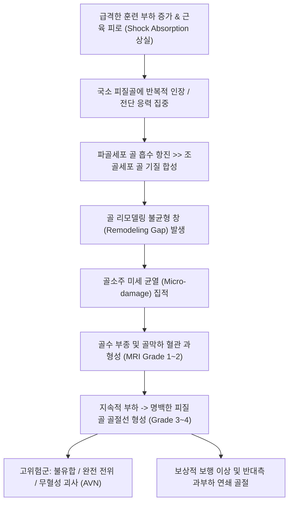

# 🩺 피로골절 (Stress Fracture / 피로 골절 & 부전 골절)

> **핵심 3줄 요약 (Key Summary)**:
> - 📍 **병소 부위 & 해부·병태생리**: 반복적인 아극성 기계적 응력(Fatigue fracture) 또는 골다공증 등 취약한 골질에 가해지는 일상 부하(Insufficiency fracture)로 인해 파골세포의 골 흡수가 조골세포의 골 형성을 앞서며 발생하는 피질골의 미세골절. 하지 [[경골]](Tibia, 40~50%)에 최빈발.
> - 🚩 **전형적 임상 양상**: 훈련량 증가 2~4주 후 서서히 시작되는 체중 부하 시 국소 골통증, 초기에는 휴식 시 소실되다가 점차 야간통 및 보행 불능으로 진행, 뼈 표면의 명확한 '핀포인트 압통' 및 국소 골막 비후.
> - 🛠️ **핵심 검사 & 치료 전략**: 초기 단순 X-ray 위음성률(50% 이상) 극복을 위해 MRI(Fredericson 분류 Grade 1~4) 또는 3상 골스캔(Bone scintigraphy) 조기 판독. 저위험군(경골 후내측, 비골)은 6주간 활동 조절 및 한의 치료(침·신바로 약침·접골자금단); 고위험군(대퇴골 경부 인장측, 경골 전방 피질, 주상골)은 적극적 수술적 내고정술(Tension band plating / IM nail) 의뢰.
> - ⚠️ **응급 의뢰 레드플래그**: 대퇴골 경부 상부(인장측) 피로골절 확인 시 완전 전위 및 대퇴골두 무혈성 괴사(AVN) 위험, 경골 전방 피질의 '공포의 검은 선(Dreaded black line)' 확인 시 즉각 정형외과 응급 수술 의뢰.

---

## 📌 목차
1. [질환 개요 & 해부학적 병태생리](#1-질환-개요--해부학적-병태생리)
2. [병태생리 메커니즘 & 생체역학적 악순환 네트워크](#2-병태생리-메커니즘--생체역학적-악순환-네트워크)
3. [임상 증상 & 이학적 검사(Physical Exam) 알고리즘](#3-임상-증상--이학적-검사physical-exam-알고리즘)
4. [감별 진단 매트릭스 (Differential Diagnosis)](#4-감별-진단-매트릭스--differential-diagnosis)
5. [한의 통합 치료 프로토콜 (침·약침·추나·한약)](#5-한의-통합-치료-프로토콜-침약침추나한약)
6. [양방 치료 & 병용·의뢰 기준 (Conventional Treatment & Referral)](#6-양방-치료--병용의뢰-기준-conventional-treatment--referral)
7. [재활 운동 & 생활습관 티칭 가이드](#7-재활-운동--생활습관-티칭-가이드)
8. [💡 사용자 진료실 핵심 필기 & 임상 노하우 (Melt-In 잔여 심화 집약)](#8--사용자-진료실-핵심-필기--임상-노하우-melt-in-잔여-심화-집약)
9. [출처 및 학술 참고 문헌 (References)](#9-출처-및-학술-참고-문헌-references)

---

## 1. 질환 개요 & 해부학적 병태생리

피로골절(Stress Fracture)은 단일 외상성 충격이 아닌, 일상적이거나 반복적인 물리적 부하가 뼈의 회복 한계를 초과하여 축적되면서 발생하는 불완전 또는 완전 골절을 통칭한다. 크게 두 가지 범주로 분류된다:
1. **피로 골절 (Fatigue Fracture)**: 정상적인 탄성과 골밀도를 가진 뼈에 비정상적으로 과도하고 반복적인 기계적 스트레스가 가해져 발생 (주로 군인, 운동선수, 무용수) (Campbell et al., 2025).
2. **부전 골절 (Insufficiency Fracture)**: 골다공증, 골연화증, 파제트병, 방사선 치료 등으로 골질이 취약해진 뼈에 정상적인 일상 부하가 가해져 발생 (주로 고령 여성, 천골·치골·대퇴골두 호발).

![[피로골절_01_영상소견_경골골간단_피로골절_Xray.jpg]]
> [그림 1: ① 병태생리·영상 — 하지 피로골절 중 가장 빈발하는 경골 골간단 부위의 미세 피질골 단열 및 골막 반응 X-ray (Wikimedia Commons, Public Domain)]

![[피로골절_01_영상소견_대퇴골경부_피로골절_Xray.jpg]]
> [그림 2: ① 병태생리·영상 — 조기 수술적 고정을 요하는 고위험군 대퇴골 경부 상부 인장측 피로골절 X-ray (Wikimedia Commons, Public Domain)]

### 위험도에 따른 해부학적 부위 분류:
- **저위험군 (Low-risk)**: 압박력(Compression force)을 받는 부위로 골유합률이 높고 보존 치료가 우선됨.
  - 경골 후내측 피질골, 비골(Fibula), 대퇴골 경부 하부(압박측), [[발의 피로 골절|중족골(2~4지)]], 종골(Calcaneus).
- **고위험군 (High-risk)**: 인장력(Tension force)을 받거나 혈류 공급이 불량한 Watershed 부위로, 지연유합·불유합 및 완전 전위 위험이 극히 높음(Randall et al., 2025).
  - **대퇴골 경부 상부(인장측)**, **경골 전방 피질골(Anterior cortex)**, **족부 주상골(Navicular)**, **제5발허리뼈 기저부(Zone 2/3)**, **내과(Medial malleolus)**, **슬개골(Patella)**.

---

## 2. 병태생리 메커니즘 & 생체역학적 악순환 네트워크

![[피로골절_02_병태생리_골막반응_가골형성_Xray.jpg]]
> [그림 3: ② 관련 해부 구조물 — 피질골 미세 균열 부위에 반응성 골막 비후 및 층상 가골이 형성되는 치유 병태 X-ray (Wikimedia Commons, CC BY-SA 3.0)]

정상 골 조직은 기계적 하중에 반응하여 미세 손상을 복구하는 지속적인 골 개조(Bone remodeling)를 거친다. 하중이 증가하면 파골세포(Osteoclast)가 동원되어 기존 골질을 흡수(Resorption)하는 터널을 형성하는데, 이 흡수 과정은 수일 만에 빠르게 진행되지만 조골세포(Osteoblast)가 새로운 층판골(Lamellar bone)을 채우는 데는 수주에서 수개월이 소요된다.

따라서 급격한 훈련량 증가(거리, 빈도, 강도) 시기에는 일시적으로 '골 흡수 > 골 형성'의 다공성 취약 창(Vulnerability window)이 형성된다. 여기에 근육 피로로 인한 충격 흡수 부전, 여성 선수의 에너지 결핍(RED-S, 상대적 에너지 결핍 증후군 및 에스트로겐 저하)이 겹치면 미세 파탄이 기하급수적으로 확장되는 악순환이 완성된다.

---

## 3. 임상 증상 & 이학적 검사(Physical Exam) 알고리즘

### 3.1 주요 자각 증상
- **운동 유발성 골성 통증**: 달리기나 훈련 10~15분 후부터 시작되어 훈련이 끝날 때까지 지속되며, 쉬면 사라지다가 병증이 진행되면 일상 보행 및 야간에도 욱신거림.
- **국소 핀포인트 압통**: 근육 전체가 뻐근한 근육통과 달리, 손가락 끝 하나(Fingertip)로 뼈를 눌렀을 때 뚜렷하게 유발되는 극소 압통점.
- **골막 팽륜(Bony fullness)**: 진행된 피로골절 부위 뼈 표면이 단단하게 솟아오름.

### 3.2 핵심 이학적 검사법

> ⚠️ **이미지 미확보 (2026-10-09)** — 기존 슬롯 사진은 '라크만 검사(슬관절 전방십자인대 검사)'로 피로골절과 무관하여 임베드를 제거함(파일은 타 노트에서 정상 사용 중이라 보존). 재조달 필요.

![[피로골절_03_영상소견_골스캔_전신방사선핵종검사.jpg]]
> [그림 5: ③ 영상진단 — 초기 X-ray 위음성기(초기 2주)에 국소 대사 항진 및 핫스팟을 조기 포착하는 전신 골스캔(Bone Scintigraphy) 실사 (Wikimedia Commons, Public Domain)]

1. **핀포인트 골 타진통 (Point Tenderness & Percussion)**:
   - 뼈 위를 손가락 끝으로 직접 두드렸을 때 뼈 속이 울리는 날카로운 통증 재현.
2. **음차 진동 검사 (Tuning Fork Test)**:
   - 128Hz 음차를 진동시켜 의심 골 표면에 댔을 때 뼈 속으로 진동이 전달되며 극심한 통증이 발생하면 양성(민감도 약 75%).
3. **지레대 검사 (Fulcrum Test - 대퇴골 피로골절 선별)**:
   - 환자를 침대 끝에 앉히고 검사자의 팔을 환자의 대퇴부 아래에 가로질러 받친 후(지레 받침점), 대퇴 원위부를 아래로 누른다. 대퇴골 간부 피로골절 시 날카로운 골통증 재현.
4. **한 발 홉 테스트 (Single-leg Hop Test)**:
   - 환측 다리로 제자리 뜀뛰기를 시도했을 때 골성 통증으로 1회 착지조차 불가능.

---

## 4. 감별 진단 매트릭스 (Differential Diagnosis)

![[오스굿슐라터병_경골조면_Xray.jpg]]
> [그림 6: ④ 감별 진단 — 성장기 경골 근위부 피로골절과 감별해야 하는 오스굿-슐라터병 골연골염 X-ray (Wikimedia Commons, Public Domain)]

| 감별 질환 | 호발 연령 및 부위 | 통증 양상 및 발생 특징 | 신체 검사 소견 | 영상의학적(MRI/X-ray) 특징 |
| :--- | :--- | :--- | :--- | :--- |
| **피로골절 (경골/대퇴)** | 군인·마라토너, 골간부 | 1~2cm 국소 핀포인트 압통, 야간통 | 골 타진통 (+), 음차 검사 (+) | MRI상 피질골 관통선, 골수 부종 |
| **내측 경골 스트레스 증후군 ([[MTSS]])** | 초보 러너, 경골 원위 1/3 | 경골 내측연 5cm 이상의 광범위 압통 | 광범위 연부조직 압통, 홉 검사 음성 | X-ray 정상, MRI상 골막하 부종만 국한 |
| **만성 운동구획증후군 (CECS)** | 고강도 러너, 전외측 구획 | 달릴 때만 터질 듯한 팽만감과 무감각 | 휴식 시 압통 소실, 족배굴곡 약화 | 구획 내압 측정 검사(압력 >30mmHg) |
| **유골 골종 (Osteoid Osteoma)** | 10~20대 남성, 대퇴·경골 | 밤에 극심한 통증, 아스피린 복용 시 즉각 소실 | 국소 압통, 활동과 무관 | 방사선상 중심성 투명대(Nidus)와 경화 |
| **[[발의 피로 골절]]** | 족부 주상골, 제2중족골 | 발등 및 족부 횡아치 국소 통증 | Navicular N-spot 압통 (+) | 족부 전용 사위 X-ray 및 족부 MRI |

---

## 5. 한의 통합 치료 프로토콜 (침·약침·추나·한약)

피로골절의 한의 치료는 골 흡수 억제 및 골막 혈행 개선, 손상 부위 체중 부하 분산, 골 개조 가속화의 단계로 구성된다(Prisco et al., 2025).

![[발허리뼈골절_05_술기실사_족부침치료.jpg]]
> [그림 7: ⑤ 한의 통합 치료 — 하지 피로골절 환자의 골막 미세혈관 신생 및 가골 형성 촉진을 위한 자침 시술 (Wikimedia Commons, CC BY 2.0)]

### 5.1 침치료 & 전침 요법
- **배혈 혈위**: 양릉천(GB34), 족삼리(ST36), 조구(ST38), 삼음교(SP6), 현종(GB39, 수회 髓會), 태충(LR3), 신수(BL23).
- **골막 자극 침술**: 골절 중심선에서 상하 1~2cm 떨어진 정상 피질골 부착부에 호침을 골막 표면에 닿도록 사자(Oblique needling)하여 피질골 골막의 칼시토닌 유전자 관련 펩타이드(CGRP) 방출을 유도하고 국소 혈관 확장을 촉진.
- **전침(Electroacupuncture)**: 2Hz 저빈도 자극을 20분간 적용하여 파골세포 분화를 억제하고 조골세포의 알칼리성 인산분해효소(ALP) 및 오스테오칼신(Osteocalcin) 발현을 유의하게 증진.

### 5.2 약침 요법
- **신바로 약침** 또는 **자하거 약침** 1.0~2.0cc를 골절 의심부 골막 주변 및 족삼리·현종에 주입하여 Type I 콜라겐 합성 가속 및 골소주 치밀도 증대.

### 5.3 한약 치료 (골 개조 촉진 및 신정 보강)
- **초기 염증·어혈기 (1~2주)**: 당귀수산(當歸鬚散) 가미방 (자연동 自然銅 4g, 속단 續斷 6g 가미) — 국소 골막 혈종 흡수 및 미세혈류 재생.
- **골 리모델링 가속기 (3~6주)**: 접골자금단(接骨紫金丹), 보골기생탕(補骨寄生湯) (골쇄보 骨碎補, 두충 杜仲, 토사자 菟絲子 각 8g 가미) — 골 흡수를 차단하고 골 무기질화(Mineralization) 촉진.
- **여성 무월경·골감소증 동반 (RED-S)**: 귀비탕(歸脾湯) 합 육미지황환(六味地黃丸).

### 5.4 추나 치료 (Chuna Manual Therapy)
- 골절 부위 뼈에 대한 직접적 교정은 절대 금기. 하지 생체역학적 불균형(골반 부정렬, 족부 회내)을 바로잡는 천장관절 교정 및 장요근, 비복근, 가자미근 근막이완술 적용.

---

## 6. 양방 치료 & 병용·의뢰 기준 (Conventional Treatment & Referral)

![[발허리뼈골절_06_보존치료_단하지보행보조기_CAMboot.jpg]]
> [그림 8: ⑥ 양방 보존 치료 — 피로골절 부위의 체중 부하를 차단하기 위한 탈착식 보행 보조기(CAM boot) (Wikimedia Commons, CC BY-SA 3.0)]

### 6.1 비수술적 보존 치료 (저위험군)
- **2단계 프로토콜 (Two-phase protocol)**:
  - 1단계: 통증 유발 활동 전면 중단(Painless rest), 목발 및 부츠 고정 2~4주.
  - 2단계: 통증이 소실되면 자전거, 수영 등 저충격 유산소 운동부터 점진 복귀.
- 체외충격파 치료(ESWT): 만성 지연유합 피로골절에서 골유합 촉진 보조 요법(Prisco et al., 2025).

### 6.2 수술적 치료 적응증 (고위험군)
- **대퇴골 경부 상부 인장측 피로골절**: 진단 즉시 캐눌라 스크류(Cannulated screws) 3개를 이용한 예방적 고정술 필수(완전 전위 시 대퇴골두 괴사 초래).
- **경골 전방 피질골 피로골절**: 골흡수선("Dreaded black line") 동반 시 수술적 골수내정 고정술(IM Nailing) 또는 인장대 금속판 고정술(Tension band plating) (Randall et al., 2025).

### 6.3 응급 전원 기준
- 대퇴골 경부 및 경골 전방의 피로골절 영상 확인 즉시.
- 8~12주간의 보존 치료에도 가골 형성이 없는 영구적 가관절증.

---

## 7. 재활 운동 & 생활습관 티칭 가이드

### 7.1 단계별 재활 프로토콜
1. **1단계: 골 부하 완전 차단기 (수상 후 1~4주)**
   - 수영(물속 걷기), 상체 근력 운동, 딥워터 러닝(Aqua jogging)으로 심폐 기능 유지.
2. **2단계: 점진적 동적 부하 훈련 (수상 후 4~8주)**
   - 자전거 타기, 일립티컬 머신(Elliptical).
   - 코어 근육 및 둔근(중둔근) 강화: 클램쉘(Clamshell), 브릿지 운동을 통해 골반 안정성 증대.
3. **3단계: 런-워크 프로그램 (Run-Walk Program) (8주 이후)**
   - 1분 조깅 + 4분 걷기 5세트부터 시작하여 주당 10% 미만으로 점진적 증량.

---

## 8. 💡 사용자 진료실 핵심 필기 & 임상 노하우 (Melt-In 잔여 심화 집약)

- **정강이 안쪽 아프다고 다 '신스플린트(MTSS)'가 아니다**: 초보 러너가 정강이 안쪽 통증을 호소할 때, 뼈 능선을 따라 5cm 이상 길게 아프면 신스플린트(근막염)이지만, 손가락 한 개로 짚는 1cm 국소 부위가 못 견디게 아프다면 100% 경골 피로골절이다. 피로골절에 폼롤러 문지르고 스트레칭 시키면 뼈가 완전히 부러져 철심을 박아야 한다. 핀포인트 압통을 반드시 확인하라.
- **젊은 여성 러너의 생리력을 반드시 물어라**: 마라톤이나 크로스핏을 하는 20~30대 여성에게 피로골절이 발생했다면, 이는 뼈만의 문제가 아니라 '여성 선수 삼총사(섭식장애 + 무월경 + 조기 골다공증)'의 신호탄이다. 생리가 불규칙한지 꼭 묻고, 에스트로겐 결핍으로 골흡수가 가속된 상태라면 한약(귀비탕, 녹용)으로 내분비축을 정상화해야 재발을 막을 수 있다.
- **음차(Tuning Fork) 검사는 한의원의 명검이다**: X-ray 장비가 없거나 초기 방사선에 안 나오는 피로골절을 감별할 때, 128Hz 음차를 울려 뼈에 대보라. 단순 근육염 환자는 시원하다고 하지만, 피로골절 환자는 진동이 골막에 닿는 순간 비명을 지른다. 진료실에 128Hz 음차 하나를 반드시 구비해 두라.

---

## 9. 출처 및 학술 참고 문헌 (References)

- **Randall A, et al. (2025)**. Tension band plating vs intramedullary nailing for anterior tibial diaphyseal stress fractures in athletes. *Am J Sports Med*. [PMID 41026237](https://pubmed.ncbi.nlm.nih.gov/41026237/)
  - **[연구 요약]**: 고위험군인 경골 전방 피질골 피로골절에 대한 인장대 금속판 고정술과 골수내정 고정술의 골유합률 및 스포츠 복귀 기간을 비교한 체계적 문헌고찰 및 메타분석. 조기 해부학적 고정의 필요성을 규명함.
- **Prisco D, et al. (2025)**. Use of Extracorporeal Shockwave Therapy for the Management of Bone Pathologies: A Systematic Review. *Appl Sci*. [PMID 41495929](https://pubmed.ncbi.nlm.nih.gov/41495929/)
  - **[연구 요약]**: 지연유합 및 불유합 피로골절에 대한 체외충격파(ESWT) 치료의 조골세포 자극 및 혈관신생 유도 기전을 분석한 체계적 문헌고찰.
- **Campbell D, et al. (2025)**. Development of Stress Fractures in Military Recruits: A Systematic Review. *Mil Med*. [PMID 41302705](https://pubmed.ncbi.nlm.nih.gov/41302705/)
  - **[연구 요약]**: 신병 훈련 집단에서 발생하는 전신 피로골절의 역학적 발생률, 위험 인자(훈련 강도, 골밀도, 영양 상태) 및 조기 선별 알고리즘을 종합 분석한 종설.

---

## 관련 노트

- [[발의 피로 골절]]
- [[발허리뼈 골절]]
- [[대퇴골 경부 골절]]
- [[경골]]
- [[골다공증]]
