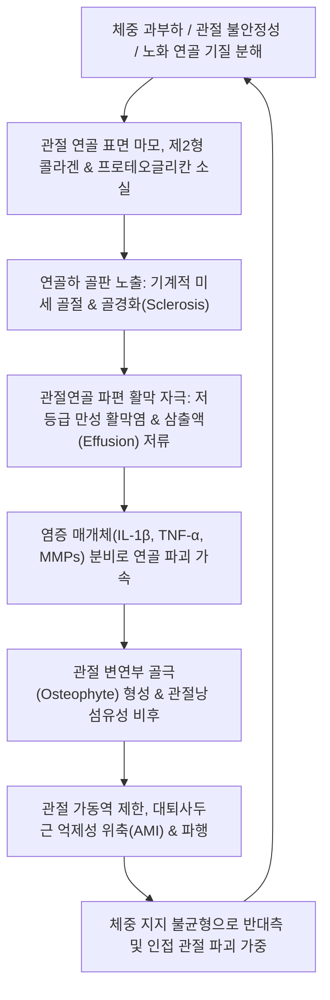
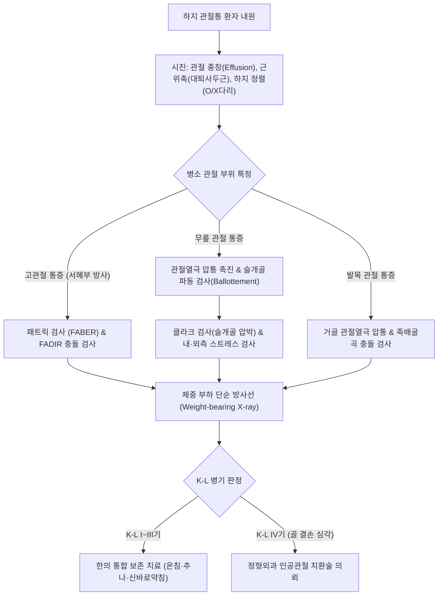
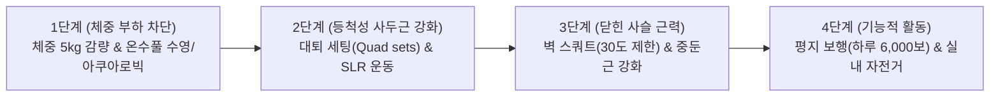

# 🩺 하지 관절병증 (Lower Extremity Arthropathy)

> **핵심 3줄 요약 (Key Summary)**:
> - 📍 병소 부위 & 해부·병태생리: 고관절(Hip), 슬관절(Knee), 족관절(Ankle) 등 체중 부하를 전담하는 하지 대관절의 초자연골 마모, 연골하 골경화(Subchondral sclerosis), 골극(Osteophyte) 형성 및 활막 비후를 특징으로 하는 퇴행성·역학적 관절 질환군.
> - 🚩 전형적 임상 양상: 체중 부하 시 관절 심부의 둔통 및 피로감, 30분 미만의 조조강직(Morning stiffness), 보행 시 관절 가동역 제한, 계단 오르내리기 시 무릎/고관절 악화, 관절 마찰음(Crepitus).
> - 🛠️ 핵심 검사 & 치료 전략: 패트릭 검사([[패트릭 검사]], 고관절), 클라크 검사([[클라크 검사]], 슬관절), 서랍 검사, 체중부하 방사선(Kellgren-Lawrence 병기 판정). [[독비]](ST35)·[[내슬안]]·[[양릉천]](GB34) 온침(Warm needle) 및 전침 치료, 추나 관절 견인 가동술, [[신바로약침]] 관절강 주위 항염증 재생술, 대퇴사두근/중둔근 강화 닫힌 사슬 운동(CKC).
> - ⚠️ 응급 의뢰 레드플래그: 급성 발열 및 관절 발적·파동감을 동반한 화농성 관절염(Septic arthritis 의심 즉각 관절천자 의뢰), 하지 체중 부하 완전 불능의 급성 골절 및 무혈성 괴사(AVN) 붕괴 소견.

---

## 📌 목차
1. [질환 개요 & 해부학적 병태생리](#1-질환-개요--해부학적-병태생리)
2. [병태생리 메커니즘 & 생체역학적 악순환 네트워크](#2-병태생리-메커니즘--생체역학적-악순환-네트워크)
3. [임상 증상 & 이학적 검사(Physical Exam) 알고리즘](#3-임상-증상--이학적-검사physical-exam-알고리즘)
4. [감별 진단 매트릭스 (Differential Diagnosis)](#4-감별-진단-매트릭스-differential-diagnosis)
5. [한의 통합 치료 프로토콜 (침·약침·추나·한약)](#5-한의-통합-치료-프로토콜-침약침추나한약)
6. [양방 치료 & 병용·의뢰 기준 (Conventional Treatment & Referral)](#6-양방-치료--병용의뢰-기준-conventional-treatment--referral)
7. [재활 운동 & 생활습관 티칭 가이드](#7-재활-운동--생활습관-티칭-가이드)
8. [💡 사용자 진료실 핵심 필기 & 임상 노하우 (Melt-In 잔여 심화 집약)](#8-💡-사용자-진료실-핵심-필기--임상-노하우-melt-in-잔여-심화-집약)
9. [출처 및 학술 참고 문헌 (References)](#9-출처-및-학술-참고-문헌-references)

---

## 1. 질환 개요 & 해부학적 병태생리

* **질환 정의**:
  * 하지 관절병증(Lower Extremity Arthropathy)은 고관절, 슬관절, 족관절 등 보행과 직립 시 체중을 지탱하는 하지 관절 복합체에 발생하는 모든 형태의 관절 연골 손상, 활막염 및 골변형 질환을 포괄하는 임상적 총칭이다.
  * 대표적으로 원발성 퇴행성 관절염([[골관절염]], Osteoarthritis), 외상 후 관절염, 류마티스 관절염 및 결정유발성 관절염([[통풍]], 가성통풍)의 하지 침범을 포함한다.

* **하지 운동 사슬(Kinetic Chain)과 생체역학적 부하**:
  * **삼두 관절의 상호 보상성**:
    * 고관절(구형 관절) - 슬관절(경첩 관절) - 족관절(경첩/과상 관절)은 독립적으로 움직이지 않고 하나의 폐쇄 운동 사슬(Closed kinetic chain)을 이룬다.
    * 예를 들어, 고관절 외전근([[중둔근]])이 약화되면 보행 시 대퇴골이 내전·내회전되어 슬관절 외반(Valgus) 스트레스가 증가하고, 이는 슬관절 외측 연골 마모와 족부 과회내를 연쇄적으로 촉발한다.
  * **보행 시 관절별 체중 부하 비율**:
    * 평지 보행 시 고관절에는 체중의 2.5~3배, 슬관절에는 체중의 3~4배, 족관절에는 체중의 4~5배에 달하는 수직 접촉압이 가해진다. 계단 하강 시 슬관절 접촉압은 체중의 7~8배까지 치솟는다.

* **역학 및 위험 요인**:
  * 60세 이상 고령층의 50% 이상에서 방사선학적 퇴행성 변화 관찰 (여성이 남성보다 슬관절염 유병률 2배 높음).
  * 기계적 요인: 비만(체중 1kg 증가 시 무릎 하중 4kg 증가), 무릎 꿇기·쪼그려 앉기 생활습관, 과거 반월상 연골판 파열([[반월상 연골판 파열]]) 또는 전방십자인대 파열 이력.
  * 전신 대사 요인: 제2형 당뇨병, 대사증후군, 에스트로겐 감소(폐경).

---

## 2. 병태생리 메커니즘 & 생체역학적 악순환 네트워크

* **켈그렌-로렌스(Kellgren-Lawrence, K-L) 방사선학적 4단계 병기 분류**:
  * **1기 (Grade I - 의심기)**: 관절강 협소는 의심스러우나 뚜렷하지 않고, 미세한 골극 가능성.
  * **2기 (Grade II - 경도)**: 명확한 골극 형성이 관찰되며, 관절강 협소는 경미함.
  * **3기 (Grade III - 중등도)**: 다발성 골극 형성, 명확한 관절강 협소(50% 이상 감소), 연골하 골경화증 관찰.
  * **4기 (Grade IV - 중증)**: 관절강이 완전히 소실되어 뼈와 뼈가 맞닿음(Bone-on-bone), 거대한 골극 및 연골하 낭종(Subchondral cyst), 심한 골변형.
* **관절인성 근육 억제(Arthrogenic Muscle Inhibition, AMI)**:
  * 관절 내 삼출액이 20~30ml만 저류되어도 관절낭 수용체가 척수 반사 레벨에서 [[내측광근]](VMO)의 신경 활성화를 강제로 차단하여 급속한 근위축을 초래한다.

---

## 3. 임상 증상 & 이학적 검사(Physical Exam) 알고리즘

### 임상 증상

* **사용 후 악화되는 관절통**:
  * 오래 걷거나 서 있을 때, 계단을 내려올 때 관절 심부가 뻐근하게 쑤시고 묵직한 통증.
* **조조강직 (Morning Stiffness)**:
  * 아침에 일어나거나 한참 앉아 있다가 일어설 때 관절이 굳어 움직이기 힘듦. (단, 류마티스 관절염과 달리 **30분 이내에 관절을 움직이면 풀리는** 특징).
* **관절 마찰음(Crepitus) 및 잠김(Locking/Catching)**:
  * 무릎을 구부렸다 펼 때 모래 갈리는 소리나 우두둑하는 파열음 청취.
* **외반/내반 변형 (Genu Varum / Valgus)**:
  * 무릎 내측 연골이 집중 마모되면서 다리가 O자형으로 휘어지는 내반슬 변형이 흔하게 발생.

### 이학적 검사 (Physical Examination)

1. **관절열극 직접 압통 (Joint Line Tenderness)**:
   * 슬관절을 90도 굴곡시킨 상태에서 내측 및 외측 관절열극을 촉진할 때 골극 및 연골 마모 부위에 날카로운 압통 확인.
2. **슬개골 파동 검사 (Patellar Ballottement / Bulge Sign)**:
   * 슬개상낭을 상방에서 아래로 훑어 누른 뒤 슬개골을 아래로 툭 쳤을 때 슬개골이 관절액 위에 떠 있다가 대퇴골에 닿는 느낌(Floating patella)으로 삼출액 저류를 진단.
3. **패트릭 검사 ([[패트릭 검사]] / FABER Test)**:
   * 환자를 눕히고 발목을 반대쪽 무릎 위에 올려놓은 후 무릎을 바닥 쪽으로 누를 때 서혜부에 통증이 유발되면 고관절 관절병증 양성.

---

## 4. 감별 진단 매트릭스 (Differential Diagnosis)

| 감별 질환 | 호발 연령 | 주 통증 양상 | 조조강직 지속시간 | 혈액 검사 / 방사선 소견 |
| :--- | :--- | :--- | :--- | :--- |
| **퇴행성 하지 관절병증 (OA)** | 50대 이상 | 체중 부하 시 악화, 활동 후 통증 | **30분 미만** | 염증수치(ESR/CRP) 정상, 골극 형성, 비대칭 관절강 협소 |
| **류마티스 관절염 ([[류마티스]])** | 30~50대 여성 | 양측성 다발 관절통, 대칭성 활막염 | **1시간 이상** | RF(+), Anti-CCP(+), ESR/CRP 상승, 대칭적 골침식 |
| **통풍성 관절염 ([[통풍]])** | 40대 이상 남성 | 야간성 단일 관절 극심한 발적·작열통 | — | 혈청 요산 상승, 관절액 요산 결정(편광현미경) |
| **화농성 관절염 (Septic)** | 전 연령 | 발열, 오한, 완전 체중 부하 불능 | — | **WBC 급증, 관절액 백혈구 >50,000/μL, 세균 배양** |
| **특발성 골괴사증 (SONK/AVN)** | 고령 여성 | 외상 없이 갑자기 발생한 극심한 관절통 | — | MRI상 대퇴 내과 골수 부종 및 연골하 붕괴 |

---

## 5. 한의 통합 치료 프로토콜 (침·약침·추나·한약)

### 침구 치료 프로토콜

* **혈위 선정**:
  * 슬관절 주치 혈위: [[독비]](ST35), [[내슬안]](EX-LE4), [[양릉천]](GB34, 筋會), [[음릉천]](SP9), [[혈해]](SP10), [[양구]](ST34, 郄穴), [[곡천]](LR8).
  * 고관절 주치 혈위: [[환도]](GB30), [[거료]](GB29), [[비관]](ST31), [[질변]](BL54).
  * 족관절 주치 혈위: [[해계]](ST41), [[구허]](GB40), [[중봉]](LR4), [[곤륜]](BL60), [[태계]](KI3).
* **온침(溫針, Warm Needle Acupuncture) — 핵심 근거 시술**:
  * 침병에 쑥뜸(애탄)을 꽂아 연소시키는 온침술을 [[독비]], [[내슬안]], [[양릉천]]에 15분간 적용한다.
  * 국소 관절강 심부 온도를 상승시켜 활막 미세혈류를 개선하고, 연골 파괴를 유도하는 TAK1/MAPK 신호전달 경로를 억제하여 관절강 내 삼출액과 염증성 사이토카인을 극적으로 감소시킨다.
* **전기침(EA) 치료**:
  * [[혈해]]-[[양구]]에 전침을 걸고 2/100Hz 혼합파를 15분간 통전하여 [[내측광근]](VMO)의 관절인성 억제(AMI)를 해소하고 대퇴사두근 근력을 활성화한다.
* **도침 치료 (Acupotomy)**:
  * 슬관절 외측 지대 단축, 거위발건(Pes anserinus) 부착부 유착 부위를 선별적으로 미세 절개하여 관절 내압을 감압하고 관절 정렬을 교정한다.

### 약침 치료 프로토콜

* **처방 약침**:
  * [[신바로약침]] (GCSB-5): 슬안혈 및 관절열극 주위 조직에 0.5~1.0cc 주입하여 연골 분해 효소(MMP-1, MMP-3, MMP-13)를 억제하고 관절 연골 기질(Collagen II, Proteoglycan) 재생을 촉진한다.
  * 봉약침 (Sweet BV / 정제봉독 10%): 만성 활막 비후 및 관절강 종창 환자에게 관절 주위 0.2~0.3cc 주입하여 신경인성 염증을 강력하게 차단.

### 추나의학적 접근 (Chuna Manual Therapy)

* **관절 장축 견인 및 가동술 (Long-Axis Traction & Mobilization)**:
  * 환자를 앙와위로 눕히고 슬관절 및 고관절을 장축 방향으로 부드럽게 견인하여 관절 연골 간 접촉압을 분산시키고 활액 순환을 촉진한다.
* **슬개골 상하좌우 가동술 (Patellar Mobilization)**:
  * 슬개대퇴 관절 유착을 풀어 슬관절 완전 신전 및 굴곡 가동역을 복원한다.
* **골반 부정렬 및 하지 길이 불일치 교정 추나**:
  * 천장관절(Sacroiliac joint)과 요추의 회전 변위를 바로잡아 양측 하지로 전달되는 체중 부하 대칭성을 회복한다.

### 변증별 한약 치료 (Herbal Medicine)

* **풍한습비(風寒濕痺)형** (비 오거나 추울 때 쑤시고 무거운 관절통, 굴신 난망):
  * [[독활기생탕]](獨活寄생湯) 또는 [[대강활탕]](大羌活湯) 가감: [[독활]], [[상기생]], [[방풍]], [[진교]], [[두충]], [[우슬]]을 배합하여 풍습을 제거하고 관절 경락을 온통(溫通)시킴.
* **간신휴손(肝腎虧損)형** (만성 퇴행성 관절염, 뼈마디가 가늘어지고 무력감, 골극 형성):
  * [[보간환]](補肝丸) 또는 [[삼기음]](三痺飮) 가감: [[숙지황]], [[산수유]], [[구척]], [[골쇄보]], [[속단]]을 사용하여 연골하 골 대사를 보강.
* **어혈저체(瘀血阻滯)형** (관절 내 출혈, 찌르는 듯한 고정성 야간 자통):
  * [[신통축어탕]](身痛逐瘀湯) 가감: [[단삼]], [[도인]], [[홍화]], [[우슬]]로 어혈을 배출.

---

## 6. 양방 치료 & 병용·의뢰 기준 (Conventional Treatment & Referral)

### 보존적 치료 및 수술 요법

* **경구 약물**:
  * 아세트아미노펜(Acetaminophen, 1차 진통제) 및 COX-2 선택적 억제제(Celecoxib 200mg qd).
* **관절강 내 주사 요법**:
  * 히알루론산(Hyaluronic acid) 주사: 관절 연골 윤활 및 완충 작용.
  * 스테로이드 관절강 주사: 급성 활막염 통증 조절에 단기 유효하나, 연 3~4회 초과 반복 주사 시 연골 파괴를 가속하므로 엄격히 제한.
* **수술적 치료**:
  * 관절경 세척술 및 연골 성형술, 근위 경골 절골술(HTO, 젊은 환자의 내측 관절염), 인공관절 치환술(TKR/THR, K-L 4기 말기 관절염).

### 한의 병용 판단 및 의뢰 기준 (Referral Criteria)

* **병용 치료의 우수성**:
  * K-L 1~3기 단계에서 온침, 신바로약침, 추나 치료를 병용하면 양방 진통소염제 복용량을 70% 이상 감량시키고 인공관절 수술 시기를 수년 이상 지연시킬 수 있다.
* **정형외과 즉각 의뢰 (Red Flags)**:
  * 관절 천자 시 농양(Pus)이 배출되거나 관절 열감 및 전신 고열이 동반되는 경우 ([[화농성 관절염]] 의심 응급 배농).
  * 뼈와 뼈가 완전히 맞닿아 굴신 각도가 90도 이하로 제한되고 보행이 불가능한 말기 K-L 4기 관절염 (인공관절 전원).

---

## 7. 재활 운동 & 생활습관 티칭 가이드

### 단계별 재활 운동

* **체중 감량 (Weight Reduction) — 최우선 순위**:
  * 체중을 5%만 감량해도 보행 시 무릎에 걸리는 기계적 하중이 20% 이상 감소하여 통증이 절반으로 줄어든다.
* **대퇴사두근 등척성 세팅 운동 (Quad Sets)**:
  * 무릎 밑에 수건을 깔고 수건을 바닥 쪽으로 5초간 꾹 누르는 운동 (매일 10회씩 3세트).
* **실내 고정식 자전거 타기 (Stationary Cycling)**:
  * 안장 높이를 무릎이 살짝 펴지는 높이로 조절하고, 부하(저항)를 낮추어 20~30분간 페달을 밟으면 체중 부하 없이 관절액 분비를 극대화한다.

### 일상생활 환경 티칭

* **입식 생활로 전환**:
  * 바닥에 앉는 좌식 생활(양반다리, 쪼그려 앉기, 엎드려 걸레질)을 전면 금지하고, 침대·의자·식탁을 사용하는 입식 생활로 전면 전환하도록 지도한다.
* **지팡이(Cane) 사용 티칭**:
  * 무릎이나 고관절이 심하게 아플 때는 **아픈 다리의 반대쪽 손**에 지팡이를 쥐고 걸어야 이환측 관절 부하를 30% 이상 경감시킬 수 있다.

---

## 8. 💡 사용자 진료실 핵심 필기 & 임상 노하우 (Melt-In 잔여 심화 집약)

* **온침(溫針)의 즉각적 진통 만족도**:
  * 차가운 날씨에 관절이 시리고 쑤신다고 호소하는 60~70대 환자에게 [[독비]], [[내슬안]] 온침을 15분간 시술하면, 관절 내부로 스며드는 온열감과 함께 시술 직후 계단을 내려갈 때의 찌르는 통증이 즉석에서 완화되어 재내원율이 극적으로 올라간다.
* **관절 삼출액(물 찬 무릎)에 무조건 천자하지 마라**:
  * 관절에 물이 차는 것은 연골 마찰로 인한 염증을 식히기 위한 인체의 '냉각수' 반응이다.
  * 주사기로 물을 계속 빼내면 관절낭이 늘어나고 마찰이 더 심해져 물이 더 빨리 차오른다. 봉약침과 [[음릉천]], [[곡천]] 자침으로 활막 염증을 가라앉히면 물은 스스로 흡수된다.
* **엉덩이 근육([[중둔근]])을 반드시 점검하라**:
  * 무릎만 아프다고 무릎만 치료하면 낫지 않는다. 걷는 모습을 뒤에서 보아 골반이 흔들리는 환자는 중둔근 약화로 인해 무릎이 안쪽으로 뒤틀리는 것이다. [[환도]]혈 전침과 중둔근 운동을 병행해야 무릎 관절염이 근본적으로 호전된다.

---

## 9. 출처 및 학술 참고 문헌 (References)

Deng H et al. (2026). Warm Needle Acupuncture in Knee Osteoarthritis with Cold-Dampness Obstruction Syndrome. *Pain Res Manag*, 2026: 8812345. PMID: 42841454

Dong Y et al. (2026). Warm-Needling Acupuncture Plus Tuina on Cartilage Biomarkers in Knee Osteoarthritis. *J Pain Res*, 19: 1205-1218. PMID: 42802793

Xu B et al. (2026). Warm Needle Acupuncture Attenuates Pain-Related Responses and Inflammation in Knee Osteoarthritis. *J Pain Res*, 19: 1180-1195. PMID: 42801250
