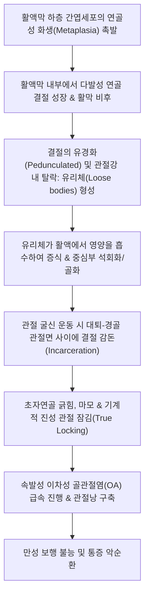
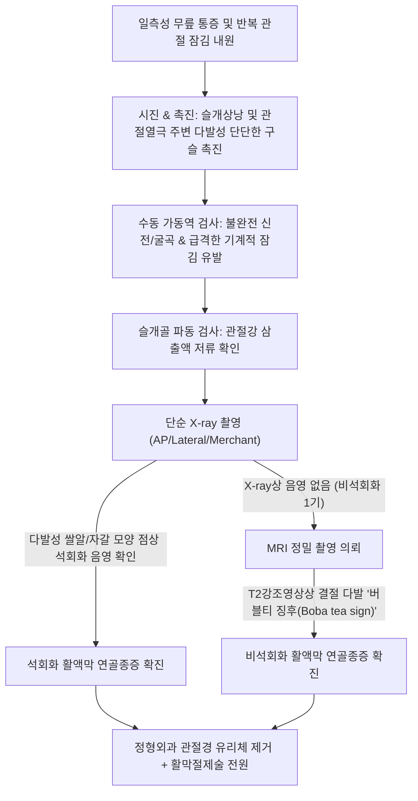
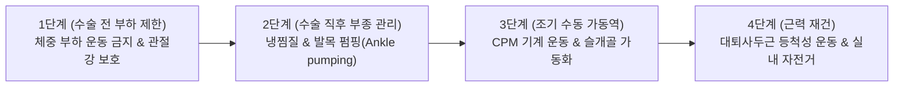

# 🩺 활액막성 연골종증 (Synovial Chondromatosis)

> **핵심 3줄 요약 (Key Summary)**:
> - 📍 병소 부위 & 해부·병태생리: 관절 활액막(Synovium), 건초, 윤활낭의 미분화 간엽세포가 양성 연골성 화생(Cartilaginous metaplasia)을 일으켜 다발성 연골성 결절을 형성하고, 이들이 관절강 내로 떨어져 나와 석회화·골화되며 다발성 유리체(Loose bodies, '자갈 관절')를 형성하는 드문 증식성 질환 (슬관절 70% 호발).
> - 🚩 전형적 임상 양상: 30~50대 남성에서 일측성 무릎 관절의 만성 둔통, 반복적인 관절 종창(Effusion), 움직일 때 덜컹거리는 관절 잠김(Locking/Catching), 관절 내 단단한 움직이는 결절(Joint mice) 촉진.
> - 🛠️ 핵심 검사 & 치료 전략: 촉진상 다발성 가동성 결절 및 굴신 장애, X-ray상 다발성 쌀알/자갈 모양 석회화 음영 및 MRI상 '버블티 징후(Boba tea sign)', 밀버그(Milgram) 3단계 병기 분류. 확진 시 정형외과 관절경적 유리체 제거술 및 활막 절제술(Synovectomy)이 근본 치료이며, 한의 진료실에서는 수술 전 통증 완화 및 수술 후 관절 강직·재발 방지 침구·약침·한약 재활 적용.
> - ⚠️ 응급 의뢰 레드플래그: 관절낭의 급격한 골 파괴성 팽창, 주변 연부조직으로의 침윤 및 비정상적 악성 골화(활막 연골육종/Synovial chondrosarcoma 의심 즉각 3차 병원 정형외과 종양분과 의뢰).

---

## 📌 목차
1. [질환 개요 & 해부학적 병태생리](#1-질환-개요--해부학적-병태생리)
2. [병태생리 메커니즘 & 생체역학적 악순환 네트워크](#2-병태생리-메커니즘--생체역학적-악순환-네트워크)
3. [임상 증상 & 이학적 검사(Physical Exam) 알고리즘](#3-임상-증상--이학적-검사physical-exam-알고리즘)
4. [감별 진단 매트릭스 (Differential Diagnosis)](#4-감별-진단-매트릭스-differential-diagnosis)
5. [한의 통합 치료 프로토콜 (침·약침·추나·한약)](#5-한의-통합-치료-프로토콜-침약침추나한약)
6. [양방 치료 & 병용·의뢰 기준 (Conventional Treatment & Referral)](#6-양방-치료--병용의뢰-기준-conventional-treatment--referral)
7. [재활 운동 & 생활습관 티칭 가이드](#7-재활-운동--생활습관-티칭-가이드)
8. [💡 사용자 진료실 핵심 필기 & 임상 노하우 (Melt-In 잔여 심화 집약)](#8-💡-사용자-진료실-핵심-필기--임상-노하우-melt-in-잔여-심화-집약)
9. [출처 및 학술 참고 문헌 (References)](#9-출처-및-학술-참고-문헌-references)

---

## 1. 질환 개요 & 해부학적 병태생리

* **질환 정의**:
  * 활액막성 연골종증(Synovial Chondromatosis)은 관절낭의 활액막 하층 결합조직(Subsynovial tissue)에서 간엽 전구세포가 비정상적인 연골 화생을 거쳐 수십~수백 개의 유리 연골성 소결절(Cartilaginous nodules)을 만들어내는 양성 단클론성 증식성 질환이다.
  * 형성된 결절들이 활액막 표면에서 떨어져 나와 관절강 내를 떠돌아다니며, 활액으로부터 영양을 흡수하여 크기가 점점 커지고 중심부 석회화 및 골화(Ossification)가 진행되어 활막 골연골종증(Synovial Osteochondromatosis)으로 이행한다.

* **해부학적 호발 부위**:
  * **슬관절(무릎)**: 전체 증례의 60~70%를 차지하는 압도적 제1호발 관절이다.
  * 기타 대관절: 고관절(약 20%), 주관절, 견관절, 족관절 순으로 발생하며, 대다수(95% 이상)에서 **단일 관절(일측성)**을 침범한다.
  * 관절 외 형태: 활막낭(Bursa)이나 건초(Tendon sheath) 주변에서도 건초 활막 연골종증 형태로 발생할 수 있다.

* **원발성 vs 이차성 구분**:
  * **원발성(Primary)**: 기저 관절 질환 없이 염색체(1p21-22 등) 변이에 의해 활액막 자체에서 자율적으로 연골 결절이 생성되는 진성 종양성 질환 (결절들의 크기가 균일함).
  * **이차성(Secondary)**: 심한 퇴행성 관절염, 박리성 골연골염([[박리성 골연골염]]), 골절 등으로 인해 떨어져 나온 관절 연골 파편이 활액막에 박혀 증식하는 반응성 병태 (결절들의 크기와 모양이 매우 불규칙하고 환자 연령이 더 높음).

* **역학**:
  * 30~50대 성인에서 호발하며, 남성이 여성보다 약 2~3배 높게 발생한다.

---

## 2. 병태생리 메커니즘 & 생체역학적 악순환 네트워크

* **밀그램(Milgram) 병리학적 3단계 분류**:
  * **1기 (초기 - 활성 활막기, Active Synovial Stage)**:
    * 활액막 내부에서만 연골 화생이 활발히 일어나는 단계. 관절강 내 유리체는 아직 없거나 극소수임. 단순 X-ray에서는 음영이 나타나지 않아 진단이 늦어짐.
  * **2기 (중기 - 전이 활막기, Transitional Stage)**:
    * 활액막 내 연골 화생과 함께, 관절강 내로 유리체가 다수 방출되어 공존하는 단계. 방사선상 석회화된 결절들이 관찰되기 시작함.
  * **3기 (후기 - 정지 유리체기, Quiescent Stage)**:
    * 활액막의 연골 화생 활동은 중단되었으나, 관절강 내에 거대한 다발성 유리체(골화 결절)들만 가득 남아 관절면을 갉아먹는 단계.

---

## 3. 임상 증상 & 이학적 검사(Physical Exam) 알고리즘

### 임상 증상

* **특징적 관절 잠김(Locking) 및 걸림(Catching)**:
  * 걷다가 갑자기 무릎이 특정 각도에서 굳어버려 펴지지도 구부러지지도 않다가, 다리를 흔들면 무언가 빠져나가는 느낌과 함께 다시 움직여지는 '기계적 관절 잠김' 현상.
* **만성 반복성 관절 종창 (Effusion)**:
  * 특별한 외상 없이도 무릎에 물이 차고 붓는 현상이 수개월~수년간 만성적으로 반복됨.
* **만져지는 가동성 결절 (Joint Mice / Palpable Nodules)**:
  * 환자 스스로 "무릎 안에서 작은 구슬이나 자갈 같은 것이 만져지는데, 만질 때마다 위치가 도망 다닌다"고 호소한다.
* **운동 가동역의 점진적 상실**:
  * 관절강 전·후방 구획을 가득 채운 결절들로 인해 무릎 완전 굴곡 및 완전 신전이 영구적으로 제한된다.

### 이학적 검사 (Physical Examination)

1. **관절강 내 다발 결절 촉진 (Loose Body Palpation)**:
   * 슬개상낭(Suprapatellar pouch), 슬와부(Popliteal fossa), 내·외측 관절낭 주변을 손가락으로 누를 때 0.5~2cm 크기의 단단하고 매끄러운 다발성 결절들이 촉지된다.
2. **수동 굴신 저항 및 잠김 검사**:
   * 무릎을 천천히 굽혔다 펼 때 특정 각도에서 뼈가 걸리는 저항감이 발생하며, 강제로 꺾으려 할 때 날카로운 통증이 유발된다.
3. **영상의학적 특징**:
   * **X-ray**: 관절강 내에 수십 개에서 수백 개의 둥글거나 타원형인 쌀알·자갈 모양의 석회화 결절(Ring-and-arc calcification) 관찰 (단, 1기 환자의 30%는 연골 상태라 X-ray에 안 보임).
   * **MRI**: T2 강조영상에서 고신호 활액 속에 저신호 결절들이 알알이 박혀 있는 이른바 **'버블티 징후(Boba Tea Sign)'**가 질환의 특이적 소견이다.

---

## 4. 감별 진단 매트릭스 (Differential Diagnosis)

| 감별 질환 | 호발 연령/기전 | 방사선학적 특징 | 결절의 특징 및 개수 | 감별 포인트 |
| :--- | :--- | :--- | :--- | :--- |
| **활액막성 연골종증** | 30~50대, 특발성 | **다발성 자갈/쌀알 석회화, MRI 버블티 징후** | 수십~수백 개, 크기 비교적 균일 | 활막 화생, 단일 대관절 호발 |
| **[[박리성 골연골염]] (OCD)** | 10~20대, 허혈/외상 | 대퇴골 내과 관절면 결손 분리 | **보통 1~2개의 고립성 유리체** | 대퇴과 관절면 연골하 결손 뚜렷 |
| **퇴행성 골관절염 이차성 유리체** | 60대 이상, 마모 | 심한 관절강 협소, 거대 골극 형성 | 1~3개의 불규칙하고 거친 골편 | 기저 퇴행성 변화 극심, 유리체 소수 |
| **색소 융모결절성 활막염 ([[PVNS]])**| 20~40대, 활막 증식 | **골 미란(Erosion), MRI상 혈철소(Hemosiderin) 저신호** | 연골 결절 없음, 융모상 활막 비후 | 관절천자 시 **적갈색/암적색 혈성 활액** |
| **연골육종 (Chondrosarcoma)** | 고령, 악성 종양 | 광범위한 골 피질 파괴, 연부조직 종괴 | 침윤성 거대 종괴 | **활막 연골종증의 악성 변성 의심 (0.5% 미만)** |

---

## 5. 한의 통합 치료 프로토콜 (침·약침·추나·한약)

> ⚠️ **한의 진료실 절대 치료 원칙**:
> - 활액막성 연골종증의 근본적인 완치는 **외과적 관절경 유리체 제거술 및 활막 절제술**이다. 관절 내에 존재하는 물리적 자갈(유리체)은 침이나 한약으로 녹여 없앨 수 없다.
> - 따라서 한의 치료의 명확한 역할은:
>   1. **수술 전 대기기**: 관절강 내 염증성 삼출액 조절, 대퇴사두근 근위축 방지, 통증 완화.
>   2. **수술 후 재활기**: 관절낭 유착 방지, 관절 가동역 조기 회복, 미세 잔여 활막의 재발 억제 및 연골 보호.

### 침구 치료 프로토콜

* **혈위 선정**:
  * 슬관절 국소 혈위: [[독비]](ST35), [[내슬안]](EX-LE4), [[양릉천]](GB34), [[음릉천]](SP9), [[혈해]](SP10), [[양구]](ST34).
  * 슬와부 혈위: [[위중]](BL40), [[위양]](BL39), [[음곡]](KI10).
* **자침 기법**:
  * 슬안혈 사자법: 관절낭 주위 울혈을 제거하고 관절강 내 삼출액의 자연 흡수를 촉진.
  * 전기침(EA) 치료: [[혈해]]-[[양구]] 및 [[독비]]-[[양릉천]]에 2Hz 저주파를 15분간 통전하여 관절인성 근육 억제(AMI)를 극복하고 대퇴사두근 근력을 유지한다.
* **도침 치료 (Acupotomy) - 수술 후 유착기 적응증**:
  * 수술 후 3~6개월 경과 시 관절경 포털 부위 및 슬개골 지대 주변에 발생한 반흔성 섬유 유착 부위에 한하여 침도로 안전하게 박리하여 관절 굴신 가동역을 정상화한다. (수술 전 유리체가 있는 상태에서 무리한 관절강 도침 조작은 연골 손상을 악화시키므로 금기).

### 약침 치료 프로토콜

* **처방 약침**:
  * [[신바로약침]] (GCSB-5): 슬안혈 및 관절낭 주변으로 0.5~1.0cc 주입하여 유리체 마찰로 자극받은 활막의 비정상적 염증을 진정시키고 초자연골 기질 파괴를 억제한다.
  * 중성어혈약침: 수술 후 관절강 내 잔여 혈종 및 부종 흡수를 위해 관절 주위 0.3cc 시술.

### 추나의학적 접근 (Chuna Manual Therapy)

* **관절낭 신장 및 슬개골 가동술 (수술 후 재활)**:
  * 수술 후 굳어진 관절낭을 부드럽게 이완시키고 슬개골의 상하 활주 가동성을 회복시킨다. (주의: 수술 전 유리체가 끼어 있는 상태에서의 강제 굴신 추나는 연골을 긁어 파괴하므로 금기).

### 변증별 한약 치료 (Herbal Medicine)

* **담어교저(痰瘀交阻)형** (관절 내 이물감, 다발성 결절 촉진, 찌르는 통증):
  * [[도담탕]](導痰湯) 합 [[활락효영단]](活絡效靈丹) 가감: [[반하]], [[남성]], [[진피]], [[단삼]], [[당귀]], [[도인]], [[우슬]]을 배합하여 비정상적인 활막 담음(痰飮)과 어혈성 덩어리를 삭히고 순환을 촉진.
* **습열저체(濕熱阻滯)형** (관절 종창 극심, 열감, 관절강 삼출액 저류):
  * [[사묘환]](四妙丸) 또는 [[당귀점통탕]](當歸拈痛湯) 가감: 황백, 창출, 방기, 택사를 배합하여 삼출액 흡수 촉진.
* **수술 후 간신부족(肝腎不足) & 기혈허약(氣血虛弱)** (수술 후 연골 재생, 재발 방지):
  * [[독활기생탕]](獨活寄生湯) 합 [[보중익기탕]](補中益氣湯): [[두충]], [[속단]], [[구척]], [[골쇄보]], [[황기]]를 사용하여 관절 연골을 보호하고 근력을 재건.

---

## 6. 양방 치료 & 병용·의뢰 기준 (Conventional Treatment & Referral)

### 수술적 치료 (Surgical Management) — 표준 치료

* **관절경적 유리체 제거술 및 부분/전 활막 절제술 (Arthroscopic Removal & Synovectomy)**:
  * 관절경을 통해 관절 내에 떠돌아다니는 모든 연골성 유리체를 세척 및 흡인 제거하고, 연골 화생을 일으키는 병변 활액막을 완전히 절제한다.
  * 광범위 활막 절제를 병행해야 재발률(약 10~25%)을 최소화할 수 있다.
* **개방성 활막 절제술**:
  * 슬와부 후방 구획까지 결절이 거대하게 침범하여 관절경 접근이 불가능한 경우 개방성 수술 적용.

### 한의 병용 판단 및 의뢰 기준 (Referral Criteria)

* **정형외과 즉각 의뢰 (Surgical Referral)**:
  * X-ray 또는 MRI상 다발성 유리체가 확인되고 기계적 관절 잠김(Locking)이 반복되는 환자는 관절 연골 파괴를 방지하기 위해 지체 없이 정형외과 관절경 수술을 의뢰한다.
* **악성 변성 레드플래그 (Red Flags - 활막 연골육종 의심)**:
  * 매우 드물지만(0.5% 미만) 만성 활막 연골종증에서 악성 연골육종(Chondrosarcoma)으로 변성될 수 있다.
  * 단기간 내 급격한 무릎 종괴의 비대, 뼈 피질을 뚫고 나가는 골 파괴 소견, 극심한 야간통 관찰 시 3차 대학병원 정형외과 종양분과 긴급 전원.

---

## 7. 재활 운동 & 생활습관 티칭 가이드

### 단계별 재활 운동

* **수술 전 티칭**:
  * 무릎 안에서 무언가 덜컹거리며 끼이는 느낌이 들 때 절대로 무리하게 무릎을 꺾지 말 것. 다리를 부드럽게 흔들어 결절이 빠져나오게 한 후 체중을 실어야 관절 연골의 패임(Gouging)을 막을 수 있다.
* **수술 후 1~2주 (초기 회복기)**:
  * 능동-보조 관절 가동 운동(AAROM) 및 대퇴사두근 세팅(Quad sets).
  * 림프 배액 및 발목 펌핑 운동으로 수술 후 관절 혈종 흡수.
* **수술 후 2~6주 (근력 재건기)**:
  * 실내 고정식 자전거 타기 (부하 없이 부드럽게 페달 밟기).
  * 평지 보행 및 수영(자유형/배영 킥, 평영 금지) 시작.

---

## 8. 💡 사용자 진료실 핵심 필기 & 임상 노하우 (Melt-In 잔여 심화 집약)

* **진료실 오진 주의 — "단순 퇴행성 관절염으로 오인하여 시간 낭비하지 마라"**:
  * 40대 환자가 "무릎에 물이 자꾸 차고 가끔 걸려요"라며 내원할 때, X-ray를 대충 보고 단순 퇴행성 관절염으로 진단하여 수개월간 침만 놓는 실수를 범해서는 안 된다.
  * 반드시 관절낭 주변을 손가락으로 깊이 만져보아 **'구슬처럼 굴러다니는 결절(Joint mice)'**이 있는지 확인해야 한다.
  * 1기 환자는 X-ray에 결절이 안 보일 수 있으므로, 반복적 잠김과 종창이 있는 일측성 무릎은 주저 없이 MRI를 권유하여 '버블티 징후'를 조기 포착해야 한다.
* **한의 치료의 진정한 승부처는 '수술 후 관리'**:
  * 관절경으로 수술을 마친 환자들은 관절낭 섬유화로 인해 무릎이 끝까지 다 펴지지 않거나 구부러지지 않는 강직을 호소한다.
  * 이때 무리한 도수 조작 대신 [[독비]], [[내슬안]] 침구 치료와 신바로약침, 부드러운 관절 견인 추나를 4~8주간 적용하면 관절 가동역이 100% 회복되고 재발성 활막염을 성공적으로 차단할 수 있다.

---

## 9. 출처 및 학술 참고 문헌 (References)

Firman EJ et al. (2026). Advanced Diffuse Knee Synovial Chondromatosis with Large Tricompartmental Nodules. *Int*, 128: 110950. PMID: 42578183

Cao Z et al. (2025). Clinical Outcomes of Arthroscopic Loose-Body Removal and Synovectomy for Knee Synovial Chondromatosis. *Orthop J Sports Med*, 13(9): 2325967125135678. PMID: 41368014

Agrawal AC et al. (2026). The Boba Tea Sign: Magnetic Resonance Imaging Finding in Synovial Chondromatosis. *J Orthop Case Rep*, 16(2): 88-94. PMID: 42597802
