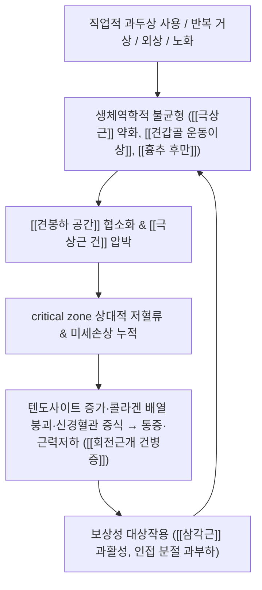

# 🩺 [[회전근개 건병증]] (Rotator Cuff Tendinopathy / 肩袖 腱病症, ICD-10 M75.1 / KCD-8 M75.1)

![[회전근개 건병증_1_2.jpg|540]]
> [그림 1: ① 병태생리·영상 — Glenohumeral position in rotator cuff tear.jpg]
![[회전근개 건병증_2_3.jpg|540]]
> [그림 2: ② 관련 해부 구조물 — Rotator Cuff Tear.jpg]
![[회전근개 건병증_3.jpg|540]]
> [그림 3: ③ 치료·시술점 — Basic histology was similar in the pain-free and painful groups. Photomicrographs show the haematoxylin and eosin staini]

> **핵심 3줄 요약 (Key Summary)**:
> - 📍 **병소 부위 & 해부·병태생리**: [[극상근]](supraspinatus)을 중심으로 한 [[회전근개]] 4개 근육 건 부착부의 **퇴행성·과사용성 건병증**. 견봉하 공간(subacromial space) 내 [[견봉]] 전하방과 [[상완골두]] 사이를 통과하는 **critical zone**의 상대적 혈류 저하, 반복적 인장·압박 부하, 콜라겐 섬유 배열 붕괴 및 기질 변성이 핵심 기전이다.
> - 🚩 **전형적 임상 양상 & 3대 징후**: ① 견부 전외측 통증(야간통 악화) ② 60~120도의 **통증성 호(painful arc)** 및 상방 거상·후방 도달 시 통증 재현 ③ 외전·외회전 **저항성 근력 저하**. 통증은 C5 피부분절(삼각근 부위)에 국한되어 주로 팔꿈치 이하로 내려가지 않는다.
> - 🛠️ **핵심 감별 검사 & 한·양방 다각적 치료 전략**: [[Neer 검사]], [[Hawkins-Kennedy 검사]], [[Jobe(Empty can) 검사]], [[견봉하 주사 검사]] 등을 **조합**하여 평가(개별 검사의 진단 정확도는 낮음). 치료는 **점진적 부하 운동치료가 중심축**이며(Desmeules 2025 PMID 40165544 / Littlewood 2012 PMID 22507359), 여기에 침·약침·추나·한약의 [[한의 통합 치료]]를 병용한다.
> - ⚠️ 응급 의뢰 레드플래그 & 악화 요인: 급성 외상 후 발생한 **가성마비(pseudoparalysis)** 및 완전 파열, 발열·발적·급성 종창을 동반한 **감염성 관절염**, 야간통·체중감소·흡연력을 동반한 **종양/Pancoast 병변**, 양측성 증상·보행장애·상지 반사항진을 보이는 **경추 척수병증**, 그리고 극심한 급성 통증을 유발하는 **급성 석회화 건병증**은 즉시 양방 의뢰 대상이다.

---

## 📌 목차
1. [질환 개요 & 해부학적 병태생리](#1-질환-개요--해부학적-병태생리)
2. [병태생리 메커니즘 & 생체역학적 악순환 네트워크](#2-병태생리-메커니즘--생체역학적-악순환-네트워크)
3. [임상 증상 & 이학적 검사(Physical Exam) 알고리즘](#3-임상-증상--이학적-검사physical-exam-알고리즘)
4. [감별 진단 매트릭스 (Differential Diagnosis)](#4-감별-진단-매트릭스-differential-diagnosis)
5. [한의 통합 치료 프로토콜 (침·약침·추나·한약)](#5-한의-통합-치료-프로토콜-침약침추나한약)
6. [재활 운동 & 생활습관 티칭 가이드](#6-재활-운동--생활습관-티칭-가이드)
7. [💡 사용자 진료실 핵심 필기 & 임상 노하우 (Melt-In 잔여 심화 집약)](#7--사용자-진료실-핵심-필기--임상-노하우-melt-in-잔여-심화-집약)
8. [출처 및 학술 참고 문헌 (References)](#8-출처-및-학술-참고-문헌-references)

---

## 1. 질환 개요 & 해부학적 병태생리

* **질환 정의 및 분류**:
  * **정의**: 회전근개(rotator cuff)를 구성하는 4개 근육, 즉 [[극상근]], [[극하근]], [[소원근]], [[견갑하근]]의 **건(tendon) 및 건-골 부착부(enthesis)** 에 발생한 통증·기능 장애 증후군. 해부학적으로는 견봉하 점액낭과 극상근 건이 가장 흔히 이환된다.
  * **용어 정리(임상적으로 중요)**: 과거의 **"건염(tendinitis)"** 은 급성 염증세포 침윤을 전제하는 용어이나, 만성 병변 조직에서는 호중구·림프구 등 **염증세포가 상대적으로 적게 관찰되고**, 대신 텐도사이트(tendocyte) 증가, 콜라겐 섬유의 해리·배열 소실, 점액양 변성(mucoid degeneration), 신경혈관 증식(neovascularization) 및 이에 동반된 통증 신경분포가 관찰된다. 따라서 현재는 **"건병증(tendinopathy)"** 이 더 적절한 병태학적 용어로 통용된다. 본 노트의 별칭에 건염을 병기한 것은 **검색 편의용**이며, 병태 개념은 건병증을 기준으로 한다.
  * **분류**:
    * **병변 성상별**: ① 퇴행성/과사용성 건병증(비석회화성), ② **석회화 건병증(calcific tendinopathy)** — [[Chianca 2018]] 참조. 석회화 건병증은 ICD-10 **M75.3** 으로 별도 코드가 부여된다.
    * **동반 손상별**: 건병증 단독 / 부분층 파열(partial-thickness tear) / 전층 파열(full-thickness tear, 완전 파열).
    * **파열의 복원 가능성별**: 복원 가능 파열(repairable) / **비복원성 파열(irreparable)** — [[Oh 2018]] 참조.
  * **역학 및 호발 특성**: 견관절 통증의 가장 흔한 원인군에 속한다. **중년 이후(대략 40~60대)** 에 호발하며, 연령 증가에 따라 건 자체의 퇴행성 변화와 건 부착부 미세손상 누적이 증가한다. 직업적으로는 **반복적인 어깨 높이 이상(overhead) 작업, 상방 거상·도달 동작, 진동 공구 사용, 중량물 취급** 종사자에서 발생률이 높다. 스포츠에서는 야구·수영·테니스·배드민턴 등 오버헤드 동작 종목이 위험군이다.
  * **위험요인(체계적 문헌고찰 근거)**: [[Leong 2019]] (PMID 31489438)의 체계적 문헌고찰 및 메타분석은 **연령, 흡연, 비만(BMI 상승) 등 대사·생활습관 요인, 당뇨 등 대사성 질환, 유전적 소인, 직업적 과사용** 등을 위험요인으로 정리하였다. 다만 **개별 위험요인의 정확한 효과크기(OR/RR)와 연구 간 이질성**은 원문 대조가 필요하며, 본 노트에서는 수치를 확정적으로 기재하지 않는다(근거 미확인).
* **관련 해부학적 구조물**:
  * **골격 및 관절**:
    * **[[견봉]](acromion)**: 견봉의 형태학적 분류(Biglliani 분류) 중 **제3형(hook type, 갈고리형)** 은 견봉하 공간을 좁혀 극상근 건의 기계적 압박 위험을 높이는 해부학적 변이로 알려져 있다.
    * **[[견봉하 공간]](subacromial space)**: 견봉 하면, 견봉하 점액낭, 극상근 건, 상완골두로 구성되며, **어깨 거상 시 이 공간의 실효 용적이 감소**한다.
    * **[[견쇄관절]](AC joint)**: 하방 골극 형성 시 극상근 건을 자극할 수 있어 감별 대상이 된다.
    * **[[견갑흉곽 관절]](scapulothoracic joint)**: 견갑골 상방회전·후경사 실패 시 견봉하 공간이 좁아진다.
    * **[[상완골두]] 및 결절부(tuberosity)**: 극상근·극하근·소원근은 대결절에, 견갑하근은 소결절에 부착한다.
  * **근육 및 근막**:
    * **[[극상근]](supraspinatus)**: 외전 개시(첫 15~30도) 관여 및 견관절 안정화. **회전근개 중 가장 흔히 이환**되며, 특히 건 부착부에서 약 1 cm 근위부의 "critical zone"이 상대적 무혈관 영역으로 알려져 있다.
    * **[[극하근]](infraspinatus)**, **[[소원근]](teres minor)**: 외회전 담당. 극하근·소원근 건병증은 후방 견부 통증 및 외회전 근력 저하로 나타난다.
    * **[[견갑하근]](subscapularis)**: 내회전 담당.
    * **[[삼각근]](deltoid)**: 회전근개 파열 시 보상적 과활성화로 통증이 삼각근 부착부로 확산될 수 있다.
    * **[[견갑골 주위근]]**: [[전거근]], [[승모근]](특히 하부 승모근), [[소흉근]] 단축은 견갑골 운동이상(dyskinesis)의 원인이자 결과로, 회전근개 건병증의 **근본적 생체역학 원인**으로 취급된다.
    * **[[흉추]]**: 흉추 후만 증가 및 가동성 저하는 견갑골 상방회전을 제한하여 견봉하 부하를 증가시킨다.
  * **신경 및 혈관**:
    * **[[견갑상신경]](suprascapular nerve)**: C5-C6 기원으로 극상근과 극하근을 지배하며, **견갑상와(suprascapular notch)** 와 **견갑극 기저부의 견갑절흔(spinoglenoid notch)** 두 곳에서 포착될 수 있다. 만성 회전근개 병변에서 견갑상와 부위의 신경 포착이 견부 심부 통증 및 근력 저하를 악화시키는 감별 포인트이다.
    * **[[액와신경]](axillary nerve)**: C5-C6, 삼각근 및 견관절 피부 지배. 견관절 탈구나 근위 상완골 골절 후 손상 여부를 확인해야 한다.
    * **[[견갑배신경]](dorsal scapular nerve)**, **[[흉장신경]](long thoracic nerve)**: 견갑골 안정화 근육들의 신경 지배로, 기능 이상 시 견갑골 운동이상에 관여한다.
    * **C5 신경근**: 통증의 피부분절 분포 및 경추 신경근병증 감별의 핵심 기준점이다.

---

## 2. 병태생리 메커니즘 & 생체역학적 악순환 네트워크

### 1) 해부학적 포착 및 압박 기전
* **견봉하 공간 협소화 요인(외인성 기전, extrinsic)**:
  * 견봉 형태 변이(제3형 hook 견봉), 견봉하 골극, 견쇄관절 하방 골극, 상완골두의 상방 이동(회전근개 기능 저하 시).
  * 어깨 **거상 60~120도 구간**에서 견봉하 공간 내 건과 점액낭의 압박 부하가 최대로 증가하며, 이는 임상적으로 관찰되는 **통증성 호(painful arc)와 각도가 일치**한다.
* **건 자체의 퇴행성 변화(내인성 기전, intrinsic)**:
  * 극상근 건 부착부 1 cm 근위부의 **critical zone**은 상완골두와 견봉 사이에서 반복적인 인장·압박·전단력을 받으면서 상대적 혈류 공급이 취약한 부위로 기술된다.
  * 미세손상 → 치유 실패(failed healing) → 점액양 변성·지방 변성 → 건의 탄성 저하 및 기계적 강도 감소의 악순환. 증상 없는 고령자에서도 초음파상 건 병변이 흔히 관찰되므로, **영상 소견만으로 증상을 확진하지 않도록 주의**한다.
* **염증–퇴행 연속체**: 급성기에는 일부 염증성 매개체 및 견봉하 점액낭염이 동반될 수 있으나, 만성기에는 염증세포 침윤이 상대적으로 적은 **퇴행성 건병증 양상**으로 이행한다. 이 때문에 단순 소염 위주의 치료만으로는 만성기의 기능 회복이 제한될 수 있으며, **점진적 기계적 부하(progressive loading)를 통한 건 조직 재구성**이 치료의 핵심이 된다.

### 2) 생체역학적 연쇄 반응 (Kinetic Chain)
* **견갑상완 리듬(scapulohumeral rhythm)** 의 붕괴: 정상적으로 견관절 거상 시 견갑흉곽과 상완와의 움직임이 일정 비율로 협응한다. 견갑골 상방회전·후경사가 부족하면 견봉하 공간이 좁아져 극상근 건 부하가 증가한다.
* **상부 승모근 과활성 + 하부 승모근·전거근 약화**: 어깨 으쓱(shrug) 패턴으로 거상하게 되어 견봉하 공간 협소화가 심화된다.
* **흉추 후만 증가**: 견봉을 전방·하방으로 기울여 견봉하 공간을 감소시키고, 견갑골의 상방회전 가동범위를 제한한다.
* **견관절 후방 관절낭·내회전근 긴장**: 내회전 결손(GIRD)이 있는 오버헤드 운동선수에서 외회전 비율이 감소하고, 상완골두가 전상방으로 이동하며 견봉하 부하가 증가하는 패턴이 관찰된다.
* **인접 분절 보상**: 견관절 가동성 저하를 경추 흉추 과운동 및 요추 신전으로 보상하는 패턴이 나타나며, 이는 경추성 통증·요추 통증을 동반 증상으로 유발할 수 있다.

---

## 3. 임상 증상 & 이학적 검사(Physical Exam) 알고리즘

### 1) 주소증 및 신경학적 증상
* **통증(가장 핵심)**:
  * **부위**: 견부 **전외측** 및 삼각근 부착부 심부 통증. C5 피부분절 분포에 대응한다.
  * **양상**: 둔통·작열감 혼재. **야간통**이 특징적이며 특히 이환 측으로 누운 자세에서 악화된다. "팔을 어디에 두어야 할지 모르겠다"는 표현이 전형적이다.
  * **유발 동작**: 상방 거상(옷장 위 물건 집기), 후방 도달(등 뒤로 손 넣기, 브래지어 채우기), 머리 빗질, 무거운 물건 들기. **특정 각도(60~120도)에서 통증이 집중되는 painful arc** 가 관찰된다.
  * **방사 여부**: 통증은 주로 견부 및 상완 근위부에 국한되며, **팔꿈치 이하로 명확히 내려가는 방사통은 회전근개 단독 병변보다 [[경추 신경근병증]]을 시사**한다.
* **운동 장애**:
  * **저항성 외전 및 외회전 근력 저하**: 극상근·극하근 병변 시 명확해진다. 근력 저하가 **통증성(통증 때문에 힘을 못 씀)** 인지 **진성 마비성**인지 구분이 치료 방향 결정에 중요하다.
  * **통증성 운동 제한**: 수동 관절가동범위는 비교적 보존되나 통증으로 제한된다. **수동·능동 모두 광범위하게 제한되면 [[유착성 관절낭염]](동결견)을 우선 고려**한다.
  * **가성마비(pseudoparalysis)**: 능동 거상이 거의 불가능할 정도로 심한 경우, 완전 파열 또는 급성 극심 통증을 의미할 수 있어 정밀 평가가 필요하다.
  * **견갑골 운동이상**: 견갑골 내측연 돌출(winging), 거상 시 조기 으쓱 패턴.
* **신경학적 증상(주의)**:
  * **감각 이상**: 순수 회전근개 건병증에서 피부분절 감각 저하는 원칙적으로 나타나지 않는다. **저림·감각 저하가 동반되면 경추 신경근병증, 견갑상신경 포착, 흉곽출구증후군 등을 반드시 감별**한다.
  * **운동 장애(신경성)**: 견갑상신경 포착 시 극상근·극하근 위축이 동반될 수 있다. 견갑극 상방 및 견갑상와 부위 압통이 단서가 된다.
* **혈관/자율신경 증상**: 회전근개 건병증 자체로는 원칙적으로 냉감·청색증·맥박 약화를 유발하지 않는다. 이러한 증상이 있으면 혈관성 병변, [[복합부위통증증후군]], 흉곽출구증후군을 감별한다.

### 2) 필수 이학적 검사법 (Physical Examination)

> **중요 원칙**: 회전근개 건병증은 **단일 이학적 검사로 확진할 수 없다.** 개별 특수검사의 민감도·특이도가 충분하지 않아 **여러 검사의 조합 + 병력 + 영상(초음파/MRI) + 견봉하 주사 반응**을 종합하여 판단한다. 각 검사의 정확한 민감도/특이도 수치는 본 노트에서 특정하지 않는다(근거 미확인).

| 검사 | 시행 방법 | 양성 소견 | 임상적 해석 |
| :--- | :--- | :--- | :--- |
| [[Neer 검사]] | 견갑골 고정 후 상완골을 **내회전 상태로 최대 전방거상** | 견부 전외측 통증 유발 | 견봉하 충돌·극상근 건 자극 |
| [[Hawkins-Kennedy 검사]] | 견관절 90도 전방거상 + 주관절 90도 굴곡 후 **상완골 내회전** | 견부 통증 유발 | 견봉하 공간 협소화에 의한 충돌 |
| [[Jobe(Empty can) 검사]] | 견관절 90도 외전, 30도 전방, **엄지 하방(내회전)** 상태에서 저항 외전 | 통증 및/또는 근력 저하 | 극상근 건병증·파열 |
| [[Full can 검사]] | 위와 동일하나 **엄지 상방** | 통증·근력 저하 | 극상근 평가(Empty can의 통증 위양성 보완) |
| [[Drop arm 검사]](Codman) | 수동으로 90도 외전 후 **천천히 능동 하강** 유도 | 팔이 갑자기 낙하 | 광범위/전층 파열 강력 시사 |
| [[외회전 지연 검사]](External rotation lag sign) | 견관절 약간 외전 + 주관절 90도 굴곡, 수동 최대 외회전 후 이완 | 자세 유지 실패(lag) | 극하근·소원근 파열 |
| [[Hornblower 검사]] | 견관절 90도 거상 상태에서 저항 외회전 | 통증·근력 저하 | 소원근·극하근 병변 |
| [[Lift-off 검사 / Belly-press 검사]] | 등 뒤로 손을 넣어 들어올리기 / 배에 손바닥 대고 저항 | 통증·근력 저하, 손목 굴곡 보상 | 견갑하근 병변 |
| [[Speed 검사]], [[Yergason 검사]] | 주관절 신전·회외 상태 저항 굴곡 / 전완 회외 저항 | 전방 견부 통증 | 이두근 장두 건병증 감별 |
| [[견봉하 주사 검사]] | 국소마취제를 견봉하 공간에 주입 후 재평가 | 통증의 유의한 일시적 소실 | 견봉하 병변(건병증/점액낭염) 시사. **경추성 통증과의 감별에 유용** |

* **추가 평가**:
  * **경추 선별검사**: Spurling 검사, 경추 압박/견인 검사, 상지 근력·반사·감각 검사 — 회전근개 단독 병변인지 경추 기원인지 감별.
  * **견갑골 평가**: 견갑골 운동이상(dyskinesis), 정적 자세, 흉추 가동성.
  * **흉곽출구 검사**(Adson, Wright, Roos): 저림·부종 동반 시.
  * **영상**: 초음파(동적 검사 가능, 석회화·파열 평가), MRI(파열 크기·지방 변성·비복원성 판단), 단순방사선(견봉 형태, 골극, 석회 침착).

---

## 4. 감별 진단 매트릭스 (Differential Diagnosis)

| 감별 질환 | 호발 병소 및 원인 | 주소증 차이점 | 특이적 이학적 검사 소견 |
| :--- | :--- | :--- | :--- |
| **[[회전근개 건병증]]** (본 질환) | 극상근 건 부착부, 견봉하 공간 | 전외측 견부통, 야간통, painful arc, 저항성 근력 저하 | [[Jobe 검사]], [[Hawkins-Kennedy 검사]] 양성 / 수동 ROM 비교적 보존 |
| [[유착성 관절낭염]](동결견) | 관절낭·액와 주름의 염증성 섬유화 | **수동·능동 ROM 모두 전방향 제한**(특히 외회전), 야간통 극심 | 외회전 수동 제한이 두드러짐 / 단순 건병증보다 제한 범위 광범위 |
| [[삼각근하 점액낭염]] | 견봉하 점액낭 | 증상이 건병증과 거의 동일 | [[견봉하 주사 검사]]에서 즉각적 호전 / 초음파상 점액낭 비후·삼출 |
| [[석회성 건염]] | 극상근 건 내 칼슘 침착 | **급성기 극심통(수면 불가 수준)**, 만성기는 통증 경미 | 단순방사선·초음파에서 석회 침착 확인 ([[Chianca 2018]] PMID 29350647) |
| [[회전근개 완전 파열]] | 건 전층 결손 | **가성마비**, 뚜렷한 근력 저하, 외상력 | [[Drop arm 검사]], 외회전 지연 검사 양성 / 초음파·MRI 확진 |
| [[경추 신경근병증]](C5) | C5 신경근 압박(추간판·골극) | **팔꿈치 이하 방사통, 저림·감각 저하**, 경부통 동반 | Spurling 양성, C5 근력·반사 저하 / 견봉하 주사에 반응 없음 |
| [[견갑상신경 포착]] | 견갑상와, 견갑절흔 | 심부 둔통, 극상근·극하근 위축 | 견갑상와·견갑극 상방 압통, 근전도 검사 |
| [[이두근 장두 건병증]] | 상완 이두근 장두 건 | **전방 견부** 국소 통증, 결절간구 압통 | [[Speed 검사]], [[Yergason 검사]] 양성 |
| [[견쇄관절 병변]] | AC 관절 | 견부 **상방** 국소 통증, 팔을 반대편 어깨로 교차 시 통증 | 교차 검사(cross-body adduction) 양성, AC 압통 |
| [[견관절 내병변]](SLAP, 관절와순) | 관절와순·관절 내 | 심부 통증, 걸림(clunk), 던지기 동작 시 불안정감 | O'Brien 검사, 관절 내 주사 반응 / MRI 관절조영 |
| [[종양·전이성 병변]], Pancoast 종양 | 폐첨부, 상완골·견갑골 전이 | **야간통 지속, 체중감소, 흡연력**, 신경학적 결손 진행 | 흉부 영상, 종양 표지자 / 보존 치료에 무반응 |

---

## 5. 한의 통합 치료 프로토콜 (침·약침·추나·한약)

> ⚠️ **근거 수준 명시**: 아래 제공된 6편의 논문은 모두 **양방 진단·비수술적 치료·재활 관련 문헌**이다. 즉 **회전근개 건병증에 대한 침·약침·추나·한약의 임상적 유효성을 검증한 RCT 또는 체계적 문헌고찰은 본 노트의 참고 논문 목록에 포함되어 있지 않다.** 따라서 아래 한의 치료 프로토콜은 **전통적 변증 체계 및 임상 통용 원칙**에 기반한 서술이며, **특정 혈위·약침·처방의 효과 크기는 "근거 미확인"** 임을 명시한다. 임상 적용 시 환자 안전(약침 알레르기, 봉독 아나필락시스, 감염, 기흉 위험)을 최우선으로 한다.

* **침구 치료 (Acupuncture)**:
  * **근위 취혈(국소)**: [[견우]](LI15), [[견료]](TE14), [[견정]](GB21), [[견정전]](經外奇穴), [[천종]](SI11), [[곡원]](SI13), [[거골]](LI16), [[압통점(阿是穴)]] — 견봉하 공간 주변 및 극상근 건 부착부, 견갑극 상방, 견갑골 내측연.
  * **원위 취혈(경락 변증)**: 수양명경병(견부 전외측) → [[합곡]](LI4), [[곡지]](LI11), [[수삼리]](LI10), [[견우]](LI15). 수태양경병(견갑골 내측·후방) → [[후계]](SI3), [[천종]](SI11). 수소양경병(견부 외측) → [[외관]](TE5), [[양릉천]](GB34), [[견정]](GB21). 삼초경·담경 관련 시 [[족임읍]](GB41) 등.
  * **원격·대측 취혈 및 거극법**: 급성 통증이 심한 경우 **건측 원격혈 자극 후 이환측 능동 운동**을 유도하는 방식이 임상적으로 활용된다.
  * **전침(Electroacupuncture)**:
    * **만성 건병증(기능 회복 목표)**: 저빈도(대략 2 Hz) 중심 자극이 통증 조절 및 국소 혈류 촉진 목적으로 임상에서 자주 선택된다.
    * **급성 통증기**: 고빈도(대략 100 Hz) 또는 2/100 Hz 교대 자극이 통증 조절 목적으로 사용되기도 한다.
    * **주의**: 회전근개 건병증에서의 **최적 전침 주파수·자극 시간·치료 횟수에 대한 확립된 프로토콜은 본 노트에서 근거 미확인**이며, 환자의 통증 강도와 반응에 따라 조정한다. 이환측 전극 배치는 견우–견료, 견정–천종, 아시혈 조합 등이 흔히 쓰인다.
  * **자침 깊이·방향 유의점**: 견정(GB21) 자침 시 **기흉 위험**을 고려하여 얇은 침을 사용하고 깊은 자침·반복 자극을 피한다. 견우 혈은 견관절낭 관통을 피하고 견봉 하방을 향해 자침한다.
* **약침 치료 (Pharmacopuncture)**:
  * **목표 부위**: ① 극상근 건 부착부(대결절 상부) ② 견봉하 공간 ③ 견갑극 상방·견갑상와 주변 ④ 견갑골 내측연 부착부(승모근·능형근) ⑤ 흉추 주위 근막.
  * **임상에서 고려되는 약침 종류**:
    * **[[자하거 약침]]**: 건·인대 조직 재생 및 만성 퇴행성 병변 보강 목적으로 임상에서 활용된다.
    * **[[봉독 약침]]**: 소염·진통 목적으로 사용되는 경우가 있으나, **아나필락시스 등 중증 알레르기 반응 위험**이 있어 반드시 피부반응 검사 및 응급 대비가 선행되어야 한다.
    * **[[소염 약침]]**(황련·황금 등 청열 소염 기반), **[[중성어혈 약침]]**, **[[오공 약침]]**(어혈·부종), **[[홍화 약침]]**(어혈) 등이 임상에서 병용된다.
  * **주입 각도·깊이 팁**: 극상근 건 부착부는 **견봉 후방 하면을 따라 사자(斜刺)** 하여 약 0.5~1.0 cm 깊이로 접근하며, 관절강 내 주입을 피한다. 견갑골 내측연 부착부는 **골면에 닿은 뒤 살짝 후퇴**하여 골막 자극을 줄인다.
  * **근거 수준**: 회전근개 건병증에 대한 약침의 **용량·횟수·우월성은 근거 미확인**. 초음파 유도하 정확 주입은 비유도 주입보다 표적 도달 정확성을 높인다.
* **추나 치료 (Chuna Manipulation)**:
  * **견관절 견인·이완 기법**: 환자 앙와위에서 상완골을 축성 견인하며 견관절 주위 관절낭 및 견갑하근 이완. 급성 염증기에는 **강한 견인·가동 추나를 피하고** 통증 없는 범위 내 진자운동과 연부조직 이완에 국한한다.
  * **견갑흉곽 관절(견갑골) 가동 추나**: 견갑골을 상방회전·후경사 방향으로 유도하여 견봉하 공간을 넓히는 방향으로 시행.
  * **흉추 가동 추나 및 교정**: 흉추 후만 감소 및 가동성 확보가 견갑골 상방회전을 개선하는 데 필수적이다.
  * **근막 이완(JS 수기)**: 소흉근, 상부 승모근, 광배근, 흉추 주위 근막 이완.
  * **금기 수기**:
    * **급성 외상 후 완전 파열이 의심되는 경우** - 강한 견인·회전 추나 금기.
    * **급성 석회화 건병증의 극심통기** - 적극적 가동 추나 금기(초음파 유도 세침 흡입 등 양방 치료 우선 고려, [[Chianca 2018]]).
    * **감염성 관절염, 악성 종양 의심, 진행성 골다공증, 항응고제 복용 중 강한 추나** - 금기 또는 극도 주의.
    * **신경학적 결손(근력 MRC 3급 이하 저하, 진행성 저림·감각 소실)** 동반 시 - 추나보다 정밀 진단 우선.
* **한약 치료 (Herbal Medicine)**:
  * **변증 개요**: 본 질환은 한의학적으로 **"견비통(肩臂痛)"**, **"비증(痺證)"** 범주에 대응하며, 風寒濕痺 / 氣滯血瘀 / 氣血兩虛·肝腎虧虛의 변증으로 접근한다.
  * **급성·염증 우세기(어혈·습열·풍한습)**:
    * **[[활혈거어제]]** 계열: **身痛逐瘀湯**, **舒筋活血湯**, **桃紅四物湯** 가감 — 어혈 제거 및 통증 완화 목적.
    * **風寒濕痺**: **羌活勝濕湯**, **蠲痺湯** 가감 — 견부 상지의 風寒濕 사기 제거 목적.
    * **濕熱·부종 동반**: **桂枝芍藥知母湯** 등.
  * **만성·퇴행기(기혈허·간신휴손)**:
    * **[[보익제]]** 계열: **獨活寄生湯**, **三痺湯**, **補中益氣湯**, **八珍湯** 가감 — 기혈 보충 및 건·근육 재생 지원 목적.
    * **특정 처방**: **桂枝加葛根湯**(견항부 강직 동반), **葛根湯**(상부 승모근 긴장 동반), **五積散**(한습 견통 동반) 등이 임상에서 상황별로 고려된다.
  * **근거 수준**: 위 처방들의 회전근개 건병증 특이적 **RCT 근거는 본 노트에서 확인되지 않음(근거 미확인)**. 처방 선택은 환자의 변증, 동반 질환(당뇨·고혈압·항응고제 복용), 소화기 상태를 고려하여 결정한다.

---

## 6. 재활 운동 & 생활습관 티칭 가이드

> **핵심 원칙**: 제공된 지침·문헌들은 회전근개 건병증 및 파열의 **비수술적 치료에서 운동치료(점진적 부하 운동)를 중심축**으로 두고 있음에 일관된다([[Desmeules 2025]] PMID 40165544 — 진단·비수술적 의료치료·재활 임상진료지침, [[Littlewood 2012]] PMID 22507359 — 운동치료 체계적 문헌고찰, [[Dickinson 2023]] PMID 37003656 — 회전근개 파열의 비수술적 치료).
> ⚠️ 단, [[Littlewood 2012]]는 **포함된 연구들의 이질성과 방법론적 질의 한계**를 지적하며, 운동 프로토콜의 세부 요소(종류·강도·빈도)에 대한 확정적 결론에는 한계가 있음을 함께 보고하였다. 따라서 아래 프로토콜은 **임상 통용 원칙**이며, 개별 수치(세트·회수·기간)는 환자별로 조정한다.

* **1단계 — 통증 조절 및 이완 (급성기, 통증 NRS 중등도 이상)**:
  * **진자 운동(Codman pendulum exercise)**: 몸을 숙이고 팔을 늘어뜨린 채 체중을 이용해 시계추처럼 작은 원을 그린다. 어깨 근육에 힘을 주지 않는 것이 핵심이다.
  * **견갑골 이완**: 상부 승모근·소흉근의 부드러운 정적 스트레칭(통증 없는 범위, 20~30초 유지).
  * **주의**: 급성기에는 **어깨 높이 이상 거상, 무거운 물건 들기, 견인식 강한 스트레칭을 피한다.**
* **2단계 — 등척성 및 통증 없는 범위 가동성 회복**:
  * **등척성(isometric) 외전/외회전**: 벽에 손등을 대고 힘만 주는 방식 등으로 **관절 움직임 없이** 근수축을 유도. 통증을 유발하지 않는 강도로 설정하는 것이 핵심이다.
  * **통증 없는 범위 내 능동 보조 관절가동범위 운동(AAROM)**: 막대기나 도르래를 이용한 보조 가동.
* **3단계 — 점진적 저항 강화 (핵심 회복 단계)**:
  * **외회전 강화**: 옆으로 누워 가벼운 덤벨로 외회전, 또는 밴드를 이용한 외회전.
  * **견갑골 안정화 강화**: 하부 승모근(엎드려 Y·T 자세), 전거근(벽 밀기 플러스, 푸시업 플러스).
  * **점진적 부하 원칙**: 통증이 없는 범위에서 부하를 늘리며, 부하 후 24시간 이내 통증이 유의하게 증가하지 않는 수준으로 조절한다.
* **4단계 — 기능적·스포츠 복귀**:
  * 오버헤드 동작 패턴 재훈련, 견갑상완 리듬 회복, 흉추 가동성 운동, 플라이오메트릭 및 고유수용감각 훈련.
* **신경 활주 운동(Neurodynamics)**:
  * 견갑상신경 포착이 의심되거나 상지 저림이 동반된 경우 신경 슬라이딩/글라이딩 운동을 고려한다. **단, 견부 순수 건병증에서의 신경 활주 운동의 효과는 근거 미확인**이며, 신경학적 증상이 있으면 신경 포착·경추 병변 평가가 선행되어야 한다.
* **일상생활 자세 티칭 (Ergonomics)**:
  * **수면 자세**: 이환 측으로 눕지 않기, 가능하면 **약간 반쯤 앉은 자세(상체 30도 정도 거상)** 또는 반대측으로 눕고 **이환측 팔 아래 베개를 받쳐 견관절이 뒤로 처지지 않게** 한다.
  * **작업 환경**: 모니터 상단을 눈높이에 맞추고, 의자 팔걸이로 팔을 지지하고, 반복 상방 도달 작업 시 발판·사다리를 사용하여 **어깨 높이 이상 과도한 거상을 줄인다.**
  * **일상 동작**: 물건을 몸 가까이 당겨 들기, 옷장 상단은 발판 사용, 한 번에 많은 양 옮기지 않기.
  * **금연 상담**: 흡연은 [[Leong 2019]]에서 위험요인으로 보고된 바 있어 금연 권고의 근거가 된다.

---

## 7. 💡 사용자 진료실 핵심 필기 & 임상 노하우 (Melt-In 잔여 심화 집약)

> [!NOTE]
> 본 섹션은 1~6번 섹션에 **이미 융합(Melt-In)된 기본 개념(정의·해부·증상·검사·치료·생활지도)을 반복 기재하지 않고**, 진료실에서 즉시 활용 가능한 **실전 문진·감별·시술 노하우와 환자 티칭 스크립트**만을 집약한 섹션이다.

* **상부 섹션에 미처 다 담지 못한 고유 임상 관찰**:
  * **"각도로 말하는 환자"**: 회전근개 건병증 환자는 통증을 "이쯤 올리면 아파요"처럼 **특정 각도**로 표현하는 경우가 많다. 이때 그 각도가 60~120도 구간인지 확인하는 것만으로도 감별의 절반이 결정된다.
  * **"밤에 뒤척이는 병"**: 야간통은 회전근개 병변의 정량적 지표로 활용 가능하다. 주간 통증은 경미한데 야간통이 심하면 견봉하 염증성 성분(점액낭염 동반 가능성)을 함께 고려하고, 초기 치료 강도를 높인다.
  * **"수동은 되는데 능동이 안 되는" 패턴 vs "수동도 안 되는" 패턴**: 전자는 회전근개(건·파열) 쪽, 후자는 관절낭(동결견) 쪽으로 무게를 두고 접근한다. 이 감별 방향만으로도 초기 치료 계획이 크게 달라진다.
  * **"견갑골을 보지 않으면 재발한다"**: 견갑골 운동이상과 흉추 후만을 교정하지 않으면 통증 완화 후 재발이 반복된다. 초진에서 견갑골 정렬·흉추 가동성을 반드시 기록해 두고, 치료 중 변화를 추적한다.
* **진료실 실전 감별 & 치료 노하우**:

  **1. 실전 문진 체크리스트 (초진 3분 스크리닝)**
  1. **언제부터, 어떻게 시작되었는가?** — 외상력이 명확한 급성기(낙상·무거운 물건을 갑자기 들거나 잡아당김)는 **급성 파열**을 우선 배제한다.
  2. **통증이 어디까지 내려가는가?** — 팔꿈치 이하로 내려가면 **경추 신경근병증**을 반드시 감별한다.
  3. **저림이 있는가?** — 저림이 있으면 경추·견갑상신경·흉곽출구를 순차적으로 확인한다.
  4. **어깨를 올릴 수 있는가(능동 거상 가능 여부)?** — 능동 거상이 거의 불가능하면 완전 파열 또는 급성 극심 통증을 의심하여 정밀검사 의뢰를 고려한다.
  5. **밤에 아픈가? 어느 쪽으로 주무는가?** — 야간통과 수면 자세는 치료 반응 예측에 유용하다.
  6. **직업과 취미에서 어깨 높이 이상 반복 동작이 있는가?** — 직업성 위험요인 확인은 재발 방지 교육의 근거가 된다.
  7. **동반질환**: 당뇨(치유 지연 및 동결견 동반 위험), 갑상선 질환, 흡연력, 항응고제 복용 유무(약침·침 시술 전 필수 확인).
  8. **무력감이 "통증 때문"인지 "진짜 힘이 안 들어가는 것"인지** 구분한다 — 후자는 파열·신경 손상을 강하게 시사한다.

  **2. 치료 순서 및 손맛 노하우**
  * **초진 시 순서 원칙**: ① 선별검사(경추·저림·외상력 확인) → ② 능동/수동 ROM 및 저항 검사 → ③ 견갑골·흉추 평가 → ④ 필요 시 양방 영상 의뢰 판단 → ⑤ 치료 시작.
  * **자침 순서 팁**: 원위 원격혈(합곡·외관·후계 등)을 먼저 자침하고 **이환측 어깨를 가볍게 능동 운동**시키면 국소 근긴장이 완화되어 근위 취혈 시 통증이 줄어드는 경우가 많다.
  * **견정(GB21) 자침**: 얇은 침 사용, 깊은 자침 회피(기흉 위험). 견갑골 상각과 흉추 극돌기 사이를 확인하고 자침한다.
  * **견우(LI15) 자침**: 견봉 하방을 향해 자침하되 관절강 내 관통을 피한다. 견관절낭 손상 및 시술 후 통증 악화 방지를 위해 깊이를 제한한다.
  * **약침 주입 각도**: 극상근 건 부착부는 견봉 후하방에서 사자(斜刺), 견갑골 내측연은 골면 도달 후 살짝 후퇴. 주입 후 국소 압박 및 환자 상태 관찰(특히 봉독 사용 시 최소 15~20분 관찰)을 습관화한다.
  * **추나 적용 체위**: 급성 통증기에는 앙와위에서 **상완골 축성 견인 + 통증 없는 범위의 견관절 진자 유도**를 우선하고, 통증이 가라앉은 뒤 견갑흉곽 가동·흉추 교정을 시행한다. 환자가 긴장하면 추나 효과가 반감되므로 호흡 지시를 함께 한다.
  * **치료 반응 평가 시점**: 치료 직후 통증 변화보다 **다음 날 아침 및 야간통 변화**를 기준으로 삼는 것이 실제 경과 판정에 더 유용하다.
  * **치료 강도 조정 신호**: 시술 직후 통증이 24시간 이상 유의하게 증가하면 부하·자극 강도를 낮추고 염증 조절 중심으로 전환한다.

  **3. 환자 티칭 스크립트 (재발 방지 멘트)**
  * **통증 설명**: "어깨 힘줄이 뼈 사이 좁은 틈을 지나가는데, 그 틈이 좁아지면서 힘줄이 계속 눌리고 닳아서 아픈 상태입니다. 그래서 특정 각도에서 특히 아프고, 밤에 더 아픈 겁니다."
  * **금지 동작 설명**: "당장 아픈 동안에는 어깨 높이 위로 팔을 들어 올리는 동작, 뒤로 손을 뻗는 동작, 무거운 것을 드는 동작은 피하세요. 대신 물건은 몸 가까이 당겨서 드세요."
  * **수면 지도**: "아픈 쪽으로 눕지 마시고, 반대쪽으로 누우시되 아픈 팔 아래에 베개를 받쳐 주세요. 그러면 밤에 어깨가 뒤로 처지면서 아픈 것이 줄어듭니다."
  * **운동 설명**: "이 병은 '쉬면 낫는 병'이 아니라 '올바르게 쓰면 좋아지는 병'입니다. 아프지 않은 범위에서 조금씩 힘을 주는 운동을 꾸준히 해야 힘줄이 다시 튼튼해집니다. 운동 후 24시간 동안 통증이 크게 늘지 않으면 그 강도는 적절한 것입니다."
  * **재발 방지**: "어깨를 쓰는 자세(모니터 높이·의자 팔걸이·발판 사용)를 고치지 않으면 통증이 좋아져도 다시 재발합니다. 흡연은 힘줄 회복에 좋지 않으니 금연을 권합니다."
  * **의뢰 안내 멘트**: "힘이 갑자기 빠지거나, 저림이 팔 아래까지 내려가거나, 열이 나면서 어깨가 붓고 빨개지면 다른 질환일 수 있어 정밀검사가 필요합니다."

---

## 8. 출처 및 학술 참고 문헌 (References)

1. **한의학 교과서 및 임상 통용 지식** — 견비통(肩臂痛), 비증(痺證) 변증 체계 및 침·약침·추나 임상 활용 원칙. (※ 본 노트의 한의 치료 프로토콜은 전통 변증 및 임상 통용 원칙에 기반하며, 회전근개 건병증 특이적 RCT 근거는 아래 논문 목록에 포함되지 않음 — **근거 미확인**)
2. **Desmeules F, Roy JS (2025)**. *Rotator Cuff Tendinopathy Diagnosis, Nonsurgical Medical Care, and Rehabilitation: A Clinical Practice Guideline*. **J Orthop Sports Phys Ther**. PMID: 40165544
   - **[연구 요약]**: 회전근개 건병증의 **진단, 비수술적 의료치료, 재활** 전반에 대한 임상진료지침(Clinical Practice Guideline). 진단적 평가와 보존적 치료(특히 운동치료 중심의 재활) 및 의료적 관리의 권고 사항을 정리하였다. 본 노트의 "운동치료 중심 접근" 및 감별·평가 알고리즘의 근거로 인용.
3. **Littlewood C, Ashton J (2012)**. *Exercise for rotator cuff tendinopathy: a systematic review*. **Physiotherapy**. PMID: 22507359
   - **[연구 요약]**: 회전근개 건병증에 대한 **운동치료의 체계적 문헌고찰**. 운동치료가 통증 및 기능 개선에 활용되는 근거를 제시하는 한편, **포함 연구들의 이질성 및 방법론적 한계**로 인해 최적의 운동 프로토콜(종류·강도·빈도·기간)에 대한 결론 도출에는 제한이 있음을 보고하였다. 본 노트의 재활 4단계 프로토콜은 이 문헌의 결론적 한계를 명시한 상태에서 임상 통용 원칙으로 서술하였다.
4. **Chianca V, Albano D (2018)**. *Rotator cuff calcific tendinopathy: from diagnosis to treatment*. **Acta Biomed**. PMID: 29350647
   - **[연구 요약]**: 회전근개 **석회화 건병증**의 진단부터 치료까지 다룬 문헌. 영상 진단(단순방사선·초음파·MRI) 및 치료적 접근(보존적 치료, 초음파 유도 세침 흡입, 수술 등)을 정리하였다. 본 노트의 감별 진단(급성 극심통 감별) 및 시술 금기 판단 근거로 인용.
5. **Leong HT, Fu SC (2019)**. *Risk factors for rotator cuff tendinopathy: A systematic review and meta-analysis*. **J Rehabil Med**. PMID: 31489438
   - **[연구 요약]**: 회전근개 건병증의 **위험요인**에 대한 체계적 문헌고찰 및 메타분석. 연령, 흡연, 비만 등 대사·생활습관 요인, 당뇨 등 대사성 질환, 유전적 소인, 직업적 요인 등을 위험요인으로 정리하였다. (개별 위험요인의 정확한 효과크기 수치는 원문 대조 필요 — 본 노트에서는 수치 미기재)
6. **Dickinson RN, Kuhn JE (2023)**. *Nonoperative Treatment of Rotator Cuff Tears*. **Phys Med Rehabil Clin N Am**. PMID: 37003656
   - **[연구 요약]**: 회전근개 **파열**의 비수술적 치료를 정리한 문헌. 물리치료(운동치료), 약물, 주사 치료, 활동 수정 등 보존적 치료 전략과 그 적용 대상을 다루었다. 본 노트의 보존적 치료 중심 접근 및 완전 파열 감별 시 의뢰 기준의 근거로 인용.
7. **Oh JH, Park MS (2018)**. *Treatment Strategy for Irreparable Rotator Cuff Tears*. **Clin Orthop Surg**. PMID: 29854334
   - **[연구 요약]**: **비복원성 회전근개 파열**의 치료 전략을 다룬 문헌. 보존적 치료부터 역치상 견봉성형, 상부 관절낭 재건, 건 전이술, 견관절 치환술 등 수술적 옵션까지 단계적 치료 전략을 정리하였다. 본 노트에서 완전 파열·비복원성 파열의 양방 의뢰 기준 설정 근거로 인용.

> [!WARNING]
> 본 노트의 한의 치료(침·약침·추나·한약) 관련 내용 중 **용량, 주파수, 처방 구성, 치료 횟수의 유효성**에 대한 부분은 위 논문들에서 검증된 바 없어 **근거 미확인**으로 표시하였다. 실제 임상 적용 시에는 환자별 안전성(약침 알레르기, 기흉 위험, 감염, 항응고제 복용 등)을 최우선으로 평가하고, 신경학적 결손·급성 외상성 파열·감염·종양 의심 소견이 있으면 즉시 양방 정밀진단 및 의뢰를 시행한다.