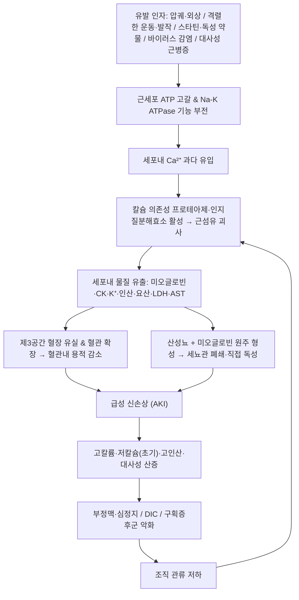

# 🩺 [[횡문근융해증]] (Rhabdomyolysis / 橫紋筋溶解症, ICD-10 M62.82 / KCD M62.8 계열)

> **핵심 3줄 요약 (Key Summary)**:
> - 📍 병소 부위 & 해부·병태생리: 특정 관절이 아니라 **전신 골격근(횡문근) 전체**가 병소다. 대근군([[대퇴사두근]], [[둔근]], [[척주기립근]], [[비복근]])의 괴사로 세포내 미오글로빈·CK·K⁺·인산·요산이 혈류로 유출되고, 이차적으로 [[신장]]([[세뇨관]])과 [[근막구획]]이 손상된다(Cabral & Edding 2020; Baeza-Trinidad 2022).
> - 🚩 전형적 임상 양상 & 3대 징후: **근육통(myalgia) + 근력저하(weakness) + 콜라색/홍차색 소변(dark urine)** 의 고전적 삼징후. 다만 삼징후가 동시에 나타나는 경우는 드물어(흔히 <10%로 인용되나 원자료 수치 재확인 필요) **원인 문진 + CK 검사**가 진단의 핵심이다(Nance & Mammen 2015).
> - 🛠️ 핵심 감별 검사 & 한·양방 다각적 치료 전략: [[혈청 크레아틴키나아제(CK) 검사]], [[소변 딥스틱 검사]], [[전해질·신기능 검사]], [[구획압 측정]]이 핵심. 1차 치료는 **조기 대량 정맥 수액 소생**이며, 한의 치료(침·약침·한약)는 회복기 보조·증상 조절 목적으로만 제한적으로 병행한다.
> - ⚠️ 응급 의뢰 레드플래그 & 악화 요인: CK 급상승(특히 5,000 U/L 초과, 15,000–20,000 U/L 이상에서 AKI 위험 증가로 흔히 인용), 핍뇨(<0.5 mL/kg/h), 고칼륨혈증·ECG 변화, 구획증후군(수동 신전 시 통증·팽팽한 구획·감각저하), 저혈량 쇼크, DIC, 의식 변화는 **즉시 응급실 이송**. 급성기 심한 자극성 자침·추나·심부 마사지는 금기.

---

## 📌 목차
1. [질환 개요 & 해부학적 병태생리](#1-질환-개요--해부학적-병태생리)
2. [병태생리 메커니즘 & 생체역학적 악순환 네트워크](#2-병태생리-메커니즘--생체역학적-악순환-네트워크)
3. [임상 증상 & 이학적 검사(Physical Exam) 알고리즘](#3-임상-증상--이학적-검사physical-exam-알고리즘)
4. [감별 진단 매트릭스 (Differential Diagnosis)](#4-감별-진단-매트릭스-differential-diagnosis)
5. [한의 통합 치료 프로토콜 (침·약침·추나·한약)](#5-한의-통합-치료-프로토콜-침약침추나한약)
6. [재활 운동 & 생활습관 티칭 가이드](#6-재활-운동--생활습관-티칭-가이드)
7. [💡 사용자 진료실 핵심 필기 & 임상 노하우 (Melt-In 잔여 심화 집약)](#7--사용자-진료실-핵심-필기--임상-노하우-melt-in-잔여-심화-집약)
8. [출처 및 학술 참고 문헌 (References)](#8-출처-및-학술-참고-문헌-references)

---

## 1. 질환 개요 & 해부학적 병태생리

![[횡문근융해증_1.jpg|540]]
> [그림 1: Acute compartment and crush syndrome.jpg]

> ⚠️ 이 노트는 이미지가 제공되지 않아 **이미지 임베드를 포함하지 않았다.** 병태생리 도해가 필요하면 별도 학술 자료를 직접 첨부할 것.

* **질환 정의 및 분류**:
  * **정의**: 골격근(횡문근) 세포의 괴사로 인해 세포 내 성분 — 미오글로빈, 크레아틴키나아제(CK), 칼륨, 인산, 요산, LDH, AST — 이 혈장 내로 유출되는 **증후군(syndrome)** 이다. 즉 단일 장기 질환이 아니라 "근육 손상 → 전해질·신장 합병증"으로 이어지는 전신성 질환군으로 이해해야 한다(Cabral & Edding 2020; Baeza-Trinidad 2022).
  * **분류(원인별)**:
    * **외상성/압궤성**: 압궤손상(crush injury), 지진·건물 붕괴, 교통사고, 장시간 압박 자세(의식 소실 후 방치), 화상. 광범위 압궤가 동반된 경우를 특히 **[[Crush syndrome]](압궤증후군)** 이라 부르며, 횡문근융해 + 저혈량 쇼크 + 급성신손상 + 전해질 이상의 복합상태를 뜻한다.
    * **비외상성 — 과운동성/발작성**: 격렬한 운동(특히 신참 훈련, 크로스핏, 마라톤), 발작(status epilepticus), 열사병·악성고열, 신경이완제악성증후군(NMS).
    * **비외상성 — 약물·독성**: 스타틴(특히 피브레이트·사이클로스포린·마크로라이드 병용 시), 향정신병약, 일부 항우울제, 마취제, 코카인·암페타민·MDMA 등, 알코올, 뱀독, 일산화탄소 중독.
    * **비외상성 — 감염·염증**: 인플루엔자 등 바이러스성 근염, 세균성 패혈증, 자가면역근염(다발성근염·피부근염).
    * **비외상성 — 대사·내분비·유전**: McArdle병(근인산화효소 결핍), CPT-II 결핍 등 지방산 산화 이상, 갑상선기능저하, 저칼륨·저인산·저나트륨혈증.
  * **호발 연령/성별/직업군**: 연령·성별에 따른 정확한 발생률 수치는 이 노트에서 **근거 미확인**. 다만 (1) 격렬한 훈련에 노출되는 젊은 남성(군인·운동선수·소방관), (2) 다약제를 복용하는 고령자(스타틴+상호작용 약물), (3) 바이러스성 근염이 흔한 소아(Szugye 2020)가 임상적으로 주의군이다.
  * **중요한 임상적 위치**: 횡문근융해는 그 자체보다 **합병증(급성신손상, 고칼륨혈증성 부정맥, 구획증후군, DIC)** 때문에 위험하다. 따라서 "근육통 환자를 볼 때 소변색과 CK를 반드시 확인한다"는 태도가 임상의 핵심이다.

* **관련 해부학적 구조물**:
  * **골격 및 관절**: 특정 관절이 아니라 **체간·하지 대근군이 위치한 근막 구획(fascial compartment)** 이 병소다. 근막 구획은 뼈와 근막 사이가 밀폐된 공간이므로, 내부 부종이 커지면 [[구획증후군]]이 발생한다. 관련 표면 구조로는 [[대퇴 전외측 구획]], [[하지 전방·후방 구획]], [[둔부 구획]].
  * **근육 및 근막**: [[대퇴사두근]], [[둔근(대둔근)]], [[척주기립근]], [[비복근]], [[광배근]] 등 **체적이 큰 항중력근**이 손상 시 다량의 미오글로빈을 방출한다. 임상적으로 "왜 하필 대근군인가"에 대한 정답은 "근육량이 많아 괴사 시 유출량이 크기 때문"이며, 동시에 이들 근육의 **단축/약화 불균형**은 회복기 재활 표적이 된다.
  * **신경 및 혈관**: [[말초신경]](특히 [[비골신경]], [[경골신경]]) 은 구획 내 압력 상승 시 가장 먼저 허혈성 기능저하를 보인다(감각저하·족하수). [[동맥혈류]]는 구획압이 이완기 혈압에 근접하면 관류가 정지되며, 재관류 시 산소 자유라디칼·염증성 사이토카인 폭포가 발생해 손상이 **오히려 확대**된다(재관류 손상).
  * **신장 및 요로**: [[사구체]](여과 기능), [[근위세뇨관]]·[[원위세뇨관]](미오글로빈 독성·원주 폐쇄), [[방광]](요량·소변색 모니터링 지표). 즉 횡문근융해의 "2차 병소"는 신장이다.

---

## 2. 병태생리 메커니즘 & 생체역학적 악순환 네트워크

### 1) 해부학적 포착 및 압박 기전 — "구획(compartment) 안에서 벌어지는 일"
* **1단계 — 에너지 위기**: 근세포가 과부하·허혈·독성 자극을 받으면 ATP가 고갈되고 Na⁺/K⁺-ATPase가 정지한다. 이때 세포내 Na⁺·Ca²⁺ 농도가 상승한다.
* **2단계 — 칼슘 매개 자가소화**: 세포질 칼슘 과다 → 칼슘 의존성 프로테아제(칼페인)·인지질분해효소·자유라디칼 활성 → 세포막·근원섬유 붕괴.
* **3단계 — 누출**: 미오글로빈(분자량 약 17 kDa, 산소 운반 색소), CK, 칼륨, 인산, 요산, LDH, AST가 혈장으로 방출된다. **미오글로빈은 반감기가 짧아(수시간) 소변색이 정상화된 뒤에도 CK는 수일간 높게 유지**되므로, 진단·추적의 기준은 미오글로빈이 아니라 **CK**다(Nance & Mammen 2015).
* **4단계 — 신장 손상 3중 기전**:
  1. **혈관내 용적 감소**: 손상 근육으로 체액이 끌려가(제3공간 격리) 신혈류가 감소 → 허혈성 손상.
  2. **세뇨관 폐쇄**: 산성 소변에서 미오글로빈이 Tamm-Horsfall 단백과 원주를 형성해 세뇨관을 막는다.
  3. **직접 독성**: 미오글로빈의 헴(heme) 철이 산화 스트레스를 유발한다.
* **5단계 — 구획증후군의 악순환**: 괴사 → 부종 → 구획압 상승 → 추가 허혈 → 추가 괴사. 이 고리는 외과적 감압(fasciotomy) 없이는 스스로 끊기지 않는다.

### 2) 생체역학적 연쇄 반응 (Kinetic Chain) — 회복기 관점
* 급성기에는 통증·부종 때문에 환자가 **손상 근군을 보호하려는 대상작용(antalgic pattern)** 을 취한다. 이 결과 인접 분절(요추-골반-슬관절-족관절)에 과부하가 옮겨가고, 회복 후에도 보행 비대칭·근력 불균형이 잔존한다.
* 특히 [[대둔근]]·[[중둔근]] 약화는 [[Trendelenburg 보행]]을, [[비복근]]·[[전경골근]] 약화는 입각기 안정성 저하를 유발한다.
* 따라서 **"급성기 = 신장·전해질 관리 / 회복기 = 근막경선 균형 재건"** 이라는 시간축 분리가 이 질환 관리의 기본 골격이다.

---

## 3. 임상 증상 & 이학적 검사(Physical Exam) 알고리즘

### 1) 주소증 및 신경학적 증상
* **근육 증상**: 미만성 근육통, 압통, 종창, 뻣뻣함, 근력저하. 통증이 특정 피부분절에 국한되지 않고 **양측성·근군 단위**로 나타나는 것이 신경근병증과의 감별 포인트.
* **소변 이상**: 콜라색·홍차색·갈색 소변(미오글로빈뇨). 심한 경우 핍뇨(oliguria).
* **전신 증상**: 발열, 권태, 구역·구토, 빈맥, 저혈압(체액 격리·출혈), 의식 변화(전해질 이상·쇼크).
* **신경학적 이상(2차)**: 구획압 상승에 의한 [[비골신경]] 마비(족하수), 원위부 감각저하, 이상감각. 이는 근손상 자체가 아니라 **압박성 허혈**의 결과다.
* **소아 특이 양상**: 보행 거부·다리 통증·보채는 등 비특이적 증상으로 내원하는 경우가 많고, 바이러스성 근염이 흔하다. 소아는 증상 표현이 모호하므로 **소변색과 CK를 먼저 확인하는 것이 실전 요령**이다(Szugye 2020).

### 2) 필수 이학적 검사법 (Physical Examination)
* [[구획압 측정(Compartment Pressure Measurement)]]: **검사 목적** — 구획증후군 유무 확인. 수동 신전 시 통증, 팽팽한 구획, 감각저하, 근력저하, 모세혈관 재충혈 지연. 절대 수치 기준은 기관별 프로토콜 차이가 있어 **근거 미확인**, 다만 "이완기 혈압과의 차이(delta pressure)"로 판단하는 접근이 임상에서 널리 쓰인다.
* [[수동 신전 유발검사(Passive Stretch Test)]]: 각 구획 근육을 이완 방향으로 강제 신전 시 통증 재현. 구획증후군의 조기 지표이나, 과도한 힘으로 시행 시 추가 손상을 줄 수 있으므로 부드럽게.
* [[소변 딥스틱 검사(Urine Dipstick)]]: 혈액 칸이 양성인데 **현미경상 적혈구가 없으면 미오글로빈뇨를 시사**(혈색소뇨·혈뇨와의 핵심 감별점). 진료실에서 즉시 시행 가능한 가장 실용적 스크리닝.
* [[혈청 CK 검사]]: 가장 민감한 지표. 정상 상한의 5배 이상 상승을 진단적 기준으로 제시하는 문헌이 많다(Nance & Mammen 2015). **유발 요인 문진 → CK → 소변 딥스틱** 순서가 실전 동선.
* [[전해질·신기능 패널]]: K⁺, Ca²⁺, 인산, 요산, BUN/Cr, LDH·AST, 혈액가스(대사성 산증), 필요 시 DIC 패널(PT/aPTT/피브리노겐/D-이합체).
* [[ECG]]: 고칼륨혈증의 조기 신호(T파 상승, QRS 확대, P파 소실) 확인. 응급도를 판단하는 가장 빠른 창구다.

### 3) 실전 진단 흐름 (요약)
1. 근육통 + 무력감 + 소변색 이상 → 즉시 문진(운동·약물·외상·발작·감염·가족력).
2. CK + 소변 딥스틱 + 전해질/신기능 + ECG.
3. 구획 팽팽·통증 과다·감각저하 → 구획압 측정 및 **즉시 의뢰**.
4. 원인 불명 재발성 → 회복 후 근육 효소·대사성 근병증 평가(Nance & Mammen 2015).

---

## 4. 감별 진단 매트릭스 (Differential Diagnosis)

| 감별 질환 | 호발 병소 및 원인 | 주소증 차이점 | 특이적 이학적 검사 소견 |
| :--- | :--- | :--- | :--- |
| [[횡문근융해증]] (본 질환) | 골격근 전체(대근군), 외상·운동·약물·감염·대사 | 미만성 근육통 + 근력저하 + 콜라색 소변, 양측성 | [[소변 딥스틱]] 혈액 양성·RBC 음성, CK 현저 상승, 구획 팽팽 |
| [[급성 심근경색]] | 심근 | 흉통·압박감, 방사통(좌상지·턱), 발한 | ECG ST-T 변화, 트로포닌 상승(CK-MB 상승은 동반 가능) |
| [[발작성 야간 혈색소뇨증]] | 적혈구 막 결함(보체) | 야간/아침 첫 소변 진한 색, 만성 빈혈·혈전증 | 소변 혈색소 양성·RBC 음성에 더해 **Coombs·유세포검사 이상**, CK는 정상 |
| [[용혈성 빈혈]] / [[수혈 부작용]] | 적혈구 파괴 | 황달, 창백, 발열, 허리통증 | 빌리루빈·LDH 상승 + **합합珠蛋白(haptoglobin) 저하**, CK 정상 |
| [[다발성근염]] / [[피부근염]] | 자가면역 근염 | 근위부 근력저하 위주, 통증 경함, 피부 발진 | CK 상승하나 소변색 정상인 경우 많음, 항체검사·근생검 |
| [[급성 세뇨관괴사]](AKI 타 원인) | 허혈·독성 | 핍뇨·부종·전해질 이상, 근육통 없음 | CK 정상, 병력상 저혈압·신독성 약물 |
| [[요로결석]] / [[요로감염]] | 요로 | 산통·배뇨통·발열 | 소변 RBC/WBC 다수, CK 정상, 영상검사 |
| [[구획증후군]](단독 또는 동반) | 근막 구획 | 통증이 비례 이상으로 심함, 수동 신전 시 극통 | 구획압 상승, 감각저하·근력저하, **횡문근융해의 원인이자 결과** |
| [[지연성 근육통(DOMS)]] | 운동 후 정상 반응 | 24–72시간 후 근육통, 소변색 정상 | CK 경도 상승 가능하나 회복 빠름, 전신증상 없음 |

> 감별의 핵심은 "**미오글로빈뇨 vs 혈색소뇨 vs 혈뇨**" 3분류와 "**CK 상승 여부**"다. 소변 딥스틱 혈액 양성 + 현미경 RBC 음성 + CK 상승이면 횡문근융해 쪽으로 무게가 실린다.

---

## 5. 한의 통합 치료 프로토콜 (침·약침·추나·한약)

> [!WARNING]
> **횡문근융해는 응급질환이다.** 1차 치료는 어디까지나 **서양의학적 조기 수액 소생(등장성 식염수)** 과 전해질 교정이며, 한의 치료는 ① 급성기에는 원칙적으로 시행하지 않거나 최소한으로, ② 회복기·잔여 증상 관리 단계에서 보조적으로 병행하는 것을 원칙으로 한다. **핍뇨·고칼륨혈증·DIC·구획증후군·쇼크가 있으면 자침·약침·추나 모두 금기**이며 즉시 의뢰한다.

* **침구 치료 (Acupuncture)**:
  * **적용 시기**: 발병 1–2주 이내 급성기에는 통증 조절 목적의 최소 자극만. CK가 정상화되고 소변량이 회복된 이후 회복기부터 본격 적용.
  * **변증별 취혈(예시)**:
    * 濕熱下注(소변 진탁·발열·구역): [[음릉천(SP9)]], [[삼음교(SP6)]], [[중극(CV3)]], [[방광수(BL28)]], [[족삼리(ST36)]].
    * 瘀血阻絡(압궤·외상 후, 고정통): [[격수(BL17)]], [[혈해(SP10)]], [[태충(LR3)]], [[합곡(LI4)]], [[위중(BL40)]].
    * 腎氣虛(회복기 잔여 피로·다뇨): [[신수(BL23)]], [[명문(GV4)]], [[관원(CV4)]], [[태계(KI3)]], [[족삼리(ST36)]].
    * 근육통·강직: [[양릉천(GB34)]], [[승산(BL57)]], [[천종(SI11)]], 근육 내 [[TP(트리거포인트)]] 자극.
  * **전침 주파수 세팅**: 진통·근이완 목적에는 **저빈도 2 Hz 위주, 20분**이 임상에서 흔히 사용된다. 고빈도(100 Hz)는 통증 조절 목적에 선택 가능하나 **급성기에는 과자극으로 근육 효소 상승을 악화시킬 우려**가 있어 권하지 않는다(이 우려의 정량적 근거는 **근거 미확인**).
  * **주의**: 출혈 경향(DIC·혈소판 저하)이 있으면 자침 금기. 항응고제 복용자도 심부 자침·심자(深刺) 회피.

* **약침 치료 (Pharmacopuncture)**:
  * **원칙**: 횡문근융해 자체에 대한 특정 약침의 유효성을 검증한 임상 근거는 **근거 미확인**. 따라서 "조직 소염·순환 개선·회복 보조"라는 일반 원리에 한정해 신중히 적용한다.
  * **추천 경혈**: [[신수(BL23)]], [[비수(BL20)]], [[족삼리(ST36)]], [[삼음교(SP6)]], [[음릉천(SP9)]], [[혈해(SP10)]] — 좌우 교대, 1회 0.5–1.0 mL 수준의 소량.
  * **약성 선택(변증 기반, 일반 원리)**: 淸熱解毒 계열(황련·황금·황백), 活血化瘀 계열(당귀·천궁), 補氣 계열(황기). 다만 약침 제제별 배합·농도는 제조사 지침과 원내 프로토콜을 따른다.
  * **금기·주의**: 신기능 저하·부종이 있는 환자에서 다량 주입은 체액 부담을 늘릴 수 있어 **소량·제한적**으로. 피하 주입 부위 감염, 주입 후 통증 악화 시 즉시 중단.

* **추나 치료 (Chuna Manipulation)**:
  * **급성기(발병 수일~2주)**: **금기**. 구획증후군·골절·DIC가 배제되지 않은 상태에서의 심부 마사지·관절 교정은 근손상과 출혈 위험을 높인다.
  * **회복기**: 근막 이완(JS 계열 수기)으로 [[대퇴근막장근]]·[[장요근]]·[[척주기립근]]의 과긴장을 완화, 골반·요추·족관절의 가동성 회복. 직접 교정 수기는 방사선·임상 소견상 구조적 문제가 확인된 경우에만 제한적으로.
  * **중점 원칙**: "통증이 있는 근육을 누르는 치료"가 아니라 **"보상적으로 과부하된 인접 분절을 푸는 치료"** 로 접근한다.

* **한약 치료 (Herbal Medicine)**:
  * **급성기(濕熱·瘀血·水濕 內停)**: 淸熱解毒 + 活血祛瘀 + 利水通淋의 치법. 대표적 처방 계열로 [[오령산(五苓散)]]·[[저령탕(猪苓湯)]]·[[팔정산(八正散)]]·[[도적산(導赤散)]] 등이 이수·청열 목적으로 거론된다. **단, 이 처방들이 근육 괴사 자체를 억제한다는 임상 근거는 근거 미확인**이며, 목적은 체액·요로 상태 관리 보조와 염증성 증상 완화다.
  * **회복기(氣血兩虛·腎陰虛)**: [[보중익기탕(補中益氣湯)]], [[육미지황환(六味地黃丸)]] 계열, 어혈이 잔존하면 [[보양환오탕(補陽還五湯)]], [[혈부축어탕(血府逐瘀湯)]] 계열 고려.
  * **절대 원칙**: 한약 투여가 **수액 치료 시작을 지연시켜서는 안 된다.** 또한 신기능 저하 환자에서 이뇨 작용 한약을 쓸 때는 반드시 전해질·요량을 모니터링한다.

---

## 6. 재활 운동 & 생활습관 티칭 가이드

* **이완 및 스트레칭 (Stretching)**:
  * 급성기: 스트레칭 금지. 침상 안정 + 수액 + 통증 조절이 우선.
  * 회복기(무증상 + CK 정상화 후): [[대퇴사두근]], [[장요근]], [[비복근]]의 **정적 스트레칭 20–30초 × 3회**, 통증 없는 범위에서. 급격한 신전은 근손상 재발 위험.
* **강화 및 안정화 운동 (Strengthening)**:
  * 1단계: 등척성 수축(복부 브레이싱, 대둔근 등척성)으로 시작.
  * 2단계: 통증 없이 근력이 돌아오면 [[중둔근]]·[[대둔근]] 심부 안정화, 코어 안정화 운동.
  * 3단계: 점진적 저항 운동(2–3주 이상 간격), 이후 유산소 재개. **"주당 부하 증가 10% 이내"** 원칙이 재발 방지에 실용적.
* **신경 활주 운동 (Neurodynamics)**:
  * 구획증후군 후 신경 증상(저림·감각저하)이 남은 경우 [[비골신경]]·[[좌골신경]] 슬라이딩 기법. **신경 긴장(tension)이 아닌 미끄러짐(sliding) 목적**으로 저강도 반복.
* **일상생활 자세 티칭 (Ergonomics)**:
  * **수분 관리**: 운동 전·중·후 수분 섭취, 운동 전후 체중 차이를 2% 이내로 유지하는 것이 권장된다. 더운 환경에서의 장시간 작업·훈련 회피.
  * **약물 점검**: 스타틴·피브레이트·향정신병약 복용자는 근육통 발생 시 담당의와 상의. 임의 추가 보충제(특히 고용량 크레아틴·각성제 계열) 주의.
  * **작업 환경**: 장시간 압박 자세(의식 소실, 음주 후 방치, 좁은 좌석) 회피. 음주 후 바닥 취침은 압궤성 횡문근융해의 대표적 생활 위험 패턴.
  * **재발 감시**: 운동 후 소변색이 콜라색이면 **즉시 중단·수분 섭취·의료기관 방문**을 환자에게 명확히 교육한다.

---

## 7. 💡 사용자 진료실 핵심 필기 & 임상 노하우 (Melt-In 잔여 심화 집약)

> [!IMPORTANT]
> 상부 1~6번 섹션에는 정의·병태생리·증상·검사·치료 원칙을 모두 녹여냈다. 아래는 **상부에 담기 어려운 진료실 실전 운영 노하우(문진 동선, 의뢰 판단, 환자 설명 멘트)** 만을 집약한 것이다. (제공된 이미지 자료가 없어 이 노트에는 시술점·해부 도해 이미지를 수록하지 않았으며, 필요 시 별도 학술 자료를 첨부할 것.)

* **상부 섹션에 미처 다 담지 못한 고유 원문 필기**:
  * 이 질환은 **"한의원에서 만나면 안 되는 질환" 목록에 넣어야 하는 축**이다. 근육통 환자를 보는 순간 "혹시 횡문근융해인가?"라는 스크리닝 질문 2개 — ① **"소변색이 콜라색·홍차색으로 나온 적 있나요?"** ② **"최근 3일 내 평소와 다른 격렬한 운동·외상·발작·새 약 복용이 있었나요?"** — 를 습관화하면 대부분의 중증 케이스를 조기 선별해 전원할 수 있다.
  * **"진단명을 붙이는 순간 치료자가 아니라 전원 담당자가 된다"** 는 인식이 중요하다. CK 상승 + 소변색 변화가 확인되면 자침·약침을 늘리는 것이 아니라 **수액 라인 확보 가능한 의료기관으로 즉시 이송**이 정답이다.
  * 회복기 환자에서 흔히 보는 잔여 문제는 ① 미만성 근육 뻣뻣함, ② 보행 비대칭에 따른 요추·골반 통증, ③ "다시 운동해도 되나"에 대한 불안이다. 각각에 대해 근막 이완 + 단계적 부하 + 명확한 복귀 기준 제시가 치료의 실제 내용이 된다.
  * 한의학적 변증으로는 급성기 濕熱下注·瘀血阻絡, 회복기 氣血兩虛·腎陰虛로 잡는 것이 임상적으로 무리가 없다. 다만 **변증 치료가 신장 손상을 되돌린다는 근거는 없음**을 스스로 명확히 인지하고, "증상·체력 회복 보조"라는 표현으로 환자에게 설명한다.

* **진료실 실전 감별 & 치료 노하우**:
  * **1. 실전 문진 체크리스트 (순서대로)**:
    1. 소변색 변화(콜라색·홍차색·갈색) — 언제부터, 몇 번.
    2. 유발 사건: 격렬한 운동(신참 훈련·크로스핏·마라톤), 외상·압궤, 발작, 열사병, 장시간 압박 자세.
    3. 약물·보충제: 스타틴, 피브레이트, 향정신병약, 항우울제, 마취, 코카인·암페타민·MDMA, 알코올, 고용량 크레아틴.
    4. 감염: 최근 인플루엔자·발열성 질환, 근육통 동반 여부.
    5. 가족력·재발력: 어릴 때부터 운동 후 심한 근육통·콜라색 소변 반복 → **대사성 근병증 의심**.
    6. 전신 상태: 소변량 감소, 부종, 심계항진, 어지럼, 의식 변화.
  * **2. 치료 순서 및 손맛 노하우**:
    * 진료실에서 할 수 있는 것은 **스크리닝과 전원 결정**이다. 순서는 ① 소변 딥스틱(즉시) → ② CK 채혈 의뢰 → ③ ECG 필요성 판단(고칼륨 의심 시) → ④ 이송.
    * 회복기 자침 시에는 **원위 취혈(족삼리·삼음교·음릉천)을 먼저**, 이후 요배부 혈(신수·격수) 순으로. 자극은 약–중간 강도, 유침 15–20분. 시술 직후 근육통이 오히려 심해지면 빈도와 강도를 낮춘다.
    * 약침은 **소량·광범위보다 소량·국소**를 원칙으로 하고, 주입 후 24시간 내 통증·부종 변화를 반드시 확인한다.
    * 구획이 팽팽하게 만져지거나 수동 신전에서 비명이 나올 정도의 통증이면 — **절대 마사지하지 말고**, 팔을 내리고 즉시 전원. "풀어주는 손"이 손상을 키우는 대표적 상황이다.
  * **3. 환자 티칭 스크립트(그대로 읽어줄 문장)**:
    * "지금 근육이 녹아서 나온 색소가 콩팥에 부담을 주는 상태입니다. **가장 중요한 치료는 물을 정맥으로 충분히 넣는 것**이라서 먼저 큰 병원 응급실로 가셔야 합니다."
    * "운동 후 소변이 콜라색으로 나오면 그건 '운동을 잘했다'는 신호가 아니라 **근육이 손상됐다는 경고**입니다. 그날은 운동을 멈추고 물을 마시고, 색이 안 돌아오면 바로 병원에 오세요."
    * "회복 후에는 **주당 운동량을 10% 이상 늘리지 않기**, 더운 날 장시간 훈련 피하기, 새 약을 시작할 때 근육통이 생기면 즉시 알리기 — 이 세 가지만 지키면 재발 위험이 크게 줄어듭니다."
    * "근육통이 전신에 퍼지고 소변량이 줄거나 부어오르면, 그건 근육 문제가 아니라 **신장 문제로 넘어가는 신호**입니다. 그때는 한의원이 아니라 응급실입니다."

---

## 8. 출처 및 학술 참고 문헌 (References)

1. **대한정형외과학회 / 척추신경외과학회 교과서** — 근골격계 손상·구획증후군·외상 후 합병증 개괄.
2. **Cabral BMI, Edding SN (2020)**. *Rhabdomyolysis*. **Dis Mon**. PMID: 32532456.
   - **[연구 요약]**: 횡문근융해의 정의·원인·진단·합병증·치료를 총괄한 종설. 근육 괴사로 인한 세포내 물질 유출과 급성신손상의 병태생리, 그리고 조기 수액 소생과 합병증 관리의 중요성을 강조한다.
3. **Baeza-Trinidad R (2022)**. *Rhabdomyolysis: A syndrome to be considered*. **Med Clin (Barc)**. PMID: 34872769.
   - **[연구 요약]**: "증후군"으로서의 횡문근융해를 강조한 고찰. 원인별 감별(외상성·비외상성), CK를 축으로 한 진단 접근, AKI·전해질 이상 등 합병증 관리의 임상적 틀을 제시한다.
4. **Szugye HS (2020)**. *Pediatric Rhabdomyolysis*. **Pediatr Rev**. PMID: 32482689.
   - **[연구 요약]**: 소아 횡문근융해의 원인(바이러스성 근염, 유전성 대사성 근병증, 외상 등)과 연령 특유의 비특이적 증상 표현, 평가 및 관리 원칙을 정리. 소아에서 소변색·CK 확인의 중요성을 강조한다.
5. **Nance JR, Mammen AL (2015)**. *Diagnostic evaluation of rhabdomyolysis*. **Muscle Nerve**. PMID: 25678154.
   - **[연구 요약]**: 횡문근융해의 진단적 평가에 초점을 둔 리뷰. CK가 가장 민감한 검사이며 미오글로빈은 반감기가 짧아 추적에 부적합함을 설명하고, 원인 불명·재발성病例에서 근육 효소 검사, 전기진단, 근생검, 유전자 검사 등 2차 평가의 흐름을 제시한다.

> **근거 표기 원칙**: 본 노트에서 "흔히 인용되는 수치"로 표기한 항목(CK 역치, 삼징후 동시 발현율, 이완기 혈압 대비 구획압 차이 등)은 1차 문헌 원문 대조가 완료되지 않아 **근거 미확인** 상태이며, 임상 적용 시 최신 지침·교과서·기관 프로토콜로 재확인할 것. 한약·약침이 근육 괴사 자체를 억제한다는 근거는 확인되지 않았고, 본 노트는 이를 보조·회복 목적의 범위로 한정해 기술하였다.