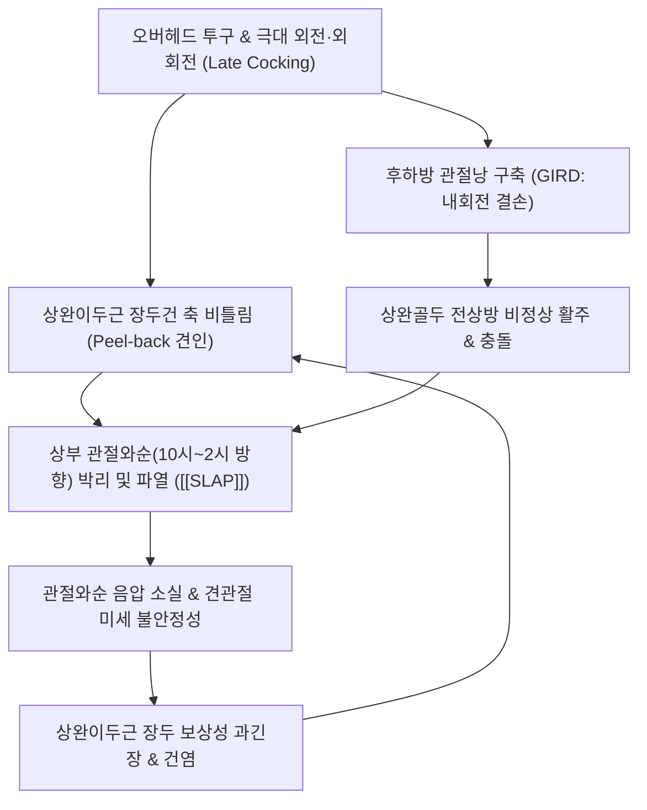

# 🩺 [[SLAP 병변]] (Superior Labrum Anterior to Posterior Lesion / 상부 관절와순 파열, S43.4)

> **핵심 3줄 요약 (Key Summary)**:
> - 📍 병소 부위 & 해부·병태생리: 견갑골 관절와 상부 테두리의 섬유연골륜인 상부 관절와순(Superior labrum)과 [[상완이두근]] 장두건(Biceps long head) 기저부가 전방에서 후방(10시~2시 방향)에 걸쳐 균열·박리되는 병변.
> - 🚩 전형적 임상 양상 & 3대 징후: 오버헤드 투구 동작 시 견관절 심부의 뚝 소리(염발음)와 걸림(Catching), 팔에 힘이 푹 빠지는 사구 증후군(Dead arm syndrome), 외전 후 주관절 굴신 시 심부 자통.
> - 🛠️ 핵심 감별 검사 & 한·양방 다각적 치료 전략: [[오브라이언 검사]], 압박 회전 검사, 야거슨 검사, 견우·견료혈 관절강 심자침 및 약침술, 후하방 관절낭 이완 추나, [[서경탕]]·[[독활기생탕]] 투여.
> - ⚠️ 응급 의뢰 레드플래그 & 악화 요인: 관절 내 잠김(Locking) 증상을 유발하는 Type III/IV 버킷 핸들형 파열 및 3개월 이상 보존 치료 실패 시 관절경하 봉합술 또는 건고정술(Tenodesis) 의뢰.

---

## 📌 목차
1. [질환 개요 & 해부학적 병태생리](#1-질환-개요--해부학적-병태생리)
2. [병태생리 메커니즘 & 생체역학적 악순환 네트워크](#2-병태생리-메커니즘--생체역학적-악순환-네트워크)
3. [임상 증상 & 이학적 검사(Physical Exam) 알고리즘](#3-임상-증상--이학적-검사physical-exam-알고리즘)
4. [감별 진단 매트릭스 (Differential Diagnosis)](#4-감별-진단-매트릭스-differential-diagnosis)
5. [한의 통합 치료 프로토콜 (침·약침·추나·한약)](#5-한의-통합-치료-프로토콜-침약침추나한약)
6. [양방 치료 & 병용·의뢰 기준 (Conventional Treatment & Referral)](#6-양방-치료--병용의뢰-기준-conventional-treatment--referral)
7. [재활 운동 & 생활습관 티칭 가이드](#6-재활-운동--생활습관-티칭-가이드)
8. [💡 사용자 진료실 핵심 필기 & 임상 노하우 (Melt-In 잔여 심화 집약)](#7--사용자-진료실-핵심-필기--임상-노하우-melt-in-잔여-심화-집약)
9. [출처 및 학술 참고 문헌 (References)](#8-출처-및-학술-참고-문헌-references)

---

## 1. 질환 개요 & 해부학적 병태생리

![[Pasted image 20240122142533.png|450]]
> [그림 1: ① 병태생리·영상 — 견관절 상부의 상완골두, 상부 관절와순, 상완이두근 장두건 해부학적 부착 관계 및 SLAP 병변 위치]

* **질환 정의 및 분류**:
  * [[SLAP 병변]](Superior Labrum Anterior to Posterior Lesion)은 견갑골 관절와(Glenoid fossa)의 상부 테두리를 둘러싸고 있는 섬유연골성 구조물인 상부 관절와순(Superior labrum)이 전방에서 후방에 걸쳐 균열이 생기거나, 이곳에 부착되는 [[상완이두근]] 장두건과 함께 관절와 골면에서 박리·분리되는 질환입니다. 1990년 Snyder에 의해 관절경 소견을 바탕으로 명명되었습니다.
* **관련 해부학적 구조물**:
  * **골격 및 관절**: 견갑골 관절와(Glenoid), 관절와상결절, 상완골두, 견봉쇄골관절(AC joint).
  * **근육 및 건**: [[상완이두근]](Biceps brachii) 장두건, [[극상근]](Supraspinatus), [[극하근]](Infraspinatus), [[견갑하근]](Subscapularis), [[전거근]](Serratus anterior).
  * **인대 및 순환**: 상완와관절낭(Glenohumeral capsule), 오훼상완인대, 관절순 미세혈관망.
* **역학적 특성**:
  * 20~40대 오버헤드 스포츠(야구, 배구, 테니스, 수영, 크로스핏) 선수에게 호발하며, 팔을 뻗고 짚고 넘어지는 낙상(FOOSH)이나 회전근개 파열과 40% 이상 동반됩니다.

---

## 2. 병태생리 메커니즘 & 생체역학적 악순환 네트워크

![[Pasted image 20240208144431.png|600]]
> [그림 2: ② 관련 해부 구조물 — 오버헤드 투구 동작의 필백(Peel-back) 역학 기전] 견관절 극대 외회전 시 상완이두근 장두건이 비틀리며 상부 관절와순을 뒤쪽에서부터 벗겨내는 병태생리 도해.

### 1) 필백 기전 (Peel-Back Mechanism)
* 팔을 90도 외전 및 최대 외회전(Cocked position)할 때, 이두근 장두건의 주행 축이 후상방으로 비틀리며 건 기저부에 회전 토크가 걸립니다. 이때 건이 상부 관절와순을 관절와 골면으로부터 뒤에서 앞으로 지렛대처럼 들어 올리며 뜯어냅니다(Burkhart & Morgan).

### 2) 원심성 감속 제동 손상 및 상완골두 활주
* **감속기 부하**: 투구 후 팔을 아래로 휘두르는 감속기(Follow-through)에서 전방 활주하려는 상완골두를 제동하기 위해 [[상완이두근]]이 강한 원심성 수축(Eccentric contraction)을 할 때 관절와상결절 부착부에 반복적 미세 견인 손상이 누적됩니다.
* **GIRD(내회전 결손)**: 후하방 관절낭이 구축되면 상완골두가 외회전 시 전상방으로 이동하여 상부 관절와순을 위쪽에서 반복적으로 찝어 으깨는 내부 충돌(Internal impingement)이 발생합니다.

---

## 3. 임상 증상 & 이학적 검사(Physical Exam) 알고리즘

### 1) 주요 증상 및 Snyder 4단계 분류

![[Pasted image 20240208144542.png|650]]
> [그림 3: Snyder의 SLAP 4단계 분류 (Type I: 마모, Type II: 상부 관절와순 박리, Type III: 양동이 손잡이형 파열, Type IV: 이두근건 침범 파열)]

* **임상 주소증**:
  * **심부 어깨 통증**: 견관절 내부 깊숙한 곳에서 느껴지는 뻐근하고 쑤시는 통증. 머리 위로 팔을 올리거나 던지는 동작 시 격화.
  * **기계적 걸림 및 염발음 (Clicking & Catching)**: 팔을 돌릴 때 어깨 안쪽에서 걸리는 느낌과 '뚝' 소리.
  * **사구 증후군 (Dead Arm Syndrome)**: 공을 던지는 릴리스 포인트에서 어깨 힘이 순간적으로 빠지며 구속이 급감.
* **Snyder 4단계 분류**:
  * **Type I (단순 마모, 9.5%)**: 상부 관절와순의 퇴행성 마모와 보풀 형성. 이두근건 부착부는 견고.
  * **Type II (박리 및 불안정, 41% - 최다 호발)**: 상부 관절와순과 이두근건 부착부가 관절와 골면으로부터 완전히 분리되어 들뜨는 불안정 병변.
  * **Type III (양동이 손잡이형, 33%)**: 이두근건 기저부는 정상 부착되어 있으나 관절와순 중앙에 수직 파열이 생겨 버킷 핸들(Bucket-handle) 형태로 관절 내로 말려 들어감.
  * **Type IV (복합 파열, 15%)**: 양동이 손잡이형 파열이 [[상완이두근]] 장두건 실질 내부까지 침범하여 찢어진 상태.

### 2) 필수 이학적 검사법
* **능동 압박 검사 ([[오브라이언 검사]] / O'Brien Test)**:
  * 90도 굴곡, 10~15도 내전 상태에서 1단계(엄지 바닥)와 2단계(손바닥 하늘)로 하방 저항 검사 시행.
  * 양성: 1단계에서 어깨 심부 통증·걸림 유발, 2단계에서 통증이 현저히 감소하거나 소실.
* **압박 회전 검사 (Compression-Rotation Test)**:
  * 앙와위에서 견관절을 외전하고 상완골 축을 따라 관절와를 향해 축성 압박을 가하며 회전 시 관절와순 파열편이 찝히며 걸림감과 통증 유발.
* **이두근 건 연계 검사**:
  * [[야거슨 검사]](Yergason's test): 전완 회외 저항 시 결절간구 및 심부 어깨 통증.
  * 스피드 검사(Speed's test): 견관절 90도 굴곡 상태에서 전완 회외 하방 저항 시 결절간구 통증.

![[SLAP병변_제2형_어깨_MRI_소견.jpg|450]]
> [그림 4: 관절조영 MRI(MR Arthrography) 관상면 T1 강조 영상. 상부 관절와순 기저부와 관절와 골면 사이에 조영제가 침투하여 고신호 강도를 보이는 제2형 SLAP 병변]

---

## 4. 감별 진단 매트릭스 (Differential Diagnosis)

| 감별 포인트 | [[SLAP 병변]] | 상완이두근 장두건염 | 회전근개 파열 ([[극상근]]) | 견봉하 충돌 증후군 |
| :--- | :--- | :--- | :--- | :--- |
| **통증 위치** | 어깨 심부 관절 내부 | 상완골 전면 결절간구 표층 | 견봉 외측 및 삼각근 부착부 | 견봉 전외측 하방 |
| **기계적 증상** | **심부 걸림(Catching), 뚝 소리** | 뚝 소리 없음, 건 마찰감 | 파열편 걸림, 근력 약화 | 동통호(Painful arc, 60~120도) |
| **[[오브라이언 검사]]** | **양성 (심부 통증)** | 음성 또는 표층 통증 | 음성 | 음성 (또는 AC 관절 양성) |
| **외전 후 주관절 굴신** | **양성 (심부 찌르는 통증)** | 경미 | 무관 | 무관 |
| **주사 진단 반응** | 견봉하 주사 시 통증 지속 | 결절간구 주사 시 완화 | 견봉하 주사 시 통증 경감 | 견봉하 국소마취 시 즉각 호전 |

### ⚠️ 수술 의뢰 기준 (Red Flags)
* 관절와순 파열편이 관절 사이에 끼어 팔이 완전히 걸려 굳어버리는 관절 잠김(Locking) 증상이 동반된 Type III, IV.
* 3개월 이상의 적극적 한의 보존 치료에도 투구 불능 상태가 지속되는 엘리트 오버헤드 선수는 관절경하 상부 관절와순 봉합술(SLAP repair) 또는 건고정술(Tenodesis) 의뢰.

---

## 5. 한의 통합 치료 프로토콜 (침·약침·추나·한약)

![[SLAP병변_관절경_상부관절와순_파열소견.jpg|450]]
> [그림 5: ③ 치료·시술점 — 상부 관절와순 파열부 및 관절강 내 약침·침도 시술 타겟 관절경 소견] 관절와 상연에서 이두근 장두건 복합체가 박리되어 들뜨는 병변 부위를 표적하는 견우·견료 관절강 심자침 및 약침 자입 타겟점.

### 1) 침구 및 전침 치료 SOP
* **관절강 근접 취혈**:
  * 견우(LI15), 견료(TE14), 비노(LI14), 거골(LI16), 천종(SI11).
  * 견우혈과 견료혈에서 관절와순과 상완골두 사이 관절강 심부를 향해 부드럽게 사자하여 관절낭 내압 완화 및 미세 혈류 촉진.
* **이두근 주행 취혈**:
  * 천천(PC2), 척택(LU5) 자침 및 2~4Hz 저주파 전침 통전으로 [[상완이두근]]의 과도한 연축 긴장을 완화하여 상부 관절와순 견인 장력 해소.

### 2) 약침 및 화침(Thermal Needle) 요법
* **약침 처방**:
  * 관절와순 부착부의 만성 무균성 염증 제어를 위해 황련해독탕 약침, 신바로약침 또는 중성어혈약침 1.0~2.0cc를 견우·견료혈을 통해 후상방 관절강 및 결절간구 주위에 정밀 주입.
* **화침 요법**:
  * 관절와순 주변의 이완된 관절낭과 결절간구 인대 장력을 회복시키기 위해 두꺼운 호침 자침 후 침병을 가열하여 결합조직 콜라겐 수축과 인대 강화 도모.

### 3) 추나 및 관절가동술
* **후하방 관절낭 신장 추나**: 상완골두를 후하방으로 글라이딩(Posterior-inferior glide)하여 전상방 활주를 억제하고 GIRD를 해소.
* **견갑흉곽관절 가동술**: 전거근 및 하부 승모근의 정상 활성화를 위해 견갑골 가동술 시행.

### 4) 한약 치료
* **초기 급성기**: [[서경탕]](舒經湯)에 [[유향]], [[몰약]], [[도인]], [[홍화]]를 가미하여 관절강 내 어혈과 염증 삼출물 신속 배출.
* **만성 퇴행기**: [[독활기생탕]](獨活寄生湯), [[대방풍탕]](大防風湯)에 [[녹용]], [[골쇄보]], [[속단]], [[모과]]를 배합하여 섬유연골 기질 재생 촉진 및 인대 지지력 강화.

---

## 6. 양방 치료 & 병용·의뢰 기준 (Conventional Treatment & Referral)

> 🎯 **이 섹션의 목적**: 환자가 **양방약을 이미 복용 중인 경우가 많다.** 한의원 1차 진료에서 양방 치료를 이해하고, 병용 가능·주의·금기를 판단하며, 언제 의뢰할지 결정한다.

* **약물 치료 (Medication)**:
  * 계열별 약물·용량·기간 — 국내 처방 관행 반영.
  * 작용 기전과 한의 치료와의 상호작용.
* **비약물 시술 (Procedures)**:
  * 주사·차단술·물리치료·보조기 등.
* **수술·시술 적응증 (Surgical Indication)**:
  * 언제 수술로 가는가 — 절대·상대 적응증, 수술 후 경과.
* **한의 병용 판단 (Combination Therapy)**:
  * 병용 가능 / 주의 / 금기. 복용 중 환자의 감량 타이밍·반동 현상.
* **양방·전문과 의뢰 기준 (Referral Criteria)**:
  * 응급 의뢰 트리거와 전문과 의뢰 기준(정형외과·신경외과·내과 등).

	(작성 필요)

---

## 7. 재활 운동 & 생활습관 티칭 가이드

* **슬리퍼 스트레칭 (Sleeper Stretch)**:
  * 환측을 아래로 하고 옆으로 누워 견관절과 주관절을 90도 굴곡한 뒤 반대편 손으로 손목을 바닥 쪽으로 부드럽게 눌러 후하방 관절낭을 30초간 신장(GIRD 해소).
* **견갑골 안정화 운동**:
  * Y-to-W 운동 및 월 슬라이드(Wall slide)를 통해 [[전거근]]과 하부 [[승모근]]을 강화하여 상완골두 중심화(Centering) 유도.
* **투구 및 오버헤드 동작 수정**:
  * 팔꿈치가 어깨선 아래로 떨어지는 사이드암 투구 폼을 교정하고 골반-체간 회전력을 이용한 키네틱 체인 연결 티칭.

---

## 8. 💡 사용자 진료실 핵심 필기 & 임상 노하우 (Melt-In 잔여 심화 집약)

### 1) 진료실 실전 감별 노하우: "외전 후 주관절 굴곡·신전 검사"
* **SLAP의 결정적 시크릿 팁**:
  * 환자의 어깨를 90도 외전한 상태에서 **팔꿈치를 구부렸다 폈다(주관절 굴곡·신전)** 반복하게 하십시오.
  * 이때 어깨 심부에서 '찌릿'하거나 뚝 소리와 함께 아프다고 호소하면 **거의 100% SLAP 병변**입니다. 팔꿈치를 펼 때 [[상완이두근]] 장두건이 강하게 당겨지며 상부 관절와순 박리 부위를 직접 자극하기 때문입니다.
* **회전근개 질환과의 핵심 차이**:
  * 회전근개는 팔을 옆으로 들어 올릴 때 삼각근 부착부 표층이 아프지만, SLAP 환자는 "어깨 속 깊은 곳, 뼈 속이 아프다"며 손가락으로 통증 부위를 짚지 못하고 어깨 전체를 감싸 쥡니다.

### 2) 보존 치료 적응증 및 관리 기간
* Type I 및 경증 Type II는 3~6개월간의 침, 약침, 견갑골 안정화 재활 운동으로 일상생활 복귀율이 70% 이상입니다. 성급한 수술보다는 보존 치료를 선행하는 것이 권고됩니다.

---

## 9. 출처 및 학술 참고 문헌 (References)

1. Snyder, S. J., Karzel, R. P., Del Pizzo, W., Ferkel, R. D., & Friedman, M. J. (1990). SLAP lesions of the shoulder. *Arthroscopy*, 6(4), 274-279. [PMID: 2264894](https://pubmed.ncbi.nlm.nih.gov/2264894/)
   - `[연구 요약]` 견관절 관절경 소견 700례를 분석하여 상부 관절와순 전후방 병변의 임상 개념을 최초로 확립하고 4단계 분류 체계를 창안한 기념비적 오리지널 논문.
2. Burkhart, S. S., & Morgan, C. D. (1998). The peel-back mechanism: its role in producing and extending posterior type II SLAP lesions and its effect on SLAP repair rehabilitation. *Arthroscopy*, 14(6), 637-640. [PMID: 9754487](https://pubmed.ncbi.nlm.nih.gov/9754487/)
   - `[연구 요약]` 오버헤드 투구 동작 시 견관절 극대 외회전으로 인해 발생하는 이두근건의 비틀림과 관절와순의 필백(Peel-back) 역학적 박리 기전을 증명하고 수술 및 재활 원칙을 정립함.
3. O'Brien, S. J., Pagnani, M. J., Fealy, S., McGlynn, S. R., & Wilson, J. B. (1998). The active compression test: a new and effective test for diagnosing labral tears and acromioclavicular joint abnormality. *Am J Sports Med*, 26(5), 610-613. [PMID: 9784804](https://pubmed.ncbi.nlm.nih.gov/9784804/)
   - `[연구 요약]` 관절와순 파열 및 견봉쇄골관절 이상을 고유하게 진단할 수 있는 능동 압박 검사(O'Brien test)의 민감도(100%)와 특이도(98.5%)를 임상적으로 입증한 표준 연구.

<!-- 보관 태그(1회용·링크오류, 필요시 복원): 상부관절와순, 상완이두근장두건, 오버헤드스포츠, 오브라이언검사, 스나이더분류 -->
