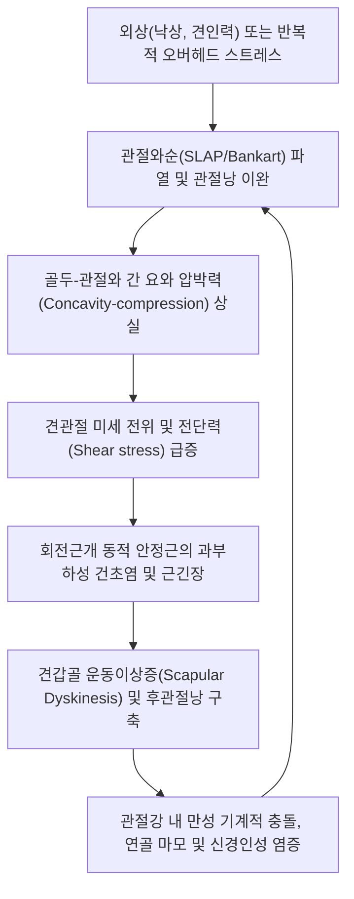

# 🩺 견관절 내병변 (Internal Derangement of Shoulder Joint)

> **핵심 3줄 요약 (Key Summary)**:
> - 📍 **병소 부위 & 해부·병태생리**: 관절와순(Labrum, 특히 상부 SLAP 및 전하방 Bankart), 관절와상완인대(GHL), 관절낭(Capsule), 상완이두근 장두건 복합체 등 관절와상완관절(Glenohumeral joint) 내부 구조물의 기계적 파열·박리 및 불안정성 병변.
> - 🚩 **전형적 임상 양상**: 팔을 머리 위로 들어 올리거나 외회전-외전 시 발생하는 깊은 관절 내 잠김(Catching), 딸깍거림(Clicking), 시동 통증, 관절 탈구 불안감 및 투구/상지 거상 동작 시의 'Dead arm' 징후.
> - 🛠️ **핵심 검사 & 치료 전략**: O'Brien 검사, Speed 검사, Crank 검사 및 관절조영 MRI(MR Arthrography). 급성기에는 봉약침·소염진통 약침 및 안정 고정을 적용하고, 아급성기에는 회전근개 동적 안정화, 관절가동 추나 및 견갑골 운동형상학(Scapular dyskinesis) 교정 진행.
> - ⚠️ **응급 의뢰 레드플래그**: 외상 후 동반된 급성 견관절 탈구 및 정복 불가, 액와신경(Axillary nerve) 손상 징후(삼각근 마비, 어깨 외측 감각 소실), 상완골두 분쇄 골절 또는 골성 Bankart/Hill-Sachs 병변 크기 > 20~25%.

---

## 📌 목차
1. [질환 개요 & 해부학적 병태생리](#1-질환-개요--해부학적-병태생리)
2. [병태생리 메커니즘 & 생체역학적 악순환 네트워크](#2-병태생리-메커니즘--생체역학적-악순환-네트워크)
3. [임상 증상 & 이학적 검사(Physical Exam) 알고리즘](#3-임상-증상--이학적-검사physical-exam-알고리즘)
4. [감별 진단 매트릭스 (Differential Diagnosis)](#4-감별-진단-매트릭스-differential-diagnosis)
5. [한의 통합 치료 프로토콜 (침·약침·추나·한약)](#5-한의-통합-치료-프로토콜-침약침추나한약)
6. [양방 치료 & 병용·의뢰 기준 (Conventional Treatment & Referral)](#6-양방-치료--병용의뢰-기준-conventional-treatment--referral)
7. [재활 운동 & 생활습관 티칭 가이드](#7-재활-운동--생활습관-티칭-가이드)
8. [💡 사용자 진료실 핵심 필기 & 임상 노하우 (Melt-In 잔여 심화 집약)](#8--사용자-진료실-핵심-필기--임상-노하우-melt-in-잔여-심화-집약)
9. [출처 및 학술 참고 문헌 (References)](#9-출처-및-학술-참고-문헌-references)

---

## 1. 질환 개요 & 해부학적 병태생리

**견관절 내병변(Internal Derangement of the Shoulder Joint)**은 관절와상완관절(Glenohumeral Joint, GH joint) 내부의 정적·동적 안정화 복합체를 구성하는 구조물에 발생하는 기계적 손상 및 병리적 변화를 총칭하는 임상적 개념이다. 견관절은 인체에서 가동 범위(ROM)가 가장 넓은 대신 골성 안정성이 취약하여, 오목한 관절와(Glenoid fossa)의 깊이를 심화시켜 주는 섬유연골성 테두리인 **관절와순(Glenoid Labrum)**, 관절낭(Capsule), 그리고 관절와상완인대 복합체(Glenohumeral Ligaments: SGHL, MGHL, IGHL)에 의해 일차적인 정적 안정성을 유지한다.

![[SLAP병변_관절경_상부관절와순_파열소견.jpg]]
> [그림 1: ① 관절경 소견 — 견관절 내병변의 주요 병소인 상부 관절와순(SLAP) 파열 관절경 시야]

견관절 내병변의 주요 병태는 다음과 같이 분류된다:
1. **[[SLAP 병변]](Superior Labrum Anterior to Posterior lesion)**: 상완이두근 장두건(Long head of biceps tendon)이 부착하는 12시 방향 상부 관절와순의 전후방 박리 및 파열. 오버헤드 투구 동작에서의 'Peel-back' 기전이나 팔을 짚고 넘어지는 축방향 압박력에 의해 호발한다.
2. **Bankart 병변 & 관절낭 파열**: 견관절 전방 탈구 시 전하방 관절와순(3시~6시 부위)이 관절와 골연골연에서 찢어지거나 박리되는 병변으로, 만성 재발성 전방 불안정성의 직접적 원인이 된다.
3. **내적 충돌 증후군(Internal Impingement)**: 극단적인 외전 및 외회전 동작 시 극상근건 및 극하근건의 관절면(Under-surface)이 후상방 관절와 및 관절와순 사이에 끼이면서 연골 박리 및 회전근개 관절면 파열을 유발하는 병태.
4. **관절강 내 유리체(Loose Body) 및 연골 손상**: 반복적인 마찰과 외상으로 인해 연골편이나 섬유조각이 관절강 내를 부유하며 기계적 잠김(Locking)을 초래한다.

![[SLAP병변_제2형_어깨_MRI_소견.jpg]]
> [그림 2: ① 영상 소견 — 상부 관절와순 분리 및 관절강 내 조영제 침투를 보여주는 어깨 관상면 T2 MRI]

---

## 2. 병태생리 메커니즘 & 생체역학적 악순환 네트워크

견관절의 안정성은 상완골두를 관절와의 중심에 유지시키는 '요와 압박(Concavity-compression)' 기전에 의존한다. 정적 안정화 구조물인 관절와순이 손상되면 관절와의 유효 깊이가 50% 이상 감소하여 미세 불안정성(Micro-instability)이 발생한다.

![[관절낭패턴_견관절_관절낭_및_오훼상완인대_해부도해.png]]
> [그림 3: ① 병태해부 — 견관절 관절낭, 관절와순 및 오훼상완인대 복합체의 안정화 역학 해부도해]

정적 지지 구조가 무너지면 동적 안정화 구조물인 [[회전근개]](극상근, 극하근, 견갑하근, 소원근) 및 상완이두근 장두건에 과도한 부하가 집중된다. 특히 후하방 관절낭의 구축(GIRD, Glenohumeral Internal Rotation Deficit)이 동반되면 상완골두의 회전 중심이 상후방으로 전위되어, 오버헤드 동작 시 상완골두와 상부 관절순 사이의 전단력(Shear stress)이 증폭된다.

---

## 3. 임상 증상 & 이학적 검사(Physical Exam) 알고리즘

### 임상 증상
- **심부 관절통(Deep shoulder pain)**: 환자는 통증 부위를 손가락 하나로 가리키지 못하고 어깨 속 깊은 곳이 쑤신다고 호소함.
- **기계적 증상(Mechanical symptoms)**: 팔을 돌리거나 올릴 때 '딸깍'하는 소리(Clicking), 걸리는 느낌(Catching), 순간적인 잠김(Locking).
- **Dead Arm 징후**: 오버헤드 투구 동작이나 외전-외회전 부하 시 갑작스럽게 어깨에 힘이 빠지면서 팔이 일시적으로 마비된 듯한 무력감을 느낌.

### 이학적 검사 알고리즘

![[스피드검사_2단계_견관절굴곡_하방저항_외력부하.jpg]]
> [그림 4: ② 이학적 검사 — 상완이두근 장두건 및 상부 관절순 병변을 감별 평가하는 스피드 검사 실사]

![[스피드검사_3단계_결절간구_상완이두근장두건_통증평가.jpg]]
> [그림 5: ② 이학적 검사 — 결절간구 부착부 압통 및 방사통을 확인하는 촉진 검사 실사]

1. **[[오브라이언 검사]](Active Compression Test / O'Brien test)**:
   - 90도 전방 굴곡, 10~15도 내전 상태에서 모지를 아래로 향하게(내회전) 한 뒤 검사자의 하방 압력에 저항. 통증이 발생하고, 손바닥을 위로 한(외회전) 상태에서 통증이 소실되거나 완화되면 SLAP 병변 강력 시사.
2. **[[스피드 검사]](Speed's Test)**:
   - 전완 회와 상태에서 90도 전방 굴곡 저항 검사. 결절간구(Bicipital groove) 및 심부 어깨 관절와순 부위의 통증 유발 확인.
3. **Crank Test**:
   - 환자를 앙와위로 눕히고 견관절을 160도 외전 및 주관절 90도 굴곡 상태에서 상완골 축을 따라 압박력을 가하며 내회전·외회전 회전력을 가함. 통증이나 기계적 마찰음 유발 시 관절와순 파열 양성.
4. **전방 불안정성 유발 검사 (Apprehension & Relocation Test)**:
   - 외전 90도, 외회전 90도 위치에서 골두의 전방 아탈구를 유도할 때 공포감(Apprehension)을 느끼고, 상완골두를 후방으로 밀어줄 때 통증 및 공포감이 즉각 경감(Relocation)되면 Bankart 병변 및 전방 불안정성 확진.

---

## 4. 감별 진단 매트릭스 (Differential Diagnosis)

![[견봉하충돌_및_극상근파열_MRI.jpg]]
> [그림 6: ① 영상 감별 — 관절내 병변과 동반될 수 있는 견봉하 충돌 및 극상근건 파열 MRI]

| 감별 질환 | 호발 연령 및 기전 | 주증상 및 통증 부위 | 특징적 이학적 검사 소견 | 영상 소견 (X-ray / MRI) |
| :--- | :--- | :--- | :--- | :--- |
| **견관절 내병변 (SLAP/Bankart)** | 10~30대 스포츠 손상, 급성 견인 외상 | 심부 관절 내 통증, Locking, Clicking, 외전-외회전 시 무력감 | **O'Brien (+)**, Crank (+), Apprehension (+) | MRA상 관절와순 박리, 연골편, 관절순하 결절 |
| **[[회전근개 증후군]] / 파열** | 40대 이상 중장년, 반복적 마모 | 견봉 외측 및 삼각근 부착부 통증, 야간통, 능동 거상력 저하 | Drop arm (+), Neer (+), Hawkins-Kennedy (+) | 초음파/MRI상 건내 고신호강도, 전층/부분 파열 |
| **[[견관절 유착성 관절낭염]](동결견)** | 50대 전후, 당뇨 및 내분비 질환 호발 | 전방향 능동·수동 관절 가동 범위의 전반적 구축, 지속적 둔통 | 관절낭 패턴(외회전 > 외전 > 내회전 순의 ROM 제한) | MRI상 오훼상완인대 비후, 액와와(Axillary recess) 용적 감소 |
| **[[견봉 쇄골관절염]]** | 외상력 또는 중량 리프팅 운동 | 견봉 쇄골관절 직상부 국소 압통, 수평 내전 시 통증 | Cross-body adduction test (+), O'Brien 표재성 통증 | X-ray상 견봉쇄골 관절강 협소화, 골극 형성 |
| **[[경추 신경근병증]](C5-C6)** | 경추 추간판 탈출증, 골극 협착 | 목에서 어깨 외측 및 상완으로 방사되는 저림, 감각 이상 | Spurling test (+), 어깨 움직임 자체는 완전 유지 | 경추 MRI상 신경근 압박 소견, 어깨 MRI 정상 |

---

## 5. 한의 통합 치료 프로토콜 (침·약침·추나·한약)

![[어깨탈구_05_술기실사_견관절_도수평가및가동.jpg]]
> [그림 7: ③ 한의 술기 — 관절와순 손상 후 관절 유격 및 긴장도를 도수 평가하는 견관절 가동술 술기 실사]

### 침구 및 전침 치료
- **근위 혈위**: [[견우]](LI15), [[견료]](TE14), [[노회]](TE13), [[비노]](LI14), [[천종]](SI11), [[거골]](LI16).
- **자침 기법**: 견우와 견료에서 관절강 내부 및 관절낭 연부조직 방향으로 사자(0.8~1.2치)하여 관절낭 주변 순환을 촉진하고, 극하근 및 소원근 압통점에 침치료 후 저주파(2Hz/100Hz 혼합파) 전침을 15분간 적용하여 통증 역치를 상승시키고 심부 근경축을 완화한다.

### 약침 치료 (Pharmacopuncture)
- **급성 염증 및 격심한 통증기**: **황련해독탕 약침** 또는 **봉약침**(Melittin 정제, 0.05~0.1ml 분할 주입)을 결절간구 주변, 견우·견료 심부 및 견봉하 점액낭 인접 부위에 주입하여 관절강 내 염증성 사이토카인(TNF-α, IL-6)을 억제한다.
- **아급성 만성 불안정기**: **신바로 약침** 또는 **자하거 약침**을 관절순 손상 인접 관절낭 부위에 시술하여 섬유아세포 증식 및 연골막 연부조직 회복을 촉진한다.

### 추나 의학 및 관절가동 기법 (Chuna Manual Therapy)

![[어깨 추나-20240926180601163.png]]
> [그림 8: ③ 한의 추나 — 상완골두 중심화 및 견관절 후방 활주를 유도하는 관절가동 추나 기법]

- **관절가동 추나**: 상완골두가 전상방으로 전위되는 것을 방지하기 위해, 견관절 후방 활주(Posterior glide) 및 하방 활주(Inferior glide) 도수 기법을 적용하여 관절와 중심화(Glenohumeral centering)를 유도한다.
- **근막이완기법(JS 기법)**: 견갑골 주변 소흉근, 견갑하근, 후관절낭의 단축을 이완하고, 전거근과 하부 승모근의 안정화 작용을 재교육한다.

### 한약 치료 (Herbal Medicine)
- **기체혈어(氣滯血瘀)형 (급성 외상/손상기)**: **[[당귀수산]]**, **[[활락탕]]** 가감. 미세 혈관 손상과 관절강 내 어혈(瘀血)을 흡수하고 부종을 경감.
- **간신부족(肝腎不足) 및 만성 불안정형**: **[[독활기생탕]]**, **[[오적산]]** 가감(골쇄보, 속단, 우슬 배합). 관절 인대와 연골 테두리의 인장 강도를 보강하고 기계적 마찰성 퇴행화를 방지.

---

## 6. 양방 치료 & 병용·의뢰 기준 (Conventional Treatment & Referral)

### 양방 치료 프로토콜
- **약물 치료**: 급성기 비스테로이드성 소염진통제(NSAIDs: Aceclofenac 100mg bid, Celecoxib 200mg qd) 및 근이완제를 1~2주간 단기 투여하여 활액막염성 통증을 제어.
- **관절강 내 주사 요법**: 관절 초음파 유도하 스테로이드 주사(Triamcinolone 20~40mg)는 단기 통증 조절에 효과적이나, 관절와순의 혈관신생과 치유를 저해할 수 있어 연 2~3회 이내로 엄격히 제한. 최근 증식치료(Prolotherapy) 및 PRP 주사가 보존적 대안으로 활용됨.
- **수술적 치료 (Surgical Indication)**:
  - **SLAP Type II~IV 파열**: 3~6개월 이상의 적극적 한양방 보존적 치료에도 기계적 잠김과 불안정성이 지속되는 활동적인 젊은 운동선수에서 관절경적 관절와순 봉합술(Labral repair) 또는 상완이두근 장두건 건고정술/건절제술(Biceps tenodesis/tenotomy) 시행.
  - **재발성 Bankart 파열**: 반복적 탈구로 관절와 골결손(Glenoid bone loss > 20~25%)이 동반된 경우 관절경적 Bankart 복원술 또는 Latarjet 오훼돌기 이전술 고려.

### 한의 병용 및 의뢰 기준
- **병용 주의**: 양방 관절강 내 스테로이드 주사 직후 48~72시간 동안은 감염 예방을 위해 해당 관절낭 내 직접 자침 및 심부 약침 시술을 금기하며, 원위부 경혈 위주의 침치료로 전환한다.
- **응급 의뢰 트리거 (Red Flags)**:
  1. 명확한 견관절 탈구 및 신경혈관 손상 징후(요골동맥 박동 감약, 액와신경 마비로 인한 삼각근 감각 마비).
  2. 심한 외상 후 상완골 근위부 대결절 골절 또는 관절와연 골절 의심.
  3. 세균성 화농성 관절염 징후(국소 발열, 전신 고열, 관절 발적 및 극심한 타동 운동통).

---

## 7. 재활 운동 & 생활습관 티칭 가이드

1. **초기 진정기: Codman 진자 운동 (Pendulum Exercise)**
   - 체간을 앞으로 90도 숙이고 건측 손으로 테이블을 지지한 후, 환측 팔을 늘어뜨려 시계/반시계 방향으로 중력을 이용해 부드럽게 원을 그림. 능동 수축 없이 관절강 내 유격을 확보하고 관절액 순환을 유도 (1일 3회, 회당 3분).
2. **후하방 관절낭 신장: Sleeper Stretch & Cross-Body Stretch**
   - 앙와위 또는 측와위에서 견갑골을 지면에 고정하고, 환측 견관절을 90도 굴곡 상태에서 전완을 내회전 방향으로 부드럽게 눌러 후방 관절낭의 긴장을 해소. GIRD(후관절낭 구축)를 해소하여 상완골두의 상후방 전위를 차단.
3. **회전근개 및 견갑골 동적 안정화 운동**
   - 세라밴드(TheraBand)를 이용한 중립위 내회전 및 외회전 등척성/등간성 강화 운동.
   - 전거근 및 하부 승모근 강화를 위한 Scapular Clock, Wall Slide 운동을 단계적으로 실시하여 견갑-상완 리듬(Scapulohumeral rhythm)을 회복.
4. **일상생활 주의사항**:
   - 팔을 어깨 높이 이상으로 장시간 들고 작업하는 동작 금지.
   - 머리 뒤로 손을 깍지 끼고 기지개를 켜거나 어깨를 강하게 젖히는 동작(과도한 외전-외회전) 절대 회피.

---

## 8. 💡 사용자 진료실 핵심 필기 & 임상 노하우 (Melt-In 잔여 심화 집약)

- **임상 감별 포인트**: 환자가 "어깨 겉이 아니라 깊숙한 곳에서 바늘로 찌르듯 아프고, 가끔 뭔가 툭 걸린다"고 표현하면 단순 충돌증후군이 아닌 **관절와순 파열(SLAP/Bankart)**을 반드시 의심해야 한다.
- **O'Brien 검사의 해석**: 엄지를 아래로 돌렸을 때(내회전)의 통증 부위가 '어깨 표재(AC joint)'인지 '어깨 심부(Labrum)'인지 환자에게 명확히 확인해야 한다. 표재면 견봉쇄골관절염이고, 심부면 관절와순 병변이다.
- **약침 주입 타겟팅**: SLAP 병변 의심 시 결절간구 전방에서 상완이두근 장두건을 따라 상방으로 진입하여 관절강 입구에 신바로 약침 0.5cc를 분할 주입하면 기계적 마찰로 인한 활액막 부종이 빠르게 안정된다.
- **투구 폼 교정 병행**: 만성적인 SLAP/내적 충돌 환자는 어깨만 치료해서는 재발한다. 흉추의 신전 및 회전 가동성을 반드시 체크하고, 골반-체간 회전 연계 사슬을 함께 교정해야 근본적인 완치가 가능하다.

---

## 9. 출처 및 학술 참고 문헌 (References)

1. Conte S, et al. (2019). Internal Derangement of the Shoulder Joint in Asymptomatic Professional Baseball Players. *Orthop J Sports Med*, 7(7):2325967119856303. [PMID 31300356](https://pubmed.ncbi.nlm.nih.gov/31300356/)

2. Johnson BE, et al. (2016). Shoulder Internal Derangement and Osteoarthritis in a 25-Year-Old Female Softball Athlete. *J Athl Train*, 51(6):499-505. [PMID 27330516](https://pubmed.ncbi.nlm.nih.gov/27330516/)

3. Varacallo M, et al. (2024). Anatomy, Rotator Cuff. *StatPearls*, NBK441844. [PMID 28722874](https://pubmed.ncbi.nlm.nih.gov/28722874/)

---

## 관련 노트
- [[SLAP 병변]]
- [[회전근개 증후군]]
- [[견관절 유착성 관절낭염]]
- [[오브라이언 검사]]
- [[스피드 검사]]
- [[견봉 쇄골관절염]]
- [[어깨 손상]]
