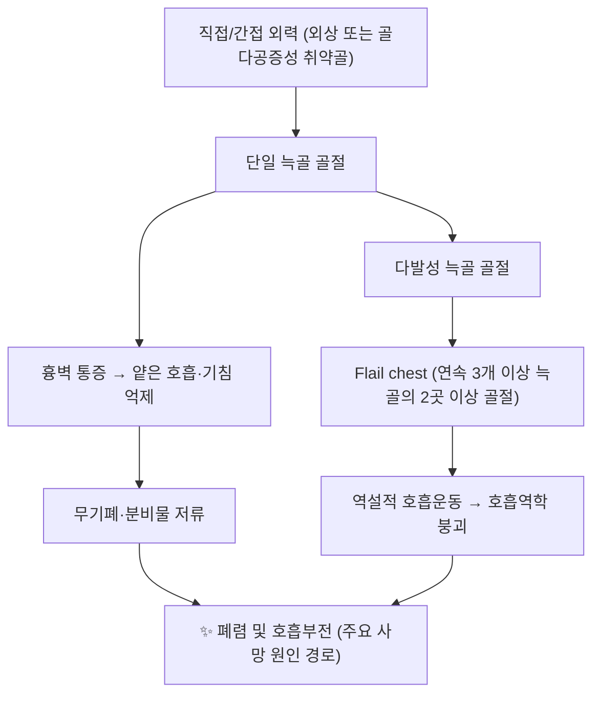

# 🫁 [[늑골 골절]] (Rib Fracture)

> **핵심 요약 (Key Summary)**:
> [[늑골]]은 흉곽의 골성 케이지를 이루며 늑간신경(T1–T11, T12)과 늑간혈관의 지배를 받는 편평골로, 늑골 골절은 흉부 외상에서 가장 흔한 골절이다.
> 4–9번 늑골이 호발하며, 1–2번 골절은 고에너지 손상·대혈관/상완신경총 손상의 표지자, 9–12번 골절은 [[간]]·[[비장]]·[[신장]] 실질 손상의 레드플래그다.
> 핵심 치료 타깃은 **충분한 진통(multimodal analgesia)** 과 **조기 가동·호흡 물리치료**이며, flail chest 및 중증 전위 골절에서 **수술적 늑골 고정술(SSRF)** 이 [[추나요법]]·[[약침]] 등 보존적 접근의 적응증 경계를 결정한다.

---
## 📌 목차
1. [해부학적 정밀 구조 및 지배 신경/혈관](#1-해부학적-정밀-구조-및-지배-신경혈관)
2. [생체역학·토크 분석 & 근막 사슬 (Biomechanical Synergy)](#2-생체역학토크-분석--근막-사슬-biomechanical-synergy)
3. [근막통증증후군(TP) & 연관통 패턴 (Travell & Simons)](#3-근막통증증후군tp--연관통-패턴-travell--simons)
4. [초음파 해부학(Sonoanatomy) 및 중재 시술 랜드마크](#4-초음파-해부학sonoanatomy-및-중재-시술-랜드마크)
5. [⭐ 원장님 심층 임상 고찰 및 원본 필기 (Clinical Pearls)](#5-원장님-심층-임상-고찰-및-원본-필기-clinical-pearls)
6. [관련 임상 질환 및 운동손상 증후군 총괄](#6-관련-임상-질환-및-운동손상-증후군-총괄)
7. [추나·도수치료(MET/PIR) & 침구·약침·재활 프로토콜](#7-추나도수치료metpir--침구약침재활-프로토콜)
8. [출처 및 학술 참고 문헌 (References)](#8-출처-및-학술-참고-문헌-references)

---
## 1. 해부학적 정밀 구조 및 지배 신경/혈관

![[늑골 골절_흉곽해부_Netter.jpg|540]]
> [그림 1: 흉곽을 이루는 늑골·늑연골·늑간강 (Netter, Respiratory System, Plate 1-18)]

| 항목 | 상세 내용 |
| :--- | :--- |
| **골 개수 및 분류** | 총 12쌍(24개). 제1–7늑골 = 진늑골(true ribs, 흉골과 직접 관절), 제8–10늑골 = 가늑골(false ribs, 늑연골궁으로 합류), 제11–12늑골 = 부늑골(floating ribs, 전방 유리) |
| **기시 (Origin)** | 후방 [[흉추]] 제1–12번 횡돌기 및 척추체와 늑골두(늑골두관절, costovertebral joint)에서 기시 |
| **정지 (Insertion)** | 제1–7늑골 전방은 [[흉골]]과 흉늑관절(sternocostal joint)로 정지, 제8–10은 상위 늑연골과 연결되어 늑연골궁 형성 |
| **지배 신경** | [[늑간신경]] (intercostal nerve, T1–T11의 전지) 및 [[늑골하신경]] (subcostal nerve, T12). 각 늑간신경은 해당 늑골 하연의 **늑골하구(costal groove)** 를 따라 주행하며, 플루아르 분지와 피부전지로 나뉨 |
| **혈관 공급** | 후방: [[후늑간동맥]](대동맥 직접 분지, T3–T11), 전방: [[내흉동맥]] 및 근횡격동맥 분지. 늑간동맥·정맥·신경은 늑골하구에서 **VAN(Vein-Artery-Nerve, 정맥-동맥-신경)** 순으로 상→하 배열 |
| **호발 골절 부위** | 제4–9늑골의 **후외측각(posterior angle) 및 액와선 부위** — 골체가 가장 길고 얇으며 직접 외력에 노출되는 구역. 근거: 해부·역학적 일반론 (개별 통계 수치는 본 노트 인용 범위 내에서 **근거 미확인**) |
| **위험 표지 늑골** | 제1–2늑골 골절 = 고에너지 외상 → [[쇄골하혈관]]·[[상완신경총]]·[[대동맥]] 손상 동반 가능. 제9–12늑골 골절 = [[간]]·[[비장]]·[[신장]]·[[횡격막]] 손상 동반 가능. 제11–12번은 보호 부재로 손상 시 내부 장기 직격 위험 |

### 🔬 해부학 도해 및 단면도
> 늑골 골절의 호발 분절별 위험 구조물 매핑 개념도(제1–2: 대혈관·신경총, 제4–9: 흉곽 안정성, 제9–12: 복부 실질 장기). 실제 해부학 도해는 별도 파일로 대체 가능.

**늑골하구(costal groove)의 임상적 의미**
* 늑골하구는 늑골 하연의 홈으로, 이곳을 따라 늑간신경과 혈관이 주행한다. 따라서 **늑골 골절의 전위 방향이 하방(내측)일 경우 늑간신경 압박·자극에 의한 국소 통증 및 연관통이 심화**될 수 있다.
* 침·약침 시술 시 늑골 하연을 직접 찌르는 자침은 늑간신경 자극 및 [[기흉]] 위험이 있으므로, 늑골 상연 또는 늑간 상방을 따라 **사자(斜刺)** 로 접근하는 것이 안전하다.

---
## 2. 생체역학·토크 분석 & 근막 사슬 (Biomechanical Synergy)

* **흉곽의 생체역학**: 늑골은 단순 보호 케이지가 아니라 **호흡 펌프(breathing pump)** 의 지렛대로 작동한다. 흡기 시 늑골은 후방 늑횡관절을 축으로 **회전 + 상방·외측 이동(pump-handle 및 bucket-handle 운동)** 하여 흉강 용적을 증가시킨다. 골절이 발생하면 이 지렛대 연결이 끊어져 **음압 발생 효율이 저하**된다.
* **연속성 파괴의 역학**: 연속된 3개 이상 늑골이 2곳 이상에서 골절되면 해당 분절이 독립적으로 움직이는 **flail segment**가 형성된다. 흡기 시 흉벽이 함몰되고 호기 시 팽융되는 **역설적 운동(paradoxical motion)** 이 발생하며, 이는 호흡일량 증가 및 폐포 환기 저하로 이어진다.
* **늑간근의 토크 부담**: 정상 시 [[외늑간근]]은 흡기, [[내늑간근]]은 호기에 관여하여 분절 안정성을 유지한다. 골절편이 불안정하면 늑간근의 등척성 고정 부담이 급증하여 **근육 과활성 → 통증 악화 → 호흡 억제**의 악순환이 생긴다.
* **근막 사슬 연계 (Myers Anatomy Trains / McGill 척추 안정성 모델)**:
  * **심부전방선(Deep Front Line)**: 흉곽 내막·늑막·횡격막과 연결되어 호흡-체간 안정성 통합에 관여. 늑골 골절 후 심부전방선의 긴장 이상은 횡격막 기능 저하로 이어질 수 있다.
  * **나선선(Spiral Line)**: [[전거근]]–[[복사근]]–대퇴근막장근 연결. 늑골 골절 환자가 통증 회피를 위해 체간을 고정하면 나선선에 보상적 긴장이 축적되어 **동측 견갑·골반의 기능 이상**이 발생할 수 있다.
  * **후방 기능선(Back Functional Line)**: [[광배근]]–흉요근막–대둔근 연결. 늑골 골절 후 광배근 과긴장은 견관절 가동 제한과 흉추 신전 제한을 유발한다.
* **McGill의 척추-흉곽 안정성 개념**: 흉곽은 복압(intra-abdominal pressure) 조절의 상부 경계이다. 늑골 골절 후 심부 코어(복횡근·횡격막·골반저)의 조정 실패는 **만성 흉배부 통증과 호흡 패턴 장애**로 남을 수 있어, 재활 시 반드시 호흡과 코어를 동시에 다루어야 한다.

---
## 3. 근막통증증후군(TP) & 연관통 패턴 (Travell & Simons)

> 늑골 골절 후 이차성 근막통증증후군에서 관찰되는 주요 근육군(늑간근, 전거근, 흉근, 흉최장근/일장근)의 위치 개념도.

* **골절 자체는 근막통증증후군이 아니나**, 골절 후 **통증 회피성 자세 및 호흡 패턴 변화**가 지속되면 늑골 주변 근육에 이차성 발통점(TrP)이 형성되어 골절 치유 후에도 통증이 잔존할 수 있다. 이는 [[늑골 골절 불유합]](symptomatic nonunion)과 감별이 필요한 임상 상황이다.
* **주요 감별 대상 근육 및 연관통 패턴 (Travell & Simons 기준)**:

| 근육 | 발통점 위치 | 연관통 패턴 | 늑골 골절과의 감별 포인트 |
| :--- | :--- | :--- | :--- |
| [[늑간근]] (Intercostals) | 골절 인접 늑간, 액와선 부위 | 국소적·분절성 흉벽 통증, 심호흡 시 악화 | 골절부와 일치. 골절 치유 후에도 잔존 시 근막성 원인 의심 |
| [[전거근]] (Serratus anterior) | 제5–7늑골 액와중선 부위 | 흉벽 측면 → 상완 내측, 제4–5수지 방사 | 늑골 골절 자체와 위치 중복. 견갑 거상 시 통증 유발 |
| [[흉근]] (Pectoralis major/minor) | 제3–5늑간, 흉골연 | 전흉부 → 상완 내측 → 척골측 전완 | 골절 없이도 흉통 유발. 어깨 내전·내회전 시 악화 |
| [[후상거근]]/[[후하거근]] (Serratus posterior) | 흉추 횡돌기–늑골각 사이 | 국소 흉배부 통증, 심호흡 시 견갑간 통증 | 골절 후 흉추 고정으로 인한 이차성 과긴장 호발 |
| [[흉최장근]]/[[일장근]] (Longissimus/Iliocostalis) | 흉추 횡돌기–늑골각 부착부 | 견갑골 내측연 → 흉벽 → 복부 방사 | 호흡 시 흉곽 확장 제한의 주 원인 |
| [[복직근]]/[[복사근]] (Abdominals) | 늑연골궁 하방, 제8–10늑연골 부착부 | 늑연골궁 → 복부 → 서혜부 | 하부 늑골 골절 및 늑연골 손상과 감별 필요 |
| [[횡격막]] (Diaphragm) | 늑연골궁 내측부, 검상돌기 후방 | 흉곽 하연 → 어깨 상부(C3–C5 연관통) | 심호흡 제한 및 딸꾹질 유발. 흉부 X선상 골절 없어도 발생 |

* **임상 적용**: 골절 치유 확인(보통 6–8주, 고령자에서 지연) 이후에도 통증이 지속되면, ① 골절 불유합, ② 늑간신경 포착, ③ 이차성 근막통증증후군을 순차적으로 감별한다.

---
## 4. 초음파 해부학(Sonoanatomy) 및 중재 시술 랜드마크

* **골절 진단에서의 초음파**: Rüttermann(2023)은 늑골 타박상과 골절의 감별에서 **집중 초음파(focused ultrasound)** 의 유용성을 논의하였다. 늑골은 표면이 얕아 고주파 선형 탐촉자(linear probe)로 접근이 용이하며, 골절 시 **피질골 연속성의 단절(cortical disruption)**, **골막하 혈종**, **주변 연부조직 부종**을 실시간으로 확인할 수 있다.

| 스캔 뷰 | 탐촉자 위치 | 확인 구조물 | 임상 활용 |
| :--- | :--- | :--- | :--- |
| **늑골 단축 뷰 (transverse)** | 통증 부위 늑골 위, 탐촉자를 늑골 장축에 수직으로 | 피질골 표면, 골막, 늑간근 | 피질골 단절·계단형 전위 확인 |
| **늑골 장축 뷰 (longitudinal)** | 늑골을 따라 평행하게 이동 | 골체 연속성, 늑연골 접합부 | 미세 골절 및 불유합 추적 |
| **늑간 초음파 (intercostal)** | 늑골 사이 늑간강 | 늑간신경·혈관, 흉막선(pleural line) | 늑간신경 차단(ICNB) 랜드마크, 흉막 손상 회피 |
| **전거근 평면 (Serratus Anterior Plane, SAP)** | 액와중선 제5–6늑골 높이 | 전거근, 늑간근, 흉막 | 다발성 늑골 골절 진통 블록 |
| **직립척추근 평면 (Erector Spinae Plane, ESP)** | 흉추 횡돌기 위, 제5–7흉추 높이 | 직립척추근, 늑횡관절 | 후방 늑골 골절 및 다발성 골절 진통 |
| **척추주위 차단 (Paravertebral)** | 횡돌기 외측, 늑횡관절 상방 | 늑간신경 기시부, 흉막 | 편측 다발성 골절 진통의 표준적 접근 |

* **침구·약침 시술의 안전 마진 (필수 준수)**:
  * 늑간강 자침 시 **흉막선까지의 거리는 체형에 따라 매우 짧을 수 있으므로**, 얕은 사자(斜刺, 15–30도)를 원칙으로 한다.
  * **제1–2늑골 상방(쇄골상와)은 쇄골하혈관·상완신경총·폐첨부가 근접**하므로 깊은 자침을 금한다.
  * **제9–12늑골 하연은 간·비장·신장·횡격막**에 근접하므로 과도한 심자와 장시간 유침을 피한다.
  * 늑골 골절 **급성기(골절선 불안정 시기)** 에는 골절부 직접 자침·부항·압박을 피하고, 원위 취혈 및 대측 취혈로 통증을 조절한다.
* **약침 시술 시 주의**: 약침액의 삼투압·자극성에 따라 늑간 근육 경련이 유발될 수 있어, 늑간 자극성 약침은 저용량·저농도로 접근하고 흉막 천자를 반드시 배제한다.

---
## 5. ⭐ 원장님 심층 임상 고찰 및 원본 필기 (Clinical Pearls)

> 아래는 임상 현장에서 축적된 고찰 영역으로, 개별 수치·기전에 대한 학술적 확증이 필요한 항목은 **근거 미확인**으로 표기한다.

* **① "갈비뼈 골절에서 가장 무서운 것은 뼈가 아니라 폐다."**
  늑골 골절의 예후를 결정하는 것은 골절선 자체가 아니라 **통증으로 인한 얕은 호흡 → 무기폐 → 폐렴**의 연쇄다. 따라서 한의원에서 늑골 골절 환자를 마주하면 가장 먼저 물어야 할 것은 "얼마나 아프냐"가 아니라 **"숨을 끝까지 들이마실 수 있느냐, 기침이 가능하냐, 가래가 나오느냐"** 이다. 기침이 억제되는 환자는 진통이 불충분한 것이다.
* **② 고령 환자는 골절 개수보다 '전신 상태'가 문제다.**
  고령자는 낙상 한 번으로 다발성 늑골 골절이 발생하며, 기저 폐질환(COPD, 폐기종)이 있으면 위험이 급증한다. **고령 + 다발성 + 기침 불가**는 즉시 상급병원 이송 적응증으로 판단한다. 구체적 사망률 예측 수치는 본 노트 인용 논문 범위에서 **근거 미확인**이나, 고령 늑골 골절이 고위험군이라는 정설은 임상적으로 확립되어 있다.
* **③ 레드플래그 스크리닝 — 첫 내원 5분 루틴**
  1. **제1–2늑골 압통?** → 대혈관·신경총 손상 의심 → 즉시 전원.
  2. **제9–12늑골 압통 + 복부 압통?** → 간·비장·신장 손상 의심 → 즉시 전원.
  3. **호흡곤란, 청색증, 산소포화도 저하?** → 긴장성 기흉·혈흉 의심 → 응급 이송.
  4. **피하기종, 흉벽 함몰, 역설적 호흡운동?** → flail chest → 응급 이송.
  5. **외상 기전이 고에너지(교통사고, 추락, 둔기)?** → 단순 늑골 골절로 단정 금지.
* **④ "3개 이상 = 병원, 3개 미만 = 관리"는 단순화된 기준이다.**
  골절 개수는 중요한 지표이나, 실제 임상 결정은 **호흡 상태 + 동반 손상 + 나이 + 기저질환**의 조합으로 내려야 한다. Pieracci 등(2020)의 NONFLAIL 연구는 **flail chest가 아닌 중증 골절 패턴**에서도 수술적 흉벽 안정화의 효과를 검증한 다기관 전향적 대조 임상시험이라는 점에서, "flail이 아니면 무조건 보존적"이라는 도식이 더 이상 유효하지 않음을 시사한다.
* **⑤ 수술적 늑골 고정술(SSRF)의 위치**
  Sawyer 등(2022)의 체계적 문헌고찰 및 메타분석은 **다발성 늑골 골절 및 flail chest**에서 SSRF의 결과를 평가하였다. Balogh(2021)는 SSRF의 **적응증·시기·기준선(baseline)** 설정이 아직 정립 중임을 지적하였다. 즉 SSRF는 만능이 아니며, **어떤 환자에게 어떤 시점에** 시행할지가 핵심 논점이다. 한의 임상에서는 SSRF 시행 여부가 **보존적 재활 프로토콜의 강도와 시기를 결정하는 분기점**이 된다.
* **⑥ 골절이 '붙었는데도' 아픈 환자 — 불유합과 근막통증의 감별**
  DeGenova와 Peabody(2024)의 체계적 문헌고찰은 **증상성 늑골 골절 불유합(symptomatic nonunion)** 을 다루었다. 3개월 이상 국소 통증·압통이 지속되고 일상 기능이 제한되면 불유합을 의심하며, 단순 근막통증증후군으로 오진하지 않도록 한다. 반대로 불유합이 아님이 확인된 잔존 통증은 늑간신경 포착 및 이차성 근막통증으로 접근한다.
* **⑦ 진통 전략의 층위**
  van Zyl과 Ho(2024)의 서술적 고찰은 늑골 골절 진통의 다양한 접근(전신 진통제, 늑간신경 차단, 척추주위 차단, 근막 평면 차단 등)을 정리하였다. 한의 임상에서는 **급성기 진통은 서양의학적 중재에 맡기고**, 한의 치료는 **급성기 이후 잔존 통증·호흡 제한·근막 기능 이상**에 집중하는 역할 분담이 안전하다.
* **⑧ 호흡 재교육은 선택이 아니라 필수다.**
  늑골 골절 환자의 재활에서 **유인성 폐활량계(incentive spirometry)와 심호흡·기침 교육**은 통증 조절과 동급의 핵심이다. 침 치료 후 통증이 경감된 직후가 **심호흡 재교육의 골든타임**이며, 이때 호흡 패턴을 교정해 두어야 만성 흉곽 기능 제한을 예방할 수 있다.
* **⑨ 외상 없는 늑골 골절은 '골다공증 신호등'이다.**
  명확한 외상력 없이 늑골 골절이 발생한 중·고령 환자에서는 [[골다공증]] 및 전이성 골병변을 반드시 감별해야 한다. 다발성·양측성·비전형 위치 골절은 병적 골절(pathologic fracture) 가능성을 시사한다.
* **⑩ 원장님 필기 요약 문장**
  > "늑골 골절은 **뼈의 문제로 오지만 폐의 문제로 죽는다.** 초진에서 호흡·기침·산소포화도를 확인하고, 진통을 확보한 뒤 호흡을 가르쳐라. 3개월 넘게 아프면 붙었는지부터 확인하라."

---
## 6. 관련 임상 질환 및 운동손상 증후군 총괄

| 임상 질환 / 증후군 | 병리적 연관 기전 | 주요 증상 및 이학적 검사 | 핵심 교정 타깃 |
| :--- | :--- | :--- | :--- |
| [[Flail chest]] (동요흉) | 연속 3개 이상 늑골의 2곳 이상 골절 → 독립 분절 형성 → 역설적 호흡운동 | 흡기 시 흉벽 함몰, 심한 호흡곤란, 저산소증. 시각적 확인 | 응급 이송, SSRF 평가, 기계환기 고려 |
| [[기흉]] / [[혈흉]] | 골절편에 의한 흉막·폐·늑간혈관 손상 | 급성 호흡곤란, 편측 호흡음 감소, 타진 과공명(기흉)·탁음(혈흉) | 응급 처치, 흉관 삽관 |
| [[폐렴]] (골절 후 이차성) | 통증 → 얕은 호흡·기침 억제 → 무기폐 → 분비물 저류 | 발열, 화농성 객담, 산소포화도 저하, 청진상 수포음 | 진통 확보 + 조기 가동 + 호흡 물리치료 |
| [[늑골 골절 불유합]] (Symptomatic nonunion) | 골절편 전위·불안정, 골절부 혈류 저하, 흡연, 감염 등 | 3개월 이상 국소 통증·압통·기능 제한. 영상상 골절선 잔존 | 수술적 평가 의뢰 / 보존적 재활 (DeGenova 2024) |
| [[늑간신경통]] (Intercostal neuralgia) | 골절 치유 과정의 늑간신경 포착·압박 또는 골가골(callus) 자극 | 피부분절 분포의 작열통·저림, 늑간 압통, 심호흡 시 악화 | 늑간 차단, 원위 취혈, 신경가동 |
| [[이차성 근막통증증후군]] | 통증 회피 자세 → 늑간근·전거근·흉근·흉최장근의 지속적 과긴장 | 발통점 압통, 국소 연축, 연관통 재현 | MET/PIR, 건식 침, 약침 |
| [[견갑흉곽 증후군]] | 흉곽 고정 → 견갑곽 가동 저하 → 나선선 보상 | 견관절 거상 제한, 견갑 내측연 통증, 상완 내회전 제한 | 전거근 강화, 흉추 가동성 회복 |
| [[골다공증]] / [[병적 골절]] | 저에너지 외상에서의 취약골 골절, 전이성 병변 | 외상 없는 늑골 골절, 양측성·비전형 위치, 전신 골밀도 저하 | 원인 감별, 골대사 평가 의뢰 |
| [[호흡 패턴 장애]] (역기능적 호흡) | 흉곽 확장 제한 → 상부 흉식 호흡 우세 → 목·흉곽 부속근 과사용 | 늑골 하연 확장 감소, 사각근·흉소근 과긴장, 호흡곤란감 | 횡격막 호흡 재교육, 흉곽 가동성 훈련 |

---
## 7. 추나·도수치료(MET/PIR) & 침구·약침·재활 프로토콜

### 7-1. 한의학 경혈 매핑

| 분류 | 경혈 | 선정 근거 (한의학적 접근) |
| :--- | :--- | :--- |
| **국소 흉부** | [[기문]](LR14), [[장문]](LR13), [[대포]](SP21), [[천계]](PC1), [[단중]](CV17) | 흉협부 국소 기혈 순환 및 통증 완화. 단, **골절 급성기 직접 자극 금지** |
| **원위 취혈 (흉협통 주치)** | [[지구]](TE6), [[양릉천]](GB34), [[구허]](GB40), [[태충]](LR3), [[내관]](PC6) | 고전적으로 흉협부 통증·만성 흉협통에 활용되는 원격 취혈 |
| **기혈 순환 및 진통** | [[합곡]](LI4), [[족삼리]](ST36), [[삼음교]](SP6) | 전신 기혈 조정 및 진통 보조 |
| **배부 협척** | [[화타협척]](T3–T8 해당 분절) | 분절성 신경 조절 및 흉추 주변 근긴장 완화 |
| **호흡 조절 관련** | [[천종]](SI11), [[중부]](LU1), [[폐수]](BL13) | 폐기(肺氣) 선통, 흉곽 확장 보조 |

> ⚠️ **안전 원칙**: 흉배부 자침은 **사자(斜刺)·평자(平刺)** 를 원칙으로 하며 심자·직자를 금한다. 골절부 직접 자극, 흡사항아리·부항 등 음압 요법은 급성기(최소 2–4주, 골절 안정성 확인 전까지) 금지한다.

### 7-2. 추나·도수치료 (MET/PIR)

* **급성기(0–2주): 도수치료 최소화 원칙**
  * 흉추·늑골에 대한 **직접 추나 및 관절가동술(grade III–IV) 금지**. 통증 유발 및 골절 전위 위험.
  * 허용되는 접근: **호흡 유도 이완, 원위 관절(견관절·경추)의 부드러운 이완, 자세 교육**.
* **아급성기(2–6주): 근막 이완 중심**
  * **PIR (Post-Isometric Relaxation)**: 늑간근·전거근·흉근에 대해 **약 20–30% 강도의 등척성 수축 5–7초 → 이완 10–20초**를 3–5회 반복. 흉곽 확장을 유도하되 통증 유발 역치 이하로 유지.
  * **MET for 흉추 신전 회복**: 환자 앉은 자세에서 흉추 신전에 대한 등척성 저항 → 이완 시 부드러운 신전 유도.
  * **견갑곽 가동 (Scapular mobilization)**: 늑골에 직접 부하를 주지 않고 견갑-흉곽 리듬을 회복시켜 전거근·승모근 협응을 재교육.
* **회복기(6주 이후): 기능 회복 중심**
  * **흉추 가동성 회복**: 측와위 흉추 회전 가동술(저강도, 통증 없는 범위).
  * **호흡-코어 통합 훈련**: 횡격막 호흡 + 복횡근 활성 + 골반저 협응.
  * **점진적 부하**: 가벼운 저항 운동 → 유산소 → 상지 과두 운동 순으로 단계 진행.
* **금기 및 주의**: 불유합 의심, 골절선 미유합, 호흡곤란 동반, 고령·골다공증 중증 환자에서는 도수치료 강도를 대폭 낮추거나 시행하지 않는다.

### 7-3. 침구·약침 프로토콜

| 단계 | 침구 전략 | 약침 전략 | 주의사항 |
| :--- | :--- | :--- | :--- |
| **급성기 (0–2주)** | 원위 취혈 중심 ([[지구]], [[양릉천]], [[내관]], [[합곡]]). 자침 심도 최소화, 유침 10–15분 | 늑골 골절부 직접 약침 **금지**. 원위 혈위 소량 약침만 고려 | 흉곽 직접 자극 금지, 흡사·부항 금지, 진통 불충분 시 서양의학적 진통 중재 우선 |
| **아급성기 (2–6주)** | 국소 혈위 사자(斜刺) 추가 ([[기문]], [[대포]], [[장문]]), 협척 자극 | 늑간근 과긴장 부위에 저농도·소량 약침 (근육 내, 흉막 천자 주의) | 흉막선 초음파 확인 권장, 자극성 약침 회피 |
| **회복기 (6주 이후)** | 국소 + 원위 병용, 화타협척 T3–T8, [[폐수]], [[천종]] | 이차성 발통점 대상 약침, 근막 이완 목적 | 불유합 감별 후 시행 |

> **약침 약재 선택에 관하여**: 골절 치유 촉진을 목적으로 [[골쇄보]], [[속단]], [[두충]] 등 한약재 기반 약침이 임상에서 논의되나, **늑골 골절에서의 특정 약침 효능에 대한 본 노트 인용 논문 범위 내 근거는 미확인**이다. 약재 선택 및 배합은 원장의 임상 경험과 환자 상태에 따라 결정하며, 근거 확보 전까지는 **진통·근이완·기혈 순환 목적의 보조적 접근**으로 한정하는 것이 안전하다.

### 7-4. 재활 프로토콜 (핵심 4축)

1. **진통 확보 (Analgesia First)**
   * 늑골 골절 관리의 제1원칙. 다중 모달 진통(multimodal analgesia)이 기본이며, van Zyl과 Ho(2024)는 늑간신경 차단, 척추주위 차단, 근막 평면 차단 등 다양한 중재를 정리하였다.
   * 진통이 확보되지 않으면 이후 모든 재활이 실패한다.
2. **폐 확장 (Lung Expansion)**
   * 유인성 폐활량계(incentive spirometry) 시간당 10회 수준의 규칙적 사용 교육 (구체적 처방 프로토콜은 기관별 지침에 따름).
   * 심호흡 + 기침 + 분비물 배출 교육. 통증 조절 직후가 교육의 최적 시점.
3. **조기 가동 (Early Mobilization)**
   * 침상 안정은 무기폐·폐렴·혈전의 위험을 증가시킨다. 가능한 범위에서 조기 좌위·보행 시작.
   * 자세 변경 시 통증 유발 동작(체간 회전, 기침)에 대한 사전 교육.
4. **점진적 기능 회복 (Progressive Functional Recovery)**
   * 흉추 가동성 → 견갑곽 안정성 → 심부 코어·호흡 통합 → 상지 부하 운동 순으로 단계화.
   * 6주 이후에도 통증이 지속되면 **불유합 감별(영상 재평가)** 을 최우선으로 한다 (DeGenova & Peabody 2024).

### 7-5. 전원(의뢰) 기준 요약

| 즉시 응급 이송 | 조기 전문과 의뢰 | 한의 단독 관리 가능 |
| :--- | :--- | :--- |
| 호흡곤란·저산소증, 피하기종, 역설적 호흡운동, 제1–2늑골 골절, 제9–12늑골 + 복부 압통, 다발성·양측성, 고에너지 외상 | 다발성(3개 이상), 고령 + 기저 폐질환, 진통 불충분, 3개월 이상 통증 지속(불유합 의심) | 단일·비전위 골절, 호흡 안정, 젊은 환자, 외상 후 2주 이상 경과 및 안정적 경과 |

---
## 8. 출처 및 학술 참고 문헌 (References)

**인용 논문 (제공된 실제 PubMed 데이터)**

1. **DeGenova, D. T., & Peabody, J. T. (2024)**. Symptomatic rib fracture nonunion: a systematic review of the literature. *Archives of Orthopaedic and Trauma Surgery*. PMID: 38492065
2. **Balogh, Z. J. (2021)**. Rib Fracture Fixation: Where and What is the Baseline? *Injury*. PMID: 34051981
3. **van Zyl, T., & Ho, A. M. (2024)**. Analgesia for rib fractures: a narrative review. *Canadian Journal of Anesthesia*. PMID: 38459368
4. **Rüttermann, V. (2023)**. [Bruise or fracture? The rib in focused ultrasound]. *MMW Fortschritte der Medizin*. PMID: 36894858
5. **Sawyer, E., & Wullschleger, M. (2022)**. Surgical Rib Fixation of Multiple Rib Fractures and Flail Chest: A Systematic Review and Meta-analysis. *Journal of Surgical Research*. PMID: 35390577
6. **Pieracci, F. M., & Leasia, K. (2020)**. A multicenter, prospective, controlled clinical trial of surgical stabilization of rib fractures in patients with severe, nonflail fracture patterns (Chest Wall Injury Society NONFLAIL). *Journal of Trauma and Acute Care Surgery*. PMID: 31804414

**기본 교과서 및 참고 문헌**

7. **Standring, S. (2020)**. *Gray's Anatomy: The Anatomical Basis of Clinical Practice* (42nd ed.). Elsevier.
8. **Travell, J. G., & Simons, D. G. (1999)**. *Myofascial Pain and Dysfunction: The Trigger Point Manual*, Vol. 1. Williams & Wilkins.
9. **Myers, T. W. (2020)**. *Anatomy Trains: Myofascial Meridians for Manual and Movement Therapists* (4th ed.). Elsevier.
10. **McGill, S. M. (2016)**. *Low Back Disorders: Evidence-Based Prevention and Rehabilitation* (3rd ed.). Human Kinetics.

> **근거 등급 안내**: 본 노트에서 특정 수치(사망률, 합병증 발생률, 골절 개수별 위험도 등)를 명시하지 않은 항목은 인용 논문 범위 내에서 **근거 미확인**으로 표시하였다. 임상 적용 시 최신 지침 및 원문 확인을 권장한다.