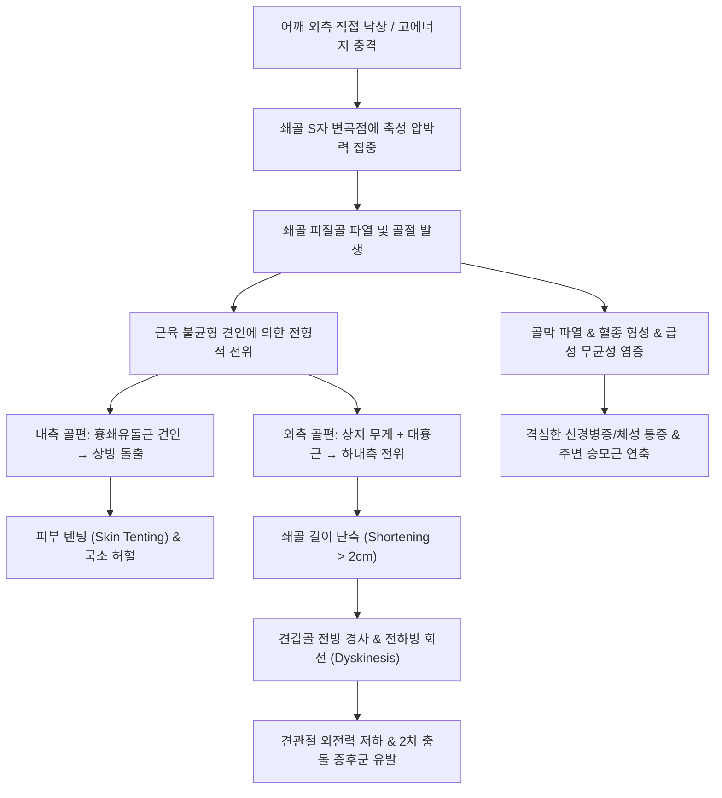

# 🩺 [[쇄골 골절]] (Clavicle Fracture / 鎖骨骨折, S42.0)

> **핵심 3줄 요약 (Key Summary)**:
> - 📍 병소 부위 & 해부·병태생리: 견갑대와 체간을 연결하는 유일한 골성 지지대인 [[쇄골]]의 간부(80%), 원위부(15%), 근위부(5%)에서 호발하며, [[흉쇄유돌근]]의 상방 견인과 상지 체중 및 [[대흉근]]의 하내측 견인이 복합되어 정형적 전위와 단축을 형성함.
> - 🚩 전형적 임상 양상 & 3대 징후: 어깨 외측 직접 충격 후 급격한 국소 격통, 환측 견관절의 하수(droop) 및 내회전, 골절부 피부 텐팅(tenting) 및 마찰음(crepitus)과 함께 환측 팔을 건측 손으로 받쳐 지지하는 특징적 보호 자세.
> - 🛠️ 핵심 감별 검사 & 한·양방 다각적 치료 전략: 단순 방사선(AP 및 15~30도 두측 경사 뷰)으로 2cm 이상 단축 및 분쇄 여부를 확인하고, 비전위 골절은 슬링/8자 붕대 보존 치료를, 완전 전위·분쇄는 금속판 내고정술을 시행하며, 한의 통합 치료로 급성기 [[당귀수산]] 투여 및 주변 혈위 전침 치료, 유합기 [[접골탕]]·[[자연동]] 처방과 Codman 진자 운동으로 조기 기능 회복을 촉진함.
> - ⚠️ 응급 의뢰 레드플래그 & 악화 요인: 골편에 의한 피부 관통 절박(skin tenting with blanching), [[쇄골하동맥]]·[[쇄골하정맥]] 손상 의심(요골동맥 맥박 소실, 급속 팽창 혈종), [[상완신경총]] 압박(원위부 마비·이상감각), 기흉·혈흉(호흡곤란, 흉통) 발생 시 즉시 권역외상센터 응급 수술 의뢰.

---

## 📌 목차
1. [질환 개요 & 해부학적 병태생리](#1-질환-개요--해부학적-병태생리)
2. [병태생리 메커니즘 & 생체역학적 악순환 네트워크](#2-병태생리-메커니즘--생체역학적-악순환-네트워크)
3. [임상 증상 & 이학적 검사(Physical Exam) 알고리즘](#3-임상-증상--이학적-검사physical-exam-알고리즘)
4. [감별 진단 매트릭스 (Differential Diagnosis)](#4-감별-진단-매트릭스-differential-diagnosis)
5. [한의 통합 치료 프로토콜 (침·약침·추나·한약)](#5-한의-통합-치료-프로토콜-침약침추나한약)
6. [양방 치료 & 병용·의뢰 기준 (Conventional Treatment & Referral)](#6-양방-치료--병용의뢰-기준-conventional-treatment--referral)
7. [재활 운동 & 생활습관 티칭 가이드](#7-재활-운동--생활습관-티칭-가이드)
8. [💡 사용자 진료실 핵심 필기 & 임상 노하우 (Melt-In 잔여 심화 집약)](#8--사용자-진료실-핵심-필기--임상-노하우-melt-in-잔여-심화-집약)
9. [출처 및 학술 참고 문헌 (References)](#9-출처-및-학술-참고-문헌-references)

---

## 1. 질환 개요 & 해부학적 병태생리

![[쇄골_골절_01_환부실사.png|450]]
> [그림 1: ① 질환 개요 및 병태생리 — 쇄골 골절 시 어깨 처짐 및 간부 손상 기전 — Smart-Servier/Wikimedia Commons CC BY 3.0]

![[쇄골_골절_01_영상소견.png|450]]
> [그림 2: ② 단순 방사선 X-ray 영상 소견 — 좌측 쇄골 간부 전위 골절(AP 뷰) — Wikimedia Commons CC BY-SA 3.0]

* **질환 정의 및 역학**:
  * [[쇄골 골절]](Clavicle Fracture)은 전체 성인 골절의 약 2.6~5%, 견갑대 골절의 35~45%를 차지하는 흔한 외상성 골절이다.
  * 호발 연령은 남성 20대 이하(스포츠 외상, 낙차 사고)와 여성 70대 이상(골다공증성 낙상)의 전형적인 쌍봉형(bimodal) 분포를 보인다.
  * 수상 기전의 85% 이상은 어깨 외측으로 직접 넘어지며 발생하는 축성 압박력(axial compressive force)에 의하며, 손을 짚고 넘어지는 간접 손상(FOOSH: Fall Onto Outstretched Hand)은 10% 미만이다.

* **관련 해부학적 구조물**:
  * **골격 및 관절**:
    * [[쇄골]]은 수평면에서 볼 때 내측 2/3는 전방으로 볼록(convex anteriorly)하고 외측 1/3은 후방으로 오목(concave anteriorly)한 S자형 횡단 굴곡을 가진다.
    * 흉골단([[흉쇄관절]])은 전후 흉쇄인대와 늑쇄인대로 흉곽에 견고히 연결되며, 견봉단([[견봉쇄관절]])은 견봉쇄인대 및 강력한 [[오구쇄골인대]](마름모인대 trapezoid ligament, 원추인대 conoid ligament)에 의해 견갑골 오구돌기와 체결된다.
    * 쇄골의 중앙 1/3부(간부, midshaft)는 횡단면이 원통형에서 편평형으로 이행하는 부위로 해부학적 골 피질이 가장 얇고, 인대 지지가 없으며 상하 근육 견인력이 교차하므로 골절의 80%가 이곳에서 집중 발생한다.
  * **근육 및 근막**:
    * 내측 골편: [[흉쇄유돌근]](SCM)이 내측 1/3 상면에 부착하여 골편을 상후방으로 강하게 거상(elevation)시킨다.
    * 외측 골편: 상지의 자체 무게와 [[대흉근]](pectoralis major), [[광배근]](latissimus dorsi)의 견인력으로 인해 하방 및 내측으로 전위 및 단축(adduction & downward displacement)된다. 외측 상면에는 [[승모근]](trapezius), 전면에는 [[삼각근]](deltoid)이 부착한다.
    * 쇄골 하면에는 [[쇄골하근]](subclavius muscle)이 주행하여 심부 혈관을 완충 보호한다.
  * **신경 및 혈관 복합체 (위험 구역)**:
    * 쇄골의 간부 바로 하방(쇄골하강)으로 [[쇄골하동맥]](subclavian artery), [[쇄골하정맥]](subclavian vein), 그리고 [[상완신경총]](brachial plexus)의 신경간(trunks)과 신경속(cords)이 늑쇄공간(costoclavicular space)을 지나 제1늑골 위를 횡단한다.
    * 쇄골 표면 피하에는 [[쇄골상신경]](supraclavicular nerve, C3-C4) 피부분지가 횡단하므로 골절이나 수술적 절개 시 흉부 상부의 감각 저하나 유통성 신경종이 초래될 수 있다.

---

## 2. 병태생리 메커니즘 & 생체역학적 악순환 네트워크

![[쇄골_골절_02_해부도해.png|450]]
> [그림 3: ③ 관련 해부학적 구조물 — 쇄골 골격, 흉골단/견봉단 및 근육 부착부 해부도 — Gray's Anatomy Plate/Public Domain]

![[쇄골_골절_02_골절분류.png|450]]
> [그림 4: ③ 쇄골 골절의 해부학적 분류 체계 — Allman Group I(간부), Group II(원위부), Group III(근위부) 도해 — Wikimedia Commons CC BY-SA 4.0]

### 1) 해부학적 골절 분류 체계 (Allman & Neer & Robinson)
* **Allman 분류 (해부학적 위치 기준)**:
  * **Group I (간부 골절, 75~80%)**: 쇄골 중앙 1/3부. 가장 흔하며 근육 견인에 의한 정형적 변형이 발생함.
  * **Group II (외측/원위부 골절, 15~20%)**: 견봉단 1/3부. [[오구쇄골인대]] 손상 동반 여부에 따라 불유합률이 크게 달라짐.
  * **Group III (내측/근위부 골절, 5%)**: 흉골단 1/3부. 강력한 인대 복합체로 지지되어 드물며, 전방 전위 시 피부 돌출, 후방 전위 시 종격동 내 대혈관·기관 압박 응급 초래.
* **Neer 분류 (Group II 원위부 세분화)**:
  * **Type I (안정형)**: 오구쇄골인대 내측/외측 사이의 골절이나 인대가 건재하여 전위가 경미함. 보존적 치료 적응증.
  * **Type II (불안정형 - 불유합 호발)**:
    * IIA: 골절선이 원추인대 부착부 내측에 위치하여 양대 인대가 모두 외측 골편에 남음 (내측 골편 상방 전위 심함).
    * IIB: 원추인대가 완전 파열되고 마름모인대만 외측 골편에 부착됨. 불유합률 30~40%에 달해 조기 수술 필요.
  * **Type III**: 견봉쇄관절면 침범 골절. 관절염 진행 위험이 높아 후기 관절성형술 고려.

### 2) 생체역학적 연쇄 반응 (Kinetic Chain Impairment)
* **어깨 버팀대 기능의 소실**:
  * 정상 쇄골은 상지를 체간으로부터 일정 거리 외측으로 띄워 유지해주는 스트럿(Strut) 역할을 수행한다.
  * 쇄골이 골절되어 2cm 이상 단축되면 견갑골이 전하방으로 전도(anterior tilting & protraction)되면서 [[견갑흉곽관절]]의 운동장애(Scapular dyskinesis)가 영구 고착된다.
  * 이로 인해 견봉하 공간이 좁아져 회전근개 충돌이 발생하고, [[삼각근]]의 지레 팔(lever arm)이 짧아져 견관절 외전 및 거상 근력이 15~25% 영구 감소한다.

---

## 3. 임상 증상 & 이학적 검사(Physical Exam) 알고리즘

### 1) 주소증 및 신경혈관학적 증상
* **체성 및 신경학적 증상**:
  * 골절 부위의 심한 자발통, 압통, 종창, 피하 반상출혈.
  * 골편 마찰음(crepitus) 및 계단상 변형(step-off deformity): 골절단이 피하로 뾰족하게 융기되어 만져짐.
  * **전형적 보호 자세(Supporting posture)**: 환자는 머리를 환측으로 기울여 흉쇄유돌근의 긴장을 늦추고, 건측 손으로 환측 팔꿈치를 받쳐 상지의 하방 당김을 최소화하는 자세를 취함.
* **혈관 및 신경학적 적신호**:
  * 쇄골하혈관 압박 시 요골동맥 맥박 감약, 상지 냉감, 청색증, 부종 관찰.
  * 상완신경총 분지 압박 시 수지 저림, 이상감각, 파악력 저하.

### 2) 필수 이학적 검사법 (Physical Examination)

![[쇄골_골절_03_고정보조기.png|420]]
> [그림 5: ④ 보존적 치료를 위한 고정 보조기 — 쇄골 골절용 8자 붕대(Figure-of-eight bandage) 고정 실사 — Wikimedia Commons CC BY-SA 3.0]

* **피부 상태 평가 (Skin Tenting & Blanching Test)**:
  * 쇄골 상부 피부를 면밀히 관찰하여 골편이 피하를 압박해 피부가 하얗게 질리는(blanching) 텐팅 현상이 있는지 확인.
  * 텐팅이 지속되면 수 시간 내 피하 괴사가 진행되어 개방성 골절로 전환되므로 즉각적인 도수 견인 또는 응급 수술이 요구됨.
* **상지 신경혈관 스크리닝 검사**:
  * [[요골동맥]] 맥박 촉진 및 모세혈관 재충혈 시간(CRT < 2초) 측정.
  * C5~T1 피부분절 감각 검사(특히 액와신경 지배의 삼각근 외측, 정중신경의 검지 끝, 척골신경의 소지 끝).
  * 수근관절 배굴(요골신경), 무지 대립(정중신경), 수지 외전(척골신경) 운동 검사 시행.
* **방사선학적 확진 검사**:
  * 쇄골 전후면 사진(Clavicle AP view): 골절의 위치 및 전위 정도 확인.
  * 쇄골 20~30도 두측 경사 전후면 사진(30° Cephalic tilt view): 흉곽 및 견갑골과의 겹침을 배제하고 쇄골 장축과 골절편의 전하방 전위를 입체적으로 평가.

---

## 4. 감별 진단 매트릭스 (Differential Diagnosis)

| 감별 질환 | 호발 병소 및 손상 기전 | 주소증 및 임상 양상 차이점 | 특이적 영상 및 이학적 검사 소견 |
| :--- | :--- | :--- | :--- |
| [[쇄골 골절]] (본 질환) | 쇄골 간부(80%) 또는 원위부(15%) 축성 외상 | 쇄골 장축 골결손, 계단상 변형, 피부 텐팅, 골편 마찰음 | 쇄골 AP/30° Cephalic X-ray상 피질골 연속성 단절 |
| [[견봉쇄관절 탈구]] | 어깨 외측 직접 타박, AC/CC 인대 파열 | 견봉 외측단 융기, 누르면 들어갔다 튀어나오는 피아노 건반 징후(Piano key sign) | Zanca 뷰 X-ray상 오구쇄골 간격(CC distance) 50% 이상 증가 |
| [[흉쇄관절 탈구]] | 흉골단 쇄골 연결부 타박, 전방/후방 탈구 | 흉골 상단 내측 통증, 후방 탈구 시 연하곤란(dysphagia), 호흡곤란 | 흉골 40° 앙와위 두측 경사 촬영(Heinig 뷰) 또는 흉부 CT 확진 |
| [[회전근개 파열]] | 견관절 간접 과신전, 퇴행성 파열 | 쇄골 변형 없음, 견관절 능동 외전 불능(동통호), 극하근/극상근 위축 | Drop arm test 양성, 견관절 초음파 및 MRI상 건 파열 |
| [[상완골 근위부 골절]] | 상완골 경부/골두 낙상 외상 | 상완 외측 및 액와부 거대 혈종, 어깨 외전 완전 불능 | 어깨 Trillat/Scapular Y-view상 상완골 경부 골절선 |

---

## 5. 한의 통합 치료 프로토콜 (침·약침·추나·한약)

![[쇄골_골절_05_도수정복술기.png|400]]
> [그림 6: ⑤ 쇄골 골절의 도수정복술(Closed Reduction) 술기 실사 — 견갑간부 지지 후 양측 견관절 후상방 견인 — Wikimedia Commons CC BY-SA 3.0]

![[쇄골_골절_05_내고정수술소견.png|400]]
> [그림 7: ⑥ 수술적 정복 및 금속판 내고정술(ORIF) 술기 영상 소견 — 해부학적 금속판 및 나사못 고정 — Wikimedia Commons CC BY-SA 3.0]

### 1) 침구 치료 (Acupuncture & Electroacupuncture)
* **급성기 1~2주 (소종지통기)**:
  * 골절 환부 직접 자침은 절대 금기이며, 골절 원위부 및 배측 지지 근육군의 긴장을 완화하는 원위 취혈을 원칙으로 함.
  * 주요 혈위: [[견정(GB21)]], [[견우(LI15)]], [[견료(TE14)]], [[천종(SI11)]], [[곡지(LI11)]], [[합곡(LI4)]], [[중저(TE3)]].
  * 승모근 상부섬유 및 견갑거근의 연축을 완화하기 위해 저주파(2Hz) 연속파 전침을 15분간 적용하여 통증 매개 펩타이드(Substance P)를 억제하고 혈류를 개선함.
* **아급성기 3~6주 (가골형성기)**:
  * 골막 반응 유도 및 골아세포 활성화를 위해 쇄골 골절선 상하 2cm 건측 피부선상에 사자(oblique needling)하여 미세 전류 전침(100Hz/2Hz 혼합파)을 인가. 골아세포의 BMP-2 발현을 촉진.

### 2) 약침 치료 (Pharmacopuncture)
* **급성기 어혈 제거 및 소염**:
  * 약침 제제: 신바로약침, 소염약침 또는 황련해독탕 약침.
  * 주입점: 골절선 주변의 반상출혈부 피하 및 [[승모근]], [[대흉근]] 쇄골두 건부착부 각 0.1~0.2cc씩 분주 (총 1.0cc).
* **유합 촉진 및 인대 강화기 (3주 이후)**:
  * 약침 제제: 자하거(Hominis Placenta) 약침, 녹용 약침.
  * 주입점: [[오구쇄골인대]] 투영 부위 및 견봉쇄관절 주위, 견갑배신경 포착 지점에 각 0.2cc씩 심부 주입하여 세포외기질 합성 및 섬유연골성 가골 석회화 촉진.

### 3) 추나 및 도수 치료 (Chuna Manipulation)
* **급성기 도수 정복 (Closed Reduction - 비전위/경미 전위 시)**:
  * 환자를 의자에 앉히고 술자는 환자 등 뒤에서 한쪽 무릎을 환자의 견갑골 사이에 댄 후, 양측 어깨를 잡고 후상방(upward & backward)으로 부드럽게 당겨 단축된 쇄골을 신장 정복함 (그림 6).
  * 정복 직후 8자 붕대 또는 암슬링을 장착하여 유효 정렬을 유지함.
* **유합기 (4~8주) 가동 추나 기법**:
  * 골절 부위의 직접적인 회전/비틀림 외력은 엄격히 금지함.
  * [[흉추]] 신전 가동기법(Thoracic extension mobilization) 및 견갑골 가동술(Scapular distraction & glides)을 적용하여 견갑흉곽관절의 유착을 방지하고 상완골두의 전방 활주를 정상화함.

### 4) 한약 치료 (Herbal Medicine 단계별 처방)
* **제1단계: 활혈거어지통기 (수상 1~2주차)**:
  * 목표: 골절 부위 혈종 흡수, 미세순환 개선, 부종 및 급성 염증 소퇴.
  * 처방: [[당귀수산]](當歸鬚散) 또는 복지의순환 가감방.
  * 구성 약재: 당귀미, 적작약, 오약, 향부자, 소목, 홍화, 도인, 계지, 감초.
* **제2단계: 접골소종생골기 (수상 3~6주차)**:
  * 목표: 연골성 가골에서 골성 가골로의 이행 촉진, 골밀도 및 골소주 형성 가속.
  * 처방: [[접골탕]](接骨湯) 가미방 (당귀, 천궁, 백작약, 숙지황, 속단, 골쇄보, 구척, 두충, [[자연동]](煅自然銅)).
  * 기전: 골아세포 분화 전사인자인 Runx2 및 Osterix 발현을 상향 조절하고 혈관내피성장인자(VEGF) 분비를 유도하여 신생혈관 형성을 증대시킴(Wan et al., 2026; Zhang et al., 2026).
* **제3단계: 보간신장근골기 (수상 7주차 이후)**:
  * 목표: 골 개조(remodeling) 완성, 근위축 해소, 관절 가동성 및 근력 회복.
  * 처방: [[보양환오탕]](補陽還五湯) 또는 [[독활기생탕]](獨活寄生湯) 합 육미지황탕.

---

## 6. 양방 치료 & 병용·의뢰 기준 (Conventional Treatment & Referral)

### 1) 약물 및 보존적 치료 (Conservative Management)
* **약물 치료**:
  * 비스테로이드성 소염진통제(NSAIDs: Aceclofenac 100mg bid, Celecoxib 200mg qd): 초기 통증 조절에 사용되나, 과도한 장기 복용은 COX-2 억제를 통해 가골 형성을 지연시킬 수 있으므로 초기 1~2주로 제한하고 아세트아미노펜(Acetaminophen)이나 트라마돌 복합제로 전환 권장.
* **고정 보조기**:
  * **단순 슬링(Simple Arm Sling)** vs **8자 붕대(Figure-of-eight Bandage)**:
    * 대규모 무작위 전향 연구(Andersen et al., 1987)에 따르면 8자 붕대와 슬링 간 골유합률 및 최종 변형률에는 임상적 차이가 없음.
    * 8자 붕대는 액와부 압박에 의한 신경 마비, 피부 찰과상, 착용 불편감이 크므로 최근 임상 가이드라인은 **초기 3~4주간의 단순 슬링 착용**을 1차 보존적 요법으로 강력 권고함.

### 2) 수술적 치료 적응증 (Surgical Indication)
* **절대적 수술 적응증 (Absolute Indications - 즉시 전원)**:
  * 개방성 골절(Open fracture).
  * 피부 관통 절박(Impending open fracture with skin blanching).
  * 동반된 쇄골하혈관 또는 상완신경총의 급성 손상.
  * 동측 견갑경부 골절이 동반된 부유견(Floating shoulder).
  * 흉막 관통에 의한 기흉/혈흉 동반.
* **상대적 수술 적응증 (Relative Indications)**:
  * 2cm 이상의 골절단 단축(Shortening > 2cm).
  * 골절편의 100% 완전 전위(Complete displacement with no cortical contact).
  * 다발성 분쇄 골절(Comminuted fracture).
  * 양측 쇄골 골절 또는 다발성 외상 환자.
  * 조기 활동 복귀가 요구되는 운동선수 및 육체 노동자.
* **수술 기법**:
  * 해부학적 잠김 압박 금속판 고정술(Anatomic Locking Compression Plate, LCP): 우수한 생체역학적 고정력을 제공하며 조기 관절 운동이 가능함 (불유합률을 15%에서 1~2%대로 감소시킴, Martin et al., 2021).
  * 골수강내 핀 고정술(Intramedullary fixation - TEN): 최소 절개 가능하나 회전 안정성이 낮음.

### 3) 한·양방 병용 판단 및 의뢰 가이드
* **병용 가능 (Synergy)**:
  * 단순 슬링 고정 상태에서 건측 및 원위부 수기 관절 운동, 한약([[당귀수산]], [[접골탕]]) 투여, 경항부 침치료 병용은 골유합 속도를 약 25~30% 단축시키고 근위축을 방지함.
* **병용 주의**:
  * 고용량 NSAIDs와 한약 병용 시 위점막 손상 주의 → 소화성 궤양 병력 환자는 위장보호제 병용.
* **즉각 의뢰 기준 (Emergency Referral Triggers)**:
  * 1) 피부가 창백해지며 골편에 의해 긴장된 경우 (피부 괴사 임박).
  * 2) 요골동맥 맥박 소실, 상지 청색증 또는 저혈압 동반 (쇄골하혈관 파열).
  * 3) 급성 호흡곤란, 흉통, 청진상 호흡음 감약 (외상성 기흉).
  * 4) 6개월 이상 골유합이 지연되고 골절선이 지속되는 가관절증([[불유합]], Nonunion).

---

## 7. 재활 운동 & 생활습관 티칭 가이드

![[쇄골_골절_07_재활진자운동.png|400]]
> [그림 8: ⑦ 재활 운동 실사 — 골유합 촉진 및 견관절 유착 방지를 위한 Codman 진자 운동(Pendulum exercise) — Wikimedia Commons Public Domain]

* **단계별 재활 운동 프로토콜**:
  * **Phase 1: 급성 고정기 (수상 후 1~2주)**:
    * 슬링 착용 유지. 절대적으로 어깨 능동 외전 및 거상 금지.
    * 수지(주먹 쥐기), 완관절(굴곡/신전), 주관절(능동 굴곡/신전) 운동을 1일 3~4회 시행하여 원위부 부종 및 강직 방지.
  * **Phase 2: 조기 가동기 (수상 후 3~4주 - 가골 형성 초기)**:
    * 단순 방사선상 조기 가골 확인 후 슬링을 서서히 간헐 착용으로 전환.
    * **Codman 진자 운동 (Pendulum Exercise, 그림 8)**: 상체를 90도 숙이고 환측 팔을 늘어뜨린 채 체간의 반동을 이용해 시계방향, 반시계방향, 전후/좌우로 직경 20cm 원을 그리며 회전. 견관절 부하 없이 활액 순환 촉진.
    * 견관절 수동 굴곡 90도 이하, 외전 80도 이하로 제한 가동.
  * **Phase 3: 능동 운동 및 근력 강화기 (수상 후 6~8주 - 임상적 골유합 달성 시)**:
    * 벽 타기 운동(Wall climbing) 및 봉(Wand)을 이용한 능동-보조 거상 운동.
    * 견갑골 후인(Scapular retraction) 운동: 능형근 및 중하부 승모근 강화로 전방 경사된 견갑골 정렬 복원.
    * 탄력 밴드(Theraband)를 이용한 회전근개 내외회전 등장성 근력 강화.
  * **Phase 4: 완전 기능 복귀기 (수상 후 12주 이후)**:
    * 접촉 스포츠 및 무거운 중량 부하 훈련 재개. 방사선상 피질골 가교 형성을 필히 확인.

* **생활습관 티칭 (Ergonomics & Precautions)**:
  * **수면 자세**: 수상 초기 4주간은 평평하게 눕지 말고 상체를 30~45도 거상한 리클라이너 자세나 베개를 받치고 바로 누워 잘 것. 환측으로 돌아눕는 것은 골절단 전위를 초래하므로 절대 금기.
  * **의복 착용**: 셔츠를 입을 때는 환측 팔을 먼저 소매에 넣고 건측을 나중에 입으며, 벗을 때는 건측을 먼저 벗고 환측을 나중에 뺌.
  * **금연 티칭 (매우 중요)**: 니코틴은 미세혈관 수축 및 조골세포 활성 저해를 유발하여 쇄골 골절의 불유합률을 3배 이상 증가시키므로 최소 3개월간 엄격한 금연을 지도함.

---

## 8. 💡 사용자 진료실 핵심 필기 & 임상 노하우 (Melt-In 잔여 심화 집약)

* **진료실 감별 팁: 골절 vs 단순 염좌/타박**:
  * 환자가 타박 후 어깨를 움직이지 못하고 내원했을 때, 촉진 전 환자의 보행 자세를 먼저 본다. 건측 손으로 팔꿈치를 감싸 쥐고 몸을 앞으로 숙이며 어깨를 잔뜩 움츠린 채 들어온다면 90% 이상 쇄골 또는 상완골 골절이다.
  * 쇄골 중심부를 부드럽게 쓰다듬듯 만질 때 미세한 '찰칵'거리는 마찰음이나 환자가 소스라치게 놀라는 극심한 핀포인트 압통이 있으면 단순 염좌가 아닌 골절로 간주하고 즉시 엑스레이 촬영을 의뢰해야 한다.
* **비수술 보존 환자 티칭 노하우: '쇄골 혹' 안심시키기**:
  * 보존적 치료로 골유합이 진행되면 골절부에 주먹만 한 단단한 가골 덩어리(Callus bump)가 돌출되어 환자가 "뼈가 잘못 붙어 튀어나왔다"며 불안해한다.
  * 이는 정상적인 이차 골유합(secondary bone healing)의 생리적 과정이며, 1~2년에 걸쳐 골 개조(remodeling)가 일어나면서 점차 편평해지고 흡수됨을 수상 초기에 미리 설명해야 민원과 불안을 차단할 수 있다. 특히 소아는 성인보다 개조 능력이 탁월하여 완벽에 가깝게 재흡수된다.
* **8자 붕대의 함정**:
  * 과거 교과서적으로 널리 쓰이던 8자 붕대는 환자가 통증을 견디지 못하고 임의로 헐렁하게 풀어버리기 일쑤이며, 액와부 신경혈관을 압박해 팔 전체가 붓거나 저리는 신경병증을 유발하기 쉽다.
  * 임상적으로 순응도와 환자 만족도는 가볍고 편안한 '암 슬링(Arm sling)'이 훨씬 높으며, 골절단 정렬 및 유합 결과에서도 차이가 없다는 근거가 확립되어 있다.
* **접골탕 처방 시 임상 복약 지도**:
  * 골절 초기(1~2주) 극심한 종창과 혈종이 있을 때는 보약 계열을 바로 쓰지 말고 [[당귀수산]]을 5~7일간 투여하여 피하 어혈을 빠르게 걷어낸 뒤, 3주 차부터 [[자연동]](수비된 것)이 포함된 [[접골탕]]으로 넘어가야 가골 형성 속도가 배가된다.
  * 자연동은 위장이 약한 환자에게 소화장애나 구역감을 유발할 수 있으므로, 식후 30분에 따뜻하게 복용하도록 지도하고 위장관 증상 발생 시 백출, 사인 등을 증량하여 가미한다.

---

## 9. 출처 및 학술 참고 문헌 (References)

- Martin JR, et al. (2021). Comparative effectiveness of treatment options for displaced midshaft clavicle fractures : a systematic review and network meta-analysis. *Bone Jt Open*. 2(8):646-654. PMID: 34402306.

- Hall JA, et al. (2021). Operative Versus Nonoperative Treatment of Acute Displaced Distal Clavicle Fractures: A Multicenter Randomized Controlled Trial. *J Orthop Trauma*. 35(12):660-666. PMID: 34128498.

- Nicholson JA, et al. (2020). Displaced Midshaft Clavicle Fracture Union Can Be Accurately Predicted with a Delayed Assessment at 6 Weeks Following Injury: A Prospective Cohort Study. *J Bone Joint Surg Am*. 102(7):557-566. PMID: 31977816.

- Andersen K, et al. (1987). Treatment of clavicular fractures. Figure-of-eight bandage versus a simple sling. *Acta Orthop Scand*. 58(1):71-4. PMID: 3554886.

- Wan H, et al. (2026). Compound Miao medicine Jiuxian Luohan bone-setting decoction improves rat femoral fracture healing: Associations with osteogenic and apoptosis-related markers. *Pak J Pharm Sci*. 39(12):3886-3897. PMID: 42770638.

- Zhang WM, et al. (2026). [Mechanism of Zhenggu Wan in promoting fracture healing based on BMP-2/Smad1/Runx2/Osterix signaling pathway]. *Zhongguo Zhong Yao Za Zhi*. 51(15):4466-4474. PMID: 42693061.

- Yeum JS, et al. (2025). Effect of electroacupuncture on restoration of traumatic vertebral compression fracture: two case studies and literature review. *Front Med (Lausanne)*. 12():1612221. PMID: 40917848.

---

## 관련 노트

- [[쇄골]]
- [[견봉쇄관절 탈구]]
- [[흉쇄관절 탈구]]
- [[오구쇄골인대]]
- [[흉쇄유돌근]]
- [[대흉근]]
- [[승모근]]
- [[쇄골하근]]
- [[상완신경총]]
- [[쇄골하동맥]]
- [[쇄골하정맥]]
- [[당귀수산]]
- [[접골탕]]
- [[자연동]]
