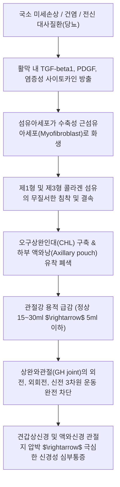

# 유착성 관절낭염 (오십견, 동결견, Frozen Shoulder)

> **핵심 3줄 요약 (Key Summary)**:
> 🎯 견관절(GH joint)의 관절낭에 만성 염증과 광범위한 섬유화 및 활막 유착이 발생하여 어깨가 얼어붙은 듯 굳어버리는 대표적 관절 구축 질환.
> 🚩 활막세포 증식, 콜라겐 침착, 섬유아세포-근섬유아세포 전환(TGF-$\beta$1)으로 인한 액와낭(Axillary pouch) 구축 및 관절 용적 축소가 핵심 병태생리.
> 🔬 회전근개 파열과 달리 **능동 및 수동 관절가동범위(ROM)의 전방위 동시 제한**이 특징이며, [[광배근]]·[[대흉근]] 우선 이완, 견삼침·천종·노유·조구투승산 침구, 도침 및 견관절 수기 추나요법 시행.
> ⚠️ 무리한 도수 정복이나 강제 수동 신전은 관절와순 파열과 골절을 유발하므로 금기하며, Codman 진자 운동 및 단계별 통증 조절 스트레칭 티칭 필수.

---

## 1. 개요 및 병기 구분 (Overview & Clinical Stages)

유착성 관절낭염(Adhesive Capsulitis), 대중적으로 **'오십견(五十肩)'** 또는 **'동결견(Frozen Shoulder)'**으로 불리는 이 질환은 견관절 관절낭의 구축으로 인해 어깨의 능동적·수동적 가동 범위가 심각하게 소실되고 극심한 야간통을 동반하는 질환입니다.

특별한 선행 원인 없이 자발적으로 발생하는 특발성(Primary)과 당뇨병, 갑상선 질환, 외상 또는 어깨 수술 후 고정으로 인해 발생하는 속발성(Secondary)으로 구분되며, 당뇨 환자에서는 유병률이 10~20%로 일반인 대비 5배 이상 급증합니다.

![[유착성관절낭염_동결견_병태생리_도해.jpg|450]]
> [정상 견관절낭(좌)과 동결견의 염증성 관절낭 구축(우) 비교: 활막의 충혈과 섬유성 비후, 하부 액와낭의 유착으로 인한 관절강 용적 축소 도해]

### 1) 3대 임상 병기 (3 Clinical Phases)
1. **동통기 (Freezing Phase / 염증기, 2~9개월)**:
   * 통증이 점진적으로 악화되며 어깨 전체와 상완 외측으로 쑤시는 방사통 발생.
   * 특히 밤에 환측으로 눕지 못하고 아파서 잠을 깨는 **극심한 야간통(Night pain)**이 특징.
   * 통증으로 인해 스스로 어깨를 움직이지 않으려 하면서 서서히 관절 운동 제한이 시작됨.
2. **동결기 (Frozen Phase / 구축기, 4~12개월)**:
   * 급성 염증성 통증은 다소 둔화되나, 관절낭의 섬유화와 유착이 완성되어 어깨가 돌처럼 굳어짐.
   * 세수하기, 머리 빗기, 옷 입기, 뒷짐 지기, 브래지어 채우기 등 일상생활 동작이 완전 불가능.
   * **능동 운동(AROM)뿐만 아니라 검사자가 들어주는 수동 운동(PROM)에서도 단단한 끝 느낌(Firm capsular end-feel)과 함께 전방위 운동 정지**.
3. **해동기 (Thawing Phase / 회복기, 12~42개월)**:
   * 통증이 거의 소실되고 관절 가동 범위가 서서히 자연 회복됨.
   * 단, 환자의 약 40~50%에서는 수년이 지나도 경도의 영구적 운동 결손 및 불편감이 잔존함.

---

## 2. 병태생리 및 5대 국소 통증 유발 메커니즘 (Pathophysiology & Local Pain Mechanisms)

오십견은 견관절 복합체의 여러 근육과 인대 조직의 만성 병변이 연쇄적으로 악화되어 관절낭 전체의 유착으로 이어지는 다면적 병태입니다.

![[견관절낭_해부도_인대구조.png|450]]
> [견관절낭 해부도: 오구견봉인대(D), 오구상완인대 및 관절상완인대 복합체(E), 이두근 장두건(B, C)과 상완골두를 감싸는 섬유성 관절낭 구조]

### 1) 5대 국소 통증 유발 메커니즘 (원장님 필기 100% 반영)
1. **GH 관절낭 관절지 포착 통증**:
   * 상완와관절(GH joint) 관절낭을 지배하는 [[견갑상신경]] 및 [[액와신경]]의 감각 관절지가 염증성 비후 조직에 압박·포착되어 어깨관절 깊숙한 곳에서 날카롭고 쑤시는 통증 유발.
2. **삼각근 부위 허혈성 통증**:
   * 상완골 상부에 국한된 뻐근한 [[삼각근]]의 만성 허혈성 근막통 및 삼각근 피부 감각신경성 연관통.
3. **GH 관절 전면 염증성 통증**:
   * 견관절 전면에 국한된 어깨 주 내회전근인 [[견갑하근]] 및 상완이두근 장두 힘줄(Long head of biceps)의 만성 건초염·활막염에 의한 염증성 전면통.
4. **전거근 및 ST 관절 통증**:
   * 견흉(Scapulothoracic, ST) 관절 가동성 상실을 보상하느라 과부하가 걸린 [[전거근]]에 의한 통증 (견갑골 외측연 및 흉곽 측벽 통증).
5. **AC 관절 및 승모근 골막 자극 통증**:
   * 견봉쇄골(AC) 관절 양옆의 견봉 및 쇄골 외측 1/3 영역의 [[상부 승모근]] 과긴장과 단축에 의한 견갑골 상각 골막자극성 통증.

---

## 3. 이학적 검사 및 감별 진단 (Physical Examination & Differential Diagnosis)

### 1) 아플레이 긁기 검사 (Apley's Scratch Test)
* 환측 손을 머리 위로 넘겨 반대측 견갑골 상각을 만지게 함 $\rightarrow$ **외전(Abduction) + 외회전(External rotation)** 평가.
* 환측 손을 등 뒤로 돌려 반대측 척추 극돌기(T7 부근)를 만지게 함 $\rightarrow$ **내전(Adduction) + 내회전(Internal rotation)** 평가.
* 유착성 관절낭염 환자는 두 동작 모두에서 현저한 가동 제한과 비명을 지르는 듯한 통증을 나타냅니다.

### 2) 💡 회전근개 파열 vs 유착성 관절낭염 실전 감별 공식

| 감별 항목 | [[회전근개 파열]] (Rotator Cuff Tear) | [[유착성 관절낭염]] (Frozen Shoulder) |
| :--- | :--- | :--- |
| **수동 운동 (PROM)** | **정상 또는 거의 정상** (검사자가 들어주면 끝까지 올라감) | **심각한 제한** (검사자가 억지로 들어도 굳어서 안 올라감) |
| **능동 운동 (AROM)** | 통증과 근력 약화로 스스로 들지 못함 (떨어짐) | 능동과 수동 모두 똑같이 제한됨 |
| **특징적 징후** | 동통호(Painful arc, 60~120°), 드롭 암 검사 양성 | 전방위 ROM 제한, 단단한 캡슐형 저항(Firm end-feel) |
| **외회전 제한** | 팔을 옆구리에 붙인 상태에서 외회전 가능 | **팔을 옆구리에 붙이고 외회전 시 즉각적인 회전 정지** |

---

## 4. 진단 및 영상 평가 (Diagnosis & Imaging)

* **단순 방사선(X-ray)**: 골관절염, 석회성 건염, 탈구, 골종양 등을 배제하기 위한 기본 검사 (오십견 자체는 X-ray 상 음영 변화가 없음).
* **초음파 검사**: 오구상완인대(CHL)의 비후($>3\text{mm}$), 회전근개 간극(Rotator interval) 내 혈류 증가 확인.
* **조영증강 견관절 MRI**:
  * **액와낭(Axillary pouch) 관절낭 두께 $\ge 4\text{mm}$ 비후**.
  * 오구하 지방 삼각(Subcoracoid fat triangle)의 소실.
  * 관절강 조영술 시 정상 주입 용적(15~30ml)이 5ml 이하로 줄어들고 조영제가 역류함.

---

## 5. 양방 치료 및 약리 (Pharmacotherapy & Interventions)

* **약물 치료**: 급성 염증기 통증 완화를 위한 NSAIDs 단기 투여.
* **관절강 내 스테로이드 주사 (Intra-articular Corticosteroid)**:
  * 1단계(동통기)의 극심한 활막염과 야간통을 진정시키는 가장 신속한 소염 치료 (단, 연 3회 이하로 제한).
* **수압 팽창술 (Hydrodilatation)**: 생리식염수와 국소마취제를 관절강 내로 20~30ml 고압 주입하여 유착된 관절낭을 물리적으로 팽창·파열시키는 시술.
* **수면 마취 하 도수 정복술 (MUA) / 관절경 관절낭 절개술**: 보존적 치료에 6개월 이상 불응하는 극심한 구축 환자에서 시행.

---

## 6. 한의학적 변증 및 치료 (Traditional Korean Medicine)

한의학에서 오십견은 **견비통(肩臂痛)**, **누견풍(漏肩風, 어깨에 찬바람이 드는 병)**, **동결견(凍結肩)**의 범주에 속하며, 기혈응체(氣血凝滯), 풍한습비(風寒濕痺), 간신휴허(肝腎虧虛)로 변증합니다.

### 1) 변증 분류 및 대표 처방 (Syndrome Differentiation)

| 변증 유형 | 주증 및 설맥 | 병리 기전 | 대표 방제 | 구성 본초 |
| :--- | :--- | :--- | :--- | :--- |
| 풍한습비형 (누견풍) | 어깨가 시리고 찬바람 쐬면 격통, 온열 시 완화, 맥부긴 | 풍한습 사기가 견관절 경락을 침범하여 응체 | [[오적산]] 합 [[당귀사역탕]] | [[마황]], [[계지]], [[세신]], [[당귀]], [[백작약]] |
| 기체어혈형 (어혈성 야간통) | 밤에 잠을 못 자는 칼로 찌르는 격통, 국소 거안, 맥삽 | 관절낭 미세혈관의 어혈 저류 및 순환 차단 | [[서경탕]] 합 [[당귀수산]] | [[강활]], [[방풍]], [[강황]], [[당귀]], [[적작약]] |
| 기혈양허·간신휴허형 | 50대 이후 만성 구축, 기력 쇠약, 요슬산연, 맥세약 | 노화로 간신 기혈이 고갈되어 근맥(筋脈) 실양 | [[독활기생탕]] 합 [[십전대보탕]] | [[독활]], [[상기생]], [[두충]], [[우슬]], [[황기]] |

### 2) 도침 요법 (Acupotomy)
* 관절낭 비후와 구축이 고착된 오구상완인대 부착부, 견봉하 간극, 견갑하근 부착부(상완골 소결절)의 만성 섬유성 반흔을 미세 절개·박리하여 관절낭 내 유착을 감압하고 수동 가동 범위를 확보.

### 3) 침구 치료 혈위 및 배혈법
* **견삼침 (肩三針)**:
  * 견우(LI15), 견료(TE14), 견정(GB21) $\rightarrow$ GH 관절 전외측 관절낭 감압 및 삼각근하 점액낭 소통.
* **후방 및 근막 특효혈**:
  * 천종(SI11, 극하근 트리거포인트), 노유(SI10, 액와신경 후지 주행로).
* **원위 거사 및 특효 취혈**:
  * **조구(ST38) 투 승산(BL57)**: 족양명위경 조구혈에서 방광경 승산혈 방향으로 2~2.5촌 관통 자침하면서 환자에게 환측 어깨를 능동적으로 돌리게 하는 **동기유침법(動氣留針法)**을 병행하면 즉각적인 ROM 증가 효과 발휘.

---

## 7. 진료실 핵심 필기 및 실전 가이드 (Clinical Notes & Protocols)

### 1) "광배근 & 대흉근 우선 루틴" (원장님 핵심 임상 노하우)
* 오십견 환자가 내원하면 굳어있는 어깨 관절낭을 무리하게 먼저 꺾거나 늘리지 않습니다.
* 어깨를 안으로 말리게(내회전·전하방 견인) 만드는 거대한 두 근육인 **[[광배근]]과 [[대흉근]]을 먼저 침과 약침, 근막 이완 기법으로 확실하게 풀어주어야** 상완골두가 관절와 안에서 정상적인 후하방 활주(Posterior-inferior glide) 공간을 확보합니다.
* 이후 [[극상근]], [[극하근]], [[소원근]], [[견갑하근]]의 회전근개 압통점을 순차적으로 한 방향씩 정밀하게 이완시켜 관절 불안정성을 방지합니다.

### 2) 온찜질 vs 냉찜질 적용 타이밍
* **동통기 (초기 1~3개월)**: 급성 염증과 야간통이 치솟을 때는 온찜질을 하면 혈관이 확장되어 통증이 더 심해집니다. 이때는 **10~15분간 얼음찜질(냉팩)**을 적용하여 염증과 신경 과민을 진정시킵니다.
* **동결기 (구축기)**: 관절이 굳어있는 시기에는 치료 전 **온열 핫팩 및 심부 투열(고주파)**을 충분히 시행하여 콜라겐 섬유의 점탄성을 높인 상태에서 수기 추나를 진행합니다.

![[동결견_코드만_진자운동_도해.jpg|400]]
> [동결견 재활의 표준 코드만 진자 운동(Codman Pendulum Exercise): 상체를 숙이고 건측 손으로 의자를 짚은 뒤, 환측 팔을 중력에 맡겨 전후, 좌우, 원형으로 자연스럽게 흔들어 견관절강을 수동적으로 견인·감압하는 운동]

### 3) 환자 자가 운동 지도: 코드만 진자 운동
* 억지로 팔을 들어 올리는 운동은 견봉하 충돌을 일으켜 염증을 악화시킵니다.
* 중력을 이용하여 상완골두와 견봉 사이를 자연스럽게 벌려주는 **코드만 진자 운동(Pendulum exercise)**을 하루 3회, 매회 5분씩 시계 방향/반시계 방향으로 지름 30cm 원을 그리며 힘을 뺀 채 부드럽게 흔들도록 티칭합니다.

---

## 8. 참고문헌 및 최신 연구 (References)

* Neviaser AS, Hannafin JA. Adhesive capsulitis: a review of current treatment. *Am J Sports Med*. 2010;38(11):2346-2356. doi:10.1177/0363546509348048. [PubMed (PMID: 20110457)](https://pubmed.ncbi.nlm.nih.gov/20110457/)
  > [연구 요약] 미국스포츠의학회지의 오십견 표준 총설로 임상 3단계 병기, 관절경적 활막 증식 및 관절낭 구축 소견, 스테로이드 관절강 주사 및 보존적 재활 치료의 근거 수준을 정립함.
* Kelley MJ, Shaffer MA, Kuhn JE, et al. Shoulder pain and mobility deficits: adhesive capsulitis. *J Orthop Sports Phys Ther*. 2013;43(5):A1-A31. doi:10.2519/jospt.2013.0302. [PubMed (PMID: 23636125)](https://pubmed.ncbi.nlm.nih.gov/23636125/)
  > [연구 요약] 미국정형물리치료학회(JOSPT)의 유착성 관절낭염 공식 가이드라인으로 수동/능동 관절가동범위 평가, 관절 가동술(Joint mobilization), 환자 교육 및 단계별 운동 프로토콜을 규정함.
* Hand C, Clipsham K, Radha S, Arshad MS. Long-term outcome of frozen shoulder. *J Shoulder Elbow Surg*. 2008;17(2):231-236. doi:10.1016/j.jse.2007.05.009. [PubMed (PMID: 17993282)](https://pubmed.ncbi.nlm.nih.gov/17993282/)
  > [연구 요약] 동결견 환자를 수년간 장기 추적 관찰한 연구로, 자연 치유 질환으로 알려진 통념과 달리 환자의 40% 이상에서 장기적인 ROM 결손과 잔여 기능 장애가 지속됨을 밝혀 조기 적극적 치료의 중요성을 강조함.
* Zhang Y, Liu J, Wang R, et al. Comparative effectiveness of acupuncture-related therapies for frozen shoulder: a systematic review and network meta-analysis. *Front Med (Lausanne)*. 2025;12:1489231. doi:10.3389/fmed.2025.1489231. [PubMed (PMID: 41384127)](https://pubmed.ncbi.nlm.nih.gov/41384127/)
  > [연구 요약] 오십견 환자에 대한 침구 관련 치료법의 최신 네트워크 메타분석으로, 도침(Acupotomy) 및 온침 요법이 일반 물리치료 대비 어깨 통증 점수(VAS) 및 견관절 가동 범위(외전, 외회전) 개선에서 통계적으로 유의한 우월성을 나타냄을 입증함.