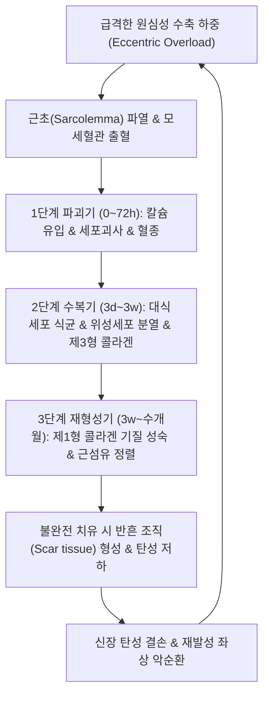

# 🩺 [[좌상]] (Muscle Strain / 挫傷, ICD-10 M62.5 / S76.1)

> **핵심 3줄 요약 (Key Summary)**:
> - 📍 병소 부위 & 해부·병태생리: 근육이 강력한 장력을 발휘하며 강제로 늘어나는 원심성 수축(Eccentric contraction) 시, 구조적 취약 지점인 근건 접합부(MTJ)의 근세포막 및 모세혈관이 기계적 장력 한계를 초과하여 찢어지는 급성 연부조직 파열 손상.
> - 🚩 전형적 임상 양상 & 3대 징후: 스프린트나 급격한 방향 전환 중 뚝 하는 파열감과 함께 발생하는 극심한 국소 통증, 국소 압통 및 근육 내 피하 혈종(Hematoma)·반상출혈, 능동 수축 및 수동 신장 시의 극심한 기능 장애.
> - 🛠️ 핵심 감별 검사 & 한·양방 다각적 치료 전략: 근골격계 초음파 검사(파열 크기 및 저에코성 혈종 확인), 뮌헨 합의 1~3도 임상 등급 분류, 급성기 POLICE 요법 및 어혈 제거 침·소염약침, 수복기 조직 재생 한약([[당귀수산]], [[도홍사물탕]]) 및 점진적 원심성 재활 운동.
> - ⚠️ 응급 의뢰 레드플래그 & 악화 요인: 근건 접합부의 3도 완전 단열(체중 지지 불가 및 근육 결손 함몰 촉지), 급성 구획증후군(Compartment Syndrome, 극심한 통증·감각마비·맥박소실), 골화성 근염(Myositis Ossificans) 유발 위험이 있는 급성기의 무리한 심부 마사지 및 온열 자극 금기.

---

## 📌 목차
1. [질환 개요 & 해부학적 병태생리](#1-질환-개요--해부학적-병태생리)
2. [병태생리 메커니즘 & 생체역학적 악순환 네트워크](#2-병태생리-메커니즘--생체역학적-악순환-네트워크)
3. [임상 증상 & 이학적 검사(Physical Exam) 알고리즘](#3-임상-증상--이학적-검사physical-exam-알고리즘)
4. [감별 진단 매트릭스 (Differential Diagnosis)](#4-감별-진단-매트릭스-differential-diagnosis)
5. [한의 통합 치료 프로토콜 (침·약침·추나·한약)](#5-한의-통합-치료-프로토콜-침약침추나한약)
6. [양방 치료 & 병용·의뢰 기준 (Conventional Treatment & Referral)](#6-양방-치료--병용의뢰-기준-conventional-treatment--referral)
7. [재활 운동 & 생활습관 티칭 가이드](#6-재활-운동--생활습관-티칭-가이드)
8. [💡 사용자 진료실 핵심 필기 & 임상 노하우 (Melt-In 잔여 심화 집약)](#7--사용자-진료실-핵심-필기--임상-노하우-melt-in-잔여-심화-집약)
9. [출처 및 학술 참고 문헌 (References)](#8-출처-및-학술-참고-문헌-references)

---

## 1. 질환 개요 & 해부학적 병태생리

![[좌상_햄스트링_근육파열_해부병태도해.png|450]]
> [그림 1: 하지 햄스트링(대퇴이두근·반건양근) 근건 부착부 및 근건접합부(MTJ)의 급성 파열(Hamstring Tendon Tear) 해부학적 병태도해]

* **질환 정의 및 역학**:
  * 근육 좌상(Muscle Strain)은 외력에 의한 둔탁한 타박(Contusion)이나 뼈-뼈를 잇는 인대 손상(Sprain)과 달리, **근육 자체의 과도한 과신장(Overstretching)이나 급격한 원심성 과부하(Eccentric loading)로 인해 근섬유 및 건 섬유가 찢어지는 손상**입니다.
  * 스포츠 손상 전체의 약 30~50%를 차지하는 가장 흔한 연부조직 질환으로, 육상, 축구, 야구, 테니스, 농구 등 폭발적인 가속과 감속을 요구하는 종목에서 집중적으로 발생합니다.
* **해부학적 호발 부위 (2관절 다관절 근육의 MTJ)**:
  * 인체에서 2개 이상의 관절을 동시에 가로지르는 다관절 근육(Bi-articular muscles)은 두 관절의 움직임에 따라 양방향에서 동시에 신장 스트레스를 받으므로 좌상에 가장 취약합니다.
  * [[슬괵근]](Hamstrings): 주로 [[대퇴이두근]] 장두의 근건접합부(MTJ). 전력 질주(Sprint) 시 유각기 말기(Late swing phase)에 하지를 감속시키는 강력한 원심성 수축 구간에서 발생.
  * [[비복근]](Gastrocnemius): 내측두(Medial head)의 원위부 MTJ(테니스 레그, Tennis leg). 발목이 배측굴곡된 상태에서 무릎이 신전될 때 발생.
  * [[대퇴사두근]](Quadriceps): [[대퇴직근]]. 축구 킥 동작 시 고관절 과신전 및 슬관절 굴곡 상태에서 폭발적인 수축을 개시할 때 손상.
  * [[내전근]](Adductors): [[장내전근]]. 축구의 인사이드 킥이나 급격한 방향 전환 시 서혜부 좌상(Groin strain) 발생.

---

## 2. 병태생리 메커니즘 & 생체역학적 악순환 네트워크

![[좌상_비복근_테니스레그_근건접합부_초음파소견.jpg|450]]
> [그림 2: 비복근(Gastrocnemius) 내측두 근건접합부의 2도 부분 파열(테니스 레그) 초음파 소견: 근섬유 단열 부위의 뚜렷한 저에코성 혈종(Hematoma) 관찰]

### 1) 생물학적 치유 3단계 메커니즘
* **1단계: 파괴기 (Destruction Phase, 손상 직후~72시간)**:
  * 근섬유와 모세혈관의 물리적 파열로 인해 국소 혈종(Hematoma)이 발생합니다.
  * 세포막 파열로 세포 외 칼슘(Ca²⁺)이 다량 유입되면서 단백질 분해효소(Calpain)가 활성화되어 인접 근절이 자가 분해됩니다. 호중구와 대식세포가 침윤하여 괴사 조직을 식균 처리합니다.
* **2단계: 수복기 (Repair Phase, 3일~3주)**:
  * 염증 대식세포(M1)가 항염증·재생 대식세포(M2)로 전환됩니다.
  * 기저막 내에 잠들어 있던 **위성세포(Satellite cells)**가 깨어나 증식하고, 근아세포(Myoblast)로 분화 및 융합하여 새로운 근관(Myotube)을 형성합니다.
  * 동시에 섬유아세포가 미성숙한 제3형 콜라겐 반흔을 형성하여 기계적 연속성을 연결합니다.
* **3단계: 재형성기 (Remodeling Phase, 3주~수개월)**:
  * 제3형 콜라겐이 인장 강도가 높은 제1형 콜라겐으로 교체되며, 근섬유의 방향성과 수축 장력이 정상화됩니다.
  * 이때 적절한 기계적 장력 자극이 주어지지 않으면 무질서한 섬유성 흉터(Fibrotic scar)가 남아 재발의 주원인이 됩니다.

---

## 3. 임상 증상 & 이학적 검사(Physical Exam) 알고리즘

![[좌상_외측광근_근육좌상_초음파_영상소견.png|450]]
> [그림 3: 외측광근(Vastus lateralis) 근육 좌상 환자의 초음파 영상: 근속의 부분 단열 및 근막 사이로 누출된 광범위한 무에코성/저에코성 혈종 저류 소견]

### 1) 뮌헨 합의안(Munich Consensus) 3단계 임상 등급 분류

| 등급 | 손상 정도 | 해부학적 구조 변화 | 임상 증상 및 기능 장애 | 평균 회복 기간 |
| :--- | :--- | :--- | :--- | :--- |
| **1도 (경도, Mild)** | 미세 파열 (<5% 근섬유) | 근섬유 연속성 유지, 미세 부종 | 국소적 경미한 통증, 근력 저하 없음, 독립 보행 가능 | 1~2주 |
| **2도 (중등도, Moderate)** | 부분 파열 (Partial tear) | 불완전 파열, 국소 혈종 저류 | 뚜렷한 압통, 피하 반상출혈, 근력 및 ROM 현저 저하 | 3~8주 |
| **3도 (중증, Severe)** | 완전 파열 (Complete rupture) | 근건 접합부 완전 단열, 결손 함몰 촉지 | 격렬한 통증, 체중 부하 불가, 광범위 혈종, 수술적 재건 고려 | 3개월 이상 |

### 2) 필수 이학적 검사법 (Physical Examination)
* **저항성 등척성 수축 검사 (Resisted Isometric Contraction)**:
  * 관절을 중립위에 두고 해당 근육을 등척성으로 수축시켰을 때 심한 통증과 함께 2~3도 손상에서는 뚜렷한 근력 약화가 유발됨.
* **수동 신장 검사 (Passive Stretch Test)**:
  * 손상된 근육을 반대 방향으로 최대로 수동 신장시켰을 때 환측 부위에서 날카로운 신장 통증이 발생.
* **국소 촉진 검사 (Palpation for Defect)**:
  * 손상 후 부종이 심해지기 전(손상 직후 1~2시간) 또는 부종이 가라앉은 후 근건 접합부 주위를 촉진하여 근섬유의 단절된 틈새(Focal defect/gap)를 확인.

---

## 4. 감별 진단 매트릭스 (Differential Diagnosis)

| 감별 질환 | 손상 조직 및 주원인 | 이학적 소견 특징 | 감별 진단 핵심 포인트 |
| :--- | :--- | :--- | :--- |
| [[좌상]] (Muscle Strain, 본 질환) | 근육 및 근건접합부(MTJ), 원심성 과수축 | 능동 수축 및 수동 신장 모두에서 통증 | 근육 자체의 압통 및 피하 혈종, 초음파상 근섬유 단열 |
| [[염좌]] (Ligament Sprain) | 뼈-뼈 연결 인대(Ligament), 관절의 과도한 비틀림 | 수동 신장 시에만 통증, 저항 수축 시 통증 없음 | 관절낭 및 인대 부착부 국소 압통, 스트레스 뷰 불안정성 |
| [[타박상]] (Contusion) | 외부의 직접적 둔탁한 충격(Direct blow) | 충격 부위 피하 멍 및 팽륜 | 외력에 의한 타격 병력, 근건접합부가 아닌 충격 부위 손상 |
| [[지연성 근육통]](DOMS) | 고강도 운동 24~48시간 후 미세 손상 | 전체 근육의 미만성 뻐근함, 국소 혈종 없음 | 손상 순간의 급작스러운 '뚝' 소리 없음, 3~5일 내 자연 소실 |
| [[심부정맥 혈전증]](DVT) | 하지 심부정맥의 혈전 형성 및 폐색 | 종아리의 전반적 종창, 호만 징후(Homan's) 양성 | 외상 병력 없음, D-dimer 상승, 도플러 초음파상 혈관 폐색 |

---

## 5. 한의 통합 치료 프로토콜 (침·약침·추나·한약)

* **침구 치료 (Acupuncture)**:
  * **손상 부위 아시혈(阿是穴) 및 경혈 자침**: 손상된 근육의 운동점(Motor point) 및 기시·정지부 자침.
  * **급성기**: 혈종 주변부 원위 자침으로 국소 정맥 및 림프 순환을 도와 부종과 혈종 흡수 유도.
  * **수복 및 재형성기**: 근아세포 활성화 및 제1형 콜라겐 정렬을 위해 2~100Hz 전침을 가하여 미세전류 자극 제공.
* **약침 치료 (Pharmacopuncture)**:
  * **급성 혈종기 (1~3일)**: 황련해독탕 약침 또는 소염약침을 파열 부위 주변 근막에 주입하여 호중구 침윤 및 급성 염증성 부종 억제.
  * **조직 수복 및 반흔기 (4일 이후)**: **자하거(인태반) 약침, 녹용약침, 신바로약침**을 근건접합부에 시술하여 위성세포 분열을 촉진하고 섬유아세포의 조밀한 콜라겐 기질 재생 유도.
* **추나 치료 (Chuna Manipulation)**:
  * **급성기**: 손상 부위 직접 마사지 절대 금기. 인접 관절의 림프 배액 추나 및 보상성 단축을 보이는 인접 근육군 이완.
  * **아급성·만성기 (근막이완추나 MFR)**: 유착된 근막과 콜라겐 반흔을 섬유 주행 방향으로 부드럽게 활주시키는 근에너지기법(MET) 및 연부조직 가동술(IASTM) 적용.
* **한약 치료 (Herbal Medicine)**:
  * **급성 혈종기 (활혈화어, 消腫止痛)**: 내부 모세혈관 파열로 인한 어혈을 제거하고 혈종을 흡수시키는 [[당귀수산]], [[복원활혈탕]], [[칠리산]].
  * **수복기 및 만성 허증기 (생기육, 補氣血壯筋骨)**: 손상된 근섬유를 재생하고 반흔 형성을 최소화하는 [[도홍사물탕]], [[보중익기탕]], [[십전대보탕]], [[서경탕]].

---

## 6. 양방 치료 & 병용·의뢰 기준 (Conventional Treatment & Referral)

> 🎯 **이 섹션의 목적**: 환자가 **양방약을 이미 복용 중인 경우가 많다.** 한의원 1차 진료에서 양방 치료를 이해하고, 병용 가능·주의·금기를 판단하며, 언제 의뢰할지 결정한다.

* **약물 치료 (Medication)**:
  * 계열별 약물·용량·기간 — 국내 처방 관행 반영.
  * 작용 기전과 한의 치료와의 상호작용.
* **비약물 시술 (Procedures)**:
  * 주사·차단술·물리치료·보조기 등.
* **수술·시술 적응증 (Surgical Indication)**:
  * 언제 수술로 가는가 — 절대·상대 적응증, 수술 후 경과.
* **한의 병용 판단 (Combination Therapy)**:
  * 병용 가능 / 주의 / 금기. 복용 중 환자의 감량 타이밍·반동 현상.
* **양방·전문과 의뢰 기준 (Referral Criteria)**:
  * 응급 의뢰 트리거와 전문과 의뢰 기준(정형외과·신경외과·내과 등).

	(작성 필요)

---

## 7. 재활 운동 & 생활습관 티칭 가이드

* **POLICE 원칙 (급성기 대처 표준)**:
  * **P (Protect)**: 1~3일간 보조기나 목발을 사용하여 추가적인 장력 부하로부터 보호.
  * **OL (Optimal Loading)**: 침상 안정을 길게 하지 않고, 통증 없는 범위 내에서 가벼운 능동 가동(Active ROM)과 등척성 수축을 조기에 시작하여 근섬유의 평행 정렬 유도.
  * **I (Ice)**: 1회 15~20분간 간헐적 냉찜질로 혈관 수축 및 신경 전도 속도 저하를 통한 진통.
  * **C (Compression)**: 탄력 붕대로 적절한 압박을 가해 근육 내 혈종 팽창 억제.
  * **E (Elevation)**: 손상 하지를 심장보다 높게 거상하여 정맥 환류 촉진.
* **단계별 원심성 수축 운동 (Eccentric Rehabilitation)**:
  * 통증이 없는 등척성 수축 $\to$ 동심성 수축 $\to$ **노르딕 햄스트링(Nordic Hamstring) 등 원심성 수축 운동**으로 단계적 진행하여 근건접합부의 인장 내구력을 손상 전보다 강화.
* **웜업(Warm-up) 및 동적 스트레칭 티칭**:
  * 운동 전 체온을 올리는 가벼운 조깅과 동적 스트레칭으로 근육의 점탄성을 높여 재파열 예방.

---

## 8. 💡 사용자 진료실 핵심 필기 & 임상 노하우 (Melt-In 잔여 심화 집약)

* **골화성 근염(Myositis Ossificans)을 부르는 3대 금기**:
  * 환자가 운동 중 허벅지나 종아리가 찢어져서 내원했을 때 **① 급성기 72시간 내의 핫팩(온열 요법), ② 아프다는 부위를 강하게 문지르는 심부 지압/마사지, ③ 과도한 음주**는 절대 엄금해야 합니다.
  * 손상 부위에 과도한 혈류와 물리적 마찰이 가해지면 혈종 내에 칼슘이 침착되어 근육 한가운데에 뼈가 자라나는 치명적인 골화성 근염으로 악화됩니다.
* **재파열의 덫: '통증 소실'과 '조직 치유'의 시간차**:
  * 햄스트링 좌상 환자는 보통 2~3주가 지나면 걸을 때 통증이 완전히 사라져 다 나았다고 착각하고 다시 축구나 달리기에 나갑니다.
  * 그러나 이 시기는 조직학적으로 약한 **제3형 콜라겐 반흔**으로 겨우 붙어 있는 상태이며, 완전한 제1형 콜라겐으로의 성숙과 원심성 인장 강도 회복에는 최소 **6~8주 이상**이 소요됩니다.
  * 환자에게 "통증이 없어도 원심성 부하 테스트(누워서 다리를 뻗고 저항을 버티는 검사)에서 양측 근력이 90% 이상 대칭이 될 때까지는 스프린트 금지"를 단호하게 지도해야 재파열률(30% 육박)을 막을 수 있습니다.
* **한의 임상 처방의 타이밍**:
  * 손상 직후 1~5일: [[당귀수산]]을 첩약으로 투여하여 초음파상 보이는 저에코성 혈종을 초고속으로 흡수시켜 구획압을 떨어뜨립니다.
  * 1주 이후: [[도홍사물탕]]에 구기자, 우슬, 속단을 가미하여 근육 위성세포의 재생을 유도하면 섬유성 반흔 구축 없이 유연한 근육으로 회복됩니다.

---

## 9. 출처 및 학술 참고 문헌 (References)

* Järvinen TA, Järvinen TL, Kääriäinen M, Kalimo H, Järvinen M. (2005). Muscle injuries: biology and treatment. *The American Journal of Sports Medicine*, 33(5), 745-764.
  * [PubMed Link](https://pubmed.ncbi.nlm.nih.gov/15851777/)
  * [연구 요약] 근육 손상 후 위성세포의 분열·분화와 근섬유 재생 및 섬유성 반흔 형성의 생물학적 치유 3단계를 규명하고, 장기간의 부동화보다 적절한 조기 능동 동원(Optimal loading)이 콜라겐의 평행 정렬과 인장 강도 회복에 필수적임을 입증한 스포츠의학의 기념비적 연구.
* Mueller-Wohlfahrt HW, Haensel L, Mithoefer K, Ekstrand J, et al. (2013). Terminology and classification of muscle injuries in sport: The Munich consensus statement. *British Journal of Sports Medicine*, 47(6), 342-350.
  * [PubMed Link](https://pubmed.ncbi.nlm.nih.gov/23080315/)
  * [연구 요약] 전 세계 스포츠의학 전문가들의 뮌헨 합의안으로, 근육 손상을 기능성 근육 장애와 구조적 근육 손상(1도 미세파열, 2도 부분파열, 3도 완전파열)으로 체계화한 임상 표준 분류 가이드라인.
* Bleakley CM, Glasgow P, MacAuley DC. (2012). PRICE needs updating, should we call the POLICE?. *British Journal of Sports Medicine*, 46(4), 220-221.
  * [PubMed Link](https://pubmed.ncbi.nlm.nih.gov/21903614/)
  * [연구 요약] 급성 연부조직 좌상 후 단순 안정(Rest)이 초래하는 근위축 및 기계수용기 저하를 경고하고, 적절한 부하(Optimal Loading)를 통해 조직 기계적 치유를 유도하는 POLICE 원칙의 과학적 타당성을 제시함.

<!-- 보관 태그(1회용·링크오류, 필요시 복원): 손상, 근육병리, 급성염증 -->
