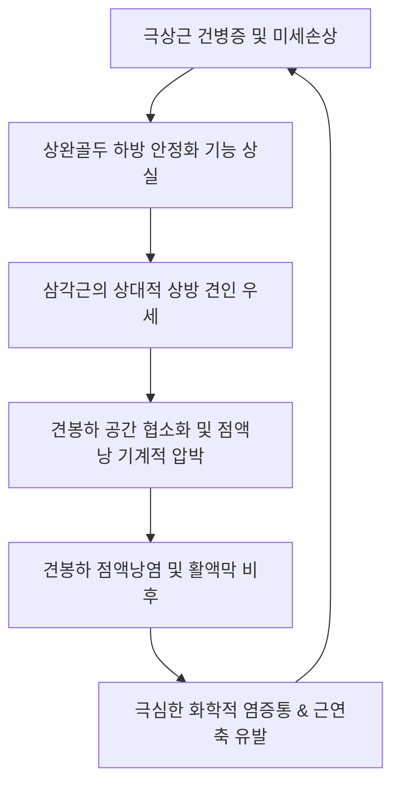

# 🩺 회선 건판 손상 견봉하 윤활낭염 (Rotator Cuff Injury & Subacromial Bursitis)

> **핵심 3줄 요약 (Key Summary)**:
> - 📍 **병소 부위 & 해부·병태생리**: 오훼견봉궁(coracoacromial arch) 아래에서 상완골 대결절과 극상근 건 상면을 덮고 있는 [[견봉하 점액낭]](subacromial bursa) 및 회선건판([[회전근개]], 특히 [[극상근]] 건)의 급만성 마찰, 미세파열 및 삼출성 염증 병변.
> - 🚩 **전형적 임상 양상**: 견관절 전외측의 심한 둔통 및 삼각근 부착부 방사통, 야간에 환측으로 누울 때 자지러지는 수면 장애 통증, 외전 60~120도 동통호(Painful Arc), 외전 저항 시 악화되는 기능 장애.
> - 🛠️ **핵심 검사 & 치료 전략**: Neer Test, Hawkins-Kennedy Test, Dawbarn's Test 양성. 초음파상 점액낭 비후(>2mm) 및 삼출액 저류 확인. Modified Crass 자세 하 [[견봉하 점액낭]] 정밀 [[신바로약침]] 자입, [[견우]](LI15)·[[견료]](TE14) 침구치료, [[소흉근]] 이완 및 견갑골 안정화 [[추나요법]].
> - ⚠️ **응급 의뢰 레드플래그**: 급성 발열 및 오한을 동반한 어깨 관절 열감·발적(급성 화농성 점액낭염/패혈성 관절염), 경미한 외상 후 상지 능동 거상 완전 불능(급성 광범위 회전근개 전층 파열), 신경학적 상지 마비 징후.

---

## 📌 목차
1. [질환 개요 & 해부학적 병태생리](#1-질환-개요--해부학적-병태생리)
2. [병태생리 메커니즘 & 생체역학적 악순환 네트워크](#2-병태생리-메커니즘--생체역학적-악순환-네트워크)
3. [임상 증상 & 이학적 검사(Physical Exam) 알고리즘](#3-임상-증상--이학적-검사physical-exam-알고리즘)
4. [감별 진단 매트릭스 (Differential Diagnosis)](#4-감별-진단-매트릭스-differential-diagnosis)
5. [한의 통합 치료 프로토콜 (침·약침·추나·한약)](#5-한의-통합-치료-프로토콜-침약침추나한약)
6. [양방 치료 & 병용·의뢰 기준 (Conventional Treatment & Referral)](#6-양방-치료--병용의뢰-기준-conventional-treatment--referral)
7. [재활 운동 & 생활습관 티칭 가이드](#7-재활-운동--생활습관-티칭-가이드)
8. [💡 사용자 진료실 핵심 필기 & 임상 노하우 (Melt-In 잔여 심화 집약)](#8--사용자-진료실-핵심-필기--임상-노하우-melt-in-잔여-심화-집약)
9. [출처 및 학술 참고 문헌 (References)](#9-출처-및-학술-참고-문헌--references)

---

## 1. 질환 개요 & 해부학적 병태생리

회선 건판 손상 견봉하 윤활낭염(Subacromial Bursitis with Rotator Cuff Lesion)은 견관절 내에서 가장 큰 점액낭인 [[견봉하 점액낭]](삼각근하 점액낭과 대부분 해부학적으로 교통함)과 이를 지지하는 회선건판([[회전근개]] — [[극상근]], [[극하근]], [[견갑하근]], [[소원근]]) 복합체의 마찰과 퇴행성 마모로 인해 발생하는 대표적인 상지 연부조직 염증 질환이다.

### 1) 해부학적 위치와 상호 관계
- **견봉하 점액낭(Subacromial Bursa)**:
  - 위로는 견봉(acromion) 하면과 오훼견봉인대(coracoacromial ligament), 외측으로는 삼각근(deltoid) 심부에 접한다.
  - 아래로는 회전근개 건(특히 극상근건) 상면과 상완골 대결절(greater tuberosity)에 밀착되어 활주(gliding)를 보조한다.
  - 두께는 정상 상태에서 약 1~2mm의 얇은 활액막 주머니이나, 염증 발생 시 활액 증식과 섬유화로 3~5mm 이상 비후된다.
- **회선건판과의 병태학적 커플링**:
  - 견봉하 점액낭염은 단독으로 발생하는 경우보다 [[극상근]] 건염, 건병증, 또는 부분 파열과 동반되어 상호 악순환을 유발하는 복합 병소로 나타나는 경우가 대다수이다.

---

## 2. 병태생리 메커니즘 & 생체역학적 악순환 네트워크

### 1) 기계적 압박과 허혈성 미세손상
- 팔을 들어 올릴 때 상완골두가 견봉 아래로 미끄러져 들어가는 정상 활주 기전이 상실되면, 견봉하 공간(subacromial space)이 좁아지며 점액낭과 극상근 건이 반복적으로 끼이게 된다(Impingement).
- 반복 마찰은 점액낭 활액막의 충혈과 삼출액(effusion) 분비를 촉진하고, 염증 매개물질(IL-1β, TNF-α, COX-2, PGE2)이 방출되면서 신경 종말을 감작시켜 극심한 휴식기 통증과 야간통을 촉발한다.

### 2) 삼각근-회전근개 불균형의 악순환

---

## 3. 임상 증상 & 이학적 검사(Physical Exam) 알고리즘

### 1) 주요 임상 증상
- **특징적 야간통 (Night Pain)**: 밤에 잠을 잘 때 이환측 어깨가 바닥에 닿으면 점액낭 내압이 급증하여 잠을 깨거나 누운 자세 자체를 유지하지 못함.
- **외전 시 동통호 (Painful Arc, 60°~120°)**: 팔을 옆으로 올릴 때 대결절이 견봉 밑을 통과하는 각도에서 날카로운 통증 발생, 120도 이상 끝범위에서는 통증이 다소 경감.
- **방사통**: 견봉 외측 하방에서부터 상완 외측면 삼각근 부착부(deltoid tuberosity)까지 쑤시는 통증 방사.

### 2) 특이적 이학적 검사법
1. **Dawbarn's Sign (도반 징후)**:
   - 견봉 전외측 바로 밑(견봉하 점액낭 부위)을 촉진할 때 뚜렷한 압통이 존재하나, 환자의 팔을 90도 이상 수동 외전시키면 점액낭이 견봉 속으로 미끄러져 들어가며 압통이 소실되거나 현저히 감소함 (점액낭염의 특이적 검사).
2. **Neer Impingement Test**:
   - 견갑골을 고정한 상태에서 상완을 내회전시키며 전방으로 최대한 수동 거상 시 견봉 전하면 충돌로 통증 재현.
3. **Hawkins-Kennedy Test**:
   - 어깨와 팔꿈치를 90도 굴곡한 상태에서 강한 수평내전 및 내회전을 가할 때 극상근 건 및 점액낭 압박통 유발.
4. **Empty Can (Jobe) Test**:
   - 90도 외전, 30도 수평굴곡, 엄지손가락을 바닥으로 향한 내회전 자세에서 하방 저항을 가하여 극상근 건 파열 동반 여부 확인.

---

## 4. 감별 진단 매트릭스 (Differential Diagnosis)

| 질환 | 주증상 및 가동범위 | 병태생리 차이점 | 핵심 감별 검사 |
| :--- | :--- | :--- | :--- |
| **[[견봉하 점액낭염]]** | 능동 외전 시 60~120도 동통, 극심한 야간통 | 견봉하 점액낭 활액막 염증 및 삼출액 저류 | Dawbarn's sign 양성, 초음파 점액낭 비후 |
| **[[회전근개 파열]]** | 능동 거상 불능, 현저한 외전 근력 약화 | 극상근/극하근 건 섬유의 구조적 파열 | Drop Arm Test 양성, MRI 건 불연속 |
| **[[견관절 유착성 관절낭염]]** | 능동 및 수동 전방위적 ROM 제한 | 관절낭 전체의 섬유화 구축 및 체적 감소 | 수동 외회전/외전 각도 고정성 소실 |
| **[[석회성 건염]]** | 갑작스러운 칼로 베는 듯한 극심한 급성통 | 극상근 건 내 수산화인회석 결정 침착 | 단순 X-ray 상 석회화 결절(Calcification) 음영 |
| **[[경추 추간판 탈출증]]** | 경추부 동통 동반, 상지 피부분절 방사통 | 경추 신경근(C5, C6) 압박성 신경병증 | Spurling Test 양성, 어깨 수동 운동 무관 |

---

## 5. 한의 통합 치료 프로토콜 (침·약침·추나·한약)

### 1) 침구 치료 (Acupuncture Protocol)
- **주요 혈위**: [[견우]](LI15), [[견료]](TE14), [[노유]](SI10), [[비노]](LI14), [[견정]](GB21), [[천료]](TE13), [[곡지]](LI11).
- **Modified Crass 자세 자침법**:
  - 환자의 손을 뒤허리에 얹게 하여 상완골 대결절을 전외측으로 노출시킨 상태에서 견우·견료혈에서 견봉 하면을 향해 0.25×40mm 호침으로 사자(oblique) 심부 자입하여 점액낭 내 압력을 감압하고 유착을 박리.
- **전침 치료**: 2Hz 저주파를 20분간 적용하여 통증 역치를 높이고 국소 미세혈류 순환 촉진.

### 2) 약침 치료 (Pharmacopuncture Protocol)
- **[[신바로약침]] (GCSB-5)**:
  - 급만성 염증과 건 손상이 복합된 부위에 1.0~2.0cc를 견봉하 점액낭 공간 및 극상근 건 부착부에 분할 주입하여 COX-2 및 염증성 사이토카인을 억제하고 건 조직 재생 유도.
- **황련해독탕 약침 또는 소염약침**:
  - 급성기 열감과 박동성 통증이 현저한 삼출성 점액낭염 초기 국소 1.0cc 주입으로 급성 삼출 제어.
- **봉약침 (Sweet Bee Venom)**:
  - 만성 유착성 병변에 0.1~0.5cc 자입(알레르기 테스트 필수)하여 만성 염증 조직 흡수 및 면역 조절.

### 3) 추나 의학 (Chuna Manual Therapy)
- **견관절 관절가동술 (Glenohumeral Mobilization)**:
  - 상완골두를 후하방으로 활주시키는 후방 활주(Posterior glide) 및 하방 활주(Inferior glide) 기법 적용으로 견봉하 공간 확보.
- **근막이완기법 (Myofascial Release)**:
  - 단축된 [[소흉근]]과 견갑하근을 이완하고, 억제된 [[전거근]] 및 [[하부승모근]]을 활성화하여 견갑골 상방회전 정상화.

### 4) 한약 치료 (Herbal Medicine)
- **급성 삼출기 (어혈조락, 풍한습비)**:
  - **오적산(五積散)** 가감방 또는 **서경탕(舒經湯)**: 관절 주위 수습(水濕) 정체와 염증성 어혈을 소산.
- **만성 퇴행기 (기혈양허, 간신휴손)**:
  - **독활기생탕(獨活寄生湯)** 또는 **대강활탕(大羌活湯)**: 퇴행성 회전근개 건 조직 강화 및 만성 관절통 완화.

---

## 6. 양방 치료 & 병용·의뢰 기준 (Conventional Treatment & Referral)

### 1) 약물 및 주사 치료
- **경구 NSAIDs**: Meloxicam 7.5~15mg qd 또는 Celecoxib 200mg qd, 급성기 1~2주간 투여.
- **견봉하 스테로이드 주사 (Subacromial CSI)**:
  - Triamcinolone 20~40mg 국소 주입으로 극심한 급성 염증을 신속히 완화하나, 반복 주사 시 회전근개 건 섬유 괴사 및 파열을 초래할 수 있어 3개월 이내 재주사 금지, 연 2~3회 이내로 제한.
- **초음파 유도하 흡인술(Aspiration)**:
  - 점액낭 내 삼출액이 대량 저류되어 팽만된 경우 삼출액을 흡인하여 즉각 감압.

### 2) 한의 병용 가이드라인
- 양방 스테로이드 주사를 최근 2주 이내에 맞은 환자는 주사 부위 건 조직이 취약해져 있으므로 강한 침도요법이나 과도한 HVLA 수기치료를 피하고 완만한 약침 및 전침 요법 위주로 진행.
- 프롤로치료(Prolotherapy) 또는 재생 주사를 시행 중인 환자는 한의 [[신바로약침]] 및 온열 치료와 병용 시 조직 치유 가속 효과 기대 가능.

### 3) 양방·전문과 의뢰 기준 (Referral Criteria)
- **즉시 응급 의뢰 (Red Flags)**:
  - 관절 열감, 오한, 백혈구 증가, 피부 발적이 동반되는 감염성 점액낭염(Septic bursitis).
  - 팔을 옆으로 올리다가 90도 부근에서 힘이 완전히 빠져 툭 떨어지는 완전 파열 징후(Drop Arm sign).
- **정밀 영상 의뢰**:
  - 4주간의 보존적 복합 치료에도 호전이 없고 야간통이 지속되는 경우 관절 초음파 또는 견관절 MRI를 의뢰하여 회전근개 전층 파열 유무 확인.

---

## 7. 재활 운동 & 생활습관 티칭 가이드

### 1) 단계별 재활 운동
- **1단계: 진자 운동 (Codman Pendulum Exercise)**:
  - 상체를 숙이고 아픈 팔을 늘어뜨려 중력을 이용해 원을 그리며 관절낭과 점액낭을 무부하 상태로 이완 (하루 3회, 5분씩).
- **2단계: 후방 관절낭 신장 (Sleeper Stretch & Cross-Body Stretch)**:
  - 견봉하 공간을 좁히는 후방 관절낭 구축을 해결하기 위해 측와위에서 팔을 내회전 스트레칭.
- **3단계: 회전근개 외회전 및 견갑 안정화 운동**:
  - 저강도 세라밴드를 이용한 외회전 근력 강화, 월 슬라이드(Wall Slide)를 통한 전거근 강화.

### 2) 생활습관 지도
- 환측 어깨를 밑으로 하고 자는 수면 자세를 금지하며, 등을 대고 누울 때 팔꿈치 아래에 작은 베개를 받쳐 어깨가 뒤로 처지지 않게 지지.
- 팔을 어깨높이 이상으로 들어 올리는 반복 작업 및 무거운 물건을 옆으로 들어 올리는 동작 제한.

---

## 8. 💡 사용자 진료실 핵심 필기 & 임상 노하우 (Melt-In 잔여 심화 집약)

### 1) Modified Crass Position의 정밀 자침 노하우
- 견봉하 점액낭은 일반적인 차렷 자세에서는 견봉 뼈 밑으로 숨어 있어 단순 직자(perpendicular insertion)로는 접근이 어렵고 삼각근 근육층만 찌르게 된다.
- 환자에게 "열중쉬어 자세에서 손등을 반대편 허리 쪽으로 더 밀어 넣으세요(Modified Crass position)"라고 티칭하면, 상완골 대결절이 전외측으로 회전하며 견봉하 점액낭이 전방으로 활짝 열린다.
- 이때 견봉 외측 전방 모서리 바로 밑에서 바늘을 수평 또는 살짝 상방 사자로 진입시키면 저항 없이 점액낭 내부로 약침액이 부드럽게 주입된다.

### 2) 도반 징후(Dawbarn's Sign)로 점액낭염 vs 건염 10초 감별
- 견봉하 외측을 강하게 눌렀을 때 비명을 지르던 환자가, 팔을 옆으로 90도 이상 번쩍 든 상태에서 같은 자리를 누르면 "어? 안 아픈데요?"라고 반응한다면 100% 견봉하 점액낭염이다.
- 만약 팔을 들어 올린 상태에서도 여전히 대결절 부착부에 극심한 통증이 남아있다면 극상근 건 자체의 건염이나 부분 파열이 동반된 상태로 판단한다.

---

## 9. 출처 및 학술 참고 문헌 (References)

- Zerzan N, Ewart D, Sowerby C et al. (2026). Dextrose prolotherapy for chronic symptomatic rotator cuff tendinopathy and subacromial bursitis: A systematic review and meta-analysis. *PM R*. ():. PMID: 42825417

- Sana M, Arif J, Umair M et al. (2026). Diagnostic Accuracy of Ultrasonography in the Detection of Subacromial Bursitis Using Magnetic Resonance Imaging as the Gold Standard. *Cureus*. 18(7):e112955. PMID: 42614970

- Ding J, Liu S, Jiang P et al. (2026). Subacromial bursitis: current evidence and future directions in injection-based therapies-A narrative review. *Ann Med*. 58(1):2673146. PMID: 42139015

---

## 관련 노트

- [[견봉하 점액낭]]
- [[어깨충돌 증후군]]
- [[회전근개 증후군]]
- [[회전근개 파열]]
- [[극상근]]
- [[신바로약침]]
- [[추나요법]]
