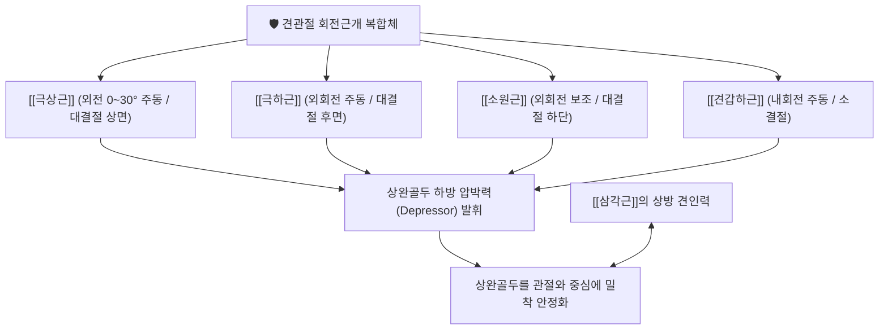

# 🩺 [[회전근개 파열]] (Rotator Cuff Tear, RCT)

> **핵심 요약 (Key Summary)**:
> 🎯 정의: 어깨 관절을 동적으로 안정화하는 회전근개 4개 힘줄([[극상근]], [[극하근]], [[소원근]], [[견갑하근]]) 중 하나 이상이 퇴행성 변성이나 기계적 마찰, 외상으로 인해 단열된 상태.
> 🚩 핵심 기전: [[극상근]] 건 부착부 1cm 내측 무혈관 위험 구역(Critical Zone)의 퇴행성 마모와 갈고리형 견봉 돌기에 의한 기계적 [[충돌 증후군]]으로 인한 삼각근-회전근개 짝힘(Force Couple) 붕괴.
> 🔍 주소증: 능동 외전 시 60~120도 사이에서 악화되는 동통호(Painful Arc), 환측으로 누울 때 심해지는 야간통, 수동 가동범위는 보존되나 팔을 들어 올리거나 버틸 때의 뚜렷한 근력 약화.
> ⚠️ 감별점: 전 방향 수동/능동 관절 운동이 모두 극심하게 제한되는 [[유착성 관절낭염]](오십견)과 달리, 수동 거상은 가능하나 능동 거상 유지 시 팔이 뚝 떨어지는 [[드롭 암 검사]] 양성 소견.

---

## 📌 목차
1. [기본 정보 및 정의](#1-기본-정보-및-정의)
2. [원인 및 발병 기전](#2-원인-및-발병-기전)
3. [임상 증상 및 단계별 진행](#3-임상-증상-및-단계별-진행)
4. [진단 및 감별 진단](#4-진단-및-감별-진단)
5. [현대의학적 치료 및 약물 요법](#5-현대의학적-치료-및-약물-요법)
6. [한의학적 진단 및 복합 치료 전략](#6-한의학적-진단-및-복합-치료-전략)
7. [임상 다빈도 의안 및 치료 프로토콜](#7-임상-다빈도-의안-및-치료-프로토콜)
8. [출처 및 현대 학술 연구 요약 (References)](#8-출처-및-현대-학술-연구-요약-references)

---

## 1. 기본 정보 및 정의

### (1) 회전근개의 해부학적 구성과 관절 안정화
* **회전근개(Rotator Cuff)**: 견갑골에서 기시하여 상완골 두를 감싸며 부착하는 4개의 근육 건 복합체로, 관절와에 비해 크기가 큰 상완골두를 동적으로 관절와 중심부에 밀착(Centering)시키는 견관절 핵심 안정화 구조물.
* **4대 회전근의 주행 및 고유 기능**:
  * [[극상근]](Supraspinatus): 견갑극 상와에서 기시하여 견봉하 공간을 지나 상완골 [[대결절]] 최상부에 부착. 상완골 외전 초기(0~30°) 거상을 주도하며 회전근개 파열의 80% 이상이 집중되는 호발 부위.
  * [[극하근]](Infraspinatus): 견갑극 하와에서 기시하여 상완골 [[대결절]] 후외측면에 부착. 견관절의 강력한 외회전을 주도하고 상완골두의 전방 전위를 방어.
  * [[소원근]](Teres Minor): 견갑골 외측연 상부에서 기시하여 상완골 [[대결절]] 하부에 부착. 외회전 보조 및 견관절 후하방 지지.
  * [[견갑하근]](Subscapularis): 견갑하와 전면에서 기시하여 상완골 [[소결절]]에 부착. 견관절의 내회전을 주도하며 전방 관절낭을 보호.

---

## 2. 원인 및 발병 기전

![[회전근개파열_극상근건파열_병태해부도.jpg|540]]
> [그림 1: 회전근개 파열 병태해부도 - 견봉 돌기 아래에서 상완골 대결절에 정지하는 [[극상근]] 힘줄의 파열 및 주변 관절와상완관절 구조]

### (1) 내인성 요인 (Intrinsic Mechanism)
* **무혈관 위험 구역 (Codman's Critical Zone)**: 상완골 대결절 부착부 직전 약 1cm 내측 부위는 미세혈관 공급이 가장 취약한 저혈류 영역으로, 일상적인 인장력과 혈관 압박으로 인해 나이가 들수록 퇴행성 허혈 및 콜라겐 섬유의 점액성 변성(Mucoid degeneration)이 조기 진행됨.
* **노화 및 세포외 기질 붕괴**: Type I 콜라겐의 가교 결합 감소, 건세포(Tenocyte)의 고사, 엘라스틴 섬유 파괴로 인해 미세 손상 후 자가 회복 능력이 상실됨.

### (2) 외인성 요인 (Extrinsic Mechanism) & Neer 견봉하 충돌
* **견봉하 공간 협소화**: 상완골두와 견봉, 오구견봉인대(Coracoacromial ligament) 사이의 견봉하 공간(Subacromial space, 정상 9~10mm)이 좁아지면서 팔을 들어 올릴 때 극상근건과 견봉하 점액낭이 마찰됨.
* **Bigliani 견봉 형태 분류**:
  * Type I (Flat, 평평형): 충돌 발생률 가장 낮음.
  * Type II (Curved, 곡선형): 중간 수준 충돌 위험.
  * Type III (Hooked, 갈고리형): 견봉 전하방이 갈고리처럼 돌출되어 극상근건 전방부를 기계적으로 긁어 전층 파열을 가장 흔히 유발.

### (3) 삼각근-회전근개 짝힘(Force Couple)의 붕괴
* 정상 어깨 거상 시 [[삼각근]]이 상완골두를 위로 끌어당기면, 4개의 회전근개가 상완골두를 관절와 아래쪽으로 당기는 짝힘(Depressor force)을 발휘하여 상완골두가 견봉에 부딪히지 않음.
* 극상근건 파열 시 하방 안정화 힘이 소실되어 상완골두가 비정상적으로 상방 이동(Superior migration)하며 견봉하 마찰이 기하급수적으로 증폭됨.

---

## 3. 임상 증상 및 단계별 진행

### (1) 주요 자각 증상
* **동통호 (Painful Arc)**: 팔을 옆으로 벌려 올릴 때(능동 외전), 60°에서 120° 사이 각도에서 극상근건이 견봉 돌기 밑을 통과하며 찌르는 듯한 통증이 격화되고, 120°를 넘어가면 통증이 일시적으로 경감됨.
* **야간통 (Night Pain)**: 밤에 통증이 극심해져 수면을 방해하며, 환측 어깨를 바닥에 대고 옆으로 누울 때 체중 압박으로 인한 내압 상승으로 자다가 깸.
* **근력 약화 (Weakness)**: 머리 위로 물건을 올리거나 운전대 윗부분을 잡을 때, 빗질이나 숟가락질 시 팔에 힘이 빠져 덜덜 떨리는 탈력감 발생.

### (2) 파열 단계별 진행 양상
1. **1단계 (건병증/활액낭염)**: 건 파열은 없으나 미세 파열과 견봉하 점액낭 부종이 동반되어 가동 시 뻐근한 통증.
2. **2단계 (부분층 파열, Partial Thickness Tear)**: 건의 두께 중 일부(관절면측, 활액낭측, 건실질내)만 단열된 상태로, 극심한 통증에 비해 근력 보존은 비교적 양호.
3. **3단계 (전층 파열, Full Thickness Tear)**: 상완골 대결절에서 건이 완전히 분리되어 관절강과 견봉하 활액낭이 서로 연통됨. 드롭 암 검사 양성 및 현저한 외전 무력감.
4. **4단계 (만성 광범위 파열 및 관절병증, Cuff Tear Arthropathy)**: 5cm 이상의 광범위 파열 후 근육의 지방 침윤(Goutallier stage 3~4)과 상완골두 상방 탈구, 견관절염 병발.

---

## 4. 진단 및 감별 진단

### (1) 특이적 이학적 유발 검사
* **[[드롭 암 검사]](Drop Arm Test)**: 검사자가 환자의 팔을 수동으로 90° 이상 외전시킨 뒤 손을 떼고 천천히 내리도록 지시. [[극상근]] 전층 파열 환자는 90° 지점에서 팔을 버티지 못하고 뚝 떨어뜨림.
* **[[빈 캔 검사]](Empty Can / Jobe Test)**: 견관절 90° 외전, 30° 수평내전, 모지(엄지)를 바닥으로 향하게 회내시킨 후 하방 저항을 줄 때 극상근 부위 통증 및 근력 저하 발생.
* **[[외회전 지연 징후]](External Rotation Lag Sign)**: 환자의 팔꿈치를 90° 굴곡하고 수동으로 최대 외회전시킨 뒤 놓았을 때 자세를 유지하지 못하고 스프링처럼 내회전 위치로 되돌아옴 ([[극하근]] 및 [[소원근]] 파열).
* **[[베어 허그 검사]](Bear Hug Test)**: 환자가 환측 손바닥을 반대쪽 어깨 위에 얹고 팔꿈치를 들어 올린 상태에서 검사자가 손을 떼어내려 할 때 버티지 못함 ([[견갑하근]] 파열).

![[견봉하충돌_및_극상근파열_MRI.jpg|450]]
> [그림 2: 견봉하 충돌 및 극상근건 파열 관상면 T2강조 MRI - 갈고리형 견봉 돌기 아래 극상근건의 연속성 단열과 고신호강도 활액 삼출액 소견]

### (2) 영상 의학적 진단
* **단순 X-선 (X-ray)**: True AP, Outlet view에서 견봉 하방 골극(Type III Hooked acromion), 견봉-상완골두 간격(AHI < 7mm 시 광범위 파열 의심) 관찰.
* **근골격계 초음파 (MSK Ultrasound)**: 외래에서 실시간 동적 검사로 건의 연속성 소실(Hypoechoic defect), 대결절 연골 노출(Cartilage interface sign) 확인.
* **자기공명영상 (MRI)**: 파열 부위(관절면측/활액낭측/전층), 파열 크기(소/중/대/광범위), 건 말단의 퇴축(Patte classification), 근육의 지방 변성(Goutallier classification)을 정밀 평가하여 보존적 치료 대 수술적 치료를 결정.

![[회전근개파열_근골격계초음파_소견.jpg|450]]
> [그림 3: 회전근개 파열 근골격계 초음파(US) 소견 - 상완골 대결절 상면 극상근건 전층 결손 및 저에코성 파열 간극]

### (3) 핵심 감별 진단 표

| 감별 질환 | 호발 연령 및 병력 | 능동 운동 범위(AROM) | 수동 운동 범위(PROM) | 특이적 이학적 검사 소견 |
| :--- | :--- | :--- | :--- | :--- |
| [[회전근개 파열]] | 50대 이상, 반복 과사용/외상 | 외전 거상 현저한 약화 및 통증 | **대체로 정상 보존됨** | [[드롭 암 검사]], [[빈 캔 검사]] 양성 |
| [[유착성 관절낭염]] | 40~60대, 당뇨/갑상선 기저 질환 | **전 방향 심한 제한** | **전 방향 심한 제한 (외회전 소실)** | 관절 캡슐 끝느낌(Hard end-feel) |
| [[석회성 건염]] | 30~50대, 급격한 초응급성 통증 | 극심한 통증으로 일체 거상 불가 | 통증으로 수동 검사 불가 | X-선 상 분필가루 같은 석회 음영 |
| [[경추 추간판 탈출증]] | 경추 퇴행, 자세 불량 | 견관절 자체 가동범위 정상 | 정상 가동범위 | [[스펄링 검사]] 양성, 경추 신경병증 |

---

## 5. 현대의학적 치료 및 약물 요법

### (1) 보존적 요법 (소형~중형 파열, 고령자, 부분 파열)
* **약물 치료**: [[아세트아미노펜]], [[이부프로펜]], [[록소프로펜]], [[세레콕시브]] 등 경구 NSAIDs 투여로 급성 활액낭염 및 염증성 통증 완화.
* **주사 치료**: 견봉하 점액낭 내 코르티코스테로이드 국소 주입(연 2~3회 이하 제한, 잦은 주입은 건의 교원질 파괴 촉진) 또는 PDRN/콜라겐 재생 주사.
* **물리 및 운동 치료**: 견갑골 안정화 운동([[전거근]], [[승모근]]), 회전근개 등척성 강화, 관절 낭 스트레칭.

### (2) 수술적 요법 (급성 외상성 파열, 3cm 이상 대파열, 젊은 활동기 환자)
* **관절경하 회전근개 봉합술 (Arthroscopic Rotator Cuff Repair)**: 앵커(Suture anchor)를 대결절 골면에 삽입하여 파열된 건을 해부학적 족문(Footprint)에 봉합.
* **역행성 인공견관절 치환술 (Reverse Total Shoulder Arthroplasty, RTSA)**: 힘줄이 완전히 소실되어 봉합이 불가능하고 관절염이 동반된 고령 환자에서 [[삼각근]]의 지레대를 이용하도록 관절와와 골두 형태를 역전시켜 치환.

---

## 6. 한의학적 진단 및 복합 치료 전략

### (1) 한의학적 병인 및 변증
* **기혈어저(氣血瘀阻)**: 외상, 무거운 물건 들기, 과도한 노동으로 인해 견관절 락맥이 파열되어 어혈이 맺힌 상태. 밤에 통증이 바늘로 찌르는 듯 고정되어 발생.
* **간신휴허(肝腎虧虛)**: 노화로 인해 신정(腎精)과 간혈(肝血)이 마르고 근골(筋骨)에 영양 공급이 끊겨 힘줄이 닳고 삭아버린 만성 퇴행성 파열.
* **풍한습비(風寒濕痺)**: 풍한습 사기가 관절극으로 침습하여 어깨가 시리고 무거우며 비오는 날 통증이 심해짐.

### (2) 다각적 한의 임상 시술 전략
* **약침 요법 (Pharmacopuncture)**:
  * **봉약침(Mellitin)**: 견봉하 점액낭 부위([[견우]], [[견료]])에 주입하여 강력한 염증성 사이토카인(TNF-α, IL-1β) 억제 및 주변 유착 해소.
  * **자하거/오공 약침**: 극상근 건 부착부([[노회]], [[천종]])에 주입하여 콜라겐 조직 재생 촉진 및 만성 허혈성 신경통 진통.
* **침도 요법 (Acupotomy)**: 견봉하 오구견봉인대 비후부와 상완골 대결절 활액낭의 섬유성 유착을 미세 박리(Release)하여 충돌 내압을 감압.
* **추나 요법 (Chuna Manual Therapy)**:
  * 견갑흉곽관절 가동 기법: 전방경사(Anterior tilt)된 견갑골을 후방경사 및 상방회전으로 교정하여 견봉하 공간 확보.
  * [[전거근]], [[하부승모근]] 강화 추나 및 단축된 [[소흉근]] 이완.
* **처방 배오**:
  * 급성 염증 및 어혈: [[서경탕]], [[당귀수산]], 칠제향부환 가감.
  * 만성 퇴행 및 건보강: [[독활기생탕]], 보혈영근탕, 대강활탕.

---

## 7. 임상 다빈도 의안 및 치료 프로토콜

### (1) 진료실 핵심 문진 체크리스트 & 감별 포인트
* [ ] **능동/수동 가동 범위 분리 측정**: 보호자가 팔을 들어줄 때는 위로 완전히 올라가는가? (올라간다면 오십견 배제, 회전근개 파열 또는 견봉하 충돌증후군 강력 의심).
* [ ] **60~120도 동통호 및 야간통 확인**: 자다가 아픈 어깨로 돌아누울 때 비명을 지르며 깨는가?
* [ ] **수술 대 비수술 감별**: 환자의 연령, 파열 크기(MRI 기준), 급성 외상 여부를 파악하여 3cm 미만 퇴행성 파열은 한의 보존 치료 집중, 급성 외상성 전층 파열은 정형외과 봉합술 연계 고려.

### (2) 단계별 한의 치료 및 재활 프로토콜
* **1단계: 급성 통증 조절기 (1~3주차)**
  * 과두 동작(Overhead activity) 절대 제한 및 팔자 붕대/슬링 휴식.
  * [[견우]], [[견료]], [[노회]] 봉약침 시술 (주 2~3회) + [[서경탕]] 투여.
  * 코드만 진자 운동(Pendulum exercise): 체중을 앞으로 숙이고 아픈 팔을 늘어뜨려 시계추처럼 부드럽게 흔드는 무부하 관절 운동 지도.
* **2단계: 견갑골 정렬 및 건 유착 박리 (4~6주차)**
  * 견봉하 점액낭 및 오구견봉인대 침도 치료 + 견갑골 가동 추나 요법.
  * 도르래(Pulley)를 이용한 무통 범위 내 수동 관절 가동 운동.
* **3단계: 회전근개 등척성 강화 및 재발 방지 (7~12주차)**
  * 팔꿈치를 몸통에 붙인 채 테라밴드(저탄력 고무줄)를 이용한 외회전/내회전 등척성 근력 운동.
  * 보혈영근탕 또는 [[독활기생탕]] 투약으로 건 복원력 유지.

---

## 8. 출처 및 현대 학술 연구 요약 (References)

* Neer CS 2nd. Impingement lesions. *Clin Orthop Relat Res*. 1983;(173):70-77.
  * [PMID: 6825348](https://pubmed.ncbi.nlm.nih.gov/6825348/)
  * [연구 요약] 회전근개 파열의 기계적 원인으로서 견봉하 충돌 기전과 견봉 형태의 3단계 병기(부종 및 출혈 $\rightarrow$ 섬유화 및 건염 $\rightarrow$ 골극 형성 및 건 파열)를 확립한 고전 연구.
* American Academy of Orthopaedic Surgeons (AAOS). Management of Rotator Cuff Injuries: Clinical Practice Guideline. *J Am Acad Orthop Surg*. 2021;28(24):e1040-e1046.
  * [PMID: 33156216](https://pubmed.ncbi.nlm.nih.gov/33156216/)
  * [연구 요약] 회전근개 손상 관리에 대한 근거 기반 임상 진료 지침으로, 증상성 부분층 및 비외상성 전층 파열에서 수술 전 최소 3~6개월간의 보존적 물리/운동/약물 치료의 우선 적용 근거를 제시.
* Kim JH, et al. Acupuncture therapy in postoperative rehabilitation for arthroscopic rotator cuff repair: A systematic review and meta-analysis. *Front Surg*. 2025;12:1532187.
  * [PMID: 40994869](https://pubmed.ncbi.nlm.nih.gov/40994869/)
  * [연구 요약] 관절경하 회전근개 봉합술 후 재활 과정에서 침 치료를 병행했을 때 수술 후 통증 점수(VAS)의 유의한 감소와 어깨 관절 기능 점수(UCLA Shoulder Score, Constant Score) 및 조기 가동 범위의 통계적으로 유의미한 향상을 입증한 최신 메타분석.

---
## 📎 개념 학습 보충 (2026-09-16 논문 연계)
- **회전근개 질환(RCD)은 '파열'만이 아니라 스펙트럼이다**: 만성 회전근개 질환(rotator cuff disease)은 건병증(건 내부 퇴행) → 부분층 파열 → 전층 파열 → 파열성 관절병증으로 이어지는 **연속선** 위의 개념이며, 임상에서는 **"3개월 초과 어깨 통증 + 60~120° 통증성 호 + empty can·외회전 저항검사 양성"** 이라는 묶음으로 정의된다. 본 노트가 다루는 파열 단계 이전 구간(건병증·부분층)이 보존적 치료의 주 무대다 → [[힘줄병증]]
- **2026-09-16 심층리뷰 1번 — 매선(埋線) vs 단순 자침 RCT**: Medicine (Baltimore) 2026;105(1):e46638, [PMID: 41496087](https://pubmed.ncbi.nlm.nih.gov/41496087/) / KCT0002563 — 만성 RCD 64명(매선 32 vs 샴 매선 32), **주 1회 × 8주**, 6개 고정 혈위(PDO 29Gauge×40mm)
  - 배혈: 극상근 2점(거골 LI16→병풍 SI12, 병풍→곡원 SI13) · 극하근 2점([[천종(SI11)]]→노수 SI10, 천종→병풍) · 삼각근 1점(견우 LI15–견료 TE14 중점→삼각근 중앙) · 소원근 1점([[견정(SI9)]] 수직 약 4cm) — 극상근·극하근·삼각근은 **횡방향 매선**, 소원근만 수직
  - `[연구 요약]` 양 군 모두 VAS 유의 감소, **군간 차이 없음**(ITT·PP 동일). 유일한 군간 유의차는 **4주 외회전 ROM**(ITT P=.046, 매선군 +9.88±16.11°). 16주 매선군 내 VAS·[[SPADI]]·RC-QoL·EQ-5D 호전. 이상반응은 보고됐으나 치료와의 인과성 없음, 안전성 문제 없음. 추가비용 202,300원, 외회전 1°당 ICER 29,586원 → [[QALY와 비용효과성]]
  - **해석의 핵심**: 대조군이 '실을 남기지 않은 자침(simple acupuncture)'이므로 **"매선 > 위약"이 아니라 "매선 vs 단순 자침의 추가 이득 없음"** 으로 읽어야 한다. 급성 통증기는 [[전침]]·약침으로 제어하고, 통증이 가라앉은 만성 유지기·재발 방지 단계에서 매선을 검토하는 2단 전략이 합리적이다 → [[매선]]
  - ⚠️ 군당 32명으로 검정력이 제한적이고, 시험 시행(2017–2018)과 출판(2026) 사이 시간차가 크다.
- 관련: [[극상근]] · [[극하근]] · [[소원근]] · [[삼각근]] · [[회전근개]] · [[2026-09-16_재활운동의학_심층리뷰]] 1번
