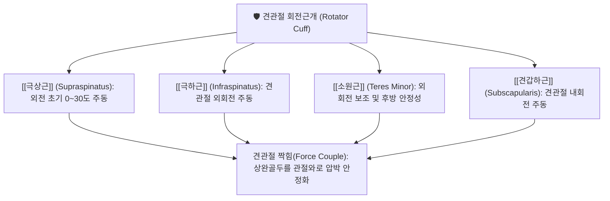

# 🩺 [[회전근개 파열]] (Rotator Cuff Tear, RCT)

> **핵심 요약 (Key Summary)**:
> 견관절을 안정화하는 회전근개 4개 힘줄 중 하나 이상이 퇴행성 마모나 외상으로 파열된 상태
> [[극상근]] 힘줄의 무혈관성 위험 구역 손상이 가장 흔하며 상완골두와 견봉 간 짝힘 붕괴 유발
> 60~120도 동통호, 야간통 및 팔을 들어올릴 때의 무력감이 특징이며 침도·봉약침 및 추나 치료 적용

---
## 📌 목차
1. [해부학적 구조 & 생체역학적 기능](#1-해부학적-구조--생체역학적-기능)
2. [병인, 발생 메커니즘 & 병태생리](#2-병인-발생-메커니즘--병태생리)
3. [임상 증상 & 이학적 검사](#3-임상-증상--이학적-검사)
4. [영상 의학적 진단 & 파열 분류](#4-영상-의학적-진단--파열-분류)
5. [한의학적 변증 & 다각적 치료 전략](#5-한의학적-변증--다각적-치료-전략)
6. [재활 운동 & 환자 생활 관리](#6-재활-운동--환자-생활-관리)
7. [출처 및 학술 참고 문헌 (References)](#7-출처-및-학술-참고-문헌-references)

---
## 1. 해부학적 구조 & 생체역학적 기능

### (1) 회전근개 4대 근육 및 기능
* [[극상근]]: 상완골 [[대결절]] 상부에 부착하며, 팔을 옆으로 들어 올리는 초기 외전(0~30°)을 주도함. 회전근개 파열의 80% 이상이 극상근건에서 시작됨.
* [[극하근]] 및 [[소원근]]: [[대결절]] 후면에 부착하여 외회전을 담당하며, 상완골두가 전방으로 아탈구되는 것을 방어함.
* [[견갑하근]]: 상완골 소결절에 부착하여 내회전을 담당하고 견관절 전방벽을 지지함.

### (2) 삼각근-회전근개 짝힘(Force Couple)의 붕괴
* 정상 상태에서는 회전근개가 상완골두를 관절와 중심부로 끌어당기는 하방 압박력(Depressor)을 발휘하여, [[삼각근]]의 상방 견인력과 균형을 이룸.
* 회전근개가 파열되면 하방 압박력이 상실되어 [[삼각근]]이 상완골두를 견봉 바로 아래로 끌어올려 견봉하 충돌이 가속화됨.

---
## 2. 병인, 발생 메커니즘 & 병태생리

### (1) 내인성 요인 (Intrinsic Factors)
* **저혈관 영역(Critical Zone)**: 극상근건 부착부 1cm 내측은 혈관망이 희소한 무혈관성 영역으로, 노화 및 반복 미세손상에 따른 자가 치유 능력이 극히 취약함.
* **교원섬유 변성**: 연령 증가에 따른 Type I 콜라겐 감소 및 점액성 변성.

### (2) 외인성 요인 (Extrinsic Factors)
* **견봉하 충돌 증후군**: 갈고리형(Hooked, Type III) 견봉 돌기, 오구견봉인대 비후로 인한 기계적 마찰.
* **급성 외상**: 팔을 뻗은 채 넘어지거나 무거운 물건을 갑자기 들어 올릴 때의 견인력.

---
## 3. 임상 증상 & 이학적 검사

### (1) 주요 임상 증상
* **동통호 (Painful Arc)**: 능동적으로 팔을 외전할 때 60°~120° 사이에서 통증이 극대화되고 그 이상에서는 완화됨.
* **야간통 (Night Pain)**: 환측으로 누워 잘 때 체중에 의한 압박으로 심한 야간 수면 장애 호소.
* **근력 약화**: 수동 운동 범위(PROM)는 비교적 유지되나 능동 운동 범위(AROM)에서 뚝 떨어지거나 떨림 발생.

### (2) 특이적 이학적 유발 검사
* **드롭 암 검사 (Drop Arm Test)**: 팔을 90° 외전 상태에서 천천히 내리게 할 때 조절하지 못하고 뚝 떨어짐 (광범위 극상근 파열 시 양성).
* **빈 캔 검사 (Empty Can / Jobe Test)**: 견관절 90° 외전, 30° 수평내전, 엄지손가락을 아래로 향한 상태에서 하방 저항을 줄 때 통증 및 약화 (극상근 건 평가).
* **외회전 지연 징후 (External Rotation Lag Sign)**: 수동으로 외회전시킨 위치를 유지하지 못하고 스프링처럼 내회전됨 (극하근 파열).
* **베어 허그 검사 (Bear Hug Test)**: 반대쪽 어깨 위에 손을 올리고 내회전 저항을 줄 때 약화 (견갑하근 파열).

---
## 4. 영상 의학적 진단 & 파열 분류

* **초음파 (Musculoskeletal Ultrasound)**: 힘줄 내 저에코성 결손 부위를 동적으로 확인하며 건의 연속성 소실 진단.
* **MRI 검사**: T2 강조 영상에서 힘줄의 완전 단열, 건 퇴축(Retraction) 정도, 근육의 지방 침윤(Goutallier stage) 평가.
* **파열 단계 분류**:
  * 부분 파열 (Partial-thickness tear): 관절면측, 활액낭측, 건실질내 파열.
  * 완전 파열 (Full-thickness tear): 소파열(<1cm), 중파열(1~3cm), 대파열(3~5cm), 광범위 파열(>5cm).

---
## 5. 한의학적 변증 & 다각적 치료 전략

### (1) 한의학적 병인 변증
* **기혈어저(氣血瘀阻)**: 외상 또는 과사용으로 인해 낙맥이 손상되어 찌르는 듯한 고정성 야간통 발생.
* **간신휴허(肝腎虧虛)**: 노화로 인해 근골이 마르고 영양 공급이 끊겨 발생하는 퇴행성 파열.

### (2) 다각적 한의 치료
* **봉약침 치료**: 강력한 항염증 및 진통 작용으로 건 주변 활액낭염 및 염증성 부종 해소.
* **도침(Acupotomy) 치료**: 견봉하 건 유착 및 만성적인 비후 조직을 미세 박리하여 충돌 압력을 완화.
* **추나 요법 (Chuna)**: 견갑골 상방회전근군([[전거근]], [[상부승모근]], [[하부승모근]])을 강화하고 오구견봉궁의 가동성을 정상화하는 견관절 가동 기법.
* **처방 배오**: 급성기에는 어혈을 풀고 염증을 끄는 서경탕, 당귀수산 계열; 만성기에는 건인대를 보강하는 보혈영근탕, 독활기생탕 배오.

---
## 6. 재활 운동 & 환자 생활 관리

* **추돌 방지 생활 수칙**: 어깨 높이 이상으로 팔을 들어 올리는 과두 작업(Overhead activity) 제한.
* **진자 운동 (Codman Pendulum Exercise)**: 중력을 이용해 상완골두를 자연스럽게 이완시키는 수동 관절 가동 운동.
* **회전근개 등척성 운동**: 통증이 유발되지 않는 범위 내에서 고무 밴드를 활용한 외회전 및 내회전 점진적 근력 강화.

---
## 7. 출처 및 학술 참고 문헌 (References)

* 대한정형외과학회, 《정형외과학》, 최신의학사
* 대한침구의학회 교재편찬위원회, 《침구의학》, 한미의학
* Neer CS 2nd. Impingement lesions. Clin Orthop Relat Res. 1983.
  * [연구 요약] 회전근개 파열의 기계적 원인으로서 견봉하 충돌 기전과 견봉 형태의 3단계 분류를 체계화함.
