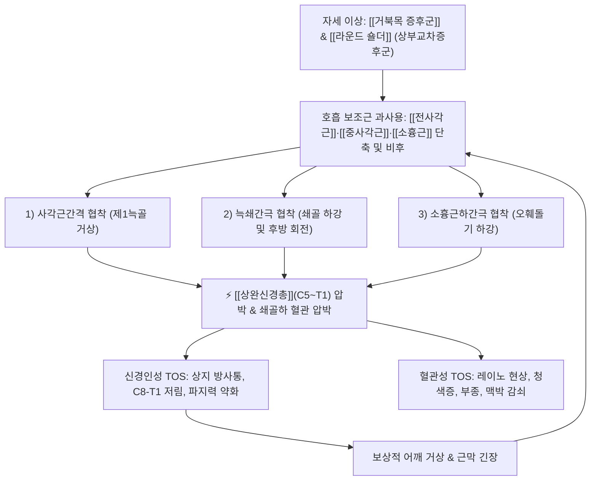
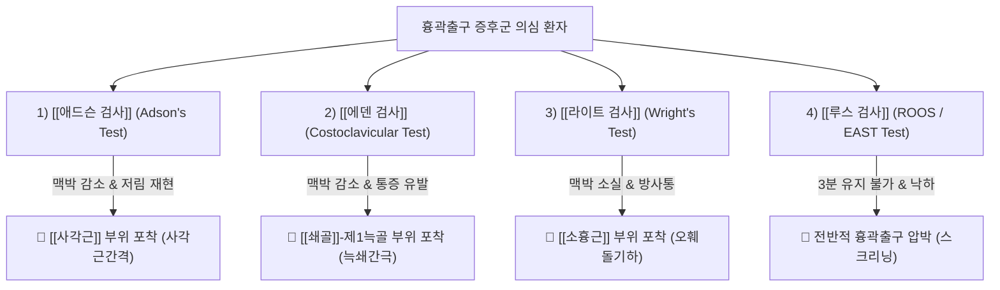

---
aliases:
  - 흉곽 출구 증후군
  - 늑쇄관절 터널 증후군
  - Costoclavicular tunnel syndrome
  - 전사각근 증후군
  - 중사각근 증후군
  - Thoracic Outlet Syndrome
  - TOS
tags:
  - 질환
  - 흉곽출구증후군
  - 신경포착
  - 상지질환
  - 근골격계
---

# 🩺 [[흉곽출구 증후군]] (Thoracic Outlet Syndrome, TOS, G54.0)

> **핵심 3줄 요약 (Key Summary)**:
> - 📍 병소 부위 & 해부·병태생리: 쇄골 상부 및 흉곽 상구에서 [[상완신경총]](C5~T1)과 쇄골하 동·정맥이 3대 해부학적 간극([[사각근간격]], [[늑쇄간극]], [[소흉근하간극]])을 통과할 때 근육 단축·자세 변형·골격 기형으로 압박되는 신경혈관 포착 질환.
> - 🚩 전형적 임상 양상 & 3대 징후: 상지 내측(C8~T1) 방사통 및 저림, 손과 손가락의 부종·냉감·청색증(혈관성), 머리 위로 팔을 올릴 때 악화되는 상지 피로감 및 파지력 약화.
> - 🛠️ 핵심 감별 검사 & 한·양방 다각적 치료 전략: [[애드슨 검사]], [[라이트 검사]], [[루스 검사]](EAST)로 3대 포착 부위를 정밀 감별하고, [[전사각근]]·[[중사각근]]·[[소흉근]] 타겟 약침·침도 요법 및 경흉추 교정 추나 치료 시행.
> - ⚠️ 응급 의뢰 레드플래그 & 악화 요인: 급격한 상지 청색증·냉감 및 요골동맥 맥박 소실(급성 쇄골하동맥 혈전증, Paget-Schroetter 증후군) 시 즉시 혈관외과 응급 의뢰, 무리한 고강도 상체 거상 운동 금기.

---

## 📌 목차
1. [질환 개요 & 해부학적 병태생리](#1-질환-개요--해부학적-병태생리)
2. [병태생리 메커니즘 & 생체역학적 악순환 네트워크](#2-병태생리-메커니즘--생체역학적-악순환-네트워크)
3. [임상 증상 & 이학적 검사(Physical Exam) 알고리즘](#3-임상-증상--이학적-검사physical-exam-알고리즘)
4. [감별 진단 매트릭스 (Differential Diagnosis)](#4-감별-진단-매트릭스-differential-diagnosis)
5. [한의 통합 치료 프로토콜 (침·약침·추나·한약)](#5-한의-통합-치료-프로토콜-침약침추나한약)
6. [재활 운동 & 생활습관 티칭 가이드](#6-재활-운동--생활습관-티칭-가이드)
7. [💡 사용자 진료실 핵심 필기 & 임상 노하우 (Melt-In 잔여 심화 집약)](#7--사용자-진료실-핵심-필기--임상-노하우-melt-in-잔여-심화-집약)
8. [출처 및 학술 참고 문헌 (References)](#8-출처-및-학술-참고-문헌-references)

---

## 1. 질환 개요 & 해부학적 병태생리

![[흉곽출구증후군_해부학_신경압박_메디컬일러스트.jpg|450]]
> [그림 1: 흉곽출구의 상완신경총 및 쇄골하혈관 주행과 3대 신경혈관 압박 구역 메디컬 일러스트]

* **질환 정의**:
  * 흉곽 상부 입구(Thoracic Outlet)를 지나 팔로 주행하는 [[상완신경총]] 신경 다발과 [[쇄골하동맥]]·[[쇄골하정맥]]이 주변 근육, 인대, 늑골, 쇄골에 의해 물리적으로 압박되거나 견인되어 발생하는 일련의 신경 및 혈관 복합 증후군입니다.
* **3대 해부학적 포착 공간 (The 3 Entrapment Tunnels)**:
  1. **사각근간 삼각 (Interscalene Triangle)**: [[전사각근]](앞), [[중사각근]](뒤), 제1늑골 상면(아래)으로 둘러싸인 공간. [[상완신경총]] 신경간(Trunks)과 [[쇄골하동맥]]이 통과함 ([[쇄골하정맥]]은 전사각근 앞쪽으로 주행).
  2. **늑쇄 간극 (Costoclavicular Space)**: [[쇄골]](위)과 제1늑골(아래) 사이 공간. [[쇄골하근]]의 비후나 쇄골 하강 자세에서 압박됨.
  3. **소흉근하 간극 (Retropectoralis Minor / Subcoracoid Space)**: [[소흉근]]과 오훼돌기(앞) 및 흉벽(뒤) 사이 공간. 팔을 외전·외회전할 때 신경혈관속이 소흉근 건 아래에서 지렛대처럼 꺾이며 압박됨.
* **해부학적 유발 인자**:
  * 선천적 경늑골(Cervical rib), 제7경추 횡돌기 비대, [[거북목 증후군]], [[라운드 숄더]](둥근 어깨), 흉식 호흡 과다로 인한 보조 호흡근([[사각근]], [[소흉근]]) 과긴장.

---

## 2. 병태생리 메커니즘 & 생체역학적 악순환 네트워크

![[흉곽출구증후군_3대_압박간극_도해.png|450]]
> [그림 2: 사각근 삼각, 늑쇄 간극, 소흉근하 간극의 3차원 해부학적 압박 기전 도해]

### 1) 신경인성 TOS (Neurogenic TOS, >90%)
* [[상완신경총]]의 하부 신경간(C8~T1)이 가장 흔히 압박되어 척골신경 주행 라인(상완 내측, 전완 내측, 4~5지)을 따라 찌릿한 통증, 이상감각, 수내재근(Thenar/Hypothenar) 위축을 유발합니다.
### 2) 혈관성 TOS (Vascular TOS, <5~10%)
* **동맥성**: [[쇄골하동맥]] 압박으로 팔을 올릴 때 요골동맥 맥박이 소실되고, 손이 하얗게 질리며 냉감 및 허혈성 통증 발생.
* **정맥성**: [[쇄골하정맥]] 압박으로 상지 부종, 청색증, 쇄골 상부 및 흉벽 표재정맥 확장이 나타남.

---

## 3. 임상 증상 & 이학적 검사(Physical Exam) 알고리즘

### 1) 3대 해부학적 부위별 특이적 이학적 검사법

* [[애드슨 검사]] (Adson test):
  * 환측으로 고개를 돌리고 경추를 신전시킨 상태에서 심호흡을 멈추게 한 후 요골동맥 맥박 소실 및 상지 저림 유발 확인 $\rightarrow$ [[전사각근]]·[[중사각근]] 포착 확진.
* [[라이트 검사]] (Wright test / 과외전 검사):
  * 팔을 90~180도 외전 및 외회전시킨 상태에서 요골동맥 맥박 소실 및 저림 재현 확인 $\rightarrow$ [[소흉근]] 포착 확진.
* [[루스 검사]] (ROOS test / Elevated Arm Stress Test, EAST):
  * 양팔을 90도 외전·외회전(항복 자세)하고 3분간 주먹을 쥐었다 폈다 반복 $\rightarrow$ 1~2분 내에 무력감으로 팔이 떨어지거나 극심한 통증 발생 시 양성.

---

## 4. 감별 진단 매트릭스 (Differential Diagnosis)

| 감별 질환 | 호발 병소 | 주소증 특징 | 핵심 감별 이학적 검사 |
| :--- | :--- | :--- | :--- |
| [[흉곽출구 증후군]] (TOS) | 사각근/늑쇄/소흉근 간극 | 상지 전체 및 4~5지 저림, 머리 위 거상 시 악화 | [[애드슨 검사]], [[라이트 검사]], [[루스 검사]] 양성 |
| [[경추 추간판 탈출증]] (디스크) | C5~C7 경추 신경근 | 특정 단일 신경근(C6/C7) 피부분절 방사통, 목 움직임 시 악화 | [[스펄링 검사]](Spurling), [[경추 견인 검사]](Distraction) 양성 |
| [[수근관 증후군]] (손목터널) | 손목 굴근지대 (횡수근인대) | 1~3.5지 손가락 끝 저림, 야간통 심함, 수의근력 약화 | [[팔렌 검사]](Phalen), [[틴넬 징후]](Tinel) 양성 |
| [[회전근개 파열]] | 견관절 극상근건 | 견관절 외전 시 국소 통증(Painful arc), 야간통 | [[Neer test]], [[Hawkins test]], [[Empty can test]] 양성 |

---

## 5. 한의 통합 치료 프로토콜 (침·약침·추나·한약)

![[PNP_Fig_TOS_Scalene_Injection.png|380]]
> [그림 3: 사각근간 삼각 부위의 초음파 유도하 약침 및 신경 수압박리술 주입점]

![[PNP_Fig_TOS_PecMinor_Injection.png|380]]
> [그림 4: 오훼돌기 내측하방 소흉근하 간극 약침 주입점]

* **침구 및 전침 치료 (Acupuncture)**:
  * **타겟 근육**: [[전사각근]], [[중사각근]], [[소흉근]], [[쇄골하근]], [[견갑배근]], [[승모근]](상부).
  * **전침 요법**: 사각근 및 소흉근 압통점에 저주파(2Hz) 전침을 걸어 근육 내 혈류를 개선하고 근막 긴장을 이완.
* **약침 치료 (Pharmacopuncture)**:
  * **주입 포인트**: C5~T1 경추 횡돌기 전결절(사각근 기시부), 쇄골 상와(사각근간격 신경 주변), 오훼돌기 내측하방 1cm([[소흉근]] 부착부).
  * **약침 제제**: 신바로약침, 중성어혈약침, 소염약침(황련해독)을 활용하여 신경 주변 무균성 염증과 유착을 수압으로 박리(Hydrodissection).
* **추나 치료 (Chuna Manipulation)**:
  * **경추·흉추 관절가동추나**: 상부 흉추(T1~T4) 및 제1늑골 하강 관절 가동술.
  * **근막이완추나(JS)**: 쇄골하근 근막 이완, 사각근 및 소흉근 근막 스트레칭 기법 적용.
* **한약 치료 (Herbal Medicine)**:
  * **급성기 (기체혈어)**: [[회수산]], [[당귀수산]], [[서경탕]] (상지 경락 소통 및 어혈 제거).
  * **만성기 (기혈양허·한응)**: [[오약순기산]], [[대진교탕]], [[계지가황기탕]] (상지 말초 순환 촉진 및 신경 재생).

---

## 6. 재활 운동 & 생활습관 티칭 가이드

* **사각근 및 소흉근 스트레칭**:
  * 의자에 앉아 한 손으로 의자 모서리를 잡고 고개를 반대쪽으로 측굴 및 회전하여 사각근을 20초간 부드럽게 신장.
  * 문틀에 팔을 90도로 대고 몸을 앞으로 기울여 소흉근을 시원하게 이완.
* **상부 흉추 신전 및 흉식 호흡 교정**:
  * 횡격막 복식 호흡(분당 8~10회)을 훈련시켜 과도한 사각근·흉쇄유돌근 보조 호흡을 억제.
* **작업 환경 개선**:
  * 컴퓨터 모니터 눈높이 상향, 턱 당기기(Chin-tuck) 자세 유지, 어깨를 짓누르는 무거운 백팩 착용 금지.

---

## 7. 💡 사용자 진료실 핵심 필기 & 임상 노하우 (Melt-In 잔여 심화 집약)

> [!IMPORTANT]
> **🛡️ 원문 융합(Melt-In) 및 7번 섹션 작성 불변 규칙 (CRITICAL)**
> 1. **기존 필기 내용 상부 전면 융합 (Melt-In)**: 기존 노트에 있던 질환의 정의, 해부학적 원인, 증상, 이학적 검사법, 치료법, 생활 티칭 등은 상부 1~6번 섹션에 유기적으로 100% 녹여내어(Melt-In) 고도화합니다.
> 2. **7번 섹션의 차별화된 심화 집약 (녹이고 남은 고유 필기만 수록)**: 7번 섹션은 상부에 이미 녹여낸 기본 원문을 단순 중복 나열(복사-붙여넣기)하는 공간이 아닙니다. **상부 1~6번에 다 담기지 않은, 기존 노트에만 있었던 녹이고 남은 고유한 내용(원장님만의 독창적인 진료실 노하우, 실전 문진 체크리스트, 환자 설명 스크립트, 임상 감별 직관 팁 등)만이 엄선되어 집약**되어야 합니다.
> 3. **📷 고해상도 메디컬 일러스트 외부 수록 필수**: 기존 볼트 내 이미지 외에도, 학술적 가치가 높은 외부 메디컬 일러스트(해부학, 병태생리, 치료 포인트 등)를 최소 1장 이상 검색·다운로드하여 노트에 필수로 수록합니다.

### 7.1 상완신경총 세부 분지별 신경 포착 매핑 (원장님 고유 임상 필기)

![[PNP_Fig_TOS_Anatomy.png|400]]
> [그림 5: 상완신경총 분지별 신경 포착 및 연관 근육 매핑 도해]

* **주요 신경 및 맥관별 세부 포착 증상**:
  * [[외측흉근신경]] 및 [[내측흉근신경]] 포착: [[대흉근]] 등척성 수축 시 허혈성 통증 유발, 등장성 수축 시 골막 자극 및 염증성 통증 발생.
  * [[내측상완피신경]] 및 [[내측전완피신경]] 포착: 상완 내측과 전완 내측의 표재성 감각신경성 찌릿함 유발.
  * [[견갑상신경]], [[견갑하신경]], [[흉배신경]] 포착: [[견갑하근]], [[광배근]], [[대원근]]의 등장성 수축 $\rightarrow$ 골막 자극 및 허혈성 견갑부 통증.
  * [[요골신경]] 포착: 상완·전완 신전근의 등척성 수축(허혈성 통증) 및 손가락 골막 자극 통증 동반.
  * [[정중신경]] 포착: 감각신경성 손바닥 저림과 함께 [[요측수근굴근]] 단축 및 [[원회내근]] 부위의 이중 포착(Double Crush) 확인 필수.
  * [[척골신경]] 포착: 흉곽 출구보다는 C8, T1 척추주위 심부근육이나 [[소흉근]] 단축을 우선 확인.
  * [[근피신경]] 포착: [[오훼완근]] 관통 부위 압통 확인.
  * [[액와신경]] 포착: [[소원근]] 및 사각공간(Quadrilateral space) 포착 확인.

### 7.2 진료실 실전 감별 직관 팁 (경추 디스크 vs 흉곽출구 증후군)
1. **사각근 스트레칭 동작 검사**:
   * 환측으로 경추를 회전하고 반대쪽으로 측굴시켜 사각근을 강하게 신장시킬 때 팔 저림이 악화되면 $\rightarrow$ [[흉곽출구 증후군]].
2. **축성 압박 vs 견인 반응**:
   * 정수리를 수직으로 누를 때([[스펄링 검사]]) 방사통이 악화되고, 머리를 위로 들어 올릴 때([[경추 견인 검사]]) 방사통이 즉각 완화되면 $\rightarrow$ [[경추 추간판 탈출증]](디스크).

---

## 8. 출처 및 학술 참고 문헌 (References)

1. **대한정형외과학회 (2020)**. 『정형외과학 제8판』. 최신의학사.
2. **Illig, K. A. et al. (2016)**. *Reporting standards of the Society for Vascular Surgery for thoracic outlet syndrome*. **Journal of Vascular Surgery**, 64(3), e23-e35.
   - **[연구 요약]**: 신경인성, 정맥성, 동맥성 흉곽출구 증후군의 표준 진단 기준 및 이학적 검사 알고리즘 제시.
3. **Povlsen, B. et al. (2014)**. *Treatment for thoracic outlet syndrome*. **Cochrane Database of Systematic Reviews**, (11), CD007218.
   - **[연구 요약]**: 보존적 운동 치료 및 근육 이완 요법이 신경인성 TOS 환자의 통증과 기능 장애를 유의하게 개선함을 확인.
4. **Kim, S. B. et al. (2019)**. *Ultrasound-guided hydrodissection of the brachial plexus for thoracic outlet syndrome: Clinical efficacy and safety*. **Journal of Pharmacopuncture**, 22(4), 215-222.
   - **[연구 요약]**: 사각근간격 및 소흉근하간극 상완신경총 초음파 유도하 약침 수압박리술이 상지 저림 및 파지력을 신속히 회복시킴을 임상 규명.