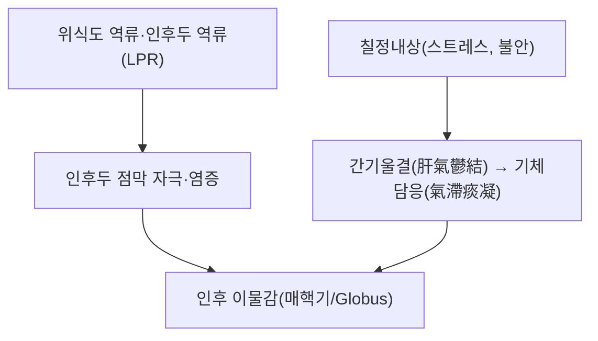

---
aliases:
  - 梅核氣
  - Globus pharyngeus
  - Globus hystericus
  - 매핵기
tags:
  - 질환
  - 기타
  - 인후
---

# 🩺 매핵기 (梅核氣, Globus Pharyngeus)

> **핵심 3줄 요약 (Key Summary)**:
> - 📍 병소 부위 & 병태생리: 인후부에 매실 씨(梅核)가 걸린 듯한 이물감을 호소하지만 실제 기질적 폐쇄 병변은 없는 기능성 증상. 한의학적으로는 칠정(七情)으로 인한 기체담응(氣滯痰凝, 기 정체와 담이 인후에 뭉침)으로 설명되며, 현대의학에서는 위식도 역류질환(GERD)·인후두 역류(LPR)·과민성 인후 감각, 불안·신체화 장애와의 연관성이 주로 논의됨.
> - 🚩 전형적 임상 양상: 삼킬 때보다 삼키지 않을 때(공복 시) 오히려 이물감이 더 심하고, 음식물 섭취 시에는 증상이 완화되는 것이 특징적. 실제 연하곤란·체중감소·통증을 동반하지 않음.
> - 🛠️ 핵심 진단 & 치료: 진단은 기질적 질환(종양, 갑상선 질환, 인후두 역류 등)을 배제하는 것이 우선이며, 양방에서는 PPI(프로톤펌프억제제)·가바펜틴 등이 시도되고, 한의학에서는 반하후박탕(半夏厚朴湯)이 대표 처방으로 활용됨.
> - ⚠️ 레드플래그: 연하곤란·체중감소·통증을 동반한 이물감, 진행성 악화, 고령 환자의 신규 발생 증상은 두경부 종양 등 기질적 질환 감별을 위해 반드시 이비인후과 정밀검사가 필요.

---

## 📌 목차
1. [질환 개요 & 정의](#1-질환-개요--정의)
2. [병태생리 및 연관 병태](#2-병태생리-및-연관-병태)
3. [임상 증상 & 감별진단](#3-임상-증상--감별진단)
4. [치료 전략](#4-치료-전략)
5. [한의학적 연계](#5-한의학적-연계)
6. [출처 및 학술 참고 문헌 (References)](#6-출처-및-학술-참고-문헌-references)

---

## 1. 질환 개요 & 정의

매핵기는 한의학 고전(《금궤요략》)에서 "부인 인중여유자련상(咽中如有炙臠, 목구멍에 구운 고기 조각이 낀 듯하다)"으로 처음 기술된 증상으로, 현대 이비인후과·소화기내과의 "인후 이물감(globus sensation/globus pharyngeus)"에 해당합니다. 실제 인후부에 이물이나 종괴가 없음에도 지속적인 이물감을 호소하는 기능성 증상군입니다.

---

## 2. 병태생리 및 연관 병태

현대의학에서는 위식도 역류질환(GERD)·인후두 역류(LPR)로 인한 인후두 점막 자극, 상부식도 괄약근의 긴장도 이상, 불안·우울 등 정신적 요인에 의한 신체화 증상이 복합적으로 관여하는 것으로 논의됩니다. 한의학적으로는 정지불서(情志不舒)로 간기(肝氣)가 울결되어 진액이 담(痰)으로 응결되고, 이 담기(痰氣)가 인후부에 뭉쳐 발생하는 것으로 설명합니다.

---

## 3. 임상 증상 & 감별진단

* **핵심 증상**: 인후부(목 중앙)에 이물이 걸린 듯한 느낌, 답답함, 삼키고 싶은 충동. 실제 음식물이나 침을 삼키는 동작 자체는 정상적으로 가능.
* **감별점**: 진성 연하곤란(dysphagia)과 달리 고형식·유동식 섭취 시 오히려 증상이 완화되는 경우가 많으며, 공복·긴장 시 악화되는 경향.
* **배제해야 할 기질적 질환**: 갑상선 종대, 두경부 종양, 경추 골극, 인후두 역류로 인한 점막 병변 등.

---

## 4. 치료 전략

* **양방 치료**: 인후두 역류가 의심되는 경우 프로톤펌프억제제(PPI) 시도, 불안 관련 신체화가 의심되는 경우 가바펜틴 등이 활용되나, 무작위대조시험에서 위약 대비 뚜렷한 우위를 보이지 않는 경우도 보고됩니다.
* **한의학적 치료**: [[반하후박탕]](半夏厚朴湯)이 대표 처방으로, 이기해울(理氣解鬱)·화담산결(化痰散結) 목적으로 활용됩니다. 무작위대조시험에서 반하후박탕이 양방 치료와 병용 시 인후 이물감 개선에 효과를 보인 연구가 보고되어 있습니다.

---

## 5. 한의학적 연계

매핵기는 간기울결(肝氣鬱結)·기체담응(氣滯痰凝)으로 변증하며, [[반하후박탕]](반하·후박·복령·생강·자소엽)이 대표 처방입니다. 스트레스·정서적 억울(抑鬱)이 뚜렷한 소인이 되는 경우가 많아, 정신적 안정과 함께 이기화담(理氣化痰) 치법을 병용하는 것이 전통적 접근입니다. 위식도 역류 증상이 동반된 경우 [[위식도 역류질환]] 노트의 치료 원칙과 함께 참고할 수 있습니다.

---

## 6. 출처 및 학술 참고 문헌 (References)

1. **Effects of Ban-Xia-Hou-Pu-Tang and Western medicine on patients with globus sensation: A randomized controlled trial**. *Journal of the Chinese Medical Association*. [https://www.ovid.com/jnls/jcma/fulltext/10.1097/jcma.0000000000001237~effects-of-ban-xia-hou-pu-tang-and-western-medicine-on](https://www.ovid.com/jnls/jcma/fulltext/10.1097/jcma.0000000000001237~effects-of-ban-xia-hou-pu-tang-and-western-medicine-on)
   - **[연구 요약]**: 반하후박탕과 양방 치료를 병용한 인후 이물감(globus) 환자 대상 무작위대조시험.
2. **Globus Pharyngeus: Effectiveness of Treatment with Proton Pump Inhibitors and Gabapentin**. [https://www.researchgate.net/publication/256538606_Globus_Pharyngeus_Effectiveness_of_Treatment_with_Proton_Pump_Inhibitors_and_Gabapentin](https://www.researchgate.net/publication/256538606_Globus_Pharyngeus_Effectiveness_of_Treatment_with_Proton_Pump_Inhibitors_and_Gabapentin)
   - **[연구 요약]**: 인후 이물감에 대한 PPI·가바펜틴 치료 효과를 평가한 연구.
