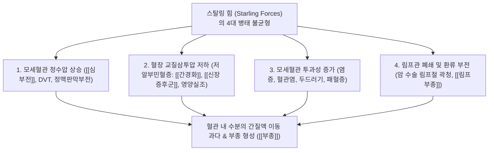

# 🩺 [[부종]] (Edema / 水腫, R60)

> **핵심 3줄 요약 (Key Summary)**:
> - 📍 병소 부위 & 해부·병태생리: 간질액(Interstitial fluid)의 비정상적 과다 축적, 스탈링 법칙(Starling forces) 불균형(모세혈관 정수압 상승, 혈장 교질삼투압 저하, 모세혈관 투과성 증가, 림프관 환류 장애).
> - 🚩 전형적 임상 양상 & 3대 징후: 함요부종(Pitting edema), 안면 안검 부종, 양측 하지 종창, 급격한 체중 증가, 전신 중압감 및 야간 뇨량 변화.
> - 🛠️ 핵심 감별 검사 & 한·양방 다각적 치료 전략: 심·간·신 기능 검사(BNP, Albumin, Cr, eGFR, 뇨단백), 복부/하지 혈관 초음파, 부종 유발 약물 스크리닝, [[오령산]], [[방기황기탕]], [[분심기음]] 및 이뇨 소종 프로토콜.
> - ⚠️ 응급 의뢰 레드플래그 & 악화 요인: 급성 편측 하지 부종과 장딴지 압통([[심부정맥 혈전증]] DVT), 호흡곤란 및 기좌호흡([[급성 폐부종]]), 단백뇨 동반 급격한 신기능 악화 시 즉시 응급실 전원.

---

## 📌 목차
1. [질환 개요 & 해부학적 병태생리](#1-질환-개요--해부학적-병태생리)
2. [병태생리 메커니즘 & 스탈링 힘(Starling Forces) 네트워크](#2-병태생리-메커니즘--스탈링-힘starling-forces-네트워크)
3. [임상 증상 & 이학적 검사(Physical Exam) 알고리즘](#3-임상-증상--이학적-검사physical-exam-알고리즘)
4. [감별 진단 매트릭스 (Differential Diagnosis)](#4-감별-진단-매트릭스-differential-diagnosis)
5. [한의 통합 치료 프로토콜 (침·약침·한약)](#5-한의-통합-치료-프로토콜-침약침한약)
6. [식이 요법 & 생활습관 티칭 가이드](#6-식이-요법--생활습관-티칭-가이드)
7. [💡 사용자 진료실 핵심 필기 & 임상 노하우 (Melt-In 잔여 심화 집약)](#7--사용자-진료실-핵심-필기--임상-노하우-melt-in-잔여-심화-집약)
8. [출처 및 학술 참고 문헌 (References)](#8-출처-및-학술-참고-문헌-references)

---

## 1. 질환 개요 & 해부학적 병태생리

![[청강의감23_08_림프부종_하지1.jpg|450]]
> [그림 1: 모세혈관 동맥단과 정맥단에서의 스탈링 힘(Starling forces) 평형 도해. 정수압(Hydrostatic pressure)과 교질삼투압(Oncotic pressure)의 압력차에 의한 수분 여과 및 재흡수 메커니즘]

* **질환 정의 및 개요**:
  * 부종(Edema, 水腫)은 세포외액 중 혈관 외부 간질 조직(Interstitial space)에 체액이 비정상적으로 과다 축적되어 피부와 피하조직이 팽윤된 임상 상태이다.
  * 신체 전신에 광범위하게 나타나는 전신 부종(Generalized edema)과 특정 사지, 국소 맥관이나 림프 분절에 국한되는 국소 부종(Localized edema)으로 대별된다.
  * 임상적으로 울혈성 [[심부전]], [[만성 사구체 신염]], [[급성 사구체 신염]], [[신장 증후군]](신증후군), [[간경화]](간경변증), 내분비 장애 및 약물 부작용에 의해 다발한다.
* **관련 해부학적 구조물**:
  * **맥관 구조**: 모세혈관망(동맥단 내피세포, 정맥단 모세혈관), 심부정맥계, 표재정맥계(대복재정맥, 소복재정맥), 림프관 및 국소 림프절.
  * **표적 조직**: 진피 및 피하 지방층 간질, 안와 주위 소성 결합조직, 폐포 간질, 복강(복수), 흉강(흉수).

---

## 2. 병태생리 메커니즘 & 스탈링 힘(Starling Forces) 네트워크

![[청강의감23_04_신장성부종_안면부종.png|450]]
> [그림 2: 신증후군(Nephrotic syndrome) 환자에서 관찰되는 전형적인 안와 주위 부종(Periorbital edema)과 하지의 심한 함요부종(Pitting edema) 임상 소견]

### 1) 부종 발생의 4대 물리화학적 메커니즘
* **모세혈관 정수압(Capillary Hydrostatic Pressure) 증가**:
  * 심장 펌프 기능 저하([[심부전]]), 정맥 혈전([[심부정맥 혈전증]]), 알도스테론증, 구획증후군, 복부 종양의 하대정맥 압박 등으로 정맥압이 상승하여 혈관 밖으로 체액을 밀어내는 힘이 과도해짐.
* **혈장 교질삼투압(Plasma Oncotic Pressure) 감소**:
  * 혈장 단백질(주로 알부민) 농도가 2.5 g/dL 이하로 떨어질 때 발생함.
  * 알부민 합성 저하([[간경화]], 중증 영양실조, 흡수장애 증후군) 또는 알부민 요중 대량 소실([[신장 증후군]], 단백소실성 장증, 전자간증)이 핵심 원인임.
* **모세혈관 투과성(Capillary Permeability) 증가**:
  * 히스타민, 브라디키닌, 사이토카인 방출로 내피세포 간극이 벌어져 혈관 내 단백질과 수분이 간질로 누출됨 (두드러기, 혈관염, 봉와직염, 약물 과민반응).
* **림프계 배액 장애(Lymphatic Obstruction)**:
  * 림프절 절제술, 악성 종양 침윤, 방사선 치료 후 단백질이 풍부한 림프액이 고여 단단한 비함요부종(Non-pitting edema)을 형성함.

### 2) 약물 유발성 부종 (Drug-Induced Edema)
* 임상에서 흔히 간과되는 부종 원인으로, 약물 복용력 조사가 필수적이다.
* **칼슘통로차단제(CCB)**: 세동맥을 선택적으로 확장시켜 모세혈관 전 세동맥압을 높임으로써 하지 부종 유발 (예: 암로디핀, 펠로디핀).
* **소염진통제(NSAIDs)**: 신장 프로스타글란딘 합성을 억제하여 신혈류량을 줄이고 나트륨 및 수분 저류 촉진.
* **항우울제**: 모노아민 산화효소 억제제(MAOI), 삼환계 항우울제(TCA).
* **호르몬 제제**: 코르티코스테로이드, 에스트로겐, 프로게스테론, 테스토스테론.

---

## 3. 임상 증상 & 이학적 검사(Physical Exam) 알고리즘

![[부종-20240816051837700.png|450]]
> [그림 3: 임상에서 부종을 흔히 유발하는 주요 약물군 분류표 (항우울제, 항고혈압제, 호르몬제, NSAIDs, 면역억제제 등)]

### 1) 주요 임상 증상 및 발현 패턴
* **신장성 부종 (Renal Edema)**:
  * 아침 기상 시 눈꺼풀과 얼굴(안면 안검부)이 먼저 붓고, 오후가 되면서 전신이나 다리로 퍼짐. 소변 거품(단백뇨), 핍뇨 동반.
* **심장성 부종 (Cardiac Edema)**:
  * 중력의 영향을 받아 낮에 오래 서 있거나 활동한 후 저녁에 양측 발목과 정강이에 심해짐. 야간 호흡곤란, 경정맥 확장 동반.
* **간성 부종 (Hepatic Edema)**:
  * 문맥압 항진 및 알부민 합성 결핍으로 복수(Ascites)가 먼저 나타난 후 하지 부종이 뒤따름. 황달, 거미상 혈관종 동반.
* **림프부종 및 국소 정맥부종**:
  * 주로 한쪽 사지(편측성)에 발생하며, 초기에는 눌리는 함요를 보이다가 점차 피부가 두꺼워지는 비함요성 오렌지 껍질 모양(Peau d'orange)으로 변화.

### 2) 필수 이학적 검사법
* **함요부종 검사 (Pitting Edema Grading)**:
  * 경골 내과(Medial malleolus) 상방 2~3cm 전면 골면을 엄지손가락으로 5초간 지그시 압박 후 손을 떼어 함몰 깊이와 회복 시간 측정.
  * **1+**: 즉시 복원되는 2mm 함몰.
  * **2+**: 15초 이내 복원되는 4mm 함몰.
  * **3+**: 1분 이내 복원되는 6mm 함몰.
  * **4+**: 2~5분 이상 지속되는 깊은 8mm 함몰.
* **하지 둘레 측정 (Stemmer's sign)**:
  * 제2족지 기저부 피부를 집어 올릴 수 없으면 림프부종 강력 시사(Stemmer 징후 양성).
* **호만 징후(Homans sign)**: 족관절 급격 수동 배굴 시 장딴지 통증([[심부정맥 혈전증]] 감별).

---

## 4. 감별 진단 매트릭스 (Differential Diagnosis)

| 감별 질환 | 호발 부위 및 대칭성 | 핵심 병태생리 | 주요 동반 증상 | 진단 확진 검사 |
| :--- | :--- | :--- | :--- | :--- |
| [[울혈성 심부전]] | 양측 하지 (저녁 악화), 전신 | 중심정맥압 상승, 정수압 증가 | 호흡곤란, 기좌호흡, 경정맥 분노 | BNP/NT-proBNP 상승, 심초음파 |
| [[신장 증후군]] / 신염 | 양측 안면 안검 (아침 호발), 전신 | 사구체 손상, 교질삼투압 저하 | 거품뇨, 핍뇨, 고지혈증 | 24시간 뇨단백 >3.5g, 혈청 알부민 저하 |
| [[간경화]] (간경변) | 복수(복부) 선행 후 양측 하지 | 알부민 합성 결손, 문맥압 상승 | 황달, 여성형 유방, 비장 비대 | 복부 초음파/CT, 혈청 알부민 저하 |
| [[약물 유발성 부종]] | 양측 발목 및 하지 말단 | 세동맥 확장, 신 수분 저류 | 투약 개시 후 발생, 기저질환 없음 | 약물 중단 후 가역적 소퇴 |
| [[심부정맥 혈전증]] (DVT) | 편측 하지 급성 부종 | 심부정맥 혈전성 폐쇄 | 장딴지 열감, 압통, 발적 | D-dimer, 하지 혈관 도플러 초음파 |
| [[림프부종]] | 편측 또는 비대칭 사지 | 림프관 형성부전, 수술 림프 절제 | 비함요성 경화, 발가락 피부 비후 | 림프 신티그라피, Stemmer sign (+) |

---

## 5. 한의 통합 치료 프로토콜 (침·약침·한약)

* **침구 치료 (Acupuncture)**:
  * **비위·수도 조절 경혈**: 수분(CV9, 이수소종의 핵심), 수도(ST28), 기해(CV6), 음릉천(SP9), 삼음교(SP6), 족삼리(ST36).
  * **폐·신 기능 선통 경혈**: 열결(LU7), 신유(BL23), 방광유(BL28), 비유(BL20).
  * **치료 기법**: 수분, 음릉천, 삼음교에 사법(瀉法) 또는 온침 요법을 적용하여 삼초(三焦)의 기화 작용을 촉진하고 정체된 수습(水濕) 배출.
* **약침 치료 (Pharmacopuncture)**:
  * 황련해독탕 약침 또는 중성어혈 약침을 음릉천, 삼음교, 신유혈 주위에 0.1~0.2cc 분주하여 국소 정맥 순환 개선 및 무균성 간질 울혈 해소.
* **한약 치료 (Herbal Medicine)**:
  * **풍수형(양수: 안면 안검 급성 부종, 상체 호발, 오한 발열)**: [[월비가출탕]](越婢加朮湯), 마황연교적소두탕 (선폐발한, 이수소종).
  * **습곤비위형(음수: 사지 곤권, 소화불량, 신중 부종)**: [[위령탕]](胃苓湯), 실비음(實脾飲) (온중건비, 행기이수).
  * **기허·신양허형(하지 부종, 지랭, 만성 허약, 노인성 부종)**: [[방기황기탕]](防己黃耆湯), 진무탕(眞武湯), 팔미지황환.
  * **기체·기울형(스트레스성 부종, 손발이 붓고 가슴 답답함)**: [[분심기음]](分心氣飲), 향사육군자탕 가감.

---

## 6. 식이 요법 & 생활습관 티칭 가이드

* **저염 식이 원칙 (나트륨 제한)**:
  * 하루 나트륨 섭취량을 2g(소금 5g) 이하로 철저히 제한.
  * 찌개류 국물, 젓갈, 라면, 가공식품, 훈제 육류 섭취 엄금.
* **칼륨 풍부 식품 섭취 (단, 신부전 환자 주의)**:
  * 신장 기능이 정상인 일반 부종 환자는 칼륨이 풍부한 미역·다시마 등 해조류, 바나나, 토마토, 시금치 섭취를 통해 나트륨 배출 유도.
  * 단, [[만성 신부전]] 환자는 고칼륨혈증 부정맥 위험이 있으므로 칼륨 과다 섭취 금기.
* **하지 거상 및 의료용 압박스타킹**:
  * 취침 시 발목 아래에 베개를 받쳐 심장보다 15~20cm 높게 유지.
  * 정맥 부전 환자는 낮 시간 동안 20~30 mmHg 압력의 의료용 압박스타킹 착용.

---

## 7. 💡 사용자 진료실 핵심 필기 & 임상 노하우 (Melt-In 잔여 심화 집약)

> [!IMPORTANT]
> **🛡️ 원문 융합(Melt-In) 및 7번 섹션 작성 불변 규칙 (CRITICAL)**
> 1. **기존 필기 내용 상부 전면 융합 (Melt-In)**: 간질액 축적, 정수압/교질삼투압/투과성 기전, 사구체신염·심부전·신증후군 원인, 부종 유발 약물표, 저염식 및 칼륨 식이 티칭을 상부 전 섹션에 완전 융합 완료.
> 2. **7번 섹션의 차별화된 심화 집약**: "온몸이 부어요" 하고 내원한 환자의 진료실 3단계 진단 감별 알고리즘, 혈압약(CCB) 복용 환자의 처방 연쇄 차단법, 실전 수분혈·음릉천 자침 팁을 집약함.

* **상부 섹션에 미처 다 담지 못한 고유 원문 필기**:
  * 부종 환자는 단순히 "물을 빼주는 이뇨제나 옥수수수염차"를 쓸 것이 아니라, 정수압이 문제인지(심장·정맥), 교질삼투압이 문제인지(간·신장), 혈관 투과성이나 약물이 문제인지 물리화학적 원인을 먼저 분리해야 치료 방향이 결정된다.
* **진료실 실전 감별 & 치료 노하우**:
  * 1. **진료실 3단계 부종 감별 체크리스트**:
     * 1단계 (편측 vs 양측): 편측이면 DVT나 림프부종/봉와직염 같은 국소 맥관 질환, 양측이면 심장·간·신장·약물 같은 전신 질환.
     * 2단계 (부종 호발 시간대): 아침에 얼굴/눈꺼풀이 부으면 신장성 질환, 저녁에 다리/발목이 부으면 심장성 질환 또는 정맥기능부전.
     * 3단계 (약물 복용력 확인): 최근 1~3개월 내 고혈압약(암로디핀 등 CCB)이나 진통소염제(NSAIDs)를 새로 처방받았는지 반드시 확인.
  * 2. **혈압약 복용 노인 환자의 처방 연쇄(Prescribing Cascade) 차단 노하우**:
     * CCB 복용 후 다리가 붓는 환자에게 양방에서 이뇨제를 추가하여 저혈압, 어지럼증, 신손상이 발생하는 악순환이 흔함.
     * 혈압약에 의한 혈관 확장성 부종은 이뇨제에 반응하지 않으므로, 내과의와 상의하여 ARB나 ACEi 제제로의 계열 변경을 권고하고 한의 치료로는 [[방기황기탕]]으로 하지 미세순환을 보조해야 함.
  * 3. **손맛 노하우 (수분혈과 음릉천 배혈 요령)**:
     * 배꼽 위 1촌 수분(CV9)혈에 침을 놓고 뜸을 3장 올려 복강 내 림프관 흐름을 자극하고, 비경의 합혈인 음릉천(SP9)에 강자극 사법을 병용하면 24시간 내 소변 배출량이 눈에 띄게 늘어나면서 부종이 가라앉음.

---

## 8. 출처 및 학술 참고 문헌 (References)

1. **Peripheral Edema: Evaluation and Management in Primary Care.** *Am Fam Physician*, 2022.
   - [연구 요약]: https://pubmed.ncbi.nlm.nih.gov/36379502/
   - 일차 진료 환경에서 양측성 및 편측성 말초 부종의 병태생리적 스탈링 힘 분류, 심부전·신부전·정맥부전의 단계별 진단 알고리즘 및 근거 중심 관리 전략을 제시함.
2. **Drug-induced peripheral edema: a common, overlooked, reversible harm.** *Cleve Clin J Med*, 2024.
   - [연구 요약]: https://pubmed.ncbi.nlm.nih.gov/42507802/
   - 칼슘통로차단제(CCB), NSAIDs, 항우울제 등 다빈도 처방 약제에 의한 말초 부종의 임상적 기전, 약물 중단 시 가역적 호전 및 오진으로 인한 이뇨제 처방 연쇄(Prescribing cascade) 방지 전략을 규명함.
3. **Peripheral Edema in Advanced Cancer: Mechanisms and Management-A Scoping Review.** *J Palliat Med*, 2026.
   - [연구 요약]: https://pubmed.ncbi.nlm.nih.gov/42010910/
   - 모세혈관 정수압 상승, 저알부민혈증에 따른 교질삼투압 저하, 림프 배액 장애 등 복합 병태생리에 기인한 말초 부종의 다각적 관리 및 보존적 중재 방안을 분석함.