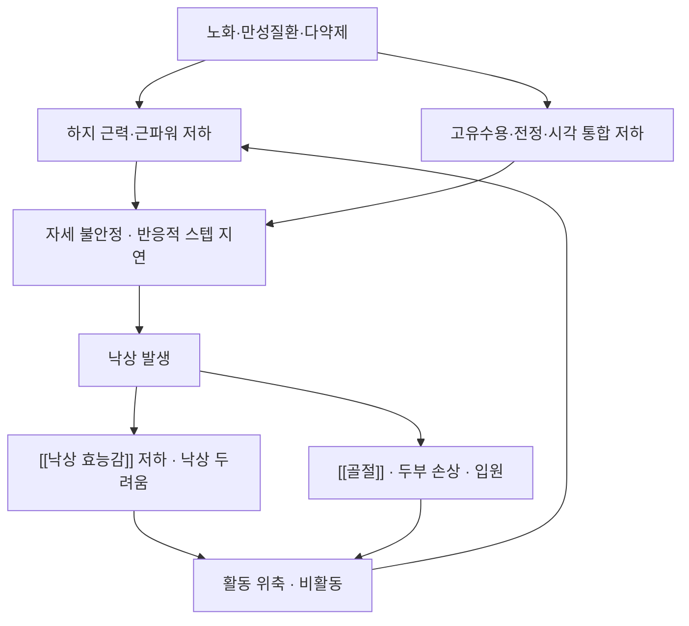

# 🩺 노인의 낙상 (Falls in Older Adults)

> **핵심 3줄 요약 (Key Summary)**:
> - 📍 병소 부위 & 병태생리: 단일 장기 질환이 아니라 **하지 근력·근파워 저하 + 자세 조절·감각 통합 기능 저하 + 낙상 두려움에 따른 활동 위축**이 겹쳐 발생하는 노인 증후군. 병소는 [[대퇴사두근]]·[[둔근]]·발목·전정·고유수용계.
> - 🚩 전형적 임상 양상 & 3대 징후: 같은 높이에서의 반복 낙상, 보행 불안정, [[TUG 검사]] 지연·한발서기 시간 단축, "넘어질까 봐 무섭다"는 [[낙상 효능감]] 저하.
> - 🛠️ 핵심 감별 검사 & 한·양방 치료 전략: 낙상력·약물·시력·발·보행 평가, [[TUG 검사]]·[[5회 의자 일어서기 검사]]·한발서기, 낙상 원인 감별(실신·[[뇌졸중]]·파킨슨·척수증). 치료는 **다성분 근력·평형 운동이 핵심**([[오타고 운동 프로그램]]·[[FaME]])이고, 한의는 변증별 보익 처방·침·추나를 병행한다.
> - ⚠️ 응급 의뢰 레드플래그: 두부 외상 후 의식 변화·항응고제 복용 환자의 두부 낙상, 낙상으로 인한 고관절 통증·하지 단축·체중부하 불가([[골절]] 의심), 실신·흉통·부정맥 동반, 갑작스러운 신경학적 결손은 즉시 응급 평가.

---

## 📌 목차
1. [질환 개요 & 병태생리](#1-질환-개요--병태생리)
2. [병태생리 메커니즘 & 생체역학적 악순환 네트워크](#2-병태생리-메커니즘--생체역학적-악순환-네트워크)
3. [임상 증상 & 이학적 검사(Physical Exam) 알고리즘](#3-임상-증상--이학적-검사physical-exam-알고리즘)
4. [감별 진단 매트릭스 (Differential Diagnosis)](#4-감별-진단-매트릭스-differential-diagnosis)
5. [한의 통합 치료 프로토콜 (침·약침·추나·한약)](#5-한의-통합-치료-프로토콜-침약침추나한약)
6. [양방 치료 & 병용·의뢰 기준 (Conventional Treatment & Referral)](#6-양방-치료--병용의뢰-기준-conventional-treatment--referral)
7. [재활 운동 & 생활습관 티칭 가이드](#7-재활-운동--생활습관-티칭-가이드)
8. [💡 사용자 진료실 핵심 필기 & 임상 노하우](#8--사용자-진료실-핵심-필기--임상-노하우)
9. [출처 및 학술 참고 문헌 (References)](#9-출처-및-학술-참고-문헌-references)

---

## 1. 질환 개요 & 병태생리

* **정의 및 역학**:
  * 낙상은 **본인의 의지와 무관하게 같은 높이에서 넘어지거나 미끄러지는 사건**이다. 지역사회 거주 65세 이상 노인의 약 3분의 1이 연 1회 이상 낙상을 경험하고, 한 번 낙상한 사람은 재낙상 위험이 크게 높아진다.
  * 낙상은 [[골절]]·두부 손상·요양시설 입소·사망의 주요 원인이지만, **단일 질환이 아니라 여러 위험요인이 겹친 노인 증후군**으로 접근해야 예방이 된다.
* **관련 구조·계통**:
  * **하지 근력·근파워**: [[대퇴사두근]]·[[둔근]]·[[가자미근]] — 기립·계단·반응적 스텝의 동력.
  * **자세 조절계**: [[고유수용감각]]·[[근방추]]·전정계·시각계의 통합.
  * **동반질환**: [[근감소증]]·[[허약]]·[[골다공증]]·[[파킨슨병]]·[[뇌졸중]]·[[당뇨병성 말초신경병증]].

---

## 2. 병태생리 메커니즘 & 생체역학적 악순환 네트워크

* **내적 요인**: 근력·평형 저하, 감각 저하, 인지 저하, 기립성 저혈압, 시력 저하, 약물(진정제·항고혈압제·항콜린제)
* **외적 요인**: 조명·계단·융단·문턱 등 환경, 부적합한 신발·보행 보조기
* **핵심 악순환**: 낙상 → 두려움 → 활동 위축 → 근력·평형 추가 저하 → 재낙상. **두려움을 다루지 않으면 운동 효과도 반감된다** → [[낙상 효능감]]

---

## 3. 임상 증상 & 이학적 검사(Physical Exam) 알고리즘

### 1) 주소증
* "요즘 자꾸 발이 걸린다", "어지럽고 균형이 안 잡힌다", "넘어질까 봐 혼자 못 걷겠다", "의자에서 일어날 때 휘청한다".
* 낙상 자체를 숨기는 경우가 많다 — **"최근에 넘어진 적 있나요?"를 먼저 묻는다**.

### 2) 핵심 평가 세트 (진료실에서 즉시 시행)
| 검사 | 목적 | 참고 기준 |
| :--- | :--- | :--- |
| [[TUG 검사]] | 기동성·동적 균형 | 12초 이상 지연 시 위험 |
| [[5회 의자 일어서기 검사]] | 하지 근력·기능 | ≥12초 기능 저하 → [[AWGS 기준]] |
| 한발서기 | 정적 균형 | 5초 미만 시 위험 |
| [[악력]] | 전신 근력 | 남 <28 kg·여 <18 kg |
| [[낙상 효능감]] | 낙상 두려움 | Short FES-I 14점 이상 높은 우려 |

### 3) 약물·환경 점검
* 진정제([[벤조디아제핀]]·[[졸피뎀]]), 항고혈압제, 항콜린제, 혈당강하제(야간 [[저혈당]])를 검토한다
* 시력·발(발톱·변형)·신발·조명·문턱·미끄럼을 확인한다

---

## 4. 감별 진단 매트릭스 (Differential Diagnosis)

| 감별 질환 | 특징적 양상 | 감별 포인트 |
| :--- | :--- | :--- |
| 노인의 낙상 (본 질환) | 같은 높이에서 반복 낙상, 전구증상 없음 | 근력·평형·약물·환경 위험요인 확인 |
| 실신 | 전구 증상 후 의식 소실 | 심장(부정맥·대동맥 협착)·기립성 저혈압 평가 |
| [[뇌졸중]]·TIA | 편측 마비·언어장애·보행 이상 | 급성 신경학적 결손 → 응급 |
| [[파킨슨병]] | 서동·경직·보행 동결 | 도파민성 치료 반응, 보행 분석 |
| 경추 척수증 | 손 저림·보행 장애 | 경부 통증·상지 신경학적 징후 |
| [[이석증]] | 체위 변화 시 회전성 어지럼 | Dix-Hallpike 등 이학적 검사 |

> 🚩 **레드플래그 감별**: 두부 외상 후 항응고제 복용 환자는 지연성 두개내 출혈 위험이 커 **영상 검사 우선**이다.

---

## 5. 한의 통합 치료 프로토콜 (침·약침·추나·한약)

* **변증 분류**: [[비신허증]](소화력 저하·야간뇨·요슬산연·오한), 기혈양허, 간신부족, 담음어혈(어지럼 동반 시)로 나눈다.
* **침구 치료 (Acupuncture)**:
  * 하지 근력·평형 목적으로 족삼리(ST36)·양릉천(GB34)·삼음교(SP6)·태계(KI3)·현종(GB39) 등을 변증에 맞춰 배혈한다(교과서 범위 응용).
  * 어지럼·불면 동반 시 백회(GV20)·풍지(GB20)·신문(HT7) 병용.
* **약침·뜸**: 신수(BL23)·관원(CV4)·족삼리(ST36)에 온보(溫補) 목적으로 적용. 혈위는 순수 텍스트로 표기한다.
* **한약**: 기허·비신허증에는 [[보중익기탕]]·[[십전대보탕]]·[[우차신기환]] 계열, 어지럼에는 [[반하백출천마탕]] 계열(교과서 범위).
* **추나**: 관절가동성·근막 이완은 유효하나, **[[골다공증]] 동반 시 강한 고속저진폭(HVLA) 스러스트는 늑골·척추 골절 위험으로 금기**다.

---

## 6. 양방 치료 & 병용·의뢰 기준 (Conventional Treatment & Referral)

> 🎯 **이 섹션의 목적**: 환자가 여러 양방약을 복용 중인 경우가 많다 — 한의원 1차 진료에서 병용·감량·의뢰를 판단한다.

* **약물 치료 (Medication)**:
  * **낙상 유발 가능 약물 검토가 최우선** — [[벤조디아제핀]]·Z-드러그([[졸피뎀]]), 항콜린제, 항정신병약, 다량의 항고혈압제, 야간 저혈당 유발 혈당강하제.
  * [[비타민 D]] 결핍 교정, [[골다공증]] 약물 치료 여부 확인.
* **비약물 치료**: 다성분 근력·평형 운동 프로그램이 핵심([[오타고 운동 프로그램]]·[[FaME]]), 보행 보조기·주거 환경 개선.
* **한의 병용 판단**: 한약·침은 운동을 대체하지 않는다. 진정 계열 양약 복용자는 감량 시점을 처방의와 상의한다.
* **의뢰 기준**: 실신·부정맥 의심(순환기), 급성 신경학적 결손(신경과), 원인 불명 반복 낙상·어지럼(이비인후·신경과), 고관절 골절 의심(정형외과 응급).

---

## 7. 재활 운동 & 생활습관 티칭 가이드

* **운동 처방(핵심)**: [[오타고 운동 프로그램]] — 근력·평형 17종 + 걷기, 회당 약 30분·주 3회(격일), 걷기 주 2회 최대 30분, 8주마다 발목 모래주머니 1 kg 증량. FaME 구성요소(반응적 스텝·바닥에서 일어나기·이중과제)를 발췌해 보강한다 → [[FaME]]
* **총량 원칙**: 총 운동량과 낙상 결과는 **역U자 관계**, 최적 약 **420 MET·min/week**(30분 × 주 3회 ≈ 405). 처음 8~12주는 주 3회 30분에 집중한다 → [[대사당량(MET)]]
* **단독 요법 금지**: [[평형훈련]] 단독은 순위 최하위(SUCRA 0.58%) — 근력과 반드시 병용한다 → [[네트워크 메타분석]]
* **생활습관**: 조명·문턱·욕실 미끄럼 방지, 잘 맞는 신발, 야간 조명·보행 보조기, 복용 약물 정리.
* **환자 교육 스크립트**: "넘어지는 걸 막는 건 약이 아니라 다리 힘과 균형입니다. 일주일에 세 번, 30분씩, 6개월만 해보십시오."
* **정기 추적 항목**: [[TUG 검사]]·[[5회 의자 일어서기 검사]]·한발서기·[[낙상 효능감]]을 12·24주 간격으로 재측정.

---

## 8. 💡 사용자 진료실 핵심 필기 & 임상 노하우

* **운동은 '권고'가 아니라 '프로토콜'로**: 1년 내 낙상력·보행 불안정·의자 일어서기 지연·낙상 두려움 중 하나라도 있으면, OEP 17개 운동을 그림으로 인쇄해 주고 주 3회 30분·격일 원칙을 명시한다
* **두려움을 먼저 다룬다**: [[낙상 효능감]]이 낮으면 총량을 늘리기 전에 **바닥에서 일어나기 훈련**부터 가르친다 — 실제로 넘어졌을 때 일어날 수 있다는 자신감이 활동 회복의 관문이다
* **약물 검토가 절반**: 진정제·항콜린제 복용력을 확인하고 감량을 상담한다. 한약·침을 병행하며 서서히 줄이는 것이 반동성 불면 없이 가능하다 → [[벤조디아제핀]]
* **골다공증 확인을 빼먹지 않는다**: 낙상 예방 운동과 함께 골다공증 약물 치료 여부를 반드시 확인한다 → [[골다공증]]

---

## 9. 출처 및 학술 참고 문헌 (References)

1. **Ageing Research Reviews (2026)**. *Optimal type and dose of exercise to improve fall behavior in older adults: A systematic evaluation and network meta-analysis*. **Ageing Res Rev**, 113:102924. [PMID 41110662](https://pubmed.ncbi.nlm.nih.gov/41110662/)
   - **[연구 요약]**: RCT 21편·3,387명 NMA — FaME(SUCRA 68.56%)·OEP(57.58%) 등 다성분 프로그램이 평형훈련 단독(0.58%)보다 우월, 최적 총량 약 420 MET·min/week.
2. **Campbell AJ, et al. (1997)**. *Randomised controlled trial of a general practice programme of home based exercise to prevent falls in elderly women*. **BMJ**, 315(7115):1065-1069. [PMID 9366737](https://pubmed.ncbi.nlm.nih.gov/9366737/)
   - **[연구 요약]**: 오타고 운동 프로그램의 원 시험 — 1년 낙상 위험 약 35% 감소, 고위험군에서 이득 최대.
3. **Yardley L, et al. (2005)**. *Development and initial validation of the Falls Efficacy Scale-International (FES-I)*. **Age Ageing**, 34(6):614-619. [PMID 16267188](https://pubmed.ncbi.nlm.nih.gov/16267188/)
   - **[연구 요약]**: 낙상 두려움·자기효능감을 정량화하는 표준 도구(FES-I)의 개발·검증.
4. **Chen LK, Woo J, Assantachai P, et al. (2020)**. *Asian Working Group for Sarcopenia: 2019 Consensus Update*. **J Am Med Dir Assoc**, 21(3):300-307. [PMID 32033882](https://pubmed.ncbi.nlm.nih.gov/32033882/)
   - **[연구 요약]**: 악력·신체기능 컷오프 — 낙상 위험 선별의 객관적 지표.

---

## 관련 노트

- [[근감소증]] · [[허약]] · [[골다공증]] · [[골절]] · [[낙상 효능감]] · [[오타고 운동 프로그램]] · [[FaME]] · [[평형훈련]] · [[수중운동]] · [[태극권]] · [[대사당량(MET)]] · [[TUG 검사]] · [[5회 의자 일어서기 검사]] · [[악력]] · [[비신허증]] · [[벤조디아제핀]] · [[불면증]] · [[당뇨병성 근감소증]] · [[2026-10-03_대사노인질환_심층리뷰]]
