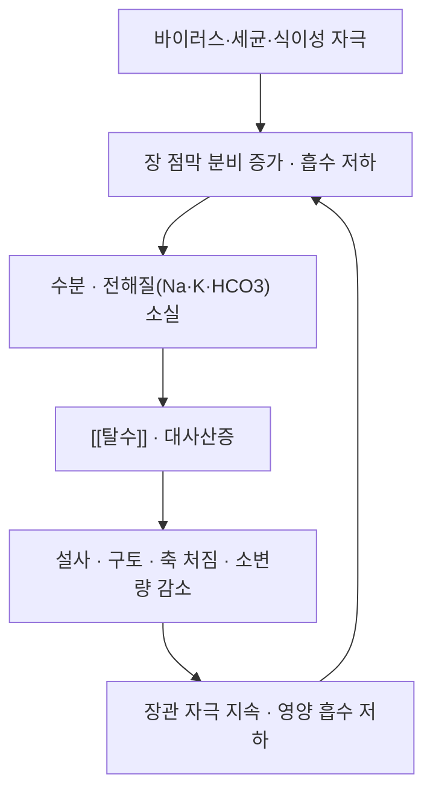

# 🩺 소아 설사 (Pediatric Diarrhea, 小兒泄瀉)

> **핵심 3줄 요약 (Key Summary)**:
> - 📍 병소 부위 & 해부·병태생리: 장 점막의 분비-흡수 균형 붕괴(분비성·삼투성·염증성)로 수분·전해질이 과잉 소실된다. 원인은 바이러스성(로타·노로)이 다수이고 세균·기생충·식이성이 뒤를 잇는다.
> - 🚩 전형적 임상 양상: 무른 변·배변 횟수 증가, 구토·발열 동반. **탈수 정도가 중증도를 결정**한다(눈물 없음·구강 건조·피부 긴장도 저하·소변량 감소·축 처짐).
> - 🛠️ 핵심 검사 & 치료 전략: 1차 치료는 **경구수액요법(ORS)** 과 아연 보충이며, 한의 [[소아추나]]·한약은 표준요법에 더하는 보조다.
> - ⚠️ 응급 의뢰 레드플래그: 중증 탈수·의식장애·경련·쇼크, 혈변·고열(≥38.5°C)·담즙성/지속 구토, 3개월 미만 영아의 설사는 즉시 소아과 이송.

---

## 📌 목차
1. [질환 개요 & 해부학적 병태생리](#1-질환-개요--해부학적-병태생리)
2. [병태생리 메커니즘 & 악순환 네트워크](#2-병태생리-메커니즘--악순환-네트워크)
3. [임상 증상 & 평가 알고리즘](#3-임상-증상--평가-알고리즘)
4. [감별 진단 매트릭스 (Differential Diagnosis)](#4-감별-진단-매트릭스-differential-diagnosis)
5. [한의 통합 치료 프로토콜 (침·약침·추나·한약)](#5-한의-통합-치료-프로토콜-침약침추나한약)
6. [양방 치료 & 병용·의뢰 기준 (Conventional Treatment & Referral)](#6-양방-치료--병용의뢰-기준-conventional-treatment--referral)
7. [재활·생활습관 & 자가관리 티칭 가이드](#7-재활생활습관--자가관리-티칭-가이드)
8. [💡 진료실 핵심 필기 & 임상 노하우](#8--진료실-핵심-필기--임상-노하우)
9. [출처 및 학술 참고 문헌 (References)](#9-출처-및-학술-참고-문헌-references)

---

## 1. 질환 개요 & 해부학적 병태생리

![[소아설사_01_경구수액요법_ORS포장.jpg|400]]
> [그림 1: 경구수액요법(ORS) 포장 실사 — 소아 설사 치료의 1차 표준 (UNICEF 경구수액염 포장, Wikimedia Commons, CC BY-SA 4.0)]

* **질환 정의 및 분류**:
  * 소아 급성 설사는 **발병 72시간 이내, 1일 배변 ≥3회의 무른 변**으로 정의한다. 급성(<7일)과 지속성(7~14일), 만성(>14일)으로 나눈다.
  * 급성 설사는 5세 미만 소아의 주요 이환·사망 원인이다. 표준요법(저삼투압 ORS·아연)조차 실제 섭취율이 낮을 만큼 순응도가 문제다.
  * **원인**: 바이러스성(로타바이러스·노로바이러스)이 다수, 세균성(장독소성 대장균·캄필로박터·살모넬라), 기생충성, 식이성·항생제 연관성.
  * **변증 연계**: 한의에서는 傷寒·濕熱·脾虛·食積 등으로 변증한다.
* **관련 해부학적 구조물**:
  * **장 점막·신경**: [[장신경계]]·[[미주신경]]·[[교감신경]]이 연동·분비를 조율한다.
  * **조절 호르몬**: [[모틸린]]·[[가스트린]]이 위장관 운동·분비에 관여한다.

---

## 2. 병태생리 메커니즘 & 악순환 네트워크

### 1) 분자·세포 수준 기전
* **분비성 설사**: 장독소(콜레라 독소 등)가 cAMP·CFTR 경로를 활성화해 수분·전해질 분비를 증가시킨다 → [[cAMP]]
* **삼투성 설사**: 흡수되지 않는 용질(유당 등)이 장내 삼투압을 높여 수분을 끌어들인다.
* **염증성 설사**: 점막 염증·미란으로 혈액·점액이 섞이고 흡수 기능이 떨어진다.

### 2) 임상 결과
* 주요 위험은 **탈수와 전해질 이상(저나트륨·저칼륨·대사산증)** 이다. 중증 탈수는 저혈량 쇼크로 이어진다 → [[대사성 산증]]

---

## 3. 임상 증상 & 평가 알고리즘

### 1) 주소증 및 핵심 증상
* 무른 변·배변 횟수 증가, 구토, 발열, 식욕저하, 복통.
* **증상 악화·완화 인자**: 수유·식이, 수분 섭취량, 항생제 복용력.

### 2) 객관적 소견 (Signs)
* **탈수 평가 3축**: ① 눈물·구강점막 습도 ② 피부 긴장도 ③ 소변량·활력(축 처짐). 중증도 판정의 핵심이다.
* **영아 특이 소견**: 대천문 함몰, 체중 감소율.
* **검사**: 대개 임상 진단으로 충분하다. 탈수·중증 의심 시 전해질·혈당·혈액가스.

### 3) 중증도 판정
* 경증(탈수 <3%) — 가정 관리 / 중등도(3~9%) — ORS·경과관찰 / 중증(>9%) — 정맥수액·입원.

> 🖼️ 이미지 미확보 — 탈수 평가 시연·변증 도해는 이번 회차에 확보하지 못했다. ORS 포장 실사 1장만 수록했다.

---

## 4. 감별 진단 매트릭스 (Differential Diagnosis)

| 감별 질환 | 호발 원인 | 주소증 차이점 | 특이 소견 |
| :--- | :--- | :--- | :--- |
| 소아 급성 설사 (본 질환) | 바이러스·세균·식이성 | 무른 변·구토·탈수 | 임상 진단, 탈수 평가 |
| [[여행자 설사]] | 장독소성 대장균 등 | 여행 후 급성 수양성 | 여행력, [[경구수액요법(ORS)]] |
| 기능성 설사 | 장운동 이상 | 만성·재발성, 전신 상태 양호 | 성장 정상, 염증 수치 정상 |
| [[기능성 복통]] | 장-뇌축 이상 | 복통 위주, 설사 경미 | 경고 증상 없음 |

> 🚩 **레드플래그**: 혈변·고열·담즙성 구토·복부 팽만·심한 복통(외과적 복증 감별), 3개월 미만 영아 설사.

---

## 5. 한의 통합 치료 프로토콜 (침·약침·추나·한약)

* **변증 분류**: 濕熱瀉(대변 악취·발열) / 傷食瀉(酸臭·구토) / 脾虛瀉(만성·식후) / 風寒瀉(청색 변·복부 냉).
* **소아추나**: 揉法(천추·족삼리)·摩腹(신궐 중심)·捏脊·推上七節骨·補脾經 — 회당 15~25분, 1일 1회 3일 시험 적용 → [[소아추나]]
* **한약 치료**: 健脾渗濕 골격(白朮·茯苓·陳皮·葛根 계열)을 기본으로 하고, 회복기에는 蔘苓白朮散類로 이행한다.
* **침구·뜸**: 영아에는 자침을 지양하고 온구·지압으로 대체한다.

---

## 6. 양방 치료 & 병용·의뢰 기준 (Conventional Treatment & Referral)

* **약물 치료 (Medication)**:
  * **경구수액요법(ORS)** — 저삼투압 용액이 1차. 소량씩 자주 먹인다.
  * **[[아연]]** — 급성 설사 기간 단축·재발 감소에 보충한다.
  * **[[라세카도트릴]]·몬모릴로나이트** — 분비성 설사 보조. 단, 탈수 교정이 우선이다.
  * **항생제** — 세균성·이질 등 적응증이 명확할 때만. 바이러스성에는 쓰지 않는다.
* **한의 병용 판단 (Combination Therapy)**: ORS·아연과 [[소아추나]]·한약은 병용 가능하다. 단 수액요법을 대체하지 않는다.
* **의뢰 기준 (Referral Criteria)**: 중증 탈수·쇼크, 혈변·고열, 경련·의식장애, 3개월 미만 영아 → 즉시 소아과 이송.

---

## 7. 재활·생활습관 & 자가관리 티칭 가이드

* **수분·전해질**: ORS를 조금씩 자주. 탄산음료·과당 주스는 삼투성 악화로 피한다.
* **식이**: 금식은 권장되지 않는다. 연령에 맞는 음식을 지속하되 소화되기 쉬운 형태로.
* **모니터링**: 변 횟수·성상, 수분 섭취량, 소변량을 기록지로 관리한다.
* **손 위생**: 보호자·아이 손 씻기, 조리 위생.

---

## 8. 💡 진료실 핵심 필기 & 임상 노하우

* **3단 구조**: ① 탈수 위험 신호 선별 → 있으면 즉시 이송 ② 변 횟수·성상·수분 섭취 기록지 제공 ③ 추나는 3일 시험 적용 후 판정.
* **중요한 교훈(2026-10-04 리뷰 1번)**: 보호자가 보고하는 주관 지표에서 보인 이득은 상당 부분 기대효과·자연경과와 겹친다. "추나로 설사가 낫는다"가 아니라 **표준 보습요법에 더하는 안전한 보조요법**으로 상담한다.
* **환자 티칭 스크립트**: "마시는 수분·전해질 보충이 가장 중요합니다. 마사지는 3일 정도 해보고 호전이 없으면 다시 판단하지요. 아이가 축 처지거나 소변이 줄고, 피가 섞인 변이나 38.5도 이상의 열이 있으면 곧바로 소아과 진료를 받아야 합니다."

---

## 9. 출처 및 학술 참고 문헌 (References)

1. **Chinese pediatric Tuina on children with acute diarrhea: a randomized sham-controlled trial (2021)**. **Health Qual Life Outcomes**, 19(1):4. [PMID 33407547](https://pubmed.ncbi.nlm.nih.gov/33407547/) · [DOI 10.1186/s12955-020-01636-1](https://doi.org/10.1186/s12955-020-01636-1)
   - **[연구 요약]** 0~6세 급성 설사 소아 86명 샴대조 RCT — 3일째 배변 횟수는 추나군이 적었으나(비보정 RR 0.73) 보정 후 유의성 소실(조정 RR 0.82). 추나군 이상반응 0건.
2. **Zhu Y, et al. (2025)**. *Application of traditional Chinese medicine integrated therapy based on Tuina and herbal medicine in pediatric diarrhea*. **World J Gastroenterol**, 31(44):113017. [PMID 41356531](https://pubmed.ncbi.nlm.nih.gov/41356531/)
   - **[연구 요약]** 소아 설사 추나 표준 술기·배혈·한약 병용과 자율신경·장신경계 기전 정리.
3. **MSD 매뉴얼 전문가용 — 소아 설사** — [링크](https://www.msdmanuals.com/professional)
   - **[연구 요약]** 소아 급성 설사의 원인·탈수 평가·치료 개요를 정리한 임상 참고자료.

## 관련 노트
- [[소아추나]] · [[장신경계]] · [[모틸린]] · [[가스트린]] · [[아연]] · [[여행자 설사]] · [[기능성 복통]]
- [[2026-10-04_부인과소아과_심층리뷰]] 1번
