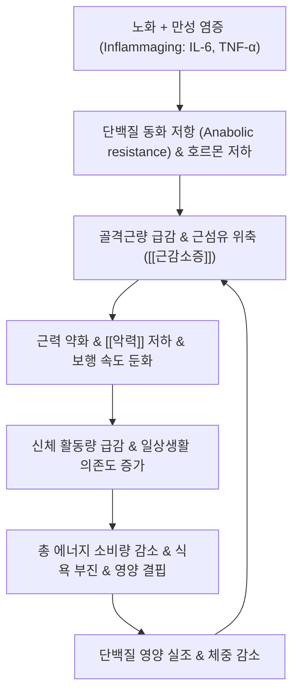

# 🩺 [[허약]] (Frailty / 노쇠·虛弱, R54)

> **핵심 3줄 요약 (Key Summary)**:
> - 📍 병소 부위 & 해부·병태생리: 다계통 생리적 예비능(Physiological reserve) 고갈, 만성 염증(IL-6, TNF-α) 및 미토콘드리아 기능 저하로 인한 [[근감소증]]과 신경·내분비·면역 항상성 붕괴.
> - 🚩 전형적 임상 양상 & 3대 징후: Fried 표현형 5대 요소(체중 감소, 만성 피로, 신체 활동량 감소, 보행 속도 저하, 악력 약화), 낙상 빈발, 일상생활 수행 능력(ADL) 저하.
> - 🛠️ 핵심 감별 검사 & 한·양방 다각적 치료 전략: Fried 척도, CFS(임상노쇠척도), [[악력]] 및 5회 의자 일어서기, [[보중익기탕]], [[십전대보탕]], [[공진단]], 복합 저항 운동 및 단백질 영양 중재.
> - ⚠️ 응급 의뢰 레드플래그 & 악화 요인: 급격한 보행 불능 및 섬망(Delirium), 연하 장애로 인한 흡인성 폐렴, 다약제(Polypharmacy) 병용 부작용 발생 시 즉시 상급병원 전원.

---

## 📌 목차
1. [질환 개요 & 해부학적 병태생리](#1-질환-개요--해부학적-병태생리)
2. [병태생리 메커니즘 & 노쇠 악순환(Frailty Cycle) 네트워크](#2-병태생리-메커니즘--노쇠-악순환frailty-cycle-네트워크)
3. [임상 증상 & 신체 기능 평가(Physical Exam) 알고리즘](#3-임상-증상--신체-기능-평가physical-exam-알고리즘)
4. [감별 진단 매트릭스 (Differential Diagnosis)](#4-감별-진단-매트릭스-differential-diagnosis)
5. [한의 통합 치료 프로토콜 (침·약침·한약)](#5-한의-통합-치료-프로토콜-침약침한약)
6. [재활 운동 & 영양·생활습관 티칭 가이드](#6-재활-운동--영양생활습관-티칭-가이드)
7. [💡 사용자 진료실 핵심 필기 & 임상 노하우 (Melt-In 잔여 심화 집약)](#7--사용자-진료실-핵심-필기--임상-노하우-melt-in-잔여-심화-집약)
8. [출처 및 학술 참고 문헌 (References)](#8-출처-및-학술-참고-문헌-references)

---

## 1. 질환 개요 & 해부학적 병태생리

![[근감소증_정상근육_대_위축근육_근섬유직경_비교도해.png|450]]
> [그림 1: 정상 골격근(Normal Muscle) 대비 노쇠 및 만성 질환 환자에서 관찰되는 근섬유 직경 감소와 근위축(Atrophied Muscle) 해부도해]

* **질환 정의 및 개요**:
  * 허약(Frailty, 노쇠)은 노화와 만성 질환이 누적되면서 생체 내 다계통의 생리적 예비능(Physiological reserve)이 현저히 감소하여, 경미한 스트레스 요인(감염, 경미한 낙상, 약물 변경 등)에도 급격한 기능 상실, 입원, 장애 및 사망에 이르는 취약성 임상 증후군이다.
  * 단순한 생물학적 '나이 듦'이 아니라 가역적으로 호전될 수 있는 질병 상태이며, 근육계에 국한된 [[근감소증]]과 깊이 연계되어 있으나 다장기 예비능 결손을 포괄한다는 점에서 구별된다.
  * 신체적 허약(Physical frailty)을 정의하는 Fried 표현형 기준(5개 중 3개 이상 부합 시 Frail, 1~2개 부합 시 Pre-frail)이 표준적으로 활용된다.
* **관련 해부학적 및 생리적 구조물**:
  * **골격근계**: 하지 대퇴사두근, 둔근군, 척추기립근(제2형 속근 섬유의 우선적 위축 및 지방 침윤).
  * **신경계**: 전두엽-기저핵 운동 회로, 말초 운동 신경 단위(Motor unit) 감소.
  * **내분비계**: 시상하부-뇌하수체-부신 축(HPA axis), 성장호르몬/IGF-1 저하, 에스트로겐/테스토스테론 결핍.

---

## 2. 병태생리 메커니즘 & 노쇠 악순환(Frailty Cycle) 네트워크

![[근감소증_신체기능평가_악력계_측정_임상사진.jpg|450]]
> [그림 2: 노인성 허약 및 근감소증의 대표적 상지 근력 평가 지표인 스메들리 악력계를 이용한 [[악력]] 측정 실사]

### 1) 노화 염증(Inflammaging)과 다계통 소모
* 노화에 따른 만성 저등급 염증(Chronic low-grade inflammation, IL-6, TNF-α 상승)과 산화 스트레스, 미토콘드리아 기능 저하는 근육, 신경, 면역계의 예비능을 동시에 고갈시킨다.
* 동화 작용(Anabolism)을 자극하는 성장호르몬과 성호르몬이 감소하고 단백질 동화 저항(Anabolic resistance)이 발생하여 동일한 영양 섭취에도 근육 합성이 저하된다.

### 2) 노쇠의 악순환 (Frailty Cycle)
* 근육 소실 $\rightarrow$ 기초대사율 및 활동량 저하 $\rightarrow$ 총 에너지 소비량 감소 $\rightarrow$ 식욕 부진 및 비의도적 체중 감소 $\rightarrow$ 추가적인 근소실로 이어지는 자가증폭 악순환 회로가 형성된다.
* 이로 인해 낙상에 대한 공포(Fear of falling)가 발생하고 외출과 운동을 기피하면서 사회적 고립과 인지 기능 저하가 동반된다.

---

## 3. 임상 증상 & 신체 기능 평가(Physical Exam) 알고리즘

![[근감소증_신체기능평가_의자일어서기검사_임상사진.jpg|450]]
> [그림 3: 하지 근력 및 신체 기능 저하를 평가하는 5회 의자 일어서기 검사(Chair Stand Test) 연령별 기준표]

### 1) Fried 표현형 5대 진단 기준
* **비의도적 체중 감소**: 지난 1년간 4.5kg 또는 체중의 5% 이상 감소.
* **자가 보고 피로감**: "모든 일이 힘들게 느껴진다" 또는 "무기력하다"는 문항에 주 3일 이상 동의.
* **신체 활동량 저하**: 주당 에너지 소비량 하위 20% (남성 <383 kcal/주, 여성 <270 kcal/주).
* **보행 속도 저하**: 4m 보행 속도 측정 시 0.8 m/s 이하 또는 15피트 보행 시간 하위 20%.
* **[[악력]] 저하**: 성별 및 BMI 기준 하위 20% (통상 남성 <28kg, 여성 <18kg).
* **평가 판정**: 3개 이상 해당 시 **노쇠(Frail)**, 1~2개 해당 시 **전노쇠(Pre-frail)**, 0개 해당 시 **건강(Robust)**.

### 2) 필수 신체 수행 평가 도구
* **5회 의자 일어서기 검사(5-Times Sit-to-Stand)**: 양팔을 가슴에 교차하고 의자에서 5회 일어서는 시간 측정 (12초 초과 시 기능 저하 시사).
* **TUG 검사(Timed Up and Go)**: 의자에서 일어나 3m를 걸어 돌아와 다시 앉는 시간 (12초 이상 시 낙상 고위험군).
* **SPPB(간이신체수행검사)**: 균형 검사, 보행 속도, 의자 일어서기(총 12점 만점, 9점 이하 시 허약).
* **임상노쇠척도(Clinical Frailty Scale, CFS)**: 1단계(매우 건강)부터 9단계(말기 질환)까지 임상적 의존도를 시각적으로 평가.

---

## 4. 감별 진단 매트릭스 (Differential Diagnosis)

| 감별 질환 | 병태생리적 초점 | 핵심 진단 기준 | 주된 임상적 차이점 |
| :--- | :--- | :--- | :--- |
| [[허약]] (본 질환) | 다계통 생리적 예비능 고갈 | Fried 5요소 중 3개 이상 | 전신적 취약성, 가역적 치료 가능 |
| [[근감소증]] (Sarcopenia) | 골격근량 및 근력 저하 | 골격근량(SMI) 저하 + 악력 저하 | 근육 기관에 국한된 협의의 개념 |
| [[악액질]] (Cachexia) | 만성 암·말기 심부전 염증 대사 | 극심한 체중 감소, 식욕 부진 | 기저 중증 질환, 비가역적 소모 상태 |
| [[노인성 우울증]] | 중추 신경전달물질 불균형 | 의욕 저하, 흥미 소실, 수면장애 | 인지 및 기분 장애 위주, 신체 검사 정상 |
| [[갑상선 기능 저하증]] | 갑상선 호르몬 결핍 | TSH 상승, Free T4 저하 | 부종, 한랭 불내성, 서맥, 점액수종 |

---

## 5. 한의 통합 치료 프로토콜 (침·약침·한약)

* **침구 치료 (Acupuncture)**:
  * **주요 보익 경혈**: 족삼리(ST36), 관원(CV4), 기해(CV6), 비유(BL20), 신유(BL23), 백회(GV20), 중완(CV12).
  * **자침 기법**: 족삼리와 관원혈에 보법(補法) 또는 온구(溫灸, 뜸) 요법을 병용하여 비위 기운을 북돋우고 하초 원기를 보충하여 소화 흡수율 촉진.
* **약침 치료 (Pharmacopuncture)**:
  * **자하거(태반) 약침**: 풍부한 아미노산, 성장인자, 펩타이드 성분으로 노인성 근감소 억제 및 활력 증진.
  * **시술 부위**: 신유(BL23), 비유(BL20), 족삼리(ST36)에 혈위당 0.2~0.5cc 분주.
* **한약 치료 (Herbal Medicine)**:
  * **기혈양허형(전신 쇠약, 식욕 부진, 체중 감소, 만성 피로)**: [[십전대보탕]](十全大補湯), [[인삼양영탕]](人蔘養榮湯).
  * **비위기허·청양하함형(소화불량, 사지 무력, 보행 둔화)**: [[보중익기탕]](補中益氣湯).
  * **간신휴허·원기쇠약형(보행 실조, 요슬산연, 인지 저하 경향)**: [[공진단]](拱辰丹), 팔미지황환.
* **전통 기공 및 균형 운동 요법**:
  * 팔단금(八段錦), 태극권(Tai Chi)을 원내 재활 요법으로 병용하여 노인의 고유수용감각을 활성화하고 하지 균형감각 증진.

---

## 6. 재활 운동 & 영양·생활습관 티칭 가이드

* **복합 운동 프로그램 (1차 근거 수준 최고)**:
  * **저항 운동(근력 강화)**: 밴드 운동, 의자 스쿼트, 까치발 들기(주 2~3회, 10~15회 3세트).
  * **유산소 운동**: 하루 30분 평지 보행(신발 쿠션 확인, 지팡이 등 보행 보조기 적극 활용).
  * **균형 운동**: 한 발 서기, 텐덤 보행(일자 보행)으로 낙상 예방.
* **고단백 영양 중재 원칙**:
  * 체중 1kg당 단백질 1.0~1.5g 섭취 (체중 60kg 노인 기준 하루 60~90g 필수).
  * 매 끼니 단백질(달걀, 두부, 살코기, 생선)을 균등 분배하여 흡수 효율 극대화.
  * 비타민 D(800~1000 IU/일) 및 칼슘 보충으로 골다공증 및 골절 예방.
* **다약제 복용(Polypharmacy) 정밀 점검**:
  * 5가지 이상의 약물을 복용 중인 노인은 약물 상호작용 및 낙상 유발 약물(진정수면제, 항콜린제, 삼환계 항우울제) 복용 여부를 점검하여 처방 간소화 유도.

---

## 7. 💡 사용자 진료실 핵심 필기 & 임상 노하우 (Melt-In 잔여 심화 집약)

> [!IMPORTANT]
> **🛡️ 원문 융합(Melt-In) 및 7번 섹션 작성 불변 규칙 (CRITICAL)**
> 1. **기존 필기 내용 상부 전면 융합 (Melt-In)**: 생리적 예비능 감소, Fried 5대 요소, 근감소증과 허약의 감별, DEMFOS 대규모 RCT 결과(복합운동의 mPPT 향상, 메트포르민 단독의 허약 개선 근거 미약), T2DM 허약 노인의 저항운동 지속 감독 필요성, SGLT2i/GLP-1RA 약물 선택 시 탈수·감염 고려 사항을 상부 전 섹션에 완전 융합 완료.
> 2. **7번 섹션의 차별화된 심화 집약**: 한의원에 내원하는 노인 허약 환자의 실전 문진 체크리스트, 보호자 티칭 멘트, 운동 순응도를 높여주는 침·약침 치료 노하우를 집약함.

* **상부 섹션에 미처 다 담지 못한 고유 원문 필기**:
  * 허약(Frailty) 환자 치료의 1차 근거는 여전히 '복합 운동(저항+유산소) + 단백질 1.0~1.5 g/kg/일'이며, 한의 치료(보중익기탕, 자하거 약침, 침구)는 노인의 관절 통증, 소화기 장애, 수면 불량을 해결해주어 환자가 운동을 중단하지 않고 지속할 수 있도록 이끌어주는 '운동 순응도 증진의 열쇠' 역할을 한다.
  * T2DM 노인 환자에서 허약 예방 프로그램은 자가 관리로 전환하면 12주 만에 기능 이득이 소실되므로, 정기적 한의원 내원과 기능 재평가를 통한 지속적인 감독 체계가 필수적이다.
* **진료실 실전 감별 & 치료 노하우**:
  * 1. **진료실 30초 허약 스크리닝 루틴**:
     * 진료실 문을 열고 들어와 의자에 앉는 걸음걸이를 관찰(보행 속도).
     * 자리에 앉은 즉시 스메들리 악력기로 양손 악력을 2회씩 측정(남성 <28kg, 여성 <18kg 확인).
     * "지난 1년간 일부러 살을 뺀 것도 아닌데 옷이 헐렁해지셨습니까?" 질문으로 체중 감소 평가.
  * 2. **보호자 상담 스크립트 ("노환이 아니라 치료 가능한 질환입니다")**:
     * "어르신의 기력이 떨어지고 자꾸 넘어지시는 것은 그냥 나이가 들어서 어쩔 수 없는 것이 아니라, 몸의 '예비 배터리'가 방전된 '허약 증후군'이라는 질병 상태입니다. 비위 기운을 돋우는 한약과 태반 약침으로 밥맛을 살리고 관절 통증을 줄여서 매일 단백질 식사와 의자 일어서기 운동을 병행하시면 다시 꼿꼿하게 걸으실 수 있습니다."
  * 3. **손맛 노하우 (자하거 약침과 족삼리 온구)**:
     * 소화 흡수력이 극도로 떨어진 노인 환자에게 자하거 약침 0.5cc를 족삼리(ST36)와 비유(BL20)에 시술하고 간접구를 시행하면, 2~3일 내에 복명(배에서 나는 소리)이 돌고 식사량이 30% 이상 증가하며 안색이 밝아지는 것을 임상에서 확인할 수 있음.

---

## 8. 출처 및 학술 참고 문헌 (References)

1. **Lifestyle Intervention with or without Metformin in Older Adults with Obesity and Frailty (DEMFOS): A Randomised, Double-Blind, Placebo-Controlled Trial.** *Lancet Healthy Longev*, 2026.
   - [연구 요약]: https://pubmed.ncbi.nlm.nih.gov/42532077/
   - 65~85세 비만·허약 노인 114명을 대상으로 6개월간 집중 복합운동 및 감량 중재가 수정신체수행점수(mPPT)를 유의하게 향상시켰으며, 메트포르민 추가 병용은 운동 단독 대비 유의미한 기능적 이득을 보이지 못함을 입증함.
2. **Supervised Resistance Training Maintains Functional Capacity in Older Adults with Type 2 Diabetes: Longitudinal Follow-up Analysis.** *Clin Interv Aging*, 2026.
   - [연구 요약]: https://pubmed.ncbi.nlm.nih.gov/42440096/
   - 당뇨를 동반한 노인 환자에서 12주간의 감독 하 저항운동이 신체 기능 및 골격근량을 개선하나, 자가 관리 전환 시 효과가 소실되므로 지속적인 모니터링과 재평가가 필수적임을 규명함.
3. **Cardiovascular Outcomes and Adverse Event Profiles of SGLT2 Inhibitors versus GLP-1 Receptor Agonists in Frail Older Adults with Type 2 Diabetes: A Real-World Cohort Study.** *Front Endocrinol*, 2025.
   - [연구 요약]: https://pubmed.ncbi.nlm.nih.gov/40933374/
   - 76만 명 이상의 고령 T2DM 환자에서 SGLT2i와 GLP-1RA의 심혈관 보호 효과를 비교하고, 허약 노인의 탈수·정상혈당 케톤산증 및 급성신손상 위험에 따른 맞춤형 약물 선택 전략을 확립함.
