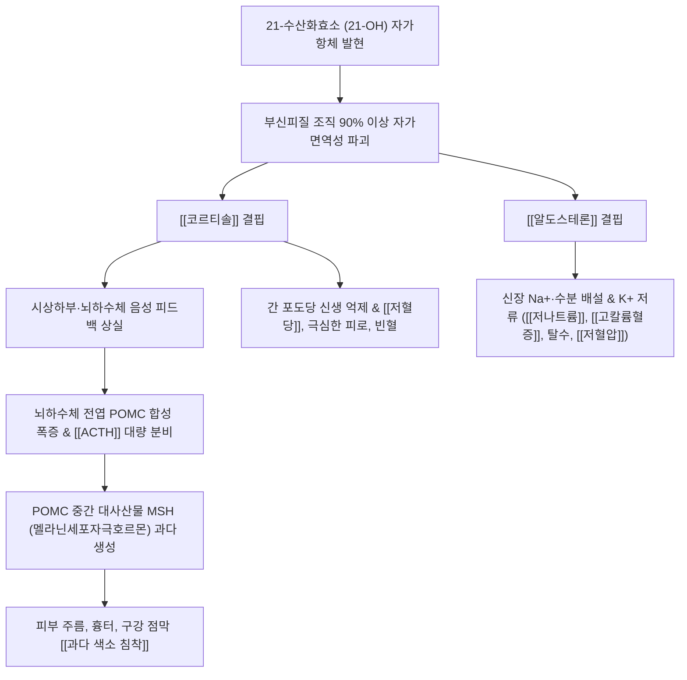

# 🩺 [[Addison's disease]] (아디슨병 / 원발성 부신피질기능저하증, E27.1)

> **핵심 3줄 요약 (Key Summary)**:
> - 📍 병소 부위 & 해부·병태생리: 양측 부신피질(Adrenal cortex)의 자가면역성 파괴(21-수산화효소 자가항체)로 인한 글루코코르티코이드([[코르티솔]]) 및 미네랄로코르티코이드([[알도스테론]]) 결핍.
> - 🚩 전형적 임상 양상 & 3대 징후: 부신피질 90% 이상 파괴 시 발현, 만성 쇠약·극심한 피로, 기립성 저혈압, 피부·구강 점막의 청동색 과다 색소 침착, 저혈당·저나트륨·고칼륨혈증.
> - 🛠️ 핵심 감별 검사 & 한·양방 다각적 치료 전략: 급속 ACTH 자극 검사(코르티솔 무반응), 혈중 ACTH 상승 확인, 하이드로코르티손/플루드로코르티손 평생 보충 및 [[보중익기탕]], [[팔미지황환]] 기혈 보양.
> - ⚠️ 응급 의뢰 레드플래그 & 악화 요인: 스트레스·감염·외상 시 촉발되는 급성 [[부신 위기]](Adrenal Crisis: 난치성 쇼크, 고열, 의식 장애, 심실부정맥) 발생 시 즉시 고용량 스테로이드 정주 및 응급실 이송.

---

## 📌 목차
1. [질환 개요 & 해부학적 병태생리](#1-질환-개요--해부학적-병태생리)
2. [병태생리 메커니즘 & 색소침착·전해질 불균형 네트워크](#2-병태생리-메커니즘--색소침착전해질-불균형-네트워크)
3. [임상 증상 & 진단 검사 알고리즘](#3-임상-증상--진단-검사-알고리즘)
4. [감별 진단 매트릭스 (Differential Diagnosis)](#4-감별-진단-매트릭스-differential-diagnosis)
5. [한·양방 통합 치료 프로토콜 (약물 대치·한약 보존)](#5-한양방-통합-치료-프로토콜-약물-대치한약-보존)
6. [부신 위기 예방 & 생활습관 티칭 가이드](#6-부신-위기-예방--생활습관-티칭-가이드)
7. [💡 사용자 진료실 핵심 필기 & 임상 노하우 (Melt-In 잔여 심화 집약)](#7--사용자-진료실-핵심-필기--임상-노하우-melt-in-잔여-심화-집약)
8. [출처 및 학술 참고 문헌 (References)](#8-출처-및-학술-참고-문헌-references)

---

## 1. 질환 개요 & 해부학적 병태생리

![[부신피질 호르몬-20241008101005934.jpg|450]]
> [그림 1: 신장 원위세뇨관 및 집합관 주세포(Principal cell)에서의 [[알도스테론]] 작용 기전. 알도스테론 결핍 시 Na+ 재흡수 차단 및 K+ 배설 장애로 저나트륨혈증과 치명적 고칼륨혈증 유발]

* **질환 정의 및 개요**:
  * 아디슨병(Addison's disease)은 양측 부신피질의 점진적 파괴로 인해 부신 호르몬(당질코르티코이드, 염류코르티코이드, 부신 안드로겐) 분비가 영구적으로 고갈되는 원발성 부신피질기능저하증(Primary Adrenal Insufficiency)이다.
  * 서구 및 국내에서 가장 흔한 원인은 자가면역성 부신염(Autoimmune adrenalitis, 약 70~80%)이며, 과거 주요 원인이었던 결핵성 부신염 및 전이암, 진균 감염 등에 의해서도 발생한다.
  * 부신피질 조직의 **90% 이상이 파괴될 때까지는 보상 기전으로 인해 무증상으로 잠복**하다가, 한계점을 넘어서거나 신체적 스트레스(수술, 감염, 외상)가 가해지면 비로소 전신 쇠약과 쇼크 증세가 급격히 드러난다.
* **관련 해부학적 구조물**:
  * **부신피질 3대 구역**:
    * 사구대(Zona glomerulosa): [[알도스테론]](염류코르티코이드) 분비.
    * 속상대(Zona fasciculata): [[코르티솔]](당질코르티코이드) 분비.
    * 망상대(Zona reticularis): DHEA 등 부신 안드로겐 분비.
  * **시상하부-뇌하수체-부신 축(HPA Axis)**: 시상하부(CRH) $\rightarrow$ 뇌하수체 전엽([[ACTH]]) $\rightarrow$ 부신피질.

---

## 2. 병태생리 메커니즘 & 색소침착·전해질 불균형 네트워크

![[아디슨병_피부_청동색_색소과다침착_도해.jpg|450]]
> [그림 2: 아디슨병(Addison's disease) 환자에서 관찰되는 특징적인 전신 피부의 청동색 과다 색소 침착(Bronzing of the skin) 임상 도해]

### 1) 당질 및 염류코르티코이드 결핍의 혈역학적 파탄
* **코르티솔 결핍**: 간의 당신생(Gluconeogenesis)이 억제되고 인슐린 감수성이 비정상적으로 항진되어 공복 시 심한 [[저혈당]]이 발생한다. 또한 혈관 평활근의 카테콜아민 반응성이 떨어져 혈관 긴장도가 유지되지 못하고 만성 기립성 [[저혈압]]이 초래된다.
* **알도스테론 결핍**: 원위세뇨관의 ENaC 채널과 Na+/K+ ATPase가 불활성화되어 나트륨과 수분이 소변으로 빠져나가고 칼륨 배설이 차단된다. 이로 인해 저혈량성 탈수, 저나트륨혈증, 산증 및 심정지를 유발하는 고칼륨혈증이 발생한다.

### 2) 특징적인 피부·구강 점막 색소 침착 기전 (원발성 아디슨병의 특이 징후)
* 혈중 코르티솔이 바닥으로 떨어지면 뇌하수체 전엽에 대한 음성 피드백이 소실되어 프로오피오멜라노코르틴(POMC) 유전자 전사가 급증한다.
* POMC 전구물질이 쪼개지는 과정에서 [[ACTH]]뿐만 아니라 멜라닌세포 자극 호르몬(α-MSH)이 다량 방출된다.
* MSH와 고농도의 ACTH가 피부 멜라닌세포의 MC1R 수용체를 직접 자극하여 멜라닌 합성을 촉진하므로, 햇빛 노출 부위, 팔꿈치·무릎 등 마찰 부위, 손바닥 손금(Palmar creases), 잇몸 및 뺨 안쪽 구강 점막에 검푸르거나 짙은 갈색의 색소 침착이 나타난다 (2차성 부신부전증에서는 ACTH가 낮으므로 색소 침착이 없음).

---

## 3. 임상 증상 & 진단 검사 알고리즘

![[아디슨병_구강점막_색소침착_임상.jpg|450]]
> [그림 3: 아디슨병 환자의 발병 전(좌측) 대비 발병 후(우측) 안면 및 전신 피부의 현저한 흑갈색 색소 침착 비교 임상 사진]

### 1) 주요 임상 증상
* **전신 쇠약 및 대사 증상**: 천근만근 가라앉는 극심한 무기력증, 만성 피로, 식욕 부진, 체중 감소, 오한, 기초대사율 저하.
* **혈역학 및 소화기 증상**: 기립성 어지럼증, 실신, 수축기 혈압 90 mmHg 이하 저혈압, 오심, 구토, 복통, 소금(짠 음식) 갈망(Salt craving).
* **특이 피부 소견**: 손바닥 손금, 입술, 잇몸 구강 점막, 유륜, 수술 흉터의 짙은 갈색 색소 침착.
* **혈액학적 이상**: 정구성 정색소성 빈혈, 호산구 증가증, 림프구 증가증.

### 2) 확진 검사 알고리즘
* **아침 공복 혈청 코르티솔 및 ACTH 동시 측정**:
  * 08~09시 혈청 코르티솔 <3 $\mu$g/dL 이면서 혈장 ACTH가 정상 상한치의 2배 이상(대개 >100 pg/mL)으로 폭증해 있으면 원발성 아디슨병 거의 확진.
* **급속 ACTH 자극 검사 (Short Synacthen Test, 확진 표준)**:
  * 합성 ACTH(코신트로핀 250 $\mu$g)를 정맥 주사 후 30분, 60분에 코르티솔 측정.
  * 정상인은 코르티솔이 18 $\mu$g/dL 이상으로 치솟으나, 아디슨병 환자는 부신 실질 파괴로 인해 전혀 반응하지 못함(<18 $\mu$g/dL).
* **자가항체 및 영상 검사**:
  * 21-수산화효소(21-OH) 자가항체 양성 확인(자가면역성 입증).
  * 복부 CT: 자가면역성은 양측 부신 위축, 결핵성은 부신 비대 및 석회화 소견.

---

## 4. 감별 진단 매트릭스 (Differential Diagnosis)

| 감별 질환 | 병소 및 원인 | 혈중 ACTH 수치 | 피부 색소 침착 | 알도스테론 결핍 여부 |
| :--- | :--- | :--- | :--- | :--- |
| [[Addison's disease]] (원발성) | 부신피질 실질 파괴 (자가면역 90%) | 현저한 상승 (>100 pg/mL) | **명확한 갈색 색소 침착** | **동반 결핍** (고칼륨, 저혈압 심각) |
| [[이차성 부신피질기능저하증]] | 뇌하수체 종양, 스테로이드 급중단 | 저하 또는 정상 | **색소 침착 없음 (창백함)** | 정상 유지 (RAAS 축 독립 작동) |
| [[쿠싱 증후군]] | 코르티솔 과다 (부신선종/ACTH과다) | 원인에 따라 상이 | 자색 선조, 멍, 중심성 비만 | 코르티솔 과잉 작용 |
| [[만성 피로 증후군]] (CFS) | 원인 불명 신경면역 기능이상 | 정상 범위 | 색소 침착 없음 | 정상 전해질 소견 |
| [[혈색소침착증]] (Hemochromatosis) | 유전성 철분 대사 이상, 철 침착 | 정상 | 청동색 당뇨(간경변 동반) | 부신 기능 정상, 페리틴 폭증 |

---

## 5. 한·양방 통합 치료 프로토콜 (약물 대치·한약 보존)

* **현대의학적 평생 호르몬 대체 요법 (Life-saving Replacement)**:
  * **당질코르티코이드 보충**: [[하이드로코르티손]](Hydrocortisone) 15~25 mg/일을 생리적 분비 리듬에 맞춰 투여 (아침 기상 직후 2/3 복용, 오후 4~5시에 1/3 복용하여 불면 예방).
  * **염류코르티코이드 보충**: [[플루드로코르티손]](Fludrocortisone) 0.05~0.2 mg/일을 1일 1회 아침 복용 (혈압, 혈청 Na+/K+, 혈장 레닌 활성도 정상화 목표).
* **한의 통합 보존 및 대사 회복 요법**:
  * 호르몬제를 복용 중임에도 남아있는 만성 권태감, 소화 흡수 장애, 체온 저하, 기혈 고갈을 완충.
  * **비신양허·명문상화 쇠약형**: [[팔미지황환]](八味地黃丸), 우귀음(右歸飲) (보신온양, 하초 원기 회복).
  * **비위기허·청양하함형 (식욕 부진, 기립성 어지럼증, 만성 피로)**: [[보중익기탕]](補中益氣湯), [[십전대보탕]](十全大補湯).
* **침구 및 약침 요법**:
  * **주요 보익 혈위**: 신유(BL23), 명문(GV4), 관원(CV4), 기해(CV6), 족삼리(ST36), 비유(BL20).
  * **자하거(태반) 약침**: 신유 및 비유에 0.2~0.5cc 분주하여 신경내분비계 활력 회복 및 전신 쇠약 완화.

---

## 6. 부신 위기 예방 & 생활습관 티칭 가이드

* **부신 위기(Adrenal Crisis) 예방 룰 (Sick-Day Rules)**:
  * 감기, 발열(>38℃), 발치, 경미한 외상 발생 시: 복용 중인 하이드로코르티손 용량을 즉시 평소의 **2~3배로 증량(Double/Triple dose)**하여 3일간 복용.
  * 중증 감염, 대수술, 심한 구토·설사로 경구 복용 불가 시: 즉시 응급실로 내원하여 하이드로코르티손 100mg 정맥 주사 및 생리식염수 수액 공급 필수.
* **의료 경고 카드 및 응급 키트 소지**:
  * 환자는 항상 '부신피질기능저하증 환자'임을 명시한 팔찌나 응급 의료 카드를 지갑에 소지해야 함.
* **식이 관리**:
  * 저나트륨혈증 방지를 위해 충분한 염분 섭취 권장(일반인과 달리 과도한 저염식 금기).
  * 칼륨 배설 장애가 있으므로 고칼륨 식품(바나나, 감자, 고농축 한약 엑기스 단독 과다 복용) 주의.

---

## 7. 💡 사용자 진료실 핵심 필기 & 임상 노하우 (Melt-In 잔여 심화 집약)

> [!IMPORTANT]
> **🛡️ 원문 융합(Melt-In) 및 7번 섹션 작성 불변 규칙 (CRITICAL)**
> 1. **기존 필기 내용 상부 전면 융합 (Melt-In)**: 21-OH 자가항체 매개 부신피질 90% 파괴 시 발현, ACTH 보상성 과분비 및 피부·구강 점막 색소 침착, 저혈압·저혈당·빈혈·만성 피로 임상 데이터를 상부 전 섹션에 완전 융합 완료.
> 2. **7번 섹션의 차별화된 심화 집약**: 만성 피로로 내원한 환자에서 아디슨병을 잡아내는 3대 신체 징후, 구강 점막 확인법, 급성 부신 위기 시 한의원 응급 전원 수칙을 집약함.

* **상부 섹션에 미처 다 담지 못한 고유 원문 필기**:
  * 보약(補藥)을 지으러 오는 만성 피로 환자 중 "얼굴이 유난히 까맣게 타고 손바닥 손금이 검게 변했으며 입술 안쪽에 먹물을 묻힌 듯한 반점"이 보이고 혈압이 90 이하로 떨어져 있다면, 단순 허약이나 만성 간질환이 아니라 반드시 아디슨병(원발성 부신부전)을 의심하고 당장 전해질과 코르티솔 검사를 보내야 한다.
* **진료실 실전 감별 & 치료 노하우**:
  * 1. **진료실 10초 아디슨병 스크리닝 (손바닥과 잇몸 시진)**:
     * 피로를 호소하는 환자의 양 손바닥을 펴게 하여 손금(주름선)이 유난히 진한 흑갈색을 띠는지 확인.
     * 입을 벌리게 하여 아랫입술 안쪽 점막이나 잇몸 경계부에 푸르스름하거나 거무스름한 멜라닌 착색(Melanoplakia)이 있는지 볼 것.
  * 2. **부신 위기(Adrenal Crisis) 감별 징후 (Red Flags)**:
     * 아디슨병 환자가 몸살 감기나 장염을 앓은 뒤 갑자기 배가 찢어질 듯 아프다고 호소하며(급성 복통 오인), 구토와 함께 혈압이 80/50 이하로 곤두박질치고 헛소리를 하면 부신 위기 상태임.
     * 이때는 침이나 한약을 쓸 시간이 없으므로 즉시 119를 호출하고 "부신부전증 환자의 저혈량성 쇼크 의심"으로 상급병원 응급실에 인계해야 함.
  * 3. **장기 스테로이드 복용 환자의 테이퍼링 시 주의점**:
     * 관절염이나 피부 질환으로 양방 피질호르몬제를 수개월 이상 장기 복용하다가 갑자기 임의 중단한 환자는 부신이 위축되어 의원성 부신부전이 발생함.
     * 절대로 양약을 일시에 끊게 하지 말고, 내과의와 상의하여 수개월에 걸쳐 서서히 감량하면서 [[보중익기탕]]이나 [[팔미지황환]]으로 자체 부신 축 회복을 유도해야 안전함.

---

## 8. 출처 및 학술 참고 문헌 (References)

1. **Diagnosis and Treatment of Primary Adrenal Insufficiency: An Endocrine Society Clinical Practice Guideline.** *J Clin Endocrinol Metab*, 2016.
   - [연구 요약]: https://pubmed.ncbi.nlm.nih.gov/26760044/
   - 미국내분비학회 공식 임상진료지침으로, 아침 혈청 코르티솔 및 급속 ACTH 자극 검사를 통한 진단 기준, 하이드로코르티손/플루드로코르티손 호르몬 대체 요법 및 부신 위기 시 용량 증량(Sick-day rules) 지침을 총망라함.
2. **Risk and outcomes of adrenal crisis in primary adrenal insufficiency: Evidence from a 24-year nationwide cohort study.** *J Intern Med*, 2026.
   - [연구 요약]: https://pubmed.ncbi.nlm.nih.gov/42619341/
   - 24년간의 전국 코호트 연구를 통해 원발성 부신피질기능저하증 환자에서 감염 및 외상으로 촉발되는 급성 부신 위기의 발생률, 사망 위험도 및 조기 고용량 스테로이드 정주의 임상적 예후 개선 효과를 입증함.
3. **Serum Lipid Profile in Patients With Primary Adrenal Insufficiency Receiving Glucocorticoid Replacement.** *Clin Endocrinol (Oxf)*, 2026.
   - [연구 요약]: https://pubmed.ncbi.nlm.nih.gov/42644417/
   - 장기 글루코코르티코이드 대체 요법을 받는 아디슨병 환자의 지질 프로파일 및 심혈관 대사 지표 변화를 분석하여 생리적 최적 용량 적정의 중요성을 규명함.