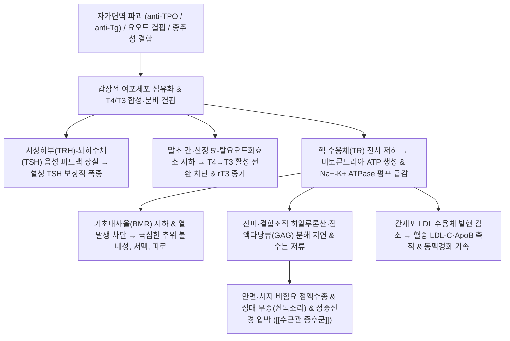

---
aliases:
  - 갑상선 기능 저하증
  - 갑상선기능저하증
  - Hypothyroidism
  - 하시모토 갑상선염
  - 점액수종
tags:
  - 질환
  - 내분비질환
  - 대사질환
  - 갑상선
  - 자가면역질환
---

# 🩺 [[갑상선 기능 저하증]] (Hypothyroidism / 甲狀腺機能低下症, ICD-10: E03 / KCD: E03)

> **핵심 3줄 요약 (Key Summary)**:
> - 📍 병소 부위 & 해부·병태생리: 갑상선 여포세포 및 HPT 축 결함으로 갑상선 호르몬($T_3, T_4$) 분비·전환이 결핍되어 미토콘드리아 ATP 생성과 기초대사율이 저하되고 진피층 친수성 점액다당류(GAG)가 축적되는 전신 대사 저하 질환.
> - 🚩 전형적 임상 양상 & 3대 징후: 심한 만성 피로 및 추위 불내성, 식사량 감소에도 점진적인 체중 증가, 안면·안와 주위 비함요 부종(점액수종) 및 건반사 이완기 지연.
> - 🛠️ 핵심 감별 검사 & 한·양방 다각적 치료 전략: 혈청 TSH·Free $T_4$·anti-TPO 항체 선별, [[레보티록신]] 보충 요법 및 한의 비신양허(脾腎陽虛)·기혈양허(氣血兩虛) 변증에 따른 [[우귀음]], [[진무탕]], [[사역탕]] 온양거습 치법.
> - ⚠️ 응급 의뢰 레드플래그 & 악화 요인: 극심한 저체온(<35℃)·서맥·저혈압·혼미를 동반하는 점액수종 혼수(Myxedema coma), 고용량 레보티록신 과량 투여로 유발된 심방세동 및 심근경색 의심 증상 즉시 응급 전원.

---

## 📌 목차
1. [질환 개요 & 해부학적 병태생리](#1-질환-개요--해부학적-병태생리)
2. [병태생리 메커니즘 & 생체역학적 악순환 네트워크](#2-병태생리-메커니즘--생체역학적-악순환-네트워크)
3. [임상 증상 & 이학적 검사(Physical Exam) 알고리즘](#3-임상-증상--이학적-검사physical-exam-알고리즘)
4. [감별 진단 매트릭스 (Differential Diagnosis)](#4-감별-진단-매트릭스-differential-diagnosis)
5. [한의 통합 치료 프로토콜 (침·약침·추나·한약)](#5-한의-통합-치료-프로토콜-침약침추나한약)
6. [재활 운동 & 생활습관 티칭 가이드](#6-재활-운동--생활습관-티칭-가이드)
7. [💡 사용자 진료실 핵심 필기 & 임상 노하우 (Melt-In 잔여 심화 집약)](#7--사용자-진료실-핵심-필기--임상-노하우-melt-in-잔여-심화-집약)
8. [출처 및 학술 참고 문헌 (References)](#8-출처-및-학술-참고-문헌-references)

---

## 1. 질환 개요 & 해부학적 병태생리

![[갑상선기능저하증_점액수종_안면부종_도해.png|350]]
> [그림 1: 갑상선 기능 저하증 환자에서 관찰되는 전형적인 안면 점액수종(Myxedema) 및 안와 주위 비함요 부종(Periorbital edema) 임상 성상]

* **질환 정의**:
  * 갑상선 호르몬인 티록신($T_4$)과 트리요오도티로닌($T_3$)의 절대적 합성 부족 또는 말초 조직 전환 장애로 인해 전신 세포의 대사 속도가 병적으로 지연되고, 세포외 기질에 점액다당류가 축적되는 만성 내분비 대사 질환.
* **역학 및 호발군**:
  * 여성 유병률이 남성에 비해 4~8배 높으며, 50~60대 이후 급격히 증가함.
  * 요오드 충분 지역에서 가장 흔한 원인은 자가면역성 만성 림프구성 갑상선염([[하시모토 갑상선염]])임.
* **관련 해부학적 구조물**:
  * **내분비선 실질**: 후두 윤상연골 직하부, 제2~4 기관 연골 전외측을 감싸는 나비 모양의 갑상선 좌우엽 및 협부(Isthmus).
  * **신경 주행**: 갑상선 후외측의 [[되돌이후두신경]](Recurrent laryngeal nerve) 및 외후두신경(External branch of superior laryngeal nerve).
  * **주요 혈관**: [[바깥목동맥]]에서 분지하는 위갑상동맥(Superior thyroid artery)과 [[갑상목동맥]]에서 분지하는 아래갑상동맥(Inferior thyroid artery).

---

## 2. 병태생리 메커니즘 & 생체역학적 악순환 네트워크

![[갑상선_혈관분포_동맥해부도_한국어.png|420]]
> [그림 2: 갑상선 및 주변 혈관망 주행 해부도 (바깥목동맥, 갑상목동맥, 위·아래갑상동맥 및 빗장밑동맥 연결망)]

### 1) HPT 축 피드백 파탄 및 자가면역 기전
* **원발성 저하증 (Primary, 95% 이상)**:
  * 갑상선 실질의 파괴로 호르몬 합성이 저하되면 시상하부(TRH)와 뇌하수체 전엽(TSH)에 가해지던 정상적인 음성 피드백이 소실됨.
  * 이에 따라 뇌하수체 전엽은 결핍을 보상하기 위해 혈중 TSH 분비를 병적으로 폭증시킴.
* **자가면역성 실질 파괴 (Hashimoto's Pathophysiology)**:
  * 항갑상선 과산화효소 항체(anti-TPO Ab)와 항갑상선글로불린 항체(anti-Tg Ab)가 여포 상피세포를 표적 공격함.
  * CD8+ 세포독성 T세포, IFN-$\gamma$ 유도성 자멸사(Apoptosis), 보체 매개 세포용해로 인해 여포세포가 위축되고 림프구 침윤 및 광범위한 섬유화가 진행됨.
* **말초 조직 전환 부전 (Deiodination Failure)**:
  * 간과 신장에서 불활성형 $T_4$를 활성형 $T_3$로 전환하는 5'-탈요오드화효소(Type 1, Type 2 deiodinase) 활성이 만성 염증, 코르티솔 과다, 셀레늄·아연 결핍 상태에서 저하됨.
  * 활성형 $T_3$ 대신 대사 억제형 reverse $T_3$($rT_3$)가 상승하여 세포 내 기능적 호르몬 저항성이 심화됨.

### 2) 세포 대사 저하 및 결합조직 점액수종 형성
* **미토콘드리아 기능 저하**:
  * 갑상선 호르몬 수용체(TR)의 전사 조절 실패로 $Na^+-K^+\text{ ATPase}$ 합성과 산소 소비량이 급감하여 에너지(ATP) 생성과 체온 조절 능력이 상실됨.
* **점액수종(Myxedema) 및 신경 압박 생체역학**:
  * 진피층과 결합조직 내 섬유아세포에서 히알루론산 및 콘드로이틴황산 등 친수성 글리코사미노글리칸(GAG)의 분해가 지연되어 조직 간질에 과도하게 축적됨.
  * 삼투압으로 수분을 끌어당겨 손가락으로 눌러도 들어가지 않는 단단한 비함요 부종(Non-pitting edema)을 유발함.
  * 손목 수근관 내 활액막과 건초에 점액다당류가 침착되면서 횡수근인대 직하부의 [[정중신경]]을 기계적으로 압박하여 [[수근관 증후군]](CTS)을 빈발시킴.

---

## 3. 임상 증상 & 이학적 검사(Physical Exam) 알고리즘

### 1) 전신 증상 및 신경근육계 소견
* **에너지 대사 & 체온**: 만성 무기력증, 극심한 추위 불내성(Cold intolerance), 땀 분비 감소, 식사량이 늘지 않거나 줄어도 체중이 증가함.
* **피부·모발·두경부**: 피부의 심한 건조 및 각화, 거칠고 차가운 피부, 안면 및 안와 주위 비함요 부종, 외측 1/3 눈썹 소실(Sign of Hertoghe), 성대 부종에 의한 굵고 쉰 목소리(Hoarseness).
* **신경근육계 & 반사**: 신전 건반사(Deep Tendon Reflex, 특히 아킬레스건 반사)의 수축 후 이완기 지연(Delayed relaxation phase, Woltman's sign), 근육통, 근경련, [[수근관 증후군]](손가락 저림 및 무지구근 무력).
* **심혈관계 & 위장관계**: 서맥(Bradycardia), 심박출량 감소에 따른 운동 시 호흡곤란, 장 연동운동 저하로 인한 불응성 변비.

### 2) 필수 검사 매뉴얼 및 검사실 해석

| 분류 | TSH 수치 | Free T4 수치 | 임상적 의의 및 대처 |
| :--- | :--- | :--- | :--- |
| 현성 원발성 저하증 (Overt) | 상승 ($> 10\text{ mIU/L}$) | 현저한 저하 | 전형적 대사 저하 증상 동반. 즉각적 [[레보티록신]] 보충 필수 |
| 불현성 저하증 (Subclinical) | 경도 상승 ($4.5 \sim 10\text{ mIU/L}$) | 정상 범위 | 증상이 비특이적이거나 없음. anti-TPO 항체 양성이거나 임신 준비 시 투약 고려 |
| 중추성 저하증 (Central) | 저하 또는 '비정상적 정상' | 저하 | 뇌하수체 선종, 쉬한 증후군 등 시상하부-뇌하수체 병변 의심 (뇌 MRI 검사 필요) |

---

## 4. 감별 진단 매트릭스 (Differential Diagnosis)

| 감별 질환 | 병인 및 주소증 차이 | 진단 검사 특징 | 이학적 소견 감별 |
| :--- | :--- | :--- | :--- |
| [[갑상선 기능 저하증]] (본 질환) | 여포세포 파괴, TSH 상승, 전신 대사 저하 및 체중 증가 | Free T4 저하, TSH 상승, anti-TPO Ab 양성 | 비함요 부종(Non-pitting), 건반사 이완 지연 |
| [[우울증]] | 중추 모노아민 불균형, 무기력·의욕 저하 위주 | TSH 및 Free T4 정상 수치 | 피부 건조, 체온 저하, 점액수종 징후 부재 |
| [[신증후군]] / 신부전 | 사구체 기저막 손상, 심한 단백뇨, 전신 수분 저류 | 단백뇨(>3.5g/day), 혈청 알부민 감소, BUN/Cr 상승 | 함요 부종(Pitting edema, 손가락 자국 남음) |
| [[울혈성 심부전]] | 심박출 부전, 정맥성 울혈, 호흡곤란, 양하지 부종 | BNP/NT-proBNP 급증, 심장초음파 구혈률 저하 | 경정맥 확장, 양측 하지 함요 부종, 폐야 악설음 |
| [[만성 피로 증후군]] | 중추 신경면역 매개성 피로, 6개월 이상 지속 피로 | 갑상선 호르몬 및 전해질 검사 정상 | 내분비적 객관적 생화학 지표 이상 없음 |

---

## 5. 한의 통합 치료 프로토콜 (침·약침·추나·한약)

![[레보티록신_화학구조식.png|360]]
> [그림 3: 현대의학 표준 보충제인 레보티록신(Levothyroxine, T4)의 화학 분자 구조식 - 한의 치료는 양약 투여와 상호작용을 고려하여 유기적으로 병용함]

* **한의학적 병전 병리**:
  * 갑상선 호르몬의 열 생산 및 대사 촉진 결핍을 한의학에서는 **비신양허(脾腎陽虛)** 및 **명문상화(命門相火) 쇠미**로 규정함.
  * 수분 대사 장애와 결합조직 점액수종은 기화(氣化) 부전으로 인한 **음습수음(陰濕水飮)** 및 **담어(痰瘀)**의 병리적 정체로 파악함.
* **침구 치료**:
  * **온양이기(溫陽理氣) 배혈**: 관원(CV4), 기해(CV6), 족삼리(ST36), 음릉천(SP9), 비수(BL20), 신수(BL23).
  * **전침 및 온통(溫通) 자극**: 하초 원기 회복과 대사 순환 활성화를 위해 신수-관원에 저주파(2Hz) 연속파 전침 또는 간접구(뜸) 요법을 병행.
* **약침 치료**:
  * **자하거 약침**: 비신정혈(脾腎精血) 보충 및 면역기능 조절을 위해 신수, 관원, 족삼리에 회당 0.1~0.2cc 분할 주입.
  * **중초약침 또는 황련해독탕 약침**: 만성 림프구성 염증 반응 억제 및 복부 림프 순환 촉진을 위해 중완(CV12), 천추(ST25) 배오.
* **추나 치료**:
  * **경추-흉추 자율신경 조절 추나**: 교감신경절(Superior cervical ganglion)이 위치한 상부 경추(C1-C3) 및 상부 흉추(T1-T4) 분절의 관절가동추나 및 신연기법을 적용하여 갑상선 동맥 순환 촉진.
  * **손목 수근관 감압 추나**: 동반된 [[수근관 증후군]] 완화를 위해 횡수근인대 근막이완수기(JS 기법) 및 수근골 가동술 적용.
* **한약 변증 투약**:
  * **비신양허(脾腎陽虛)** (심한 오한, 사지냉감, 부종, 연변, 만성 피로): [[우귀음]], [[진무탕]], [[사역탕]] 가감 ([[부자]], [[육계]], [[백출]], [[복령]] 중심).
  * **기혈양허(氣血兩虛)** (탈모, 피부 건조, 심계, 어지럼증): [[보중익기탕]], [[십전대보탕]], [[인삼양영탕]] 가감.
  * **음허화왕(陰虛火旺) - 약물 부작용 단계**: 씬지로이드 과다 복용으로 가슴 두근거림, 불안, 상열감이 발생한 경우 [[천왕보심단]], [[시호가용골모려탕]] 처방.

---

## 6. 재활 운동 & 생활습관 티칭 가이드

* **체온 유지 및 보온 습관**:
  * 한랭 노출은 기초 대사 부담을 가중시키므로 목, 하복부, 발목 부위의 보온을 상시 유지하고 찬물 섭취를 금지함.
* **식이 및 요오드(Iodine) 섭취 관리**:
  * **과도한 해조류 섭취 제한**: 한국인은 미역, 다시마, 김 섭취량이 높아 요오드 결핍 위험이 극히 낮음. 하시모토성 저하증 환자가 고용량 요오드를 섭취하면 일시적 호르몬 합성 억제 현상인 **볼프-차이코프 효과(Wolff-Chaikoff effect)**가 장기화되어 갑상선 기능이 급격히 악화되므로 해조류 섭취를 일상 수준으로 엄격히 제한.
  * **필수 미네랄 보충**: $T_4 \rightarrow T_3$ 전환 조효소인 셀레늄(Selenium, 100~200 $\mu$g/day) 및 아연(Zinc), 비타민 D를 충분히 섭취.
* **규칙적 유산소 운동**:
  * 저하증 환자는 근위축 및 피로가 심하므로 주 3~4회, 회당 30분 내외의 가벼운 보행, 실내 자전거 등 저강도 유산소 운동부터 점진적으로 증량.

---

## 7. 💡 사용자 진료실 핵심 필기 & 임상 노하우 (Melt-In 잔여 심화 집약)

### 1) 갑상선 호르몬제([[레보티록신]], 씬지로이드) 부작용 감별 및 대처 노하우
* **반감기 누적성 주의 (약 7일의 긴 반감기)**:
  * 레보티록신은 체내 반감기가 약 7일로 대단히 길어 용량을 증량하거나 변경했을 때 즉각 반응이 오지 않고, 2~4주에 걸쳐 서서히 축적된 후 뒤늦게 과다 증상이 발현됨.
* **약물 과다로 인한 $\beta_1$ 아드레날린 수용체 과자극 증상**:
  * 호르몬 과잉 공급 시 심근의 $\beta_1$ 수용체 민감도가 급격히 상승하여 교감신경계 과항진 반응이 유발됨.
  * **임상 징후**: 안정 시 맥박수 증가(>90회/분), 심계항진(가슴 두근거림), 손가락 미세진전(Tremor), 불안·초조, 불면, 식욕 증가에도 체중 감소, 상열감 및 식은땀.
  * **장기 방치 위험**: 고령 환자에서 **심방세동(Atrial Fibrillation)** 유발 및 파골세포 과활성화에 따른 **골밀도 급감(골다공증)** 초래.
* **약물 흡수율 급변 주의 (상호작용 체크리스트)**:
  * 환자가 기존에 함께 복용하던 칼슘제, 철분제, 제산제(알루미늄/마그네슘 제제)를 중단한 경우, 레보티록신 흡수를 방해하던 장내 킬레이트 결합이 사라지면서 동일 용량에서도 생체이용률이 20~30% 이상 급상승하여 중독 증상이 나타날 수 있음.
  * 반드시 문진 시 "최근 복용을 중단하거나 새로 추가한 영양제·위장약이 있는지"를 필수 확인.
* **진료실 복약 티칭 스크립트**:
  * *"씬지로이드는 아침 기상 직후 공복에 물 한 컵과 함께 단독으로 드셔야 하며, 식사는 최소 30~60분 뒤에 하셔야 합니다. 칼슘이나 철분제, 종합비타민은 최소 4시간 이상 간격을 두고 오후나 저녁에 복용하셔야 약효가 일정하게 유지됩니다."*

### 2) 한의 진료실 호르몬 조절 & 테이퍼링 연계 프로토콜
* **호르몬제 과다 흥분기 (음허화왕/심담불녕)**:
  * 환자가 두근거림과 불안을 심하게 호소할 때 내과와 협진하여 TSH 타깃을 확인하고, 한방적으로 [[천왕보심단]] 또는 [[시호가용골모려탕]]을 2~4주간 투여하여 심경(心經)과 담경(膽經)의 허열(虛熱)을 진정시킴.
  * 교감신경 차단을 위해 커피, 녹차, 에너지음료 등 카페인 섭취를 엄격히 중단시킴.
* **만성 저하증 안정기 한약 병용 원칙**:
  * 레보티록신을 임의로 단번에 끊게 해서는 절대 안 됨.
  * 양약을 표준 복용하는 상태에서 비신양허 변증 한약([[우귀음]], [[진무탕]])을 8~12주간 병용하여 말초 $T_4 \rightarrow T_3$ 전환율과 부종 배출 능력을 끌어올린 후, TSH 검사상 수치가 낮아질 때 내과 주치의 판단하에 씬지로이드를 단계별(예: 100 $\mu$g $\rightarrow$ 88 $\mu$g $\rightarrow$ 75 $\mu$g)로 서서히 감량 유도.

---

## 8. 출처 및 학술 참고 문헌 (References)

1. **Al-Sharabi, A., et al. (2026)**. *Cardiometabolic Outcomes and Levothyroxine Treatment Effects in Subclinical Hypothyroidism: A Systematic Review*. **Cureus**, 18(2), e78921.
   - `[연구 요약]`: [PubMed Link](https://pubmed.ncbi.nlm.nih.gov/42732446/) / 불현성 갑상선 기능 저하증 환자에서 레보티록신 투약이 혈중 LDL-C, 아포지단백 및 심혈관 동맥경화 위험도에 미치는 치료적 효과와 적응증 기준을 체계적으로 분석함.
2. **Zhang, Y., et al. (2026)**. *Development and external validation of a risk prediction model for hypertension among individuals with established hypothyroidism*. **Frontiers in Endocrinology**, 17, 1532104.
   - `[연구 요약]`: [PubMed Link](https://pubmed.ncbi.nlm.nih.gov/42755914/) / 갑상선 기능 저하증 환자군에서 이차성 고혈압 발생을 예측하는 임상 예측 모델을 구축하고, 말초 혈관 저항 증가 및 전신 대사 저하의 상호 연관성을 입증함.
3. **Chaker, L., et al. (2022)**. *Hypothyroidism*. **The Lancet**, 400(10361), 1401-1414.
   - `[연구 요약]`: [PubMed Link](https://pubmed.ncbi.nlm.nih.gov/36379502/) / 하시모토 갑상선염의 면역 유전학적 발병 기전, 전신 점액수종 메커니즘, 레보티록신의 개인별 용량 적정 및 고령자·임산부 환자 관리 전략을 총괄 제시한 표준 세미나.