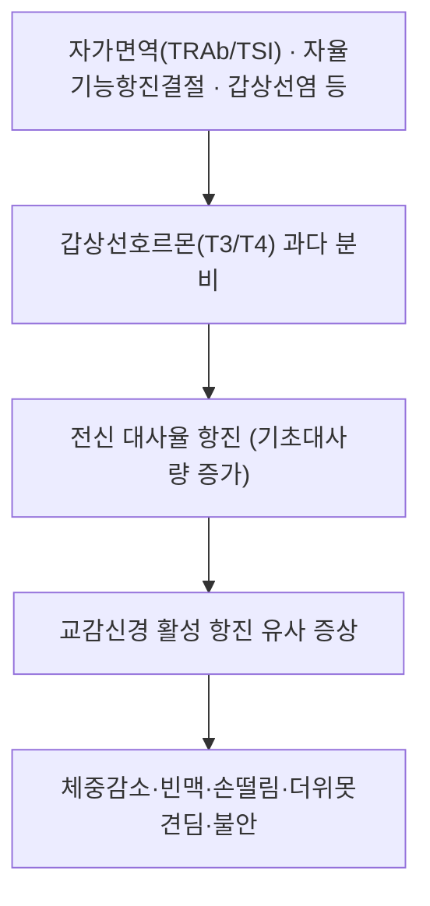

---
aliases:
  - Hyperthyroidism
  - 갑상선기능항진증
  - 甲狀腺機能亢進症
  - 그레이브스병
  - Graves' Disease
  - 갑상선중독증
  - Thyrotoxicosis
tags:
  - 질환
  - 내분비질환
  - 갑상선
---

# 🩺 갑상선 기능 항진증 (甲狀腺機能亢進症, Hyperthyroidism — ICD-10 E05)

> **핵심 3줄 요약 (Key Summary)**:
> - 📍 병소 부위 & 병태생리: 갑상선호르몬(T3/T4)의 과다 분비로 전신 대사가 항진되는 상태. 가장 흔한 원인은 자가면역 질환인 그레이브스병(TSH 수용체 자극항체, TRAb/TSI가 갑상선을 지속 자극)이며, 중독성 다결절성 갑상선종, 독성 선종, 아급성/무통성 갑상선염 등도 원인이 됨.
> - 🚩 전형적 임상 양상: 체중감소, 더위못견딤, 심계항진·빈맥, 손떨림, 발한과다, 설사, 불안·초조, 무월경/희발월경, 갑상선종. 그레이브스병 특이 소견으로 안구돌출(exophthalmos)·경골전점액수종이 동반될 수 있음.
> - 🛠️ 핵심 검사 & 치료: 혈청 TSH 억제 + 유리 T4/T3 상승으로 진단, TRAb 양성 시 그레이브스병 시사, 방사성요오드섭취스캔으로 원인 감별(그레이브스=미만성 섭취증가, 독성결절=국소적 섭취증가, 갑상선염=섭취저하). 항갑상선제(메티마졸 등), 방사성요오드 치료, 갑상선절제술 3대 치료법.
> - ⚠️ 응급 레드플래그: 고열·의식변화·심한 빈맥·심부전 징후를 동반한 갑상선 위기(Thyroid Storm)는 생명을 위협하는 응급질환으로 즉시 응급실 의뢰 필요.

---

## 📌 목차
1. [질환 개요 & 분류](#1-질환-개요--분류)
2. [병태생리 메커니즘](#2-병태생리-메커니즘)
3. [임상 증상 & 진단 평가](#3-임상-증상--진단-평가)
4. [원인별 감별](#4-원인별-감별)
5. [치료 전략](#5-치료-전략)
6. [갑상선 위기(Thyroid Storm)](#6-갑상선-위기thyroid-storm)
7. [한의학적 연계](#7-한의학적-연계)
8. [출처 및 학술 참고 문헌 (References)](#8-출처-및-학술-참고-문헌-references)

---

## 1. 질환 개요 & 분류

* **정의**: 갑상선호르몬(T3, T4)이 과다하게 생성·분비되어 전신 대사율이 병적으로 항진된 상태를 갑상선기능항진증이라 하며, 갑상선 자체의 과다 생산이 아니더라도 혈중 갑상선호르몬이 과다한 상태를 포괄적으로 갑상선중독증(Thyrotoxicosis)이라 부릅니다.
* **역학**: 여성에서 남성보다 5~10배 더 흔하며, 그레이브스병이 전체 갑상선기능항진증의 60~80%를 차지하는 가장 흔한 원인입니다.

---

## 2. 병태생리 메커니즘

* **그레이브스병(가장 흔한 원인)**: B림프구가 생성한 TSH 수용체 자극항체(TRAb, TSI)가 갑상선 여포세포의 TSH 수용체에 결합해 지속적으로 갑상선을 자극, 호르몬 과다 생산과 갑상선종을 유발합니다. 안와 조직에서의 자가면역 반응은 안구돌출증(그레이브스 안병증)을 일으킵니다.
* **독성 결절/선종**: 갑상선 결절이 TSH와 무관하게 자율적으로 호르몬을 과다 생산.
* **갑상선염(아급성/무통성)**: 여포 파괴로 저장된 호르몬이 일시적으로 혈중에 누출되어 일과성 갑상선기능항진증을 일으키며, 이후 정상화되거나 일시적 저하증으로 이행하기도 합니다.

---

## 3. 임상 증상 & 진단 평가

* **전신·대사 증상**: 체중감소(식욕 증가에도 불구), 더위못견딤, 발한과다, 피로감.
* **심혈관 증상**: 심계항진, 동성빈맥, 심방세동(고령 환자에서 특히 주의), 수축기 고혈압.
* **신경근육 증상**: 미세 손떨림, 근력약화(특히 근위부), 불안·초조·불면.
* **소화기 증상**: 배변 횟수 증가·설사.
* **부인과**: 희발월경·무월경, 가임력 저하.
* **그레이브스병 특이 소견**: 안구돌출(exophthalmos), 결막충혈·안구건조 등 그레이브스 안병증, 경골전점액수종(pretibial myxedema).
* **검사**: 혈청 TSH 저하 + 유리 T4/T3 상승이 기본 확진 소견이며, TRAb(TSH 수용체 항체) 양성은 그레이브스병을 시사합니다. 방사성요오드섭취검사(RAIU)로 원인 감별이 가능합니다.

---

## 4. 원인별 감별

| 원인 | 방사성요오드 섭취 | 특징적 소견 |
| :--- | :--- | :--- |
| 그레이브스병 | 미만성 증가 | TRAb 양성, 안구돌출, 미만성 갑상선종 |
| 중독성 다결절성 갑상선종 | 불균질 증가 | 다결절성 갑상선종, TRAb 음성 |
| 독성 선종 | 국소적(단일 결절) 증가 | 단일 "hot nodule" |
| 아급성/무통성 갑상선염 | 감소 | 압통(아급성) 또는 무통, 일과성 경과 |

---

## 5. 치료 전략

* **항갑상선제**: 메티마졸(1차 선택), 프로필티오우라실(임신 1삼분기 또는 갑상선 위기 시 선호) — 갑상선 페록시다제를 억제해 호르몬 합성을 차단.
* **방사성요오드 치료(RAI)**: 갑상선 조직을 파괴해 영구적으로 기능을 저하시키는 근치적 치료, 이후 영구적 갑상선기능저하증 발생 가능성 높음(호르몬 보충 필요).
* **갑상선절제술**: 심한 갑상선종, 임신 2삼분기, 그레이브스 안병증 악화 우려 시 등 특정 상황에서 고려.
* **베타차단제**: 프로프라놀롤 등으로 빈맥·손떨림 등 교감신경 항진 증상을 신속히 완화(근본 치료는 아님).

---

## 6. 갑상선 위기(Thyroid Storm)

갑상선 위기는 심한 갑상선기능항진증이 감염, 수술, 외상 등을 계기로 급격히 악화되어 고열, 심한 빈맥/부정맥, 의식변화, 심부전 등을 동반하는 생명을 위협하는 내분비 응급질환입니다. 즉각적인 항갑상선제 고용량 투여, 베타차단제, 스테로이드, 요오드화칼륨 등 집중치료가 필요하며 반드시 응급실/중환자실 의뢰가 필요합니다.

---

## 7. 한의학적 연계

한의학에서는 갑상선기능항진증의 심계·번조·다한·수족진전 등 증상을 음허양항(陰虛陽亢), 간화상염(肝火上炎), 심음허(心陰虛) 등으로 변증하는 경우가 많으며, 자음강화·청간사화·양심안신 등의 치법이 활용됩니다. 다만 그레이브스병 자체의 자가면역 기전을 한약으로 근본 조절할 수 있다는 주장은 임상적 근거 수준이 충분히 확립되어 있지 않으므로, 항갑상선제 등 표준 치료를 대체하기보다 보조적 관점에서 접근해야 하며 ⚠️ 내용 검토 필요로 표기합니다.

---

## 8. 출처 및 학술 참고 문헌 (References)

1. **De Leo S, Lee SY, Braverman LE. (2016)**. Hyperthyroidism. *The Lancet*, 388(10047), 906–918. PMID: [27038492](https://pubmed.ncbi.nlm.nih.gov/27038492/)
   - **[연구 요약]**: 갑상선기능항진증의 병인, 진단, 치료 전반을 종합한 대표적 리뷰.
2. **Endotext (NCBI Bookshelf)**. Graves' Disease and the Manifestations of Thyrotoxicosis. [https://www.ncbi.nlm.nih.gov/books/NBK285567/](https://www.ncbi.nlm.nih.gov/books/NBK285567/)
   - **[요약]**: 그레이브스병의 자가면역 기전(TRAb/TSI)과 갑상선중독증의 임상양상을 정리한 참고 자료.
