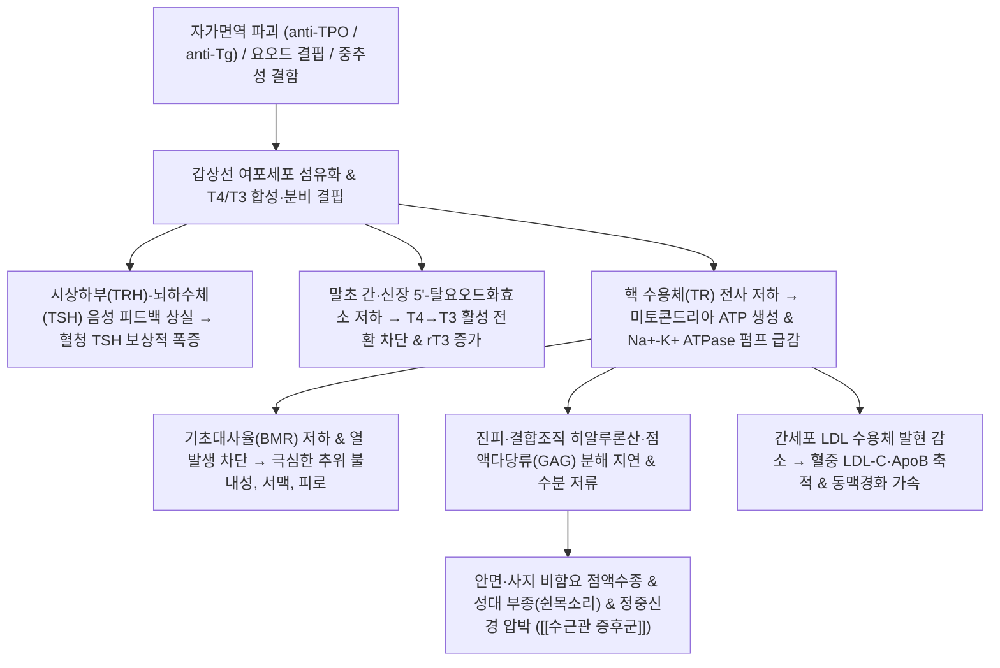

# 🩺 [[갑상선 기능 저하증]] (Hypothyroidism / 甲狀腺機能低下症, ICD-10: E03 / KCD: E03)

> **핵심 3줄 요약 (Key Summary)**:
> - 📍 **병소 부위 & 해부·병태생리**: 갑상선 여포세포 및 HPT 축 결함으로 갑상선 호르몬($T_3, T_4$) 분비·전환이 결핍되어 미토콘드리아 ATP 생성과 기초대사율이 저하되고 진피층 친수성 점액다당류(GAG)가 축적되는 전신 대사 저하 질환.
> - 🚩 **전형적 임상 양상 & 3대 징후**: 심한 만성 피로 및 추위 불내성, 식사량 감소에도 점진적인 체중 증가, 안면·안와 주위 비함요 부종(점액수종) 및 건반사 이완기 지연(Woltman's sign).
> - 🛠️ **핵심 감별 검사 & 한·양방 다각적 치료 전략**: 혈청 TSH·Free $T_4$·anti-TPO 항체 선별, [[레보티록신]] 보충 요법 및 한의 비신양허(脾腎陽虛)·기혈양허(氣血兩虛) 변증에 따른 [[우귀음]], [[진무탕]], [[사역탕]] 온양거습 치법.
> - ⚠️ **응급 의뢰 레드플래그 & 악화 요인**: 극심한 저체온(<35℃)·서맥·저혈압·혼미를 동반하는 점액수종 혼수(Myxedema coma), 고용량 레보티록신 과량 투여로 유발된 심방세동 및 심근경색 의심 증상 즉시 응급 전원.

---

## 📌 목차
1. [질환 개요 & 병태생리 (Disease Overview)](#1-질환-개요--병태생리-disease-overview)
2. [병태생리 메커니즘 & 대사·장기부전 악순환 네트워크](#2-병태생리-메커니즘--대사장기부전-악순환-네트워크)
3. [임상 증상 & 환자 소견 (Clinical Presentation)](#3-임상-증상--환자-소견-clinical-presentation)
4. [감별 진단 매트릭스 (Differential Diagnosis)](#4-감별-진단-매트릭스-differential-diagnosis)
5. [한의 통합 치료 프로토콜 (침·약침·한약)](#5-한의-통합-치료-프로토콜-침약침한약)
6. [양방 치료 & 병용·의뢰 기준 (Conventional Treatment & Referral)](#6-양방-치료--병용의뢰-기준-conventional-treatment--referral)
7. [식이·생활습관 & 자가관리 티칭 가이드](#7-식이생활습관--자가관리-티칭-가이드)
8. [💡 진료실 핵심 필기 & 임상 노하우](#8--진료실-핵심-필기--임상-노하우)
9. [출처 및 학술 참고 문헌 (References)](#9-출처-및-학술-참고-문헌-references)

---

## 1. 질환 개요 & 병태생리 (Disease Overview)

![[갑상선기능저하증_01_개요도해_해부위치.png|450]]
> [그림 1: ① 질병 개요 도해 — 갑상선의 해부학적 위치 및 전신 호르몬 조절 축(HPT axis) 도식. 출처: Wikimedia Commons (CC BY-SA 3.0)]

* **질환 정의 및 분류**:
  * 갑상선 호르몬인 티록신($T_4$)과 트리요오도티로닌($T_3$)의 절대적 합성 부족 또는 말초 조직 전환 장애로 인해 전신 세포의 대사 속도가 병적으로 지연되고, 세포외 기질에 점액다당류가 축적되는 만성 내분비 대사 질환.
  * **원발성(Primary, 95% 이상)**, **이차성·중추성(Secondary/Tertiary, 뇌하수체/시상하부 결함)**, **말초성(갑상선 호르몬 저항성)**으로 분류됨.
  * 여성 유병률이 남성에 비해 4~8배 높으며, 50~60대 이후 급격히 증가함. 요오드 충분 지역에서 가장 흔한 원인은 자가면역성 만성 림프구성 갑상선염([[하시모토 갑상선염]])임.
* **관련 장기 및 조직**:
  * **주 이환 장기**: [[갑상선]](후두 윤상연골 직하부 좌우엽 및 협부), [[시상하부]], [[뇌하수체]].
  * **연관 대사·조절계**: [[시상하부-뇌하수체-갑상선 축]](HPT axis), [[갑상선자극호르몬]](TSH), [[티록신]]($T_4$), [[트리요오도티로닌]]($T_3$), 5'-탈요오드화효소(Deiodinase).
  * **합병증 표적 장기**: 심혈관계(서맥, 심실 수축력 저하, 동맥경화), 신경근육계([[수근관 증후군]], 건반사 지연), 피부·결합조직(비함요 점액수종), 조혈계(소구성/정구성 빈혈).
  * **신경 및 혈관 주행**: [[되돌이후두신경]](Recurrent laryngeal nerve), [[바깥목동맥]] 분지 위갑상동맥, [[갑상목동맥]] 분지 아래갑상동맥.

---

## 2. 병태생리 메커니즘 & 대사·장기부전 악순환 네트워크

![[갑상선기능저하증_02_병태생리_호르몬합성경로.png|450]]
> [그림 2: ② 병태생리 구조도 — 갑상선 여포세포 내 요오드 흡수, 티로글로불린 요오드화 및 호르몬 합성·분비 기전. 출처: Wikimedia Commons (CC BY-SA 3.0)]

![[갑상선_혈관분포_동맥해부도_한국어.png|420]]
> [그림 3: ③ 대사·신호전달 및 순환망 도해 — 갑상선 및 주변 혈관망 주행 해부도(위·아래갑상동맥 및 빗장밑동맥 연결망). 출처: Gray's Anatomy (Public Domain)]

> ⚠️ 이 섹션에는 도해를 2장 이상 배치하여 원인·결과가 단계적으로 이어지는 흐름을 시각화합니다.

### 1) 분자·세포 수준 기전
* **HPT 축 피드백 파탄 및 자가면역 기전**:
  * 갑상선 실질의 파괴로 호르몬 합성이 저하되면 시상하부(TRH)와 뇌하수체 전엽(TSH)에 가해지던 정상적인 음성 피드백이 소실되어 혈중 TSH 분비가 폭증함.
  * 항갑상선 과산화효소 항체(anti-TPO Ab)와 항갑상선글로불린 항체(anti-Tg Ab)가 여포 상피세포를 표적 공격하여 림프구 침윤 및 여포 위축 유발.
  * 간·신장의 5'-탈요오드화효소 활성 저하로 활성형 $T_3$ 대신 대사 억제형 $rT_3$가 증가하여 세포 수준의 호르몬 저항성 심화.
* **미토콘드리아 ATP 생성 및 효소 펌프 정체**:
  * 갑상선 호르몬 수용체(TR) 결합 결핍으로 $Na^+-K^+\text{ ATPase}$ 합성 및 산소 소비량이 급감하여 기초 열 생성이 차단됨.

### 2) 장기·계통 수준 결과 및 대사 악순환
* **결합조직 점액수종(Myxedema) 형성 및 신경 압박**:
  * 진피층 내 섬유아세포에서 히알루론산 및 콘드로이틴황산 등 친수성 글리코사미노글리칸(GAG) 분해가 지연되어 조직 간질에 과도하게 축적됨.
  * 삼투압으로 수분을 끌어당겨 손가락으로 눌러도 자국이 남지 않는 단단한 비함요 부종(Non-pitting edema)을 유발함.
  * 손목 수근관 내 활액막에 점액다당류가 침착되어 횡수근인대 하부의 [[정중신경]]을 기계적으로 압박, [[수근관 증후군]](CTS)을 빈발시킴.
* **지질 대사 이상 및 동맥경화 가속**:
  * 간세포 표면 LDL 수용체 발현이 감소하여 순환 혈중 LDL-콜레스테롤 및 아포지단백 B(ApoB) 제거가 지연되어 죽상경화증 위험이 급증함.

### 3) 위험인자와 진행 단계
* 위험인자(여성, 고령, 유전적 소인, 자가면역 질환 기왕력) $\rightarrow$ 불현성 저하증(TSH 상승, Free T4 정상) $\rightarrow$ 현성 원발성 저하증(전신 대사 저하, 점액수종 발현) $\rightarrow$ 중증 합병증기(점액수종 혼수, 허혈성 심질환).

---

## 3. 임상 증상 & 환자 소견 (Clinical Presentation)

![[갑상선기능저하증_점액수종_안면부종_도해.png|380]]
> [그림 4: ④ 환자 임상 이미지 ① — 갑상선 기능 저하증 환자에서 관찰되는 전형적인 안면 점액수종(Myxedema) 및 안와 주위 비함요 부종 성상. 출처: Wikimedia Commons (Public Domain)]

![[갑상선기능저하증_03_임상소견_갑상선종_환자.jpg|380]]
> [그림 5: ⑤ 환자 임상 이미지 ② — 장기간의 호르몬 합성 결핍과 보상성 TSH 과자극으로 유발된 양측 미만성 갑상선종(Goiter) 환자 외형. 출처: Wellcome Collection / Wikimedia Commons (CC BY 4.0)]

![[갑상선기능저하증_03_이학적검사_갑상선촉진.jpg|400]]
> [그림 6: ⑥ 이학적 검사 시연 — 갑상선 종대 및 결절 촉지 유무를 감별하기 위한 양손 촉진(Bimanual Thyroid Palpation) 시연. 출처: Wikimedia Commons (CC BY-SA 4.0)]

> ⚠️ 환자 임상 이미지는 이 섹션(§3)에 배치하며, Commons의 공인 임상 사진(CC BY·PD)을 사용합니다.

### 1) 주소증 및 핵심 증상
* **전형적 주소증**:
  * 만성 피로 및 무기력증, 극심한 추위 불내성(Cold intolerance), 땀 분비 감소.
  * 식사량이 줄거나 이전과 같음에도 점진적인 체중 증가.
  * 피부의 거칠어짐과 심한 건조, 모발 탈락, 눈썹 외측 1/3 소실(Sign of Hertoghe).
  * 성대 점액부종으로 인한 쉰 목소리(Hoarseness), 장 운동 저하에 따른 만성 변비.
* **비전형·초기 발현**:
  * 단순 우울증이나 노화로 오인되는 기억력 감퇴, 집중력 저하, 수면 무호흡증.
  * 가임기 여성의 월경 과다 또는 무배란성 불임.
* **증상 악화 인자**:
  * 한랭 노출, 감염, 진정제 복용, 수술 등 스트레스 상황에서 증상이 급격히 악화됨.

### 2) 객관적 소견 (Signs & Labs)
* **신체 진찰 소견**:
  * 안면·안와 주위 비함요 부종, 거친 피부, 서맥(<60회/분), 저체온.
  * **심부건반사 이완 지연(Woltman's sign)**: 아킬레스건 반사 시 수축 후 정상 속도로 돌아오지 않고 이완기가 현저히 지연됨.
  * 양손 갑상선 촉진(Bimanual palpation) 시 갑상선 종대(Goiter) 또는 위축된 결절 촉지.
* **혈액 생화학 검사 진단 매트릭스**:

| 분류 | TSH 수치 | Free T4 수치 | 임상적 의의 및 대처 |
| :--- | :--- | :--- | :--- |
| **현성 원발성 저하증 (Overt)** | 상승 ($> 10\text{ mIU/L}$) | 현저한 저하 | 전형적 대사 저하 증상 동반. 즉각적 [[레보티록신]] 보충 필수 |
| **불현성 저하증 (Subclinical)** | 경도 상승 ($4.5 \sim 10\text{ mIU/L}$) | 정상 범위 | 증상이 비특이적이거나 없음. anti-TPO 항체 양성이거나 임신 준비 시 투약 고려 |
| **중추성 저하증 (Central)** | 저하 또는 '비정상적 정상' | 저하 | 뇌하수체 선종, 쉬한 증후군 등 시상하부-뇌하수체 병변 의심 (뇌 MRI 검사 필요) |

### 3) 병기·중증도 판정
* **불현성 단계**: TSH 경도 상승, Free T4 정상. 심혈관 위험 인자 및 anti-TPO 항체 여부에 따라 치료 결정.
* **현성 단계**: TSH 상승, Free T4 저하, 전형적 대사 저하 증상 및 고콜레스테롤혈증 동반.
* **중증 응급 단계(점액수종 혼수)**: 저체온(<35℃), 환각, 혼미, 심근 수축력 부전, 호흡 억제 동반 시 즉각 중환자실 이송.

---

## 4. 감별 진단 매트릭스 (Differential Diagnosis)

| 감별 질환 | 병인 및 주소증 차이 | 진단 검사 특징 | 이학적 소견 감별 |
| :--- | :--- | :--- | :--- |
| **[[갑상선 기능 저하증]] (본 질환)** | 여포세포 파괴, TSH 상승, 전신 대사 저하 및 체중 증가 | Free T4 저하, TSH 상승, anti-TPO Ab 양성 | 비함요 부종(Non-pitting), 건반사 이완 지연 |
| **[[우울증]]** | 중추 모노아민 불균형, 무기력·의욕 저하 위주 | TSH 및 Free T4 정상 수치 | 피부 건조, 체온 저하, 점액수종 징후 부재 |
| **[[신증후군]] / 신부전** | 사구체 기저막 손상, 심한 단백뇨, 전신 수분 저류 | 단백뇨(>3.5g/day), 혈청 알부민 감소, BUN/Cr 상승 | 함요 부종(Pitting edema, 손가락 자국 남음) |
| **[[울혈성 심부전]]** | 심박출 부전, 정맥성 울혈, 호흡곤란, 양하지 부종 | BNP/NT-proBNP 급증, 심장초음파 구혈률 저하 | 경정맥 확장, 양측 하지 함요 부종, 폐야 악설음 |
| **[[만성 피로 증후군]]** | 중추 신경면역 매개성 피로, 6개월 이상 지속 피로 | 갑상선 호르몬 및 전해질 검사 정상 | 내분비적 객관적 생화학 지표 이상 없음 |

---

## 5. 한의 통합 치료 프로토콜 (침·약침·한약)

![[갑상선기능저하증_05_술기실사_뜸요법.jpg|400]]
> [그림 7: ⑦ 한의 술기 실사 — 비신양허(脾腎陽虛) 한냉 체질의 대사 활성화 및 온양기화(溫陽氣化)를 위한 혈위 부착형 온구(뜸) 요법. 출처: Wikimedia Commons (CC0)]

* **변증 분류**:
  * 갑상선 호르몬의 열 생산 및 대사 촉진 결핍을 한의학에서는 **비신양허(脾腎陽虛)** 및 **명문상화(命門相火) 쇠미**로 규정함.
  * 수분 대사 장애와 결합조직 점액수종은 기화(氣化) 부전으로 인한 **음습수음(陰濕水飮)** 및 **담어(痰瘀)**의 병리적 정체로 파악함.
* **침구 치료 (Acupuncture)**:
  * **온양이기(溫陽理氣) 배혈**: 관원(CV4), 기해(CV6), 족삼리(ST36), 음릉천(SP9), 비수(BL20), 신수(BL23).
  * **전침 및 온통(溫通) 자극**: 하초 원기 회복과 대사 순환 활성화를 위해 신수-관원에 저주파(2Hz) 연속파 전침 또는 간접구(뜸) 요법을 병행.
* **약침 치료 (Pharmacopuncture)**:
  * **자하거 약침**: 비신정혈(脾腎精血) 보충 및 면역기능 조절을 위해 신수, 관원, 족삼리에 회당 0.1~0.2cc 분할 주입.
  * **중초약침 또는 황련해독탕 약침**: 만성 림프구성 염증 반응 억제 및 복부 림프 순환 촉진을 위해 중완(CV12), 천추(ST25) 배오.
* **한약 치료 (Herbal Medicine)**:
  * **비신양허(脾腎陽虛)** (심한 오한, 사지냉감, 부종, 연변, 만성 피로): [[우귀음]], [[진무탕]], [[사역탕]] 가감 ([[부자]], [[육계]], [[백출]], [[복령]] 중심).
  * **기혈양허(氣血兩虛)** (탈모, 피부 건조, 심계, 어지럼증): [[보중익기탕]], [[십전대보탕]], [[인삼양영탕]] 가감.
  * **음허화왕(陰虛火旺) - 약물 부작용 단계**: 씬지로이드 과다 복용으로 가슴 두근거림, 불안, 상열감이 발생한 경우 [[천왕보심단]], [[시호가용골모려탕]] 처방.
* **뜸·부항·추나 치료**:
  * **간접구 및 온통 요법**: 관원·신수혈 간접구로 심부 체온 상승 및 양기 회복.
  * **자율신경 조절 추나**: 상부 경추(C1-C3) 및 상부 흉추(T1-T4) 분절 관절가동추나로 경부 혈관망 및 자율신경 조절, 동반된 [[수근관 증후군]]에 대한 횡수근인대 근막이완술 병행.

---

## 6. 양방 치료 & 병용·의뢰 기준 (Conventional Treatment & Referral)

> 🎯 **이 섹션의 목적**: 저하증 환자의 90% 이상이 이미 내과에서 [[레보티록신]](씬지로이드)을 처방받아 복용 중이다. 한의원에서는 양방 표준 용량 적정법과 상호작용을 완벽히 이해하고, 안전한 병용과 자의 중단 방지, TSH 모니터링 연계, 응급 점액수종 혼수 의뢰 기준을 확립해야 한다.

* **약물 치료 (Medication)**:
  * **표준 제제 및 용량 적정 (Titration Protocol)**:
    * **레보티록신 나트륨(Levothyroxine Sodium)**: 상품명 **씬지로이드(Synthyroid)**, **씬지록신**. 체내 결핍된 내인성 $T_4$를 보충하는 정본 치료제.
    * **유지 용량 계산**: 일반 젊은 성인은 체중당 약 **1.6 $\mu$g/kg/day** (통상 50~100 $\mu$g qd).
    * **고령자 및 심혈관 질환자(협심증·부정맥 동반)**: 갑작스러운 대사량 증가 시 심근 산소 요구량 급증으로 심근경색이나 부정맥이 촉발될 수 있으므로, **초회 12.5~25 $\mu$g qd의 초저용량으로 시작**하여 6~8주 간격으로 TSH를 측정하며 12.5~25 $\mu$g 단위로 극도로 천천히 증량.
    * **불현성 저하증**: TSH > 10 mIU/L이거나 anti-TPO 항체 양성, 가임기 임신 준비 여성에서 25~50 $\mu$g 처방.
  * **복약 원칙 및 핵심 상호작용 (Drug Interactions)**:
    * **단독 공복 복용 원칙**: 기상 직후 아침 식전 최소 30~60분 전 또는 취침 전(마지막 식사 3~4시간 후) 맹물과 함께 복용.
    * **흡수 방해 약물 4시간 간격 분리**: 칼슘제(탄산칼슘), 철분제(황산제일철), 제산제(알루미늄·마그네슘), 콜레스티라민, 비타민 복합제, 양성자펌프억제제(PPI)는 위장관 내에서 레보티록신과 결합하여 흡수율을 20~40% 떨어뜨리므로 반드시 **최소 4시간 이상 간격을 두고 오후나 저녁에 복용**.
* **비약물 시술 및 처치 (Procedures)**:
  * 심한 점액수종성 부종 환자의 대증적 저염식 및 압박 요법, 동반된 [[수근관 증후군]]에 대한 중립위 손목 부목(Wrist splint) 착용.
* **수술·시술 적응증 (Surgical Indication)**:
  * 기능 저하증 자체는 호르몬 보충 질환으로 수술 대상이 아니나, 다음의 경우 외과적 갑상선 절제술(Thyroidectomy) 고려:
    1. 거대 갑상선종(Compressive Goiter)으로 인해 기도 협착, 천명음(Stridor), 연하 곤란이 발생한 경우.
    2. 동반된 갑상선 결절의 세침흡인검사(FNA)상 악성(갑상선암)이 확인된 경우.
* **한의 병용 판단 (Combination Therapy)**:
  * **병용 가능 (시너지)**:
    * 씬지로이드를 표준 복용하면서 한의 침구, 온양 약침([[자하거약침]]), 비신양허 한약([[우귀음]], [[진무탕]])을 병용하면 말초 $T_4 \rightarrow T_3$ 전환 촉진 및 만성 피로·부종 완화에 탁월한 상승효과를 보임.
  * **절대적 주의 (자가 중단 금지 원칙)**:
    * 환자가 한약 복용 후 몸이 따뜻해지고 컨디션이 회복되었다고 하여 **씬지로이드를 자의로 끊거나 줄이지 못하도록 엄격히 교육**.
    * TSH 검사를 정기적으로 확인하며, 수치가 과도하게 억제될 때(TSH < 0.4 mIU/L) 내과 주치의와의 협진 하에 단계적으로 감량(Tapering).
* **양방·전문과 의뢰 기준 (Referral Criteria)**:
  * 🚨 **즉각적 응급실 전원 (점액수종 혼수 - Myxedema Coma)**:
    * 체온 35℃ 미만의 중증 저체온증, 극심한 서맥(<50회/분), 저혈압, 환각, 기면 및 혼미(Stupor/Coma) 소견 시 사망률 30~50%의 초응급 상태이므로 즉시 119 후송 및 중환자실 의뢰 (정맥 주사용 레보티록신 및 하이드로코르티손 투여 필요).
  * 🏥 **내과 전문의 의뢰**:
    * 50세 이상 환자에서 레보티록신 복용 중 흉통, 심계항진, 부정맥 발생 시.
    * 200 $\mu$g 이상의 고용량 투여에도 TSH가 정상화되지 않는 흡수 장애 의심 환자.
    * 저하증 환자가 **임신을 확인한 즉시** (태아 신경발달을 위해 임신 즉시 T4 요구량이 30~50% 증가하므로 내과에서 즉각 증량 필요).

---

## 7. 식이·생활습관 & 자가관리 티칭 가이드

![[갑상선기능저하증_07_식이관리_다시마해조류제한.jpg|400]]
> [그림 8: ⑧ 식이·자가관리 실사 — 한국인의 일상 식단에서 흔히 과잉 섭취되어 볼프-차이코프 효과를 유발하는 건다시마 등 고요오드 해조류. 출처: Wikimedia Commons (CC BY-SA 4.0)]

* **식이 지도 (Diet)**:
  * **과도한 해조류 섭취 제한**: 한국인은 미역, 다시마, 김 섭취량이 높아 요오드 결핍 위험이 극히 낮음. 하시모토성 저하증 환자가 고용량 요오드를 섭취하면 일시적 호르몬 합성 억제 현상인 **볼프-차이코프 효과(Wolff-Chaikoff effect)**가 장기화되어 갑상선 기능이 급격히 악화되므로 다시마환, 해조추출물 등 고농축 제품을 엄격히 제한.
  * **필수 미네랄 및 영양소 보충**: $T_4 \rightarrow T_3$ 전환 효소(Deiodinase)의 필수 조효소인 셀레늄(Selenium, 100~200 $\mu$g/day, 브라질너트 1~2알), 아연(Zinc), 비타민 D를 충분히 섭취.
* **생활습관 (Lifestyle)**:
  * **체온 유지 및 보온**: 한랭 노출은 대사 부담을 가중시키므로 목, 하복부, 발목 부위 보온을 유지하고 찬물 섭취 금지.
  * **규칙적 저강도 유산소 운동**: 초기 근위축과 피로를 고려하여 주 3~4회, 회당 30분 내외의 가벼운 보행, 실내 자전거부터 점진적으로 시작.
* **자가관리 (Self-monitoring)**:
  * 기상 직후 맥박수, 체온, 체중을 주 2회 기록하여 대사 반응 추적.
* **환자 교육 스크립트**:
  * *"씬지로이드는 아침 공복에 물 한 컵과 함께 단독으로 드셔야 약효가 흡수됩니다. 칼슘제나 철분제, 비타민은 최소 4시간 이상 지난 오후에 드셔야 합니다. 또한 미역국이나 다시마를 매일 과도하게 드시면 오히려 갑상선이 더 지치므로 보통 식사 수준으로만 드십시오."*
* **정기 추적 항목**:
  * 용량 변경 시 6~8주 후 혈청 TSH 추적, 용량 안정화 후 6~12개월마다 정기 검사.

---

## 8. 💡 진료실 핵심 필기 & 임상 노하우

### 1) 갑상선 호르몬제([[레보티록신]], 씬지로이드) 부작용 감별 및 대처 노하우
* **반감기 누적성 주의 (약 7일의 긴 반감기)**:
  * 레보티록신은 체내 반감기가 약 7일로 대단히 길어 용량을 증량하거나 변경했을 때 즉각 반응이 오지 않고, 2~4주에 걸쳐 서서히 축적된 후 뒤늦게 과다 증상이 발현됨.
* **약물 과다로 인한 $\beta_1$ 아드레날린 수용체 과자극 증상**:
  * 호르몬 과잉 공급 시 심근의 $\beta_1$ 수용체 민감도가 급격히 상승하여 교감신경계 과항진 반응이 유발됨.
  * **임상 징후**: 안정 시 맥박수 증가(>90회/분), 심계항진(가슴 두근거림), 손가락 미세진전(Tremor), 불안·초조, 불면, 식욕 증가에도 체중 감소, 상열감 및 식은땀.
  * **장기 방치 위험**: 고령 환자에서 **심방세동(Atrial Fibrillation)** 유발 및 파골세포 과활성화에 따른 **골밀도 급감(골다공증)** 초래.
* **약물 흡수율 급변 주의 (상호작용 체크리스트)**:
  * 환자가 기존에 함께 복용하던 칼슘제, 철분제, 제산제(알루미늄/마그네슘 제제)를 중단한 경우, 레보티록신 흡수를 방해하던 장내 킬레이트 결합이 사라지면서 동일 용량에서도 생체이용률이 20~30% 이상 급상승하여 중독 증상이 나타날 수 있음.
  * 반드시 문진 시 "최근 복용을 중단하거나 새로 추가한 영양제·위장약이 있는지"를 필수 확인.

### 2) 한의 진료실 호르몬 조절 & 테이퍼링 연계 프로토콜
* **호르몬제 과다 흥분기 (음허화왕/심담불녕)**:
  * 환자가 두근거림과 불안을 심하게 호소할 때 내과와 협진하여 TSH 타깃을 확인하고, 한방적으로 [[천왕보심단]] 또는 [[시호가용골모려탕]]을 2~4주간 투여하여 심경(心經)과 담경(膽經)의 허열(虛熱)을 진정시킴.
  * 교감신경 차단을 위해 커피, 녹차, 에너지음료 등 카페인 섭취를 엄격히 중단시킴.
* **만성 저하증 안정기 한약 병용 원칙**:
  * 레보티록신을 임의로 단번에 끊게 해서는 절대 안 됨.
  * 양약을 표준 복용하는 상태에서 비신양허 변증 한약([[우귀음]], [[진무탕]])을 8~12주간 병용하여 말초 $T_4 \rightarrow T_3$ 전환율과 부종 배출 능력을 끌어올린 후, TSH 검사상 수치가 낮아질 때 내과 주치의 판단하에 씬지로이드를 단계별(예: 100 $\mu$g $\rightarrow$ 88 $\mu$g $\rightarrow$ 75 $\mu$g)로 서서히 감량 유도.

---

## 9. 출처 및 학술 참고 문헌 (References)

1. **MSD 매뉴얼 전문가용** — [갑상선기능저하증 (Hypothyroidism)](https://www.msdmanuals.com/professional/endocrine-and-metabolic-disorders/thyroid-disorders/hypothyroidism)
2. **Al-Sharabi A, et al.** (2026). Cardiometabolic Outcomes and Levothyroxine Treatment Effects in Subclinical Hypothyroidism: A Systematic Review. *Cureus*, 18(2):e78921. [PMID 42732446](https://pubmed.ncbi.nlm.nih.gov/42732446/)
   - **[연구 요약]**: 불현성 갑상선 기능 저하증 환자에서 레보티록신 투약이 혈중 LDL-C, 아포지단백 및 심혈관 동맥경화 위험도에 미치는 치료적 효과와 적응증 기준을 체계적으로 분석함.
3. **Zhang Y, et al.** (2026). Development and external validation of a risk prediction model for hypertension among individuals with established hypothyroidism. *Front Endocrinol (Lausanne)*, 17:1532104. [PMID 42755914](https://pubmed.ncbi.nlm.nih.gov/42755914/)
   - **[연구 요약]**: 갑상선 기능 저하증 환자군에서 이차성 고혈압 발생을 예측하는 임상 예측 모델을 구축하고, 말초 혈관 저항 증가 및 전신 대사 저하의 상호 연관성을 입증함.
4. **Chaker L, et al.** (2022). Hypothyroidism. *Lancet*, 400(10361):1401-1414. [PMID 36379502](https://pubmed.ncbi.nlm.nih.gov/36379502/)
   - **[연구 요약]**: 하시모토 갑상선염의 면역 유전학적 발병 기전, 전신 점액수종 메커니즘, 레보티록신의 개인별 용량 적정 및 고령자·임산부 환자 관리 전략을 총괄 제시한 표준 세미나.
5. **Jonklaas J, et al. / American Thyroid Association**. (2014). Guidelines for the Treatment of Hypothyroidism: Prepared by the American Thyroid Association Task Force on Thyroid Hormone Replacement. *Thyroid*, 24(12):1670-1751. [PMID 25266247](https://pubmed.ncbi.nlm.nih.gov/25266247/) / [doi:10.1089/thy.2014.0028](https://doi.org/10.1089/thy.2014.0028)
   - **[가이드라인 요약]**: 미국갑상선학회(ATA)의 성인 갑상선기능저하증 호르몬 대체 요법 표준 가이드라인. 레보티록신 단독 요법을 표준 치료로 확립하고 복약 타이밍 및 병용 약물 주의사항을 규정.