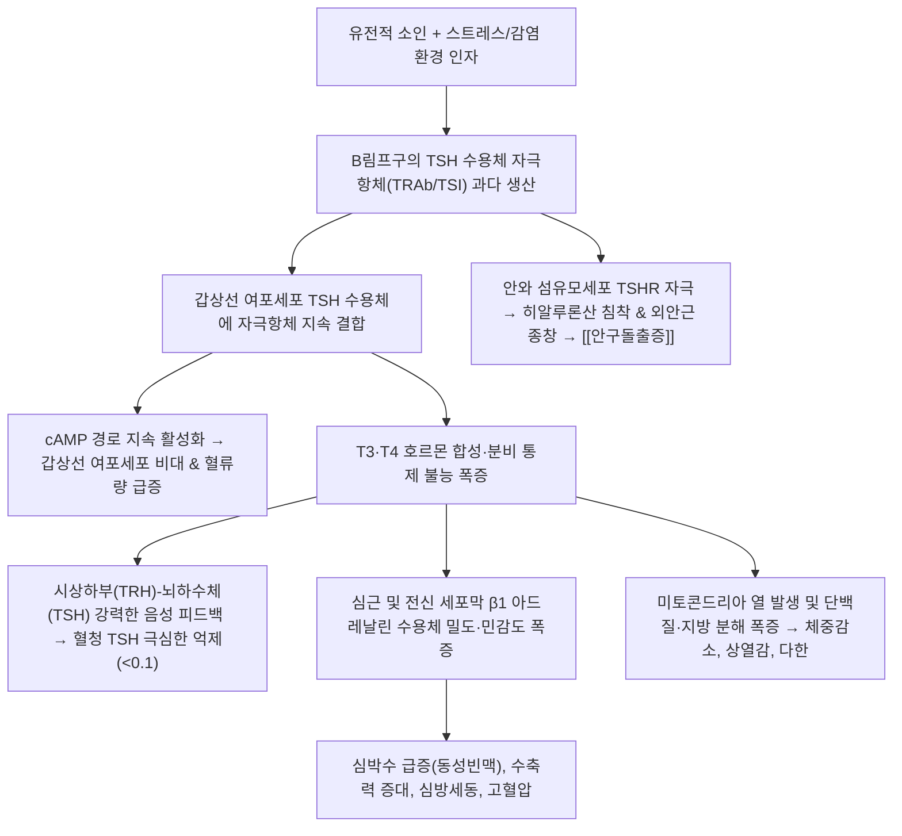

# 🩺 [[갑상선 기능 항진증]] (Hyperthyroidism / 甲狀腺機能亢進症, ICD-10: E05 / KCD: E05)

> **핵심 3줄 요약 (Key Summary)**:
> - 📍 병소 부위 & 해부·병태생리: 갑상선 여포세포에서 자가항체(TRAb/TSI)의 지속 자극 또는 자율기능항진 선종에 의해 갑상선 호르몬($T_3, T_4$)이 과다 분비되어 전신 세포 대사율이 폭증하고 교감신경계 민감도가 극대화되는 만성 내분비 대사 질환.
> - 🚩 전형적 임상 양상 & 3대 징후: 식욕 증가에도 발생하는 급격한 체중 감소, 더위 불내성 및 발한 과다, 안정 시 심계항진 및 미세 손떨림과 그레이브스병 특유의 안구돌출증 및 미만성 갑상선종.
> - 🛠️ 핵심 감별 검사 & 한·양방 다각적 치료 전략: 혈청 TSH 저하(<0.1 mIU/L) 및 Free $T_4$/$T_3$ 상승 확인, 항갑상선제([[메티마졸]], PTU) 투여 및 한의 음허양항(陰虛陽亢)·간화상염(肝火上炎) 변증에 따른 [[시호가용골모려탕]], [[안심택익탕]], [[천왕보심단]] 자음강화 치법.
> - ⚠️ 응급 의뢰 레드플래그 & 악화 요인: 감염·수술·외상·약물 중단 등으로 촉발되는 고열(>38.5℃)·중증 빈맥(>140회/분)·섬망·황달 및 울혈성 심부전을 동반한 갑상선 위기(Thyroid storm) 의심 시 즉시 상급병원 응급실 전원.

---

## 📌 목차
1. [질환 개요 & 해부학적 병태생리](#1-질환-개요--해부학적-병태생리)
2. [병태생리 메커니즘 & 생체역학적 악순환 네트워크](#2-병태생리-메커니즘--생체역학적-악순환-네트워크)
3. [임상 증상 & 이학적 검사(Physical Exam) 알고리즘](#3-임상-증상--이학적-검사physical-exam-알고리즘)
4. [감별 진단 매트릭스 (Differential Diagnosis)](#4-감별-진단-매트릭스-differential-diagnosis)
5. [한의 통합 치료 프로토콜 (침·약침·추나·한약)](#5-한의-통합-치료-프로토콜-침약침추나한약)
6. [양방 치료 & 병용·의뢰 기준 (Conventional Treatment & Referral)](#6-양방-치료--병용의뢰-기준-conventional-treatment--referral)
7. [재활 운동 & 생활습관 티칭 가이드](#6-재활-운동--생활습관-티칭-가이드)
8. [💡 사용자 진료실 핵심 필기 & 임상 노하우 (Melt-In 잔여 심화 집약)](#7--사용자-진료실-핵심-필기--임상-노하우-melt-in-잔여-심화-집약)
9. [출처 및 학술 참고 문헌 (References)](#8-출처-및-학술-참고-문헌-references)

---

## 1. 질환 개요 & 해부학적 병태생리

![[그레이브스병_안구돌출_안검퇴축_임상.jpg|360]]
> [그림 1: 그레이브스병 환자에서 관찰되는 전형적인 양측 안구돌출(Proptosis) 및 상안검 퇴축(Lid retraction) - 결막 충혈과 공막 노출 성상]

* **질환 정의 및 개념 구분**:
  * **갑상선 기능 항진증(Hyperthyroidism)**: 갑상선 실질 자체에서 갑상선 호르몬($T_3, T_4$)이 과도하게 합성·분비되어 발생하는 상태.
  * **갑상선중독증(Thyrotoxicosis)**: 갑상선 여포 파괴에 따른 일시적 호르몬 누출이나 외부 호르몬제 과량 복용을 포함하여, 원인에 관계없이 혈액 내 활성 갑상선 호르몬 농도가 병적으로 상승하여 조직 독성이 유발된 전신 증후군.
* **역학 및 호발군**:
  * 여성 유병률이 남성보다 5~10배 높으며, 30~50대에 호발함.
  * 국내외 전체 갑상선 기능 항진증의 60~80%가 자가면역 질환인 [[그레이브스병]](Graves' disease)에 의해 발생함.
* **관련 해부학적 구조물**:
  * **내분비선 실질**: 윤상연골 하부, 기관 전외측을 감싸는 갑상선 좌우엽 및 협부(Isthmus).
  * **안와 결합조직**: 안와 외안근(Extraocular muscles) 및 안와 후방 지방조직 (TSH 수용체가 발현되어 안병증의 주 타깃이 됨).
  * **자율신경 및 혈관**: 경부 교감신경간(Cervical sympathetic trunk) 및 위·아래 갑상선 동정맥망.

---

## 2. 병태생리 메커니즘 & 생체역학적 악순환 네트워크

![[갑상선기능항진증_원인감별_병태생리도해.png|380]]
> [그림 2: 연령대별 갑상선 기능 항진증의 주요 원인 질환 발생 분포 (젊은 층의 그레이브스병 vs 고령층의 중독성 다결절성 갑상선종 및 독성 선종)]

### 1) 그레이브스병 자가면역 병태생리
* **TSH 수용체 자극항체(TRAb/TSI)의 지속 자극**:
  * 자가반응성 B림프구가 생산한 TRAb(TSI)가 갑상선 여포세포 표면의 TSH 수용체에 작용제(Agonist)로 결합함.
  * 생리적 음성 피드백 조절을 완전히 무시하고 세포 내 cAMP를 지속적으로 상승시켜 여포세포 증식(미만성 갑상선종)과 $T_3, T_4$ 과잉 합성을 영구적으로 촉진함.
* **안와 및 피부 병증 메커니즘**:
  * 안와 결합조직 내 섬유모세포(Orbital fibroblast)에도 TSH 수용체가 발현되어 있어, 활성화된 CD4+ T세포가 침윤하여 사이토카인(IFN-$\gamma$, TNF-$\alpha$)을 분비함.
  * 친수성 점액다당류(GAG)를 대량 생성하여 외안근이 부풀어 오르고 지방조직이 팽창하면서 안구가 전방으로 돌출되는 **그레이브스 안병증(Graves' ophthalmopathy)**이 발생함.
  * 정강이 앞쪽 피부 섬유모세포에도 유사 반응이 일어나 **경골전 점액수종(Pretibial myxedema)**을 형성함.

### 2) 비자가면역성 원인 병태
* **중독성 다결절성 갑상선종(Toxic Multinodular Goiter)**: TSH 수용체 유전자 변이로 인해 독립적으로 호르몬을 분비하는 자율 결절이 다발성으로 발생함 (주로 50대 이상 고령층).
* **독성 선종(Toxic Adenoma)**: 단일 자율 기능성 결절이 호르몬을 과다 생산하여 방사성요오드 스캔상 단일 열결절(Hot nodule)로 관찰됨.
* **갑상선염(아급성/무통성)**: 바이러스 감염이나 자가면역 반응으로 여포 세포막이 파괴되어 기존에 저장되어 있던 콜로이드 내 호르몬이 일시에 혈중으로 누출되어 2~6주간 일과성 항진 상태를 유발함.

---

## 3. 임상 증상 & 이학적 검사(Physical Exam) 알고리즘

### 1) 전신 증상 및 장기별 이상 소견
* **대사 및 체온**: 식욕이 매우 좋아 식사량이 증가함에도 불구하고 수주~수개월 사이에 수 kg 이상의 체중 급감, 극심한 더위 불내성(Heat intolerance), 다한증.
* **심혈관계**: 안정 시에도 90~120회/분의 빈맥(Tachycardia), 가슴 두근거림, 수축기 혈압 상승 및 맥압(Pulse pressure) 증가, 고령 환자에서 **심방세동(Atrial Fibrillation)** 호발.
* **신경근육계**: 양손을 앞으로 뻗었을 때 관찰되는 미세한 손떨림(Fine tremor), 근위부 근력 약화(계단 오르기나 의자에서 일어서기 힘듦), 불안, 안절부절못함, 감정 기복, 심한 불면증.
* **소화기 & 부인과**: 장 연동운동 항진으로 인한 잦은 대변 및 묽은 변/설사, 여성의 희발월경 또는 무월경.
* **그레이브스 3대 징후 (Merseburg Triad)**: 미만성 갑상선종(Goiter), 빈맥(Tachycardia), 안구돌출(Exophthalmos).

### 2) 검사실 진단 알고리즘

| 검사 단계 | 검사 항목 | 판정 기준 및 임상적 의의 |
| :--- | :--- | :--- |
| **1단계: 기능 확인** | 혈청 TSH, Free T4, Total T3 | TSH 현저한 억제($<0.01\text{ mIU/L}$) + Free T4 또는 T3 동반 상승 시 확진 |
| **2단계: 자가면역 검사** | TRAb (TSH 수용체 항체), TSI | 양성 시 [[그레이브스병]]으로 확진 |
| **3단계: 핵의학 감별** | 방사성요오드 섭취율 (RAIU 스캔) | 미만성 균일 섭취 증가 $\rightarrow$ 그레이브스병 국소 섭취 증가 $\rightarrow$ 독성 결절 섭취율 현저한 저하($<2\%$) $\rightarrow$ 갑상선염(누출성) |
| **4단계: 초음파 평가** | 갑상선 도플러 초음파 | 갑상선 실질 전반의 혈류 폭증 소견 ("Thyroid inferno" 징후) |

---

## 4. 감별 진단 매트릭스 (Differential Diagnosis)

| 감별 질환 | 주요 원인 및 병인 | 방사성요오드 섭취율(RAIU) | 특이적 임상 감별점 |
| :--- | :--- | :--- | :--- |
| [[그레이브스병]] (본 질환) | TSH 수용체 자극 자가항체(TRAb) 과다 | 광범위 미만성 섭취 증가 | 안구돌출증, TRAb 양성, 미만성 혈류 항진 |
| 독성 다결절성 갑상선종 | TSH 비의존적 자율 기능 결절 다발 | 불균일 결절성 섭취 증가 | 결절 촉진, TRAb 음성, 고령층 호발 |
| 아급성 갑상선염 | 바이러스 감염 후 여포 파괴성 호르몬 누출 | 현저한 섭취 저하 (<2%) | 갑상선 부위 극심한 압통 및 방사통, ESR/CRP 상승 |
| 무통성/산후 갑상선염 | 자가면역성 일과성 여포 파괴 | 현저한 섭취 저하 (<2%) | 갑상선 압통 없음, 출산 후 2~6개월 호발, 일과성 |
| 갈색세포종 | 부신수질 카테콜아민 과다 분비 | 정상 갑상선 소견 | 발작성 고혈압, 두통, 창백, 소변 메타네프린 상승 |
| 공황장애 | 중추 자율신경계 급성 공황 발작 | 정상 갑상선 기능 | 발작적 10~30분간의 극심한 공포, TSH 정상 |

---

## 5. 한의 통합 치료 프로토콜 (침·약침·추나·한약)

![[메티마졸_화학구조식.png|300]]
> [그림 3: 갑상선 호르몬 합성을 차단하는 1차 표준 항갑상선제 메티마졸(Methimazole)의 2D 화학 분자 구조식 - 한의 치료는 항갑상선제 복용 중 자율신경 흥분 완화 및 간기능 보호를 위해 병용함]

* **한의학적 병전 병리**:
  * 갑상선 기능 항진증의 극심한 발한, 상열감, 심계, 수전증, 소수(消瘦, 체중감소)는 전형적인 **음허양항(陰虛陽亢)**, **간화상염(肝火上炎)** 및 **심담불녕(心膽不寧)**의 범주에 속함.
  * 오랜 항진 상태로 인체의 진액(津液)과 음혈(陰血)이 고갈되면서 화열(火熱)이 치솟아 심신(心神)을 요동치게 만듦.
* **침구 치료**:
  * **청간강화(淸肝降火) & 양심안신(養心安神)**: 태충(LR3), 행간(LR2), 심수(BL15), 신수(BL23), 신문(HT7), 내관(PC6), 풍지(GB20).
  * **경부 국소 혈류 완화**: 인영(ST9), 수돌(ST10), 천돌(CV22) 부위에 얕은 사침(斜鍼) 자극을 통해 국소 교감신경 긴장 이완.
* **약침 치료**:
  * **황련해독탕 약침 또는 청간약침**: 상열감과 심계항진이 극심할 때 풍지, 견정(GB21), 심수에 0.1~0.2cc 시술하여 중추 및 자율신경계 과흥분을 진정시킴.
* **추나 치료**:
  * **경추 자율신경 이완 추나**: 경부 교감신경절(Superior cervical ganglion)이 과항진되어 있으므로 상부 경추(C1-C3) 후두하근막 이완기법 및 경추 부드러운 신연가동술을 적용하여 교감신경성 긴장 완화.
* **한약 치료**:
  * **간화상염 및 흉협고만(가슴 답답함, 분노, 두통, 안구 충혈)**: [[시호가용골모려탕]], [[단치소요산]] 가감.
  * **음허화왕 및 심계·불면(가슴 두근거림, 식은땀, 수전증, 체중감소)**: [[천왕보심단]], [[안심택익탕]](安心澤翼湯), [[일관전]] 가감 ([[생지황]], [[현삼]], [[맥문동]], [[산조인]], [[백자인]], [[하고초]] 중심).
  * **경부 종괴(영류, 癭瘤) 및 결절 축소**: [[하고초]], [[모려]], [[패모]], [[해조]], [[곤포]]를 배오하여 연견산결(軟堅散結) 유도.

---

## 6. 양방 치료 & 병용·의뢰 기준 (Conventional Treatment & Referral)

> 🎯 **이 섹션의 목적**: 환자가 **양방약을 이미 복용 중인 경우가 많다.** 한의원 1차 진료에서 양방 치료를 이해하고, 병용 가능·주의·금기를 판단하며, 언제 의뢰할지 결정한다.

* **약물 치료 (Medication)**:
  * 계열별 약물·용량·기간 — 국내 처방 관행 반영.
  * 작용 기전과 한의 치료와의 상호작용.
* **비약물 시술 (Procedures)**:
  * 주사·차단술·물리치료·보조기 등.
* **수술·시술 적응증 (Surgical Indication)**:
  * 언제 수술로 가는가 — 절대·상대 적응증, 수술 후 경과.
* **한의 병용 판단 (Combination Therapy)**:
  * 병용 가능 / 주의 / 금기. 복용 중 환자의 감량 타이밍·반동 현상.
* **양방·전문과 의뢰 기준 (Referral Criteria)**:
  * 응급 의뢰 트리거와 전문과 의뢰 기준(정형외과·신경외과·내과 등).

	(작성 필요)

---

## 7. 재활 운동 & 생활습관 티칭 가이드

* **고강도 운동 엄격 제한**:
  * 기능 항진 상태에서는 이미 기초 심박수가 100회 이상으로 심근에 과부하가 걸려 있으므로, 호르몬 수치가 정상화될 때까지 고강도 인터벌 운동, 마라톤, 무거운 웨이트 트레이닝을 전면 금지하고 가벼운 스트레칭과 산책만 허용함.
* **교감신경 자극 물질 차단**:
  * 커피, 홍차, 녹차, 에너지드링크 등 카페인 음료와 알코올은 빈맥과 손떨림을 폭발적으로 악화시키므로 완전 금기.
* **안구 보호 및 안병증 관리**:
  * 안구돌출 환자는 안검이 완전히 감기지 않아 각막 궤양이나 건조증이 발생하기 쉬우므로 외출 시 선글라스를 착용하고 인공눈물을 수시로 점안하며, 취침 시 베개를 높여 안와 부종을 방지함.
* **금연 절대 티칭**:
  * 흡연은 그레이브스 안병증 발생 및 악화 위험도를 4배 이상 증가시키고 항갑상선제 치료 반응률을 떨어뜨리므로 즉각 금연 필수.

---

## 8. 💡 사용자 진료실 핵심 필기 & 임상 노하우 (Melt-In 잔여 심화 집약)

### 1) 갑상선 위기(Thyroid Storm) 감별 및 응급 대처 (Burch-Wartofsky 점수)
* **내분비 치명적 응급상황**:
  * 갑상선 기능 항진증 환자가 감염, 외상, 수술, 분만 또는 임의로 항갑상선제를 중단했을 때 전신 장기 부전으로 이어지는 치명적 상태(사망률 10~30%).
* **진료실 즉각 점검 체크리스트**:
  * 체온 $\ge 38.5^\circ\text{C}$의 고열.
  * 심박수 $\ge 140\text{회/분}$의 극심한 빈맥 또는 심방세동.
  * 섬망, 극도의 불안, 환각, 혼수 등 중추신경계 이상.
  * 오심, 구토, 설사, 황달(간부전 징후).
  * 위 증상 복합 발현 시 한의원 내 대증치료를 시도하지 말고 **119를 통해 즉시 상급병원 응급실로 긴급 전원**해야 함.

### 2) 항갑상선제([[메티마졸]], PTU) 복용 환자 모니터링 노하우
* **무과립구증(Agranulocytosis) 골든타임 경고 (0.2~0.5% 빈도)**:
  * 항갑상선제 투여 초기 3개월 이내에 골수 억제로 인해 호중구가 고갈되는 치명적 부작용이 발생할 수 있음.
  * **환자 필수 티칭**: *"약을 드시다가 갑자기 38도 이상의 고열이 나거나 목구멍이 찢어질 듯이 아픈 인후통이 생기면, 감기약으로 버티지 마시고 즉시 약을 중단하고 가까운 병원에 가셔서 백혈구(CBC) 수치 검사를 받으셔야 합니다."*
* **임산부 약물 선택 지침**:
  * 임신 1삼분기(임신 12주까지): 메티마졸의 태아 기형(두피 결손, 식도 폐쇄 등) 위험으로 인해 **PTU(프로필티오우라실)**를 우선 사용.
  * 임신 2~3삼분기: PTU의 모체 간독성 위험을 피하기 위해 **메티마졸**로 전환 투약.

### 3) 한의 치료의 현실적 롤(Role) 및 병용 가이드
* **호르몬 정상화 전까지는 항갑상선제 절대 유지**:
  * 그레이브스병 자가면역 기전은 한약 단독으로 급성기 호르몬 과잉을 신속 차단하기 어려우므로 메티마졸을 필수 복용시킴.
* **한의 치료의 주 타깃**:
  * 메티마졸을 복용하면서도 가라앉지 않는 **자율신경 불균형(불안, 불면, 수전증, 잔여 두근거림)** 완화.
  * 항갑상선제 장기 투여로 인한 간수치 상승(AST/ALT) 예방 및 안구 충혈 완화.
  * [[시호가용골모려탕]] 또는 [[천왕보심단]]을 병용할 때 메티마졸과 1시간 이상 복용 시차를 두어 약물 흡수 간섭을 배제함.

---

## 9. 출처 및 학술 참고 문헌 (References)

1. **Ross, D. S., et al. (2016)**. *2016 American Thyroid Association Guidelines for Diagnosis and Management of Hyperthyroidism and Other Causes of Thyrotoxicosis*. **Thyroid**, 26(10), 1343-1421.
   - `[연구 요약]`: [PubMed Link](https://pubmed.ncbi.nlm.nih.gov/27521067/) / 미국갑상선학회(ATA) 공식 가이드라인으로 그레이브스병, 독성 결절, 갑상선염의 진단 기준, 항갑상선제(메티마졸·PTU) 투약 프로토콜 및 방사성요오드·수술 적응증을 총괄 제시함.
2. **Davies, T. F., et al. (2020)**. *Graves' disease*. **Nature Reviews Disease Primers**, 6(1), 52.
   - `[연구 요약]`: [PubMed Link](https://pubmed.ncbi.nlm.nih.gov/32616746/) / 그레이브스병의 면역유전학적 발병 기전, TSH 수용체 자극항체의 병태생리, 그레이브스 안병증의 분자 메커니즘 및 최신 표적 치료 전략을 체계적으로 정리함.
3. **De Leo, S., Lee, S. Y., & Braverman, L. E. (2016)**. *Hyperthyroidism*. **The Lancet**, 388(10047), 906-918.
   - `[연구 요약]`: [PubMed Link](https://pubmed.ncbi.nlm.nih.gov/27038492/) / 갑상선 기능 항진증의 전신 역학, 심혈관계 및 대사 합병증의 병태생리학적 기전과 장기 예후 평가를 망라한 란셋 세미나 종설.
