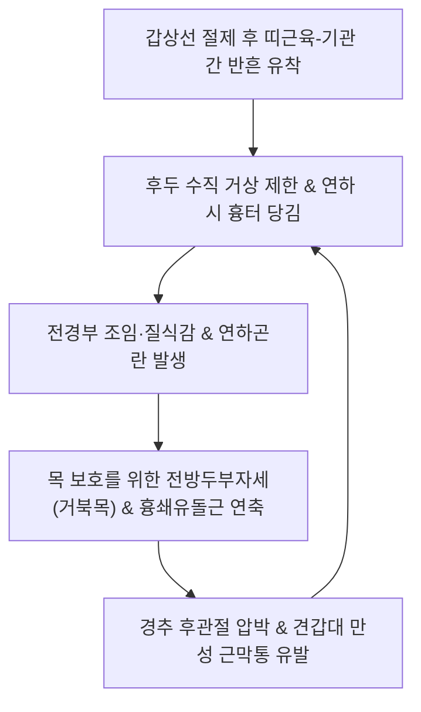

# 🩺 갑상선 수술 후 유착 증후군 (Post-Thyroidectomy Adhesion & Neck Discomfort Syndrome)

> **핵심 3줄 요약 (Key Summary)**:
> - 📍 **병소 부위 & 병태생리**: 갑상선 절제술(Thyroidectomy) 후 전경부 피부 절개선 하방의 피판(platysma flap), 띠근육([[흉골갑상근]], [[흉골설골근]]), 기관(Trachea) 및 후두 연골 사이의 정상적인 근막 활주면이 섬유성 반흔 조직으로 유착(cicatricial adhesion)되어 발생하는 기능 장애 증후군.
> - 🚩 **전형적 임상 양상**: 침을 삼키거나 목을 뒤로 젖힐 때 수술 흉터가 목 안쪽으로 깊게 딸려 들어가는 피부 견인 징후, 전경부의 옥죄는 듯한 조임과 이물감(매핵기 유사 증상), 음식물 연하 시 걸림(Dysphagia), 목소리 피로감 및 고음 발성 장애, 경부 관절 가동범위 제한.
> - 🛠️ **핵심 감별 & 한·양방 치료 전략**: 반회후두신경 손상에 의한 성대 마비, 상후두신경 외측지 손상, 부갑상선 저하증 감별. 후두경 검사(성대 가동성 정상 확인) 및 경부 초음파(연하 시 기관-띠근육 간 동적 고정 확인). 한의 경부 근막 침도 유착박리술, 피내침/호침([[인영]], [[수돌]], [[천돌]], [[염천]]), [[신바로약침]] 자입, 경추 가동 [[추나요법]], **반하후박탕**·**회수산** 투여.
> - ⚠️ **응급 의뢰 레드플래그**: 급성 호흡곤란 및 천명음(Stridor, 기도 협착/양측 성대 마비), 수술 부위 급격한 혈종 팽창(질식 위험), 테타니(Tetany, 저칼슘혈증 경련), 갑상선암 국소 재발 의심 종괴.

---

## 📌 목차
1. [질환 개요 & 병태생리 (Disease Overview)](#1-질환-개요--병태생리-disease-overview)
2. [병태생리 메커니즘 & 생체역학적 악순환 네트워크](#2-병태생리-메커니즘--생체역학적-악순환-네트워크)
3. [임상 증상 & 이학적 검사(Physical Exam) 알고리즘](#3-임상-증상--이학적-검사physical-exam-알고리즘)
4. [감별 진단 매트릭스 (Differential Diagnosis)](#4-감별-진단-매트릭스-differential-diagnosis)
5. [한의 통합 치료 프로토콜 (침·약침·추나·한약)](#5-한의-통합-치료-프로토콜-침약침추나한약)
6. [양방 치료 & 병용·의뢰 기준 (Conventional Treatment & Referral)](#6-양방-치료--병용의뢰-기준-conventional-treatment--referral)
7. [재활 운동 & 생활습관 티칭 가이드](#7-재활-운동--생활습관-티칭-가이드)
8. [💡 사용자 진료실 핵심 필기 & 임상 노하우 (Melt-In 잔여 심화 집약)](#8--사용자-진료실-핵심-필기--임상-노하우-melt-in-잔여-심화-집약)
9. [출처 및 학술 참고 문헌 (References)](#9-출처-및-학술-참고-문헌--references)

---

## 1. 질환 개요 & 병태생리 (Disease Overview)

갑상선 수술 후 유착 증후군(Post-Thyroidectomy Adhesion Syndrome, 흔히 `Post-Thyroidectomy Neck Discomfort Syndrome`)은 갑상선 부분절제술 또는 전절제술 후 성대 마비와 같은 뚜렷한 신경학적 손상이 없음에도 불구하고, 수술 부위의 조직 유착으로 인해 전경부 통증, 옥죔, 연하장애, 발성 장애를 만성적으로 호소하는 임상 질환이다.

### 1) 해부학적 유착 층위
- **피하 활주면 소실**: 경부 절개 시 박리되는 활경근(Platysma) 하부 지방층과 심경근막(Deep cervical fascia) 얕은 층 사이의 유착.
- **띠근육-기관 유착 (Strap muscle-Tracheal Adhesion)**:
  - 갑상선 전면을 덮는 설골하근군([[흉골설골근]], [[흉골갑상근]], [[갑상설골근]])과 기관 전벽 및 윤상연골(Cricoid cartilage) 사이가 흉터 조직으로 단단히 결합됨.
  - 정상 연하 시 후두와 기관은 약 1.5~2.5cm 상방으로 유연하게 거상되어야 하나, 유착으로 인해 수직 이동성이 고정됨.

---

## 2. 병태생리 메커니즘 & 생체역학적 악순환 네트워크

### 1) 후두 수직 활주 장애와 연하 동역학 파탄
- 음식물을 삼킬 때 후두개(Epiglottis)가 뒤로 눕고 후두가 전상방으로 당겨져 기도를 폐쇄해야 식도로 안전하게 넘어감.
- 수술 후 섬유성 유착으로 기관-후두 거상이 제한되면, 혀뿌리와 인두 수축근의 보상적 과부하가 발생하여 삼킴 시 목에 이물감이 걸리고 통증이 유발됨.

### 2) 경추-견갑대 보상적 긴장 악순환

---

## 3. 임상 증상 & 이학적 검사(Physical Exam) 알고리즘

### 1) 주요 임상 증상
- **전경부 조임 및 이물감 (Choking/Strangling Sensation)**: 목에 단단한 띠를 두른 것처럼 갑갑하고 목을 조이는 느낌 (환자 표현: "목에 모래나 솜뭉치가 걸려 있는 것 같다").
- **피부 함몰 및 연하통**: 침을 삼킬 때 수술 흉터선이 기관에 붙어 안쪽으로 쑥 빨려 들어가며 찌릿한 당김통 유발.
- **경부 신전 제한**: 목을 뒤로 젖히는 동작 시 전경부 피부와 근육이 팽팽하게 당겨져 가동범위 감소.
- **음성 피로 (Vocal Fatigue)**: 성대 자체는 정상이나 후두 외근의 유착으로 고음을 내거나 오래 말할 때 목이 쉬고 피로함.

### 2) 특이적 이학적 검사법
1. **연하 시 흉터 이동 검사 (Deglutition Scar Tethering Sign)**:
   - 환자에게 침을 삼키게 하면서 수술 절개창을 관찰. 흉터가 기관을 따라 상하로 부드럽게 활주하지 못하고 피부가 안쪽으로 심하게 함몰(puckering/dimpling)되면 양성.
2. **후두 수동 가동성 검사 (Passive Laryngeal Mobility Test)**:
   - 검사자가 엄지와 검지로 갑상연골을 쥐고 좌우로 부드럽게 흔들 때(Laryngeal crepitus 유도), 건측이나 정상인에 비해 수평 활주가 굳어 있고 저항감이 느껴지면 유착 확진.
3. **경부 신전 가동범위 측정 (Cervical Extension Test)**:
   - 목을 뒤로 젖힐 때 흉골상절흔 부위의 통증 및 당김으로 45도 미만에서 제한되는지 평가.

---

## 4. 감별 진단 매트릭스 (Differential Diagnosis)

| 질환 | 주증상 및 발병 양상 | 신체 검진 및 특이 소견 | 핵심 감별 검사 |
| :--- | :--- | :--- | :--- |
| **[[갑상선 수술 후 유착 증후군]]** | 연하 시 흉터 함몰, 전경부 조임, 목 이물감 | 성대 가동성 정상, 후두 수직 활주 제한 | 후두경 검사(정상 성대), 경부 초음파(유착) |
| **반회후두신경 손상 (RLN Palsy)** | 쉰 목소리(Hoarseness), 사래 들림 | 한쪽 성대의 완전 마비 및 정중위 고정 | 후두경 상 편측 성대 운동 소실 |
| **상후두신경 외측지 손상 (EBSLN)** | 고음 발성 불능, 목소리 피로, 모노톤 | 윤상갑상근 마비로 고음역대 소실 | 후두 스트로보스코피 |
| **저칼슘혈증 (Hypocalcemia)** | 입 주위 저림, 손발 경련(Tetany) | 부갑상선 손상에 의한 혈중 칼슘 저하 | Chvostek 징후 양성, Trousseau 징후 양성 |
| **매핵기(梅核氣) / 신경성 식도이환** | 스트레스 시 목구멍 이물감, 뱉어도 안 나옴 | 수술 병력 무관 또는 심인성 원인 | 신체 기질적 이상 없음, 정서적 유발 |

---

## 5. 한의 통합 치료 프로토콜 (침·약침·추나·한약)

### 1) 침구 및 침도 치료 (Acupuncture & Acupotomy)
- **주요 혈위**: [[인영]](ST9), [[수돌]](ST10), [[천돌]](CV22), [[염천]](CV23), [[예풍]](TE17), [[풍지]](GB20), [[합곡]](LI4).
- **미세 침도 유착박리술 (Acupotomy Adhesiolysis)**:
  - 0.35×25mm 소침도를 사용하여 수술 흉터선 주위의 피하 섬유성 유착 밴드를 수평 방향으로 진입하여 미세하게 박리(Subcutaneous peeling technique).
  - 경동맥초(Carotid sheath) 주행을 피해 정중선 띠근육 부착부 위주로 안전하게 박리하여 피부 함몰을 해소.
- **피내침 및 호침 치료**:
  - 절개창 양측 모서리에 0.20×15mm 호침으로 횡자 자입하여 국소 미세혈류 순환 촉진 및 비후성 반흔 연화.

### 2) 약침 치료 (Pharmacopuncture Protocol)
- **[[신바로약침]] (GCSB-5)**:
  - 흉골설골근 및 설골 상하근 유착 부위에 1.0cc를 피하 및 근막 사이에 주입하여 반흔 조직의 과도한 섬유화를 억제하고 조직 유연성 회복.
- **자하거약침 (Hominis Placenta)**:
  - 수술 후 피부 위축 및 만성 건조감이 심한 환자에게 0.5cc 주입하여 혈액 순환 및 국소 재생 유도.

### 3) 추나 의학 (Chuna Manual Therapy)
- **경부 전면 근막이완기법 (Anterior Neck MFR)**:
  - 환자의 머리를 살짝 뒤로 젖힌 상태에서 술자의 손바닥과 지문포로 쇄골 상와와 전경부 근막을 부드럽게 접촉하여 후두 방향으로 신장(Skin rolling & Myofascial gliding).
- **설골 및 후두 가동화 기법 (Hyolaryngeal Mobilization)**:
  - 설골과 갑상연골을 수평 방향으로 부드럽게 흔들어 측방 가동성 회복.

### 4) 한약 치료 (Herbal Medicine)
- **담기울결(痰氣鬱結), 매핵기양 조임 증상**:
  - **반하후박탕(半夏厚朴湯)**: 반하, 후박, 복령, 생강, 소엽으로 구성되어 목 안의 이물감과 조임을 해소하고 인후 신경을 안정시킴.
- **수술 후 어혈 및 반흔 섬유화**:
  - **회수산(回首散)** 또는 **당귀수산(當歸鬚散)**: 수술 후 국소 어혈을 풀고 경부 근육의 굴신 불리를 치료.
- **기혈양허 및 조직 위축**:
  - **보중익기탕(補中益氣湯)** 가미방: 수술 후 전신 쇠약 및 음성 무력 개선.

---

## 6. 양방 치료 & 병용·의뢰 기준 (Conventional Treatment & Referral)

### 1) 양방 보존적 치료 및 중재술
- **흉터 연고 및 실리콘 시트**: 수술 초기 비후성 흉터 형성 방지.
- **초음파 유도하 수압박리술 (Hydrodissection)**:
  - 생리식염수와 국소마취제를 혼합하여 띠근육과 기관 전벽 사이에 주입함으로써 수액의 물리적 압력으로 유착 박리.
- **보툴리눔 톡신(Botox) 주사**: 띠근육의 과도한 반사성 연축 완화.

### 2) 한의 병용 가이드라인
- 갑상선 호르몬제(Synthyroid 등)를 복용 중인 환자는 호르몬 수치 안정화를 위해 양약 복용을 철저히 유지하면서, 한의 근막 치료와 한약을 병용하여 연하장애를 개선함.

### 3) 양방·전문과 응급 의뢰 기준 (Referral Criteria)
- **즉시 응급실 전원 (Red Flags)**:
  - 수술 부위가 갑자기 팽창하며 호흡곤란 및 천명음(stridor)이 발생하는 경우 (수술창 혈종에 의한 기도 압박).
  - 손발 끝이 꼬이고 입 주위가 굳어지는 급성 테타니 경련 (부갑상선 기능저하성 저칼슘혈증).
  - 후두경 검사상 양측 성대가 모두 마비되어 기도가 좁아진 경우.

---

## 7. 재활 운동 & 생활습관 티칭 가이드

### 1) 전경부 자가 신장 운동 (Neck Extension Stretch)
- 양손을 쇄골과 흉골 상단에 얹고 아래로 지그시 누른 상태에서 턱을 천장 쪽으로 천천히 들어 올려 전경부 피부를 15초간 신장 (하루 5회 반복).
### 2) 흉터 자가 마사지 (Scar Mobilization)
- 수술창이 완전히 아문 후, 흉터 양쪽 피부를 손가락으로 가볍게 집어 들어 올리면서 상하좌우로 굴리는 롤링 마사지 시행 (조직 간 박리 유도).
### 3) 설골 거상 연하 훈련 (Mendelsohn Maneuver)
- 침을 삼키는 순간 목젖(갑상연골)이 가장 높이 올라갔을 때 그 위치에서 2~3초간 힘을 주고 멈추었다가 내리는 훈련으로 후두 거상 근력 강화.

---

## 8. 💡 사용자 진료실 핵심 필기 & 임상 노하우 (Melt-In 잔여 심화 집약)

### 1) 매핵기(梅核氣)와 수술 후 유착의 명확한 선 긋기
- 갑상선 수술 후 목에 이물감이 있다고 호소하는 환자를 단순 신경성 화병이나 [[매핵기]]로 치부해서는 안 된다.
- 환자에게 물을 한 모금 삼키게 하면서 수술 흉터를 보면, **흉터가 목 안으로 쏙 빨려 들어가며 피부가 주름지는 기계적 유착(Tethering)**이 눈으로 확인된다.
- 이는 심인성이 아닌 100% 해부학적 근막 유착이므로, 반드시 미세 침도나 수기 근막이완술로 겉 피부와 속 기관 사이를 뜯어주어야만 이물감이 완전히 사라진다.

### 2) 안전한 흉터 피하 박리 침법
- 전경부는 바로 아래에 기관과 경동맥이 있으므로 수직 직자는 절대 금물이다.
- 흉터의 가장자리 건전한 피부에서 침체를 거의 눕혀(5~10도 각도) 피하 지방층으로 횡자 진입한 뒤, 침 끝을 살짝 들어 올려 흉터 밑을 부채살 모양으로 가볍게 긁어주는 **피하 평자 부채살 박리법**이 가장 안전하고 효과가 극적이다.

---

## 9. 출처 및 학술 참고 문헌 (References)

- Ahmad Albarari SS, Salah Al-Tamary AR, Salah Al-Tamary HR et al. (2026). Efficacy of Antiadhesion Barriers on Swallowing Function After Thyroidectomy: A Systematic Review and Meta-analysis. *J Surg Res*. 321():531-542. PMID: 41946022

- Huang C, Wu J, Xia T et al. (2026). Preservation of thyroid cartilage mobility via lateral cervical approach mitigates anterior neck dysfunction following hemithyroidectomy. *Eur Arch Otorhinolaryngol*. 283(5):3253-3261. PMID: 41904294

- Qin X, Liu X, Zhang Y et al. (2026). Association of long-term quality of life, safety, and efficacy: robotic vs. open thyroidectomy for benign thyroid nodules. *Int J Surg*. 112(1):1244-1251. PMID: 41159403

---

## 관련 노트

- [[갑상선]]
- [[인영]]
- [[천돌]]
- [[신바로약침]]
- [[추나요법]]
- [[반하후박탕]]
- [[흉골설골근]]
- [[흉골갑상근]]
- [[연하장애]]
