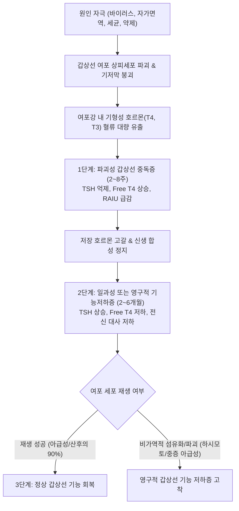
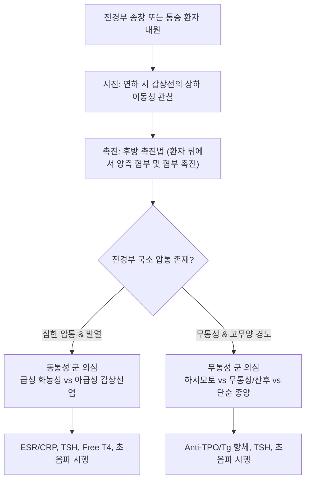

# 🩺 갑상선염 (Thyroiditis)

> **핵심 3줄 요약 (Key Summary)**:
> - 📍 **병소 부위 & 해부·병태생리**: 경부 전면 후두 및 기관을 감싸는 갑상선 실질의 감염성, 자가면역성, 약제유발성, 또는 파괴성 염증 질환군으로, 여포 세포 손상에 따른 저장 갑상선 호르몬의 유출과 이후 기능 저하를 초래함.
> - 🚩 **전형적 임상 양상**: 동통성 질환(급성 화농성, [[아급성 갑상선염]])의 경부 방사통·압통·[[발열]]부터, 무통성 질환([[하시모토 갑상선염]], 산후 갑상선염, 무통성 갑상선염, 리델 갑상선염)의 무통성 미만성 갑상선종 및 진행성 전신 [[피로]]까지 다양한 스펙트럼을 나타냄.
> - 🛠️ **핵심 검사 & 치료 전략**: 혈청 [[TSH]], Free T4, 항TPO 항체, ESR/CRP 및 갑상선 초음파·방사성 요오드 섭취율(RAIU) 감별을 바탕으로 급성기 소염 진통, 중독기 [[베타차단제]] 대증 치료 및 한의학적 영류(癭瘤) 변증(간울기체, 간화작염, 비신양허) 침구·한약 통합 치료를 시행함.
> - ⚠️ **응급 의뢰 레드플래그**: 고열 및 경부 전면의 파동감·급속 종창(급성 화농성 감염), 기도 압박에 의한 급성 호흡곤란·천명, 연하장애 급악화, 갑상선 중독 발작(Thyroid Storm) 징후(초고열, 빈맥, 섬망).

---

## 📌 목차
1. [질환 개요 & 해부학적 병태생리](#1-질환-개요--해부학적-병태생리)
2. [병태생리 메커니즘 & 생체역학적 악순환 네트워크](#2-병태생리-메커니즘--생체역학적-악순환-네트워크)
3. [임상 증상 & 이학적 검사(Physical Exam) 알고리즘](#3-임상-증상--이학적-검사physical-exam-알고리즘)
4. [감별 진단 매트릭스 (Differential Diagnosis)](#4-감별-진단-매트릭스-differential-diagnosis)
5. [한의 통합 치료 프로토콜 (침·약침·추나·한약)](#5-한의-통합-치료-프로토콜-침약침추나한약)
6. [양방 치료 & 병용·의뢰 기준 (Conventional Treatment & Referral)](#6-양방-치료--병용의뢰-기준-conventional-treatment--referral)
7. [재활 운동 & 생활습관 티칭 가이드](#7-재활-운동--생활습관-티칭-가이드)
8. [💡 사용자 진료실 핵심 필기 & 임상 노하우 (Melt-In 잔여 심화 집약)](#8--사용자-진료실-핵심-필기--임상-노하우-melt-in-잔여-심화-집약)
9. [출처 및 학술 참고 문헌 (References)](#9-출처-및-학술-참고-문헌-references)

---

## 1. 질환 개요 & 해부학적 병태생리

### 1) 개념 정의 및 임상 분류
갑상선염(Thyroiditis)은 갑상선 실질에 발생하는 염증성 병변의 총칭으로, 단일 질환이 아니라 발병 기전, 통증 유무, 임상 경과에 따라 매우 이질적인 질환군을 포함한다. 임상적으로는 경부 통증 동반 여부에 따라 **동통성 갑상선염(Painful thyroiditis)**과 **무통성 갑상선염(Painless thyroiditis)**으로 크게 대별된다.

| 분류군 | 대표 질환 | 주된 원인 및 병태 | 통증 유무 |
| :--- | :--- | :--- | :--- |
| **급성 갑상선염 (Acute)** | 급성 화농성 갑상선염 (Infectious/Suppurative) | 세균 감염 (이상와 누공 동반 빈번) | 심한 국소 동통, 압통, 발열 |
| **아급성 갑상선염 (Subacute)** | [[아급성 갑상선염]] (De Quervain's/육아종성) | 바이러스 감염 후 면역 반응 | 전경부 방사통, 연하통, 압통 |
| **만성 자가면역 (Chronic)** | [[하시모토 갑상선염]] (만성 림프구성) | 자가항체 매개 여포 파괴 | 전형적으로 무통성, 갑상선종 |
| **특수 아급성/만성** | 무통성 갑상선염, 산후 갑상선염, 약제 유발성(면역관문억제제, 아미오다론) | 림프구 침윤, 면역 탈억제, 약물 세포독성 | 무통성, 일과성 기능이상 |
| **섬유화성 (Invasive)** | 리델 갑상선염 (Riedel's thyroiditis, IgG4 관련) | 광범위한 섬유화 조직 증식 | 석재양 경화, 국소 압박감 |

### 2) 국소 해부 구조와 주변 조직의 인접 관계
갑상선은 경부 기관(Trachea) 전외측, 갑상연골 바로 아래 위치하는 나비 모양의 내분비선이다.
- **피막 및 근막**: 고유 피막(Capsule)과 내장근막(Visceral fascia)에 싸여 있으며, 전면은 [[흉골설골근]], [[견갑설골근]], [[광경근]], 그리고 외측은 [[흉쇄유돌근]]에 의해 덮여 있다.
- **후면 인접 구조**: 반회후두신경(Recurrent laryngeal nerve)이 기관식도구(Tracheoesophageal groove) 주행선상에 근접하며, 식도 및 부갑상선이 접해 있다.
- **신경 지배 및 방사통 통로**: 염증으로 피막이 팽창되면 경경막 신경(Cervical cutaneous nerve, C2-C3) 및 미주신경 분지를 통해 통증이 하악골, 귓바퀴 후면, 유양돌기 부위로 방사된다.

---

## 2. 병태생리 메커니즘 & 생체역학적 악순환 네트워크

### 1) 파괴성 갑상선염(Destructive Thyroiditis)의 3단계 전형적 경과
자가면역 또는 바이러스 등에 의해 여포 상피세포가 융해되면, 여포강(Follicular lumen) 내에 티로그로불린(Thyroglobulin) 형태로 저장되어 있던 갑상선 호르몬이 순환계로 쏟아져 나온다.
1. **갑상선 중독기 (Thyrotoxic phase)**: 수주간 혈청 Free T4, T3가 급상승하고 네거티브 피드백에 의해 [[TSH]]가 억제된다. 갑상선 호르몬의 신규 합성은 억제되어 있으므로 방사성 요오드 섭취율(RAIU)은 기저치 이하(<1~2%)로 억제된다.
2. **일과성 기능 저하증기 (Hypothyroid phase)**: 누출된 호르몬이 대사되어 고갈된 후, 파괴된 여포 상피가 회복되기까지 호르몬 결핍 상태가 지속된다. TSH가 상승하고 Free T4가 하강하며, 피로, 부종, 체중 증가가 동반된다.
3. **회복기 (Recovery phase)**: 염증이 진정되고 여포 세포가 재생되면서 호르몬 합성능이 정상화된다. 단, [[하시모토 갑상선염]]의 경우 광범위한 자가면역 림프구 침윤과 섬유화로 인해 영구적 기능저하로 이행한다.

### 2) 연부조직 긴장과 경부 생체역학적 상호작용
갑상선 염증 및 피막 팽창은 경부 전면부 심근막과 천근막의 긴장도를 증가시키며, 환자는 통증 회피를 위해 경추 전만 감소 및 두부전방자세(Forward head posture)를 취하게 된다. 이는 [[흉쇄유돌근]], [[사각근]], [[승모근]]의 과긴장을 유발하여 긴장성 두통 및 경부 운동 제한의 악순환을 형성한다.

---

## 3. 임상 증상 & 이학적 검사(Physical Exam) 알고리즘

### 1) 주요 임상 증상
- **전신 증상**: 급성 염증성 질환의 경우 [[발열]], 오한, 전신 쇠약감. 중독기에는 심계항진, 열 불내성, 발한, 체중 감소, 신경과민. 저하기에는 피로감, 추위 불내성, 전신 부종.
- **국소 증상**: 전경부 통증, 압통, 연하 시 악화되는 목 통증, 턱이나 귀로 뻗치는 방사통, 음성 변화, 목의 팽만감 및 이물감.

### 2) 진료실 이학적 검사 절차

- **후방 촉진법(Posterior Palpation Technique)**:
  - 검사자가 환자 뒤에 서서 환자의 턱을 살짝 숙이게 하여 경부 근육([[광경근]], [[흉쇄유돌근]])을 이완시킨다.
  - 양측 인지와 중지를 윤상연골(Cricoid cartilage) 바로 아래에 위치시키고, 침을 삼키게 하면서 협부(Isthmus) 및 양측 엽(Lobes)의 크기, 경도, 표면 결절 유무, 압통 여부를 평가한다.
  - 급성 화농성은 편측성 심한 발적·열감·파동감을 동반하며, [[아급성 갑상선염]]은 경결성이고 건드리기만 해도 자지러지는 극심한 압통을 나타낸다. 반면 [[하시모토 갑상선염]]은 미만성이고 고무 지우개 같은(Firm/rubbery) 탄력성 경도를 보이며 통증이 없다.

---

## 4. 감별 진단 매트릭스 (Differential Diagnosis)

| 감별 항목 | 갑상선염 (전형적 파괴성) | 그레이브스병 (Graves' disease) | 단순/결절성 갑상선종 | 급성 인후두염 / 편도염 |
| :--- | :--- | :--- | :--- | :--- |
| **병리기전** | 여포 손상에 따른 저장 호르몬 누출 | TSH 수용체 자극 항체(TSAb)에 의한 지속 과합성 | 요오드 결핍, 과형성 결절 | 인두 및 편도 점막 세균/바이러스 감염 |
| **방사성 요오드 섭취율(RAIU)** | **현저히 저하 (< 1~2%)** | **미만성 고섭취 (> 35~80%)** | 정상 또는 결절성 국소 섭취 | 정상 |
| **갑상선 도플러 초음파** | 혈류 신호 감소 (파괴기) | **갑상선 폭풍우 (Thyroid storm flow, 현저한 혈류 증가)** | 결절 주위 혈류 또는 정상 | 경부 림프절 비대 외 갑상선 혈류 정상 |
| **혈청 자가항체** | Anti-TPO 양성(하시모토/산후) 또는 음성 | **TRAb / TBII 양성 (>95%)** | 대개 음성 | 음성 |
| **전신/안구 징후** | 안병증 없음 | **침윤성 안병증(Exophthalmos), 전경골 점액수종** | 없음 | 발열, 편도 삼출물 |

---

## 5. 한의 통합 치료 프로토콜 (침·약침·추나·한약)

한의학에서 갑상선염은 경부의 멍울과 염증을 포괄하는 **영류(癭瘤)**, **영병(癭病)**의 범주에 속하며, 정서적 울체(기체담응)와 장부 기능 실조(간화작염, 비신양허)를 핵심 병기로 파악한다.

### 1) 변증별 다용 처방

| 변증 유형 | 주증 및 설맥 | 치법 | 다용 한약 처방 |
| :--- | :--- | :--- | :--- |
| **간화작염 (肝火灼炎)** | 경부 급성 작열통, 심계항진, 다한, 조급이노, 설홍태황, 맥현삭 | 청간사화 (淸肝瀉火), 소종지통 | [[시호청간탕]], [[황련해독탕]] 가감 ([[황련]], [[황금]], [[치자]], [[연교]], [[목단피]]) |
| **기체담응 (氣滯痰凝)** | 전경부 무통성 팽만감, 흉민, 매핵기, 정서 억울, 설담홍태백니, 맥현활 | 소간이기 (疏肝理氣), 화담연견 | [[소요산]] 합 [[이진탕]] 가 [[반하]], [[진피]], [[패모]], [[하고초]], [[현삼]] |
| **기음양허 (氣陰兩虛)** | 중독기 경과 후 심계, 도한, 구갈, 무력감, 설홍소태, 맥세삭 | 익기양음 (益氣養陰), 건비보신 | 생맥산 합 [[육미지황탕]] 가 [[생지황]], [[맥문동]], [[오미자]], [[산약]], [[산수유]] |
| **비신양허 (脾腎陽虛)** | 기능 저하기 전신 무기력, 한증, 안면 및 수족 부종, 서맥, 설담반 맥침지 | 온보비신 (溫補脾腎), 온양화습 | [[이중탕]] 또는 [[진무탕]] 가 [[황기]], [[백출]], [[건강]], [[부자]], [[육계]] |

### 2) 침구 및 약침 치료
- **근위혈 (경부 국소 순환 개선 및 근막 긴장 완화)**:
  - 인영(ST9), 수돌(ST10), 기사(ST11), 천돌(CV22): 갑상선 및 기관 인접 경혈로 심자(Deep insertion)를 금하고, 혈관 맥동을 피해 0.3~0.5촌 사자(Oblique needling)하여 피막 긴장도를 완화한다.
- **원위혈 (장부 경락 조절)**:
  - 태충(LR3), 내관(PC6): 간기울결 및 심계항진 조절.
  - 족삼리(ST36), 음릉천(SP9), 삼음교(SP6): 수습 정체 및 비위 기능 정상화.
  - 풍지(GB20), 견정(GB21): 경견부 연부조직 긴장 해소.
- **약침 치료**:
  - 급성기 및 동통기: 황련해독탕 약침 또는 중성어혈 약침을 전경부 아시혈 및 인영 혈위에 극소량(0.1~0.2cc) 점적 주입하여 국소 염증 반응을 억제.
  - 만성 기능저하기: 자하거 약침 또는 산삼 약침을 신수(BL23), 비수(BL20)에 시술하여 면역 대사 기능 촉진.

### 3) 추나치료 (경부 및 상흉추 정렬 기법)
- 전경부 부종과 염증으로 인한 경추 전만의 변형과 상흉추 가동성 저하를 개선하기 위해 **상부 흉추 신전-유동화 기법(Upper Thoracic Mobilization)** 및 **경추 근막 이완술(Cervical Myofascial Release)**을 적용한다.
- 흉쇄유돌근 및 사각근 이완 기법을 병행하여 림프 배액(Lymphatic drainage)을 돕고 경부 압박감을 완화한다.

---

## 6. 양방 치료 & 병용·의뢰 기준 (Conventional Treatment & Referral)

### 1) 양방 약물 치료
- **대증 소염 진통제**:
  - 경증~중등도 동통성 갑상선염: [[NSAIDs]]([[이부프로펜]] 400~800mg tid) 또는 고용량 [[아스피린]] 투여.
  - 중증 동통 및 고열: 경구 [[프레드니솔론]](Prednisolone 30~40mg/day) 투여 후 통증 경감에 따라 수주에 걸쳐 서서히 감량(Tapering).
- **중독기 교감신경 차단제**:
  - 심계항진, 진전 완화를 위해 [[베타차단제]](Propranolol 10~40mg tid 또는 Atenolol 25~50mg qd) 사용. 항갑상선제(메티마졸, PTU)는 파괴성 갑상선염에서 효과가 없으므로 사용하지 않음.
- **기능저하기 호르몬 대체 요법**:
  - 증상이 현저하거나 TSH > 10 mIU/L인 경우 레보티록신(Levothyroxine, LT4)을 투여하며, 일과성일 경우 3~6개월 후 감량 및 중단 시도.

### 2) 한의 병용 가이드라인
- **NSAIDs/스테로이드 복용 환자**: 한약 투여 시 위장관 부담을 고려하여 [[백출]], [[복령]], [[진피]], [[감초]] 등 건비화위(健脾和胃) 약재를 배오하며, 스테로이드 감량기 반동 현상(Rebound pain)을 예방하기 위해 청열해독 한약을 병용한다.
- **베타차단제 병용 환자**: 서맥 유발 가능성에 주의하여 맥박을 모니터링하며 청심안신 한약을 병용한다.

### 3) 양방 및 상급병원 의뢰 기준 (Referral Criteria)
- **응급 의뢰**: 급성 화농성 의심 소견(고열, 경부 파동감, 백혈구 급증), 급성 호흡곤란, 천명음, 급성 연하불능.
- **전문과(내분비내과) 의뢰**: 항체 음성이면서 결절이 동반된 석재양 경화 소견(미분화암, 림프종, 리델 갑상선염 감별 필요 시), 임신 중 발병한 갑상선염, TSH 조절이 난치성인 경우.

---

## 7. 재활 운동 & 생활습관 티칭 가이드

### 1) 경부 자가 이완 및 림프 순환 스트레칭
- **광경근 및 흉쇄유돌근 스트레칭**: 의자에 바른 자세로 앉아 양손을 쇄골 바로 위에 얹어 고정하고, 턱을 천천히 45도 상방으로 들어 올려 경부 전면부 근막을 부드럽게 신장시킨다(15초 유지, 3회 반복).
- **견갑대 후하방 안정화 운동**: 날개뼈를 모으고 가슴을 펴는 흉곽 개방 동작을 통해 경추와 흉추의 정렬을 바로잡는다.

### 2) 식이 및 생활습관 수칙
- **과도한 요오드(Iodine) 섭취 제한**: 다시마, 미역, 김 등 해조류의 과도한 고용량 섭취나 다시마 환 복용은 여포 내 염증 및 자가면역 반응을 악화(Wolff-Chaikoff effect 및 탈출 기전 실패)시킬 수 있으므로 적정 수준으로 제한한다.
- **급성기 고강도 운동 금지**: 중독기에는 심장에 과부하가 걸리므로 고강도 유산소 운동이나 웨이트 트레이닝을 피하고 절대 안정을 취한다.

---

## 8. 💡 사용자 진료실 핵심 필기 & 임상 노하우 (Melt-In 잔여 심화 집약)

### 1) 1차 진료실 감별의 승부처: '통증'과 '발병 속도'
- 환자가 "목이 아파서 감기인 줄 알고 이비인후과에 갔는데 약을 먹어도 낫지 않고 귀 뒤까지 쑤신다"고 호소하면 반드시 윤상연골 부위를 가볍게 촉진해야 한다. 손을 대자마자 흠칫 놀랄 정도의 압통이 있으면 90% 이상 [[아급성 갑상선염]]이다.
- 반면 목에 불룩한 이물감이 있으면서 통증은 없고 피로감과 체중 증가를 호소하면 [[하시모토 갑상선염]] 가능성이 높으므로 TSH와 TPO 항체 검사를 권고해야 한다.

### 2) 항갑상선제 오처방 방지 주의
- 혈액검사 상 Free T4가 높고 TSH가 낮게 나오면 초심 임상의는 그레이브스병으로 오인하여 항갑상선제(메티마졸)를 처방하기 쉽다. 파괴성 갑상선염은 합성이 항진된 것이 아니라 찢어진 세포에서 새어 나오는 것이므로 항갑상선제를 복용하면 조기에 심각한 갑상선 기능저하증에 빠지게 된다. 반드시 RAIU 또는 도플러 초음파 소견을 확인해야 한다.

---

## 9. 출처 및 학술 참고 문헌 (References)

Toschetti T, et al. (2025). Acute Suppurative and Subacute Thyroiditis: From Diagnosis to Management. *J Clin Med*. 14(9):. PMID: 40364264.

Duntas LH. (2026). Hashimoto's thyroiditis: two decades on. *Lancet Diabetes Endocrinol*. ():. PMID: 42843400.

Yuan S, et al. (2025). The progression of TRAb-positive subacute thyroiditis and its differential diagnosis from Graves' disease. *Front Immunol*. 16():1727240. PMID: 41488629.

---

## 관련 노트

- [[아급성 갑상선염]]
- [[하시모토 갑상선염]]
- [[갑상선 수술 후 유착 증후군]]
- [[TSH]]
- [[요오드]]
- [[베타차단제]]
- [[NSAIDs]]
