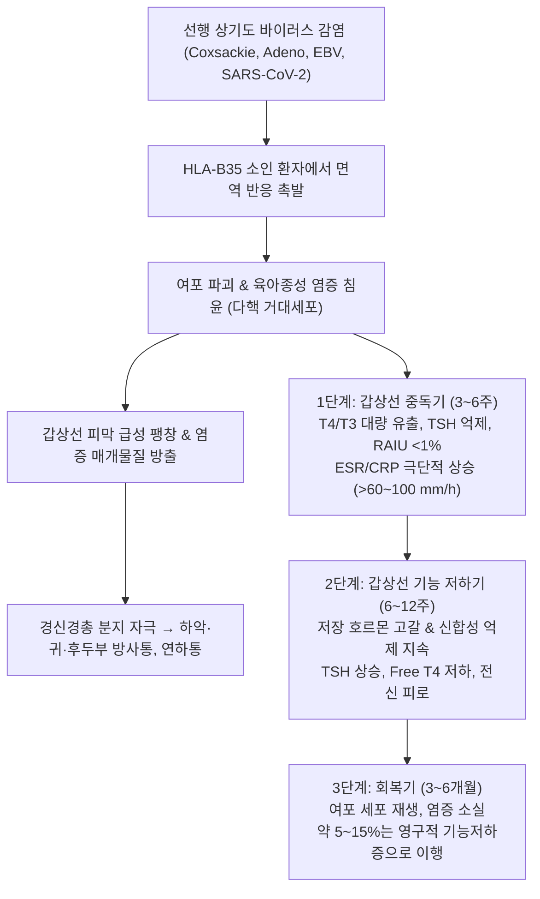
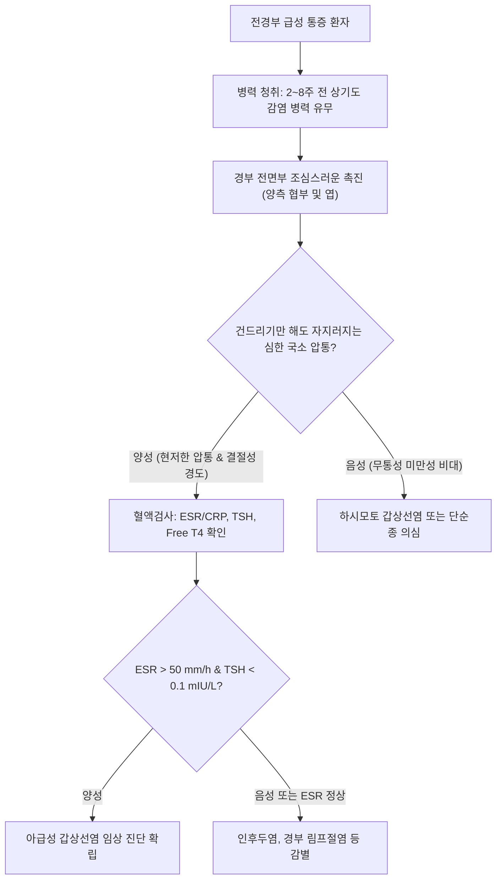

# 🩺 아급성 갑상선염 (Subacute Thyroiditis, De Quervain's Thyroiditis)

> **핵심 3줄 요약 (Key Summary)**:
> - 📍 **병소 부위 & 해부·병태생리**: 주로 상기도 바이러스 감염 후 발생하는 일과성 육아종성(Granulomatous) 염증 질환으로, 다핵 거대세포(Multinucleated giant cells) 침윤과 갑상선 여포 붕괴로 인해 저장 갑상선 호르몬의 대량 누출이 일어남.
> - 🚩 **전형적 임상 양상**: 특징적인 전경부 극심한 자발통 및 편측에서 시작하여 반대측으로 이동하는 침윤성 방사통(하악각, 귀 뒤, 후두부), 침을 삼킬 때 악화되는 연하통, [[발열]], 중독기 심계항진 및 전신 쇠약.
> - 🛠️ **핵심 검사 & 치료 전략**: ESR 및 CRP의 현저한 급상승, [[TSH]] 억제 및 Free T4 상승, 방사성 요오드 섭취율(RAIU) 극저하(<1%), 초음파상 불규칙한 저에코 결절 양상 확인. 대증적으로 [[NSAIDs]]([[이부프로펜]]) 또는 [[프레드니솔론]], 심계 완화를 위한 [[베타차단제]]를 사용하며, 한의학적으로 풍열범폐(風熱犯肺), 간담울화(肝膽鬱火) 변증 침구·한약(소요산, 시호청간탕) 치료를 적용함.
> - ⚠️ **응급 의뢰 레드플래그**: 세균성 급성 화농성 갑상선염과의 감별이 필요한 국소 파동감 형성, 급속 팽창에 따른 기도 협착 및 호흡곤란, 드물게 동반되는 갑상선 중독 발작(Thyroid Storm) 징후(고열, 섬망, 극심한 빈맥).

---

## 📌 목차
1. [질환 개요 & 해부학적 병태생리](#1-질환-개요--해부학적-병태생리)
2. [병태생리 메커니즘 & 생체역학적 악순환 네트워크](#2-병태생리-메커니즘--생체역학적-악순환-네트워크)
3. [임상 증상 & 이학적 검사(Physical Exam) 알고리즘](#3-임상-증상--이학적-검사physical-exam-알고리즘)
4. [감별 진단 매트릭스 (Differential Diagnosis)](#4-감별-진단-매트릭스-differential-diagnosis)
5. [한의 통합 치료 프로토콜 (침·약침·추나·한약)](#5-한의-통합-치료-프로토콜-침약침추나한약)
6. [양방 치료 & 병용·의뢰 기준 (Conventional Treatment & Referral)](#6-양방-치료--병용의뢰-기준-conventional-treatment--referral)
7. [재활 운동 & 생활습관 티칭 가이드](#7-재활-운동--생활습관-티칭-가이드)
8. [💡 사용자 진료실 핵심 필기 & 임상 노하우 (Melt-In 잔여 심화 집약)](#8--사용자-진료실-핵심-필기--임상-노하우-melt-in-잔여-심화-집약)
9. [출처 및 학술 참고 문헌 (References)](#9-출처-및-학술-참고-문헌--references-)

---

## 1. 질환 개요 & 해부학적 병태생리

### 1) 개념 정의 및 유병 특성
아급성 갑상선염(Subacute thyroiditis, SAT)은 스위스 외과의사 Fritz de Quervain의 이름을 따 **드퀘르벵 갑상선염(De Quervain's thyroiditis)** 또는 조직학적 특징에 따라 **아급성 육아종성 갑상선염(Subacute granulomatous thyroiditis)**으로 불린다.
- 전경부의 극심한 압통을 동반하는 대표적인 동통성 [[갑상선염]]으로, 전체 갑상선 질환의 약 5%를 차지한다.
- 30~50대 여성에서 남성보다 약 3~5배 호발하며, 계절적으로 늦여름과 가을철 상기도 바이러스 유행 시기와 밀접하게 연관된다.
- 유전적으로 HLA-B35, HLA-B67 대립유전자 보인자에서 발병 감수성이 현저히 높다.

### 2) 해부학적 병소 및 조직 병리
- **발병 부위**: 갑상선의 일측 엽에서 시작되어 수일에서 수주에 걸쳐 협부를 지나 반대측 엽으로 확산(Creeping thyroiditis)되는 경향을 보인다.
- **조직학적 특징**: 초기에는 호중구와 림프구 침윤, 여포 상피세포 붕괴 및 교질(Colloid) 소실이 나타나며, 이어 콜로이드 파편 주위를 둘러싸는 조직구와 **다핵 거대세포(Multinucleated giant cells)**로 구성된 비건락성 육아종(Non-caseating granuloma)이 형성된다.
- **주변 근막 및 신경 연결**: 갑상선 피막의 급격한 염증성 팽창은 경신경총 분지인 전경경신경(Transverse cervical nerve)과 이개대신경(Great auricular nerve)을 자극하여 동측 하악각, 귓바퀴 후면, 두정부로 격심한 연관통을 투사한다.

---

## 2. 병태생리 메커니즘 & 생체역학적 악순환 네트워크

### 1) 3단계 기능 변화와 급성 염증 지표의 극단적 해리
아급성 갑상선염의 가장 두드러진 병태생리학적 특징은 **염증 반응의 격렬함**과 **방사성 요오드 섭취율의 억제**이다.
1. **중독기 (Thyrotoxic phase, 3~6주)**: 여포가 찢어지며 누출된 호르몬으로 인해 일과성 중독 증상(심계, 발한, 열감)이 나타난다. 이때 전신 급성기 반응단백이 폭발적으로 유도되어 ESR이 흔히 60~100 mm/hr 이상으로 치솟는다. 그러나 여포 세포의 능동적 요오드 포획 기능은 염증으로 마비되어 있어 RAIU는 0~1% 수준으로 떨어진다.
2. **저하기 (Hypothyroid phase, 6~12주)**: 누출된 호르몬이 대사된 후 세포 복구가 완료될 때까지 일과성 갑상선기능저하증이 발생한다.
3. **회복기 (Recovery phase, 3~6개월)**: 환자의 85~90%는 정상 기능으로 복귀하나, 약 5~15%에서는 광범위한 여포 파괴로 인해 영구적 갑상선 기능저하증이 남아 호르몬 대체 요법이 필요하다.

### 2) 경부 근막 연쇄와 두경부 근골격계 긴장
환자는 침을 삼킬 때마다 갑상선이 상하로 움직이며 통증이 유발되므로, 무의식적으로 연하 동작을 억제하고 경추를 굴곡시키는 방어적 자세를 취한다. 이로 인해 [[흉쇄유돌근]], [[사각근]], [[광경근]], [[견갑설골근]]의 이차적 근막 트리거포인트(TrP)가 활성화되어 후두신경통 및 경견완 증후군 양상의 통증이 가중된다.

---

## 3. 임상 증상 & 이학적 검사(Physical Exam) 알고리즘

### 1) 주요 임상 증상
- **전경부 동통**: 거의 100%에서 호소하며, 한쪽에서 시작하여 며칠 뒤 다른 쪽으로 번지는 유주성(Walking/creeping) 경향.
- **방사통**: 턱(하악골), 치아, 귀(이개), 목덜미, 흉골 상절흔으로 뻗침.
- **연하 장애 및 통증**: 침이나 음식물을 삼킬 때, 목을 뒤로 젖히거나 회전할 때 극심한 통증.
- **전신 증상**: 38℃ 내외의 미열 또는 고열, 오한, 두통, 전신 관절통 및 [[피로]]. 중독기에는 손떨림, 가슴 두근거림.

### 2) 진료실 이학적 검사 절차

- **진료실 촉진 팁**:
  - 검사자의 손가락 끝으로 환자의 갑상선 부위를 아주 가볍게 누르기만 해도 환자가 비명을 지르거나 뒤로 물러서는 **도피 징후(Jump sign)**가 나타난다.
  - 침윤 부위는 단단하고 불규칙한 결절 형태로 만져질 수 있어 초심자는 악성 종양으로 오인하기 쉽다.

---

## 4. 감별 진단 매트릭스 (Differential Diagnosis)

| 감별 질환 | 아급성 갑상선염 | 급성 화농성 갑상선염 | 그레이브스병 | 급성 인두염 / 편도염 |
| :--- | :--- | :--- | :--- | :--- |
| **원인 병태** | 바이러스 감염 후 육아종성 | 세균 감염 (이상와 누공) | 자가항체(TSAb) 과자극 | 상기도 세균/바이러스 점막 감염 |
| **국소 소견** | 심한 압통, 단단한 결절감 | **파동감(Fluctuation), 발적, 국소 고열** | 무통성 미만성 비대, 혈관 잡음 | 편도 발적, 삼출물, 인두 발적 |
| **ESR / CRP** | **극단적 상승 (ESR 흔히 >70~100)** | 극단적 상승 + **WBC 백혈구 급증** | 대개 정상 범위 | 중등도 상승 |
| **초음파 소견** | 경계 불명확한 저에코 영역, 혈류 저하 | 농양 형성, 낭성 병변, 림프절 비대 | 미만성 종대, **극심한 혈류 증가** | 갑상선 실질 정상 |
| **방사성 요오드(RAIU)** | **억제 (< 1~2%)** | 정상 또는 국소 결손 | **미만성 고섭취 (> 35~80%)** | 정상 |

---

## 5. 한의 통합 치료 프로토콜 (침·약침·추나·한약)

한의학에서는 아급성 갑상선염의 급성기를 **풍열사독(風熱邪毒)**이 옹결(壅結)하여 경락을 폐색하고 담화(痰火)가 결취되어 발생하는 것으로 보며, 중독기 및 아급성기는 **간담울화(肝膽鬱火)**, 회복기는 **기음양허(氣陰兩虛)**로 변증하여 치료한다.

### 1) 변증별 다용 처방

| 변증 유형 | 임상 증상 | 치법 | 다용 한약 처방 |
| :--- | :--- | :--- | :--- |
| **풍열범폐·독어옹결 (風熱犯肺·毒瘀壅結)** | 오한 [[발열]], 전경부 격통, 연하곤란, 인통, 설홍태박황, 맥부삭 | 소풍청열 (疏風淸熱), 해독소종 | [[시호청간탕]] 합 은교산 가감 ([[시호]], [[황금]], [[치자]], [[연교]], [[금은화]], [[길경]], [[우방자]]) |
| **간담울화·담어호결 (肝膽鬱火·痰瘀互結)** | 목 통증의 하악·귀 방사, 심계, 흉협고만, 구고, 번조, 설홍태황, 맥현삭 | 청간설화 (淸肝泄火), 화담산결 | [[소요산]] 합 [[황련해독탕]] 가 [[반하]], [[패모]], [[하고초]], [[현삼]], [[목단피]], [[적작약]] |
| **기음양허·여열미진 (氣陰兩虛·餘熱未盡)** | 목 통증 소실 후 피로, 도한, 심계, 구건, 미열감, 설홍소태, 맥세삭 | 익기양음 (益氣養陰), 청열안신 | 생맥산 합 [[육미지황탕]] 가 [[황기]], [[맥문동]], [[오미자]], [[생지황]], [[산수유]] |

### 2) 침구 및 약침 치료
- **국소 침 치료 (압통 및 긴장 완화)**:
  - 병소 부위 직접 자침은 심한 통증을 유발할 수 있으므로, 인영(ST9), 수돌(ST10), 천돌(CV22) 부위는 부드러운 천자(Shallow insertion, 0.2~0.3촌) 또는 사자를 시행한다.
  - 경견부 긴장 완화를 위해 풍지(GB20), 견정(GB21), 천유(TE16), 천용(SI17)을 취혈하여 두경부 방사통을 차단한다.
- **원위 배혈**:
  - 합곡(LI4), 외관(TE5), 열결(LU7): 두경부 풍열 사기 발산 및 진통.
  - 태충(LR3), 구허(GB40), 내관(PC6): 간담화 화해 및 심계 조절.
- **약침 치료**:
  - 황련해독탕 약침 또는 소염 약침을 풍지, 견정, 천용 혈위에 0.1~0.2cc씩 주입하여 두경부 염증성 통증 신호를 차단하고, 급성 통증기 경부 근막 긴장을 경감시킨다.

### 3) 추나치료 (두경부 이완 기법)
- 급성 염증기에는 전경부에 대한 직접적인 압박이나 견인을 절대 금한다.
- 후경부 및 상흉추에 국한하여 **후두하근 이완술(Suboccipital Release)** 및 **경추 유동화 기법**을 적용하여 환자의 방어적 자세 구축에 따른 경항통을 해소한다.

---

## 6. 양방 치료 & 병용·의뢰 기준 (Conventional Treatment & Referral)

### 1) 표준 약물 요법
- **1단계: 비스테로이드성 소염진통제 ([[NSAIDs]])**:
  - 경증~중등도 통증: [[이부프로펜]](Ibuprofen 400~800mg tid) 또는 나프록센(Naproxen 500mg bid)을 2~4주간 투여.
- **2단계: 경구 코르티코스테로이드 ([[프레드니솔론]])**:
  - NSAIDs에 반응하지 않거나 중증 동통 및 고열이 지속되는 경우: [[프레드니솔론]](Prednisolone 30~40mg/day) 투여. 복용 24~48시간 이내에 극적인 통증 소실(Dramatic relief)을 보이는 것이 진단적 단서가 됨.
  - 증상 호전 후 4~6주에 걸쳐 주당 5~10mg씩 단계적으로 감량(Tapering). 급격히 중단 시 20% 이상에서 재발(Rebound)함.
- **대증 요법**:
  - 심계항진 등 중독 증상 조절을 위해 [[베타차단제]](Propranolol 10~40mg tid) 단기 사용. (항갑상선제는 금기).
  - 일과성 저하기가 심하거나 지속되면 레보티록신 저용량을 일시 투여 후 중단.

### 2) 한의 치료와의 병용 전략
- **스테로이드 감량기 리바운드 방지**: 양방에서 프레드니솔론을 감량할 때 통증이 재발하는 경우가 많다. 이 시기에 청간해독(淸肝解毒) 한약([[시호청간탕]], [[황련해독탕]] 가감)과 침구 치료를 병용하면 스테로이드의 성공적 테이퍼링과 조기 중단이 가능해진다.
- **소화기 보호**: 고용량 NSAIDs나 스테로이드 복용 환자에게는 [[백출]], [[복령]], [[진피]], [[감초]] 등을 한약에 배오하여 위점막 손상을 예방한다.

### 3) 응급 및 상급병원 의뢰 기준
- **급성 화농성 의심**: 항생제 치료 및 배농이 필요한 세균성 감염 징후(파동감, 국소 발적, 백혈구 > 15,000/μL).
- **기도 협착 증상**: 호흡곤란, 협착음(Stridor), 청색증.
- **호르몬 검사 이상**: TSH가 수개월 이상 정상화되지 않거나 영구적 저하증으로의 이행이 의심될 때 내분비내과 정밀 평가 의뢰.

---

## 7. 재활 운동 & 생활습관 티칭 가이드

### 1) 경부 보호 및 안정 요법
- **급성기 냉찜질/온찜질 요령**: 초기 극심한 통증과 열감이 있을 때는 얼음주머니를 수건에 싸서 전경부에 10~15분간 가볍게 대어 염증성 부종을 진정시킨다. 통증이 가라앉은 만성 회복기에는 온찜질로 전환하여 혈류 순환을 촉진한다.
- **음식 섭취 요령**: 연하통이 심할 때는 자극적인 매운 음식, 뜨거운 국물, 딱딱한 음식을 피하고, 부드러운 죽이나 미음 형태의 식사를 권장한다.

### 2) 일상생활 주의사항
- **요오드 영양제 제한**: 갑상선 자극을 방지하기 위해 고용량 요오드 함유 건강기능식품(다시마 환 등)의 복용을 중단한다.
- **충분한 수면과 안정**: 바이러스 감염 후 면역 반응의 정상화를 위해 과로와 스트레스를 엄격히 피한다.

---

## 8. 💡 사용자 진료실 핵심 필기 & 임상 노하우 (Melt-In 잔여 심화 집약)

### 1) '이비인후과 전전 환자'의 단골 질환
- 환자들의 전형적인 호소: "감기 기운이 있고 침 삼킬 때 목구멍이 너무 아파서 이비인후과에 2주 동안 다니며 소염진통제와 항생제를 먹었는데 목 안은 깨끗하다고 하고 통증은 점점 귀 밑과 턱으로 번져요."
- 이 경우 진료실에서 즉시 인영혈~수돌혈 부위(윤상연골 양외측)를 촉진해 보아야 한다. 살짝만 스쳐도 소리를 지를 정도의 통증이 확인되면 즉시 아급성 갑상선염으로 진단 방향을 잡을 수 있다.

### 2) 스테로이드 투여 후 '기적의 호전'과 '재발의 덫'
- 프레드니솔론을 처방받은 환자는 24시간 만에 통증이 씻은 듯이 사라져 "기적의 명약"이라고 감탄하지만, 약을 끊자마자 1~2주 내에 똑같은 통증이 재발하여 절망하는 경우가 흔하다.
- 환자에게 "이 질환은 자연 경과가 2~3개월 지속되는 염증이므로 약으로 통증을 누르는 동안 몸의 면역계가 서서히 바이러스 후유증을 정리해야 한다"는 점을 명확히 티칭하고, 스테로이드 감량기에 한의 치료를 집중하여 리바운드를 차단하는 것이 핵심 임상 전략이다.

---

## 9. 출처 및 학술 참고 문헌 (References)

Effraimidis G. (2026). How to manage subacute thyroiditis. *Drugs Context*. 15():. PMID: 42741759.

Cui Q, et al. (2026). Predictive factors of permanent hypothyroidism after subacute thyroiditis: a systematic review and meta-analysis. *Front Endocrinol (Lausanne)*. 17():1720417. PMID: 42095176.

Ghafourian K, et al. (2025). Subacute thyroiditis as a post-COVID-19 complication: a systematic review. *BMC Infect Dis*. 25(1):862. PMID: 40597703.

---

## 관련 노트

- [[갑상선염]]
- [[하시모토 갑상선염]]
- [[TSH]]
- [[베타차단제]]
- [[NSAIDs]]
- [[이부프로펜]]
- [[프레드니솔론]]
- [[시호청간탕]]
- [[소요산]]
- [[황련해독탕]]
