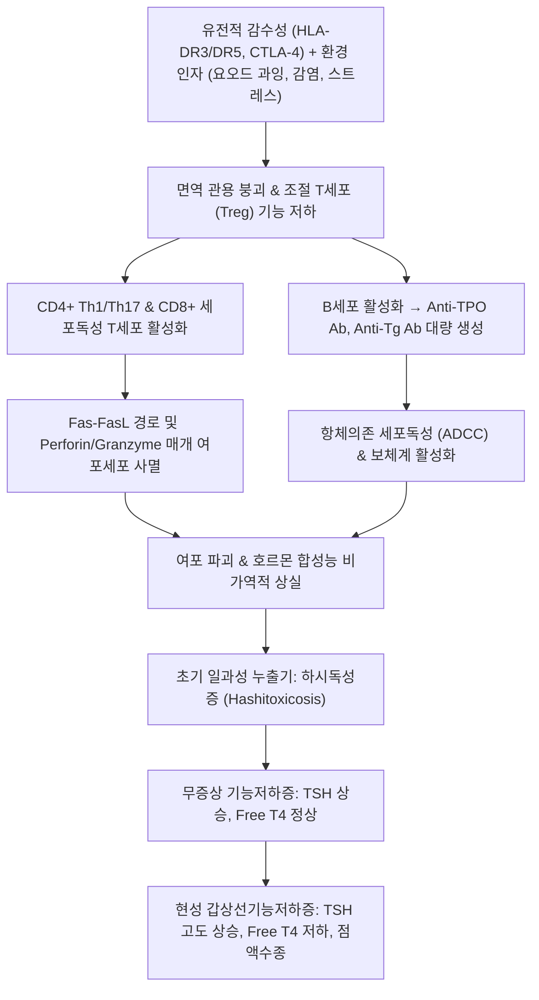
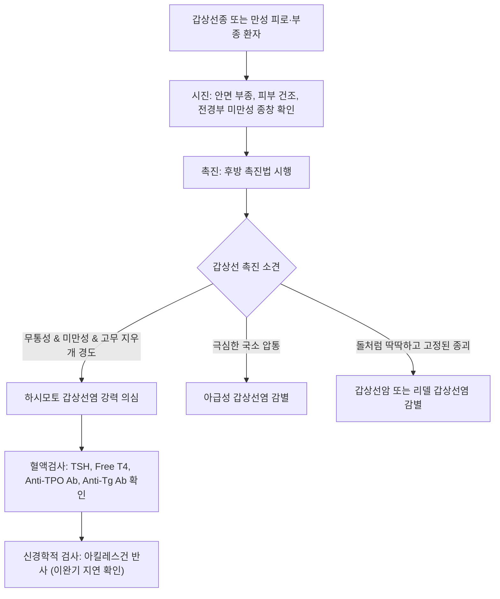

# 🩺 하시모토 갑상선염 (Hashimoto's Thyroiditis, Chronic Lymphocytic Thyroiditis)

> **핵심 3줄 요약 (Key Summary)**:
> - 📍 **병소 부위 & 해부·병태생리**: 갑상선 실질에 발생하는 대표적인 장기 특이 자가면역 질환으로, 자가반응성 CD4+/CD8+ T 림프구 침윤과 여포 상피세포의 점진적 세포자멸사(Apoptosis) 및 섬유화로 인해 비가역적인 갑상선 호르몬 결핍을 초래함.
> - 🚩 **전형적 임상 양상**: 특징적인 무통성 미만성 갑상선종(고무 지우개 같은 Firm/rubbery 경도), 질환 초기 일과성 중독(하시독성증, Hashitoxicosis) 후 진행하는 만성 [[피로]], 추위 불내성, 체중 증가, 변비, 건조 피부, 서맥, 점액수종.
> - 🛠️ **핵심 검사 & 치료 전략**: 혈청 [[TSH]] 상승 및 Free T4 저하, 항갑상선과산화효소 항체(Anti-TPO Ab >90~95%) 및 항티로그로불린 항체(Anti-Tg Ab) 고역가 양성, 초음파상 불균질한 미만성 저에코 소견 확인. 서양의학적 레보티록신(LT4) 호르몬 대체 요법과 병행하여 한의학적 비신양허(脾腎陽虛), 기혈양허(氣血兩虛), 담어응결(痰瘀凝結) 변증 한약([[보중익기탕]], [[사군자탕]], [[육미지황탕]], [[진무탕]]) 및 침구 통합 관리를 시행함.
> - ⚠️ **응급 의뢰 레드플래그**: 심각한 점액수종 혼수(Myxedema coma: 저체온증, 저환기, 저혈압, 의식 저하), 갑작스럽게 석재양으로 급속 성장하는 경부 종괴(원발성 갑상선 림프종 또는 미분화암 병발 의심), 기도 압박에 의한 급성 호흡곤란.

---

## 📌 목차
1. [질환 개요 & 해부학적 병태생리](#1-질환-개요--해부학적-병태생리)
2. [병태생리 메커니즘 & 생체역학적 악순환 네트워크](#2-병태생리-메커니즘--생체역학적-악순환-네트워크)
3. [임상 증상 & 이학적 검사(Physical Exam) 알고리즘](#3-임상-증상--이학적-검사physical-exam-알고리즘)
4. [감별 진단 매트릭스 (Differential Diagnosis)](#4-감별-진단-매트릭스-differential-diagnosis)
5. [한의 통합 치료 프로토콜 (침·약침·추나·한약)](#5-한의-통합-치료-프로토콜-침약침추나한약)
6. [양방 치료 & 병용·의뢰 기준 (Conventional Treatment & Referral)](#6-양방-치료--병용의뢰-기준-conventional-treatment--referral)
7. [재활 운동 & 생활습관 티칭 가이드](#7-재활-운동--생활습관-티칭-가이드)
8. [💡 사용자 진료실 핵심 필기 & 임상 노하우 (Melt-In 잔여 심화 집약)](#8--사용자-진료실-핵심-필기--임상-노하우-melt-in-잔여-심화-집약)
9. [출처 및 학술 참고 문헌 (References)](#9-출처-및-학술-참고-문헌--references-)

---

## 1. 질환 개요 & 해부학적 병태생리

### 1) 개념 정의 및 역학적 중요성
하시모토 갑상선염(Hashimoto's thyroiditis)은 1912년 일본 의사 Hakaru Hashimoto가 보고한 **만성 림프구성 갑상선염(Chronic lymphocytic thyroiditis)**으로, 요오드 충분 지역에서 발생하는 **원발성 갑상선기능저하증의 가장 흔한 원인 질환(>90%)**이다.
- 성인 여성의 5~10%에서 항체 양성이 관찰되며, 여성이 남성에 비해 8~15배 높은 유병률을 보인다. 주로 30~50대에 진단되나 소아 및 노인에서도 발생한다.
- 다른 자가면역 질환(제1형 당뇨병, 악성 빈혈, 백반증, 전신홍반루푸스, 쇼그렌 증후군, 셀리악병)과의 동반율이 높다.

### 2) 조직 병리학적 특징
- **림프구 및 형질세포 침윤**: 성숙 림프구와 형질세포가 갑상선 실질 전반에 미만성으로 침윤하며, 잘 발달된 림프 여포(Lymphoid follicles)와 배중심(Germinal centers)을 형성한다.
- **아스카나지 세포(Askanazy/Hürthle cell 변성)**: 만성 자극과 스트레스를 받은 여포 상피세포가 거대화되고 풍부한 호산성 과립상 세포질(미토콘드리아 과형성)을 띠는 허슬 세포(Hürthle cell)로 화생(Metaplasia)한다.
- **간질 섬유화(Interstitium Fibrosis)**: 여포가 위축되고 교질이 고갈되면서 결합조직과 섬유조직이 증식하여 갑상선이 고무처럼 단단해진다.

---

## 2. 병태생리 메커니즘 & 생체역학적 악순환 네트워크

### 1) 자가면역 파괴 기전과 임상 단계의 전개
1. **면역 관용의 파괴**: 갑상선 특이 항원(TPO, Thyroglobulin, TSH 수용체)에 대한 면역 관용이 소실되면서 도움 T세포(Th1)가 인터페론-감마(IFN-γ)와 TNF-α를 분비하고, 세포독성 T세포(CTL)가 Fas-FasL 경로를 통해 여포 세포를 사멸로 유도한다.
2. **하시독성증(Hashitoxicosis)**: 질환 초기 또는 악화기에 급격한 여포 파괴로 인해 저장된 호르몬이 일시적으로 누출되어 경미한 갑상선기능항진 증상(심계, 진전, 불안)이 나타날 수 있다.
3. **무증상 및 현성 기능저하증으로의 이행**: 여포 세포가 지속적으로 파괴되면 매년 약 5%의 환자가 무증상 갑상선기능저하증(Subclinical hypothyroidism)에서 현성 갑상선기능저하증(Overt hypothyroidism)으로 비가역적 진행을 겪는다.

### 2) 전신 대사 저하와 연부조직 점액부종
갑상선 호르몬 결핍은 체내 대사율을 떨어뜨리고 단백질 합성 및 이화 작용의 불균형을 초래한다. 피하 조직과 근막에 친수성 글리코사미노글리칸(GAGs)과 히알루론산이 축적되어 비함요 부종(Non-pitting myxedema)이 발생하며, 이는 성대 부종(음성 저하), 수근관 증후군(정중신경 포착), 전신 근력 약화 및 근막 유착을 유발한다.

---

## 3. 임상 증상 & 이학적 검사(Physical Exam) 알고리즘

### 1) 주요 임상 증상
- **전신 대사 저하 징후**: 지속적인 무기력증 및 만성 [[피로]], 추위 불내성(Cold intolerance), 식욕 부진에도 불구하고 나타나는 체중 증가, 저체온, 서맥.
- **피부 및 부속기 변화**: 피부 건조, 창백함, 거칠어짐, 모발 탈락, 눈 주위 부종, 손발의 비함요 부종.
- **신경·근골격계 증상**: 기억력 감퇴, 우울감, 말과 행동의 느려짐, 전신 근육통, 근경련, 관절 강직.
- **소화기 및 부인과 증상**: 장 운동 저하에 따른 완고한 변비, 여성의 경우 월경 과다 또는 무월경, 불임.

### 2) 진료실 이학적 검사 절차

- **아킬레스건 반사 지연(Delayed Relaxation of Deep Tendon Reflex)**:
  - 검사 햄머로 아킬레스건을 가볍게 타진했을 때, 족저 굴곡 후 원래 위치로 돌아오는 **이완기(Relaxation phase)가 비정상적으로 느리게** 관찰되는 현상은 갑상선기능저하증의 고전적이고 특이도 높은 신경계 징후이다.

---

## 4. 감별 진단 매트릭스 (Differential Diagnosis)

| 감별 항목 | 하시모토 갑상선염 | [[아급성 갑상선염]] | 그레이브스병 | 비독성 다발 결절성 갑상선종 |
| :--- | :--- | :--- | :--- | :--- |
| **통증 유무** | **무통성 (통증 없음)** | **극심한 통증 및 압통** | 무통성 | 무통성 |
| **갑상선 경도** | **미만성 고무양(Rubbery firm), 결절성 표면** | 단단한 통증성 경결 | 미만성 부드러움(Soft), 혈관잡음 | 다발성 결절 촉지 |
| **혈청 TSH / Free T4** | **TSH 상승, Free T4 저하** (저하기) | TSH 억제, Free T4 상승 (급성기) | **TSH < 0.01, Free T4 급상승** | 대개 정상 범위 |
| **특이 자가항체** | **Anti-TPO (>95%), Anti-Tg (>80%)** | 대개 음성 (일과성 저역가) | **TRAb / TBII 양성 (>95%)** | 음성 |
| **초음파 소견** | 미만성 저에코, 미세결절성 에코 패턴 | 지도상 불규칙 저에코, 혈류 감소 | 미만성 종대, **극심한 혈류 증가** | 다발성 낭성/고형 결절 |

---

## 5. 한의 통합 치료 프로토콜 (침·약침·추나·한약)

한의학에서는 하시모토 갑상선염으로 인한 갑상선종 및 기능저하증을 **석영(石癭)**, **육영(肉癭)**, **허로(虛勞)**, **수종(水腫)**의 범주로 다룬다. 본태는 **비신양허(脾腎陽虛)**와 **기혈양허(氣血兩虛)**이며, 병리적 산물로 **담음(痰飲)**과 **어혈(瘀血)**이 결취된 허실협잡(虛實夾雜)의 병태이다.

### 1) 변증별 다용 처방

| 변증 유형 | 주증 및 설맥 | 치법 | 다용 한약 처방 |
| :--- | :--- | :--- | :--- |
| **비신양허 (脾腎陽虛)** | 추위 불내성, 전신 부종, 극심한 피로, 서맥, 연변, 요슬산연, 설담반치흔 태백니, 맥침지무력 | 온신건비 (溫腎健脾), 온양화습 | [[진무탕]] 또는 [[이중탕]] 합 금궤신기환 가감 ([[황기]], [[백출]], [[건강]], [[부자]], [[육계]], [[숙지황]], [[산약]]) |
| **기혈양허 (氣血兩虛)** | 안색 창백, 현훈, 심계, 탈모, 건조 피부, 무력감, 설담태박백, 맥세약 | 보기양혈 (益氣養血), 건비익위 | [[십전대보탕]] 또는 [[보중익기탕]] 가감 ([[황기]], [[인삼]], [[백출]], [[당귀]], [[숙지황]], [[복령]], [[감초]]) |
| **기체담응·담어결취 (氣滯痰凝·痰瘀結聚)** | 전경부 멍울, 경부 압박감, 매핵기, 정서 억울, 흉민, 설암태백니, 맥현활 | 소간해울 (疏肝解鬱), 화담연견, 활혈화어 | [[소요산]] 합 [[이진탕]] 가 [[반하]], [[진피]], [[패모]], [[하고초]], [[현삼]], [[도인]], [[홍화]] |

### 2) 침구 및 약침 치료
- **근위 취혈 (국소 갑상선 순환 촉진 및 경부 긴장 완화)**:
  - 인영(ST9), 수돌(ST10), 기사(ST11), 천돌(CV22): 부드러운 사자로 경부 결합조직 긴장을 해소.
  - 대추(GV14), 풍지(GB20), 견정(GB21): 양기(陽氣) 진작 및 두경부 림프 순환 촉진.
- **원위 취혈 (장부 양기 및 수습 대사 조절)**:
  - 관원(CV4), 기해(CV6): 원기 보충 및 하초 양기 고양 (뜸 치료 병행 다용).
  - 족삼리(ST36), 음릉천(SP9), 삼음교(SP6): 비위 수습 정체 해소 및 면역 조절.
  - 태계(KI3), 신수(BL23), 비수(BL20): 신양(腎陽) 자양 및 전신 대사 기능 활성화.
- **약침 치료**:
  - 자하거(Placenta) 약침 또는 산삼 약침을 신수(BL23), 관원(CV4), 족삼리(ST36)에 분점 주입(0.2~0.5cc)하여 면역계 불균형을 교정하고 전신 만성 피로 및 내분비 대사 활성을 촉진한다.

### 3) 추나치료 (경추 및 흉곽 이완 기법)
- 환자의 흉추 후만 및 두부전방자세 교정을 위한 **상흉추 교정 기법(Upper Thoracic Thrust)** 및 **경추 가동화 기법**.
- 림프 순환 정체를 해소하기 위한 **흉곽출구 이완술** 및 전경부 근막 이완(Myofascial Release)을 병행한다.

---

## 6. 양방 치료 & 병용·의뢰 기준 (Conventional Treatment & Referral)

### 1) 서양의학 표준 호르몬 대체 요법
- **레보티록신(Levothyroxine, LT4, 씬지로이드/씬지록신)**:
  - 현성 기능저하증(TSH 상승, Free T4 저하)의 1차 표준 치료제.
  - 전형적 유지 용량: 성인 체중 kg당 약 1.6 μg/day (통상 50~150 μg qd).
  - 노인이나 허혈성 심질환 기저 환자는 심근 산소요구량 급증에 따른 부정맥·협심증 예방을 위해 25~50 μg의 저용량으로 시작하여 6~8주 간격으로 TSH를 추적하며 증량.
  - 복용법: 흡수율을 높이기 위해 아침 기상 직후 공복에 물 한 컵과 함께 복용하며, 식사 및 다른 약물(칼슘제, 철분제, 제산제)과는 최소 30~60분 이상 간격을 유지.

### 2) 한의 병용 치료의 시너지 효과
- **호르몬제 복용 환자의 잔여 증상 개선**: LT4 복용으로 혈액검사 수치(TSH)가 정상화되었음에도 불구하고 지속적인 피로, 부종, 체중 증가, 관절통을 호소하는 환자군(약 15~20%)에서, 온보비신·보기익혈 한약([[보중익기탕]], [[진무탕]])과 침구 치료는 말초 조직의 호르몬 감수성을 개선하고 삶의 질을 현저히 향상시킨다.
- **초기 무증상 기능저하증 환자의 현성 이행 억제**: TSH 4.5~10 mIU/L 수준의 무증상 기능저하증 환자에서 면역 조절 한약 치료를 통해 항체 역가를 낮추고 현성 이행을 지연시키는 임상 목표를 설정할 수 있다.

### 3) 양방 및 상급병원 의뢰 기준
- **응급 의뢰**:
  - 점액수종 혼수 의심 증상: 저체온(<35℃), 서맥, 저혈압, 극심한 기면 및 혼수.
- **전문과 의뢰**:
  - 갑상선 림프종 의심: 갑상선종이 수주 사이에 급격히 거대화되거나 통증 없이 단단해지며 애성, 연하곤란, 천명이 동반되는 경우(하시모토 환자는 갑상선 림프종 발생 위험이 일반인의 40~60배).
  - 가임기 여성의 임신 준비 또는 임신 확인 시(임신 중 TSH 엄격 목표치 < 2.5 mIU/L 달성을 위해 즉각적인 LT4 용량 조절 필요).

---

## 7. 재활 운동 & 생활습관 티칭 가이드

### 1) 규칙적인 저충격 유산소 운동
- 기능저하증 환자는 대사율 저하와 관절 강직이 동반되므로, 관절에 무리를 주지 않는 가벼운 걷기 운동, 수영, 실내 자전거 타기를 주 3~5회, 30분씩 시행하여 기초대사율을 올리고 혈액 순환을 촉진한다.

### 2) 식이요법 및 장 건강 관리
- **고용량 요오드(Iodine) 섭취 금지**: 요오드 과다 섭취는 하시모토 환자에서 여포 세포 파괴와 자가항체 생성을 촉진하므로 다시마, 미역귀, 요오드 보충제 복용을 피하도록 티칭한다.
- **셀레늄(Selenium) 및 비타민 D 섭취 권장**: 항산화 효소(Glutathione peroxidase) 활성화를 통해 항체 역가를 감소시키는 데 도움을 주는 브라질너트(하루 1~2알), 등푸른 생선 섭취를 권장한다.
- **글루텐 섭취 모니터링**: 자가면역 갑상선 질환과 장 투과성(Leaky gut) 간의 연관성이 높으므로, 밀가루 음식 섭취 후 복부 팽만과 피로가 심해지는 환자는 글루텐 제한 식이를 시도한다.

---

## 8. 💡 사용자 진료실 핵심 필기 & 임상 노하우 (Melt-In 잔여 심화 집약)

### 1) '씬지로이드를 먹어도 여전히 피곤해요' 호소에 대한 티칭
- 외래에서 흔히 만나는 하시모토 환자는 피검사 수치가 정상이라고 내과에서 들었음에도 만성 피로와 부종을 호소한다. 이는 혈중 T4 수치만 맞추었을 뿐, 말초 조직 세포 레벨에서의 T4→T3 전환율 저하나 전신 자가면역 만성 염증 상태가 완전히 해소되지 않았기 때문이다.
- 이때 환자에게 호르몬제를 임의로 중단하지 않도록 철저히 주지시키면서, 비신양허(脾腎陽虛)를 개선하는 한약 처방을 병용 투여하면 무력감과 한증이 뚜렷하게 호전된다.

### 2) 결절 동반 시 초음파 추적의 중요성
- 하시모토 갑상선염의 실질은 초음파 상 전체적으로 저에코이고 거칠어서 결절(Nodule)이 숨어 있어도 발견하기 어려울 수 있다. 특히 만성 염증 상태는 유두암(PTC)이나 원발성 악성 림프종(Primary thyroid lymphoma)의 발생 위험을 높이므로, 1~2년 주기의 정기 초음파 검진을 환자에게 반드시 강조해야 한다.

---

## 9. 출처 및 학술 참고 문헌 (References)

Si X, et al. (2026). Endoplasmic reticulum stress in Hashimoto's thyroiditis: a candidate amplification node linking thyroid-specific vulnerability and immune dysregulation. *Front Immunol*. 17():1909257. PMID: 42676653.

Qiu C, et al. (2026). Mendelian Randomization Analysis of Immune Cell Targets in Hashimoto's Thyroiditis Progression to Hypothyroidism. *Endocr Metab Immune Disord Drug Targets*. 26():e18715303414893. PMID: 42786841.

Ding S, et al. (2026). Exploring Causal Links Between 91 Circulating Inflammatory Proteins and Hashimoto's Thyroiditis: A Bidirectional Mendelian Randomization Study. *Mediators Inflamm*. 2026(1):e6651720. PMID: 42706779.

---

## 관련 노트

- [[갑상선염]]
- [[아급성 갑상선염]]
- [[TSH]]
- [[요오드]]
- [[보중익기탕]]
- [[사군자탕]]
- [[육미지황탕]]
- [[진무탕]]
- [[이중탕]]
- [[소요산]]
- [[이진탕]]
- [[피로]]
