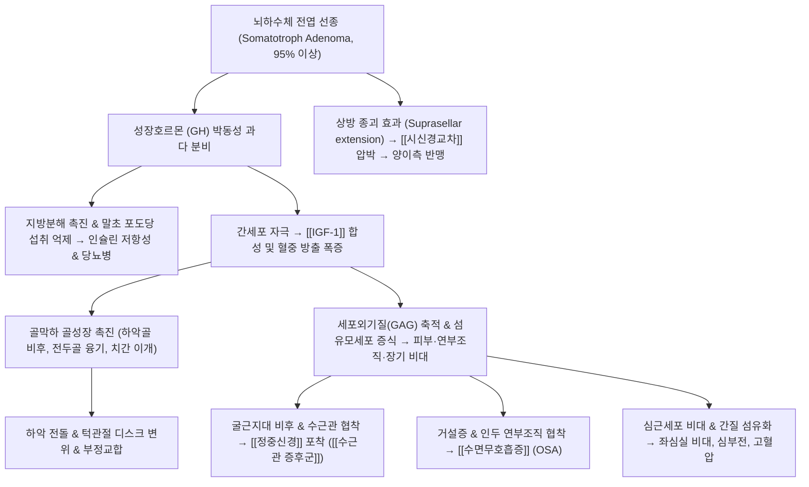

# 🩺 [[말단비대증]] (Acromegaly / 末端肥大症, ICD-10: E22.0 / KCD: E22.0)

> **핵심 3줄 요약 (Key Summary)**:
> - 📍 병소 부위 & 해부·병태생리: 뇌하수체 전엽의 성장호르몬 분비 선종으로 인해 골단판 유합 후 성장호르몬(GH) 및 간 유래 [[IGF-1]]이 지속 과잉 분비되어 골막하 골형성 및 전신 연부조직·장기가 병적으로 비후되는 만성 내분비 질환.
> - 🚩 전형적 임상 양상 & 3대 징후: 손·발 크기의 점진적 증대(반지·신발 맞지 않음), 하악골 전돌(주걱턱) 및 치간 이개, 거설증 및 폐쇄성 수면무호흡증([[수면무호흡증]])과 시신경교차 압박에 의한 양이측 반맹.
> - 🛠️ 핵심 감별 검사 & 한·양방 다각적 치료 전략: 경구 포도당 부하 검사(OGTT) GH 비억제 확인 및 혈청 IGF-1 측정, 접형동 경유 절제술(TSA) 및 소마토스타틴 유사체 투여, 한의 담어호결(痰瘀互結)·비신양허(脾腎陽虛) 변증 한약 및 턱관절 추나·수근관 감압 침구 복합 치료.
> - ⚠️ 응급 의뢰 레드플래그 & 악화 요인: 뇌하수체 선종 내 급성 출혈·경색으로 인한 뇌하수체 졸중(Pituitary apoplexy, 돌발성 벼락 두통·시력 소실·안근 마비), 중증 심근비대증에 따른 급성 울혈성 심부전 징후 발견 시 즉시 상급병원 신경외과 전원.

---

## 📌 목차
1. [질환 개요 & 해부학적 병태생리](#1-질환-개요--해부학적-병태생리)
2. [병태생리 메커니즘 & 생체역학적 악순환 네트워크](#2-병태생리-메커니즘--생체역학적-악순환-네트워크)
3. [임상 증상 & 이학적 검사(Physical Exam) 알고리즘](#3-임상-증상--이학적-검사physical-exam-알고리즘)
4. [감별 진단 매트릭스 (Differential Diagnosis)](#4-감별-진단-매트릭스-differential-diagnosis)
5. [한의 통합 치료 프로토콜 (침·약침·추나·한약)](#5-한의-통합-치료-프로토콜-침약침추나한약)
6. [양방 치료 & 병용·의뢰 기준 (Conventional Treatment & Referral)](#6-양방-치료--병용의뢰-기준-conventional-treatment--referral)
7. [재활 운동 & 생활습관 티칭 가이드](#6-재활-운동--생활습관-티칭-가이드)
8. [💡 사용자 진료실 핵심 필기 & 임상 노하우 (Melt-In 잔여 심화 집약)](#7--사용자-진료실-핵심-필기--임상-노하우-melt-in-잔여-심화-집약)
9. [출처 및 학술 참고 문헌 (References)](#8-출처-및-학술-참고-문헌-references)

---

## 1. 질환 개요 & 해부학적 병태생리

![[말단비대증_하악전돌_안면변형_CDC임상.jpg|380]]
> [그림 1: 말단비대증 환자의 정면 및 측면 임상 사진 - 전두골 융기, 코와 입술의 비후, 하악골 전돌(주걱턱) 및 하치열 전방 돌출 변형 성상]

* **질환 정의**:
  * 골단판(Growth plate)이 폐쇄된 성인기에 뇌하수체 전엽의 성장호르몬(Growth Hormone, GH) 분비 선종에 의해 GH와 [[IGF-1]](Insulin-like Growth Factor 1)이 만성적으로 과잉 분비되어, 뼈의 골막하 증식과 연부조직 및 내부 장기가 비정상적으로 비대해지는 희귀 만성 내분비 질환.
  * 소아기 성장판 유합 전에 발병하면 길이 성장이 과도해지는 [[거인증]](Gigantism)으로 발현함.
* **역학적 특성**:
  * 연간 인구 100만 명당 3~4명꼴로 발생하는 희귀 질환으로 평균 진단 연령은 40~50대임.
  * 증상이 매우 서서히 진행되어 첫 증상 발현부터 최종 확진까지 평균 7~10년이 소요됨.
* **관련 해부학적 구조물**:
  * **터키안 및 뇌하수체**: 접형골(Sphenoid bone)의 안장(Sella turcica) 내에 위치한 뇌하수체 전엽(Anterior pituitary gland).
  * **인접 신경 구조**: 뇌하수체 직상부에 위치한 [[시신경]](Optic nerve) 및 [[시신경교차]](Optic chiasm), 외측 해면정맥동(Cavernous sinus) 내 주행하는 [[동안신경]], [[활차신경]], [[외전신경]].
  * **이환 골격 및 관절**: 하악골(Mandible), 턱관절(TMJ), 전두골(Frontal bone), 손목 수근골 및 족부 족근골.

---

## 2. 병태생리 메커니즘 & 생체역학적 악순환 네트워크

![[뇌하수체_터키안_시신경교차_해부도해.jpg|450]]
> [그림 2: 뇌하수체(Pituitary gland)와 터키안(Sella turcica), 시신경교차(Optic chiasm) 및 인접 뇌혈관망의 정밀 시상단면 해부도]

### 1) GH-IGF-1 과잉의 분자대사 기전
* **소마토트로프 선종(Somatotroph Adenoma)**:
  * 환자의 95% 이상이 뇌하수체 전엽의 단클론성 양성 선종에 의해 발생하며, GNAS 유전자 돌연변이(gsp 암유전자) 등으로 인해 아데닐산 시클라아제가 지속 활성화되어 GH를 자율 분비함.
* **IGF-1 매개성 동화 작용 폭증**:
  * GH가 간조직의 수용체에 결합하여 혈중 [[IGF-1]] 생성을 폭발적으로 유도함.
  * IGF-1은 연골세포, 조골세포, 섬유아세포의 유사분열(Mitogenesis)과 단백질 합성을 자극하여 골막하(Periosteal) 골형성을 촉진하고 콜라겐 및 글리코사미노글리칸(GAG)을 과다 침착시킴.
* **항인슐린 대사 장애**:
  * GH는 지방분해를 촉진하여 혈중 유리지방산을 높이고 간의 포도당 방출을 유도하며 골격근의 인슐린 감수성을 떨어뜨려 고인슐린혈증 및 2차성 제2형 당뇨병을 초래함.

### 2) 생체역학적 변형 및 다발성 신경 포착 연쇄망
* **안면골 및 턱관절(TMJ) 붕괴**:
  * 하악두(Condyle)와 하악지(Ramus)의 비정상적 과성장으로 하악 전체가 전하방으로 돌출(하악전돌증, Prognathism)되며 아래 치아가 윗치아보다 앞으로 튀어나오는 반대교합(Angle Class III 부정교합)이 유발됨.
  * 이로 인해 턱관절 내 디스크 변위, 저작근(교근, 측두근, 외측익돌근)의 만성 과긴장과 경추 역학적 과부하가 초래됨.
* **수근관 내 정중신경 포착**:
  * 손목 굴근지대(Flexor retinaculum)와 수근관 건초에 점액다당류 및 섬유조직이 두껍게 침착되어 수근관 내압이 급증함.
  * 환자의 20~50%에서 [[정중신경]]이 허혈성 압박을 받아 양측성 [[수근관 증후군]]이 발생함.
* **상기도 폐쇄 및 심혈관 역학 악화**:
  * 혀의 비대(Macroglossia)와 연구개, 인두 연부조직 비후로 상기도가 기계적으로 좁아져 심한 폐쇄성 수면무호흡증이 발생하며, 이는 만성 저산소증과 폐동맥고혈압을 가속화함.

---

## 3. 임상 증상 & 이학적 검사(Physical Exam) 알고리즘

### 1) 신체 외형 및 전신 증상
* **말단 비대**: 과거에 끼던 반지가 손가락에 맞지 않아 자르거나 신발 및 모자 치수가 수년 사이에 계속 커짐.
* **두경부 외형 변화**: 이마 전두골 융기, 코와 입술의 비후, 혀가 두꺼워져 발음이 어눌해짐, 아래턱이 튀어나와 치아 간격이 벌어짐(Diastema).
* **신경 압박 및 국소 종괴 징후**:
  * 두통(터키안 내압 상승).
  * 시야 결손: 시신경교차(Optic chiasm)가 압박되면서 시야의 양 바깥쪽이 보이지 않는 **양이측 반맹(Bitemporal hemianopsia)** 발생.
  * 손목의 저림, 야간 통증 및 무지구근 위축([[수근관 증후군]]).
* **심혈관 & 대사 합병증**: 좌심실 비대증, 난치성 고혈압, 심부전, 당뇨병, 대장 용종 발생 위험 증가.

### 2) 필수 진단 검사 알고리즘

| 진단 검사 단계 | 검사 항목 | 판정 기준 및 임상적 의의 |
| :--- | :--- | :--- |
| **1단계: 선별 검사** | 혈청 [[IGF-1]] 농도 | 연령 및 성별 기준치보다 명확히 상승 시 선종 강력 의심 |
| **2단계: 확진 검사** | 경구 포도당 부하 검사 (75g OGTT) | 포도당 투여 2시간 후 혈청 GH가 1.0 ng/mL (정밀검사 0.4 ng/mL) 이하로 억제되지 않으면 확진 |
| **3단계: 병소 국소화** | 조영증강 뇌하수체 뇌 MRI | 선종의 크기(미세선종 <10mm vs 거대선종 ≥10mm), 터키안 상방 침범 및 시신경교차 압박 확인 |
| **4단계: 합병증 평가** | 수면다원검사, 심초음파, 대장내시경 | 폐쇄성 수면무호흡증, 좌심실 비대율, 대장 선종성 용종 동반 유무 확인 |

---

## 4. 감별 진단 매트릭스 (Differential Diagnosis)

| 감별 질환 | 주요 원인 및 병소 | 호발 양상 및 특징 | 진단적 검사 감별점 |
| :--- | :--- | :--- | :--- |
| [[말단비대증]] (본 질환) | 뇌하수체 전엽 선종, 성인기 GH/IGF-1 과잉 | 골막하 비후, 하악전돌, 손발 비대, 장기 비대 | 75g OGTT 시 GH 비억제, 혈청 IGF-1 상승 |
| [[거인증]] | 성장판 폐쇄 전 소아·청소년기 발병 | 사지 장골의 길이 성장 과다 (극심한 키 성장) | 소아기 발병, 엑스레이상 골단판 개방 확인 |
| [[갑상선 기능 저하증]] | 갑상선 호르몬 결핍, 점액수종 침착 | 안면 부종, 체중 증가, 전신 피로 (골격 과증식 없음) | TSH 상승, Free T4 저하, IGF-1 정상 |
| 파제트병 ([[골파제트병]]) | 파골세포 비정상 과활성 및 골재형성 장애 | 국소적 골 변형, 두개골 비대, 뼈 통증 | 혈청 ALP 극심한 상승, 골스캔상 국소 섭취 |
| 특발성 수근관 증후군 | 수근관 내 반복 과사용에 의한 활액막염 | 손목 통증 및 저림 국한 (안면골/손발 비대 부재) | 전신 골격 변화 없음, IGF-1 및 GH 정상 |

---

## 5. 한의 통합 치료 프로토콜 (침·약침·추나·한약)

![[말단비대증_전형적_안면_수부비대_임상.jpg|460]]
> [그림 3: 말단비대증의 전형적인 거친 안면 윤곽, 비배부 비후 및 연부조직 증식 임상 증례 - 한의 치료는 신경 포착 완화, 턱관절 불균형 교정 및 수술 후 기력 회복을 도모함]

* **한의학적 병리 인식**:
  * 뇌하수체의 종괴 형성과 전신 연부조직·골격의 비정상적 비후를 오랜 기간 기체(氣滯), 담음(痰飮), 어혈(瘀血)이 응결하여 굳어진 **담어호결(痰瘀互結)**로 파악함.
  * 전신 장기 쇠약 및 수술 후 호르몬 결핍 상태는 **비신양허(脾腎陽虛)** 및 **기혈양허(氣血兩虛)**로 변증함.
* **침구 치료**:
  * **턱관절 및 저작근 긴장 완화**: 하관(ST7), 협거(ST6), 예풍(TE17), 두유(ST8) 자침 및 교근·측두근 전침(10~20Hz) 적용.
  * **수근관 정중신경 감압**: 대릉(PC7), 내관(PC6), 노궁(PC8), 합곡(LI4) 자침으로 횡수근인대 주변 순환 개선.
  * **전신 기화 촉진**: 족삼리(ST36), 풍륭(ST40), 태충(LR3), 신수(BL23).
* **약침 치료**:
  * **중성어혈약침 또는 신바로약침**: 비후된 손목 굴근지대 주변 및 턱관절 낭 부위에 주입하여 국소 무균성 염증 억제 및 신경 부종 완화.
  * **자하거 약침**: 수술(TSA) 후 뇌하수체 기능 저하 및 만성 기력 고갈 환자의 신수(BL23), 기해(CV6)에 시술하여 원기 회복 도모.
* **추나 치료**:
  * **턱관절(TMJ) 교정 추나**: 하악 과성장으로 인한 관절원판 변위와 하악두 아탈구를 완화하기 위해 구강 내 외측익돌근 이완수기 및 하악두 견인-후하방 가동기법 적용.
  * **수근골 감압 및 상지 신경활주 추나**: 주상골-월상골 가동술과 수근관 확장 근막이완기법을 통해 정중신경 포착압 완화.
* **한약 치료**:
  * **담어호결(痰瘀互結) 및 골격통 완화**: [[이진탕]]합[[도홍사물탕]], [[당귀수산]], [[소활락단]] 가감 (어혈과 담음을 삭이고 관절 연골 통증 완화).
  * **수술 후 허약 및 비신양허(脾腎陽虛)**: [[보중익기탕]], [[십전대보탕]], [[우귀음]] 가감 (수술 후 뇌하수체 기능 저하성 무기력 극복).

---

## 6. 양방 치료 & 병용·의뢰 기준 (Conventional Treatment & Referral)

> 🎯 **이 섹션의 목적**: 환자가 **양방약을 이미 복용 중인 경우가 많다.** 한의원 1차 진료에서 양방 치료를 이해하고, 병용 가능·주의·금기를 판단하며, 언제 의뢰할지 결정한다.

* **약물 치료 (Medication)**:
  * 계열별 약물·용량·기간 — 국내 처방 관행 반영.
  * 작용 기전과 한의 치료와의 상호작용.
* **비약물 시술 (Procedures)**:
  * 주사·차단술·물리치료·보조기 등.
* **수술·시술 적응증 (Surgical Indication)**:
  * 언제 수술로 가는가 — 절대·상대 적응증, 수술 후 경과.
* **한의 병용 판단 (Combination Therapy)**:
  * 병용 가능 / 주의 / 금기. 복용 중 환자의 감량 타이밍·반동 현상.
* **양방·전문과 의뢰 기준 (Referral Criteria)**:
  * 응급 의뢰 트리거와 전문과 의뢰 기준(정형외과·신경외과·내과 등).

	(작성 필요)

---

## 7. 재활 운동 & 생활습관 티칭 가이드

* **턱관절 6-6-6 운동법 티칭**:
  * 혀끝을 입천장 앞니 뒤쪽에 가볍게 대고, 혀가 떨어지지 않는 범위 내에서 입을 천천히 벌렸다 닫는 운동을 1회 6초씩, 6회 반복, 하루 6회 시행하여 하악 과돌출로 인한 턱관절 부하를 경감.
* **손목 정중신경 신경활주 운동(Nerve Gliding Exercise)**:
  * 주먹 쥐기 $\rightarrow$ 손가락 펴기 $\rightarrow$ 손목 뒤로 젖히기 $\rightarrow$ 엄지손가락 외전 $\rightarrow$ 손바닥 위로 회외 동작을 부드럽게 반복하여 수근관 내 정중신경의 기계적 활주를 유도.
* **수면무호흡증 관리 및 수면 자세**:
  * 바로 누워 잘 경우 거설증으로 인해 기도가 폐쇄되므로 측와위(옆으로 누워 자기)를 유지하도록 티칭하고, 필요 시 양압기(CPAP) 사용을 적극 권장.

---

## 8. 💡 사용자 진료실 핵심 필기 & 임상 노하우 (Melt-In 잔여 심화 집약)

### 1) 진료실 말단비대증 조기 의심 체크리스트 & 감별 포인트
* **무심코 지나치기 쉬운 일상 변화 4대 질문**:
  1. *"최근 몇 년 사이에 결혼반지나 평소 끼던 반지가 작아져서 손가락에서 빠지지 않거나 늘리신 적이 있습니까?"*
  2. *"신발 크기가 한두 치수 이상 커져서 신던 신발들을 다 바꾸셨습니까?"*
  3. *"모자가 작아졌거나, 아래턱이 예전보다 튀어나와 윗니와 아랫니가 제대로 맞물리지 않습니까?"*
  4. *"과거 사진(주민등록증, 운전면허증, 5~10년 전 가족사진)과 비교했을 때 코, 입술, 턱선이 뚜렷하게 두꺼워졌습니까?"*
* **한의원에 관절통이나 손저림으로 내원하는 환자 감별 노하우**:
  * 양측성 [[수근관 증후군]]이 발생했으면서 손바닥 피부가 유난히 두껍고 축축(다한증)하며, 손가락 마디 뼈 자체가 굵어져 있는 환자는 단순 손목 과사용이 아니라 반드시 내분비 선종을 의심하고 혈청 IGF-1 검사를 위해 내분비내과로 의뢰해야 함.

### 2) 현대의학 표준 수술·약물 치료 및 한의 협진 프로토콜
* **1차 표준 치료: 경접형동 접근 뇌하수체 종양 절제술(TSA)**:
  * 코 안쪽 접형동을 통해 뇌하수체 선종을 현미경이나 내시경으로 절제하는 수술. 종양 크기가 작을수록 완치율이 높음.
* **약물 치료 요법**:
  * 수술이 불가능하거나 잔여 종양이 남은 경우:
    * 소마토스타틴 유사체(Somatostatin analogs, 오크레오타이드, 란레오타이드): GH 분비 직접 억제.
    * GH 수용체 길항제(페그비소만트): 말초 조직에서 GH 결합을 차단하여 IGF-1 정상화 유도.
    * 도파민 작용제(카버골린): 경구 투여로 보조적 분비 억제.
* **한의 치료의 실전 역할**:
  * 수술 전 종양 자체를 한약으로 없앨 수는 없으므로 즉각적인 외과적 수술을 최우선 연계함.
  * 한의 치료는 **수술 후 잔여 턱관절 장애 교정, 수근관 증후군 후유증 완화, 척추·관절 연골 퇴행성 통증 제어, 수술 후 뇌하수체 기능 저하증(Hypopituitarism)에 동반되는 피로·무기력 개선**에 집중함.

---

## 9. 출처 및 학술 참고 문헌 (References)

1. **Melmed, S. (2009)**. *Acromegaly pathogenesis and treatment*. **The Journal of Clinical Investigation**, 119(11), 3189-3202.
   - `[연구 요약]`: [PubMed Link](https://pubmed.ncbi.nlm.nih.gov/19884662/) / 뇌하수체 성장호르몬 분비 선종의 분자생물학적 발병 기전, 간세포의 IGF-1 과잉 생성 경로 및 골막하 골형성과 전신 장기 비대의 임상 치료 지침을 포괄 정리한 종설.
2. **Colao, A., et al. (2019)**. *Acromegaly*. **Nature Reviews Disease Primers**, 5(1), 20.
   - `[연구 요약]`: [PubMed Link](https://pubmed.ncbi.nlm.nih.gov/30899019/) / 말단비대증의 역학적 변화, 조기 진단 생화학적 검사 알고리즘(OGTT, IGF-1), 수근관 증후군 및 폐쇄성 수면무호흡증 등 다발성 합병증 관리 전략을 제시한 표준 프라이머.
3. **Giustina, A., et al. (2026)**. *Consensus on acromegaly complications: an update*. **Pituitary**, 29(1), 1-18.
   - `[연구 요약]`: [PubMed Link](https://pubmed.ncbi.nlm.nih.gov/42050227/) / 말단비대증 환자에서 호발하는 턱관절 장애, 척추 골관절염, 심혈관계 비대증 및 대사 이상 합병증의 최신 합의 판정 기준과 장기 추적 지침을 업데이트함.

<!-- 보관 태그(1회용·링크오류, 필요시 복원): 뇌신경계, 수면무호흡증 -->
