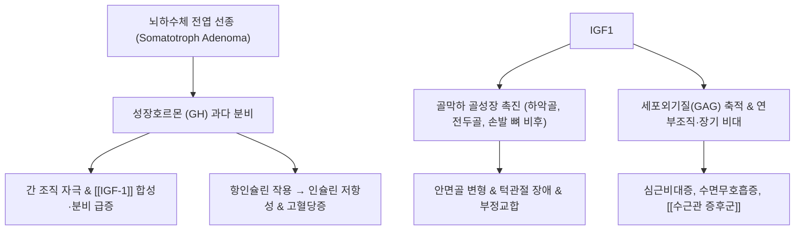

---
aliases:
  - 말단비대증
  - Acromegaly
  - 말단거대증
tags:
  - 질환
  - 내분비계
  - 뇌신경계
  - 뇌하수체
  - 성장호르몬
  - 수면무호흡증
  - 관절염
  - 거인증
---
# 🧠 [[말단비대증]] (Acromegaly, 말단거대증)

> **핵심 요약 (Key Summary)**:
> 뇌하수체 전엽의 성장호르몬 분비 선종(Pituitary Adenoma)으로 인해 성장판 폐쇄 후 성장호르몬(GH) 및 인슐린유사성장인자-1([[IGF-1]])이 과다 분비되는 만성 희귀 내분비 질환.
> 골단판 유합 후 손·발의 점진적 비대, 하악골 돌출(주걱턱), 이마 돌출, 거설증, 연부조직 비후 및 심근비대증, 인슐린 저항성 초래.
> 한의학의 담어호결(痰瘀互結), 비신양허(脾腎陽虛), 신허골체(腎虛骨體) 병리와 연계되며 턱관절 장애, 수근관 증후군, 폐쇄성 수면무호흡증을 빈발.

---

## 📌 목차
1. [역학 및 병태생리 (Pathophysiology)](#1-역학-및-병태생리-pathophysiology)
2. [임상 증상 및 전신 합병증](#2-임상-증상-및-전신-합병증)
3. [근골격계·생체역학적 특징 및 신경 포착](#3-근골격계생체역학적-특징-및-신경-포착)
4. [진단 기준 및 현대 의학적 치료](#4-진단-기준-및-현대-의학적-치료)
5. [한의학적 변증 및 보조적 임상 관리](#5-한의학적-변증-및-보조적-임상-관리)
6. [출처 및 학술 참고 문헌 (References)](#6-출처-및-학술-참고-문헌-references)

---

## 1. 역학 및 병태생리 (Pathophysiology)

* **원인**:
  * 95% 이상이 뇌하수체 전엽의 양성 선종(Somatotroph adenoma)에서 기인.
* **GH 및 IGF-1 축의 탈억제**:
  * 성장판 폐쇄 전 소아기 발병 시에는 키가 비정상적으로 자라는 **거인증(Gigantism)**이 나타나며, 성인기에 발병하면 길이 성장은 불가능하여 말단부 뼈와 연부조직이 두꺼워지는 **말단비대증(Acromegaly)**으로 발현.
* **만성 대사 이상**:
  * GH의 항인슐린 효과로 인해 간의 포도당 방출이 늘고 말초 포도당 이용이 억제되어 제2형 당뇨병 유발.

---

## 2. 임상 증상 및 전신 합병증

* **외형적 변화 (서서히 진행)**:
  * 모자, 반지, 신발 크기가 점점 커짐 (장갑이나 신발이 맞지 않음).
  * 턱이 앞으로 튀어나오는 하악전돌증(주걱턱), 치아 사이 벌어짐, 코와 입술이 두꺼워짐, 이마 돌출.
* **심혈관계 및 호흡기계**:
  * 좌심실 비대, 고혈압, 관상동맥 질환, 심부전.
  * 거설증(혀가 커짐)과 인후 연부조직 비후로 인한 심한 [[폐쇄성 수면무호흡증]](OSA).
* **내분비 및 종양 위험**:
  * 인슐린 저항성 당뇨병, 대장 용종(Colonic polyp) 및 대장암 발생 위험 증가.

---

## 3. 근골격계·생체역학적 특징 및 신경 포착

* **수근관 증후군 (Carpal Tunnel Syndrome)의 높은 유병률**:
  * 손목 굴근지대(Flexor retinaculum)와 건초의 비후로 인해 정중신경([[Median Nerve]])이 압박되어 손가락 저림과 무지구근 위축 발생 (환자의 20~50%에서 발생).
* **턱관절 장애 (TMD) 및 부정교합**:
  * 하악두(Condyle)의 과성장으로 턱관절 디스크 변위 및 저작근 긴장, 교합 붕괴 유발.
* **퇴행성 척추증 및 조기 관절염**:
  * 관절 연골의 비정상적 비후 후 조기 퇴행성 파괴가 진행되어 무릎, 고관절, 요추의 심한 만성 관절통 동반.

---

## 4. 진단 기준 및 현대 의학적 치료

* **생화학적 확진 검사**:
  * 혈청 [[IGF-1]] 농도 측정 (연령·성별 기준치 초과 여부).
  * 경구 포도당 부하 검사(OGTT): 포도당 75g 섭취 후에도 GH 농도가 1.0 ng/mL 이하로 억제되지 않으면 확진.
* **영상 의학 검사**:
  * 뇌하수체 MRI (선종의 크기, 시신경 교차 압박 여부 확인).
* **현대 의학 표준 치료**:
  * **수술**: 접형동 경유 뇌하수체 선종 절제술(TSA)이 1차 표준 치료.
  * **약물**: 소마토스타틴 유사체(오크레오타이드), 도파민 작용제(카버골린), GH 수용체 길항제(페그비소만트).
  * **방사선 치료**: 수술 불완전 절제 시 감마나이프 방사선 수술.

---

## 5. 한의학적 변증 및 보조적 임상 관리

* **한의학적 병리 (담어호결, 痰瘀互結)**:
  * 뇌하수체 종괴와 전신 연부조직 증식을 기체(氣滯), 담음(痰飮), 어혈(瘀血)이 오랜 기간 뭉쳐 굳어진 것으로 파악.
* **보조적 한의 치료 타깃**:
  * **수술 후 잔여 피로 및 기력 저하**: [[보중익기탕]], [[십전대보탕]]으로 비신 원기 보양.
  * **동반 관절통 및 수근관 증후군**: [[당귀수산]], [[소활락단]] 및 침구 치료를 통해 정중신경 포착과 관절 염증을 완화.
  * **턱관절 불균형**: 턱관절 추나요법과 교합 안정 치료를 통해 하악골 돌출로 인한 경추-턱관절 연관통 제어.

---

## 6. 출처 및 학술 참고 문헌 (References)

* Melmed, S. (2006). Acromegaly pathogenesis and treatment. *The Journal of Clinical Investigation*, 116(5), 1151-1160.
  * `[연구 요약]` 말단비대증의 분자유전학적 발병 기전, GH/IGF-1 과잉에 따른 전신 합병증 및 현대적 수술·약물 치료 알고리즘을 총망라한 종설.
* Colao, A., et al. (2019). Acromegaly. *Nature Reviews Disease Primers*, 5(1), 20.
  * `[연구 요약]` 말단비대증의 조기 진단 지표, 심혈관 및 골관절계 장기 예후, 전신 다발성 동반 질환의 관리 지침을 제시.
