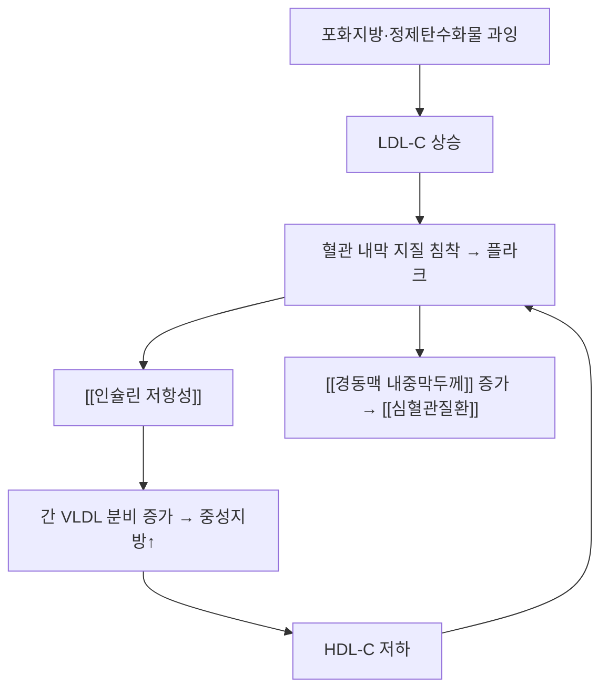

# 🩺 이상지질혈증 (Dyslipidemia)

> **핵심 3줄 요약 (Key Summary)**:
> - 📍 병소 부위 & 해부·병태생리: LDL-C 상승 · 중성지방 상승 · HDL-C 저하 중 하나 이상. **LDL-C가 죽상경화의 중심 축**이고 중성지방·HDL은 인슐린 저항성과 함께 움직인다 → [[인슐린 저항성]]
> - 🚩 전형적 임상 양상: 무증상(검진 발견)이 대부분. 가족성 고콜레스테롤혈증 — 건(腱) 황색종·각막환 / 중증 고중성지방혈증 — 유백색 혈장·췌장염
> - 🛠️ 핵심 검사 & 치료 전략: 이차성 원인(갑상선·간·신장·약물·당뇨) 배제 → [[스타틴]] 중심 + 생활습관. 한의는 담습·어혈 변증으로 대사 지표 동시 관리 → [[대사증후군]]
> - ⚠️ 응급 의뢰 레드플래그: 중성지방 ≥500 mg/dL + 심한 복통·구역(급성 췌장염), 흉통(급성 관상동맥 증후군) → 즉시 응급

---

## 📌 목차
1. [질환 개요 & 해부학적 병태생리](#1-질환-개요--해부학적-병태생리)
2. [병태생리 메커니즘 & 생체역학적 악순환 네트워크](#2-병태생리-메커니즘--생체역학적-악순환-네트워크)
3. [임상 증상 & 이학적 검사(Physical Exam) 알고리즘](#3-임상-증상--이학적-검사physical-exam-알고리즘)
4. [감별 진단 매트릭스 (Differential Diagnosis)](#4-감별-진단-매트릭스-differential-diagnosis)
5. [한의 통합 치료 프로토콜 (침·약침·추나·한약)](#5-한의-통합-치료-프로토콜-침약침추나한약)
6. [양방 치료 & 병용·의뢰 기준 (Conventional Treatment & Referral)](#6-양방-치료--병용의뢰-기준-conventional-treatment--referral)
7. [재활 운동 & 생활습관 티칭 가이드](#7-재활-운동--생활습관-티칭-가이드)
8. [💡 사용자 진료실 핵심 필기 & 임상 노하우 (Melt-In 잔여 심화 집약)](#8--사용자-진료실-핵심-필기--임상-노하우-melt-in-잔여-심화-집약)
9. [출처 및 학술 참고 문헌 (References)](#9-출처-및-학술-참고-문헌-references)

---

## 1. 질환 개요 & 해부학적 병태생리

* **분류**: ① LDL-C 상승형(죽상경화 주도) ② 중성지방 상승 + HDL 저하형(인슐린 저항성·대사증후군 연관) ③ 혼합형
* **평가 지표**: 총콜레스테롤 · LDL-C · HDL-C · 중성지방 (+non-HDL-C). 12시간 금식 권장, 급성 질환·임신 중에는 재검
* **이차성 원인 배제**: [[갑상선기능저하증]], 신증후군·만성신장병, 간담도 질환, [[당뇨병]], 약물(스테로이드·이뇨제·베타차단제·일부 항정신병약)

---

## 2. 병태생리 메커니즘 & 생체역학적 악순환 네트워크

### 1) 분자·세포 수준 기전
* LDL이 내피하에 침착·산화 → 대식세포 탐식 → 거품세포 → 지질핵 → 플라크
* 인슐린 저항성은 간 VLDL 분비를 늘려 **중성지방↑·HDL↓** 패턴을 만든다 → [[중성지방]] · [[HDL]] · [[LDL]]
### 2) 장기·계통 수준 결과
* 관상동맥·뇌혈관·하지 동맥 협착 → 협심증·심근경색·뇌졸중·말초동맥질환
### 3) 위험인자와 진행 단계
* 지질 이상 → 아임상 죽상경화(경동맥 플라크) → 임상 사건. 가족력이 강하면 어린 나이부터 진행

---

## 3. 임상 증상 & 이학적 검사(Physical Exam) 알고리즘

### 1) 주요 임상 양상
* 대개 무증상. 가족성 고콜레스테롤혈증 — 아킬레스건 황색종·손가락 신전건 황색종·각막환
* 중증 고중성지방혈증 — 유백색 혈장, 발진성 황색종, 급성 췌장염
### 2) 진료실 확인 (객관적 소견)
* 지질 패널 + 허리둘레·혈압·공복혈당·[[HbA1c]]·간효소·TSH 동시 확인(이차성·대사증후군 감별)
* 복용약 확인(스테로이드·이뇨제 등 지질 상승 약물), 건(腱) 황색종 촉진
### 3) 병기·중증도 판정
* LDL-C 수준 + 동반 위험인자(당뇨·고혈압·흡연·심혈관 병력)로 목표치를 정한다

---

## 4. 감별 진단 매트릭스 (Differential Diagnosis)

| 감별 질환 | 특징적 양상 | 감별 포인트 |
| :--- | :--- | :--- |
| [[이상지질혈증]] (본 질환) | 검진 발견 무증상 | 지질 패널 |
| 가족성 고콜레스테롤혈증 | 강한 가족력·건 황색종 | LDL-C 매우 높음 |
| [[갑상선기능저하증]] | 부종·서맥·피로 | TSH 상승 |
| 신증후군 | 부종·단백뇨 | 요단백·알부민 |
| 담즙 정체성 간질환 | 황달·소양감 | 빌리루빈·ALP |

---

## 5. 한의 통합 치료 프로토콜 (침·약침·추나·한약)

* **변증**: 담습(痰濕) · 어혈(瘀血) · 기허 · 음허화왕 · 간울
* **침구**: 비수(脾兪 BL20)·간수(肝兪 BL18)·신수(腎兪 BL23)·풍륭(豐隆 ST40)·삼음교(三陰交 SP6)·족삼리(足三里 ST36) — 주 2회·12주 이상, 지질·체중·허리둘레를 함께 추적 → [[전침]]
* **약침**: 배수혈 소량 자극 → [[약침]]
* **한약**: 담습형 [[태음조위탕]]·[[온담탕]] 계열, 기음양허형 [[진력달과립]] 구조 참고 → [[단삼]] · [[황정]] · [[갈근]] · [[베르베린]]
* ⚠️ **주의**: [[단삼]] 등 활혈 본초는 항응고·항혈소판제와 병용 시 출혈 위험 → 복용약 확인 필수

---

## 6. 양방 치료 & 병용·의뢰 기준 (Conventional Treatment & Referral)

* **약물 치료 (Medication)**: [[스타틴]] 1차(LDL-C 목표 기반) → 필요 시 [[에제티미브]]·PCSK9 억제제 병용. 중성지방 우세에는 피브레이트·오메가-3
* **비약물 시술 (Procedures)**: 해당 없음 — 생활습관 교정이 핵심
* **수술·시술 적응증 (Surgical Indication)**: 가족성 고콜레스테롤혈증에서 LDL 혈장교환술 등 특수 상황
* **한의 병용 판단 (Combination Therapy)**
  * **병용 가능**: 스타틴 + 침·한약 보조
  * **주의**: **스타틴 유발 근육통** — 한약·침 치료 후 근육통을 한약 탓으로 단정하지 말고 CK·복용 시점을 확인 → [[스타틴 유발 근병증]]
  * **금기**: 임의로 스타틴을 끊고 한약만 복용하는 상황
* **양방·전문과 의뢰 기준 (Referral Criteria)**: LDL-C 매우 높음 + 가족력(가족성 의심), 중성지방 ≥500, 심혈관 사건 병력 → 순환기·내분비

---

## 7. 재활 운동 & 생활습관 티칭 가이드

* **운동**: 주 150~300분 중등도 유산소(중성지방·HDL 개선에 특히 효과) + 주 2회 저항운동 → [[유산소운동]]
* **식이**: 포화지방·정제 탄수화물·액상과당 감량, 등푸른 생선·식이섬유·견과류 활용
* **자가관리**: 3~6개월마다 지질 패널, 체중·허리둘레 기록
* **환자 교육 스크립트**
  > "콜레스테롤은 '나쁜 것(LDL)'을 낮추는 것이 핵심이고, 중성지방은 밥·술·단 음료를 줄이면 가장 빠르게 반응합니다."

---

## 8. 💡 사용자 진료실 핵심 필기 & 임상 노하우 (Melt-In 잔여 심화 집약)

> 🛡️ **Melt-In 원칙**: 기존 스텁에는 원장님 필기가 없었다.

* **근육통 문진은 필수**: 스타틴 복용자에서 양측 대칭 근육통·허약감 → [[스타틴 유발 근병증]] 감별
* **중성지방이 높은 환자**는 대개 음주·야식·정제탄수화물 패턴이다 — 약보다 식이 개입 효과가 크다
* **지질 패널 + 대사 지표 세트**([[HbA1c]]·허리둘레·혈압)로 함께 본다
* **환자 티스크립트(플라크 설명)**
  > "피 속 기름기가 많으면 혈관벽에 서서히 쌓입니다. 지금은 좁아지지 않았어도 벽에 변화가 시작된 상태라, 수치를 정상 범위로 낮추면 진행을 늦출 수 있습니다."

---

## 9. 출처 및 학술 참고 문헌 (References)

1. **Ji L, et al. (2024)**. *Jinlida for Diabetes Prevention in Impaired Glucose Tolerance and Multiple Metabolic Abnormalities: The FOCUS Randomized Clinical Trial*. **JAMA Intern Med**, 184(7):727-735. [PMID 38829648](https://pubmed.ncbi.nlm.nih.gov/38829648/)
   - **[연구 요약]**: 중성지방 −25.7 mg/dL · 총콜레스테롤 −6.6 mg/dL · LDL-C −4.3 mg/dL(군간 차이) 및 24개월 경동맥 내중막두께 차이 — 다성분 본초 중재가 지질·혈관 대리지표에 미친 영향.
2. **MSD 매뉴얼 전문가용** — [Dyslipidemia](https://www.msdmanuals.com/professional)
   - **[교과서]**: 정의·분류·이차성 원인·치료 개요(스텁 작성 원출처).

---

## 관련 노트

- [[대사증후군]] · [[고지혈증]] · [[중성지방]] · [[LDL]] · [[HDL]] · [[스타틴]] · [[경동맥 내중막두께]] · [[내당능장애]]

---

## 📎 개념 학습 보충 (2026-09-26 논문 연계)

- **보강 사유**: 2026-09-25 MSD 추출 **스텁** → 2026-09-26 회차에서 표준 양식으로 채웠다(보강 완료).
- **오늘 근거의 위치**: FOCUS 시험의 포함 기준에 중성지방 ≥150·HDL-C <40이 포함되고, 2차 결과에서 **중성지방 −25.7 mg/dL** 등 개선이 보고됐다. 즉 이상지질혈증은 이 처방의 **적응 표현형 축**이다 → [[진력달과립]] · [[내당능장애]] · [[경동맥 내중막두께]]
- **⚠️ 이미지 미확보 보고**: 스텁 보강 회차로 도해·임상 이미지 슬롯은 채우지 못했다(다음 보강 과제)
- **관련**: [[2026-09-26_대사노인질환_심층리뷰]] 1번

---

## 📎 개념 학습 보충 (2026-10-10 논문 연계)

### 세 중재의 지질 지표 이동 방향 비교 (2026-10-10)
- [[홍삼]]: 총콜레스테롤 -12.633(p=0.041)·LDL -10.171(p=0.013)·산화 LDL -5.645(p=0.013)·MDA -0.571(p=0.031) — 항산화 축까지 함께 개선 — [PMID 42395024](https://pubmed.ncbi.nlm.nih.gov/42395024/)
- [[노르딕 워킹]]: [[HDL]]만 +0.07 mmol/L(p=0.005) 증가, **총콜레스테롤·중성지방·LDL은 무변화** — 운동 강도·용량 부족 가능성 — [PMID 41523744](https://pubmed.ncbi.nlm.nih.gov/41523744/)
- [[격일단식]]: [[시간제한식이]]보다 총콜레스테롤·[[중성지방]]·non-HDL을 더 낮췄다. HbA1c·[[HDL]]은 전략 간 차이 없음 — [PMID 40533200](https://pubmed.ncbi.nlm.nih.gov/40533200/)
- **정리**: 지질 개선은 본초(홍삼)·식이(격일단식)에서, HDL은 운동에서 관찰됐다. 목표 지표에 따라 중재 선택이 달라진다
- 관련: [[홍삼]] · [[노르딕 워킹]] · [[격일단식]] · [[LDL]] · [[HDL]] · [[중성지방]] · [[산화 스트레스]]
- 관련 리뷰: [[2026-10-10_대사노인질환_심층리뷰]] 1·2·3번
