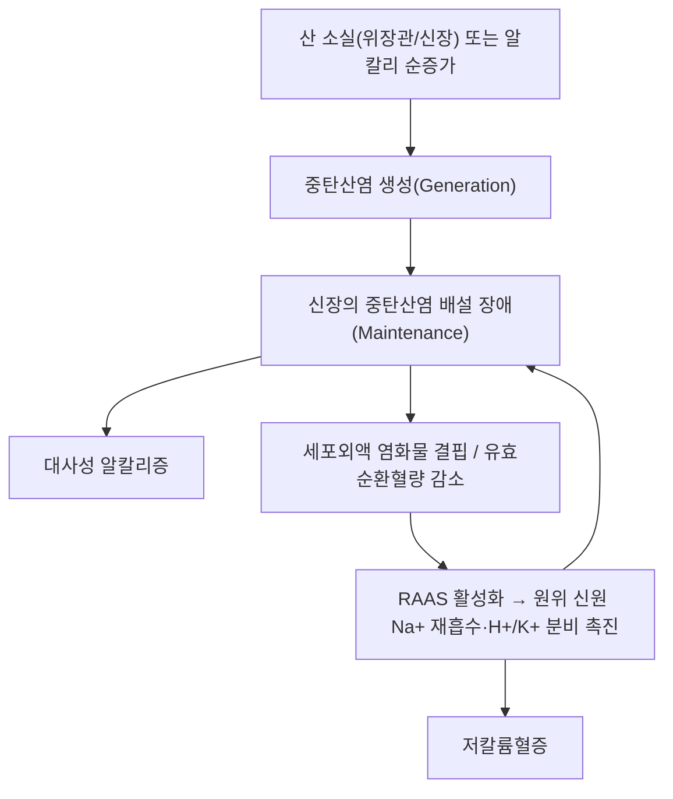

---
aliases:
  - 대사성 알칼리증
  - Metabolic Alkalosis
tags:
  - 이론
  - 질환
  - 산염기평형
  - 신장질환
  - 대사질환
title: 대사성 알칼리증
date: 2026-09-24
출처: "https://pubmed.ncbi.nlm.nih.gov/35525634/"
---
# 🧪 [[대사성 알칼리증]] (Metabolic Alkalosis)

> **핵심 3줄 요약 (Key Summary)**:
> - 📍 병소 부위 & 해부·병태생리: 신장의 중탄산염(HCO₃⁻) 처리 이상(위장관·신장의 고정산 소실 또는 알칼리 순증가)으로 혈청 HCO₃⁻와 동맥혈 pH가 1차적으로 상승하는 전신 대사 이상. 호흡중추가 저환기(과탄산혈증)로 부분 보상.
> - 🚩 전형적 임상 양상 & 3대 징후: 대개 비특이적·무증상이나, 근육 약화·저칼륨혈증성 부정맥·테타니(저칼슘혈증 동반 시)가 나타날 수 있음.
> - 🛠️ 핵심 감별 검사 & 한·양방 다각적 치료 전략: 동맥혈가스분석(ABGA)·소변 염소(urine chloride)로 염화물 반응성/비반응성 감별. 염화물 반응성은 생리식염수로 교정, 비반응성은 원인 질환 치료(고알도스테론증·바터/기텔만 증후군 등)가 필요.
> - ⚠️ 응급 의뢰 레드플래그: 동맥혈 pH ≥ 7.55는 중환자 사망률 증가와 연관. 중증·약물저항성은 응급/신장내과 의뢰가 필요하며 한의원 단독 관리 대상이 아님.

---

## 📌 목차
1. [질환 개요 & 해부학적 병태생리](#1-질환-개요--해부학적-병태생리)
2. [병태생리 메커니즘 & 생체역학적 악순환 네트워크](#2-병태생리-메커니즘--생체역학적-악순환-네트워크)
3. [임상 증상 & 이학적 검사(Physical Exam) 알고리즘](#3-임상-증상--이학적-검사physical-exam-알고리즘)
4. [감별 진단 매트릭스 (Differential Diagnosis)](#4-감별-진단-매트릭스-differential-diagnosis)
5. [한의 통합 치료 프로토콜 (침·약침·추나·한약)](#5-한의-통합-치료-프로토콜-침약침추나한약)
6. [재활 운동 & 생활습관 티칭 가이드](#6-재활-운동--생활습관-티칭-가이드)
7. [💡 사용자 진료실 핵심 필기 & 임상 노하우 (Melt-In 잔여 심화 집약)](#7--사용자-진료실-핵심-필기--임상-노하우-melt-in-잔여-심화-집약)
8. [출처 및 학술 참고 문헌 (References)](#8-출처-및-학술-참고-문헌-references)

---

## 1. 질환 개요 & 해부학적 병태생리

![[대사성알칼리증_산염기평형_Davenport_병태생리도해.jpg|450]]
> 출처: Wikimedia Commons, Davenport diagram (CC BY-SA 3.0)

> ⚠️ 이 노트는 신규 작성 노트로, 원장님의 수기 필기·이미지가 없습니다. 근골격계 국소 병변이 아닌 전신 대사 이상이라 실제 학술 도해를 아직 확보하지 못했습니다(추후 원장님 자료가 있으면 추가).

* **질환 정의**: 동맥혈 pH 상승(> 7.45)과 함께 혈청 중탄산염(HCO₃⁻)이 1차적으로 증가한 상태. 신장은 정상적으로 여과된 중탄산염을 거의 전량 재흡수하고 남는 것은 배설하는데, 이 기전이 방해받으면 알칼리증이 유발·지속됩니다.
* **보상 기전**: 호흡중추가 저환기로 반응해 동맥혈 PCO₂를 높여 pH 상승을 부분적으로 상쇄합니다(급성기에는 완전 보상되지 않음).
* **중증도**: 동맥혈 pH ≥ 7.55는 중환자에서 사망률 증가와 연관된 것으로 보고됩니다.
* **관련 "해부학적" 구조물 (⚠️ 국소 병변이 아니라 정직하게 재정의)**: 주요 관여 장기는 신장(중탄산염 재흡수·배설), 위장관(구토·비위관 흡인 시 산 소실), 부신([[알도스테론]] 과잉 시 미네랄로코르티코이드 경로)입니다.

---

## 2. 병태생리 메커니즘 & 생체역학적 악순환 네트워크

![[대사성알칼리증_집합관이온수송_해부도해.jpg|450]]
> 출처: Wikimedia Commons (CC BY-SA 4.0)

### 1) 발생(Generation) 단계
* **위장관 산 소실**: 구토, 지속적 비위관 흡인(위산 HCl 소실).
* **신장 산 소실**: 루프·티아지드계 이뇨제, 미네랄로코르티코이드 과잉(원발성 고알도스테론증, [[알도스테론]] 과분비 상태), 바터/기텔만 증후군(유전성 염소 소실성 세뇨관병증) — 헨레고리 상행각·원위세뇨관의 이온수송체 결함으로 저칼륨성·저염소성 알칼리증이 나타난다(Koulouridis 2015; Zhu 2026).
* **알칼리 순증가**: 중탄산나트륨 등 알칼리 대량 투여, 우유-알칼리 증후군.
* **수축성 알칼리증(Contraction alkalosis)**: 이뇨제로 염화물이 풍부한 세포외액만 급격히 빠지면서 같은 양의 중탄산염이 더 작은 부피에 농축되는 현상.

### 2) 유지(Maintenance) 단계 — 왜 저절로 교정되지 않는가
* 정상 신장은 과잉 중탄산염을 신속히 배설하지만, **유효순환혈량 감소·염화물 결핍·저칼륨혈증**이 있으면 근위세뇨관 중탄산염 재흡수가 오히려 촉진되어 알칼리증이 지속됩니다(Do 2022).

---

## 3. 임상 증상 & 이학적 검사(Physical Exam) 알고리즘

### 1) 주소증 및 신체 징후
* 대부분 비특이적입니다. 경도는 무증상이나, 중증에서는 근육 약화·저칼륨혈증에 의한 부정맥, 테타니(저칼슘혈증 동반 시), 의식 저하가 나타날 수 있습니다.

### 2) 필수 검사법 (⚠️ 근골격계 유발 검사가 아닌 검사실 검사로 정직하게 재정의)
* **동맥혈가스분석(ABGA)**: pH↑, HCO₃⁻↑, 보상성 PCO₂↑.
* **전해질**: 혈청 칼륨(대부분 저칼륨혈증 동반), 염소.
* **소변 염소(urine chloride)**: 염화물 반응성/비반응성 감별의 핵심 검사.
* **혈장 레닌·알도스테론**: 이차 원인(고알도스테론증, 바터/기텔만 증후군) 감별.

---

## 4. 감별 진단 매트릭스 (Differential Diagnosis)

| 감별 범주 | 대표 원인 | 소변 염소 | 혈압 | 특징 |
| :--- | :--- | :--- | :--- | :--- |
| 염화물 반응성 | 구토, 비위관 흡인, 수축성 알칼리증 | < 20 mEq/L | 정상~저혈압 | 생리식염수 투여로 교정 |
| 염화물 비반응성 · 고혈압 동반 | 원발성 고알도스테론증, 쿠싱증후군 | > 20 mEq/L | 고혈압 | 미네랄로코르티코이드 과잉 |
| 염화물 비반응성 · 정상~저혈압 | 바터/기텔만 증후군, 중증 저칼륨혈증 | > 20 mEq/L | 정상~저혈압 | 유전성 세뇨관병증 |
| [[호흡성 알칼리증]] (감별 대상) | 과호흡, 저산소혈증 | 해당 없음 | - | 1차 이상이 PCO₂ 저하이며 HCO₃⁻는 보상성 저하 |

---

## 5. 한의 통합 치료 프로토콜 (침·약침·추나·한약)

![[대사성알칼리증_생리식염수수액_치료도해.jpg|450]]
> 출처: Wikimedia Commons (CC BY 4.0)

* **침구·약침·추나 치료**: 급성기 자체에 대한 특이적 침·약침·추나 프로토콜은 문헌으로 확인하지 못했습니다(⚠️ 확인 안 되어 창작하지 않음).
* **한약 치료 (⚠️ 내용 검토 필요)**: 대사성 알칼리증은 현대 검사실 진단명으로, 고전 문헌의 특정 병증과 1:1로 대응되는 근거는 확인하지 못했습니다. 다만 주요 유발 원인인 **구토·설사로 인한 진액(津液) 손상**과 **과도한 이뇨로 인한 기음양허(氣陰兩虛)**는 한의학에서 오래 다뤄온 병기이며, 저칼륨혈증에 따른 근육 무력감은 비기허(脾氣虛)·근위(筋痿) 범주와 연결지어 볼 여지가 있습니다. 이는 본 노트 작성자의 이론적 유추이며, 실제 처방·본초 연계는 검증된 문헌으로 확인되기 전까지 비워둡니다.
* **현대 의학적 치료 (참고)**: 원인 치료가 우선이며(구토 조절, 원인 약물 중단·조정), 염화물 반응성은 생리식염수(0.9% NaCl)로 세포외액량·염화물을 보충하고, 염화물 비반응성은 원인 질환 치료(미네랄로코르티코이드 수용체 길항제, 칼륨·마그네슘 보충 등)가 필요합니다. 저칼륨혈증 동반 시 칼륨 보충이 필수이며, 중증·약물저항성은 아세타졸아미드 또는 중환자에서 염산(HCl) 정맥 투여를 고려합니다(Do 2022).

---

## 6. 재활 운동 & 생활습관 티칭 가이드

> ⚠️ 근골격계 재활 운동이 아닌, 원인 질환 관리·생활습관 교육으로 정직하게 재정의합니다.

* 원인 약물(이뇨제) 복용력 확인 및 조정, 반복 구토·비위관 흡인 시 조기 전해질 모니터링 교육.
* 볼트 내 관련 노트: [[저알부민혈증]](체액·전해질 이상을 동반하는 유사 계열 질환).

---

## 7. 💡 사용자 진료실 핵심 필기 & 임상 노하우 (Melt-In 잔여 심화 집약)

* 이 노트는 신규 작성이며, 기존에 원장님이 남긴 진료실 필기가 없습니다.

---

## 8. 출처 및 학술 참고 문헌 (References)

1. **Do C, Vasquez PC, Soleimani M (2022)**. *Metabolic Alkalosis Pathogenesis, Diagnosis, and Treatment: Core Curriculum 2022*. **Am J Kidney Dis**, 80(4):536-551. PMID: [35525634](https://pubmed.ncbi.nlm.nih.gov/35525634/) · DOI: [10.1053/j.ajkd.2021.12.016](https://doi.org/10.1053/j.ajkd.2021.12.016)
   - **[연구 요약]**: 대사성 알칼리증의 발생(generation)·유지(maintenance) 기전을 신장 중탄산염 처리 관점에서 정리한 핵심 종설. 중증(pH≥7.55)의 사망률 연관성, 염화물 반응성/비반응성 분류, 치료 원칙(생리식염수·칼륨 보충·아세타졸아미드)을 다룸.
2. **Rabelo RC, Autran de Morais H (2026)**. *Quick Reference on Metabolic Alkalosis*. **Vet Clin North Am Small Anim Pract**, 56(1):27-32. PMID: [41136256](https://pubmed.ncbi.nlm.nih.gov/41136256/) · DOI: [10.1016/j.cvsm.2025.09.023](https://doi.org/10.1016/j.cvsm.2025.09.023)
   - **[연구 요약]**: 구토·이뇨제·저알부민혈증에 의한 대사성 알칼리증을 염화물 반응성/비반응성으로 나누고 수액·전해질 치료 원칙을 요약(수의학 문헌이나 병태생리 기술은 사람과 동일한 원리를 따름).
3. **Koulouridis E, Koulouridis I (2015)**. *Molecular pathophysiology of Bartter's and Gitelman's syndromes*. **World J Pediatr**, 11(2):113-125. PMID: [25754753](https://pubmed.ncbi.nlm.nih.gov/25754753/) · DOI: [10.1007/s12519-015-0016-4](https://doi.org/10.1007/s12519-015-0016-4)
   - **[연구 요약]**: 유전성 염소 소실성 세뇨관병증인 바터·기텔만 증후군의 이온수송체 결함과 저칼륨성 대사성 알칼리증 발생 기전을 정리.
4. **Zhu L, Li Y, Bao Y (2026)**. *Molecular Genetics of Bartter Syndrome: Bridging Genotype-Phenotype Correlations and Precision Therapeutics*. **Curr Issues Mol Biol**, 48(4):422. PMID: [42042082](https://pubmed.ncbi.nlm.nih.gov/42042082/) · DOI: [10.3390/cimb48040422](https://doi.org/10.3390/cimb48040422)
   - **[연구 요약]**: 바터증후군의 원인 유전자(SLC12A1, KCNJ1, CLCNKB, BSND, MAGED2)와 저칼륨성·저염소성 대사성 알칼리증·이차 고알도스테론증 표현형을 정리한 최신 리뷰.

> ⚠️ 이미지 미수록: 원본 노트가 완전히 비어 있던 신규 작성 노트라 원장님 필기·실제 도해 이미지가 없습니다. 추후 자료가 확보되면 §1~§5에 보강해 주세요.

<!-- 보관 태그(1회용·링크오류, 필요시 복원): 전해질질환 -->
