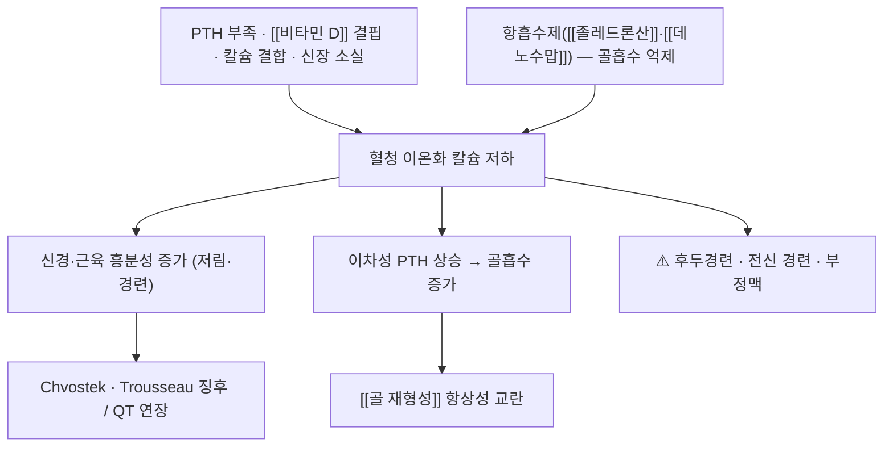

# 🩺 저칼슘혈증 (Hypocalcemia)

> **핵심 3줄 요약 (Key Summary)**:
> - 📍 병소 부위 & 해부·병태생리: 혈청(알부민 교정) 칼슘 저하. 원인은 부갑상선호르몬(PTH) 부족 · [[비타민 D]] 결핍 · 칼슘 결합(킬레이트) · 신장 소실 네 갈래
> - 🚩 전형적 임상 양상: 손발 저림·입 주위 감각이상, 근경련, **Chvostek·Trousseau 징후**, 중증에서는 후두경련·전신 경련·QT 연장
> - 🛠️ 핵심 검사 & 치료 전략: 원인 교정 + 칼슘·비타민 D 보충. [[졸레드론산]]·[[데노수맙]] 투여 전 교정이 원칙 → [[골교체표지자]]
> - ⚠️ 응급 의뢰 레드플래그: 후두경련(기도 폐쇄), 전신 경련, 의식 변화, QT 연장에 따른 부정맥 → 즉시 응급실(정맥 칼슘 필요)

---

## 📌 목차
1. [질환 개요 & 해부학적 병태생리](#1-질환-개요--해부학적-병태생리)
2. [병태생리 메커니즘 & 생체역학적 악순환 네트워크](#2-병태생리-메커니즘--생체역학적-악순환-네트워크)
3. [임상 증상 & 이학적 검사(Physical Exam) 알고리즘](#3-임상-증상--이학적-검사physical-exam-알고리즘)
4. [감별 진단 매트릭스 (Differential Diagnosis)](#4-감별-진단-매트릭스-differential-diagnosis)
5. [한의 통합 치료 프로토콜 (침·약침·추나·한약)](#5-한의-통합-치료-프로토콜-침약침추나한약)
6. [양방 치료 & 병용·의뢰 기준 (Conventional Treatment & Referral)](#6-양방-치료--병용의뢰-기준-conventional-treatment--referral)
7. [재활 운동 & 생활습관 티칭 가이드](#7-재활-운동--생활습관-티칭-가이드)
8. [💡 사용자 진료실 핵심 필기 & 임상 노하우 (Melt-In 잔여 심화 집약)](#8--사용자-진료실-핵심-필기--임상-노하우-melt-in-잔여-심화-집약)
9. [출처 및 학술 참고 문헌 (References)](#9-출처-및-학술-참고-문헌-references)

---

## 1. 질환 개요 & 해부학적 병태생리

* **정의**: 혈청 총칼슘 저하 또는 **알부민 교정 칼슘(교정 Ca = 측정 Ca + 0.8 × (4.0 − 알부민))** 저하. 알부민이 낮으면 총칼슘이 낮아도 **이온화 칼슘은 정상**일 수 있다
* **주요 원인**
  * **PTH 부족**: 갑상선·부갑상선 수술 후(병원성 저칼슘혈증의 가장 흔한 원인), 자가면역·유전성 저부갑상선증
  * [[비타민 D]] 결핍·활성화 장애: 실내 생활·흡수장애·만성 신장병
  * **칼슘 결합·킬레이트**: 대량 수혈(구연산), 중증 췌장염, 종양용해증후군
  * **약물**: 항흡수제([[졸레드론산]]·[[데노수맙]]·비스포스포네이트), 루프 이뇨제([[푸로세미드]]), 일부 항경련제·화학요법제
* **관련 조절계**: 부갑상선호르몬 · [[비타민 D]] · 칼시토닌 · 마그네슘(교정의 필수 동반 변수)

---

## 2. 병태생리 메커니즘 & 생체역학적 악순환 네트워크

### 1) 분자·세포 수준 기전
* 이온화 칼슘 저하 → 신경말단·근육세포막 나트륨 채널 흥분성 증가 → 자발적 방전(경련·감각이상)
### 2) 장기·계통 수준 결과
* 심장(QT 연장 → 부정맥), 신경(경련·의식 변화), 골(이차성 부갑상선항진 → 골소실)
### 3) 진행 단계
* 무증상(경증) → 감각이상·근경련(중등도) → 후두경련·전신 경련·부정맥(중증, 응급)

---

## 3. 임상 증상 & 이학적 검사(Physical Exam) 알고리즘

### 1) 주요 임상 양상
* 손발 저림(입 주위 포함), 근육 경련·연축, 피로, 기분 변화, 중증에서 후두경련·전신 경련
### 2) 진료실 이학적 검사
* **Chvostek 징후**: 안면신경 자극 시 같은 쪽 얼굴 근육 수축
* **Trousseau 징후**: 혈압계 커프를 수축기 이상으로 3분간 유지했을 때 손의 경련성 굴곡(민감도가 더 높다고 알려짐)
* 심전도 QT 연장 확인
### 3) 검사
* 총칼슘·알부민·이온화 칼슘 / **마그네슘**(교정하지 않으면 칼슘도 오르지 않는다) / 인 / 25-OH 비타민 D / PTH / 신기능

---

## 4. 감별 진단 매트릭스 (Differential Diagnosis)

| 감별 질환 | 특징적 양상 | 감별 포인트 |
| :--- | :--- | :--- |
| [[저칼슘혈증]] (본 질환) | 저림·근경련, Chvostek/Trousseau | 총·이온화 칼슘 저하 |
| 저마그네슘혈증 | 같은 증상, 칼슘 보충에 반응 없음 | Mg 낮음 |
| 과호흡 | 손발 저림·어지럼 | 호흡성 알칼리증, Ca 정상 |
| 갑상선 수술 후 부갑상선 손상 | 수술 직후 증상 | PTH 저하 |
| [[당뇨병성 말초신경병증]] | 화끈거림·저림 | Ca 정상, 감각검사 이상 |

---

## 5. 한의 통합 치료 프로토콜 (침·약침·추나·한약)

* **변증**: 간신음허 · 혈허(근경련·경련) · 비위허약(흡수 불량) · 담습
* **침구**: 근경련 완화 목적으로 족삼리(足三里 ST36)·삼음교(三陰交 SP6)·양릉천(陽陵泉 GB34)·승산(承山 BL57) 자극. **전신 경련·의식 변화에서는 침 치료를 중단하고 응급 이송이 우선**
* **약침·추나**: 경련성 근긴장에 저강도 이완 기법. 급성 경련기에는 시행하지 않는다 → [[추나]]
* **한약**: 비위 기능을 세워 흡수를 돕는 처방(예: [[향사육군자탕]]·[[보중익기탕]] 계열)을 보조로 고려
* **주의**: 골다공증 주사 치료 중인 환자가 '한약 때문'이라며 주사를 임의 중단하지 않도록 상담한다 — 순서는 **전환 확정 → 보조 병행**

---

## 6. 양방 치료 & 병용·의뢰 기준 (Conventional Treatment & Referral)

* **약물 치료 (Medication)**: 무증상 경증 — 경구 [[칼슘]](1,000~1,500 mg/일 분복) + [[비타민 D]]. 중증·증상 동반 — 정맥 칼슘 글루콘산(응급)
* **비약물 시술 (Procedures)**: 해당 없음. 마그네슘 결핍 동반 시 교정 병행
* **수술·시술 적응증 (Surgical Indication)**: 수술 후 지속성 저부갑상선증은 내분비 관리 영역
* **한의 병용 판단 (Combination Therapy)**: **병용 가능**(수치·증상 기준) / 경련·의식 변화는 한의 치료 범위가 아니다
* **양방·전문과 의뢰 기준 (Referral Criteria)**: 후두경련·전신 경련·QT 연장 → 즉시 응급 / 수술 후 저부갑상선증 → 내분비
* **예방 실무**: 항흡수제 시작 전 칼슘·비타민 D 교정은 **전제 조건** → [[졸레드론산]] · [[데노수맙]]

---

## 7. 재활 운동 & 생활습관 티칭 가이드

* **식이**: 유제품·뼈째 먹는 생선·녹색 채소·두부 등 칼슘 급원, 햇빛 노출과 비타민 D 보충 병행
* **생활습관**: 카페인·과량 나트륨·과음은 칼슘 배설을 늘린다. 흡연은 골과 칼슘 모두에 불리
* **자가관리**: 근경련·저림 발생 시기(야간·운동 후)를 기록, 보충제 복용 시각 고정
* **환자 교육 스크립트**
  > "뼈 주사약은 칼슘이 충분해야 안전합니다. 그래서 주사를 시작하기 전에 칼슘·비타민 D를 먼저 채우고, 손발이 저리거나 쥐가 자주 나면 즉시 알려 주셔야 합니다."
* **정기 추적**: 항흡수제 투여 중에는 칼슘·비타민 D·신기능을 주기적으로 확인

---

## 8. 💡 사용자 진료실 핵심 필기 & 임상 노하우 (Melt-In 잔여 심화 집약)

> 🛡️ **Melt-In 원칙**: 기존 스텁에는 원장님 필기가 없었다.

* **골다공증 약 복용자에서 '야간 쥐'는 저칼슘혈증 신호일 수 있다** — 단순 근경련으로 넘기지 않는다
* **Chvostek·Trousseau는 진료실에서 즉시 시행 가능** — 저림·경련 호소 시 확인
* **마그네슘을 잊지 말 것** — 저마그네슘혈증이 있으면 칼슘을 채워도 교정되지 않는다
* **환자 티스크립트**
  > "손발 저림과 쥐가 잦아지면 약의 부작용일 수 있으니 참지 마시고 알려 주세요. 검사로 칼슘·마그네슘을 확인하면 대부분 간단히 교정됩니다."

---

## 9. 출처 및 학술 참고 문헌 (References)

1. **Tsourdi E, et al. (2021)**. *Fracture risk and management of discontinuation of denosumab therapy: a systematic review and position statement by ECTS*. **J Clin Endocrinol Metab**, 106(1):264-281. [PMID 33103722](https://pubmed.ncbi.nlm.nih.gov/33103722/)
   - **[연구 요약]**: 데노수맙 중단 관리 알고리즘 — **전환 전 칼슘·비타민 D 교정이 전제 조건**임을 명시.
2. **Chen CH, et al. (2024)**. *Zoledronate Sequential Therapy After Denosumab Discontinuation…*. **JAMA Netw Open**, 7(11):e2443899. [PMID 39527056](https://pubmed.ncbi.nlm.nih.gov/39527056/)
   - **[연구 요약]**: 졸레드론산 전환 RCT — 항흡수제 치료에서 칼슘·비타민 D 보충이 기본 조건임을 전제로 설계.
3. **MSD 매뉴얼 전문가용** — [Hypocalcemia](https://www.msdmanuals.com/professional)
   - **[교과서]**: 원인·임상 징후·응급 처치 개요(스텁 작성 원출처).

---

## 관련 노트

- [[칼슘]] · [[비타민 D]] · [[골다공증]] · [[골 재형성]] · [[졸레드론산]] · [[데노수맙]] · [[척추 압박 골절]]

---

## 📎 개념 학습 보충 (2026-09-26 논문 연계)

- **보강 사유**: 2026-09-25 MSD 추출 **스텁** → 2026-09-26 회차에서 표준 양식으로 채웠다(보강 완료).
- **오늘 논문과의 연결**: 2026-09-26 심층리뷰 3번(데노수맙 중단 후 졸레드론산 전환)에서 **저칼슘혈증을 막기 위한 칼슘·비타민 D 보충이 전환의 전제 조건**임이 강조된다. 항흡수제는 골흡수 억제 → 혈중 칼슘 유입 감소 경로로 저칼슘혈증을 유발할 수 있다 → [[졸레드론산]] · [[데노수맙]] · [[골교체표지자]]
- **진료실 적용**: 골다공증 주사 이력이 있는 환자의 **야간 근경련·손발 저림**은 저칼슘혈증 감별 대상이다 — Chvostek·Trousseau를 시행하고 필요 시 검사 의뢰
- **⚠️ 이미지 미확보 보고**: 스텁 보강 회차로 도해·임상 이미지 슬롯은 채우지 못했다(다음 보강 과제)
- **관련**: [[2026-09-26_대사노인질환_심층리뷰]] 3번
