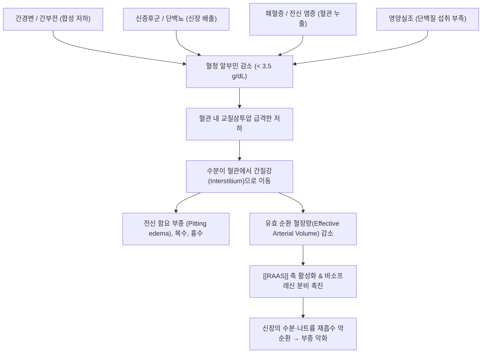

---
aliases:
  - 저알부민혈증
  - Hypoalbuminemia
tags:
  - 질환
  - 순환기계
  - 혈액질환
  - 간질환
  - 신장질환
  - 부종
  - 영양실조
---
# 🩸 [[저알부민혈증]] (Hypoalbuminemia)

> **핵심 요약 (Key Summary)**:
> 혈청 알부민(Albumin) 농도가 정상 범위(3.5~5.0 g/dL) 미만인 3.5 g/dL 이하로 감소한 병리 상태.
> 혈관 내 교질삼투압(Colloid Oncotic Pressure) 저하로 체액이 간질 조직으로 빠져나가 전신 부종, 복수, 흉수 및 유효 혈액량 감소를 초래.
> 간경변(합성 저하), 신증후군(소변 배출), 단백상실성 위장관염(소실), 패혈증(모세혈관 누출)에서 호발하며 한의학의 수종(水腫)·고창(鼓脹)과 연계.

---

## 📌 목차
1. [정의 및 정상 생리 (Physiology)](#1-정의-및-정상-생리-physiology)
2. [발생 원인 및 병태생리 (Etiology & Pathophysiology)](#2-발생-원인-및-병태생리-etiology--pathophysiology)
3. [임상 징후 및 전신 합병증](#3-임상-징후-및-전신-합병증)
4. [진단 평가 및 현대 의학적 치료](#4-진단-평가-및-현대-의학적-치료)
5. [한의학적 변증 및 본초·처방 연계](#5-한의학적-변증-및-본초처방-연계)
6. [출처 및 학술 참고 문헌 (References)](#6-출처-및-학술-참고-문헌-references)

---

## 1. 정의 및 정상 생리 (Physiology)

* **혈청 알부민의 역할**:
  * 간세포(Hepatocyte)에서만 독점적으로 합성되는 단백질(일일 약 12~25g 생성).
  * 혈장 총 교질삼투압(Oncotic pressure)의 **75~80%를 담당**하여 혈관 내 수분을 유지시키는 핵심 단백질.
  * 빌리루빈, 칼슘, 유리지방산, 호르몬 및 지용성 약물(와파린, NSAIDs 등)의 필수 운반체(Carrier).
* **진단 기준**:
  * 정상치: 3.5 ~ 5.2 g/dL
  * 경도: 3.0 ~ 3.5 g/dL
  * 중등도: 2.5 ~ 3.0 g/dL
  * 중증: < 2.5 g/dL (임상적으로 뚜렷한 함요 부종 및 복수 출현)

---

## 2. 발생 원인 및 병태생리 (Etiology & Pathophysiology)

1. **간 합성 저하**:
   * 만성 간경변증, 전격성 간부전. 간 실질 세포 파괴로 알부민 생산 불능.
2. **신장 단백 소실**:
   * [[신증후군]](Nephrotic syndrome): 사구체 기저막 파괴로 하루 3.5g 이상의 알부민이 소변으로 유출.
3. **위장관 및 피부 소실**:
   * 단백상실성 장병증(PLE), 중증 광범위 화상(혈장 누출).
4. **급성기 염증 및 모세혈관 누출 (Negative Acute Phase Reactant)**:
   * 패혈증, 중증 외상 시 사이토카인([[IL-6]], [[TNF-α]])에 의해 간에서의 알부민 합성이 억제되고 모세혈관 투과성이 급증하여 제3공간으로 알부민이 빠져나감.

---

## 3. 임상 징후 및 전신 합병증

* **말초 함요 부종 (Pitting Edema)**:
  * 중력 방향인 발목, 정강이, 천골 부위를 손가락으로 누르면 쑥 들어가서 서서히 복원되는 부종.
* **장막강 삼출 (Serous Cavity Effusion)**:
  * **복수(Ascites)**: 복부 팽만, 배꼽 돌출, 악화 시 자발성 세균성 복막염(SBP).
  * **흉수(Pleural effusion)**: 호흡곤란 및 흉부 압박감.
* **약물 결합능 저하 및 약물 독성 위험**:
  * 단백 결합률이 높은 약물(항생제, 페니토인, 와파린 등)의 혈중 유리형(Free form) 농도가 급증하여 통상 용량 투약 시에도 중대한 약물 독성 유발.

---

## 4. 진단 평가 및 현대 의학적 치료

* **검사실 검사**:
  * 혈청 알부민, 총 단백, 간기능 수치(AST/ALT/PT), 소변 단백/크레아티닌 비율(UPCR), 24시간 소변 단백량.
* **현대 의학적 치료**:
  * **원인 질환 치료**: 신증후군 시 면역억제제/스테로이드, 간경변 시 문맥압 강하.
  * **염분 및 수분 제한**: 하루 나트륨 2g 미만 제한.
  * **이뇨제 병용 요법**: 스피로놀락톤(Spironolactone) + 루프 이뇨제(Furosemide).
  * **정맥용 고농도 알부민 주사**: 대량 복수 천자(Paracentesis) 시행 시 또는 간신증후군(HRS) 치료 시 보충.

---

## 5. 한의학적 변증 및 본초·처방 연계

* **한의학 병리 (수종 水腫, 고창 鼓脹)**:
  * 한의학에서는 수액 대사를 폐(통조수도), 비(운화수습), 신(온화증등)의 삼장(三臟) 협동 작용으로 인식.
  * 저알부민혈증은 **비신양허(脾腎陽虛)**로 인해 수습을 제어하지 못해 체표와 복강으로 쏟아지는 음수(陰水)의 전형.
* **핵심 본초**:
  * [[복령]], [[저령]], [[택사]]: 이수삼습하여 불필요한 체액 배출.
  * [[백출]], [[황기]]: 익기건비하여 비위의 단백 흡수와 운화 기능을 강화.
  * [[부자]]: 신양(命門火)을 데워 신장의 수액 증등 기화 작용을 재가동.
* **대표 처방**:
  * [[진무탕]](眞武湯): 비신양허성 심한 하지 부종, 복수, 소변불리.
  * [[방기황기탕]](防己黃芪湯): 표허습성 부종, 무력감.
  * [[오령산]](五苓散): 수액 정체형 부종 초기 배뇨 촉진.

---

## 6. 출처 및 학술 참고 문헌 (References)

* Gatta, A., et al. (2012). Hypoalbuminemia. *Internal and Emergency Medicine*, 7(Suppl 3), 193-199.
  * `[연구 요약]` 저알부민혈증의 병인론적 분류, 교질삼투압 손실 및 알부민 보충 요법의 임상 지침을 체계화한 종설.
* Vincent, J. L., et al. (2003). Hypoalbuminemia in acute illness: is there a rationale for intervention? *Annals of Surgery*, 237(3), 319-334.
  * `[연구 요약]` 중증 급성기 환자에서 저알부민혈증이 사망률과 장기 부전에 미치는 독립적 예후 인자임을 규명.
