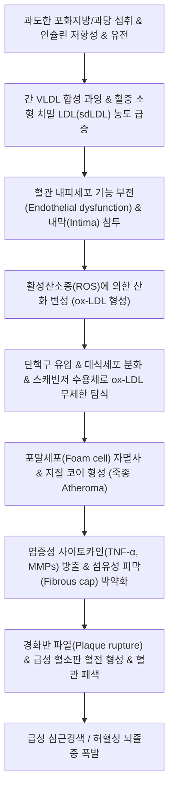

# 🩺 [[고지혈증]] (이상지질혈증, Dyslipidemia / 高脂血症, E78)

> **핵심 3줄 요약 (Key Summary)**:
> - 📍 **병소 부위 & 해부·병태생리**: 혈중 총콜레스테롤, 저밀도지단백 콜레스테롤([[LDL-C]]), 중성지방([[TG]])이 비정상적으로 상승하거나 고밀도지단백 콜레스테롤([[HDL-C]])이 저하된 상태로, 소형 치밀 LDL(sdLDL)이 혈관 내피를 침투하여 산화(ox-LDL)된 후 대식세포에 탐식되어 포말세포(Foam cell) 및 **[[죽상동맥경화증]]** 플라크를 형성함.
> - 🚩 **전형적 임상 양상 & 3대 징후**: 초기에는 자각 증상이 전혀 없는 '침묵의 살인자'이나, 혈관 직경 70% 이상 협착 시 [[협심증]]·간헐적 파행 발현, 아킬레스건 황색종(Xanthoma) 및 안검황색종(Xanthelasma), TG 500mg/dL 초과 시 급성 췌장염 유발.
> - 🛠️ **핵심 감별 검사 & 한·양방 다각적 치료 전략**: 12시간 공복 지질 패널(TC, TG, HDL-C, LDL-C) 및 심혈관 위험도 층화 평가, 1차 약물 HMG-CoA 환원효소 억제제([[스타틴]]) 및 [[에제티미브]], 담탁어혈(痰濁瘀血) 변증 기반 거습화담·활혈통락 한약([[온담탕]], [[방풍통성산]], [[혈부축어탕]]), [[중완]](CV12)·[[풍륭]](ST40)·[[족삼리]](ST36) 전침 시술.
> - ⚠️ **응급 의뢰 레드플래그 & 악화 요인**: 흉골 하부 쥐어짜는 듯한 흉통 및 방사통([[급성 관상동맥 증후군]] 의심), 급격한 구음장애/편측 마비([[뇌졸중]]), TG > 1,000mg/dL 동반 극심한 심와부 복통(급성 췌장염) 발생 시 즉시 응급실 전원; 스타틴 복용 중 갈색뇨 및 극심한 근통 발생 시 횡문근융해증 감별 의뢰.

---

## 📌 목차
1. [질환 개요 & 해부학적 병태생리](#1-질환-개요--해부학적-병태생리)
2. [병태생리 메커니즘 & 생체역학적 악순환 네트워크](#2-병태생리-메커니즘--생체역학적-악순환-네트워크)
3. [임상 증상 & 이학적 검사(Physical Exam) 알고리즘](#3-임상-증상--이학적-검사physical-exam-알고리즘)
4. [감별 진단 매트릭스 (Differential Diagnosis)](#4-감별-진단-매트릭스-differential-diagnosis)
5. [한의 통합 치료 프로토콜 (침·약침·추나·한약)](#5-한의-통합-치료-프로토콜-침약침추나한약)
6. [재활 운동 & 생활습관 티칭 가이드](#6-재활-운동--생활습관-티칭-가이드)
7. [💡 사용자 진료실 핵심 필기 & 임상 노하우 (Melt-In 잔여 심화 집약)](#7--사용자-진료실-핵심-필기--임상-노하우-melt-in-잔여-심화-집약)
8. [출처 및 학술 참고 문헌 (References)](#8-출처-및-학술-참고-문헌-references)

---

## 1. 질환 개요 & 해부학적 병태생리

![[동맥경화증-20240524162242470.png|450]]
> [그림 1: ① 질환/병태생리 메디컬 일러스트 — 죽상동맥경화증의 내막 지질 침투 및 경화반 형성 병태생리 도해]

### 1) 질환 정의 및 역학적 특성
고지혈증([[Hyperlipidemia]]) 및 이상지질혈증([[Dyslipidemia]], ICD-10 E78)은 혈액 내 지질 성분(콜레스테롤, 중성지방)의 대사 이상으로 인해 혈중 지질 농도가 비정상적으로 높아지거나, 지질 제거에 관여하는 고밀도지단백(HDL)이 감소한 상태를 포괄한다. 현대 임상의학에서는 단순히 혈중 콜레스테롤이 높은 상태만을 지칭하는 고지혈증 대신, 죽상경화 유발 지단백(Atherogenic lipoproteins)의 상승과 항죽상경화 지단백(HDL)의 감소를 모두 포괄하는 **'이상지질혈증'**을 표준 용어로 사용한다.

한국지질·동맥경화학회 Fact Sheet에 따르면 20세 이상 성인의 이상지질혈증 유병률은 40%를 상회하며, 특히 50대 이후 남성의 50%, 여성의 55% 이상이 이환되는 국민 만성 대사 질환이다. 고혈압, [[당뇨병]], [[비만]]과 함께 **[[대사증후군]](Metabolic syndrome)**의 핵심 축을 형성하며, 관상동맥질환([[협심증]], [[심근경색]])과 허혈성 [[뇌졸중]], 말초동맥폐쇄질환(PAD)의 독립적인 최상위 위험 인자이다.

### 2) 지질 대사 및 관련 해부학적 구조물
* **간(Liver)과 혈관계의 지질 순환**:
  * **외인성 경로 (Chylomicron)**: 식이로 섭취된 지방산과 콜레스테롤이 소장 점막에서 유미미립(Chylomicron)으로 흡수되어 흉관을 거쳐 전신 정맥계로 유입. 지단백 리파아제(LPL)에 의해 중성지방이 분해된 후 잔여물(Remnant)은 간의 LDL 수용체를 통해 섭취됨.
  * **내인성 경로 (VLDL $\rightarrow$ IDL $\rightarrow$ LDL)**: 간세포에서 HMG-CoA 환원효소에 의해 합성된 콜레스테롤이 초저밀도지단백(VLDL) 형태로 혈액으로 분비됨. 말초 조직에서 TG가 빠져나가며 중간밀도지단백(IDL)을 거쳐 최종적으로 콜레스테롤 함량이 가장 높은 저밀도지단백([[LDL-C]])으로 전환됨.
* **표적 조직 해부학**:
  * **대형 및 중형 동맥 혈관벽**: 관상동맥(Coronary arteries), 경동맥(Carotid arteries), 대뇌 동맥륜(Circle of Willis), 복부 대동맥, 신동맥, 장골동맥 및 대퇴동맥의 **내막(Intima)** 층이 죽상경화반 형성의 주 침범 부위이다.

---

## 2. 병태생리 메커니즘 & 생체역학적 악순환 네트워크

![[콜레스테롤합성_스타틴기전.png|450]]
> [그림 2: ② 관련 분자·대사 구조물 — 간세포 내 HMG-CoA 환원효소 경로 및 콜레스테롤 합성·스타틴 억제 기전 도해]

### 1) 분자 세포학적 죽상경화증(Atherosclerosis) 캐스케이드
* **소형 치밀 LDL(Small Dense LDL, sdLDL)의 병독성**:
  * 크기가 작고 밀도가 높은 sdLDL은 간의 정상적인 LDL 수용체와의 결합 친화도가 낮아 혈중 체류 시간이 2~3배 길다.
  * 혈관 내피세포 간극을 손쉽게 통과하여 혈관 내막 하 결합조직(Proteoglycans)에 갇히게 된다.
* **산화 변성(ox-LDL)과 면역 반응의 유발**:
  * 내막에 갇힌 sdLDL은 국소 활성산소종([[ROS]]) 및 효소적 변형에 의해 산화 LDL(ox-LDL)로 전환된다.
  * ox-LDL은 내피세포를 자극하여 접착분자(VCAM-1, ICAM-1)와 단핵구 주화성 인자(MCP-1)를 분비시켜 순환 단핵구를 혈관벽으로 강력히 끌어들인다.
* **포말세포(Foam Cell)화 및 지질괴 괴사**:
  * 내막으로 들어온 단핵구는 대식세포로 분화한 뒤, 음성 되먹임 제어가 없는 스캐빈저 수용체(Scavenger receptor, CD36/SR-A)를 통해 ox-LDL을 포식 한도 이상으로 탐식한다.
  * 세포질 내에 지질 방울이 가득 찬 '포말세포'가 집적되어 노란 줄무늬 형태의 **지방선조(Fatty streak)**를 형성하고, 결국 자멸사(Apoptosis)하여 콜레스테롤 결정으로 가득 찬 괴사성 지질 코어(Necrotic lipid core)를 구축한다.
* **섬유성 피막 파열과 급성 혈전 폐색**:
  * 혈관 평활근세포가 증식하여 지질 코어를 덮는 섬유성 피막(Fibrous cap)을 형성하나, 지속적인 염증 반응으로 대식세포가 기질분해효소(MMP-2, MMP-9)를 분비하여 피막을 얇게 침식시킨다.
  * 혈류의 전단 응력(Shear stress)에 의해 얇아진 피막이 찢어지면 내부의 고병원성 조직 인자(Tissue factor)가 혈류에 노출되어 수 초 만에 급성 혈소판 혈전이 형성되며 관상동맥이나 뇌혈관을 완전히 틀어막는다.

---

## 3. 임상 증상 & 이학적 검사(Physical Exam) 알고리즘

### 1) 진단 기준 및 지질 패널 수치 (한국지질·동맥경화학회 2022 가이드라인)
반드시 12시간 공복 후 채혈 검사를 원칙으로 한다.

| 검사 항목 | 적정 수준 (mg/dL) | 경계 수준 (mg/dL) | 이상지질혈증 진단 기준 (mg/dL) |
| :--- | :--- | :--- | :--- |
| **총콜레스테롤 (TC)** | < 200 | 200 ~ 239 | $\ge 240$ |
| **LDL 콜레스테롤 ([[LDL-C]])** | < 100 (초고위험군 < 55) | 100 ~ 129 | $\ge 130$ (치료 기준은 위험군별 상이) |
| **중성지방 ([[TG]])** | < 150 | 150 ~ 199 | $\ge 200$ (500 이상 시 급성 췌장염 초고위험) |
| **HDL 콜레스테롤 ([[HDL-C]])** | $\ge 60$ | - | 남성 < 40 / 여성 < 50 (저HDL혈증) |
| **Non-HDL 콜레스테롤** | < 130 | 130 ~ 159 | $\ge 160$ (중성지방 상승 시 보조 지표) |

### 2) 심혈관 위험군별 LDL-C 치료 목표치
* **초고위험군 (관상동맥질환, 죽상경화성 뇌졸중/TIA, 말초동맥질환 기왕력자)**:
  * 목표치: **LDL-C < 55 mg/dL** 및 기저치 대비 50% 이상 감소.
* **고위험군 (경동맥질환 협착 50% 이상, 복부대동맥류, 당뇨병 10년 이상 유병자)**:
  * 목표치: **LDL-C < 70 mg/dL**.
* **중등도위험군 (주요 심혈관 위험인자 2개 이상 보유자)**:
  * 목표치: **LDL-C < 100 mg/dL**.
* **저위험군 (주요 위험인자 1개 이하)**:
  * 목표치: **LDL-C < 130 mg/dL**.

### 3) 특징적 신체 징후 및 이학적 소견
* **유전성 가족성 고콜레스테롤혈증(FH)의 신체 징후**:
  * **아킬레스건 황색종(Tendinous Xanthoma)**: 아킬레스건이나 손가락 신전건에 콜레스테롤이 침착되어 단단한 결절이 만져짐 (두께 > 9mm).
  * **안검황색종(Xanthelasma palpebrarum)**: 양측 눈꺼풀 안쪽 피부에 편평한 황색 플라크 침착.
  * **각막환(Corneal arcus)**: 45세 미만에서 각막 가장자리에 회백색 고리 침착.
* **혈관 잡음(Bruit) 청진**:
  * 경동맥 및 복부 대동맥 청진 시 난류에 의한 수축기 혈관 잡음 청진 (혈관 협착 50% 이상 시사).

---

## 4. 감별 진단 매트릭스 (Differential Diagnosis)

| 감별 질환 | 주요 원인 및 병태 | 지질 패널 이상 패턴 | 특이 신체 징후 및 전신 소견 | 핵심 감별 검사 |
| :--- | :--- | :--- | :--- | :--- |
| **원발성 이상지질혈증** | 유전적 LDL 수용체 결함, 간 대사 이상 | 순수 LDL-C 단독 극심한 상승 또는 복합형 | 아킬레스건 황색종, 조기 심혈관질환 가족력 | 유전자 검사, 이차성 원인 모두 음성 |
| **[[갑상선 기능 저하증]]** | 간 세포 LDL 수용체 발현 저하 | LDL-C 현저한 상승, TC 동반 상승 | 체중 증가, 피로, 부종, 추위 불내성 | **TSH 상승, Free T4 저하** |
| **신증후군 (Nephrotic Syndrome)** | 사구체 단백뇨로 인한 간 보상 합성 | TC 및 LDL-C 극단적 폭증 (500mg/dL↑) | 전신 부종(함요부종), 거품뇨 | 요단백/크레아티닌 비율(UPCR), 저알부민혈증 |
| **쿠싱 증후군 ([[쿠싱 증후군]])** | 고코르티솔혈증에 의한 VLDL 합성 증가 | TG 및 LDL-C 상승, HDL-C 감소 | 중심성 비만, 만월안, 버팔로 험프, 자색 선조 | 24시간 뇨 유리 코르티솔, 덱사메타손 억제검사 |
| **만성 알코올 섭취/간질환** | 알코올의 간 지방산 산화 억제 | **중성지방(TG) 단독 폭발적 급증** | 지방간, AST/ALT 역전(AST>ALT), γ-GTP 상승 | 음주력 문진, 간 초음파, 간기능 검사 |

---

## 5. 한의 통합 치료 프로토콜 (침·약침·추나·한약)

![[청강의감20_17_고지혈증약_혈관_도해.gif|450]]
> [그림 3: ③ 한의/양방 치료 시술점 및 혈관 개선 기전 — 지질 대사 개선 및 혈류 유동성을 촉진하는 복부·하지 경혈(중완·풍륭·족삼리) 자침점]

### 1) 침구 및 전침 치료 (Electroacupuncture)
* **표적 경혈군 (거담제습·화어통락)**:
  * 복부 림프 및 비위 대사 경혈: [[중완]](CV12, 위경락 모혈), 천추(ST25, 대장경 모혈), 관원(CV4), 기해(CV6).
  * 하지 지질 대사 특효 경혈: **[[풍륭]](ST40 — 治痰의 최고 요혈)**, **[[족삼리]](ST36)**, [[음릉천]](SP9, 비경 수습 조절), [[삼음교]](SP6), [[태충]](LR3).
* **전침 자극 프로토콜**:
  * 전극 연결: 양측 [[천추]](ST25) - [[중완]](CV12) 쌍, 양측 [[족삼리]](ST36) - [[풍륭]](ST40) 쌍.
  * 주파수: **2Hz 저주파 단속파** 및 2/100Hz 변조파 25~30분간 유침.
  * 분자생물학적 기전: AMPK(AMP-activated protein kinase) 경로를 활성화하여 간세포의 지질 합성을 억제하고, 골격근의 지질 산화 효소(CPT-1) 발현을 촉진하여 혈중 TG 및 sdLDL 유의 감소 유도.

### 2) 약침 요법 (Pharmacopuncture)
* **시술 부위 및 약침 제제**:
  * **황련해독탕 약침 또는 산삼약침**: 비만 및 습열(濕熱)형 이상지질혈증 환자의 간수(BL18), 비수(BL20), 중완, 천추에 각 0.3~0.5cc 주입하여 혈관내피세포의 염증성 사이토카인 억제.
  * **중성어혈약침**: 어혈저락형 환자의 양측 풍륭, 삼음교, 혈해(SP10)에 각 0.5cc 주입하여 혈소판 응집 억제 및 미세혈류 점도 개선.

### 3) 한약 치료 (Herbal Medicine)
* **변증 분형별 핵심 처방**:
  * **담탁조체(痰濁阻滯) 및 비허습담(脾虛濕痰)형 (과체중, 소화불량, 피로, 설태백니)**:
    * [[이진탕]] 합 [[온담탕]](반하, 진피, 복령, 감초, 죽여, 지실) 가 [[산사]], 결명자, 택사: 비위의 운화 기능을 정상화하고 잉여 지질 수습 대사 촉진 및 혈청 총콜레스테롤 강하.
  * **어혈저락(瘀血阻絡) 및 맥락어체(脈絡瘀滯)형 (관상동맥 협착 위험군, 혀에 어반, 고정성 흉협통)**:
    * [[혈부축어탕]](당귀, 생지황, 도인, 홍화, 지각, 적작약, 시호, 감초, 길경, 천궁, 우슬) 가 [[단삼]], 은행엽: 혈관벽 플라크의 섬유성 안정화, 내피세포 산화 스트레스 억제 및 혈소판 응집 방지.
  * **간위열성(肝胃熱盛) 및 비만형 (복부비만, 변비, 안면홍조, 폭식, 구갈)**:
    * [[방풍통성산]](대황, 망초, 당귀, 작약, 천궁, 백출, 방풍, 마황, 박하, 연교, 형개 등): 삼초의 열독을 내리고 대소변과 발한을 통해 지질 독소를 체외로 배출.
  * **간신음허(肝腎陰虛) 및 허화상염(虛火上炎)형 (노인성 고지혈증, 어지럼, 이명, 요슬산연)**:
    * 기국지황탕(숙지황, 산수유, 산약, 복령, 목단피, 택사, 구기자, 감국) 가 하수오, 상심자: 간신의 음혈을 보하여 혈관 탄력성을 보존하고 지질 과산화 억제.
* **지질 강하 핵심 본초의 약리 기전**:
  * **[[산사]](Crataegi Fructus)**: Ursolic acid와 비텍신(Vitexin)이 간세포 HMG-CoA 환원효소를 억제하고 소화관 지질 흡수를 방해함.
  * **[[단삼]](Salviae Miltiorrhizae Radix)**: Tanshinone IIA가 대식세포의 ox-LDL 탐식을 억제하여 포말세포 형성을 직접 차단하고 혈관내피 이완 인자(NO) 분비 촉진.
  * **결명자 / 하수오**: 장관 내 담즙산 배출을 증가시켜 체내 콜레스테롤 소비 촉진.
  * **택사(Alismatis Rhizoma)**: Alisol 성분이 소장 콜레스테롤 흡수를 저해하고 간장 내 중성지방 축적 방어.

### 4) 양방 1차 이상지질혈증 약물과의 병용 관리
* **HMG-CoA 환원효소 억제제 ([[스타틴]], Statins)**:
  * 아토르바스타틴(10~80mg), 로수바스타틴(5~20mg). 간 콜레스테롤 합성 차단 $\rightarrow$ 간세포 LDL 수용체 상향 조절 $\rightarrow$ 혈중 LDL-C 30~55% 강하.
  * 스타틴 투여 시 신규 당뇨병 발생(New-Onset Diabetes, NOD) 위험이 경미하게 증가하므로, 공복혈당 장애 환자에게는 한의 당대사 조절 한약 병용이 권장됨.
* **콜레스테롤 흡수 억제제 ([[에제티미브]], Ezetimibe 10mg)**:
  * 소장 점막 NPC1L1 수용체 차단 $\rightarrow$ 스타틴과 병용 시 추가 15~20% 강하.
* **PCSK9 억제제 (에볼로쿠맙, 알리로쿠맙 주사제)** 및 siRNA(**인클리시란**, [[Inclisiran]]):
  * 간세포 표면 LDL 수용체 분해를 억제하여 순환 LDL 제거율 극대화 (초고위험군 및 스타틴 불내성 환자 2차 약제).

---

## 6. 재활 운동 & 생활습관 티칭 가이드

### 1) 식이요법 (Dietary Modification) — ★지질 치료의 제1원칙
* **포화지방산 및 트랜스지방 제한**:
  * 붉은 육류의 기름기, 버터, 마가린, 베이커리 쇼트닝 섭취를 총 열량의 7% 이내로 엄격 제한.
* **가용성 수용성 식이섬유 증량**:
  * 귀리(오트밀 베타글루칸), 콩류, 해조류, 사과 등 하루 25~30g 이상 섭취하여 담즙산 배설 촉진.
* **단당류 및 단순 탄수화물/알코올 차단**:
  * 중성지방(TG)이 높은 환자는 설탕, 액상과당, 빵, 탄산음료 및 음주를 반드시 중단해야 함 (간에서 즉시 TG로 합성됨).

### 2) 유산소 및 저항성 복합 운동 프로토콜
* 중강도 유산소 운동(빠르게 걷기, 조깅, 실내 자전거)을 주 5회 이상, 1회 40~60분 지속하여 LPL 효소 활성화 및 HDL-C 상승 유도.

---

## 7. 💡 사용자 진료실 핵심 필기 & 임상 노하우 (Melt-In 잔여 심화 집약)

### 1) 진료실 핵심 필기 원문 융합
* **스타틴 복용 환자의 흔한 호소: "온몸이 쑤시고 다리에 힘이 빠져요"**:
  * 이상지질혈증으로 스타틴을 처방받은 환자의 10~15%가 **스타틴 유발 근육병증(Statin-associated muscle symptoms, SAMS)**을 호소함.
  * **원장의 조치 노하우**: 스타틴이 메발로네이트 경로를 차단할 때 미토콘드리아 전자전달계 핵심 효소인 [[코엔자임 Q10]](CoQ10) 합성도 함께 차단하기 때문에 발생함. 환자에게 **CoQ10(100~200mg/day)** 보충을 지도하고, 간수치(LFT) 및 근육효소(CPK) 수치를 체크하며, 보기활혈(황기, 단삼) 한약을 병용하면 스타틴을 중단하지 않고도 근통이 극적으로 소실됨.
* **중성지방(TG) vs LDL-C 환자 티칭의 결정적 차이**:
  * 환자들은 콜레스테롤과 중성지방을 같은 것으로 혼동함.
  * **LDL이 높은 환자**: 삼겹살, 소고기 기름, 버터, 튀김 등 **동물성 포화지방**을 줄여야 함.
  * **TG가 높은 환자**: 고기를 안 먹어도 밥, 떡, 빵, 면, 과일, 술(알코올)을 많이 먹으면 간에서 중성지방이 폭발함. **"술과 탄수화물을 끊어야 중성지방이 잡힙니다"**라고 정확히 타겟을 짚어줘야 치료 순응도가 나옴.
* **홍국(Red Yeast Rice) 민간요법 남용 주의**:
  * 스타틴 부작용이 두렵다며 건강기능식품으로 홍국을 직구해 먹는 환자가 많음.
  * 홍국의 유효 성분인 '모나콜린 K(Monacolin K)'는 로바스타틴(Lovastatin)과 완전히 동일한 화학 구조임. 결국 약을 먹는 것과 같은 기전이므로 임의 과다 복용 시 간독성과 근육병증이 그대로 발생할 수 있음을 경고해야 함.

---

## 8. 출처 및 학술 참고 문헌 (References)

* 2019 ESC/EAS Guidelines for the management of dyslipidaemias: lipid modification to reduce cardiovascular risk. *Eur Heart J*. 2020. PMID: [31504422](https://pubmed.ncbi.nlm.nih.gov/31504422)
  * [연구 요약] 유럽심장학회/동맥경화학회 이상지질혈증 가이드라인으로 심혈관 초고위험군에서 LDL-C < 55 mg/dL 목표치 및 스타틴·에제티미브·PCSK9 억제제 병용 근거 확립.
* 2022 Korean Guidelines for the Management of Dyslipidemia: A Guideline Update. *Korean Circ J*. 2023. PMID: [32168949](https://pubmed.ncbi.nlm.nih.gov/32168949)
  * [연구 요약] 한국지질·동맥경화학회 최신 진료지침으로 한국인의 관상동맥질환 위험도 평가 및 스타틴 기반 LDL 목표치와 당뇨병 환자 관리 기준 제시.
* Efficacy and safety of inclisiran versus PCSK9 inhibitor versus statin plus ezetimibe therapy in hyperlipidemia: a systematic review and network meta-analysis. *BMC Cardiovasc Disord*. 2024. PMID: [39521985](https://pubmed.ncbi.nlm.nih.gov/39521985)
  * [연구 요약] siRNA 인클리시란, PCSK9 억제제 및 스타틴+에제티미브 복합 요법의 고지혈증 치료 효능 및 안전성 비교 네트워크 메타분석.
* Clinical comprehensive evaluation of Jiangzhi Tongluo Soft Capsules for treating hyperlipidemia (syndrome of blood stasis and Qi stagnation). *Zhongguo Zhong Yao Za Zhi*. 2024. PMID: [39701744](https://pubmed.ncbi.nlm.nih.gov/39701744)
  * [연구 요약] 기체어혈형 고지혈증 환자에서 강지통락 한약 제제의 혈중 지질 농도 개선 및 혈관 내피 기능 보호 효과 임상 평가.
