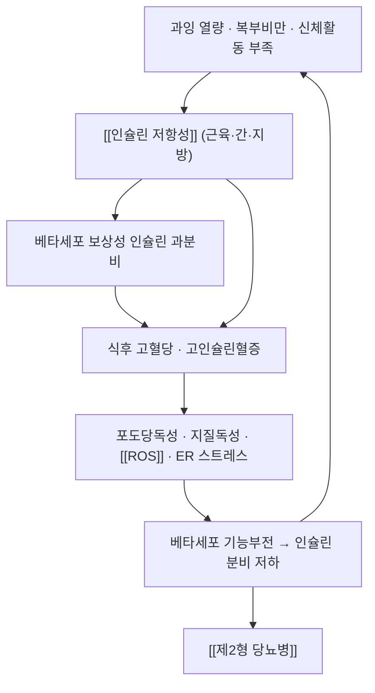

# 🩺 내당능장애 (Impaired Glucose Tolerance, IGT / 전당뇨)

> **핵심 3줄 요약 (Key Summary)**:
> - 📍 **병소 부위 & 병태생리**: 골격근·간·지방조직의 **인슐린 저항성** + 췌장 베타세포의 **보상 능력 한계**. 포도당 부하 후 처리 능력이 떨어져 2시간 혈당이 140~199 mg/dL에 머문다 → [[인슐린 저항성]]
> - 🚩 **전형적 임상 양상**: 대개 **무증상**. 복부비만·[[이상지질혈증]]·[[고혈압]]이 동반되고, 검진에서 "공복혈당은 정상인데 2시간 혈당이 높다"로 발견된다. 흑색가시세포증(목·겨드랑이 색소침착)은 인슐린 저항성의 피부 표지다
> - 🛠️ 핵심 감별 & 한·양방 치료 전략: [[경구포도당부하검사]](OGTT)로만 진단된다. 생활습관 + [[메트포르민]]·[[아카보스]]·[[진력달과립]] 같은 약물·본초 중재로 당뇨 발생 자체를 줄이는 것이 목표
> - ⚠️ **응급 의뢰 레드플래그**: 내당능장애 자체는 응급이 아니다. 다만 **다음수·다갈·체중감소 + 공복혈당 ≥250 mg/dL 또는 케톤 양성**이면 당뇨병 급성 합병증(당뇨병성 케톤산증·고삼투압 상태)으로 즉시 응급실 의뢰. 또한 **SGLT2 억제제 복용 중 구역·복통·호흡곤란**은 정상혈당 케톤산증 신호다 → [[정상혈당 케톤산증]]

---

## 📌 목차
1. [질환 개요 & 병태생리](#1-질환-개요--병태생리)
2. [병태생리 메커니즘 & 대사 악순환 네트워크](#2-병태생리-메커니즘--대사-악순환-네트워크)
3. [임상 증상 & 환자 소견](#3-임상-증상--환자-소견)
4. [감별 진단 매트릭스](#4-감별-진단-매트릭스)
5. [한의 통합 치료 프로토콜](#5-한의-통합-치료-프로토콜)
6. [양방 치료 & 병용·의뢰 기준](#6-양방-치료--병용의뢰-기준)
7. [식이·생활습관 & 자가관리 티칭 가이드](#7-식이생활습관--자가관리-티칭-가이드)
8. [💡 진료실 핵심 필기 & 임상 노하우](#8--진료실-핵심-필기--임상-노하우)
9. [출처 및 학술 참고 문헌 (References)](#9-출처-및-학술-참고-문헌-references)

---

## 1. 질환 개요 & 병태생리

![[내당능장애_01_개요도해.png|450]]
> [그림 1: 제2형 당뇨병 발생 경로 도해 — 비만·인슐린 저항성 → 포도당독성(glucotoxicity)·ER 스트레스·산화스트레스 → 베타세포 기능부전·세포자멸 → 제2형 당뇨병. 내당능장애는 이 경로의 중간 지점이다 — Wikimedia Commons, CC0]

* **정의 및 분류(75 g OGTT, 비임신 성인)**
  * **정상**: 2시간 혈당 < 140 mg/dL
  * **내당능장애(IGT)**: **2시간 혈당 140~199 mg/dL**
  * **당뇨병**: 2시간 혈당 ≥ 200 mg/dL
  * **공복혈당장애(IFG)**: 공복혈당 100~125 mg/dL · **HbA1c 5.7~6.4%** 는 '전당뇨 범주'로 별도 표기
  * ⚠️ IGT와 IFG는 **겹칠 수도, 따로 있을 수도 있다** — 공복혈당만 보면 IGT를 놓친다 → [[경구포도당부하검사]]
* **관련 장기 및 조직**
  * **주 이환 조직**: **골격근**(포도당 섭취 감소) · **간**(포도당신생 증가) · **지방조직**(유리지방산 유출)
  * **연관 조절계**: [[인슐린]] · [[아디포넥틴]] · [[GLUT4]] · [[AMPK]]
  * **합병증 표적**: 진행 시 [[제2형 당뇨병]] → 미세혈관(눈·신장·신경)·대혈관([[경동맥 내중막두께]] 증가, [[심혈관질환]])
* **역학**: 내당능장애 환자의 상당수가 수년 내 당뇨병으로 진행하며, **복부비만·이상지질혈증·고혈압이 겹치면 진행 위험이 더 커진다**. 그래서 전당뇨는 '질환 하나'가 아니라 **대사증후군의 한 표현형**으로 다룬다 → [[대사증후군]]

---

## 2. 병태생리 메커니즘 & 대사 악순환 네트워크

![[내당능장애_02_혈당조절_도해.png|450]]
> [그림 2: 혈당 항상성 조절 도해 — 식후 [[인슐린]] 분비 → 간·조직 포도당 흡수·저장, 공복 시 글루카곤 → 간 글리코겐 분해. 내당능장애에서는 '식후 처리' 쪽이 먼저 무너진다 — Wikimedia Commons, CC BY-SA 4.0]

![[내당능장애_02_인슐린신호전달.png|450]]
> [그림 3: 인슐린 수용체–포도당 수송 신호 도해(원본 라벨이 히브리어·영문 혼용인 교육용 도해) — 수용체 활성화 후 세포 내 신호가 포도당 운반체 이동을 촉진하는 경로 — Wikimedia Commons, Public domain]

### 1) 분자·세포 수준 기전
* **근육**: 인슐린 신호 저하로 [[GLUT4]] 세포막 전위가 줄어 포도당 섭취가 감소한다
* **간**: 포도당신생(gluconeogenesis)이 억제되지 않아 공복 혈당이 서서히 상승한다
* **지방조직**: 유리지방산 유출 증가 → 지질독성 → 추가적인 인슐린 저항성
* **베타세포**: 처음에는 인슐린을 더 분비해 버티지만(보상), 산화스트레스·ER 스트레스가 누적되면 **기능이 떨어지고 세포 수가 줄어든다**
### 2) 장기·계통 수준 결과
* 미세혈관: 망막·신장·신경이 조용히 손상되기 시작한다(당뇨 진단 전부터 진행)
* 대혈관: [[경동맥 내중막두께]] 증가 등 **아임상 죽상경화**가 관찰된다 — 2026-09-26 리뷰의 FOCUS 시험 24개월 결과가 그 예
### 3) 진행 단계
* 정상 → (인슐린 저항성·보상성 고인슐린혈증) → 내당능장애 → 당뇨병 → 합병증. **되돌릴 수 있는 구간이 내당능장애**다 — 중재 시 정상혈당 회복이 실제로 보고된다

---

## 3. 임상 증상 & 환자 소견

![[내당능장애_03_복부비만.jpg|420]]
> [그림 4: 복부비만 체형 실사(예시) — 내당능장애 진행 위험을 높이는 핵심 체형 소견 — Wikimedia Commons, CC BY-SA 4.0]

![[내당능장애_03_흑색가시세포증.jpg|420]]
> [그림 5: 흑색가시세포증(Acanthosis nigricans) — 목·겨드랑이·팔꿈치의 벨벳 같은 색소침착. 인슐린 저항성의 피부 표지로, 검진에서 이 소견이 보이면 혈당 평가를 미루지 않는다 — Wikimedia Commons, CC BY-SA 4.0]

### 1) 주소증 및 핵심 증상
* **전형 증상**: **대개 없다.** 간헐적 식후 졸림·피로·공복감 같은 비특이 증상만 있을 수 있다
* **비전형·경증 발현**: 야간 갈증, 잦은 소변, 상처 회복 지연, 피부 가려움·건조
* **악화·완화 인자**: 정제 탄수화물·야식·음주·수면 부족·스테로이드로 악화, 체중 감량·운동·수면 개선으로 완화
### 2) 객관적 소견 (Signs & Labs)
* **신체 소견**: 허리둘레 증가(남 ≥90 cm·여 ≥85 cm), 혈압 ≥130/85 mmHg, 흑색가시세포증, 피부건조·균열
* **검사 수치(진단 기준)**: **OGTT 2시간 140~199 mg/dL** · 공복혈당 100~125 mg/dL · HbA1c 5.7~6.4% · 중성지방 ≥150 mg/dL · HDL-C <40 mg/dL
* **추적 세트**: HbA1c · 공복혈당 · (가능하면) OGTT · [[HOMA-IR]] · 허리둘레 · 중성지방/HDL
### 3) 병기·중증도 판정
* 단순 IGT / IGT + IFG / IGT + 대사이상 ≥1개 — **동반 위험인자가 많을수록 진행 위험이 크고 중재 강도를 올린다**

---

## 4. 감별 진단 매트릭스

| 감별 질환 | 특징적 양상 | 감별 포인트 (검사·수치) |
| :--- | :--- | :--- |
| [[내당능장애]] (본 질환) | 무증상, 식후 고혈당 | OGTT 2시간 140~199 mg/dL |
| [[제2형 당뇨병]] | 증상 동반 가능, 지속 고혈당 | OGTT ≥200 또는 공복 ≥126, HbA1c ≥6.5% |
| [[당뇨병]] (1형·특수형) | 급성 발현, 체중 감소·케톤 | 케톤·C-peptide·자가항체 |
| 스트레스성 고혈당 | 급성 질환·수술·스테로이드 후 | 원인 제거 후 재검 |
| [[당뇨병성 말초신경병증]] | 저림·화끈거림 | 감각 검사·신경전도검사 |

> 🚩 **레드플래그 감별**: 다뇨·다음·체중감소 + 케톤 양성 → 당뇨병 급성 합병증. **임신부**의 내당능장애 판정은 기준이 다르므로 임신성 당뇨 검사 체계로 의뢰한다.

---

## 5. 한의 통합 치료 프로토콜

![[내당능장애_05_침치료_실사.jpg|400]]
> [그림 6: 침 치료 시술 실사 — 손목·팔 부위 자침 장면(시술 형태 참고 사진) — Wikimedia Commons, Public domain]

* **변증 분류**
  1. **기음양허(氣陰兩虛)** — 피로·입마름·야간 갈증, 설홍·소태, 맥세삭 → 익기양음
  2. **담습곤비(痰濕困脾)** — 복부비만·식후 졸림·몸 무거움, 설태 후니 → 건비화습
  3. **습열내온(濕熱內蘊)** — 구취·변비·피부 트러블, 설홍·태황니 → 청열화습
  4. **어혈(瘀血)** — 지질 이상·혈관 합병증 동반, 설암(舌暗)·어점 → 활혈
  5. **간울비허(肝鬱脾虛)** — 스트레스성 식이 폭주·소화불량 → 소간건비
* **침구 치료**: 배수혈 위주 — 비수(脾兪 BL20)·위수(胃兪 BL21)·신수(腎兪 BL23) + **족삼리(足三里 ST36)·삼음교(三陰交 SP6)·곡지(曲池 LI11)·합곡(合谷 LI4)** 다빈도 구성. 최소 **12주 이상·주 2~3회** 리듬으로 기대치를 맞춘다 → [[전침]] (단, T2DM 대상 메타분석은 HbA1c SMD −0.54 수준의 보조 효과다)
* **약침 치료**: 배수혈·아시혈 소량 자극 — 감각저하·피부 손상이 있는 하지에서는 감염 예방을 우선한다 → [[약침]]
* **한약 치료**: 변증별 처방 + 오늘 근거 — [[진력달과립]](익기양음·건비운진, 내당능장애 + 복부비만 + 대사이상에서 당뇨 발생 HR 0.59) · 기음양허에는 [[생맥산]] 계열, 담습에는 [[태음조위탕]] 계열 → [[황정]] · [[고삼]]
* **뜸·부항·기타**: 복부 온중 목적의 뜸, 배수혈 부항을 보조로 사용. 단 **피부 손상·감각저하 부위는 부항·뜸 금지**

---

## 6. 양방 치료 & 병용·의뢰 기준

> 🎯 환자가 이미 혈당 관련 약을 복용 중일 수 있다. 1차 진료에서 복용약을 파악하고 병용 안전을 판단한다.

* **약물 치료 (Medication)**
  * [[메트포르민]]: 고위험(비만·35세 미만·임신력·대사증후군 동반)에서 생활습관과 병행. 위약 대비 당뇨 발생을 낮춘 대표 근거를 가진 약
  * [[아카보스]]: 식후 혈당을 직접 낮추는 α-글루코시다제 억제제 — 전당뇨 진행 억제 근거가 있다(STOP-NIDDM)
  * [[진력달과립]]: 전당뇨 + 다중 대사이상에서 당뇨 발생 41% 감소(HR 0.59) 위약대조 RCT — **시험 중 다른 혈당강하제 병용은 금지된 설계**였으므로 병용 효과는 별도 근거가 없다
  * GLP-1 계열 등은 적응증·비용·부작용을 고려해 내분비 의뢰 영역이다 → [[세마글루타이드]]
* **비약물 치료**: 생활습관 교정이 1차 — 체중 7% 감량, 주 150분 이상 중등도 유산소 운동 + 주 2회 저항운동 → [[유산소운동]] · [[저항운동]]
* **한의 병용 판단**
  * **병용 가능**: 생활습관 + 표준 약물에 침·한약을 **보조로** 병행
  * 주의: 혈당강하 작용 본초([[황정]]·[[고삼]]·[[음양곽]] 등) + 설폰요소제·인슐린 조합 — 저혈당. 자가혈당 측정 강화
  * **금기**: 환자가 임의로 처방약을 중단하고 한약만 복용하는 상황은 만들지 않는다
* **의뢰 기준**: HbA1c ≥6.5% 또는 OGTT ≥200 → 당뇨병 확진 검사·치료 의뢰 / 체중 감소·케톤 → 즉시 / 임신 예정·임신 중 → 산부인과·내분비 공동

---

## 7. 식이·생활습관 & 자가관리 티칭 가이드

![[내당능장애_07_혈당측정.jpg|400]]
> [그림 7: 자가혈당측정 도해 — 손끝 채혈과 혈당계 측정 과정 — Wikimedia Commons, CC BY 3.0]

* **식이 지도 (Diet)**
  * 정제 탄수화물·액상과당 음료 감량, **식사 순서(채소 → 단백질 → 탄수화물)**, 야식·야간 음주 중단
  * 탄수화물을 줄이는 것보다 **비정제·섬유질 위주로 바꾸고 총량을 일정하게** 유지하는 것이 지속 가능하다
  * 한의 변증별 식이: 기음양허 → 마른 음식보다 부드러운 죽·탕, 담습 → 기름진 음식·유제품·야식 절제
* **생활습관 (Lifestyle)**
  * 주 150분 이상 중등도 유산소 + 주 2회 저항운동, **식후 15~30분 걷기**를 습관화
  * 수면 7시간 확보(수면 부족은 인슐린 저항성을 악화), 금연·절주
* **자가관리 (Self-monitoring)**
  * 기록 항목: 체중·허리둘레(주 1회), (해당 시) 공복·식후 2시간 혈당, 발 상태(매일) → [[당뇨발]]
* **환자 교육 스크립트**
  > "지금 단계는 '당뇨 바로 전'입니다. 이 단계에서는 약을 안 쓰고도 정상으로 돌아오는 분들이 실제로 있습니다. 문제는 공복혈당만 보면 절반을 놓친다는 점이라, 부하검사(2시간 혈당)로 확인합니다."
* **정기 추적 항목**: 3~6개월마다 HbA1c·공복혈당·지질·혈압, 연 1회 눈·신장·발 신경 검사 → [[경구포도당부하검사]]

---

## 8. 💡 진료실 핵심 필기 & 임상 노하우

> 🛡️ **Melt-In 원칙**: 원장님 필기는 상부 섹션에 녹여내고, 여기엔 상부에 담기지 않은 노하우만 남긴다. (원장님 기존 필기 없음 — 신규 개념)

* **실전 문진 체크리스트 (첫 방문 순서)**
  1. "공복혈당 말고 **2시간 혈당(부하검사) 해보셨나요?**" — IGT 발견의 유일한 길
  2. "골다공증 주사·스테로이드·항정신병약 드신 적 있나요?" — 이차성 고혈당 감별
  3. "발이 저리거나 감각이 둔한 데가 있나요?" — 신경병증 선별 → 발 관리 교육
  4. 복용약 전체 확인 → 저혈당 위험 조합 파악
* **치료 순서 노하우**
  * 담습형(설태 후니·복부비만)은 **화습·건비 먼저**, 이후 자음약을 얹는다. 순서를 뒤집으면 체한다
  * 감각저하가 있는 발에서는 **온열 요법·부항·강한 자극 금지** — 화상·감염의 시작점이 된다
* **환자 티칭 스크립트 (기대치 관리)**
  > "2년 넘게 17가지 본초 과립을 드신 분들은 당뇨로 넘어가는 비율이 43%에서 28%로 줄었습니다. 다만 혈당 수치 자체가 극적으로 떨어지는 약은 아니고, 매일의 식사·운동 위에 얹는 보조입니다."
* **상부에 담지 못한 고유 필기**: (없음 — 신규 생성 노트)

---

## 9. 출처 및 학술 참고 문헌 (References)

1. **Ji L, et al. (2024)**. *Jinlida for Diabetes Prevention in Impaired Glucose Tolerance and Multiple Metabolic Abnormalities: The FOCUS Randomized Clinical Trial*. **JAMA Intern Med**, 184(7):727-735. [PMID 38829648](https://pubmed.ncbi.nlm.nih.gov/38829648/) · [doi:10.1001/jamainternmed.2024.1190](https://doi.org/10.1001/jamainternmed.2024.1190)
   - **[연구 요약]**: IGT + 복부비만 + 대사이상 889명, 중앙 2.20년. **당뇨 발생 HR 0.59(0.46~0.74, p<0.001)**, 정상 내당능 회복 39.18% vs 25.64%, 허리둘레 −0.95 cm·2시간 혈당 −9.2 mg/dL·중성지방 −25.7 mg/dL.
2. **Jin D, et al. (2020)**. *Basis and Design of a Randomized Clinical Trial to Evaluate the Effect of Jinlida Granules on Metabolic Abnormalities*. **Front Endocrinol (Lausanne)**, 11:415. [PMID 32670199](https://pubmed.ncbi.nlm.nih.gov/32670199/)
   - **[연구 요약]**: 중재·평가 일정과 배제 기준(중증 간신장 기능 장애 등)을 기술한 공개 프로토콜.
3. **Prevention of type 2 diabetes in India and China** (2026). **Metabolism**. [PMID 42705413](https://pubmed.ncbi.nlm.nih.gov/42705413/)
   - **[연구 요약]**: 아시아 대규모 전당뇨 중재 연구 흐름과 진행 억제 전략을 정리한 최신 리뷰 — 생활습관·약물·전통의학 중재의 위치를 확인하는 배경 자료.
4. **Structured education programmes for preventing type 2 diabetes in adults with prediabetes: a systematic review** (2026). **Cureus**. [PMID 42763677](https://pubmed.ncbi.nlm.nih.gov/42763677/)
   - **[연구 요약]**: 전당뇨 성인에서 구조화된 식이·운동 교육의 효과를 정량합성 — 1차 중재가 생활습관임을 재확인.
5. **MSD 매뉴얼 전문가용** — [당뇨병 개요](https://www.msdmanuals.com/professional)
   - **[교과서]**: 전당뇨 정의·진단 기준·합병증 개요.
6. **이미지 출처**
   - 개요 도해: [Causation for T2D (Wikimedia Commons)](https://commons.wikimedia.org/wiki/File:Causation_for_T2D.JPG) — CC0
   - 혈당 항상성: [Glucose Homeostasis for Wikipedia (Wikimedia Commons)](https://commons.wikimedia.org/wiki/File:Glucose_Homeostasis_for_Wikipedia.jpg) — CC BY-SA 4.0
   - 인슐린 신호 도해: [Free-Fatty-Acid-Induced PP2A Hyperactivity … (Wikimedia Commons)](https://commons.wikimedia.org/wiki/File:Free-Fatty-Acid-Induced-PP2A-Hyperactivity-Selectively-Impairs-Hepatic-Insulin-Action-on-Glucose-pone.0027424.g003.jpg) — CC BY 3.0
   - 복부비만: [Abdominal Obesity in a teenager (Wikimedia Commons)](https://commons.wikimedia.org/wiki/File:Abdominal_Obesity_in_a_teenager.jpg) — CC BY-SA 4.0
   - 흑색가시세포증: [Acanthosis nigricans (Wikimedia Commons)](https://commons.wikimedia.org/wiki/File:Acanthious_nigricans_new_photo_for_diagnosis,_pigmentation_appears_in_neck_,arm,elbow,it_be_related_often_to_insulin_it_related_to_obesity_and_some_times_called_pseudonigricans.jpg) — CC BY-SA 4.0
   - 침 시술: [Acupuncture1-1 (Wikimedia Commons)](https://commons.wikimedia.org/wiki/File:Acupuncture1-1.jpg) — Public domain
   - 혈당측정 도해: [Blausen 0301 Diabetes GlucoseMonitoring (Wikimedia Commons)](https://commons.wikimedia.org/wiki/File:Blausen_0301_Diabetes_GlucoseMonitoring.png) — CC BY 3.0

---

## 📎 개념 학습 보충 (2026-09-26 논문 연계)

- 이 노트는 **2026-09-26 회차에서 신규 생성**된 질환 개념 파일이다(🧪 [[2026-09-26_대사노인질환_심층리뷰]] 1번 — FOCUS 시험의 대상군 정의).
- **임상 핵심**: 내당능장애는 **'공복혈당 정상'으로 숨는다**. 복부비만 + 중성지방 상승 + HDL 저하 조합이면 부하검사를 권한다. 그리고 이 단계가 **되돌릴 수 있는 마지막 구간**이라는 점이 환자 설득의 핵심이다.
- **관련**: [[제2형 당뇨병]] · [[당뇨병]] · [[대사증후군]] · [[이상지질혈증]] · [[경구포도당부하검사]] · [[진력달과립]] · [[인슐린 저항성]] · [[HOMA-IR]] · [[경동맥 내중막두께]]

---

## 📎 개념 학습 보충 (2026-10-10 논문 연계)

### 전당뇨 단계의 운동 근거 — 노르딕 워킹 메타분석 하위군 (2026-10-10, [PMID: 41523744](https://pubmed.ncbi.nlm.nih.gov/41523744/))
- [[노르딕 워킹]] 메타분석(6편·321명)에서 [[HbA1c]] 감소는 [[제2형 당뇨병]] 하위군 -0.49%(p<0.00001)가 내당능장애군 -0.2%(p=0.001)보다 컸다
- **해석**: 혈당이 이미 높은 군에서 절대 개선폭이 크다. 전당뇨 단계에서는 '진행을 늦추는 생활처방'으로 위치시킨다
- **처방 예**: 회당 60분·주 3회·12주(주 180분)를 기준선으로, 체력이 낮으면 15~20분씩 하루 2회로 시작해 4주에 걸쳐 60분 연속으로 늘린다
- 관련: [[노르딕 워킹]] · [[제2형 당뇨병]] · [[HbA1c]] · [[인슐린 저항성]] · [[유산소운동]]
- 관련 리뷰: [[2026-10-10_대사노인질환_심층리뷰]] 2번
