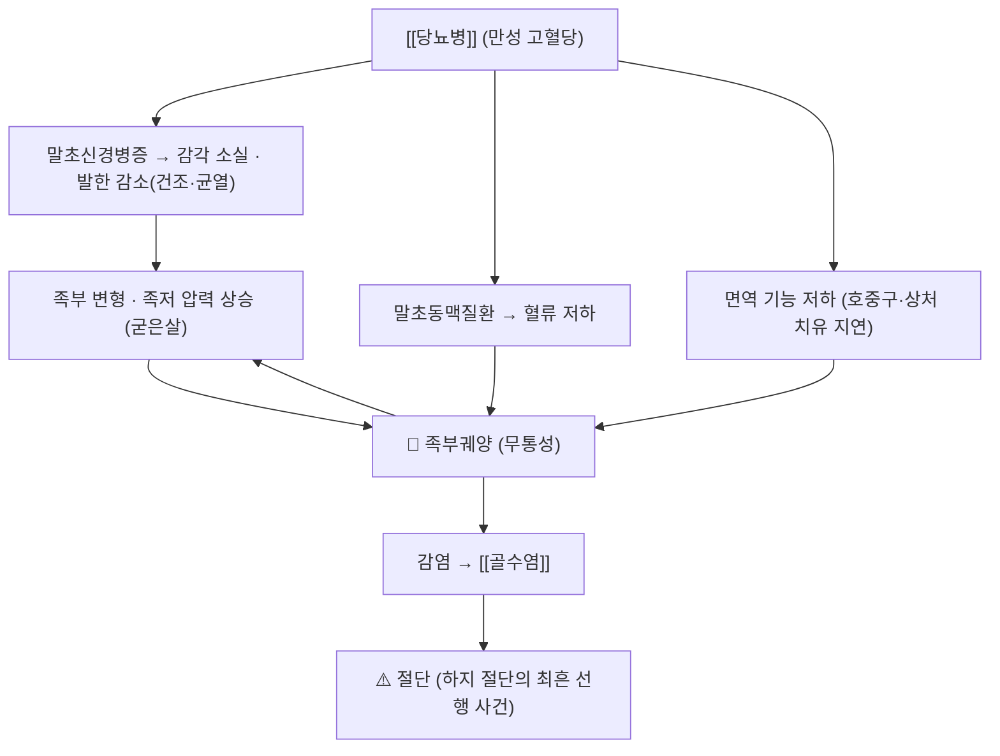

# 🩺 당뇨발 (Diabetic Foot Syndrome, 당뇨발 증후군)

> **핵심 3줄 요약 (Key Summary)**:
> - 📍 **병소 부위 & 병태생리**: **말초신경병증(감각 소실) + 변형된 족저 압력 + 말초동맥질환 + 면역 저하**가 겹쳐 발에 궤양·감염·조직 괴사가 생기는 증후군. **하지 절단의 가장 흔한 선행 사건**이다 → [[당뇨병성 말초신경병증]]
> - 🚩 **전형적 임상 양상**: 감각이 없어 **아프지 않은 상처**로 시작한다. 굳은살 아래 출혈·수포·홍조(전구 병변) → 족저 궤양 → 감염·골수염 → 절단. 급성 샤르코족은 **발적·부종·열감**으로 나타나 감염과 혼동된다
> - 🛠️ **핵심 감별 & 한·양방 치료 전략**: **오프로딩(감압)이 치유의 가장 중요한 단일 중재**다. 창상 처치·감염 조절·혈관 평가·혈당 조절을 병행하며, 한의 치료는 감압을 대체하지 못한다 → [[오프로딩]]
> - ⚠️ **응급 의뢰 레드플래그**: ① 발열·오한 + 궤양 주위 부종·발적 확대 ② **악취·화농·기종(공기)** ③ 괴사(검은 변색) 진행 ④ 갑자기 악화되는 통증(허혈) ⑤ 발이 차갑고 맥박이 만져지지 않음 — **즉시 응급/혈관·족부 협진**. 샤르코족을 감염으로 오인해 절개·배농하지 않도록 주의

---

## 📌 목차
1. [질환 개요 & 병태생리](#1-질환-개요--병태생리)
2. [병태생리 메커니즘 & 악순환 네트워크](#2-병태생리-메커니즘--악순환-네트워크)
3. [임상 증상 & 환자 소견](#3-임상-증상--환자-소견)
4. [감별 진단 매트릭스](#4-감별-진단-매트릭스)
5. [한의 통합 치료 프로토콜](#5-한의-통합-치료-프로토콜)
6. [양방 치료 & 병용·의뢰 기준](#6-양방-치료--병용의뢰-기준)
7. [식이·생활습관 & 자가관리 티칭 가이드](#7-식이생활습관--자가관리-티칭-가이드)
8. [💡 진료실 핵심 필기 & 임상 노하우](#8--진료실-핵심-필기--임상-노하우)
9. [출처 및 학술 참고 문헌 (References)](#9-출처-및-학술-참고-문헌-references)

---

## 1. 질환 개요 & 병태생리

![[당뇨발_01_개요도해.png|450]]
> [그림 1: 당뇨발 궤양 발생 부위 도해 — 전족부·중족골두·발뒤꿈치 등 체중부하 지점에 궤양이 반복된다 — Wikimedia Commons, CC BY-SA 4.0]

* **정의 및 분류**
  * **정의**: 당뇨병 환자의 발에 발생한 **궤양·감염·조직 파괴**의 복합 상태. 신경병증·허혈·감염이 서로 다른 축으로 작동한다
  * **Wagner 분류**: 0(전구 병변) → 1(표재성) → 2(심부, 건·관절 침범) → 3(골수염·농양) → 4(부분 괴저) → 5(전족부 괴저)
  * **위험 분류(IWGDF)**: 신경병증 유무·말초동맥질환·변형·궤양 병력·절단 병력으로 0~3군을 나눠 **검사 주기와 예방 처방을 다르게** 잡는다
* **관련 장기 및 조직**
  * **주 이환 조직**: 족부 피부·피하·건·골. 체중부하 지점(중족골두, 발뒤꿈치, 무지)이 시작점
  * **연관 조절계**: [[당뇨병성 말초신경병증]](감각 소실) · 하지 동맥(혈류) · 면역기능(호중구 기능 저하)
  * **합병증 표적**: [[골수염]] → 절단 → 사망률 상승
* **역학**: 당뇨병 환자의 평생 궤양 발생 위험이 상당하며, **궤양은 절단의 가장 강력한 선행 인자**다. 궤양 병력이 있으면 재발 위험이 특히 높아 **치유 후에도 치료용 신발·인솔이 필수**다

---

## 2. 병태생리 메커니즘 & 악순환 네트워크

![[당뇨발_02_신경병증_분포도해.png|450]]
> [그림 2: 하지 말초신경 분포·감각 영역 도해(Gray's Anatomy 계열) — 감각 소실 구역이 궤양 호발 부위와 겹친다 — Wikimedia Commons, Public domain]

![[당뇨발_02_하지동맥_해부.png|450]]
> [그림 3: 하지 동맥 해부 도해(전면·후면) — 대퇴·슬와·전경골·후경골·발등동맥 주행. 발등맥·후경골동맥 촉지가 허혈 선별의 첫 단계다 — Wikimedia Commons, CC BY 3.0]

### 1) 분자·세포 수준 기전
* **신경**: 만성 고혈당 → 폴리올 경로·AGEs·산화스트레스 → 말초신경 축삭 손상. **통각이 사라지면 상처를 인지하지 못한다**
* **혈관**: 미세혈관·대혈관 죽상경화 → 창상 치유에 필요한 산소·영양 공급 저하
* **면역**: 호중구 기능 저하·창상 성장인자 불균형 → 감염 취약, 치유 지연
* **자율신경**: 발한 감소 → 피부 건조·균열 → 세균 침입 경로
### 2) 장기·계통 수준 결과
* 체중부하 지점의 굳은살 아래에 반복 전단력이 쌓여 **출혈·수포(전구 병변)** → 표피 파괴 → 궤양 → 심부 감염·골수염 → 절단
### 3) 위험인자와 진행 단계
* 위험인자: 신경병증, 변형, 궤양·절단 병력, 시력 저하, 말초동맥질환, 부적합한 신발, 혈당 조절 불량, 흡연, 혈액투석
* 단계: 위험군 → 전구 병변 → 궤양 → 감염 → (샤르코족) → 절단

---

## 3. 임상 증상 & 환자 소견

![[당뇨발_03_족부궤양_임상1.jpg|420]]
> [그림 4: 당뇨발 족저 궤양 임상 실사 — 전족부 체중부하 부위의 개방 창상 — Wikimedia Commons, CC BY-SA 4.0]

![[당뇨발_03_족부궤양_임상2.jpg|420]]
> [그림 5: 족부 궤양 임상 실사(다른 형태) — 감각 소실로 통증을 느끼지 못한 채 진행한 창상 — Wikimedia Commons, CC BY 3.0]

![[당뇨발_03_샤르코족_임상.jpg|420]]
> [그림 6: 샤르코족(Charcot foot) 임상 실사 — 활동기에는 발적·부종·열감이 나타나 감염과 감별이 어렵다 — Wikimedia Commons, CC BY-SA 4.0]

### 1) 주소증 및 핵심 증상
* **전형**: "**아픔 없이 생긴 상처**", 신발 속 출혈로 발견, 굳은살, 발 모양 변화(무지 외반·망치발가락·요족)
* **비전형·경증**: 간헐적 화끈거림·저림(신경병성 통증), 야간 통증(허혈성), 발이 차갑거나 피부 균열
* **악화·완화 인자**: 맨발 보행·부적합 신발·고혈당·흡연으로 악화 / 감압·혈당 조절로 호전
### 2) 객관적 소견 (Signs & Labs)
* **신체 소견**: 발등맥·후경골동맥 촉지(허혈), 10 g 모노필라멘트·128 Hz 진동각·발목반사(신경병증), 피부 온도 좌우 차이, **프로빙(probe-to-bone)** 양성이면 골수염 의심
* **검사 수치**: HbA1c·CRP·ESR·백혈구, 창상 배양, ABI/하지 혈관 초음파, **X-ray → 의심되면 MRI가 골수염 확진에 우수**
* **영상**: 골수염(골 파괴·골막 반응), 샤르코족(골절편·아탈구·관절 파괴)
### 3) 병기·중증도 판정
* Wagner 0~5 또는 Texas 분류(깊이 × 감염/허혈). **감염·허혈 유무가 치료 경로를 결정**한다 — IWGDF는 감염·허혈이 중등도 이상이면 비제거식 감압기기를 쓰지 않도록 권고한다

---

## 4. 감별 진단 매트릭스

| 감별 질환 | 특징적 양상 | 감별 포인트 (검사·수치) |
| :--- | :--- | :--- |
| [[당뇨발]] (신경병성 궤양) | 무통·전족부·굳은살 주변 | 10 g 모노필라멘트 감각저하 |
| [[골수염]] | 궤양 심부·뼈 노출·배농 | 프로빙-투-본, CRP/ESR 상승, **MRI** |
| 샤르코족(급성) | 발적·부종·열감·무통성 변형 | 좌우 온도차·X-ray 추적, 감염 배제 후 고정 |
| 허혈성 궤양 | 통증 동반·발끝·창연 건조 | ABI·맥박·혈관 초음파 |
| 정맥성 궤양 | 발목 주위·삼출 많음 | 정맥 도플러, 부종 |
| [[통풍]]·감염성 단관절염 | 급성 발적·통증 | 요산·관절 천자 |

> 🚩 **레드플래그**: **악취·화농·기종·괴사 진행·전신 발열** → 즉시 응급. **급성 샤르코족을 감염으로 오인해 절개·배농하는 것은 금기**다.

---

## 5. 한의 통합 치료 프로토콜

* **변증 분류**
  1. **기허어혈(氣虛瘀血)** — 창상 치유 지연·창연 창백, 설담암, 맥세약
  2. **습열하주(濕熱下注)** — 발 열감·분비물·악취, 설홍·태황니 → **감염 우선 평가**
  3. **음허조열(陰虛燥熱)** — 발 건조·균열·야간 조열, 설홍소태
  4. **양허한응(陽虛寒凝)** — 발 냉감·색창백·맥박 약 → **허혈 평가 우선**
* **침구 치료**: 궤양면과 그 주위는 **직접 자극 금지**. 원위·대측 혈위(예: 족삼리(足三里 ST36)·삼음교(三陰交 SP6)·태충(太衝 LR3)·팔풍(八風))로 순환·감각 보조. 온열 요법은 **감각저하 부위에서 금지**(화상)
* **약침 치료**: **혈관·신경 자극 목적의 원위 취혈 소량**. 봉침·강자극 약침은 염증·괴사 부위에 쓰지 않는다 → [[약침]]
* 한약 치료: 변증별 보기활혈(예: [[황기계지오물탕]]·[[보양환오탕]] 계열)·청열화습 처방이 미세순환 개선 축으로 연구되어 있으나, 감압·창상 처치·항생제를 대체하지 않는다 → [[당뇨병성 말초신경병증]]
* **뜸·부항·기타**: **감각저하·허혈 부위에는 뜸·부항 금지**. 예방 목적의 발 마사지·온욕은 온도 확인 후(검사자 손으로 확인) 시행
* ⚠️ **주의 약물**: SGLT2 억제제 복용자는 탈수·케톤 위험, 면역억제제·스테로이드 복용자는 감염 징후가 가려질 수 있다 → [[정상혈당 케톤산증]]

---

## 6. 양방 치료 & 병용·의뢰 기준

> 🎯 환자는 이미 혈당강하제를 복용 중이며, 궤양 치료는 여러 과가 관여한다. 한의원의 역할은 **조기 발견·감압 확보·협진 연결**이다.

* **약물 치료**
  * 혈당 조절(기저 치료), 감염 시 항생제(창상 배양 기반), 신경병증성 통증에는 [[프레가발린]] · [[둘록세틴]] · [[아미트립틸린]]
  * ⚠️ **경구·국소 NSAID**는 신기능·위장관 위험을 고려해 단기·저용량 → [[국소 NSAID]]
* **비약물 치료(핵심)**
  * **오프로딩**: 전접촉석고(TCC) 또는 비제거식 무릎높이 기기 1차 → [[오프로딩]]
  * 창상 처치: 괴사조직 제거(데브리드망), 습윤 드레싱, 감염 조절
  * **혈관 평가·재개통**: 허혈 소견이면 혈관외과 의뢰
  * 샤르코족 활동기: **전접촉석고 등 완전 감압·비체중부하 고정**
* **수술·시술 적응증**: 심부 농양·골수염·광범위 괴사 → 절개·배농·골 절제·혈관 재개통·절단
* **한의 병용 판단**
  * **병용 가능**: 감압·창상 처치가 확보된 상태에서 순환·통증·기력 보조
  * **주의**: 항생제·항응고제와 병용 시 출혈·상호작용 확인, 감염 열감기에는 보기약 단독 사용 금지
  * **금기**: **감압 없이 창상만 한약·약침으로 치료하는 접근**, 궤양면 자극 처치
* **의뢰 기준(응급 트리거)**: 발열·전신 증상, 괴사·기종·악취, 급격한 부종·발적, 맥박 소실·발 냉감 → 즉시

---

## 7. 식이·생활습관 & 자가관리 티칭 가이드

* **식이(Diet)**: 혈당 조절이 창상 치유의 기반 — 정제 탄수화물·야식 절제, 단백질 충분 섭취(치유에 필요), 수분 섭취(특히 이뇨제·SGLT2i 복용자)
* **생활습관(Lifestyle)**: 금연(혈류에 결정적), 보행 시 감압 신발 착용, 발톱은 일자로 깎기, 뜨거운 찜질·전기장판 금지, 맨발 금지
* **자가관리(Self-monitoring)** — **환자 지도 5수칙**
  1. 맨발·슬리퍼·샌들 금지
  2. 실내에서도 감압 인솔이 들어간 치료용 신발 착용
  3. 매일 발을 거울로 확인(발바닥·발가락 사이)
  4. 중등도 이상 위험군은 하루 1회 발 피부 온도 자가 확인
  5. 발열·분비물·악취·검은 변색·통증 악화 시 즉시 내원
* **환자 교육 스크립트**
  > "발바닥 상처는 소독보다 '그 부위에 체중이 실리지 않게 하는 것'이 치료의 핵심입니다. 편하다고 벗을 수 있는 제품만 쓰면 벗고 다니는 시간만큼 상처가 늦게 납니다. 상처가 생기기 전부터 매일 발을 살피고 맨발로 다니지 않는 것이 가장 중요한 예방입니다."
* **정기 추적**: 위험군은 3~6개월마다 발 검사, 매년 신경·혈관 평가, 궤양 병력자는 치료용 신발 처방 유지 → [[당뇨병성 말초신경병증]]

---

## 8. 💡 진료실 핵심 필기 & 임상 노하우

> 🛡️ **Melt-In 원칙**: 원장님 필기는 상부 섹션에 녹여내고, 여기엔 상부에 담기지 않은 노하우만 남긴다. (원장님 기존 필기 없음 — 신규 개념)

* **외래 루틴에 넣을 것**: 발 궤양이나 전구 병변(굳은살 아래 출혈·수포·홍조)을 발견하면 **침·한약·약침 조정보다 감압 의뢰가 먼저**다. 당뇨병 환자에서 **10 g 모노필라멘트 검사 · 진동각 검사 · 발등맥/후경골동맥 촉지**를 세트로 시행
* **협진 설계**: TCC·캐스트 적용과 수술적 오프로딩은 우리 진료 범위를 벗어난다. **정형외과·족부·당뇨발 클리닉 협진선을 미리 만들어 두고**, 협진까지 공백 기간에는 *"제거식 워커라도 무감압보다 낫다(OR 3.13)"* 근거로 최소 감압을 확보한다
* **오인 주의 2가지**
  1. 급성 샤르코족을 감염으로 오인 → 불필요한 절개·항생제. **양측 온도차·맥박·염증수치**로 감별
  2. 신경병성 통증(저림·화끈거림)을 '혈액순환 문제'로만 설명 → 실제로는 **감각 소실이 진행한 신호**
* **한 줄 상담 문장**: "이 상처는 아프지 않아서 위험합니다. 아픈 상처는 밟지 않게 되지만, 안 아픈 상처는 계속 밟게 됩니다."

---

## 9. 출처 및 학술 참고 문헌 (References)

1. **Monami M, et al. (2024)**. *Offloading systems for the treatment of neuropathic foot ulcers in patients with diabetes mellitus: a meta-analysis of randomized controlled trials for the development of the Italian guidelines for the treatment of diabetic foot syndrome*. **Acta Diabetol**, 61(6):693-703. [PMID 38489054](https://pubmed.ncbi.nlm.nih.gov/38489054/) · [doi:10.1007/s00592-024-02262-9](https://doi.org/10.1007/s00592-024-02262-9)
   - **[연구 요약]**: RCT 18편 — 감압 있음 vs 없음 **MH-OR 3.13(1.08~9.11)**, **TCC·비제거식 무릎높이 기기 vs 다른 기기 MH-OR 2.64(1.43~4.89)**, 수술적 감압 MH-OR 6.77(1.64~27.93).
2. **IWGDF (2023)**. *Guidelines on the prevention and management of foot problems in diabetes — Offloading Guideline*. [지침 PDF](https://iwgdfguidelines.org/wp-content/uploads/2023/07/IWGDF-2023-06-Offloading-Guideline.pdf)
   - **[임상 가이드라인]**: 감압 기기 1·2·3차 권고 순서, 감염·허혈 시 전환, 주 1회 캐스트 교체·창상 점검.
3. **Lee JS, et al. (2026)**. *Comparison of posterior slab cast with total contact cast in the management of diabetic foot ulcers: A randomized controlled trial*. **Diabetes Res Clin Pract**. [PMID 41692325](https://pubmed.ncbi.nlm.nih.gov/41692325/)
   - **[연구 요약]**: Wagner 2~3기 족저 궤양 RCT — 후방 반깁스 6개월 치유율 **72.9% vs 49%(HR 1.30, p=0.024)**, 만족도 우수.
4. **Bus SA, et al. (2021)**. *Knee-High Devices Are Gold in Closing the Foot Ulcer Gap: A Review of Offloading Treatments to Heal Diabetic Foot Ulcers*. **Medicina (Kaunas)**. [PMID 34577864](https://pubmed.ncbi.nlm.nih.gov/34577864/)
   - **[연구 요약]**: 무릎높이 비제거식 기기가 표준인 이유(순응도·치유율) 정리.
5. **Footwear and insole design parameters to prevent occurrence and recurrence of neuropathic plantar forefoot ulcers** (2022). **Trials**. [PMID 36527100](https://pubmed.ncbi.nlm.nih.gov/36527100/)
   - **[연구 요약]**: 재발 예방을 위한 **치료용 신발·인솔 설계 변수**(압력 분산·적합성)를 정리 — 치유 후 관리의 근거.
6. **MSD 매뉴얼 전문가용** — [당뇨발](https://www.msdmanuals.com/professional)
   - **[교과서]**: 당뇨발의 병태생리·분류·치료 개요.
7. **이미지 출처**
   - 개요 도해: [Diabetes Foot Ulcers (Wikimedia Commons)](https://commons.wikimedia.org/wiki/File:Diabetes_Foot_Ulcers.png) — CC BY-SA 4.0
   - 신경 분포 도해: [Gray826and831 (Wikimedia Commons)](https://commons.wikimedia.org/wiki/File:Gray826and831.svg) — Public domain
   - 하지 동맥 해부: [Lower Limb Arteries Anterior Posterior (Wikimedia Commons)](https://commons.wikimedia.org/wiki/File:2129ab_Lower_Limb_Arteries_Anterior_Posterior.jpg) — CC BY 3.0
   - 궤양 실사 ①: [Diabetic Foot Syndrome (Wikimedia Commons)](https://commons.wikimedia.org/wiki/File:Diabetic_Foot_Syndrome.jpg) — CC BY-SA 4.0
   - 궤양 실사 ②: [Neuropathic heel ulcer (Wikimedia Commons)](https://commons.wikimedia.org/wiki/File:Neuropathic_heel_ulcer.jpg) — CC BY 3.0
   - 샤르코족 실사: [Charcot-Fuß Grad 0, aktives Stadium (Wikimedia Commons)](https://commons.wikimedia.org/wiki/File:Charcot-Fu%C3%9F_Grad_0,_aktives_Stadium._Klinisches_Bild.jpg) — CC BY-SA 4.0

---

## 📎 개념 학습 보충 (2026-09-26 논문 연계)

- 이 노트는 **2026-09-26 회차에서 신규 생성**된 질환 개념 파일이다(🧪 [[2026-09-26_대사노인질환_심층리뷰]] 2번 — 오프로딩 메타분석의 대상 질환).
- **미확보 이미지 보고**: ① 술기 실사(§5, 궤양 주변 처치·감압 시술 장면) 1장 미확보 — 무관한 이미지로 채우지 않았다 ② 치료용 신발 실사 미확보(Commons 후보 부적합·레이트리밋). 총 **6장 수록**(최소 6 충족).
- **관련**: [[오프로딩]] · [[당뇨병성 말초신경병증]] · [[당뇨병]] · [[골수염]] · [[내당능장애]] · [[정상혈당 케톤산증]]
