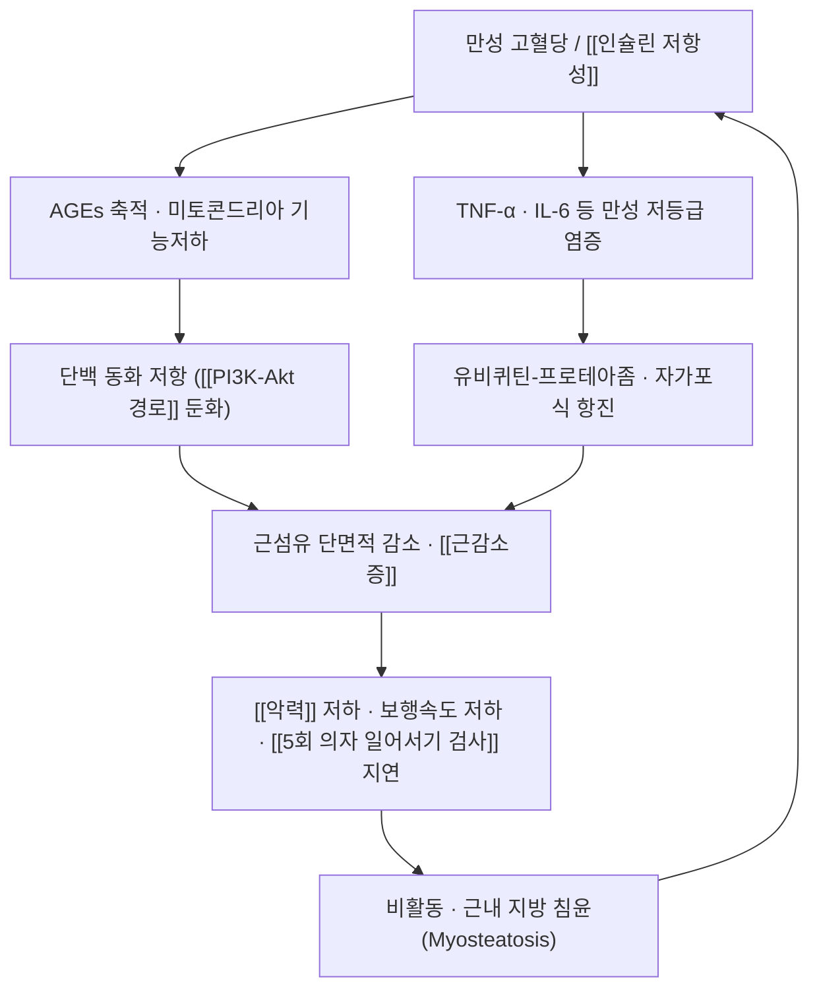

# 🩺 당뇨병성 근감소증 (Diabetic Sarcopenia / 糖尿病性筋減少症)

> **핵심 3줄 요약 (Key Summary)**:
> - 📍 병소 부위 & 해부·병태생리: [[당뇨병]]의 만성 고혈당과 [[인슐린 저항성]]이 골격근의 단백 동화 저항·미토콘드리아 기능저하를 유발하여 [[근감소증]]과 혈당 악화가 서로를 증폭시키는 전신 대사-근골격 질환. 병소는 [[대퇴사두근]]·[[비복근]]·[[가자미근]] 등 항중력근.
> - 🚩 전형적 임상 양상 & 3대 징후: [[악력]] 저하(남 <28 kg·여 <18 kg), [[5회 의자 일어서기 검사]] ≥12초, 보행속도 <1.0 m/s, [[골격근지수(SMI)]] 저하, 반복 낙상과 [[골절]].
> - 🛠️ 핵심 감별 & 한·양방 치료 전략: [[AWGS 기준]] 3축 진단(악력·기능·근육량), 혈당 관리 + 점진적 저항운동 + 단백질 1.2~1.5 g/kg/일. 한의는 비신허증(脾腎虛證) 변증의 보익 처방([[약식동원]] 신기고 구성)과 족삼리(ST36)·삼음교(SP6)·태계(KI3)·관원(CV4)·신수(BL23) 자침.
> - ⚠️ 응급 의뢰 레드플래그: 급격한 체중감소·악액질, 삼킴장애 동반 연하성 폐렴, 저혈당·정상혈당 케톤산증 등 급성 대사 이상, 새로 발생한 근력 저하에서 신경근 질환이 의심되면 즉시 의뢰.

---

## 📌 목차
1. [질환 개요 & 병태생리](#1-질환-개요--병태생리-disease-overview)
2. [병태생리 메커니즘 & 대사 악순환 네트워크](#2-병태생리-메커니즘--대사-악순환-네트워크)
3. [임상 증상 & 환자 소견](#3-임상-증상--환자-소견)
4. [감별 진단 매트릭스](#4-감별-진단-매트릭스)
5. [한의 통합 치료 프로토콜](#5-한의-통합-치료-프로토콜)
6. [양방 치료 & 병용·의뢰 기준](#6-양방-치료--병용의뢰-기준)
7. [식이·생활습관 & 자가관리 티칭 가이드](#7-식이생활습관--자가관리-티칭-가이드)
8. [💡 진료실 핵심 필기 & 임상 노하우](#8--진료실-핵심-필기--임상-노하우)
9. [출처 및 학술 참고 문헌](#9-출처-및-학술-참고-문헌)

---

## 1. 질환 개요 & 병태생리 (Disease Overview)

![[당뇨병성 근감소증_01_정상근육_위축근육_비교도해.png|450]]
> [그림 1: 정상 근육과 위축 근육의 비교 도해 — 만성 고혈당·신경병증에서 항중력근의 근섬유 위축과 근내 지방 침윤이 진행한다 (Wikimedia Commons, CC BY 4.0)]

* **질환 정의 및 분류**:
  * **당뇨병성 근감소증(Diabetic Sarcopenia)** 은 [[당뇨병]] 환자에서 [[근감소증]]이 동반된 상태로, 단순한 노화성 근육 감소와 달리 **만성 고혈당·인슐린 저항성이 근육을 직접 표적으로 삼아** 근육량·근력·신체기능을 떨어뜨리는 이차성 근감소증이다.
  * [[당뇨병]]의 새로 인식된 합병증으로, 고령 환자에서 근육량 저하와 혈당 조절 악화가 상호 증폭한다. 노인의 낙상·[[골절]]·요양시설 입소·사망 위험을 끌어올리지만 아직 승인된 표적 치료제가 없다.
  * 독립 질환 코드로 분류되기보다 **당뇨병 + [[AWGS 기준]] 충족 근감소증**의 조합으로 판정한다.
* **관련 장기 및 조직**:
  * **주 이환 조직**: 골격근 — 특히 [[대퇴사두근]]·[[둔근]]·[[비복근]]·[[가자미근]]·척추기립근.
  * **연관 대사·조절계**: [[인슐린 저항성]] · [[GLUT4]] · 미토콘드리아 산화능 — 근육의 포도당 흡수와 단백 합성이 동시에 저하된다.
  * **합병증 표적 장기**: 말초신경([[당뇨병성 말초신경병증]])·신장·눈·혈관 — 미세혈관 합병증이 근감소를 가속한다.

---

## 2. 병태생리 메커니즘 & 대사 악순환 네트워크

![[당뇨병성 근감소증_02_골격근섬유_조직도해.jpg|450]]
> [그림 2: 골격근 섬유의 조직 소견(H&E) — 근섬유 다발과 말초 핵. 만성 염증·탈신경이 겹치면 근섬유 단면적이 줄고 지방·결합조직이 침윤한다 (Wikimedia Commons, CC0)]

### 1) 분자·세포 수준 기전
* **단백 동화 저항(Anabolic Resistance)**: [[인슐린]]·[[IGF-1]] 신호가 둔화되고 [[PI3K-Akt 경로]] → [[mTOR]] 활성이 떨어져 식이 단백질을 먹어도 근단백 합성 반응이 일어나지 않는다.
* **만성 염증**: 지방조직·근육에서 분비되는 TNF-α·IL-6가 FoxO를 활성화해 유비퀴틴-프로테아좀 분해를 촉진하고, [[위성세포(Satellite cell)]] 분화를 막아 재생을 차단한다.
* **미토콘드리아·AGEs**: 고혈당의 최종당화산물(AGEs)이 근육 단백질을 교차결합시켜 수축 효율과 대사 유연성을 떨어뜨린다.
### 2) 장기·계통 수준 결과
* [[당뇨병성 말초신경병증]]으로 감각이 저하되면 활동량이 줄고 낙상 위험이 커지며, 낙상 후 골절·입원이 다시 근손실을 가속하는 악순환이 형성된다.
### 3) 위험인자와 진행 단계
* 위험인자: 65세 이상, 유병기간 5년 이상, HbA1c 상승, 비활동, 단백질 섭취 부족, [[비만]](근감소성 비만), [[당뇨병성 말초신경병증]], GLP-1 계열 등 감량 약물 병용.

---

## 3. 임상 증상 & 환자 소견

![[당뇨병성 근감소증_03_BIA_체성분측정_실사.jpg|420]]
> [그림 3: 생체전기저항분석(BIA) 체성분 측정기 — 사지골격근량(ASM)을 신장²으로 나눈 [[골격근지수(SMI)]]로 근육량을 확진한다 (Wikimedia Commons, CC BY-SA 3.0)]

### 1) 주소증 및 핵심 증상
* "계단이 힘들어졌다", "의자에서 일어날 때 손을 짚는다", "병뚜껑이 안 열린다", "걸음이 느려졌다".
* 체중 감소가 있으면 눈에 띄지만, **체중이 유지되거나 늘어도 근육만 줄어드는 근감소성 비만**은 놓치기 쉽다.
### 2) 객관적 소견 (Signs & Labs)
* **신체 소견**: 종아리 둘레 감소(남 <34 cm·여 <33 cm), 보행 속도 저하, 균형 저하.
* **검사 수치**: 공복혈당·[[HbA1c]], [[HOMA-IR]]로 혈당 조절 상태를 함께 본다. 근감소증 평가는 [[악력]] · [[5회 의자 일어서기 검사]] · [[골격근지수(SMI)]] 세트.
### 3) 병기·중증도 판정
* [[AWGS 기준]]에 따라 근육량 저하 + (근력 또는 기능 저하) → 근감소증, 세 축 모두 저하 → 중증 근감소증.

---

## 4. 감별 진단 매트릭스

| 감별 질환 | 특징적 양상 | 감별 포인트 |
| :--- | :--- | :--- |
| 당뇨병성 근감소증 (본 질환) | 당뇨병 + 점진적 근력·기능 저하 | 악력·5TSTS·SMI 3축 기준, 감각장애는 말초신경병증 동반 시 |
| [[악액질]] | 암·말기 장기부전 동반 급격한 소모 | 체중 >5% 급감, CRP 상승, 식욕부진 뚜렷 |
| [[허약]] | 다발성 예비능 상실 | 탈진·활동량 감소·느린 보행·체중감소·악력저하 중 3개 이상 |
| [[당뇨병성 말초신경병증]] | 원위 대칭 감각이상·통증 | 감각 소실로 활동 제한, 근감소와 동반되는 경우 많음 |
| 갑상선 기능 항진증 | 체중감소·다한·심계항진 | TSH 저하, Free T4 상승 |

> 🚩 **레드플래그 감별**: 급성 근력 저하(수일~수주)는 근감소증이 아니라 뇌졸중·길랑-바레 증후군·염증성 근병증 등 신경근 응급이다.

---

## 5. 한의 통합 치료 프로토콜

* **변증 분류**: 비신허증(脾腎虛證)이 대표적이며, 기허·기혈양허·간신부족으로 확장된다 → [[비신허증]]
* **침구 치료 (Acupuncture)**:
  * 족삼리(ST36)·삼음교(SP6)·태계(KI3)·관원(CV4)·신수(BL23)를 변증에 맞춰 배혈하고, 하지 운동점 자침에 저주파 전침을 병용한다(교과서 범위 응용).
* **약침 치료 (Pharmacopuncture)**:
  * 자하거·신바로 약침을 족삼리·신수 등에 적용하는 임상 관행이 있으나, 이 회차 시험의 근거 범위는 아니다.
* **한약 치료 (Herbal Medicine)**:
  * 비신허증 변증에 보익 처방을 쓴다. 약식동원 8종([[황기]]·[[당삼]]·[[황정]]·[[산약]]·[[복령]]·[[두충]]·[[맥아]]·[[맥문동]]) 구성의 신기고가 당뇨병성 근감소증에서 12주 RCT로 검증된 바 있다 → [[약식동원]]
* **뜸·부항·기타**: 관원·신수·비수(BL20)에 온중 목적의 뜸을 병용한다(혈위는 순수 텍스트).

---

## 6. 양방 치료 & 병용·의뢰 기준

> 이 섹션은 진료실에서 양방 치료를 이해하고 병용·의뢰를 판단하기 위한 정리다.

* **약물 치료 (Medication)**:
  * 혈당 관리([[메트포르민]]·[[SGLT2 억제제]]·[[GLP-1]] 계열 등)가 기본이지만, **당화혈색소·HOMA-IR이 개선되지 않아도 근육 지표는 별도로 관리해야 한다**.
  * ⚠️ GLP-1 계열 등 급격한 체중 감량 약물은 감량의 상당 부분이 제지방일 수 있어 저항운동·단백질을 의무적으로 병행한다.
* **비약물 치료**: 점진적 저항운동 + 단백질 영양 처방이 표준이다.
* **한의 병용 판단**: 기존 당뇨 약물은 절대 임의로 줄이지 않고 병용한다. 보익 한약은 근육 축, 혈당강하제는 혈당 축으로 역할을 분리해 설명한다.
* **의뢰 기준**: 급성 대사 이상([[저혈당]]·[[정상혈당 케톤산증]]), 급격한 체중 감소·악액질 의심, 삼킴장애, 원인 불명 신경근 약화는 내분비·신경과 협진으로 의뢰한다.

---

## 7. 식이·생활습관 & 자가관리 티칭 가이드

* **식이 지도 (Diet)**: 단백질 1.2~1.5 g/kg/일, 끼니당 25~30 g 분배, 류신이 풍부한 양질 단백(살코기·계란·생선·두부). 신기능 저하 환자는 단백질 목표를 신장내과와 상의한다.
* **생활습관 (Lifestyle)**: 주 2~3회 점진적 저항운동, 하루 걷기, [[비타민 D]]·[[칼슘]] 확인.
* **자가관리 (Self-monitoring)**: 악력·체중·5회 의자 일어서기 시간을 4~12주 간격으로 기록.
* **환자 교육 스크립트**: "당뇨약은 혈당을 잡는 약이고, 근육은 따로 지켜야 합니다. 약만으로는 근육이 안 늘어납니다."
* **정기 추적 항목**: [[HbA1c]] 3개월, 악력·5TSTS·[[골격근지수(SMI)]] 3~6개월, 미세혈관 합병증 연 1회.

---

## 8. 💡 진료실 핵심 필기 & 임상 노하우

* **치료 창(window)을 놓치지 않는 문진**: 당뇨 노인에서 체중 감소·보행 속도 저하·의자 일어서기 지연이 보이면 [[근감소증]]을 먼저 의심한다. 진단 없이 "기운이 없다"로 넘기지 않는다.
* **목표 설정의 정확성**: 신기고 12주 RCT에서 악력·SMI·5회 의자 일어서기와 공복혈당·CRP는 좋아졌지만 **HbA1c·HOMA-IR은 개선되지 않았다** — 처방 목표를 '혈당 조절'이 아니라 '근육량·근력·기능과 염증 지표'에 두고 환자에게 설명한다.
* **변증-처방 일치가 전제**: 신기고 시험은 비신허증 환자만 등록했다. 소화력 저하·야간뇨·요슬산연·오한 등 신허 소견을 확인한 뒤 처방한다 → [[비신허증]]
* **12주를 한 주기로**: 6주·12주에 악력·의자 일어서기를 재측정한다. 기존 당뇨 약물은 줄이지 않고 병용한다.

---

## 9. 출처 및 학술 참고 문헌

1. **Yue L, et al. (2026)**. *Efficacy and safety of medicine-food homology Shenqi paste in older adults with diabetic sarcopenia: A randomized, double-blind, placebo-controlled trial*. **J Ethnopharmacol**, 363:121444. [PMID 41763617](https://pubmed.ncbi.nlm.nih.gov/41763617/) · [doi:10.1016/j.jep.2026.121444](https://doi.org/10.1016/j.jep.2026.121444)
   - **[연구 요약]**: 비신허증 당뇨병성 근감소증 노인 90명, 12주 이중맹검 위약대조 — 악력·SMI·5회 의자 일어서기 모두 유의 개선(P<.001), 공복혈당·CRP 감소, HbA1c·HOMA-IR 무변화, 중대 이상반응 없음.
2. **Chen LK, Woo J, Assantachai P, et al. (2020)**. *Asian Working Group for Sarcopenia: 2019 Consensus Update on Sarcopenia Diagnosis and Treatment*. **J Am Med Dir Assoc**, 21(3):300-307. [PMID 32033882](https://pubmed.ncbi.nlm.nih.gov/32033882/)
   - **[연구 요약]**: 아시아인 기준 근감소증 진단 3축(악력·신체기능·골격근지수) 컷오프를 정의한 표준 합의문.
3. **Chen S, et al. (2024)**. *Impact of Chinese herbal medicine on sarcopenia in enhancing muscle mass, strength, and function: A systematic review and meta-analysis*. **Phytother Res**, 38(5):2303-2322. [PMID 38419525](https://pubmed.ncbi.nlm.nih.gov/38419525/)
   - **[연구 요약]**: 한약이 근감소증 노인의 근육량·근력·기능을 개선하는지 RCT를 모아 정량합성한 체계적 고찰 — 처방의 근거 배경과 한계를 함께 볼 수 있다.
4. **이미지 출처** — 정상/위축 근육 도해: [1025 Atrophy (Wikimedia Commons)](https://commons.wikimedia.org/wiki/File:1025_Atrophy.png) CC BY 4.0 · 골격근 조직: [Skeletal Muscle Tissue (Wikimedia Commons)](https://commons.wikimedia.org/wiki/File:Skeletal_Muscle_Tissue.jpg) CC0 · BIA 측정: [Bioimpedence measurement (Wikimedia Commons)](https://commons.wikimedia.org/wiki/File:Bioimpedence_measurement.jpg) CC BY-SA 3.0

---

## 함께 보기
- [[근감소증]] · [[당뇨병]] · [[비신허증]] · [[약식동원]] · [[AWGS 기준]] · [[악력]] · [[5회 의자 일어서기 검사]] · [[골격근지수(SMI)]] · [[SARC-CalF]] · [[인슐린 저항성]] · [[PI3K-Akt 경로]] · [[위성세포(Satellite cell)]] · [[당뇨병성 말초신경병증]] · [[허약]] · [[비만]] · [[저항운동]] · [[단백질]] · [[2026-10-03_대사노인질환_심층리뷰]]
