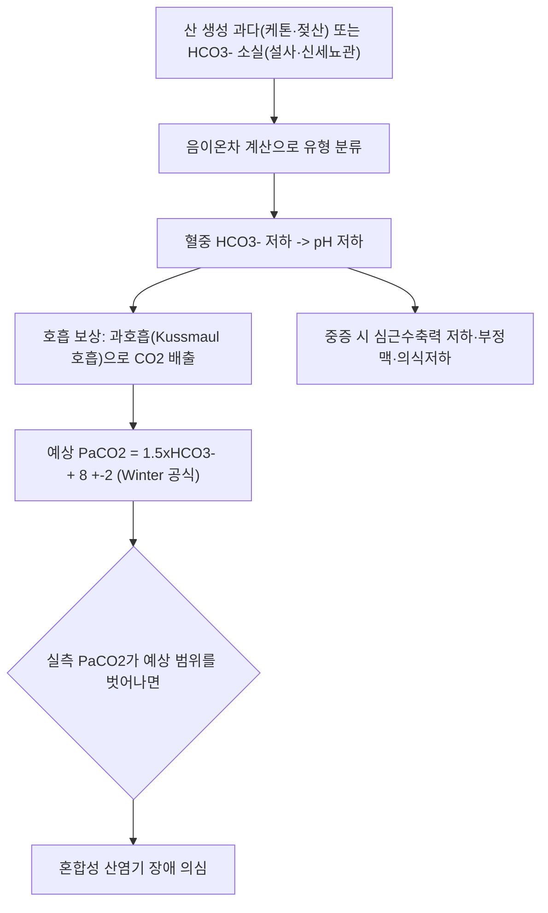

# 🩺 대사성 산증 (Metabolic Acidosis / 代謝性 酸症, E87.2)

> **핵심 3줄 요약 (Key Summary)**:
> - 📍 병소 부위 & 해부·병태생리: 신장·간·위장관에서 산 생성 과다 또는 중탄산염(HCO₃⁻) 소실로 혈중 pH가 낮아지는 전신 대사 이상. 폐가 과호흡(Kussmaul 호흡)으로 CO₂를 배출해 2차적으로 보상.
> - 🚩 전형적 임상 양상 & 3대 징후: 깊고 빠른 호흡(Kussmaul 호흡), 오심·구토·복통, 의식 저하·전신 쇠약. 원인 질환(당뇨병성 케톤산증·젖산산증·신부전 등)의 증상이 함께 나타남.
> - 🛠️ 핵심 감별 검사 & 한·양방 다각적 치료 전략: 동맥혈가스분석(ABGA)·혈청 전해질로 음이온차(Anion Gap) 계산, 원인 질환 특이 검사(혈당·케톤·젖산·신기능). 원인 교정이 최우선이며, 한의학적 개입은 보조적·회복기 중심으로 접근.
> - ⚠️ 응급 의뢰 레드플래그: pH < 7.1~7.2, 의식 저하, 혈역학적 불안정, 고칼륨혈증 심전도 변화, 패혈증·중증 신부전 동반 시 즉시 응급실 의뢰. 한의원 단독 관리 대상이 아님.

---

## 📌 목차
1. [질환 개요 & 해부학적 병태생리](#1-질환-개요--해부학적-병태생리)
2. [병태생리 메커니즘 & 생체역학적 악순환 네트워크](#2-병태생리-메커니즘--생체역학적-악순환-네트워크)
3. [임상 증상 & 이학적 검사(Physical Exam) 알고리즘](#3-임상-증상--이학적-검사physical-exam-알고리즘)
4. [감별 진단 매트릭스 (Differential Diagnosis)](#4-감별-진단-매트릭스-differential-diagnosis)
5. [한의 통합 치료 프로토콜 (침·약침·추나·한약)](#5-한의-통합-치료-프로토콜-침약침추나한약)
6. [양방 치료 & 병용·의뢰 기준 (Conventional Treatment & Referral)](#6-양방-치료--병용의뢰-기준-conventional-treatment--referral)
7. [재활 운동 & 생활습관 티칭 가이드](#6-재활-운동--생활습관-티칭-가이드)
8. [💡 사용자 진료실 핵심 필기 & 임상 노하우 (Melt-In 잔여 심화 집약)](#7--사용자-진료실-핵심-필기--임상-노하우-melt-in-잔여-심화-집약)
9. [출처 및 학술 참고 문헌 (References)](#8-출처-및-학술-참고-문헌-references)

---

## 1. 질환 개요 & 해부학적 병태생리

![[대사성산증_음이온차_병태생리도해.png|450]]
> 출처: Wikimedia Commons (CC BY-SA 4.0)

> ⚠️ 이 노트는 신규 작성 노트로, 원장님의 수기 필기·이미지가 없습니다. 필수 3종 이미지(①병태생리 ②관련 구조물 ③치료 시술점)는 이 질환이 전신 대사 이상(근골격계 국소 병변이 아님)이라 ①만 해당 가능하나 실제 학술 도해를 확보하지 못해 아직 수록하지 못했습니다(추후 원장님 자료가 있으면 추가).

* **질환 정의 및 분류**:
  * 대사성 산증은 산 생성 증가(케톤산·젖산 등) 또는 중탄산염(HCO₃⁻) 소실로 혈중 HCO₃⁻ 농도가 낮아지고 동맥혈 pH가 7.35 미만으로 떨어지는 산염기 장애입니다(Kraut & Madias 2010, PMID 20308999).
  * 음이온차(Anion Gap = Na⁺ − (Cl⁻ + HCO₃⁻), 정상 8~12 mEq/L)를 기준으로 **음이온차 증가형**(케톤산증·젖산산증·신부전·독성물질 중독 등, 측정되지 않는 산이 축적)과 **정상 음이온차형**(고클로라이드혈증형, 설사·신세뇨관산증 등 HCO₃⁻가 Cl⁻로 대체되며 소실)으로 나눕니다(Palmer & Clegg 2019, PMID 31347344).
  * 급성기는 응급질환으로 다루어야 하며, 원인 교정 없이 한의학적 개입만으로 관리할 질환이 아닙니다.
* **관련 "해부학적" 구조물 (⚠️ 국소 병변이 아닌 전신 대사 이상이라 정직하게 재정의)**:
  * **주요 관여 장기**: 신장(산 배설·중탄산염 재생), 폐(호흡 보상, [[호흡성 알칼리증]]과 반대 방향), 간·근육(젖산·케톤 생성).
  * **관련 개념**: [[정상혈당 케톤산증]](euglycemic DKA), [[신부전]]·[[급성 신부전]](신성 산 배설 저하), [[설사]](HCO₃⁻ 소실), [[젖산]](무산소 대사 산물). 반대 방향의 1차 장애는 [[호흡성 산증]]·[[대사성 알칼리증]] 노트를 참고하세요.

---

## 2. 병태생리 메커니즘 & 생체역학적 악순환 네트워크

![[대사성산증_네프론세뇨관_해부도해.jpg|450]]
> 출처: OpenStax, Wikimedia Commons (CC BY 3.0)

### 1) 보상 기전 (Compensation)
* 대사성 산증에서 폐의 1차 보상은 수 분~수 시간 내 시작되며, Winter 공식(예상 PaCO2 = 1.5×[HCO3⁻] + 8 ± 2)으로 적절한 호흡 보상 여부를 판정합니다. 실측 PaCO2가 이 범위를 벗어나면 호흡계 장애가 동반된 혼합성 산염기 이상을 의심합니다(Achanti & Szerlip 2023, PMID 35998977). 신장의 2차 보상(암모니아 생성·중탄산염 재흡수 증가)은 수일이 걸려 급성기에는 기여가 제한적입니다(Kraut & Madias 2010, PMID 20308999).

### 2) 전신 악순환 네트워크
* 중증 산증(pH < 7.1~7.2)은 심근 수축력 저하, 부정맥 역치 저하, 인슐린 저항성 증가, 카테콜아민 반응성 저하를 일으켜 중환자에서 예후에 영향을 줄 수 있다고 보고됩니다(Achanti & Szerlip 2023, PMID 35998977). 다만 이 인과관계 자체가 임상적으로 얼마나 중요한지는 논쟁이 있습니다(§5 중탄산염 치료 논쟁 참고).

---

## 3. 임상 증상 & 이학적 검사(Physical Exam) 알고리즘

### 1) 주소증 및 전신 증상
* **호흡기계**: Kussmaul 호흡(깊고 빠른 호흡)으로 CO₂를 배출해 보상하려는 특징적 호흡 양상.
* **소화기계**: 오심·구토·복통(특히 당뇨병성 케톤산증에서 두드러짐, Calimag 2023 PMID 35577617).
* **신경계**: 두통·의식 저하·혼미, 중증에서는 혼수까지 진행할 수 있습니다.
* **심혈관계**: 저혈압·부정맥(중증 시).

### 2) 필수 검사법 (⚠️ 근골격계 이학적 검사가 아닌 검사실 검사로 정직하게 재정의)
* **동맥혈가스분석(ABGA)**: pH·PaCO2·HCO3⁻ 측정으로 1차 장애 판정과 보상 적절성(Winter 공식) 평가.
* **혈청 전해질 & 음이온차 계산**: Na⁺·Cl⁻·HCO3⁻로 Anion Gap 산출, 증가형 vs 정상형 감별.
* **요 음이온차(Urine Anion Gap)**: 정상 음이온차형 산증에서 신장의 암모늄 배설 능력을 간접 평가(신세뇨관산증 vs 위장관 소실 감별, Batlle 1988, PMID 3344005).
* **원인 특이 검사**: 혈당·혈중 케톤(DKA), 젖산(젖산산증), 신기능(BUN/Cr, 만성신질환), 약물력(메트포르민 등).

---

## 4. 감별 진단 매트릭스 (Differential Diagnosis)

| 감별 질환 | 음이온차 유형 | 주요 원인 | 특이 소견 |
| :--- | :--- | :--- | :--- |
| 대사성 산증 (본 질환, 포괄) | 증가형 또는 정상형 | 아래 항목 참고 | HCO3⁻↓, 대상성 과호흡 |
| 당뇨병성 케톤산증(DKA) | 증가형 | 인슐린 결핍 → 케톤체 생성 | 고혈당(대개), 혈중·요중 케톤 양성(Veauthier 2024, PMID 39556629) |
| [[정상혈당 케톤산증]] | 증가형 | SGLT2 억제제 등, 혈당은 정상~경도 상승 | 혈당이 낮아 진단이 늦어지기 쉬움(Long 2021, PMID 33626481; Nasa 2021, PMID 33995841) |
| 젖산산증(Lactic acidosis) | 증가형 | 조직 저관류(A형), 메트포르민·간질환 등(B형) | 혈중 젖산 상승, 메트포르민 연관형은 See 2024(PMID 38983827) 참고 |
| 신부전·[[신부전]]·[[급성 신부전]] | 증가형 또는 정상형(만성 초기) | 산 배설·HCO3⁻ 재생 저하 | BUN/Cr↑, eGFR↓ |
| [[설사]] 등 위장관 HCO3⁻ 소실 | 정상형(고클로라이드혈증) | 장액으로 HCO3⁻ 소실 | 저칼륨혈증 동반 흔함, 요 음이온차 음성(Palmer & Clegg 2019, PMID 31347344) |
| 신세뇨관산증(RTA) | 정상형 | 신세뇨관의 산 배설·HCO3⁻ 재흡수 장애 | 요 음이온차 양성(Batlle 1988, PMID 3344005) |

---

## 5. 한의 통합 치료 프로토콜 (침·약침·추나·한약)

![[대사성산증_혈액투석회로_치료도해.png|450]]
> 출처: Wikimedia Commons (CC BY 3.0)

> ⚠️ 대사성 산증은 원인 질환(당뇨병성 케톤산증·중증 젖산산증·신부전 등)에 대한 응급·전문 치료가 최우선이며, 한의학적 개입이 이를 대체할 수 없습니다. 아래는 원인 교정 이후 회복기 지지 또는 만성 신질환 등에서의 보조적 접근이며, 급성 중증 산증 자체를 한의 단독으로 치료한다는 근거는 없습니다.

* **침구·약침·추나 치료**: 급성기 자체에 대한 특이적 침·약침·추나 프로토콜은 문헌으로 확인하지 못했습니다(⚠️ 확인 안 되어 창작하지 않음). 원인 질환(소화기 증상·전신 쇠약 등)에 준한 대증 치료로 접근합니다.
* **한약 치료 — 볼트 내 확인된 이론적 연계 (⚠️ 임상 검증 근거 부족, 내용 검토 필요)**:
  * [[백통탕]] 노트는 말초 저관류로 인한 무산소 대사를 억제해 젖산 축적·대사성 산증 교정에 기여한다고 서술합니다(부자·건강·총백, 소음병 하리·궐역 대상).
  * [[독삼탕]] 노트는 인삼 단미가 저산소 환경에서 미토콘드리아 전자전달계를 보호해 젖산 산증과 다발성 장기부전을 예방한다고 서술합니다(항쇼크 목적).
  * 두 서술 모두 볼트 처방 노트 자체의 이론적 기전 설명이며, 대사성 산증에 대한 임상시험 근거를 별도로 확인하지는 못했습니다. 중증 산증 환자에게 한약을 응급 처치로 대체 투여해서는 안 됩니다.

---

## 6. 양방 치료 & 병용·의뢰 기준 (Conventional Treatment & Referral)

> 🎯 **이 섹션의 목적**: 환자가 **양방약을 이미 복용 중인 경우가 많다.** 한의원 1차 진료에서 양방 치료를 이해하고, 병용 가능·주의·금기를 판단하며, 언제 의뢰할지 결정한다.

* **약물 치료 (Medication)**:
  * 계열별 약물·용량·기간 — 국내 처방 관행 반영.
  * 작용 기전과 한의 치료와의 상호작용.
* **비약물 시술 (Procedures)**:
  * 주사·차단술·물리치료·보조기 등.
* **수술·시술 적응증 (Surgical Indication)**:
  * 언제 수술로 가는가 — 절대·상대 적응증, 수술 후 경과.
* **한의 병용 판단 (Combination Therapy)**:
  * 병용 가능 / 주의 / 금기. 복용 중 환자의 감량 타이밍·반동 현상.
* **양방·전문과 의뢰 기준 (Referral Criteria)**:
  * 응급 의뢰 트리거와 전문과 의뢰 기준(정형외과·신경외과·내과 등).

	(작성 필요)

---

## 7. 재활 운동 & 생활습관 티칭 가이드

> ⚠️ 근골격계 재활 운동이 아닌, 원인 질환 관리·생활습관 교육으로 정직하게 재정의합니다.

* **원인 질환 관리**: 당뇨병 환자는 혈당·케톤 자가 모니터링, SGLT2 억제제 복용 중 탈수·금식 상황에서의 정상혈당 케톤산증 위험 인지(Long 2021, PMID 33626481).
* **만성 신질환 환자**: 만성 대사성 산증은 단백 이화·골 손실과 연관되어, 경구 중탄산염 보충이 신기능 저하 속도를 늦출 수 있다는 메타분석이 있습니다(Yang 2024, PMID 38980732). 다만 이는 만성·경도 산증에 대한 것으로, 급성 중증 산증의 치료와는 구분해야 합니다.
* **탈수 예방**: 설사·구토 등으로 인한 급성 탈수 시 조기 수분·전해질 보충 교육.
* **약물력 확인**: 메트포르민 복용 중 신기능 저하·조영제 사용 등 젖산산증 위험 상황 사전 교육(See 2024, PMID 38983827).

---

## 8. 💡 사용자 진료실 핵심 필기 & 임상 노하우 (Melt-In 잔여 심화 집약)

* 이 노트는 신규 작성이며, 기존에 원장님이 남긴 진료실 필기가 없습니다. 추후 실제 임상 경험이 쌓이면 이 섹션에 채워 넣습니다.

---

## 9. 출처 및 학술 참고 문헌 (References)

1. **Kraut JA, Madias NE (2010)**. *Metabolic acidosis: pathophysiology, diagnosis and management*. **Nature Reviews Nephrology**, 6(5):274-285. PMID: [20308999](https://pubmed.ncbi.nlm.nih.gov/20308999/) · DOI: [10.1038/nrneph.2010.33](https://doi.org/10.1038/nrneph.2010.33)
2. **Achanti A, Szerlip HM (2023)**. *Acid-Base Disorders in the Critically Ill Patient*. **Clinical Journal of the American Society of Nephrology**, 18(1):102-112. PMID: [35998977](https://pubmed.ncbi.nlm.nih.gov/35998977/) · DOI: [10.2215/CJN.04500422](https://doi.org/10.2215/CJN.04500422)
3. **Jaber S, et al.; BICAR-ICU Study Group (2018)**. *Sodium bicarbonate therapy for patients with severe metabolic acidaemia in the intensive care unit (BICAR-ICU): a multicentre, open-label, randomised controlled, phase 3 trial*. **Lancet**, 392(10141):31-40. PMID: [29910040](https://pubmed.ncbi.nlm.nih.gov/29910040/) · DOI: [10.1016/S0140-6736(18)31080-8](https://doi.org/10.1016/S0140-6736(18)31080-8)
4. **Evans K (2019)**. *Diabetic ketoacidosis: update on management*. **Clinical Medicine (London)**, 19(5):396-398. PMID: [31530688](https://pubmed.ncbi.nlm.nih.gov/31530688/) · DOI: [10.7861/clinmed.2019-0284](https://doi.org/10.7861/clinmed.2019-0284)
5. **Long B, Lentz S, Koyfman A, Gottlieb M (2021)**. *Euglycemic diabetic ketoacidosis: Etiologies, evaluation, and management*. **American Journal of Emergency Medicine**, 44:157-160. PMID: [33626481](https://pubmed.ncbi.nlm.nih.gov/33626481/) · DOI: [10.1016/j.ajem.2021.02.015](https://doi.org/10.1016/j.ajem.2021.02.015)
6. **Palmer BF, Clegg DJ (2019)**. *Hyperchloremic normal gap metabolic acidosis*. **Minerva Endocrinologica**, 44(4):363-377. PMID: [31347344](https://pubmed.ncbi.nlm.nih.gov/31347344/) · DOI: [10.23736/S0391-1977.19.03059-1](https://doi.org/10.23736/S0391-1977.19.03059-1)
7. **Batlle DC, Hizon M, Cohen E, Gutterman C, Gupta R (1988)**. *The use of the urinary anion gap in the diagnosis of hyperchloremic metabolic acidosis*. **New England Journal of Medicine**, 318(10):594-599. PMID: [3344005](https://pubmed.ncbi.nlm.nih.gov/3344005/) · DOI: [10.1056/NEJM198803103181002](https://doi.org/10.1056/NEJM198803103181002)
8. **Yang TY, et al. (2024)**. *Sodium Bicarbonate Treatment and Clinical Outcomes in Chronic Kidney Disease with Metabolic Acidosis: A Meta-Analysis*. **Clinical Journal of the American Society of Nephrology**, 19(8):959-969. PMID: [38980732](https://pubmed.ncbi.nlm.nih.gov/38980732/) · DOI: [10.2215/CJN.0000000000000487](https://doi.org/10.2215/CJN.0000000000000487)
9. **See KC (2024)**. *Metformin-associated lactic acidosis: A mini review of pathophysiology, diagnosis and management in critically ill patients*. **World Journal of Diabetes**, 15(6):1178-1186. PMID: [38983827](https://pubmed.ncbi.nlm.nih.gov/38983827/)
10. **Morris LR, Murphy MB, Kitabchi AE (1986)**. *Bicarbonate therapy in severe diabetic ketoacidosis*. **Annals of Internal Medicine**, 105(6):836-840. PMID: [3096181](https://pubmed.ncbi.nlm.nih.gov/3096181/) · DOI: [10.7326/0003-4819-105-6-836](https://doi.org/10.7326/0003-4819-105-6-836)
11. **Calimag APP, et al. (2023)**. *Diabetic ketoacidosis*. **Disease-a-Month**, 69(3):101418. PMID: [35577617](https://pubmed.ncbi.nlm.nih.gov/35577617/)
12. **Veauthier B, Fung V, et al. (2024)**. *Diabetic Ketoacidosis: Evaluation and Treatment*. **American Family Physician**, 110(5). PMID: [39556629](https://pubmed.ncbi.nlm.nih.gov/39556629/)
13. **Nasa P, et al. (2021)**. *Euglycemic diabetic ketoacidosis: A missed diagnosis*. **World Journal of Diabetes**, 12(5):514-523. PMID: [33995841](https://pubmed.ncbi.nlm.nih.gov/33995841/)

> ⚠️ 이미지 미수록: 원본 노트가 완전히 비어 있던 신규 작성 노트라 원장님 필기·실제 도해 이미지가 없습니다. 추후 자료가 확보되면 §1~§5에 보강해 주세요.

<!-- 보관 태그(1회용·링크오류, 필요시 복원): 대사성산증, 음이온차, 젖산산증 -->
