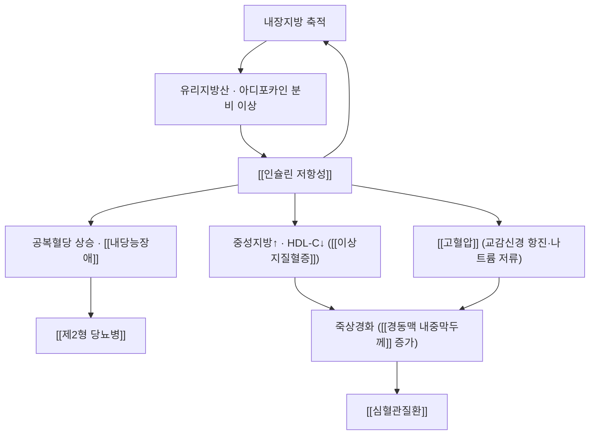

# 🩺 대사증후군 (Metabolic Syndrome)

> **핵심 3줄 요약 (Key Summary)**:
> - 📍 병소 부위 & 해부·병태생리: 복부비만 + [[인슐린 저항성]] 을 축으로 혈압·혈당·지질이 함께 어긋난 군집 상태. 개별 수치가 경계역이어도 **묶이면 심혈관 위험이 곱해진다**
> - 🚩 전형적 임상 양상: 대개 무증상. 허리둘레 증가 · 중성지방 ≥150 mg/dL · HDL-C 저하(남 <40·여 <50) · 혈압 ≥130/85 · 공복혈당 ≥100 중 **3개 이상**
> - 🛠️ 핵심 검사 & 치료 전략: 생활습관(체중·운동)이 1차, 약물은 축별 접근. 한의는 담습·기음양허 변증 + 대사 지표 추적 → [[진력달과립]] · [[내당능장애]]
> - ⚠️ 응급 의뢰 레드플래그: 흉통·호흡곤란(급성 관상동맥 증후군), 갑작스러운 편측 마비·언어장애(뇌졸중), 혈압 ≥180/120 + 두통·시력장애 → 즉시 응급

---

## 📌 목차
1. [질환 개요 & 해부학적 병태생리](#1-질환-개요--해부학적-병태생리)
2. [병태생리 메커니즘 & 생체역학적 악순환 네트워크](#2-병태생리-메커니즘--생체역학적-악순환-네트워크)
3. [임상 증상 & 이학적 검사(Physical Exam) 알고리즘](#3-임상-증상--이학적-검사physical-exam-알고리즘)
4. [감별 진단 매트릭스 (Differential Diagnosis)](#4-감별-진단-매트릭스-differential-diagnosis)
5. [한의 통합 치료 프로토콜 (침·약침·추나·한약)](#5-한의-통합-치료-프로토콜-침약침추나한약)
6. [양방 치료 & 병용·의뢰 기준 (Conventional Treatment & Referral)](#6-양방-치료--병용의뢰-기준-conventional-treatment--referral)
7. [재활 운동 & 생활습관 티칭 가이드](#7-재활-운동--생활습관-티칭-가이드)
8. [💡 사용자 진료실 핵심 필기 & 임상 노하우 (Melt-In 잔여 심화 집약)](#8--사용자-진료실-핵심-필기--임상-노하우-melt-in-잔여-심화-집약)
9. [출처 및 학술 참고 문헌 (References)](#9-출처-및-학술-참고-문헌-references)

---

## 1. 질환 개요 & 해부학적 병태생리

* **정의 및 진단(성인 요약 기준)**: ① 허리둘레 증가(남 ≥90 cm·여 ≥85 cm, 인종별 기준 상이) ② 중성지방 ≥150 mg/dL ③ HDL-C 남 <40·여 <50 mg/dL ④ 혈압 ≥130/85 mmHg ⑤ 공복혈당 ≥100 mg/dL — **3개 이상이면 대사증후군**
* **관련 장기 및 조직**: 지방조직(내장지방) · 간(지방증) · 혈관(내피 기능) · 췌장(베타세포) · 신장
* 임상적 의미: 개별 항목이 '경계역'이어도 군집하면 [[제2형 당뇨병]]·[[심혈관질환]] 위험이 유의하게 상승한다 — 목표는 '수치 하나 정상화'가 아니라 위험 군집 자체를 해체하는 것이다

---

## 2. 병태생리 메커니즘 & 생체역학적 악순환 네트워크

### 1) 분자·세포 수준 기전
* 내장지방 → 유리지방산·[[TNF-a]]·[[IL-6]] 증가, [[아디포넥틴]] 감소 → 인슐린 저항성 심화
* 간 지방증 → 포도당신생 증가·VLDL 분비 증가 → 중성지방 상승·HDL 저하
### 2) 장기·계통 수준 결과
* 혈관 내피 기능 저하 → 아임상 죽상경화 → 임상 사건. 신장에서는 나트륨 저류·알부민뇨([[UACR]])로 진행
### 3) 위험인자와 진행 단계
* 복부비만 → 인슐린 저항성 → 전당뇨 → 당뇨 → 합병증. **되돌릴 수 있는 구간이 앞쪽**이다

---

## 3. 임상 증상 & 이학적 검사(Physical Exam) 알고리즘

### 1) 주요 임상 양상
* 무증상(검진 발견) / 식후 졸림·피로 / 야간 갈증 / 코골이·수면무호흡 동반
### 2) 진료실 측정 세트 (객관적 소견)
* **허리둘레**(늑골 하단과 장골능 중간), 체중·BMI, **혈압(양팔)**, 목둘레(수면무호흡 선별)
* 피부 소견: **흑색가시세포증**, 다발성 피부 꼬리표 → 인슐린 저항성 표지
* 지표: 공복혈당·[[HbA1c]]·지질 패널·간효소·요산·[[UACR]]
### 3) 병기·중증도 판정
* 충족 항목 수(3개 vs 4~5개)와 동반 합병증 여부로 중재 강도를 정한다

---

## 4. 감별 진단 매트릭스 (Differential Diagnosis)

| 감별 질환 | 특징적 양상 | 감별 포인트 |
| :--- | :--- | :--- |
| [[대사증후군]] (본 질환) | 복부비만 + 3항목 이상 | 허리둘레·지질·혈압·혈당 동시 평가 |
| 단순 비만 | 대사 이상 없음 | 지질·혈당 정상 |
| 쿠싱증후군 | 중심성 비만·자색선조 | 코르티솔 검사 |
| [[갑상선기능저하증]] | 체중증가·부종·서맥 | TSH·free T4 |
| 가족성 고지혈증 | 강한 가족력·높은 LDL | 지질 패널·가족력 |

---

## 5. 한의 통합 치료 프로토콜 (침·약침·추나·한약)

* **변증**: 담습곤비 · 기음양허 · 습열내온 · 간울비허 · 어혈
* **침구**: 비수(脾兪 BL20)·위수(胃兪 BL21)·신수(腎兪 BL23)·대장수(大腸兪 BL25) + 족삼리(足三里 ST36)·삼음교(三陰交 SP6)·음릉천(陰陵泉 SP9)·풍륭(豐隆 ST40) — 주 2~3회·12주 이상 → [[전침]]
* **약침**: 복부·배수혈 소량 자극. **감각저하·피부병변 부위는 금지** → [[약침]]
* **한약**: 담습형 [[태음조위탕]] 계열, 기음양허형은 [[진력달과립]] 구조(익기양음·건비화습·보신고정) 참고 → [[창출]] · [[복령]] · [[황정]] · [[고삼]] · [[베르베린]]
* **뜸·부항**: 배수혈 부항·복부 온중 뜸을 보조로. 피부 손상 부위 제외

---

## 6. 양방 치료 & 병용·의뢰 기준 (Conventional Treatment & Referral)

* **약물 치료 (Medication)**: 혈압(ACEi/ARB·CCB) · 지질([[스타틴]]) · 혈당([[메트포르민]] 등) · 항혈소판(위험도에 따라) — 축별로 목표 수치를 정해 접근
* **비약물 시술 (Procedures)**: 체중 감량 프로그램, 수면무호흡 치료(CPAP 등)
* **수술·시술 적응증 (Surgical Indication)**: 고도 비만에서 대사수술 검토
* **한의 병용 판단 (Combination Therapy)**: 스타틴·강압제·혈당강하제와 병용 시 **근육통(스타틴 유발 근병증)·저혈당·저혈압** 감시 → [[스타틴 유발 근병증]] · [[저혈당]]
* **양방·전문과 의뢰 기준 (Referral Criteria)**: 흉통·신경학적 결손·혈압 위기 → 즉시 응급 / 지질·혈당 조절 실패 → 내분비

---

## 7. 재활 운동 & 생활습관 티칭 가이드

* **운동**: 주 150~300분 중등도 유산소 + 주 2회 저항운동. **식후 걷기 15~30분**이 실행률이 가장 높다 → [[걷기 운동]] · [[저항운동]]
* **식이**: 정제 탄수화물·액상과당·야식 절제, 채소·단백질 우선. 담습형은 기름진 음식·유제품 절제
* **자가관리**: 허리둘레·체중 주 1회, 혈압 주 2~3회, 3개월마다 HbA1c·지질
* **환자 교육 스크립트**
  > "수치 하나하나가 심한 건 아니어도, 이 다섯 가지가 같이 있으면 혈관 위험은 곱해집니다. 그래서 하나를 정상으로 만드는 것보다 **허리둘레를 줄이는 것**이 가장 효과가 큽니다."
* **정기 추적**: 3~6개월마다 지질·혈당·혈압, 연 1회 합병증 검사

---

## 8. 💡 사용자 진료실 핵심 필기 & 임상 노하우 (Melt-In 잔여 심화 집약)

> 🛡️ **Melt-In 원칙**: 기존 스텁에는 원장님 필기가 없었다. 아래는 이번 보강에서 정리한 실전 요점이다.

* **허리둘레를 '측정'하라** — 문진으로 "배가 나왔냐"고 묻는 대신 줄자로 잰다. 환자 설득의 가장 강한 도구다
* **흑색가시세포증·피부 꼬리표**를 보면 혈당·지질 평가를 미루지 않는다
* **한약 병용 시 먼저 물을 것**: 스타틴 근육통, 강압제 어지럼, 저혈당 증상 — 부작용을 한약 탓으로 오인하지 않게
* **환자 티스크립트(검진 결과 설명)**
  > "경동맥에 플라크가 보인다는 건 혈관벽에 변화가 시작됐다는 뜻입니다. 지금부터 허리둘레·혈압·중성지방을 함께 관리하면 진행을 늦출 수 있습니다."

---

## 9. 출처 및 학술 참고 문헌 (References)

1. **Ji L, et al. (2024)**. *Jinlida for Diabetes Prevention in Impaired Glucose Tolerance and Multiple Metabolic Abnormalities: The FOCUS Randomized Clinical Trial*. **JAMA Intern Med**, 184(7):727-735. [PMID 38829648](https://pubmed.ncbi.nlm.nih.gov/38829648/)
   - **[연구 요약]**: 내당능장애 + **복부비만 + 대사이상 ≥1개** 889명에서 다성분 본초 과립이 당뇨 발생을 41% 감소(**HR 0.59**, 95% CI 0.46~0.74) — 대사증후군 표현형에서의 중재 근거.
2. **MSD 매뉴얼 전문가용** — [The Metabolic Syndrome](https://www.msdmanuals.com/professional)
   - **[교과서]**: 진단 기준·위험 군집·치료 접근(스텁 작성 원출처).

---

## 관련 노트

- [[내당능장애]] · [[제2형 당뇨병]] · [[이상지질혈증]] · [[고혈압]] · [[비만]] · [[인슐린 저항성]] · [[경동맥 내중막두께]] · [[진력달과립]]

---

## 📎 개념 학습 보충 (2026-09-26 논문 연계)

- **보강 사유**: 2026-09-25 MSD 추출 **스텁(전 섹션 비어 있음)** → 2026-09-26 회차에서 표준 양식으로 채웠다(보강 완료).
- **오늘 근거의 위치**: FOCUS 시험의 포함 기준이 복부비만 + 대사이상 ≥1개로 대사증후군 표현형에 해당한다. 즉 [[진력달과립]] RCT는 대사증후군 전당뇨군에서의 당뇨 예방 근거로 읽을 수 있다
- **⚠️ 이미지 미확보 보고**: 스텁 보강 회차로 도해·임상 이미지 슬롯(내과 질환 6~8장 기준)은 채우지 못했다 — 다음 보강 과제로 남긴다
- **관련**: [[내당능장애]] · [[진력달과립]] · [[2026-09-26_대사노인질환_심층리뷰]] 1번
