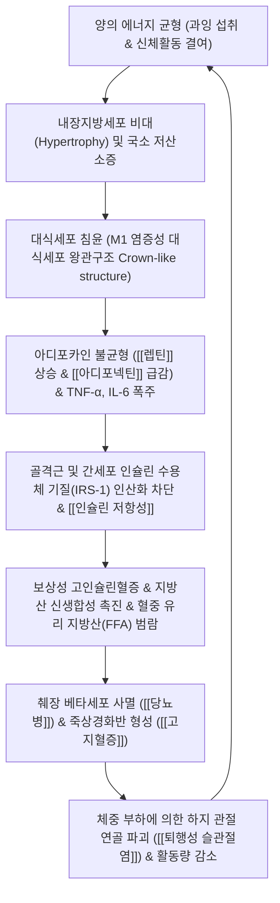

# 🩺 [[비만]] (Obesity / 肥滿, E66)

> **핵심 3줄 요약 (Key Summary)**:
> - 📍 **병소 부위 & 해부·병태생리**: 체내 지방조직(Adipose tissue)의 병적인 과다 증식으로, 피하지방보다 내장지방(Visceral fat)의 축적이 문맥계 유리 지방산(FFA) 유입, 아디포카인 불균형([[렙틴]] 상승, [[아디포넥틴]] 저하), 만성 저등급 대사성 염증([[TNF-α]], [[IL-6]]) 및 **[[인슐린 저항성]]**을 유발함.
> - 🚩 **전형적 임상 양상 & 3대 징후**: 체질량지수(BMI) 및 허리둘레 증가(남성 $\ge 90\text{ cm}$, 여성 $\ge 85\text{ cm}$), 무릎 관절의 기계적 부하로 인한 퇴행성 관절염([[퇴행성 슬관절염]]) 및 [[폐쇄성 수면무호흡증]], 흑색가시세포종(Acanthosis nigricans).
> - 🛠️ **핵심 감별 검사 & 한·양방 다각적 치료 전략**: 생체전기임피던스(BIA) 체성분 분석(골격근량-체지방률 평가) 및 이차성 비만(쿠싱, 갑상선저하) 선별, 복부 지방 분해를 위한 [[중완]](CV12)·[[천추]](ST25)·[[관원]](CV4) 2~100Hz 전침 및 매선요법, 습담·위열 변증 한약([[방풍통성산]], [[태음조위탕]], [[방기황기탕]]).
> - ⚠️ **응급 의뢰 레드플래그 & 악화 요인**: GLP-1 수용체 작용제([[세마글루타이드]] 등) 오남용으로 인한 급격한 제지방(근육) 손실 및 [[근감소성 비만]](Sarcopenic obesity) 주의; 체중 감량 시 극단적 초저열량식은 담석증(Gallstone) 및 심각한 대사율 저하를 초래하므로 저항성 근력 운동 및 단백질 섭취 필수 병행.

---

## 📌 목차
1. [질환 개요 & 해부학적 병태생리](#1-질환-개요--해부학적-병태생리)
2. [병태생리 메커니즘 & 생체역학적 악순환 네트워크](#2-병태생리-메커니즘--생체역학적-악순환-네트워크)
3. [임상 증상 & 이학적 검사(Physical Exam) 알고리즘](#3-임상-증상--이학적-검사physical-exam-알고리즘)
4. [감별 진단 매트릭스 (Differential Diagnosis)](#4-감별-진단-매트릭스-differential-diagnosis)
5. [한의 통합 치료 프로토콜 (침·약침·추나·한약)](#5-한의-통합-치료-프로토콜-침약침추나한약)
6. [재활 운동 & 생활습관 티칭 가이드](#6-재활-운동--생활습관-티칭-가이드)
7. [💡 사용자 진료실 핵심 필기 & 임상 노하우 (Melt-In 잔여 심화 집약)](#7--사용자-진료실-핵심-필기--임상-노하우-melt-in-잔여-심화-집약)
8. [출처 및 학술 참고 문헌 (References)](#8-출처-및-학술-참고-문헌-references)

---

## 1. 질환 개요 & 해부학적 병태생리

![[청강의감15_18_지방간_비만.jpg|450]]
> [그림 1: ① 질환/병태생리 메디컬 일러스트 — 비만 및 내장지방 축적에 따른 대사성 간질환 병태 도해]

### 1) 질환 정의 및 역학적 기준
비만([[Obesity]], ICD-10 E66)은 단순한 체중 증가가 아닌, 건강을 위협할 정도로 체내 **체지방(Body fat)이 비정상적으로 과다 축적된 만성 진행성 재발성 대사 질환**이다. 체지방의 총량뿐만 아니라 체내 분포가 임상 예후를 결정짓는 핵심 인자이다.

* **성인 진단 기준 (대한비만학회 2022 및 WHO 아시아-태평양 기준)**:
  * 과체중: $\text{BMI } 23.0 \sim 24.9 \text{ kg/m}^2$
  * **1단계 비만**: $\text{BMI } 25.0 \sim 29.9 \text{ kg/m}^2$
  * **2단계 비만**: $\text{BMI } 30.0 \sim 34.9 \text{ kg/m}^2$
  * **3단계 고도비만**: $\text{BMI } \ge 35.0 \text{ kg/m}^2$
  * **복부 비만(허리둘레 기준)**: **남성 $\ge 90\text{ cm}$ (35.4인치), 여성 $\ge 85\text{ cm}$ (33.5인치)**
* **소아청소년 (10~19세)**:
  * 성인과 달리 성장 상태를 반영하여 질병관리청 표준 성장도표의 성별·연령별 **[[BMI z-score]]** 또는 백분위수를 적용 (성별·연령별 BMI 95백분위수 이상 시 비만).

### 2) 지방조직의 해부학적 구획과 기능적 차이
* **피하지방(Subcutaneous Adipose Tissue, SAT)**:
  * 주로 둔부, 대퇴부, 복부 피부 하층에 위치하며 에너지 저장고 및 체온 유지 역할을 수행. 대사성 질환과의 연관성은 상대적으로 낮음.
* **내장지방(Visceral Adipose Tissue, VAT)**:
  * 대망(Greater omentum), 장간막(Mesentery), 후복막에 위치하며 문맥계(Portal vein)와 직접 연결됨.
  * 지방분해(Lipolysis) 활성이 매우 높아 다량의 유리 지방산(FFA)을 간으로 직접 방출하여 지방간([[비알코올성 지방간질환]])과 간 인슐린 저항성을 즉각 유발함.

---

## 2. 병태생리 메커니즘 & 생체역학적 악순환 네트워크

![[지방간_정상간_지방간_간경변_진행도해.png|450]]
> [그림 2: ② 관련 분자·대사 구조물 — 비만성 지방독성(Lipotoxicity) 및 지방간-지방간염-간경변 대사 진행도해]

### 1) 내장지방의 만성 저등급 대사성 염증(Metabolic Inflammation)
* **아디포카인(Adipokine) 분비 교란**:
  * **[[렙틴]](Leptin)**: 지방세포에서 분비되어 시상하부 식욕 억제 중추에 작용하는 호르몬. 비만 환자에서는 혈중 렙틴이 극단적으로 상승해 있으나 뇌-혈액 장벽 통과 장애 및 수용체 결함으로 인한 **'렙틴 저항성(Leptin resistance)'**이 발생하여 포만감을 느끼지 못하고 폭식을 지속함.
  * **[[아디포넥틴]](Adiponectin)**: 인슐린 감수성을 개선하고 항염증·항죽상경화 작용을 하는 유익한 호르몬. 비만 환자의 비대해진 지방세포에서는 분비가 급감함.
* **대식세포의 M1 극화(M1 Macrophage Polarization)**:
  * 비대해진 지방세포가 모세혈관 공급 한계를 넘어 허혈성 괴사(Necrosis)를 일으키면, 대식세포가 괴사 세포 주위를 둥글게 둘러싸는 **'왕관 모양 구조(Crown-like structures)'**를 형성함.
  * 대식세포가 전염증성 M1 표현형으로 전환되어 [[TNF-α]], [[IL-6]], MCP-1을 분비하고, 전신 혈관과 간으로 유입되어 전신성 [[인슐린 저항성]]을 유발함.

### 2) 생체역학적 관절 부하 및 호흡 장애
* **무릎 관절 부하(Mechanical Joint Stress)**: 체중 1kg 증가 시 보행 중 무릎 관절이 받는 하중은 3~4배(3~4kg) 증가함. 체중 증가에 따른 기계적 마모와 지방조직 유래 염증성 아디포카인이 관절강 내로 침투하여 연골세포 자멸사를 가속, **[[퇴행성 슬관절염]]**을 급격히 악화시킴.
* **상기도 협착**: 경부 지방 축적으로 인두강이 좁아져 수면 중 무호흡과 저산소혈증을 초래하는 **[[폐쇄성 수면무호흡증]]** 유발.

---

## 3. 임상 증상 & 이학적 검사(Physical Exam) 알고리즘

### 1) 필수 계측 및 신체 평가 프로토콜
* **생체전기임피던스(BIA) 체성분 분석**:
  * 단순 체중(Weight)이 아니라 **골격근량(SMM)**과 **체지방량(BFM)**, 체지방률(남성 > 25%, 여성 > 30% 시 비만 판정)을 정밀 평가.
  * 체중은 정상이거나 경미하게 높으나 근육량이 현저히 부족하고 내장지방이 과다한 마른 비만(Normal-weight obesity) 감별.
  * 위상각(Phase angle): 세포막 완전성과 영양 상태를 대변하며, 세포 건강도 지표로 활용.
* **허리둘레(Waist Circumference) 측정법**:
  * 양발을 25~30cm 벌리고 서서 편안히 숨을 내쉰 상태에서 최하위 늑골 하연과 골반 장골능 상연 사이의 중간 지점을 줄자로 측정.
  * 한국인 복부 비만 컷오프: **남성 $\ge 90\text{ cm}$, 여성 $\ge 85\text{ cm}$**.
  * 허리-엉덩이 둘레 비율(WHR): 남성 > 0.90, 여성 > 0.85 시 심혈관 위험군.
* **혈압 및 대사증후군 5대 인자 스크리닝**:
  * 혈압 $\ge 130/85\text{ mmHg}$ 여부 확인 (적정 크기의 비만용 커프 사용).
  * 공복 혈당 $\ge 100\text{ mg/dL}$, 혈중 중성지방 $\ge 150\text{ mg/dL}$, HDL-C 저하 여부 대조.
* **피부 및 대사 징후 관찰**:
  * **흑색가시세포종(Acanthosis nigricans)**: 목 뒤, 겨드랑이, 사타구니 피부가 벨벳처럼 두꺼워지고 검게 착색되는 징후로, 심한 고인슐린혈증 및 인슐린 저항성을 시사함.
  * **연성 섬유종(Skin tags)**: 목과 겨드랑이 부위의 다발성 쥐젖 형성은 고인슐린혈증의 체표 마커임.

---

## 4. 감별 진단 매트릭스 (Differential Diagnosis)

| 감별 질환 | 주요 원인 및 병태 | 체형 및 지방 분포 특징 | 동반되는 특이 징후 | 핵심 감별 검사 |
| :--- | :--- | :--- | :--- | :--- |
| **원발성(단순) 비만** | 에너지 섭취 과다 및 활동 부족 | 전신성 또는 복부 중심성 비만 | 서서히 진행, 정상적인 신장 성장 | 갑상선/부신 기능 정상 |
| **쿠싱 증후군 ([[쿠싱 증후군]])** | 고코르티솔혈증 (부신/뇌하수체 종양, 스테로이드) | **중심성 비만 + 사지 근위축 (가느다란 팔다리)** | 만월안(Moon face), 버팔로 험프, 복부 자색 선조 | 24시간 뇨 유리 코르티솔, 덱사메타손 억제검사 |
| **[[갑상선 기능 저하증]]** | 갑상선 호르몬 결핍, 기초대사량 급감 | 체중 증가 + 전신 점액수종(Non-pitting edema) | 극심한 피로, 추위 불내성, 변비, 서맥 | **TSH 상승, Free T4 저하** |
| **다낭성 난소 증후군 ([[다낭성 난소 증후군]])** | 고안드로겐혈증 및 인슐린 저항성 | 복부 비만, 청소년기 체중 급증 | **희발월경/무월경, 다모증, 여드름** | 골반 초음파상 다낭성 난소, LH/FSH 비율 |
| **약물 유발성 비만** | 항정신병제(올란자핀), 항우울제, 스테로이드, 설폰요소제 | 약물 복용 시작 후 급격한 체중 증가 | 식욕 억제 불능, 졸림, 갈증 | 투약 이력 상세 문진 |
| **시상하부성 비만 (Hypothalamic Obesity)** | 두개인두종, 외상, 수술 후 손상 | 급격하고 통제 불능의 식탐과 과체중 | 두통, 시야 장애, 시상하부 호르몬 결핍 | 뇌하수체-시상하부 조영 MRI |

---

## 5. 한의 통합 치료 프로토콜 (침·약침·추나·한약)

![[근감소성 비만_4.jpg|450]]
> [그림 3: ③ 한의 치료 시술점 및 제지방 보존 전략 — 복부 피하지방 분해 및 근육량 보존을 위한 중완·천추·관원 전침 치료점]

### 1) 복부 지방분해 전침 요법 (Electroacupuncture)
* **표적 경혈군**:
  * 복부 지방 국소 취혈: [[중완]](CV12), [[천추]](ST25, 양측), 대횡(SP15), 수분(CV9), [[관원]](CV4), 기해(CV6).
  * 전신 대사 촉진 원위 취혈: [[족삼리]](ST36), [[풍륭]](ST40), [[음릉천]](SP9), [[태충]](LR3), 곡지(LI11).
* **전침 통전 파라미터 (지방분해 특화)**:
  * 0.30×60mm 장침을 복부 피하지방층에 수평 또는 30도 사자로 자입.
  * 주파수: **2Hz 저주파와 100Hz 고주파 교차 밀보파**를 30~40분간 통전.
  * 작용 기전: 교감신경 말단에서 노르에피네프린 방출을 유도하여 지방세포의 β3-아드레날린 수용체를 자극, 호르몬 민감성 리파아제(HSL)를 활성화시켜 중성지방을 유리 지방산과 글리세롤로 신속 분해 배출.

### 2) 매선요법 (Polydioxanone, PDO)
* 복부 천추, 기해, 대횡 혈위 및 복직근막 층에 흡수성 PDO 매선을 격자형으로 자입하여 장기적인 이물 반응을 통한 콜라겐 생성 및 국소 림프 순환 촉진, 피부 탄력 유지.

### 3) 한약 치료 (Herbal Medicine)
* **변증 분형별 핵심 처방**:
  * **간위열성(肝胃熱盛) 및 비만형 (식욕 항진, 복부 팽만, 변비, 다한, 설홍태황)**:
    * [[방풍통성산]](대황, 망초, 당귀, 작약, 천궁, 백출, 방풍, 마황, 연교 등): 위열을 식히고 대변과 소변을 소통시켜 식욕 억제 및 기초대사율 항진.
  * **태음인 간열조열(燥熱) 및 습담형 (골격이 크고 식탐이 강하며 변비 경향)**:
    * [[태음조위탕]](의이인 16g, 건율, 나복자, 마황, 석창포, 원지, 길경, 오미자) 또는 열다한소탕: 비위의 습담을 삭이고 교감신경을 완만하게 자극하여 대사 소비량 증가.
  * **비허습저(脾虛濕阻) 및 기허부종형 (적게 먹어도 붓고 피로, 물살 체형, 설담태백)**:
    * [[방기황기탕]](방기, 황기, 백출, 감초, 생강, 대조) 가 복령, 택사, 백출: 수습 대사를 원활하게 하여 부종성 수분을 배출하고 근육 긴장도 개선.
  * **기체혈어(氣滯血瘀)형 (스트레스성 폭식, 옆구리 결림, 월경통 동반)**:
    * 대시호탕(시호, 황금, 작약, 반하, 지실, 대황, 생강, 대조) 합 도핵승기탕: 간기울결을 풀고 장관 내 정체된 대사 독소 배출.
* **체중 감량 한약재의 주요 약리 기전**:
  * **[[마황]](Ephedrae Herba)**: 에페드린(Ephedrine) 성분이 중추 시상하부의 식욕 중추를 억제하고 갈색지방조직(BAT)의 UCP-1 발현을 촉진하여 열 발생(Thermogenesis) 증대. (임상 시 환자의 심박수 및 혈압 모니터링 필수).
  * **[[의이인]](Coicis Semen)**: 장내 미생물총(Gut microbiota) 환경을 개선하고 단쇄지방산(SCFA) 생성을 늘려 인슐린 감수성 회복 및 식후 인슐린 급증 억제.
  * **숙지황 / 산수유**: 체중 감량 중 발생하기 쉬운 음혈(陰血) 손상 및 피부 탄력 저하를 방어.
  * **백출 / 창출**: 비위의 운화 기능을 북돋아 체내 잉여 수습(체액 저류) 정체를 원천 차단.

### 4) 현대 비만 치료 약물과의 상호작용 및 관리
* **GLP-1 수용체 작용제**: [[세마글루타이드]](Semaglutide, 위고비), 터제파타이드(Tirzepatide, 마운자로).
  * 위 배출 지연 및 중추 식욕 억제로 15~20% 체중 감량을 유도하나, 오심·구토·변비 등 위장관 이상반응 빈발.
  * 한의 소화기 보양 및 장관 운동 정상화 처방(평위산, 반하사심탕 가미)을 병용하면 약물 유발성 소화기 부작용을 극적으로 경감시키고 치료 지속률을 높일 수 있음.
* **교감신경 작용 식욕억제제**: 펜터민(Phentermine). 단기 사용(3개월 이내) 원칙, 심혈관 과부하 및 의존성 주의.

---

## 6. 재활 운동 & 생활습관 티칭 가이드

### 1) 제지방(근육) 보존 저항성 운동 — ★요요 방지의 핵심
* **근력 운동(저항성 운동)의 절대적 병행**:
  * 체중 감량 시 발생하는 기초대사량 저하와 근감소증([[근감소성 비만]])을 막기 위해 스쿼트, 런지, 푸시업, 밴드 운동을 주 3회 이상 필수로 배치.
  * 대퇴사두근, 대둔근 등 인체 대근육군 중심의 점진적 과부하 훈련을 통해 포도당 흡수 수용체(GLUT4) 발현을 유도.
* **유산소 운동 프로토콜**:
  * 하루 30~50분, 최대 심박수의 60~70% 수준으로 주 5회 이상 빠르게 걷기나 수영, 실내 자전거 시행 (관절 손상 방지).

### 2) 영양 및 행동 수정 티칭
* **단백질 우선 섭취**: 체중 1kg당 1.2~1.5g의 순수 단백질(닭가슴살, 두부, 달걀, 생선)을 매 끼니 분할 섭취하여 포만감 유지 및 제지방 보존.
* **초가공식품 및 액상과당 완전 차단**: 혈당 스파이크와 인슐린 폭주를 유발하는 설탕 음료, 빵, 과자 엄격 금지.
* **수면 위생 및 스트레스 관리**: 7시간 이상의 규칙적 수면을 확보하여 야간 코르티솔 분비를 안정시키고 식욕 촉진 호르몬 그렐린(Ghrelin)의 폭발을 방어.

---

## 7. 💡 사용자 진료실 핵심 필기 & 임상 노하우 (Melt-In 잔여 심화 집약)

### 1) 진료실 핵심 필기 원문 융합
* **GLP-1 작용제(삭센다, 위고비) 투여 환자의 비극: '근감소성 비만' 주의**:
  * 요즘 위고비나 삭센다를 처방받고 10kg씩 빼서 환하게 웃으며 내원하는 환자들이 많음.
  * **원장의 인바디 체크 노하우**: 반드시 인바디(BIA)를 재봐야 함. 빠진 10kg 중 4~5kg 이상이 골격근(근육)인 경우가 태반임. 근육이 다 빠져 기초대사량이 바닥을 치면 약을 끊는 순간 이전보다 훨씬 더 찌는 비극적인 반동 비만이 발생함.
  * **환자 티칭**: "약물이나 한약으로 체중을 줄일 때 **저항성 근력 운동**과 **고단백 식단**을 병행하지 않으면 지방은 남고 근육만 녹아내려 결국 살이 더 찌는 체질로 바뀝니다"라고 강력히 지도해야 함.
* **소아청소년 비만 환자의 접근법 (Cochrane 2026 메타분석 반영)**:
  * 부모들이 아이의 체중계 숫자에만 집착하여 억지로 굶기다가 성장을 망치고 거식증/폭식증으로 이어지는 경우가 많음.
  * 성장기 아이들은 키가 크고 있기 때문에 **체중 숫자가 안 줄어도 키가 크면서 허리둘레와 체지방률이 줄면 대성공**임.
  * "살 빼라"는 잔소리 대신 온 가족이 함께 참여하는 저녁 산책, 스포츠 활동으로 유도하고 자존감을 높여주는 프레임으로 상담해야 순응도가 나옴.
* **마황(Ephedra) 처방 시의 안전 수칙**:
  * 가슴 두근거림, 불면, 손떨림을 호소하는 환자에게는 용량을 즉시 1/2로 줄이고, 용골·모려·복령·산조인 등 안신제를 가미하여 자율신경 과흥분을 조절해야 장기적인 감량 성공률이 유지됨.

---

## 8. 출처 및 학술 참고 문헌 (References)

* Physical activity interventions for children and adolescents with overweight or obesity. *Cochrane Database Syst Rev*. 2026. PMID: [42592869](https://pubmed.ncbi.nlm.nih.gov/42592869)
  * [연구 요약] 10~19세 소아청소년 과체중/비만 환자 1,508명 대상 코크란 체계적 문헌고찰로 12주 이상 신체활동 중재 시 체중, 허리둘레 및 체지방률의 유의미한 개선 효과 규명.
* Electro-acupuncture for central obesity: a patient-assessor blinded, randomized sham-controlled clinical trial. *BMC Complement Med Ther*. 2024. PMID: [38287303](https://pubmed.ncbi.nlm.nih.gov/38287303)
  * [연구 요약] 중심성 복부 비만 환자 대상 이중맹검 위약 대조 무작위 임상시험에서 복부 경혈 전침 치료가 허리둘레, 내장지방 면적 및 지질 대사 지표를 유의하게 개선함을 입증.
* Effect of Moxibustion Combined with Other Interventions on Body Weight Reduction in the Treatment of Obesity: A Systematic Review and Meta-Analysis. *J Integr Complement Med*. 2024. PMID: [38099954](https://pubmed.ncbi.nlm.nih.gov/38099954)
  * [연구 요약] 비만 환자에 대한 뜸 요법 및 한의 복합 중재의 체중 감량, BMI 및 렙틴 호르몬 조절 효과에 대한 체계적 문헌고찰 및 메타분석.
* 2022 Clinical Practice Guidelines for Obesity: Korean Society for the Study of Obesity. *J Obes Metab Syndr*. 2023. PMID: [36882200](https://pubmed.ncbi.nlm.nih.gov/36882200)
  * [연구 요약] 대한비만학회 비만 진료지침 8판으로 한국인 비만 기준(BMI 25 이상), 허리둘레 기준, 동반 대사질환 평가 및 단계별 포괄적 치료 권고안 수록.
