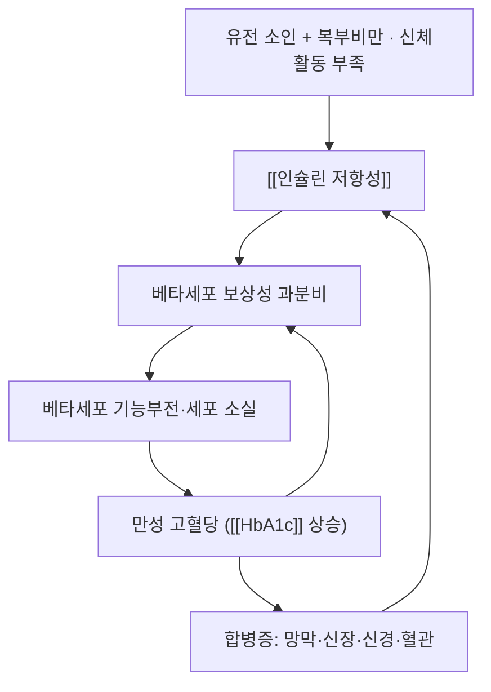

# 🩺 제2형 당뇨병 (Type 2 Diabetes Mellitus, T2DM / ICD-10 E11)

> **핵심 3줄 요약 (Key Summary)**:
> - 📍 **병소 부위 & 병태생리**: 인슐린 저항성(근육·간·지방) + 베타세포 기능부전의 **두 축**. 처음에는 인슐린 과분비로 버티다가 결국 분비가 따라가지 못하며 혈당이 상승한다 → [[인슐린 저항성]]
> - 🚩 **전형적 임상 양상**: 무증상 발견이 가장 흔하다. 다뇨·다음·다식·체중감소(3多), 피로, 상처 치유 지연, 반복 감염. 진단은 공복혈당 ≥126 / 2시간 ≥200 / HbA1c ≥6.5%
> - 🛠️ 핵심 감별 & 한·양방 치료 전략: 1형·이차성(스테로이드·췌장 질환) 감별 → [[메트포르민]] 1차 + 생활습관, 단계별 병용. 한의 치료는 혈당 조절 보조 + 합병증(신경병증·당뇨발) 관리가 중심 → [[내당능장애]] · [[당뇨발]]
> - ⚠️ **응급 의뢰 레드플래그**: 다뇨·다음·체중감소 + **케톤 양성 또는 혈당 ≥250 mg/dL** → 당뇨병성 케톤산증/고삼투압 상태 응급. **SGLT2 억제제 복용 중 구역·복통·호흡곤란은 정상혈당 케톤산증** 신호 → [[정상혈당 케톤산증]]

---

## 📌 목차
1. [질환 개요 & 병태생리](#1-질환-개요--병태생리)
2. [병태생리 메커니즘 & 대사 악순환 네트워크](#2-병태생리-메커니즘--대사-악순환-네트워크)
3. [임상 증상 & 이학적 검사 알고리즘](#3-임상-증상--이학적-검사-알고리즘)
4. [감별 진단 매트릭스](#4-감별-진단-매트릭스)
5. [한의 통합 치료 프로토콜](#5-한의-통합-치료-프로토콜)
6. [양방 치료 & 병용·의뢰 기준](#6-양방-치료--병용의뢰-기준)
7. [재활 운동 & 생활습관 티칭 가이드](#7-재활-운동--생활습관-티칭-가이드)
8. [💡 진료실 핵심 필기 & 임상 노하우](#8--진료실-핵심-필기--임상-노하우)
9. [출처 및 학술 참고 문헌 (References)](#9-출처-및-학술-참고-문헌-references)

---

## 1. 질환 개요 & 병태생리

* **정의 및 분류**: 인슐린 분비 저하 + 인슐린 저항성이 함께 작용해 만성 고혈당을 만드는 질환. 1형(자가면역·절대적 결핍), 임신성 당뇨, 이차성(스테로이드·췌장 질환·내분비 질환)과 구분한다
* **진단 기준(비임신 성인)**: 공복혈당 ≥126 mg/dL · 75 g OGTT 2시간 ≥200 mg/dL · HbA1c ≥6.5% · 또는 전형 증상 + 무작위 ≥200 mg/dL — **확진은 반복 검사 또는 다른 검사와 교차 확인** → [[경구포도당부하검사]]
* **전구 단계**: [[내당능장애]](2시간 140~199 mg/dL) · 공복혈당장애(100~125) · HbA1c 5.7~6.4%
* **관련 장기**: 췌장 베타세포 · 골격근 · 간 · 지방조직 / 합병증 표적 — 눈(망막병증) · 신장(신증) · 신경([[당뇨병성 말초신경병증]]) · 혈관([[경동맥 내중막두께]]·[[심혈관질환]]) · 발([[당뇨발]])

---

## 2. 병태생리 메커니즘 & 대사 악순환 네트워크

### 1) 분자·세포 수준 기전
* 근육 [[GLUT4]] 전위 감소 → 포도당 섭취 저하 / 간 포도당신생 증가 / 지방조직 유리지방산 유출 증가
* 만성 고혈당의 포도당독성·지질독성·산화스트레스([[ROS]]) 가 베타세포를 추가로 손상시키는 악순환
### 2) 장기·계통 수준 결과
* 미세혈관 합병증(망막·신장·신경)과 대혈관 합병증(관상동맥·뇌혈관·말초동맥)이 **진단 전 수년부터** 진행된다
### 3) 위험인자와 진행 단계
* 위험인자: 복부비만·가족력·고령·[[고혈압]]·[[이상지질혈증]]·임신성 당뇨 병력·PCOS·스테로이드 사용
* 진행: 정상 → 전당뇨 → 당뇨 → 합병증. **전당뇨 구간에서 중재하면 되돌릴 수 있다**

---

## 3. 임상 증상 & 이학적 검사 알고리즘

### 1) 주요 임상 증상 및 특징적 패턴
* **전형**: 다뇨·다음·체중감소(3多), 피로, 시력 흐림, 반복 피부·요로 감염
* **비전형**: 무증상 검진 발견(가장 흔함), 손발 저림·화끈거림(신경병증), 상처 치유 지연
### 2) 진료실에서 할 수 있는 선별 세트
* **발 검사**: 10 g 모노필라멘트 · 128 Hz 진동각 · 발등맥/후경골동맥 촉지 → [[당뇨발]] · [[당뇨병성 말초신경병증]]
* **혈압·체중·허리둘레** 측정, **발 피부 상태** 시진(균열·굳은살·변색)
* **약물 복용 목록 확인** — 저혈당을 일으킬 조합(설폰요소제·인슐린 + 혈당강하 본초) 파악 → [[저혈당]]

---

## 4. 감별 진단 매트릭스

| 감별 질환 | 특징적 양상 | 감별 포인트 (검사·수치) |
| :--- | :--- | :--- |
| [[제2형 당뇨병]] (본 질환) | 서서히 진행, 비만 동반 | C-peptide 보존, 자가항체 음성 |
| 1형 당뇨병 | 급성 발현, 체중감소·케톤 | 자가항체(GAD 등), 케톤 |
| 스테로이드 유발 고혈당 | 약물 시작 후 발현 | 복용력, 중단 시 경과 |
| [[내당능장애]] | 무증상, 경계역 | OGTT 140~199 |
| 췌장 질환 관련 | 소화불량·체중감소 | 영상·췌장효소 |

---

## 5. 한의 통합 치료 프로토콜

* **변증**: 소갈(消渴) 체계 — 上消(폐조)·中消(위열)·下消(신허) + 기음양허·담습·어혈
* **침구**: 배수혈(비수(脾兪 BL20)·위수(胃兪 BL21)·신수(腎兪 BL23)) + 족삼리(足三里 ST36)·삼음교(三陰交 SP6)·곡지(曲池 LI11)·합곡(合谷 LI4) — 최소 12주 이상·주 2~3회 → [[전침]]
* **한약**: 변증별 처방. 전당뇨·기음양허에는 [[진력달과립]] 구조(익기양음·건비운진) 참고, 담습형은 [[태음조위탕]] 계열 → [[황정]] · [[고삼]] · [[지모]]
* **당뇨발·신경병증**: 궤양 감압 우선, 신경병증은 전침 보조 → [[오프로딩]] · [[약침]] (궤양면 직접 자극 금지)

---

## 6. 양방 치료 & 병용·의뢰 기준

* **약물 치료(계열별)**
  * **1차**: [[메트포르민]] (신기능·eGFR 확인, 위장관 부작용, B12 결핍 주의)
  * 계열 추가: SGLT2 억제제([[엠파글리플로진]]·[[다파글리플로진]]) · GLP-1 수용체작용제([[세마글루타이드]]) · DPP-4 억제제 · 설폰요소제 · 인슐린
  * 병용 원칙: 심혈관·신장·체중 목표에 따라 선택, **저혈당 위험 약물은 고령에서 감량**
* **비약물**: 생활습관(체중 5~7% 감량·주 150분 운동), 필요 시 대사수술
* **한의 병용 판단**
  * **병용 가능**: 표준 약물 유지 + 침·한약 보조. 혈당강하 본초 병용 시 **자가혈당 측정 강화**
  * **주의**: 설폰요소제·인슐린 + 혈당강하 본초(호로파·황정·고삼 등) → 저혈당. [[저혈당]] 증상 교육 필수
  * **금기**: 환자 임의 약 중단, 감염·케톤 의심 상황에서 보기 한약 단독
* **의뢰 기준**: HbA1c ≥9% 또는 증상 동반 고혈당, 케톤·탈수, 급성 합병증 의심 → 내분비/응급

---

## 7. 재활 운동 & 생활습관 티칭 가이드

* **운동**: 유산소 주 150분 이상 + 저항운동 주 2회. **식후 15~30분 걷기**가 가장 지속 가능하다 → [[걷기 운동]] · [[저항운동]]
* **식이**: 정제 탄수화물·액상과당 감량, 식사 순서 조정, 규칙적 식사 시각
* **발 관리**: 매일 발 확인·맨발 금지·치료용 신발 → [[당뇨발]]
* **자가측정**: 공복·식후 혈당 기록, 3개월마다 HbA1c, 연 1회 합병증 검사(눈·신장·신경)

---

## 8. 💡 진료실 핵심 필기 & 임상 노하우

> 🛡️ **Melt-In 원칙**: 기존 스텁에는 원장님 필기가 없었다. 아래는 이번 보강에서 정리한 실전 요점이다.

* **"당뇨 환자에서 가장 먼저 볼 것은 발"** — 감각저하·궤양 전구 병변이 있으면 치료 순서가 완전히 달라진다(감압 먼저)
* **복용약 확인 없이 한약을 쓰지 않는다** — 저혈당 조합이 가장 흔한 사고 원인
* **고령 환자**: 목표 HbA1c를 완화(저혈당·낙상 위험)하고, 약물 개수와 낙상 위험을 함께 본다
* **환자 티스크립트**
  > "혈당은 '지금 얼마인지'보다 '3개월 평균이 어떻게 움직이는지'가 중요합니다. 그리고 발은 매일 확인하셔야 합니다 — 아프지 않은 상처가 가장 위험합니다."

---

## 9. 출처 및 학술 참고 문헌 (References)

1. **Ji L, et al. (2024)**. *Jinlida for Diabetes Prevention in Impaired Glucose Tolerance and Multiple Metabolic Abnormalities: The FOCUS Randomized Clinical Trial*. **JAMA Intern Med**, 184(7):727-735. [PMID 38829648](https://pubmed.ncbi.nlm.nih.gov/38829648/)
   - **[연구 요약]**: 전당뇨 + 대사이상에서 다성분 본초 과립이 **당뇨 발생을 41% 감소(HR 0.59)** — 전당뇨 단계 중재의 근거.
2. **Prevention of type 2 diabetes in India and China** (2026). **Metabolism**. [PMID 42705413](https://pubmed.ncbi.nlm.nih.gov/42705413/)
   - **[연구 요약]**: 아시아 전당뇨 중재(생활습관·약물·전통의학)의 최신 정리.
3. **MSD 매뉴얼 전문가용** — [당뇨병(Diabetes Mellitus, DM)](https://www.msdmanuals.com/professional)
   - **[교과서]**: 진단 기준·합병증·치료 계열 개요(스텁 작성 원출처).

---

## 📎 개념 학습 보충 (2026-09-26 논문 연계)

- **보강 사유**: 이 노트는 2026-09-25 MSD 매뉴얼 추출 **스텁(모든 섹션 비어 있음)** 이어서, 2026-09-26 회차에서 **표준 질환 양식으로 채우고(보강 완료)** FOCUS 시험 근거를 연결했다.
- **오늘 근거의 위치**: FOCUS 시험은 **당뇨가 아닌 전당뇨**를 대상으로 했다. 즉 이 노트의 관점에서 보면 **"당뇨 확진 전 단계에서 개입하면 발생 자체를 줄일 수 있다"** 는 예방 근거다 → [[내당능장애]] · [[진력달과립]]
- **임상 연결**: [[메트포르민]]과 진력달과립의 병용은 시험 설계상 검증되지 않았다(시험 중 다른 혈당강하제 금지). 병용 상담 시 이 한계를 반드시 밝힌다.
- **관련**: [[당뇨병]] · [[내당능장애]] · [[대사증후군]] · [[이상지질혈증]] · [[당뇨발]] · [[당뇨병성 말초신경병증]] · [[저혈당]] · [[HOMA-IR]] · [[HbA1c]]
