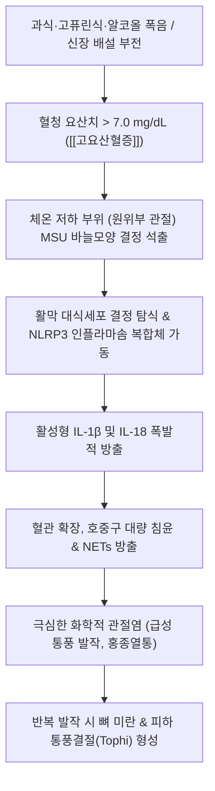

# 🩺 [[통풍]] (Gout / 痛風, M10)

> **핵심 3줄 요약 (Key Summary)**:
> - 📍 병소 부위 & 해부·병태생리: 퓨린 대사 이상으로 혈청 요산치가 7.0 mg/dL을 초과하는 [[고요산혈증]]에 의해 요산나트륨(MSU) 결정이 관절강·활막·건초에 침착되어 NLRP3 인플라마솜 활성화 및 호중구 급성 염증 유발.
> - 🚩 전형적 임상 양상 & 3대 징후: 제1중족지관절(엄지발가락, Podagra)·족관절·슬관절의 돌발성 극통(야간 급발, VAS 9~10), 환부 발적·종창·열감, 바람만 스쳐도 찢어지는 통증, 만성 결절성 통풍(Tophi).
> - 🛠️ 핵심 감별 검사 & 한·양방 다각적 치료 전략: 편광현미경 음성 복굴절 바늘모양 결정 확진, 급성기 콜히친·NSAIDs 및 청열해독·이습통비([[당귀점통탕]], [[백호가인삼탕]]), 만성기 알로푸리놀·페북소스타트 및 [[삼묘환]] 가미방, 유산소 운동 중심 대사 조절.
> - <font color="#fa7e7e">⚠️ 응급 의뢰 레드플래그 & 악화 요인: 패혈성 관절염(화농성 관절염 동반 의심), 급성 신우신염 및 요산 요로결석, 알코올(특히 퓨린 풍부한 맥주) 폭음, 급격한 절식 및 과도한 무산소 운동(케톤체 급증으로 요산 배설 차단).</font>

---

## 📌 목차
1. [질환 개요 & 해부학적 병태생리](#1-질환-개요--해부학적-병태생리)
2. [병태생리 메커니즘 & 퓨린 대사 악순환 네트워크](#2-병태생리-메커니즘--퓨린-대사-악순환-네트워크)
3. [임상 증상 & 병기별 진행 단계](#3-임상-증상--병기별-진행-단계)
4. [진단 검사 & 감별 진단 매트릭스](#4-진단-검사--감별-진단-매트릭스)
5. [한의 통합 치료 프로토콜 (침·약침·한약)](#5-한의-통합-치료-프로토콜-침약침한약)
6. [식이 요법 & 생활습관 티칭 가이드](#6-식이-요법--생활습관-티칭-가이드)
7. [💡 사용자 진료실 핵심 필기 & 임상 노하우 (Melt-In 잔여 심화 집약)](#7--사용자-진료실-핵심-필기--임상-노하우-melt-in-잔여-심화-집약)
8. [출처 및 학술 참고 문헌 (References)](#8-출처-및-학술-참고-문헌-references)

---

## 1. 질환 개요 & 해부학적 병태생리

![[청강의감28_02_통풍_관절_요산염침착.jpg|480]]
> [그림 1: 통풍 환자의 제1중족지관절(엄지발가락) 급성 발작 부위의 극심한 발적·종창(좌) 및 만성 결절성 통풍 환자의 수부 근위지간관절 요산염 결절(Tophi) 침착 외형(우)]

* **질환 정의 및 개요**:
  * [[통풍]](Gout)은 체내 퓨린(Purine) 대사의 최종 산물인 **[[요산]](Uric acid)**이 과잉 생성되거나 신장을 통한 배설이 저하되어 발생하는 전신 대사 이상 질환이다.
  * 혈중 요산 농도가 포화 농도(체온 37℃ 기준 약 6.8~7.0 mg/dL)를 초과하는 **[[고요산혈증]]**이 지속되면, 요산나트륨(Monosodium urate, MSU) 결정이 관절 활막, 연골하골, 힘줄, 피하 결합조직 및 신장에 침착되어 극심한 화학적 염증 발작과 조직 파괴를 일으킨다.
* **호발 부위 및 성별 역학**:
  * **호발 부위**: 전체 첫 발작의 약 50~70%가 **[[엄지발가락]] 제1중족지관절(1st MTP joint, 포다그라 Podagra)**에서 발생하며, 이어 발등, [[발목관절]], [[슬관절]], 손가락 관절 순으로 호발한다. 원위부 관절은 체온이 낮고 혈류 속도가 느려 요산염 결정 석출이 용이하기 때문이다.
  * **남녀 성비와 남성 통풍 기전**: 남성이 여성에 비해 5~10배 호발한다.
    * 남성은 여성에 비해 골격근량이 많아 세포 회전율에 따른 퓨린 및 요산 생성이 본질적으로 많다.
    * **테스토스테론(남성 호르몬)**의 영향으로 신장 요산 재흡수 수송체(URAT1) 활성이 높아 요산 배설률이 낮다.
    * 반면 여성호르몬인 에스트로겐은 신장의 요산 배설을 강력히 촉진(Uricosuric effect)하므로, 폐경 전 여성에서는 통풍이 극히 드물다.

---

## 2. 병태생리 메커니즘 & 퓨린 대사 악순환 네트워크

![[청강의감28_04_고요산혈증_요산염결정_유리.jpg|480]]
> [그림 2: 관절 천자 활액의 편광현미경 소견 — 음성 복굴절을 띠며 세포 내외로 강하게 굴절되는 침상(Needle-shaped) 요산나트륨(MSU) 결정체]



### (1) NLRP3 인플라마솜과 급성 염증 폭발
* 관절강 내 석출된 바늘 모양의 MSU 결정이 활막 대식세포의 세포막을 자극하고 세포 내로 탐식되면, 세포 내 **NLRP3 인플라마솜(Inflammasome)**이 활성화된다.
* Caspase-1 효소가 프로인터루킨-1β를 활성형 **IL-1β**로 전환하여 분비하고, 이는 주변 혈관을 급격히 확장시키며 수많은 호중구(Neutrophil)를 관절강 내로 유인한다.
* 침윤한 호중구가 결정을 재탐식하면서 세포 파괴성 효소와 활성산소를 쏟아내어 극심한 팽창 부종과 작열통이 완성된다.

### (2) 에너지 과잉, 알코올, 케톤체에 의한 배설 차단 기전
* **에너지 총섭취량과 비만**: 단순 퓨린 섭취량보다 **총 에너지 과잉 섭취(비만)**가 체내 인슐린 저항성을 유발하고, 이는 신세뇨관의 URAT1 수송체를 자극하여 요산 배설을 억제한다.
* **알코올의 2중 악화 기전**:
  * 에탄올이 간에서 분해될 때 ATP가 AMP로 급격히 소모되며 퓨린 분해가 촉진되어 요산 생성이 폭증한다.
  * 알코올 대사 산물인 젖산(Lactate)이 신장에서 요산 배설 경로를 경쟁적으로 점유하여 소변 요산 배설을 차단한다. 특히 **맥주는 알코올뿐 아니라 효모 유래 고농도 퓨린체(구아노신 등)**를 직접 함유하여 가장 치명적이다.
* **급격한 굶기 및 과도한 무산소 운동의 위험**:
  * 탄수화물을 완전히 끊는 극단적 절식이나 과도한 무산소 젖산 운동은 체내 케톤체(Acetoacetate, β-hydroxybutyrate)와 젖산을 대량 축적시킨다.
  * 케톤체는 신세뇨관에서 요산과 동일한 음이온 수송체(OAT4)를 공유하므로, **케톤체가 소변으로 빠져나가는 동안 요산 배설이 강력하게 차단되어 급성 발작을 촉발**한다.

---

## 3. 임상 증상 & 병기별 진행 단계

* **1단계: 무증상 고요산혈증 (Asymptomatic Hyperuricemia)**:
  * 혈청 요산치 > 7.0 mg/dL이나 관절염 증상이 없는 단계. 즉각적인 약물 치료보다는 생활습관 교정이 우선된다.
* **2단계: 급성 통풍성 관절염 (Acute Gouty Arthritis)**:
  * 과음, 과식, 외상, 수술 후 깊은 밤이나 새벽에 갑자기 시작되는 인생 최악의 격통(VAS 9~10).
  * 이불 깃만 스쳐도 자지러지는 극심한 접촉 이질통, 관절 부위의 번들거리는 자홍색 발적과 팽팽한 부종, 고열 동반.
  * 치료하지 않아도 1~2주 내에 자연 관해되는 특성을 보인다.
* **3단계: 간헐기 통풍 (Intercritical Gout)**:
  * 발작과 발작 사이의 무증상기. 요산염 결정은 관절 내에 조용히 계속 축적되고 있으며 치료를 방치하면 발작 빈도가 잦아지고 다발성으로 진행된다.
* **4단계: 만성 결절성 통풍 (Chronic Tophaceous Gout)**:
  * 발작 후에도 통증이 완전히 소실되지 않고 귓바퀴(이개), 손발가락, 아킬레스건 부위에 하얀 비지 같은 요산염 덩어리인 **통풍결절(Tophi)**이 형성된다.
  * 관절 연골과 연골하골이 펀치로 뚫린 듯한 골 미란(Punched-out erosion)을 보이며 영구적 관절 변형과 골파괴를 초래한다.

---

## 4. 진단 검사 & 감별 진단 매트릭스

### (1) 검사실 소견 및 확진 기준
* **관절천자액 편광현미경 검사 (골드 스탠다드)**:
  * 백혈구 내에 삼켜진 바늘 모양의 요산나트륨(MSU) 결정 확인.
  * 보상 필터 하에서 결정의 장축이 편광축과 평행할 때 노란색, 수직일 때 파란색을 띠는 **음성 복굴절(Negative birefringence)**을 나타냄.
* **혈청 요산 수치**: 7.0 mg/dL 초과. (단, 급성 발작 중에는 스트레스 호르몬 분비로 신장 배설이 일시 촉진되어 약 20~30% 환자에서 정상 수치를 보일 수 있으므로 발작 2~4주 후 재검 필수).
* **단순 X-ray 및 이중에너지 CT (DECT)**: 관절 주변 연조직 종창, 진행 시 뼈 변연부 돌출(Overhanging edge)을 동반한 원형 골 결손 관찰, DECT로 요산 결정을 녹색 음영으로 가시화.

### (2) 감별 진단 매트릭스

| 질환명 | 주 침범 관절 | 결정체 특성 (편광현미경) | 혈액 및 관절액 특징 | 핵심 감별점 |
| :--- | :--- | :--- | :--- | :--- |
| **[[통풍]] (Gout)** | 제1중족지(엄지), 족관절 | **강한 음성 복굴절 바늘모양 (MSU)** | 혈청 요산치 상승, 무균성 | 남성 호발, 알코올/과식 유발, 야간 급발 |
| 가성 통풍 (CPPD / 위통풍) | [[슬관절]](무릎), 손목 | **약한 양성 복굴절 능형/마름모 (CPP)** | X-ray상 관절연골 석회화증 | 고령자/여성 호발, 대퇴-경골 관절연골 선상 석회 |
| 화농성 관절염 (Septic Arthritis) | 대관절(무릎, 고관절 단발) | 결정체 음성 | 관절액 백혈구 >50,000/μL, 세균 배양 양성 | 고열, 전신 패혈증 증상, 즉각적 관절강 세척 응급 |
| 류마티스 관절염 (RA) | 수부 MCP, PIP 관절 대칭 | 결정체 음성 | RF 양성, Anti-CCP 양성, 조조강직 >1시간 | 대칭성 소관절 침범, 만성 활막 증식, 여성 호발 |

---

## 5. 한의 통합 치료 프로토콜 (침·약침·한약)

### 5.1 급성기 침구 및 소염 약침 치료
* **병변 원위부 사혈 요법 (급성기 감압)**:
  * 제1중족지관절 급성 발작 시 대돈(LR1), 은백(SP1), 태돈 부위 삼릉침 점자출혈을 통해 울혈된 정맥혈을 1~2cc 사혈 감압하여 활막 내압과 극통을 즉각 완화.
* **경혈 자침 요법**:
  * 족삼음경 및 족태양방광경을 배오하여 습열(濕熱)을 소산.
  * (핵심 혈자리): 태충(LR3), 구허(GB40), 곤륜(BL60), 조해(KI6), 삼음교(SP6), 곡지(LI11), 음릉천(SP9).
* **소염 약침 요법**:
  * 급성 화학적 염증 진정을 위해 황련해독탕 약침 또는 소염 약침 0.3~0.5cc를 염증 관절 피하 주변에 나누어 점상 침윤 주입 (관절강 내 직접 자입은 피함).

### 5.2 변증별 단계적 한약 치료

```
[급성 발작기: 습열비저(濕熱痺阻)]
   ▶ [[백호가인삼탕]] / [[당귀점통탕]] (황백, 지모, 석고, 방기 배오로 급성 염증 소퇴)
                    │
                    ▼
[간헐기·만성기: 습담어저(濕痰瘀阻) & 비신양허(脾腎兩虛)]
   ▶ [[삼묘환]] / [[사묘환]] 가감방 (창출, 황백, 우슬, 의이인으로 신장 요산 배설 촉진)
   ▶ 갈근·진피·백작약 배오 처방 (URAT1 억제 및 잔틴 산화효소 활성 차단)
```

* **급성기 청열이습·활혈지통(淸熱利濕·活血止痛)**:
  * **[[당귀점통탕]](當歸拈痛湯)**: 관절이 벌겋게 붓고 열감이 극심하며 소변이 붉고 탁한 습열통비에 최고 빈용 방제.
  * **[[백호가인삼탕]](白虎加人蔘湯)** 가감방: 극심한 열감과 구갈, 작열통을 끄는 응급 청열 제제.
* **만성 간헐기 요산 강하 및 신기능 보존**:
  * **[[삼묘환]](三妙丸)** 또는 **사묘환(四妙丸)**: 창출, 황백, 우슬, [[의이인]](율무) 배오로 신장 및 장관을 통한 요산 결정 배출을 유도하고 연골 파괴를 방지.
  * **갈근·진피 배오**: 최근 약리 연구에서 [[갈근]](Pueraria lobata)과 진피(Citrus reticulata) 추출물이 신세뇨관 URAT1 및 GLUT9 수송체를 억제하여 요산 배설을 유의하게 촉진함이 규명됨.

---

## 6. 식이 요법 & 생활습관 티칭 가이드

![[통풍-20240524161751197.png|480]]
> [그림 3: 퓨린체 함유량에 따른 식품 분류 가이드라인 — 식품 100g당 퓨린체 200mg 이상 함유된 고퓨린 식품군(붉은색) 섭취 엄격 제한]

* **식이 관리 핵심 4대 원칙**:
  1. **고퓨린 식품 철저 제한**: 닭 간, 소·돼지 간, 정어리, 청어, 고등어, 마른 멸치, 조개류, 진한 고기 육수(사골국, 농축 곰탕).
  2. **과당(Fructose) 및 액상과당 음료 금지**: 과당은 간세포 내 ATP를 급속 소모하여 AMP $\rightarrow$ 퓨린 분해를 촉진하므로 탄산음료, 가당 주스, 시럽을 엄격 차단.
  3. **충분한 수분 섭취 (하루 2~2.5L 이상)**: 소변량을 충분히 유지하여 요중 요산 배설을 촉진하고 신장 요로결석 형성을 예방.
  4. **우유 및 저지방 유제품 권장**: 유제품 단백질(카제인, 락트알부민)은 요산 배설을 돕는 천연 요산 강하 작용 발휘.
* **운동 가이드**:
  * **유산소 운동 필수**: 가벼운 걷기, 수영, 고정식 자전거로 전신 인슐린 저항성을 개선.
  * **과도한 무산소 파워리프팅 금기**: 젖산과 케톤체 축적으로 요산 배설이 차단되므로 급성기 및 고요산 환자는 고강도 혐기성 운동을 피해야 함.

---

## 7. 💡 사용자 진료실 핵심 필기 & 임상 노하우 (Melt-In 잔여 심화 집약)

### 1) 진료실 실전 감별 및 환자 초기 대처 팁
* **야간 새벽 엄지발가락 급발 = 통풍 99% 의심**:
  * 회식 후 잠들었다가 새벽 2~4시경 엄지발가락이 불에 타는 듯 욱신거려 잠을 깨고, 신발이나 양말을 신지 못할 정도로 닿기만 해도 소리를 지른다면 십중팔구 통풍이다.
  * 이때 환자가 냉찜질을 해야 할지 온찜질을 해야 할지 묻는데, **급성기에는 절대 온찜질을 금지하고 시원한 젖은 수건이나 아이스팩(10~15분)**으로 화학적 혈류 확장을 진정시켜야 한다.
* **급성 발작 중 요산강하제(알로푸리놀/페북소스타트) 신규 시작 금기**:
  * 급성 통증 발작이 진행 중일 때 혈중 요산 강하제를 성급히 투약하면, 관절 내 축적되어 있던 요산 결정이 급격히 녹아 떨어져 나오면서(Crystal mobilization flare) 염증이 2차 폭발하여 환자가 극심한 고통을 겪는다.
  * **급성기에는 소염 진통 치료(콜히친, NSAIDs, 한약 당귀점통탕)만으로 통증을 완전히 가라앉힌 뒤, 통증 소실 2~4주 후부터 요산 강하제를 저용량으로 시작**해야 한다. (단, 이미 복용 중이던 환자는 중단 없이 유지).

### 2) 비만 대사 조절과 운동 티칭의 핵심
* **"퓨린 제한보다 살을 빼는 것이 3배 더 중요합니다"**:
  * 환자들은 흔히 "멸치도 안 먹고 맥주도 안 마시는데 왜 요산이 안 떨어지느냐"고 억울해한다.
  * 섭취하는 퓨린은 전체 요산 생성의 20~30%에 불과하며, 나머지 70~80%는 체내 간세포의 내인성 대사에서 만들어진다.
  * 비만한 환자는 내장지방과 고인슐린혈증으로 인해 신장 배설이 꽉 막혀 있으므로, 퓨린만 따질 것이 아니라 **전체 탄수화물/열량을 줄여 복부 둘레를 줄여야 근본적으로 요산이 배설된다**고 티칭해야 한다.
* **절식 다이어트 시 통풍 재발 주의**:
  * 살을 뺀다고 하루아침에 굶거나 케토제닉(저탄고지) 다이어트를 시작하면 혈중에 케톤체가 폭증하여 소변 요산 배설관을 틀어막는다. 한 달에 1~2kg씩 완만하게 감량하도록 지도한다.

---

## 8. 출처 및 학술 참고 문헌 (References)

1. **FitzGerald, J. D., et al. (2020)**. *2020 American College of Rheumatology Guideline for the Management of Gout*. **Arthritis Care & Research**, 72(6), 744-760.
   - `[연구 요약]`: [PubMed Link](https://pubmed.ncbi.nlm.nih.gov/32391934/) / 미국류마티스학회(ACR)의 공식 통풍 치료 지침으로, 목표 혈청 요산치를 6.0 mg/dL 미만(통풍결절 시 5.0 mg/dL 미만)으로 설정하는 Treat-to-Target 전략과 초기 요산저하제 용량 적정 프로토콜을 규립함.
2. **Russell, C. D., et al. (2026)**. *Management and long-term serum urate control in gout: a population-based primary care cohort study*. **British Journal of General Practice**, 76(745), e512-e521.
   - `[연구 요약]`: [PubMed Link](https://pubmed.ncbi.nlm.nih.gov/42242878/) / 1차 진료 코호트 연구를 통해 엄격한 혈청 요산 농도 모니터링과 환자 순응도 관리가 장기적 심혈관 합병증 및 통풍 재발률을 유의미하게 억제함을 증명함.
3. **Wang, Y., et al. (2026)**. *The Pueraria lobata-Citrus reticulata decoction ameliorates hyperuricemia by modulating urate transporters and suppressing the PI3K/AKT/NF-κB pathway*. **Journal of Ethnopharmacology**, 335, 118632.
   - `[연구 요약]`: [PubMed Link](https://pubmed.ncbi.nlm.nih.gov/42276392/) / 갈근-진피 전탕액이 신세뇨관 URAT1 및 GLUT9 수송체를 하향 조절하여 요산 배설을 촉진하고 신장 염증 신호전달을 차단함을 분자 수준에서 규명함.
4. **Li, X., et al. (2026)**. *Chemical characterization and urate-related activities of constituents of Paeonia lactiflora: 1,2,3,4,6-O-pentagalloylglucose inhibits xanthine oxidase and paeoniflorin modulates urate transporter expression in HK-2 cells*. **Food & Function**, 17(17), 8421-8433.
   - `[연구 요약]`: [PubMed Link](https://pubmed.ncbi.nlm.nih.gov/42578472/) / 백작약의 유효 성분들이 잔틴 산화효소(XOD) 억제를 통한 요산 합성 억제와 신장 요산 수송체 조절의 이중 항고요산 메커니즘을 가짐을 입증함.
