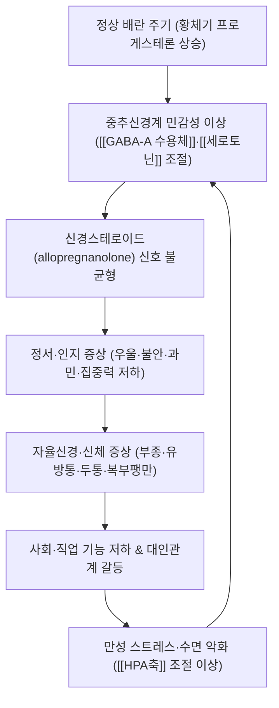

# 🩺 [[월경전불쾌장애]] (Premenstrual Dysphoric Disorder / 月經前不快障礙, ICD-10-CM F32.81 · ICD-10 N94.3)

> **핵심 3줄 요약 (Key Summary)**:
> - 📍 병소 부위 & 해부·병태생리: 특정 장기가 아니라 **중추신경계–시상하부–뇌하수체–난소축(HPG axis)** 전체의 조절 이상이다. [[편도체]], [[전전두엽]], [[해마]] 등 정서 조절 회로가 정상적인 황체기 스테로이드 변동에 **비정상적으로 과민 반응**하고, [[GABA-A 수용체]]를 통한 신경스테로이드(allopregnanolone) 신호와 [[세로토닌]] 조절이 흔들리는 것이 핵심 축이다. 즉 "호르몬 수치의 이상"이 아니라 **"정상 호르몬 변동에 대한 뇌의 민감성 이상"**이다.
> - 🚩 전형적 임상 양상 & 3대 징후: ① 황체기 후반에 나타나는 **현저한 정서 불안정·과민·분노**, ② **우울·불안·절망감**, ③ **집중력 저하·무기력·식욕/수면 변화**에 유방통·복부팽만·부종·두통 등의 신체 증상이 동반된다. 결정적 특징은 **월경 시작 후 수일 내 급격한 호전과 난포기의 무증상기(증상 소실)**, 즉 명확한 **주기성**이다.
> - 🛠️ 핵심 감별 검사 & 한·양방 다각적 치료 전략: **[[DRSP]](Daily Record of Severity of Problems) 2주기 이상 전향적 일일 기록**이 진단의 표준이며, TSH·CBC 등으로 [[갑상선기능저하증]], 빈혈, 기분장애를 배제한다([[PHQ-9]], [[GAD-7]] 선별). 양방은 [[SSRI]](황체기 한정 또는 지속 투여), drospirenone 함유 [[복합경구피임제]], [[GnRH 작용제]], [[CBT]], NSAIDs·칼슘 보충 등이 근간이고, 한방은 **월경주기 단계별(주기요법) 침·약침·이침·한약(加味逍遙散, 當歸芍藥散, 歸脾湯 등)** 을 결합하는 통합 프로토콜을 적용한다.
> - ⚠️ 응급 의뢰 레드플래그 & 악화 요인: **자살 사고·계획·의도(즉시 정신건강의학과 의뢰)**, 정신병적 증상, 심한 기능 붕괴, 급격한 체중 변화·월경 소실. 또한 **복합경구피임제 사용 시 흡연 + 35세 이상, 편두통(aura 동반)** 은 혈전·뇌졸중 위험으로 금기이므로 반드시 확인. 임신 가능성이 있으면 복부·요천부 강자극 수기 및 특정 한약(活血化瘀劑)은 금기.

---

## 📌 목차
1. [질환 개요 & 해부학적 병태생리](#1-질환-개요--해부학적-병태생리)
2. [병태생리 메커니즘 & 생체역학적 악순환 네트워크](#2-병태생리-메커니즘--생체역학적-악순환-네트워크)
3. [임상 증상 & 이학적 검사(Physical Exam) 알고리즘](#3-임상-증상--이학적-검사physical-exam-알고리즘)
4. [감별 진단 매트릭스 (Differential Diagnosis)](#4-감별-진단-매트릭스-differential-diagnosis)
5. [한의 통합 치료 프로토콜 (침·약침·추나·한약)](#5-한의-통합-치료-프로토콜-침약침추나한약)
6. [재활 운동 & 생활습관 티칭 가이드](#6-재활-운동--생활습관-티칭-가이드)
7. [💡 사용자 진료실 핵심 필기 & 임상 노하우 (Melt-In 잔여 심화 집약)](#7--사용자-진료실-핵심-필기--임상-노하우-melt-in-잔여-심화-집약)
8. [출처 및 학술 참고 문헌 (References)](#8-출처-및-학술-참고-문헌-references)

---

## 1. 질환 개요 & 해부학적 병태생리

* **질환 정의 및 분류**:
  * **정의**: [[월경전불쾌장애]](PMDD)는 월경 주기의 **황체기(luteal phase)** 에 반복적으로 출현하는 정서·인지·신체 증상이, **월경 시작 후 수일 내에 호전**되고 **난포기에는 증상이 최소화되거나 소실**되며, 그로 인해 사회·직업·대인관계 기능에 뚜렷한 손상이 초래되는 질환이다. 즉 "증상의 강도"보다 **"증상의 주기성과 기능 손상"** 이 진단의 본질이다.
  * **분류 위치**: DSM-5에서 [[월경전불쾌장애]]는 우울장애 항목 내 **독립 진단명**으로 편입되었고, ICD-10-CM에서 **F32.81**로 부호화된다. 반면 월경전긴장증후군(PMS)에 해당하는 부인과 코드는 **N94.3**이다. 국내 KCD 세부 코드 적용 및 청구 기준은 요양기관 지침 확인이 필요하다(**근거 미확인**).
  * **PMS와의 구분**: [[월경전증후군]](PMS)은 신체 증상 위주이고 기능 손상이 상대적으로 경미하며, PMDD는 **정서 증상이 우세하고 기능 손상이 현저**하다. 두 질환은 스펙트럼으로 이해하는 편이 임상적으로 유용하다(참고문헌 2, 3).
  * **역학**: 가임기 여성에서 발생하며 초경 이후~폐경 전까지 나타난다. PMDD 유병률은 대략 **3~8%** 범위로 보고되나 진단 기준·평가 도구에 따라 편차가 크고(참고문헌 4), PMS는 이보다 훨씬 흔하여 가임기 여성의 상당수(약 20~30% 수준으로 인용되나 출처별 편차가 큼 → **근거 미확인**)가 호소한다. 최고 호발 연령대는 대개 20~40대이다.
  * **위험 요인**: 과거 또는 현재의 우울·불안장애, 산후 우울증 병력, PMS/PMDD 가족력, 흡연, 만성 스트레스, 낮은 사회적 지지, 수면 부족 등이 위험 요인으로 논의된다(참고문헌 2, 4). 다만 개별 위험요인의 기여도(오즈비 등) 수치는 본 노트에서 인용한 문헌 범위 내에서 **확인 불가**하다.

* **관련 해부학적 구조물 (중추·내분비 축 중심)**:
  * **중추 정서 조절 회로**: [[편도체]](위협·불안 반응), [[전전두엽]](정서 조절·충동 억제), [[해마]](스트레스 반응·기억). 황체기 스테로이드 변동기에 이 회로의 활성 패턴이 달라진다는 기능적 영상 연구들이 보고되어 왔으며, PMDD 환자에서 정상 대조군과 다른 반응 양상을 보인다는 연구가 축적되어 있다(참고문헌 4).
  * **[[시상하부]]–[[뇌하수체]]–[[난소]]축(HPG axis)**: **정상적인 배란 주기 자체가 증상 발현의 필수 조건**이다. 즉 무배란 상태에서는 증상이 나타나지 않으며, 배란을 억제하면 증상이 소실된다. 이는 GnRH 작용제(GnRH agonist)가 치료 전략으로 쓰이는 직접적 근거가 된다(참고문헌 1, 3).
  * **[[GABA-A 수용체]] 및 신경스테로이드**: 프로게스테론의 대사산물인 **allopregnanolone**은 GABA-A 수용체의 양성 조절제로 작용한다. PMDD에서는 이 신경스테로이드에 대한 중추의 반응 민감도가 달라졌다는 가설이 핵심 병태생리로 제시된다(참고문헌 1, 4).
  * **[[세로토닌]]계**: SSRI가 **황체기에만 단기 투여해도 수일 내 효과**를 보인다는 임상 관찰은 세로토닌계 조절 이상을 뒷받침한다(참고문헌 3, 4).
  * **말초·자율신경**: 유방통, 복부팽만, 말초 부종, 두통 등은 수분·전해질 균형, 프로스타글란딘, 자율신경 긴장도 변동과 연관되어 설명된다(참고문헌 2, 3).

---

## 2. 병태생리 메커니즘 & 생체역학적 악순환 네트워크

### 1) 신경스테로이드 및 GABA-A 수용체 민감성 가설
* 정상 여성에서도 황체기에는 프로게스테론과 그 대사산물이 크게 증가한다. PMDD의 핵심은 **호르몬 농도 자체의 이상이 아니라**, 이 변동에 대한 중추신경계의 **반응성·적응(민감도) 이상**이라는 점이다. 이는 "정상 농도의 호르몬을 투여해도 증상이 재현되는가"를 보는 실험적 연구 설계의 근거가 된다(참고문헌 1, 4).
* allopregnanolone의 GABA-A 수용체 작용이 정상적으로는 진정·항불안 방향으로 작용하는데, PMDD에서는 이 신호의 **방향성 또는 시기적 적합성**이 어긋난다는 가설이 제시된다. 다만 개별 수용체 아형·대사 경로의 확정적 결론은 **근거 미확인** 상태이다.

### 2) 세로토닌계 조절 이상
* SSRI가 월경 전 황체기에만 단기간 투여되어도 증상 개선이 비교적 빠르게 나타나는 점은, PMDD의 정서 증상이 세로토닌 신경전달의 **주기적 변동 취약성**과 연결됨을 시사한다(참고문헌 3, 4). 이는 [[주요우울장애]]에서 요구되는 수주간의 항우울 효과 지연과 대비되는 PMDD만의 특징적 치료 반응이다.

### 3) HPA축·자율신경 및 신체 증상
* 만성 스트레스는 [[HPA축]] 조절을 흔들고, 이것이 다시 정서 증상 민감성을 높이는 **양방향 되먹임**을 형성한다. 신체 증상(부종·유방통·팽만·두통)은 프로스타글란딘 및 수분·염분 이동, 자율신경 긴장도 변동 등 복합 기전으로 설명되며, NSAIDs가 신체 증상에 일부 도움이 된다는 임상 관찰과 연결된다(참고문헌 3).

### 4) 악순환 구조와 만성화
* **주기성 증상 → 기능 저하 → 대인 갈등·자기비난 → 스트레스·수면 악화 → 중추 민감성 상승 → 다음 주기 증상 악화**의 고리가 형성된다. 따라서 치료는 "증상기 진정"만으로는 불충분하고, **비증상기(난포기)에 취약성을 낮추는 개입**(규칙적 수면, 유산소 운동, 인지행동치료, 주기요법 한방 치료)이 재발 방지의 핵심이 된다.

---

## 3. 임상 증상 & 이학적 검사(Physical Exam) 알고리즘

### 1) 주소증 및 증상군
* **정서·인지 증상 (핵심 A 증상군, 최소 1개 필수)**:
  * 현저한 **우울감·절망감·자기비하**.
  * **불안·긴장·초조**, "속이 조여드는" 느낌.
  * **정서 불안정**(갑작스러운 슬픔, 눈물, 예민함).
  * **분노·과민·대인 갈등 증가** — 배우자·자녀·동료와의 다툼이 황체기에 반복되는 패턴은 매우 특징적 소견이다.
* **동반 증상 (총 5개 이상 충족 시 진단적)**:
  * 집중력 저하, 무기력·피로감, **식욕 변화(과식·특정 음식 갈망)**, **수면 변화(불면 또는 과다수면)**, **압도감·통제 불능감**, 신체 증상(유방압통, 관절·근육통, 복부팽만, 체중 증가, 두통).
* **자율신경·혈관 증상**: 말초 부종, 유방 팽만감, 하복부 팽만, 일시적 체중 증가(1~2 kg 수준으로 호소되는 경우가 많으나 개인차가 크고 수치의 문헌적 근거는 **부분 확인**).
* **기능 손상**: 학업·업무 수행 저하, 결석·결근, 육아·가사 수행 곤란, 관계 갈등. DSM-5에서는 **현저한 기능 손상**이 진단 요건이다.

### 2) 진단 알고리즘 (DSM-5 요약)
| 항목 | 내용 |
| :--- | :--- |
| A | 황체기 마지막 주에 증상 출현 → 월경 시작 후 수일 내 호전 → 월경 후 1주에는 최소화/소실 |
| B | 다음 중 **최소 1개**: 우울·절망감 / 불안·긴장 / 정서 불안정 / 분노·과민·대인갈등 |
| C | B에 더해 총 **5개 이상**: 집중력 저하, 무기력, 식욕 변화, 수면 변화, 압도감, 신체 증상 |
| D | 사회·직업·학업 기능의 **현저한 손상** |
| E | 다른 정신질환의 단순 악화가 아님 (월경전 악화 PME는 별도 기재) |
| F | **최소 2회 연속 주기**의 **전향적 일일 기록**으로 확인 |
| G | 갑상선 질환 등 신체질환·약물로 설명되지 않음 |

### 3) 필수 이학적 검사법 (Physical Examination)
* **[[DRSP]](Daily Record of Severity of Problems) 전향적 일일 기록**: PMDD 진단의 **표준 도구**. 최소 2개 주기 동안 매일 증상 강도를 기록하게 하여 ① 황체기 상승, ② 월경 후 하강의 주기성을 객관적으로 확인한다. 후향적 문진만으로는 과대 또는 과소 보고가 흔하므로 반드시 전향적 기록을 확보한다(참고문헌 2, 3).
* **[[기초체온표]](BBT) 또는 배란 확인**: 배란성 주기임을 확인하고 무배란성 출혈·폐경 이행기 감별에 활용. 황체기 프로게스테론 측정은 선택적으로 시행한다.
* **신체 검진**: 활력징후, 갑상선 촉진(갑상선종·압통), 유방 촉진(유방통의 국소 병변 감별), 복부 및 골반 검진, 필요 시 부인과 초음파.
* **검사실 검사**: TSH, CBC, 필요 시 임신 검사·기본 생화학. **갑상선기능저하증과 빈혈은 PMDD와 증상이 겹치므로 반드시 배제**한다(참고문헌 3).
* **정신건강 선별**: [[PHQ-9]], [[GAD-7]]로 우울·불안 중증도 평가, **자살 사고 선별은 모든 내원 시 필수**.
* **감별을 위한 핵심 질문**: "증상이 월경 전에만 나타나고 월경이 시작되면 확실히 좋아집니까?" / "지난 3개월 중 증상이 없는 시기가 있었습니까?" — 이 두 질문이 주기성 확인의 1차 관문이다.

---

## 4. 감별 진단 매트릭스 (Differential Diagnosis)

| 감별 질환 | 호발 병소 및 원인 | 주소증 차이점 | 특이적 이학적 검사 소견 |
| :--- | :--- | :--- | :--- |
| [[월경전불쾌장애]] (본 질환) | 중추–HPG축 민감성 이상 (정상 배란 주기 의존) | **황체기에만** 정서·인지 증상 우세, 난포기 무증상, 기능 손상 현저 | **[[DRSP]] 2주기**: 황체기 상승·월경 후 하강 패턴 명확 |
| [[월경전증후군]] (PMS) | 동일 축, 경도 | 신체 증상 위주, 기능 손상 경미, 정서 증상 총 5개 미만 | DRSP상 주기성은 있으나 증상 개수·강도 기준 미충족 |
| [[주요우울장애]] / [[지속성 우울장애]] | 중추 단가아민계 | **월경주기와 무관하게 지속**. 무쾌감·체중/수면 변화가 상시적 | DRSP에서 주기성 패턴 **소실**, PHQ-9 상시 고점 |
| [[범불안장애]] / [[공황장애]] | 중추 불안 회로 | 만성적 과잉 걱정·발작이 주기와 무관. 황체기 악화만 동반 가능 | GAD-7 상시 상승, 주기성 없음 (**PME 감별 필요**) |
| [[갑상선기능저하증]] | 갑상선 | 피로·우울·부종·체중 증가·과다수면 — **증상이 매우 유사** | **TSH 상승**, 갑상선 촉진 이상, 주기성 없음 |
| [[폐경]] 이행기 / [[폐경전후증후군]] | 난소 기능 저하 | 혈관운동 증상(홍조·발한) 동반, 주기 불규칙 | FSH 상승, 주기 불규칙, DRSP 주기성 소실 |
| 월경전 악화(Premenstrual Exacerbation, PME) | 기존 정신질환의 주기적 악화 | 기존 진단(우울·불안·ADHD 등)이 황체기에 **악화**될 뿐, PMDD 기준을 독립적으로 충족하지 않음 | 기존 질환 평가척도가 황체기에 상승하나, PMDD 진단 기준 미충족 |

> [!TIP]
> **감별의 핵심 원칙**: ① "주기성이 있는가?"(DRSP) → ② "월경주기와 무관한 기저 질환이 있는가?"(PHQ-9/GAD-7/TSH) → ③ "기존 질환의 주기적 악화(PME)인가, 독립된 PMDD인가?" 순서로 좁혀 나간다. ①~③을 모두 통과해야 PMDD 진단이 선다.

---

## 5. 한의 통합 치료 프로토콜 (침·약침·추나·한약)

> [!NOTE]
> 아래 한의 치료 내용은 **전통 한의학적 변증 체계와 임상 경험에 기반한 접근**이며, PMDD를 대상으로 한 대규모 무작위 대조 연구 근거는 본 노트에서 확인된 문헌 범위 내에서 **확인되지 않음(근거 미확인)**. 양방 표준치료(SSRI, COC, GnRH 작용제, CBT)를 **대체하지 않고 병행**하는 전제로 적용하고, 환자에게 근거 수준을 투명하게 설명한다.

* **침구 치료 (Acupuncture)**:
  * **주기요법(週期療法)** 개념 적용: 난포기에는 **기혈 보충·간신 조정**, 배란기~황체기 전반에는 **소간이기(疏肝理氣)·활혈조경(活血調經)**, 황체기 후반(증상기)에는 **안신정지(安神定志)·평간잠양(平肝潛陽)** 중심으로 자극 강도를 조절한다.
  * **주요 혈위**: [[태충]](LR3, 소간이기·평간), [[삼음교]](SP6, 간·비·신 삼음교회), [[관원]](CV4)·[[기해]](CV6, 충임맥 조정), [[혈해]](SP10, 활혈), [[족삼리]](ST36, 기혈 보충), [[신문]](HT7)·[[내관]](PC6, 안신·자율신경 안정), [[백회]](GV20)·[[사신총]](EX-HN1, 정신 안정·우울 개선), 배수혈로 [[간수]](BL18)·[[신수]](BL23)·[[격수]](BL17) 활용.
  * **전침 세팅**: 2~10 Hz 저주파 중심(자율신경 안정 목적), 또는 2/100 Hz 교대 자극. 강자극보다 **편안한 자극량(得氣 위주)** 이 안신 목적에 부합하며, 황체기 후반에는 자극량을 낮춘다. 시술 시간 15~25분.
  * **이침(耳鍼)**: 神門, 交感, 內分泌, 肝, 腎, 子宮 대응점 — 자율신경·정서 안정 목적으로 유지형 피내침 또는 압환 활용.
* **약침 치료 (Pharmacopuncture)**:
  * **작용 목표**: ① 소간해울(疏肝解鬱) — 정서 긴장 완화, ② 활혈조경(活血調經) — 골반·하복부 순환 개선, ③ 안신(安神) — 수면·불안 조절.
  * **자주 활용되는 약재류**: 當歸, 丹蔘, 香附子, 紅花, 柴胡 계열 및 加味逍遙散 약침 등. **약침별 PMDD 적응증과 용량·주입 깊이의 근거는 개별 연구가 부족하여 근거 미확인**이며, 자침 부위(혈위) 주입은 통상 2~5 mm 깊이, 소량(0.1~0.5 mL/점)으로 시행한다.
  * **주의**: 임신 가능성, 항응고제 복용, 출혈성 경향, 주사 부위 감염이 있으면 금기 또는 신중 적용.
* **추나 치료 (Chuna Manipulation)**:
  * PMDD에서는 척추 교정 자체가 주 치료가 아니라, **자율신경 안정과 이완을 위한 보조 수기**로 접근한다.
  * **적용**: 흉요추부 근막 이완(JS 계열 수기), 천골·골반 주위 이완, 경추 상부(후두하근) 이완, **횡격막·복직근 호흡 유도(복식호흡 유도 수기)** 로 자율신경 긴장을 낮춘다.
  * **금기·주의 수기**: 임신 가능성 또는 임신 중 **복부·요천부 강자극 및 강한 회전 도수**, 급성 감염, 중증 골다공증, 최근 외상, 악성종양 부위.
* **한약 치료 (Herbal Medicine)** — 변증별 접근:
  * **肝鬱氣滯(간울기체)**: [[가미소요산]](加味逍遙散), 逍遙散加減, 柴胡桂枝湯 — 월경 전 과민·분노·유방통·복부팽만의 전형적 패턴.
  * **氣滯血瘀(기체혈어)**: 桂枝茯苓丸, 桃紅四物湯加減 — 하복부 통증·혈괴·어혈 소견 동반 시.
  * **氣血兩虛(기혈양허)**: [[귀비탕]](歸脾湯), [[사물탕]](四物湯), 八珍湯 — 무기력·피로·집중력 저하·과다수면 우세 시.
  * **腎陰虛·陰血不足(신음허·음혈부족)**: [[육미지황환]](六味地黃丸) 계열, 二至丸 — 오심번열·불면·조조감 동반 시.
  * **胞宮寒·寒凝血瘀(포궁한·한응혈어)**: [[온경탕]](溫經湯), 當歸芍藥散 — 냉감·하복부 냉통·월경통 동반 시.
  * **복용 타이밍 전략**: 증상기(황체기 후반)에는 안신·소간 위주, 난포기에는 보기혈·조충임 위주로 **월경주기에 맞춘 처방 가감**을 임상적으로 활용한다(전통적 운용 원칙이며, 처방별 RCT 근거는 **근거 미확인**).
  * 참고로 참고문헌 2(일본 리뷰)는 월경전 질환 관리에서 비약물적·보조적 접근을 함께 논의하나, 개별 생약 처방의 유효성 결론은 본 노트에서 **확인 불가**.

---

## 6. 재활 운동 & 생활습관 티칭 가이드

* **유산소 운동(Aerobic Exercise)**:
  * 주 3~5회, 회당 30분 내외(빠르게 걷기, 자전거, 수영, 가벼운 조깅). **난포기부터 꾸준히** 시행하여 황체기 민감성을 낮추는 것이 목표이며, 증상기에는 강도를 낮추되 중단하지 않는다.
  * 근거 수준: 생활습관 개입은 여러 리뷰에서 권고되나, PMDD 대상 고강도 근거는 제한적임을 환자에게 설명한다(참고문헌 3).
* **이완 및 스트레칭 (Stretching / Relaxation)**:
  * 골반·요부·흉곽 이완 스트레칭, 하타 요가, 점진적 근육 이완법(PMR), 복식호흡 4-6 호흡(4초 들이쉬고 6초 내쉬기) 5~10분/일.
  * [[요가]]·[[명상]]·[[마음챙김]]은 불안·스트레스 완화 목적으로 권고되며, 인지행동치료([[CBT]])와 병행 시 효과적이다(참고문헌 4).
* **강화 및 안정화 운동 (Strengthening)**:
  * 심부 코어(복횡근·다열근), 둔부 안정화 근육 중심으로 주 2~3회. 자세 안정화는 통증·피로감 완화에 간접적으로 기여한다.
  * 골반저근 이완·수축 조절 훈련은 골반 긴장·하복부 불편감 완화 보조로 활용 가능(직접 근거는 **근거 미확인**).
* **신경 활주 운동 (Neurodynamics)**:
  * PMDD의 1차 병태생리는 신경 포착이 아니므로 신경 활주 운동의 적응증은 제한적이다. 다만 **동반된 두통·경부 긴장·요부 방사 증상**이 있을 때 좌골신경·경추 신경근 슬라이딩을 보조적으로 적용한다.
* **영양·식이 티칭**:
  * **카페인·알코올·과도한 염분·정제당**은 황체기 불안·부종·수면 악화를 심화시킬 수 있어 감량 권고(참고문헌 3).
  * 칼슘 보충(식이 또는 보충제), 비타민 B6, 서양암나무열매(Vitex agnus-castus) 등이 일부 리뷰에서 보조 요법으로 언급되나, **효과 크기와 최적 용량은 문헌별 편차가 있어 근거 미확인/제한적**으로 설명한다(참고문헌 3).
  * 규칙적인 식사 시각과 혈당 안정(복합 탄수화물·단백질 조합)이 황체기 식욕 변동 완화에 도움이 된다.
* **수면 위생 & 일상생활(Ergonomics)**:
  * 기상·취침 시각 고정, 취침 1시간 전 스크린 차단, 낮잠 20분 이내.
  * 업무는 **난포기(정상 컨디션기)에 고난도 업무·발표·중요 협의를 배치**하고, 황체기에는 일정 밀도를 낮추는 **주기 기반 스케줄링(cycle-based planning)** 을 권장 — 자각 증상 관리에 실질적 도움이 된다.
  * 필수: **[[DRSP]] 또는 자체 증상 일지**를 계속 기록하여 치료 반응과 악화 요인을 스스로 인식하도록 교육.

---

## 7. 💡 사용자 진료실 핵심 필기 & 임상 노하우 (Melt-In 잔여 심화 집약)

> [!IMPORTANT]
> **🛡️ 원문 융합(Melt-In) 및 7번 섹션 작성 불변 규칙 (CRITICAL)**
> 1. **기존 필기 내용 상부 전면 융합 (Melt-In)**: 질환의 정의, 병태생리, 증상, 진단·이학적 검사, 치료법, 생활 티칭 등 기본 내용은 상부 1~6번 섹션에 이미 100% 녹여내어 고도화하였다.
> 2. **7번 섹션의 차별화된 심화 집약**: 따라서 본 섹션은 상부에 담기 어려운 **진료실 실전 문진·치료 운용·환자 소통의 고유 노하우**만을 엄선하여 집약한다.
> 3. **이미지 관련**: 본 노트에는 제공된 이미지 블록이 없으므로 이미지 임베드를 포함하지 않는다.

* **상부 섹션에 미처 다 담지 못한 고유 원문 필기**:
  * **"증상의 강도"가 아니라 "증상의 달력"을 본다**: PMDD의 진단적 본질은 강도가 아니라 **주기성과 무증상기(난포기)의 존재**다. 환자가 "요즘 계속 힘들다"고 말하면 즉시 **"그런데 컨디션이 완전히 괜찮은 시기가 있었나요?"** 로 되물어 난포기 무증상기를 확인한다. 이 질문 하나가 [[주요우울장애]]와의 감별 방향을 결정한다.
  * **주기성을 놓치는 전형적 함정 2가지**:
    1. 환자가 **피임제·호르몬 제제를 복용 중**이면 주기가 인위적으로 조정되어 DRSP 패턴이 흐려진다 → 약물력 확인이 최우선.
    2. **과다수면형·식욕항진형**은 "우울증 같지 않다"는 이유로 오래 방치된다 → 비정형 증상 우세형도 PMDD의 전형적 표현임을 기억한다.
  * **PME(월경전 악화) 감별의 임상적 요령**: 기존 우울·불안·ADHD 진단 환자가 "월경 전에만 심해진다"고 하면, PMDD 기준(총 5개 증상 + 기능 손상)을 **독립적으로** 충족하는지 따로 세어본다. 충족하면 PMDD 병기, 미충족이면 PME로 기재하여 치료 초점을 기존 질환 조절로 둔다.

* **진료실 실전 감별 & 치료 노하우**:
  * **1. 실전 문진 체크리스트 (내원 5분 내 확보할 5문항)**:
    * ① 증상은 월경 **며칠 전** 시작해 **며칠째** 사라지는가? (황체기 후반~월경 1~3일 내 호전 여부)
    * ② **증상이 없는 주(난포기)** 가 분명히 존재하는가?
    * ③ 정서 증상(우울·불안·과민·분노)과 신체 증상(유방통·팽만·부종·두통) 중 **어느 쪽이 우세**한가?
    * ④ **자살 사고**가 있었는가, 있다면 어느 시기인가? (증상기에 집중되는지 확인 — 즉시 위험도 평가)
    * ⑤ 호르몬제·항우울제·항응고제 복용력 및 **임신 가능성**, 흡연 여부(35세 이상 여부 포함).
  * **2. 치료 순서 및 손맛 노하우**:
    * **치료 순서 원칙**: ① 안신(신문·내관·백회) → ② 소간이기(태충) → ③ 조충임(삼음교·관원·기해) → ④ 배수혈(간수·신수) 순으로 자침하면 환자가 **자극에 대한 긴장 반응 없이** 이완 상태로 들어가 전침을 편안하게 유지한다.
    * **황체기 후반(증상기)** 에는 자극량을 **평소의 70% 수준**으로 낮추고 유침 중 조용한 환경·조명을 유지한다. 강자극·다혈위 시술은 오히려 초조감을 유발할 수 있다.
    * **약침**은 자침 후 이완이 충분히 된 상태에서 시행하고, 복부 혈위는 **배꼽 주위 2 cm 이상 이격**하여 천자한다. 임신 가능성 환자에서는 복부·요천부 시술을 원칙적으로 보류한다.
    * **추나/수기**는 증상기에 **흉요추 이완 + 복식호흡 유도**만 짧게 적용하고, 강한 교정 도수는 난포기로 미룬다. 이 "시기 조절"이 환자 만족도와 안전성 양쪽에서 유리하다.
    * **한약 복용 타이밍 티칭**: "월경 예정일 **10일 전부터 시작**해서 월경 시작 후 2~3일까지" 처방을 복용하도록 안내하면 환자가 스스로 주기에 맞춰 관리할 수 있어 순응도가 높아진다. 난포기에는 보기혈 처방으로 전환한다.
  * **3. 환자 티칭 스크립트 (재발 방지 설명 멘트)**:
    * *병태생리 설명*: "이건 호르몬이 **이상**해서가 아니라, 정상적으로 올라가는 호르몬 변화에 **뇌가 예민하게 반응**해서 생기는 겁니다. 그래서 호르몬 검사가 정상으로 나오는 경우가 대부분입니다."
    * *주기성 설명*: "증상이 **월경 전에만** 올라오고 월경이 시작되면 확 빠지는 게 이 질환의 가장 중요한 특징입니다. 그래서 **매일 체크표**를 써 오시는 게 진단의 핵심입니다."
    * *생활 티칭*: "지난 2주는 잘 지내다가 이 1주에만 무너지시죠? 그러면 **중요한 약속·발표는 난포기(월경 끝난 직후)에 배치**하시고, 이 1주는 일정을 비워두세요. 운동은 끊지 말고 강도만 낮추세요."
    * *자살 사고 선별*: "힘드실 때 **사라지고 싶다**는 생각이 드신 적 있으세요? 그런 생각이 드는 시기가 월경 전에 몰려 있나요?" → 긍정 시 즉시 정신건강의학과 협진 의뢰.
    * *치료 기대치 설정*: "한방 치료는 증상기 완화와 함께 **다음 주기 민감도를 낮추는 것**이 목표입니다. 최소 **2~3주기**는 지켜봐야 변화를 판단할 수 있습니다."
  * **4. 협진·의뢰 기준 (실전 판단)**:
    * **즉시 의뢰**: 자살 사고·계획, 정신병적 증상, 심한 기능 붕괴, 급격한 체중 감소·무월경.
    * **선택 의뢰**: SSRI/GnRH 작용제 등 약물 조정 필요 시, TSH 이상 소견 시 내분비/내과, 골반 병변 의심 시 산부인과.
    * **금기 확인의 우선순위**: ① 임신 가능성 → ② 항응고제·출혈 경향 → ③ 복합경구피임제 금기(흡연+35세 이상, aura 동반 편두통) → ④ 정신과 약물 상호작용.

---

## 8. 출처 및 학술 참고 문헌 (References)

> [!NOTE]
> 제공된 PubMed 데이터 기준으로 **중복 문헌(1=5, 2=6)을 통합**하여 정리하였다. 아래 4편 외의 문헌·수치는 본 노트에 인용하지 않았으며, 확인되지 않은 내용은 본문에 "근거 미확인"으로 명시하였다.

1. **Haußmann J, Goeckenjan M (2024)**. *[Premenstrual syndrome and premenstrual dysphoric disorder — Overview on pathophysiology, diagnostics and treatment]*. **Nervenarzt**. **PMID: 38393358**
   - **[연구 요약]**: 월경전증후군과 PMDD의 **병태생리·진단·치료를 개괄한 종설**. 정상 배란 주기에 대한 중추신경계의 민감성 이상, 신경스테로이드 및 GABA-A 수용체 관련 가설, 황체기 한정 SSRI 투여, 배란 억제(GnRH 작용제 등) 전략 등이 논의된다. 본 노트의 2번 섹션(병태생리)과 5번 섹션(치료 전략) 서술의 주요 근거로 인용하였다.

2. **Takeda T (2023)**. *Premenstrual disorders: Premenstrual syndrome and premenstrual dysphoric disorder*. **J Obstet Gynaecol Res**. **PMID: 36317488**
   - **[연구 요약]**: **PMS와 PMDD를 함께 다룬 리뷰**로, 진단적 접근(증상 일지·전향적 평가)과 치료 옵션 전반을 정리한다. PMS와 PMDD를 스펙트럼으로 이해하는 관점, 증상 평가 도구의 필요성, 비약물적·보조적 접근을 논의한다. 본 노트 1·3번 섹션(PMS/PMDD 구분, 진단 알고리즘)의 근거로 인용하였다. 개별 생약 처방의 유효성 결론은 본 노트에서 확인하지 못하였다.

3. **Hofmeister S, Bodden S (2016)**. *Premenstrual Syndrome and Premenstrual Dysphoric Disorder*. **Am Fam Physician**. **PMID: 27479626**
   - **[연구 요약]**: 일차진료 관점의 **실용적 진단·치료 지침 리뷰**. 전향적 증상 기록을 통한 진단적 확인, 갑상선질환 등 신체질환 배제, SSRI 및 호르몬 요법, NSAIDs·칼슘 등 보조요법, 생활습관 중재를 다룬다. 본 노트 3번 섹션(검사실 배제 검사)과 5·6번 섹션(치료·생활 티칭)의 근거로 인용하였다.

4. **Hantsoo L, Epperson CN (2015)**. *Premenstrual Dysphoric Disorder: Epidemiology and Treatment*. **Curr Psychiatry Rep**. **PMID: 26377947**
   - **[연구 요약]**: PMDD의 **역학과 치료를 정신의학적 관점에서 정리한 리뷰**. 유병률 범위(대략 3~8% 수준으로 보고), 황체기 한정 SSRI 투여의 빠른 반응, 인지행동치료 등 심리사회적 개입, 신경영상·신경스테로이드 연구 방향을 논의한다. 본 노트 1번 섹션(역학)과 2·6번 섹션(세로토닌 가설, CBT)의 근거로 인용하였다.

---

> [!WARNING]
> **본 노트의 한계 및 근거 수준 안내**
> - PMDD의 유병률·위험요인 수치, 개별 한약 처방 및 약침의 유효성, 영양 보충제의 최적 용량은 **인용 문헌 범위 내에서 확인되지 않았거나 출처별 편차가 큰 항목**이며, 해당 부분은 본문에 "근거 미확인"으로 표시하였다.
> - 한의 치료 프로토콜은 **전통적 변증 체계와 임상 경험에 기반한 접근**으로, 양방 표준치료를 대체하지 않는다. **자살 사고·정신병적 증상·심한 기능 손상은 즉시 전문의 협진 대상**이다.