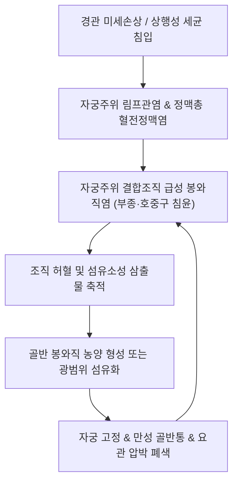

# 🩺 자궁주위염 (Parametritis / Pelvic Cellulitis, N73.0 / N73.1)

> **핵심 3줄 요약 (Key Summary)**:
> - 📍 **병소 부위 & 병태생리**: 자궁경부 외측 및 자궁 광인대(broad ligament) 엽 사이에 위치한 자궁주위 결합조직(parametrium)과 혈관·림프관망에 발생하는 급만성 봉와직염(pelvic cellulitis). 질·자궁경관을 통한 상행성 세균 감염(클라미디아, 임균, 혐기성 상재균) 또는 분만·소파술·부인과 수술 후 림프관 전파가 주원인.
> - 🚩 **전형적 임상 양상**: 하복부 심부 및 골반강의 지속적인 박동성 둔통, 발열(>38.0°C) 및 오한, 악취를 동반한 화농성 질 분비물, 양손 골반 진찰(Bimanual exam) 시 현저한 자궁경부 거상통(Chandelier sign) 및 자궁 측방 조직의 단단한 경결·압통.
> - 🛠️ **핵심 감별 & 한·양방 치료 전략**: 난관난소농양(TOA), 충수돌기염, 자궁내막증 감별. 급성기 광범위 정맥 항생제 요법(Ceftriaxone + Doxycycline + Metronidazole). 아급성·만성기 골반 유착 및 염증 산물 흡수를 위한 한의 청열해독·활혈거어 침구치료([[중극]], [[관원]], [[삼음교]], [[자궁혈]]), [[신바로약침]]/황련해독탕 약침, **계지복령환**·**청간지위탕** 투여.
> - ⚠️ **응급 의뢰 레드플래그**: 패혈성 쇼크 징후(지속되는 고열, 저혈압, 빈맥, 의식 변화), 골반 내 농양 파열에 따른 범발성 복막염 소견(판자벽 복부, 반발통), 복강 내 대량 출혈 의심 징후.

---

## 📌 목차
1. [질환 개요 & 병태생리 (Disease Overview)](#1-질환-개요--병태생리-disease-overview)
2. [병태생리 메커니즘 & 대사·장기부전 악순환 네트워크](#2-병태생리-메커니즘--대사장기부전-악순환-네트워크)
3. [임상 증상 & 환자 소견 (Clinical Presentation)](#3-임상-증상--환자-소견-clinical-presentation)
4. [감별 진단 매트릭스 (Differential Diagnosis)](#4-감별-진단-매트릭스-differential-diagnosis)
5. [한의 통합 치료 프로토콜 (침·약침·한약)](#5-한의-통합-치료-프로토콜-침약침한약)
6. [양방 치료 & 병용·의뢰 기준 (Conventional Treatment & Referral)](#6-양방-치료--병용의뢰-기준-conventional-treatment--referral)
7. [식이·생활습관 & 자가관리 티칭 가이드](#7-식이생활습관--자가관리-티칭-가이드)
8. [💡 진료실 핵심 필기 & 임상 노하우](#8--진료실-핵심-필기--임상-노하우)
9. [출처 및 학술 참고 문헌 (References)](#9-출처-및-학술-참고-문헌-references)

---

## 1. 질환 개요 & 병태생리 (Disease Overview)

자궁주위염(Parametritis)은 광의의 골반염증성질환([[골반염]], Pelvic Inflammatory Disease, PID) 스펙트럼 중에서도 자궁 체부와 경부를 둘러싸고 있는 섬유결합조직층인 자궁주위조직(parametrium, 광인대 기저부 및 주임사인대 부위)에 국한되거나 파급된 심부 골반 봉와직염(pelvic cellulitis)을 의미한다.

### 1) 해부학적 구조와 위치
- **자궁주위조직(Parametrium)**:
  - 자궁경부 외측과 질 상부에서 골반 측벽(pelvic sidewall)으로 이어지는 결합조직 및 지방조직 공간.
  - 자궁동맥, 자궁정맥총, 방광·자궁을 연결하는 림프관망, 그리고 자궁경부 외측 약 1.5~2cm 지점을 교차 통과하는 [[요관]](ureter)이 주행하는 해부학적 요충지이다.
- **분류**:
  - **급성 자궁주위염(Acute Parametritis)**: 급격한 세균 감염으로 인한 결합조직의 부종, 호중구 침윤 및 삼출. 치료 지연 시 골반 농양(pelvic phlegmon/abscess) 형성.
  - **만성 자궁주위염(Chronic Parametritis)**: 반복적 감염 후 광인대 및 천골자궁인대의 섬유화와 반흔 구축으로 자궁 위치 고정 및 만성 골반통 유발.

---

## 2. 병태생리 메커니즘 & 대사·장기부전 악순환 네트워크

### 1) 상행성 감염 및 림프성 전파 기전
자궁주위염은 단순 관내 상행 감염(점막 표면을 타고 난관으로 번지는 방식)뿐만 아니라, **자궁경관이나 내막의 미세 열상·손상을 통해 림프관과 정맥총으로 침투하여 주위 결합조직으로 번지는 림프혈행성 전파(lymphovascular spread)**가 핵심 경로이다.
- **원인 병원균**:
  - *Chlamydia trachomatis*, *Neisseria gonorrhoeae* (성 매개 감염).
  - 질 내 혐기성 상재균(*Bacteroides*, *Peptostreptococcus*), *Gardnerella vaginalis*, 장내 세균(*E. coli*), *Streptococcus agalactiae*(GBS).

### 2) 염증 악순환 네트워크

---

## 3. 임상 증상 & 환자 소견 (Clinical Presentation)

### 1) 주요 임상 증상
- **골반강 및 하복부 둔통**: 하복부 한쪽 또는 양쪽 깊은 곳에서 지속되는 박동성의 심한 통증. 보행 시나 배변 시 진동에 의해 악화.
- **전신 감염 징후**: 38°C 이상의 고열, 오한, 전신 쇠약감, 빈맥.
- **이상 질 분비물**: 악취를 풍기는 황록색 화농성 대하(leukorrhea) 또는 불규칙한 질 출혈.
- **방광 및 직장 자극 증상**: 인접한 방광 삼각부 및 직장 압박으로 인한 빈뇨, 배뇨통, 이급후문(tenesmus).

### 2) 진찰 및 이학적 소견
- **양손 골반 진찰 (Bimanual Pelvic Examination)**:
  - **자궁경부 거상통 (Cervical Motion Tenderness, Chandelier Sign)**: 내진 시 자궁경부를 좌우로 움직이면 환자가 깜짝 놀라며 비명을 지를 정도의 극심한 통증.
  - **자궁 부속기 및 자궁 측방 압통 (Adnexal/Parametrial Tenderness)**: 자궁 외측 광인대 부위를 누를 때 판자처럼 단단하게 만져지는 침윤(induration) 및 극심한 압통.
- **혈액 검사 소견**:
  - 백혈구 증다증(WBC > 10,000/μL), ESR 및 CRP의 급격한 상승.

---

## 4. 감별 진단 매트릭스 (Differential Diagnosis)

| 질환 | 주 통증 양상 | 전신 증상 및 검사 소견 | 핵심 감별 검사 |
| :--- | :--- | :--- | :--- |
| **[[자궁주위염]]** | 하복부 심부 지속통, 자궁 측방 침윤 | 고열, 화농성 대하, 자궁경부 거상통 양성 | 양손 골반진찰, 골반 초음파/CT 상 결합조직 부종 |
| **[[난관난소농양]](TOA)** | 하복부 심한 일측/양측통 | 고열, 촉진 시 난관부위에 낭성 종괴 촉지 | 골반 초음파상 복합 낭성 종괴 확인 |
| **급성 충수돌기염** | 명치 통증 후 우하복부(McBurney) 이동 | 식욕부진, 미열, 맥버니 압통 및 반발통 | 복부 CT 상 충수돌기 종대(>6mm) |
| **[[자궁내막증]]** | 만성 생리통, 성교통, 배변통 | 발열 없음, 염증 수치 정상, 만성 경과 | 초음파상 초콜릿 낭종, CA-125 경도 상승 |
| **자궁외임신 파열** | 급작스러운 하복부 칼로 찌르는 통증 | 저혈압, 실신, 빈혈, 복강 내 출혈 | 소변/혈액 hCG 양성, 초음파상 자궁 외 임신낭 |

---

## 5. 한의 통합 치료 프로토콜 (침·약침·한약)

### 1) 침구 치료 (Acupuncture Protocol)
- **주요 혈위**: [[중극]](CV3), [[관원]](CV4), [[기해]](CV6), [[자궁혈]](EX-CA1), [[삼음교]](SP6), [[혈해]](SP10), [[태충]](LR3), [[음릉천]](SP9).
- **자침 기법**:
  - 하복부 복모혈인 [[중극]]·[[관원]]·[[자궁혈]]은 방광을 비운 후 복벽 결합조직 방향으로 0.25×40mm 호침을 사자하여 골반강 내부로 기운이 전도되도록 유도.
  - 만성기 골반강 어혈 정체 시 [[삼음교]]와 [[혈해]]에 평보평사(平補平瀉) 자침.
- **전침 및 뜸 치료**:
  - 급성 염증기 고열 상태에서는 뜸(moxibustion)을 금하며, 아급성기 및 만성기 하복부 냉증과 유착 형성 시 간접구(신궐, 관원) 적용.

### 2) 약침 치료 (Pharmacopuncture Protocol)
- **황련해독탕 약침**:
  - 급성·아급성기 습열하주(濕熱下注) 소견 시 하복부 경혈([[중극]], [[자궁혈]]) 및 천골 부위 [[차료]](BL32)에 0.5~1.0cc 주입하여 국소 염증성 부종 완화.
- **[[신바로약침]] 또는 자하거약침**:
  - 만성 염증 후유증으로 광인대 유착 및 만성 골반통이 지속되는 환자에게 주입하여 조직 재생 및 면역 강화.

### 3) 한약 치료 (Herbal Medicine)
- **급성·아급성기 (습열어결, 열독치성)**:
  - **오미소독음(五味消毒飲)** 합 **대황목단피탕(大黃牡丹皮湯)**: 강력한 청열해독(淸熱解毒), 소종배농(消腫排膿)으로 골반 내 염증 삼출물 흡수 촉진.
  - **청간지위탕(淸肝止萎湯)** 또는 **용담사간탕(龍膽瀉肝湯)**: 대하 황탁, 소변 자통, 간경습열 증상 해소.
- **만성기 (기체혈어, 한습응체)**:
  - **계지복령환(桂枝茯苓丸)** 합 **당귀작약산(當歸芍藥散)**: 골반강 내 혈류 순환 개선, 만성 유착 박리 보조, 하복부 둔통 완화.
  - **소복축어탕(少腹逐瘀湯)**: 생리 시 악화되는 만성 골반 울혈통 치료.

---

## 6. 양방 치료 & 병용·의뢰 기준 (Conventional Treatment & Referral)

### 1) 표준 항생제 요법 (CDC PID 가이드라인 기반)
- **입원 치료 (정맥 주사)**:
  - 고열, 오한, 골반 농양 의심, 경구 투약 불능 시 즉시 입원.
  - **1차 요법**: Ceftriaxone 1g IV q24h + Doxycycline 100mg PO/IV q12h + Metronidazole 500mg IV/PO q12h.
  - 대체 요법: Cefotetan 2g IV q12h 또는 Cefoxitin 2g IV q6h + Doxycycline.
- **외래 치료 (경구 요법)**:
  - 경증~중등도 시 Ceftriaxone 500mg IM 1회 투여 후 Doxycycline 100mg bid + Metronidazole 500mg bid 14일간 연속 복용.

### 2) 한·양방 병용 판단
- 급성 세균성 자궁주위염 단계에서는 **반드시 양방 표준 항생제 치료가 제1선택**이어야 한다. 항생제 치료 없이 한방 단독 치료만을 고집할 경우 불임, 패혈증, 골반 농양으로 악화될 수 있다.
- 항생제 투여 48~72시간 후 열이 내리고 급성 염증 지표가 안정된 후, 잔여 골반 결합조직 침윤과 만성 골반통 예방을 위해 한약(활혈거어제)과 침구 치료를 병용할 때 치료 기간 단축 및 재발률 감소 효과가 우수하다.

### 3) 양방·전문과 응급 의뢰 기준 (Referral Criteria)
- **즉시 응급실 전원 (Red Flags)**:
  - 체온 38.5°C 이상 지속, 수축기 혈압 90mmHg 이하, 맥박수 100회/분 이상의 전신 염증 반응 및 패혈성 쇼크 의심.
  - 복벽 전체에 판자벽 양상의 경직(board-like rigidity)과 반발 압통(Rebound tenderness)이 발생한 경우 (복막염 파급).
  - 경구 항생제 복용 72시간 내에 임상 증상(복통, 발열) 호전이 전혀 없는 경우.

---

## 7. 식이·생활습관 & 자가관리 티칭 가이드

- **성 파트너 동시 검사 및 치료**:
  - 클라미디아 및 임균 감염 예방을 위해 최근 60일 이내의 성 파트너도 반드시 비뇨기과/산부인과 검사 및 동시 치료를 받도록 지도.
  - 치료 완료 및 증상 소실 시까지 성관계 전면 금지.
- **위생 및 휴식**:
  - 질 세정제(douching)의 과도한 사용 금지 (질 내 정상 유산균총 파괴로 상행 감염 촉진).
  - 급성기에는 침상 안정을 취하고 골반강 울혈을 줄이기 위해 반좌위(Semi-Fowler 자세) 유지.

---

## 8. 💡 진료실 핵심 필기 & 임상 노하우

### 1) 진료실 감별 팁: 단순 자궁내막염 vs 자궁주위염
- 자궁내막염(Endometritis)은 주로 자궁 체부 중앙의 통증과 출혈이 주소증이며, 내진 시 자궁 자체를 가볍게 눌렀을 때 아파한다.
- 반면 **자궁주위염(Parametritis)은 자궁 외측의 광인대 부위를 깊숙이 눌렀을 때 골반 벽까지 이어지는 단단한 경결(woody induration)과 함께 극심한 저항통**이 느껴진다. 이때 환자가 허리를 비틀며 피하려 하는 '자궁경부 거상통'이 명확히 나타난다.

### 2) 만성 후유증(골반 유착) 환자의 한의 치료 포인트
- 급성기 항생제 치료를 마친 환자가 수개월 뒤 "밑이 빠질 것 같고 생리 때마다 골반 깊은 곳이 쑤신다"며 내원하는 경우가 많다.
- 이는 염증 후 자궁주위 결합조직에 흉터(fibrotic scar)가 남아 자궁이 후굴(retroversion)된 채 고정되었기 때문이다.
- 이때는 단순 진통제가 아닌 **소복축어탕** 또는 **계지복령환**을 투여하면서 천골 부위 [[차료]](BL32)와 하복부 [[자궁혈]] 전침을 통해 골반 내 미세혈류를 개선해주어야 만성 난치성 골반통이 근본적으로 해소된다.

---

## 9. 출처 및 학술 참고 문헌 (References)

- Li L, Schlewitt J et al. (2026). Pelvic Inflammatory Disease: A Narrative Review of Disparities Between Black and White Women in the United States and Strategies for Improvement. *J Patient Cent Res Rev*. 13(1):14-20. PMID: 42004805

- Curry A, Williams T, Penny ML et al. (2019). Pelvic Inflammatory Disease: Diagnosis, Management, and Prevention. *Am Fam Physician*. 100(6):357-364. PMID: 31524362

- López CC, Villegas-Echeverri JD, De Los Rios JF et al. (2023). Metronidazole for Prevention of Pelvic Cellulitis and Abscess after Laparoscopic Hysterectomy: A Triple-blinded, Randomized, Placebo-controlled Clinical Trial. *J Minim Invasive Gynecol*. 30(11):912-918. PMID: 37463650

---

## 관련 노트

- [[골반염]]
- [[자궁내막염]]
- [[자궁내막증]]
- [[난관난소농양]]
- [[중극]]
- [[관원]]
- [[삼음교]]
- [[신바로약침]]
- [[계지복령환]]
